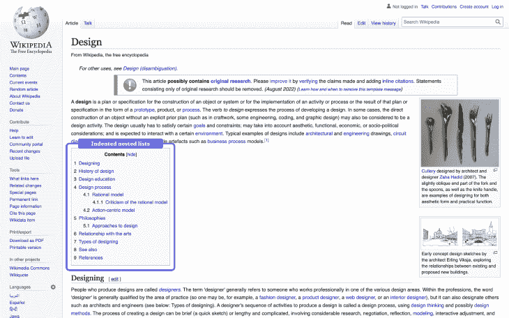
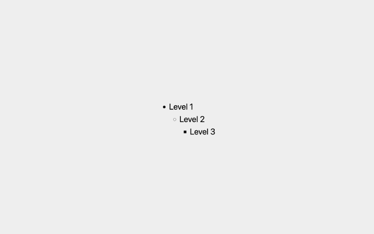
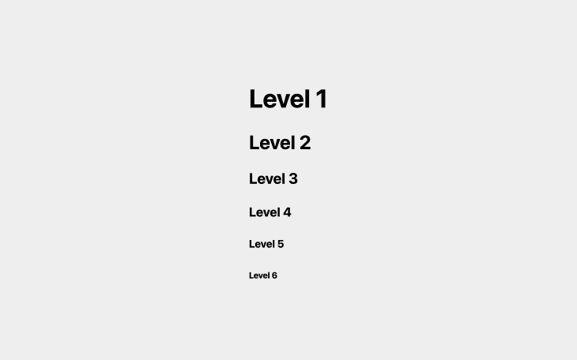
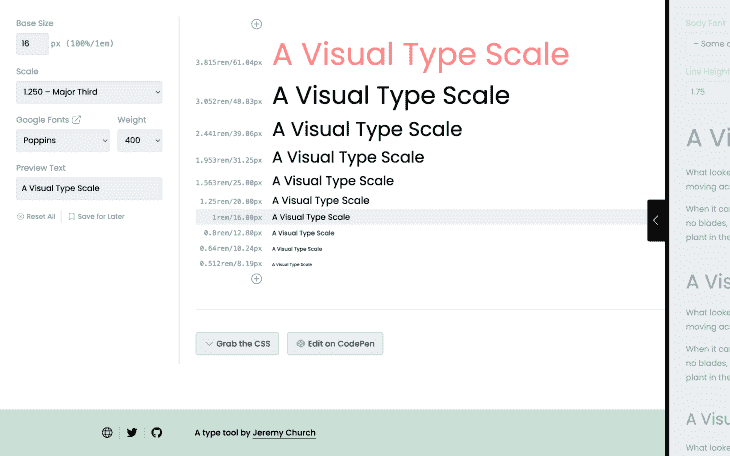
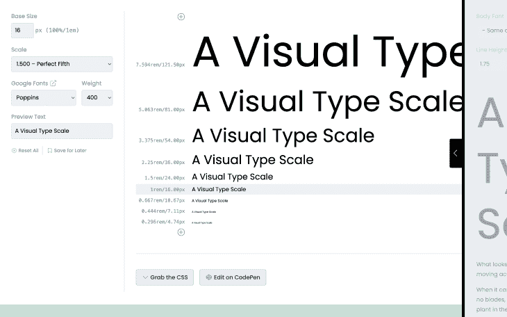
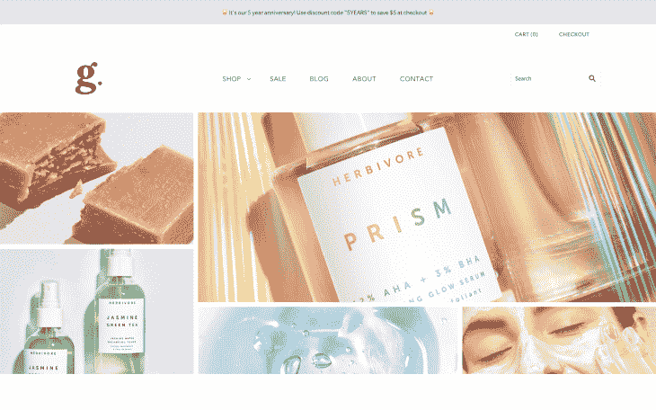
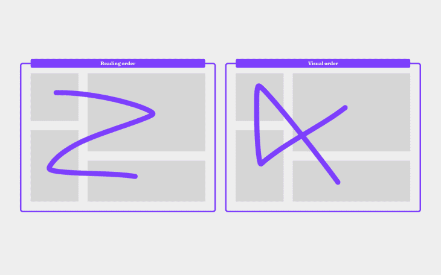
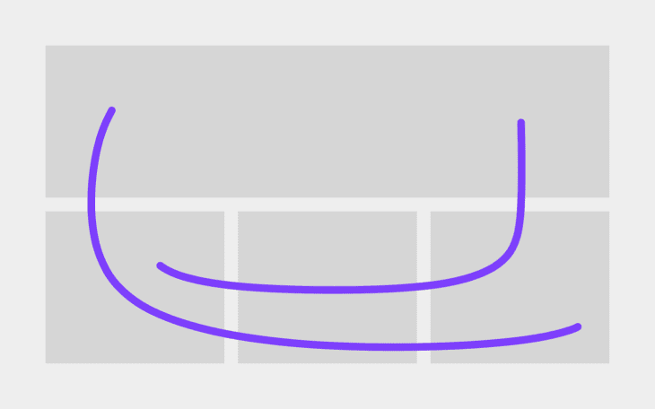
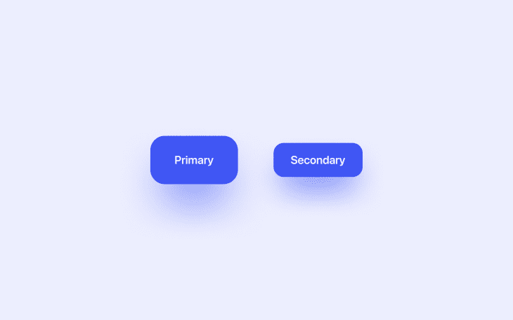
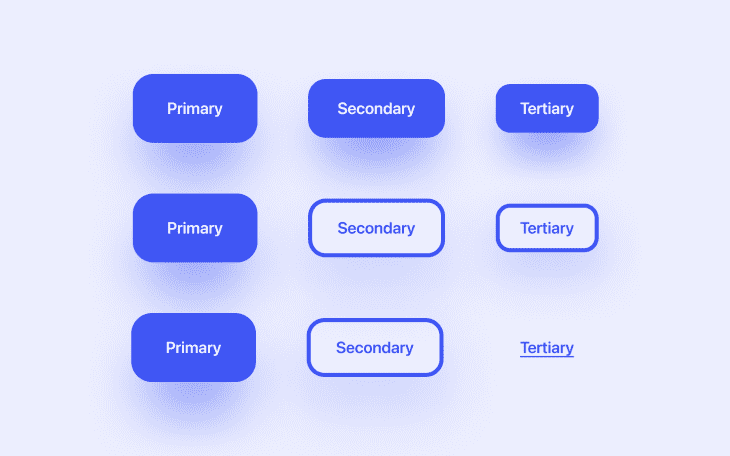

# UX 设计中的视觉层次指南

> 原文：<https://blog.logrocket.com/ux-design/guide-visual-hierarchy/>

视觉层次为页面上的设计元素提供了查看顺序，相关的设计元素(例如，标题、网格项目、按钮等)更是如此。).它还传达了设计元素相对于其他设计元素的重要性。

没有视觉层次，用户很可能不确定该看什么。他们还缺乏理解信息的必要背景，尤其是在信息与其他信息的关系方面。因此，用户可能会发现很难(甚至不可能)完成任务，这就是为什么设计师必须能够在设计中设计出完全可以理解的视觉层次。

在这篇文章中，我们将看看设计中最需要传达视觉层次的方面，以及我们可以做些什么来确保这一点。

## 野外的视觉层次

视觉层次的自然形式存在于自然环境中(即，web 浏览器默认实现它们)。让我们先来看看这些，这样我们可以更好地理解视觉层次在实践中的意义。

### 列表

在 web 上，web 浏览器将开发人员所谓的“供应商风格”应用于列表(即，`<ol>`、`<ul>`、`<dl>`和`<menu>`元素)，这使他们能够直观地传达其开箱即用的层次结构，而开发人员无需做任何事情。具体来说，他们缩进列表，这样当列表嵌套在其他列表中时(例如在目录中)，用户很容易理解不同的点是如何被进一步分解成更小的点的。

就样式而言，除了 web 浏览器已经提供的缩进之外，我们没有什么可以改进列表的视觉层次。也就是说，一个没有被充分使用的视觉模式是为不同的嵌套“级别”使用不同的列表标记——这是一个小的改进，但仍然是一个改进。

Web 浏览器实际上也默认提供了这些列表标记(如下所示)；然而，我不能说它们是有效的。特别是，三级列表项(由方形列表标记符号化)很难表示它们与其二级父项(由圆形列表标记符号化，而不是方形)的关系-方形与圆形完全不同。

更好的方法是使用边框，并逐渐减小每个级别的边框宽度。这样，所有列表标记都具有相同的形状(表明它们是相关的)，并且每个列表项的重要性通过其边框的粗细来传达。

### 标题

标题是视觉层次的另一个自然的例子(至少在网络上是这样)。在网页上，有六个不同的标题级别，`<h1>`是主要/最重要的标题，`<h6>`是最不重要的标题。当然，`<h1>`标题的字体要大一些，而其他级别的字体则逐渐变小。从视觉上看，层次结构如下所示:

然而，您几乎肯定想要覆盖 web 浏览器提供的字体大小。为了创造一种秩序感，通常使用字体标尺，它本质上是一个乘数，根据我们提供的“基础”(或“正文”)字体大小，为不同的标题级别生成不同的字体大小。例如，使用乘数 1.25 的第三种主要字体比例将采用 16px 的基本字体大小(例如)，并使用它为六个标题级别生成以下六种字体大小:

*   底座/机身:16px
*   标题 6: 16 × 1.25 = 20
*   标题 5: 25 × 1.25 = 25
*   标题 4: 25 × 1.25 = 31.25
*   标题 3: 31.25 × 1.25 = 39.0625
*   标题 2: 39.0625 × 1.25 = 48.828125
*   标题 1: 48.828125 × 1.25 = 61.03515625

没有“最佳类型音阶”，只是[尝试不同的类型音阶](https://type-scale.com/)并选择一个感觉适合正在讨论的设计的音阶。值得记住的是，大多数设计不需要超过三级的标题，这提供了使用更激烈的字体比例的机会，如完美五级(1.5 倍)，这导致视觉层次更突出的字体大小差异更大。

有趣的事实:在网络上，标题是网页内容的良好指示器，所以它们对搜索结果有很大的影响。标题具有最大的影响力，因为它们是描述总体主题/目的的主要标题——这是层级在视觉之外发挥重要作用的方式之一。

## 可视化层次结构中的网格

如今一个流行的网页设计趋势(尤其是在电子商务网站上)是用网格来创造。这是因为网络浏览器现在支持现代布局属性，比如那些与 flexbox 和[网格布局](https://blog.logrocket.com/ux-design/ux-grid-system-principles-best-practices/)相关的属性。这些属性使得开发人员可以很容易地将一些网格项目变得更大/跨越多行和/或多列，允许一些非常有创意和美观的布局选项。

我们可以使用大小来使特定的网格项目比其他项目更突出，例如，在电子商务网站的情况下，这对于展示特定的产品或优惠非常有用。在博客上看到这种用户界面模式也并不少见，为新的或受欢迎的文章带来额外的关注。

与列表和标题不同，在这些例子中使用视觉层次纯粹是为了将注意力吸引到感兴趣的特定领域，而不是为了传达特定的信息片段如何与另一个片段相关联。

不过要小心。除了难以适应不同的屏幕尺寸，网格项目的视觉层次还受到“阅读”方向的影响——如果自然阅读方向将用户带到一个方向，而大小调整将他们带到另一个方向，这可能会使用户感到困惑。阅读方向和尺寸应该暗示相同的视觉层次。

我建议记住你的用户的人口统计数据，因为有些人从左到右阅读，其他人从右到左甚至从上到下阅读。考虑到这一点，纵向思考通常是一种更好的、一刀切的方法。

## 视觉层次结构中的按钮

对于网站来说，除了主要的行动呼吁按钮(CTA)之外，还有次要的[行动呼吁按钮(CTA)](https://blog.logrocket.com/ux-design/design-cta-buttons-ux-best-practices/) 按钮，甚至其他不太重要的按钮(或链接)也并不少见。视觉层级在决定众多潜在 CTA 中哪一个最能抓住用户的注意力方面起着关键作用，为了满足业务目标，自然希望主要 CTA 得到最多的关注。

CTA 有更多的样式属性可以定制——一些用于创建视觉层次感的常见属性包括大小、颜色、边框，或者只是将它们设计为链接。尺寸通常是最佳选择，因为颜色传达了 CTA 的特殊含义(例如，橙色表示警告，红色表示强烈警告，甚至灰色/不透明表示禁用按钮)。

对于更复杂的设计，可能需要许多不同的尺寸，如果你认为不同的尺寸不够明显，可以考虑引入带边框而不是背景的变体。使用普通链接也没有错。

## 常规可视化层次结构提示

### 使用设计系统

使用设计系统来组织和记录我们将在整个设计中重复使用的设计元素和组件(包括标题、CTA 等的变化),这是一种很好的方式来留意我们正在使用的样式属性，并确保它们传达视觉层次感。

事实上，立刻鸟瞰一切可以帮助我们保持对我们的设计如何传达的注意。

### 尝试只更改一个样式属性

视觉层次只有在所讨论的元素可以被识别(甚至潜意识地)为一个组的一部分时才起作用，所以当视觉层次使用多个样式属性来传达时，它的效果就不那么强大了。事实上，用户可能根本看不到元素之间的关系。

例如，你需要根据大小来组织标题，避免使用不同的颜色，因为这样会让用户更难建立一个关于层次结构的心理模型。

类似地，你会希望设计按钮的方式是“层次”可以清楚地彼此区分，但看起来仍然像是一个组的一部分(例如，CTA)。

### 在用户反馈中寻找线索

使用用户反馈来指出视觉层次的缺陷可能很棘手，因为视觉层次并不是用户真正有意识地意识到的东西。在收集用户反馈时，您可能会希望留意以下信息:

*   “我不知道去哪里/去哪里找”
*   “一切都有点乱”

或者(稍微含糊一点):

*   “我感到不知所措”
*   “我找不到我要找的东西”

所有这些趣闻表明，视觉层次结构可能有问题，尽管它肯定没有证实这一点。如果您怀疑视觉层次结构可以改进，那么可能值得这样做，然后在几个可用性基准测试场景中 A/B 测试之前和之后的版本。

## 结论

视觉层次非常强大，我们可以通过应用一些非常常见的样式属性来实现它，但是是以某种方式。特别是，以一种帮助用户更容易理解信息以及理解设计元素相对于其他元素的重要性的方式。通过影响用户看的地方，我们可以确保设计讲述一个连贯的故事。

如果你感兴趣，请在下面的评论区分享你的设计系统(或者至少是传达视觉层次的方面)。

感谢阅读！

*精选图片来源:* [IconScout](https://iconscout.com/icon/user-interface-design-1467611)

## [LogRocket](https://lp.logrocket.com/blg/signup) :无需采访即可获得 UX 洞察的分析

[LogRocket](https://lp.logrocket.com/blg/signup) 让您可以回放用户的产品体验，以可视化竞争，了解影响采用的问题，并结合定性和定量数据，以便您可以创建令人惊叹的数字体验。

查看设计选择、交互和问题如何影响您的用户— [立即尝试 LogRocket】。](hhttps://lp.logrocket.com/blg/signup)