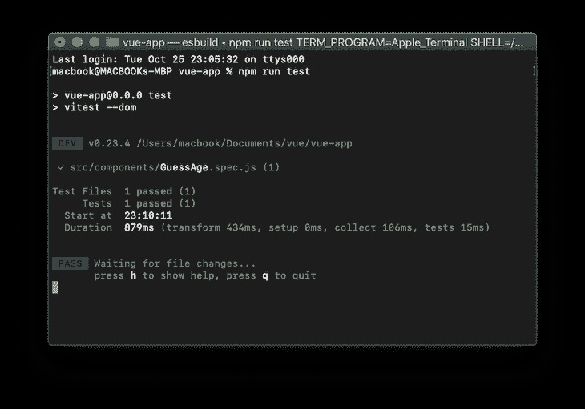
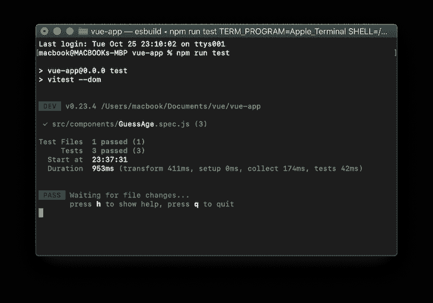
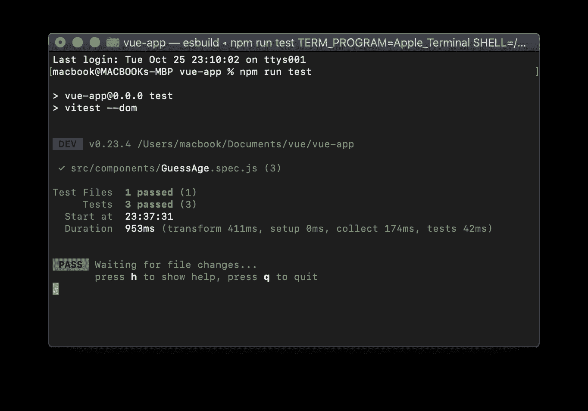
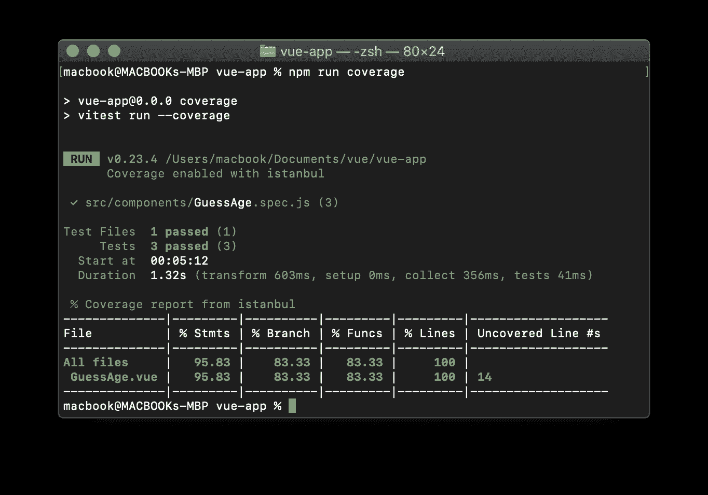

# 使用 Vue 组件的 Vitest 自动化测试指南

> 原文：<https://blog.logrocket.com/guide-vitest-automated-testing-vue-components/>

在开发 Vue 应用时，我们使用一个或多个组件来确保我们的代码易于阅读和维护。在应用程序功能和性能很重要的情况下，验证组件是否按预期无误地执行是至关重要的。

使用 Vue 组件测试，我们可以测试我们的单个组件，以验证它们是否正常工作以及异步操作是否被正确触发。组件测试捕捉与组件的属性、事件、风格、类、生命周期挂钩等相关的问题。

有很多自动化测试框架可以用来测试 Vue 组件，比如 Vitest、Jest、Cypress 等。，但是 Vue 团队推荐使用 Vitest 来测试 Vue 应用程序，因为它具有独特的功能。Vitest 由 Vue 和 Vite 团队成员创建和维护。

在本教程中，我们将探索 Vitest 框架，如何配置它，以及如何使用它来测试 Vue 组件。我们还将介绍如何使用快照和代码覆盖率。

作为本教程的先决条件，我假设您的计算机上已经安装了 Node.js，并且熟悉 [Vue](https://vuejs.org/) 。

*向前跳转:*

## 什么是 Vitest？

Vitest 是一个超级快速的测试框架，几乎不需要配置。因为 Vitest 和 Vite 使用相同的配置文件，所以很容易将 Vitest 集成到 Vue 应用程序中。

根据 [Vitest 团队](https://vitest.dev/guide/why.html)的说法，“Vitest 的目标是将自己定位为 Vite 项目的首选测试运行者，甚至是不使用 Vite 的项目的可靠替代者。”

## 最重要的特征

Vitest 与 [Jest API](https://jestjs.io/) 兼容。如果你已经熟悉 Jest，你将知道如何使用 Vitest。除了 Vitest 与 Jest API 的相似之处，让我们看看使它成为更好的测试框架的一些特性:

*   Vitest 与 Vite 共享相同的配置文件，测试配置在`vite.config.js`文件中完成，以确保测试环境与构建环境相似
*   Vitest 与大多数 Jest APIs 和库兼容，使得从 Jest 移植到 Vitest 变得容易
*   Vitest 支持 HMR，每当测试文件被修改时，它允许新的变化被反映到服务器上

## 创建 Vue 项目

为了理解如何在 Vue 中运行自动化组件测试，让我们用以下命令建立一个 Vue 程序:

```
npm create [email protected] vue-app -- --template vue
cd vue-app
npm install

```

项目安装完成后，运行下面的命令来启动应用程序:
npm run dev

打开`[http://127.0.0.1:5173/](http://127.0.0.1:5173/)`浏览器。您应该会看到应用程序成功运行。

## VI 测试安装和配置

现在，让我们用下面的命令安装 Vitest:

```
npm install -D vitest

```

安装完成后，我们需要将 Vitest 添加到`package.json`文件中。在`package.json`文件中，添加如下测试脚本:

```
// ...
"scripts": {
  // ...
   "test": "vitest"
 },
// ...

```

接下来，打开`vitest.config.js`文件并向其中添加以下代码:

```
import { defineConfig } from 'vite'
import vue from '@vitejs/plugin-vue'

// https://vitejs.dev/config/
export default defineConfig({
 plugins: [vue()],
 test:{
   globals:true,
 }
})

```

将`globals`属性设置为`true`将允许在测试文件中访问 Vitest APIs，而无需导入它们。

## 安装测试工具和 happy-dom

Test Utils 是一个 Vue 测试库，它提供了安装和交互 Vue 组件的方法。使用以下命令安装测试 til:

```
npm install --save-dev @vue/test-utils

```

在我们的组件测试中，我们应该能够模拟 DOM API。Vitest 目前同时支持`[happy-dom](https://github.com/capricorn86/happy-dom)`和`[jsdom](https://github.com/jsdom/jsdom)`。在本教程中，我们将使用`happy-dom`。运行下面的命令来安装`happy-dom`:

```
npm install happy-dom

```

安装完成后，将`–dom`添加到`package.json`文件中的测试脚本中:

```
// …
"scripts": {
   // …
   "test": "vitest --dom" 
 },
// …

```

此外，我们需要将`happ``y``-dom`添加到`vite.config.js`文件中，使其在我们的测试文件中全局可用:

```
// …
 test:{
   // …
   environment: 'happy-dom',
 }
// …

```

## 创建 Vue 组件

让我们创建一个名为`GuessAge.vue`的简单组件，使用户能够输入他们的姓名，并根据使用`[Agify.io](https://agify.io/)` API 输入的姓名猜测用户的年龄。

在`src/components`文件夹中，创建`GuessAge.vue`文件并添加以下代码:

```
<template>
  <h1>{{ title }}</h1>
  <div class="card">
   <div style="width:400px;height:130px;margin-top:20px;border-style: dotted;" >
   <br>
    <span>Firstmame: {{firstname}}</span> <br>
    <span>Age: {{age}}</span> <br>

    </div><br><br>
     <label> Enter Firstname </label><br>
     <input type="text" v-model="search" style="font-size:20px;border-radius:10px;" placeholder=" Name ..."> <br> <br>
    <button type="button" @click="getAge">Guess Age</button>
    <br> <br> <br>
    <input type="radio" value="pop"> <label>Save my data</label>
  </div>
</template>
<script setup>
import { ref } from 'vue'
defineProps({
  title: String
})
</script>
<script>
export default {
    data() {
        return {
            search:"",
            firstname:"",
            age:"",
        }
    },
    computed: {
       getAge() {
        fetch('https://api.agify.io/?name='+ this.search)
        .then(response => response.json())
        .then(data => {
            this.age = data.age
            this.firstname = data.name
            this.search=""
        })
        }
    }
}
</script>

```

## 测试 Vue 组件和道具

我们需要为我们的组件创建一个测试文件。作为命名惯例，测试文件名必须以组件名开始，以`.spec.js`或`.test.js`结束。测试多个组件时，每个组件都应该有一个测试文件。

现在，在`components`文件夹中，创建一个名为`GuessAge.spec.js`的测试文件。该文件将包含我们的`GuessAge`组件的简单测试脚本。

让我们测试一下`GuessAge`组件，看看它在安装时是否接受了正确的道具。我们可以在挂载时通过向`GuessAge.spec.js`文件添加以下代码来测试标题属性的值:

```
import {mount} from "@vue/test-utils";
import GuessAge from "../components/GuessAge.vue";
// import { expect, test } from "vitest";
test("mount component",async()=>{
   expect(GuessAge).toBeTruthy();

   const wrapper = mount(GuessAge,{
       props:{
          title:"Guess User Age App",
       },
   });
   expect(wrapper.text()).toContain("Guess User Age App");
})

```

我们从`@vue/test-utils`导入`mount`，这允许我们将组件包装到一个名为`Wrapper`的特殊对象中，这为我们提供了各种测试选项。

如果您在 Vite 配置文件中将 globals 的值设置为`false`,您应该使用`import { expect, test } from "vitest";`。

运行以下命令，在监视模式下测试组件:

```
npm run test

```



## 使用快照测试用例

一个 [s](https://vitest.dev/guide/snapshot.html) [napshot](https://vitest.dev/guide/snapshot.html) 用于跟踪 UI 中的变化。一个典型的快照测试用例呈现一个 UI 组件，获取一个快照，并将其与测试旁边的一个参考快照文件进行比较。它将用户界面的当前状态与已建立的快照进行比较。如果当前状态与建立的状态不匹配，测试将失败。

要运行快照测试并跟踪 UI 中的变化，请将下面的代码添加到测试文件中(`GuessAge.spec.js`)。

```
test('snapshot UI testing', () => {
   const wrapper = mount(GuessAge,{});
   expect(wrapper.text()).toMatchSnapshot()
  })

```

因为 Vitest 支持热模块重载，所以不必在每次修改测试文件时都运行 test 命令。下面是您应该在终端中看到的内容:



## 模仿 HTTP 请求

用 HTTP 请求测试 Vue 组件时，我们首先需要模拟网络请求；否则，测试将失败。

使用[Mock Service Worker](https://mswjs.io/)[(MSW)](https://mswjs.io/)进行模拟，可以在不改变任何应用程序代码的情况下，通过拦截测试请求来轻松测试 HTTP 请求。

使用以下命令安装 MSW:

```
npm install msw --save-dev

```

为了使用 MSW，我们必须在测试文件(`GuessAge.spec.js`)中导入以下两个依赖项。

```
import { setupServer } from 'msw/node'
import { rest } from 'msw'

```

让我们通过将下面的代码添加到我们的测试文件(`GuessAge.spec.js`)来创建一个模拟服务器的实例，该实例将拦截 HTTP 请求。

```
export const restHandlers = [
   rest.get('https://api.agify.io/', (req, res, ctx) => {
      return res(ctx.status(200), ctx.json([
         {
            age: 55,
            name: "tope"
         }
      ]))
   }),
]
const server = setupServer(...restHandlers)
// Start server before all tests
beforeAll(() => server.listen({ onUnhandledRequest: 'error' }))
//  Close server after all tests
afterAll(() => server.close())
// Reset handlers after each test `important for test isolation`
afterEach(() => server.resetHandlers())

```

## 测试点击事件

让我们验证一下，当我们点击 **Guess Age** 按钮时，在获取用户年龄之后，输入标签是空的。

```
test("Button clicked", async () => {
   expect(GuessAge).toBeTruthy();

   const wrapper = mount(GuessAge, {
      props: {
         title: "Guess User Age App",
      },
   });
   const ac = await wrapper.get("button").trigger("click")
   expect(wrapper.vm.search).toEqual("")
})

```

下面是您应该在终端中看到的内容:



## 用 Vitest 进行覆盖率测试

为了报告和分析代码性能，以确定您的代码有多有效和写得多好，Vitest 通过 c8 和伊斯坦布尔支持本机代码[覆盖率](https://vitest.dev/guide/coverage.html)。

为了配置和运行覆盖率测试，我们需要向`vite.configure.js`文件添加覆盖率，如下所示:

```
export default defineConfig({
  plugins: [vue()],
  test:{
    globals:true,
    coverage: {
      provider: 'istanbul'
    },
    environment: 'happy-dom',
  }
})

```

此外，我们需要将覆盖率添加到`package.json`文件，将覆盖率添加到脚本中，如下所示:

```
// ...
"scripts": {
  // ...
   "coverage": "vitest run --coverage"
 },
// ...

```

既然我们已经配置了覆盖率测试，接下来的事情就是使用下面的命令安装伊斯坦布尔。

```
npm i -D @vitest/coverage-istanbul

```

当下面的命令被执行时，测试文件被运行，Vitest 将在终端上显示覆盖报告矩阵。

```
npm run coverage 

```



## 结论

我们已经使用 Vitest 成功地为我们的 Vue 组件编写了自动化测试。

借助自动化测试，我们可以快速而自信地防止 Vue 应用中的倒退，并确保我们将无错代码推向生产。

本教程教我们如何配置和使用 Vitest 来测试 Vue 组件。你可以在他们的[官方文档](https://vitest.dev/guide/)中了解更多关于 Vitest 以及如何从 Jest 迁移到 Vitest 的信息。

## 像用户一样体验您的 Vue 应用

调试 Vue.js 应用程序可能会很困难，尤其是当用户会话期间有几十个(如果不是几百个)突变时。如果您对监视和跟踪生产中所有用户的 Vue 突变感兴趣，

[try LogRocket](https://lp.logrocket.com/blg/vue-signup)

.

[](https://lp.logrocket.com/blg/vue-signup)[https://logrocket.com/signup/](https://lp.logrocket.com/blg/vue-signup)

LogRocket 就像是网络和移动应用程序的 DVR，记录你的 Vue 应用程序中发生的一切，包括网络请求、JavaScript 错误、性能问题等等。您可以汇总并报告问题发生时应用程序的状态，而不是猜测问题发生的原因。

LogRocket Vuex 插件将 Vuex 突变记录到 LogRocket 控制台，为您提供导致错误的环境，以及出现问题时应用程序的状态。

现代化您调试 Vue 应用的方式- [开始免费监控](https://lp.logrocket.com/blg/vue-signup)。