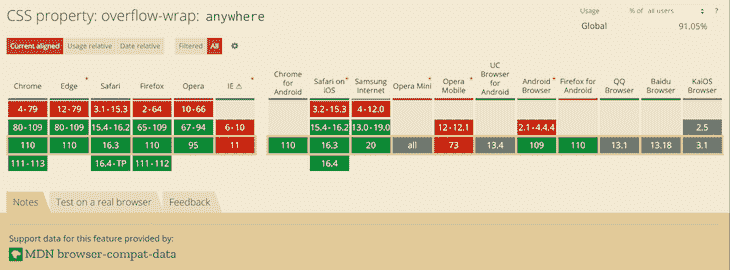
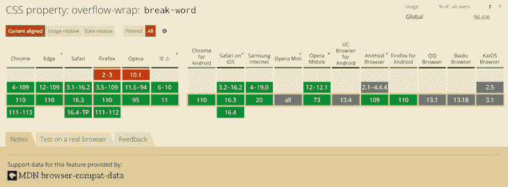
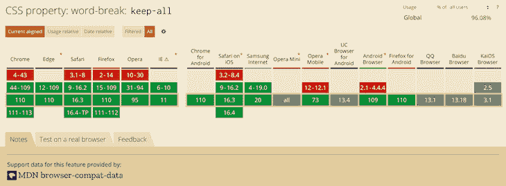
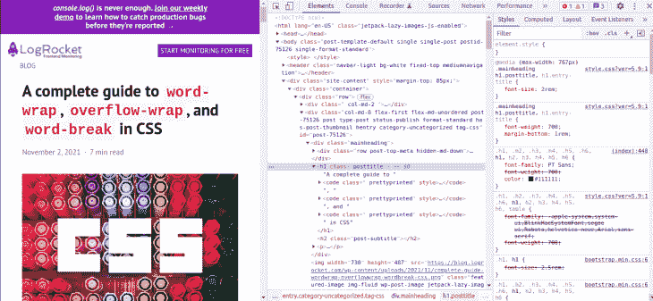

# CSS 自动换行、溢出换行和自动换行的完整指南

> 原文：<https://blog.logrocket.com/guide-word-wrap-overflow-wrap-word-break-css/>

***编者按:*** *这是 CSS 中的`word-wrap`、`overflow-wrap`和`word-break`的完整指南，最近一次更新是在 2023 年 2 月 24 日，以反映 CSS 的最新版本，包括交互式代码示例，并包括如何使用 CSS 换行的一节。要了解更多关于`overflow`属性的信息，请查看我们的[CSS`overflow`](https://blog.logrocket.com/new-guide-css-overflow/)指南。*

在这个时代，让一个站点具有响应性，以便它能在所有设备上正确显示是非常重要的。不幸的是，尽管你尽了最大的努力，你仍然可能以布局混乱而告终。当某些单词太长而不适合其容器时，可能会发生布局混乱。当您处理您无法控制的用户生成的内容(如帖子的评论部分)时，可能会发生内容溢出。因此，您需要应用样式来防止内容溢出容器。

内容溢出是前端开发人员的常见问题。在网络上，当你的内容不完全适合它包含的元素时，就会发生溢出。结果，它溢出到外面。在 CSS 中，您可以主要使用`overflow`、`word-wrap`、`overflow-wrap`和`word-break` CSS 属性来管理内容溢出。然而，在本文中，我们的重点将放在`word-wrap`、`overflow-wrap`和`word-break` CSS 属性上。

*向前跳转:*

## 使用`word-wrap`、`overflow-wrap`和`word-break` CSS 属性

您可以使用`word-wrap`、`overflow-wrap`或`word-break` CSS 属性来换行或换行，否则会溢出它们的容器。这篇文章是关于`word-wrap`、`overflow-wrap`和`word-break` CSS 属性的深入教程，以及如何使用它们来防止内容溢出破坏你漂亮的布局。在我们开始之前，让我们在下一节了解浏览器如何包装内容。

### 浏览器中的内容换行是如何发生的？

浏览器和其他用户代理在允许的[断点](https://blog.logrocket.com/css-breakpoints-responsive-design/)执行内容包装，这被称为软包装机会。浏览器将在软包装机会(如果存在)包装内容，以最小化内容溢出。在英语和其他类似的书写系统中，在没有断字的情况下，默认情况下在单词边界处出现软换行机会。因为单词受到空格和标点符号的限制，所以出现了软文。

尽管英文文本中的空格字符会出现软换行，但对于非英文书写系统，情况可能会有所不同。有些语言不使用空格来分隔单词，这意味着内容换行取决于语言或书写系统。您在`HTML`元素上指定的`lang`属性的值主要用于确定使用哪种语言系统。

这篇文章将主要关注英语写作系统。如果您处理的是长而连续的文本，如 URL 或用户生成的内容，而您对这些内容的控制很少或根本无法控制，那么在软包装的情况下，默认包装可能是不够的。在我们详细解释这些 CSS 属性之前，让我们在下一节看看软换行和强制换行之间的区别。

### 软换行和强制换行有什么区别？

在软换行机会出现的任何文本换行都被称为软换行。为了在软包装机会中进行包装，您需要确保您已经启用了包装。例如，将`white-space` CSS 属性的值设置为`nowrap`将禁用换行。强制换行符是由显式换行符控件或标记文本块的结束或开始的换行符引起的。

## 了解`Word-wrap`和`overflow-wrap` CSS 属性

名称`word-wrap`是`overflow-wrap` CSS 属性的遗留名称。`Word-wrap`最初是一个无前缀的微软扩展，也不是 CSS 标准的一部分，尽管大多数浏览器用名称`word-wrap`来实现它。根据草案 [CSS3 规范](https://www.w3.org/TR/css-text-3/#propdef-overflow-wrap)，为了兼容性，浏览器应该将`word-wrap`作为`overflow-wrap`属性的遗留名称别名。

流行的 web 浏览器的最新版本都实现了`overflow-wrap`属性。CSS3 规范草案将`overflow-wrap`属性称为:

> 此属性指定当一个本来无法断开的字符串太长而无法放入行框时，浏览器是否可以在行内不允许的位置断开，以防止溢出。

如果一个元素有一个`white-space`属性，你需要设置它的值来允许`overflow-wrap`的换行生效。下面是`overflow-wrap`属性的值:

```
overflow-wrap: normal;
overflow-wrap: anywhere;
overflow-wrap: break-word;

```

您也可以将[全球价值观](https://blog.logrocket.com/css-inheritance-inherit-initial-unset-and-revert/) `inherit`、`initial`、`revert`和`unset`与`overflow-wrap`一起使用，但我们在此不再赘述。在下面的小节中，我们将查看上面列出的`overflow-wrap` CSS 属性的值，以了解该属性的行为。

### `Normal`

应用值`normal`将使浏览器使用系统默认的换行行为。对于英语和其他相关书写系统，换行符因此会出现在空格和连字符处，如下所示:

```
.my-element{
    overflow-wrap: normal;
}

```

在下面的例子中，文本中有一个单词比它的容器还要长。因为没有软包装机会，并且`overflow-wrap`属性的值是`normal`，所以单词溢出了它的容器。它描述了系统的默认换行行为:

参见 [CodePen](https://codepen.io) 上 Joseph Mawa([@ nibble 0101](https://codepen.io/nibble0101))
的笔[-溢出-换行-正常](https://codepen.io/nibble0101/pen/NWLpLBq)。

`Anywhere`

### 使用值`anywhere`将在两个字符之间的任意点断开一个原本无法断开的字符串。即使您在同一个元素上应用了`hyphens`属性，它也不会插入连字符。

只有在一行显示该单词会导致溢出时，浏览器才会打断该单词。如果这个词仍然溢出，它将在溢出发生的地方打断这个词。当您使用`anywhere`时，浏览器将在计算`min-content`固有大小时考虑由断词引入的软换行机会:

与上一节中我们使用的`overflow-wrap: normal`不同，在下面的例子中，我们使用的是`overflow-wrap: anywhere`。使用`overflow-wrap: anywhere`将原本无法破解的溢出单词分解成文本块，使其适合其容器:

```
.my-element{
   overflow-wrap: anywhere;
}

```

参见 [CodePen](https://codepen.io) 上 Joseph Mawa([@ nibble 0101](https://codepen.io/nibble0101))
的笔 [overlow-wrap-anywhere](https://codepen.io/nibble0101/pen/eYLWRXY)。

See the Pen [overlow-wrap-anywhere](https://codepen.io/nibble0101/pen/eYLWRXY) by Joseph Mawa ([@nibble0101](https://codepen.io/nibble0101))
on [CodePen](https://codepen.io).

最新版本的桌面浏览器大多支持`overflow-wrap:` `anywhere`。然而，对一些移动浏览器的支持要么缺乏，要么不为人知。下图显示了浏览器支持:



`Break-word`

### 就功能而言，值`break-word`类似于`anywhere`。如果浏览器可以将溢出的单词换行而不溢出，这就是它要做的。但是，如果单词仍然溢出了它的容器，即使它在它的行上，浏览器将在溢出发生的地方中断它:

下面的示例显示了当您应用`overflow-wrap: break-word`时，浏览器如何中断溢出的文本:

```
.my-element{
   overflow-wrap: break-word;
}

```

参见 [CodePen](https://codepen.io) 上 Joseph Mawa([@ nibble 0101](https://codepen.io/nibble0101))
的笔 [溢出-换行-断字](https://codepen.io/nibble0101/pen/GRXmvKx)。

See the Pen [overflow-wrap-break-word](https://codepen.io/nibble0101/pen/GRXmvKx) by Joseph Mawa ([@nibble0101](https://codepen.io/nibble0101))
on [CodePen](https://codepen.io).

请注意，该文本与上一小节中的文本相同。`overflow-wrap: anywhere`和`overflow-wrap: break-word`的区别在于`min-content`的内在尺寸。

当计算`min-content`固有尺寸时，`anywhere`和`break-word`之间的差异是明显的。使用`break-word`，浏览器在计算`min-content`固有大小时不会考虑由断词引入的软换行机会，但使用`anywhere`时会考虑。有关`min-content`内在尺寸的更多信息，请点击查看我们的指南[。](https://blog.logrocket.com/understanding-min-content-max-content-fit-content-css/)

值`break-word`在最新版本的桌面浏览器中有不错的覆盖率。不幸的是，你不能对他们的手机同行说同样的话。因此，使用传统的`word-wrap: break-word`比最近的`overflow-wrap: break-word`更安全。

下图显示了浏览器对`overflow-wrap: break-word`的支持:



最新版本的桌面浏览器支持，而对某些移动浏览器的支持未知。

实现`Word-break` CSS 属性

## `Word-break`是另一个 CSS 属性，可以用来指定字符之间的软换行机会。您可以使用此属性在发生溢出的确切位置断开一个单词，并将其换行到下一行。

CSS3 规范草案将`word-break` CSS 属性称为:

此属性指定字母之间的软换行机会，即在“正常”和允许换行的地方。它控制着浏览器可以将哪些类型的字母聚集在一起形成牢不可破的“单词”——导致 CJK 字符的行为像非 CJK 文本，反之亦然。

> 下面是`word-break` CSS 属性的可能值。像`overflow-wrap`一样，您可以将全局值`inherit`、`initial`、`revert`和`unset`与`word-break`一起使用，但我们不会在这里介绍它们:

`Break-word`也是`word-break` CSS 属性的值，尽管它已被移除。然而，由于传统原因，浏览器仍然支持它。指定该属性与`word-break: normal`和`overflow-wrap: anywhere`的效果相同。

```
word-break: normal;
word-break: break-all;
word-break: keep-all;

```

既然我们已经知道了`break-word` CSS 属性及其相应的值，让我们在下面的小节中看看它们。

将`word-break`设置为`Normal`

### 将`word-break`属性的值设置为`normal`将应用默认的断字规则:

下面的例子说明了当您将样式`word-break: normal`应用到包含比其容器更长的单词的文本块时会发生什么:

```
.my-element{
   word-break: normal;
}

```

参见 [CodePen](https://codepen.io) 上 Joseph Mawa([@ nibble 0101](https://codepen.io/nibble0101))
的笔[word-break-normal](https://codepen.io/nibble0101/pen/abaWyOm)。

See the Pen [word-break-normal](https://codepen.io/nibble0101/pen/abaWyOm) by Joseph Mawa ([@nibble0101](https://codepen.io/nibble0101))
on [CodePen](https://codepen.io).

你看到的是浏览器通常的断字规则在起作用。

`Break-all`值

### 对于非中文、非日文和非韩文书写系统，值`break-all`将在文本溢出的确切位置插入一个换行符。它不会将单词放在自己的行中，即使这样做可以避免插入换行符:

在下面的例子中，我将`word-break: break-all`样式应用于宽度为`240px`的`p`元素，该元素包含溢出的文本。浏览器将在溢出发生的位置插入一个换行符，并将剩余的文本换行到下一行:

```
.my-element{
   word-break: break-all;
}

```

参见 [CodePen](https://codepen.io) 上 Joseph Mawa([@ nibble 0101](https://codepen.io/nibble0101))
的笔[word-break-break-all](https://codepen.io/nibble0101/pen/JjaNyLO)。

See the Pen [word-break-break-all](https://codepen.io/nibble0101/pen/JjaNyLO) by Joseph Mawa ([@nibble0101](https://codepen.io/nibble0101))
on [CodePen](https://codepen.io).

使用`break-all`将在英语和其他相关语言系统中发生溢出的确切位置断开两个字符之间的单词。但是，它不会对中文、日文和韩文(CJK)文本应用相同的行为。

这种行为不适用于 CJK 文本，因为 CJK 书写系统有自己的断点应用规则。仅仅为了避免溢出而在两个字符之间任意创建一个换行符可能会显著改变文本的整体含义。对于 CJK 系统，浏览器将在允许换行符的地方应用换行符。

使用`Keep-all`值

### 如果您使用值`keep-all`，浏览器将不会对 CJK 文本应用断词，即使有内容溢出。对于非 CJK 书写系统，应用`keep-all`值的效果与`normal`相同:

在下面的示例中，对于非 CJK 书写系统(如英语),应用`word-break: keep-all`将具有与`word-break: normal`相同的效果:

```
.my-element{
   word-break: keep-all;
}

```

参见 [CodePen](https://codepen.io) 上 Joseph Mawa([@ nibble 0101](https://codepen.io/nibble0101))
的笔[word-break-keep-all](https://codepen.io/nibble0101/pen/eYLWEKB)。

See the Pen [word-break-keep-all](https://codepen.io/nibble0101/pen/eYLWEKB) by Joseph Mawa ([@nibble0101](https://codepen.io/nibble0101))
on [CodePen](https://codepen.io).

下图显示了浏览器对`word-break: keep-all`的支持:



大多数流行的桌面浏览器都支持该值。不幸的是，移动浏览器的情况并非如此。既然我们已经查看了`overflow-wrap`和`word-break` CSS 属性，那么这两者之间有什么区别呢？下面的部分将阐明这一点。

`overflow-wrap`和`word-break`有什么区别？

## 您可以使用 CSS 属性`overflow-wrap`和`word-break`来管理内容溢出。但是，这两个属性处理它的方式有所不同。

使用`overflow-wrap`会将溢出的单词换行，如果它可以放在一行中而不溢出它的容器的话。只有当浏览器无法在不溢出的情况下将单词放在新的一行时，才会将其断开。在大多数情况下，`overflow-wrap`属性或其传统名称`word-wrap`可能会管理内容溢出。使用`word-wrap: break-word`将溢出的单词换行，如果它仍然溢出容器，则在两个字符之间换行。

`Word-break`将无情地断开两个字符之间溢出的单词，即使将它放在它的行上会取消断词的需要。有些书写系统，如 CJK 书写系统，有严格的断字规则，浏览器在使用`word-break`创建换行符时会考虑到这些规则。

如何使用 CSS 换行

## 正如上面所暗示的，如果你想换行或者打破一个超出其范围的单词，你最好的选择是`overflow-wrap` CSS 属性。也可以使用它的旧名称`word-wrap`。如果`overflow-wrap`属性对您不起作用，请尝试`word-break` CSS 属性。但是，请注意上面强调的`overflow-wrap`和`word-break`之间的区别。

下面是对`overflow-wrap`和`word-wrap` CSS 属性的说明。您可以使用代码笔来了解它们的效果:

参见 [CodePen](https://codepen.io) 上 Joseph Mawa([@ nibble 0101](https://codepen.io/nibble0101))
的 [如何换行正文](https://codepen.io/nibble0101/pen/NWLjYoO)。

See the Pen [how-to-wrap-text](https://codepen.io/nibble0101/pen/NWLjYoO) by Joseph Mawa ([@nibble0101](https://codepen.io/nibble0101))
on [CodePen](https://codepen.io).

用 Chrome DevTools 解决 CSS 内容溢出问题

## 通常情况下，您可能需要修复由内容溢出导致的不完整布局，因为复杂的用户界面现在在前端开发中很常见。现代网络浏览器带有解决这种布局问题的工具，比如 [Chrome DevTools](https://developer.chrome.com/docs/devtools/) 。

它提供了在 DOM 树中选择元素的能力，这样您就可以查看、添加和删除 CSS 声明等等。它将帮助你追踪布局中令人讨厌的 CSS 样式，并轻松修复它。

要打开 Chrome DevTools，可以使用`F12`键。打开时，它看起来像下面的图像。在 DOM 树中选择一个**元素**将显示其对应的 CSS 样式。您可以修改样式，并在追踪 bug 来源时查看对布局的影响:



如前所述，如果一个元素有`white-space`属性，设置它的值以允许`overflow-wrap: anywhere`或`overflow-wrap: break-word`换行。

在`table`内容上将`overflow-wrap`属性的值设置为`anywhere`或`break-word`不会像上面的例子那样打断溢出的单词。表格将溢出其容器，并在必要时创建水平滚动。为了使表格适合其容器并使`overflow-wrap`工作，将`table-layout`属性的值设置为`fixed`，并将表格宽度设置为`100%`或某个固定值。

结论

## 正如前面几节所指出的，`overflow-wrap`和`word-break`在很多方面都很相似，您可以使用它们来进行换行控制。`overflow-wrap`这个名字是遗产`word-wrap`的别名。因此，您可以交替使用这两者。然而，值得一提的是，浏览器对较新的`overflow-wrap`属性的支持仍然较低。如果你想要近乎通用的浏览器支持，你最好使用`word-wrap`而不是`overflow-wrap`。

根据 CSS3 规范草案，出于遗留原因，浏览器和用户代理应该继续支持`word-wrap`。如果你想管理内容溢出，`overflow-wrap`或者它的旧名字`word-wrap`可能就足够了。如果单词溢出了容器，您还可以使用`word-break`在两个字符之间断开单词。就像`overflow-wrap`一样，由于浏览器支持的限制，使用`word-break`时需要小心谨慎。

现在您已经知道了与这两个属性相关的行为，您可以决定何时何地使用它们。我错过什么了吗？在评论区留下评论。我很乐意更新这篇文章。

你的前端是否占用了用户的 CPU？

## 随着 web 前端变得越来越复杂，资源贪婪的特性对浏览器的要求越来越高。如果您对监控和跟踪生产环境中所有用户的客户端 CPU 使用、内存使用等感兴趣，

.

[try LogRocket](https://lp.logrocket.com/blg/css-signup)

LogRocket 就像是网络和移动应用的 DVR，记录你的网络应用或网站上发生的一切。您可以汇总和报告关键的前端性能指标，重放用户会话和应用程序状态，记录网络请求，并自动显示所有错误，而不是猜测问题发生的原因。

[](https://lp.logrocket.com/blg/css-signup)[https://logrocket.com/signup/](https://lp.logrocket.com/blg/css-signup)

现代化您调试 web 和移动应用的方式— [开始免费监控](https://lp.logrocket.com/blg/css-signup)。

Modernize how you debug web and mobile apps — [Start monitoring for free](https://lp.logrocket.com/blg/css-signup).