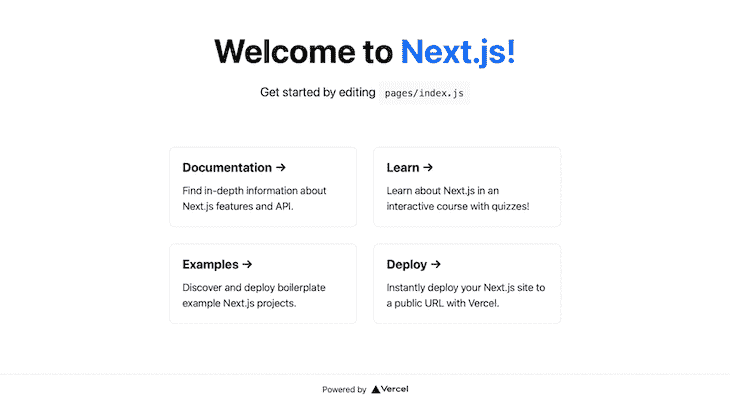
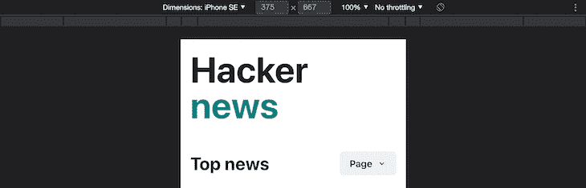
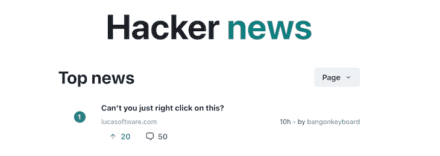
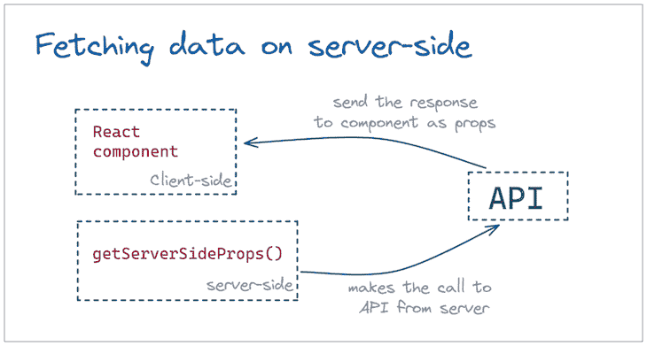
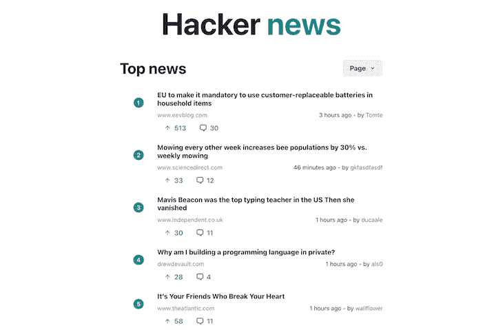
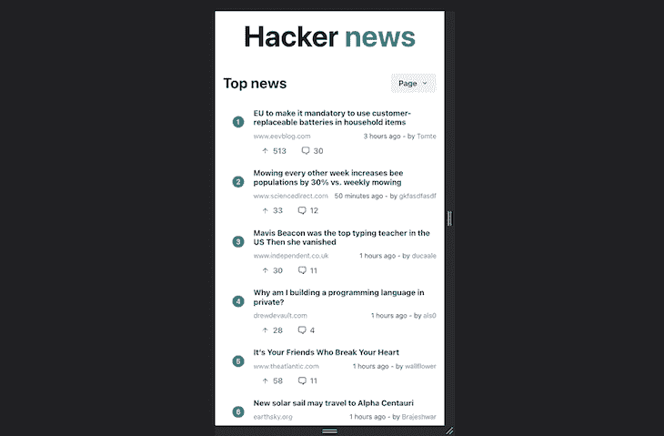
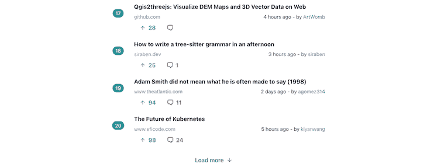

# 带有 Chakra UI 和 Next.js - LogRocket 博客的黑客新闻客户端

> 原文：<https://blog.logrocket.com/hacker-news-client-chakra-ui-next-js/>

如果你对创业和计算机科学感兴趣，并且积极关注这些话题的最新消息，你可能已经熟悉了[黑客新闻](https://news.ycombinator.com/)。对于那些不了解的人来说，黑客新闻是一个由投资基金 [Y Combinator](https://www.ycombinator.com/) 运营的社交新闻网站。

在我看来，虽然该网站发布的帖子质量值得商榷，但用户界面似乎已经过时了。不要误解我的意思，它仍然是一个相当不错的 UI，速度非常快，但它似乎还不够完善，无法与 2022 年的网站竞争。

有人认为这是有意为之。该网站构建在尽可能接近纯 HTML、CSS 和 JavaScript 的技术堆栈上，以避免 UI 框架的捆绑大小和其他复杂性。

但是，随着像 Next.js 这样的突破性技术的出现，尽管使用了 UI 框架，还是有可能接近那个性能水平。在本文中，我们将通过使用 Chakra UI 和 Next.js 构建一个黑客新闻客户端的克隆来实现这一点。让我们开始吧！

### 目录

## 技术堆栈

让我们仔细看看我们选择的武器，我们将在这个项目中使用的技术堆栈。

### UI 框架:Next.js

如前所述，我们选择的 UI 框架将是 Next.js，因为我们希望利用服务器端呈现，Next.js 支持开箱即用。除此之外，我们还将间接受益于其他特性，如基于文件系统的路由、代码分割、快速刷新等等。

与 Next.js 一起，我们将使用 [Chakra UI](https://chakra-ui.com/) 作为组件库。 [Chakra 是一个令人惊叹的 UI 库](https://blog.logrocket.com/advanced-techniques-chakra-ui/)，它提供了现代外观的 React 组件，您无需编写一行 CSS 就可以定制这些组件。该库还具有开箱即用的响应式设计支持。

### Backend API

为了查询我们需要在应用程序中显示的最新项目，我们将[调用免费的黑客新闻 API](https://hackernews.api-docs.io/v0/overview/introduction)。基本上，我们需要调用以下两个 API:

要实现后端，调用第一个 API 并获取所有 500 个商品的 id。对`[https://hacker-news.firebaseio.com/v0/topstories.json?print=pretty](https://hacker-news.firebaseio.com/v0/topstories.json?print=pretty)`的调用返回以下代码:

```
[
 30615959,
  30634872,
  30638542,
  30638590,
  30635426,
  30637403,
  30638830,
  30632952,
  ...
]

```

我们固定了`20`项的页面大小，并使用下面的公式确定哪些 id 属于该页面:

```
pageStartIndex = Number(page)*Number(pagesize)
pageEndIndex = (Number(page)+1)*Number(pagesize) - 1

```

一旦我们有了索引，我们将触发一个 API 调用来并行获取该索引范围内所有 20 个项目的详细信息。当您调用一个项目时，API URL `[https://hacker-news.firebaseio.com/v0/item/30615959.json?print=pretty](https://hacker-news.firebaseio.com/v0/item/30615959.json?print=pretty)`返回以下内容:

```
{
  by: "rayrag",
  descendants: 50,
  id: 30615959,
  kids: [
    30637759,
    30639031,
    30637901,
    30637711,
    ...
  ],
  score: 364,
  time: 1646841853,
  title: "Pockit: A tiny, powerful, modular computer
```

```
",
  type: "story",
  url: "https://www.youtube.com/watch?v=b3F9OtH2Xx4"
}

```

由于 Next.js 的魔力，所有这些都将发生在服务器端。我们将只获得必要的细节来填充 UI 上的 20 个项目。一旦用户点击任何列表项，我们将在浏览器的新选项卡中导航到该项的 URL。

## 建造 UX

### 项目设置

前端设置就像创建一个新的 Next.js repo 一样简单，我们可以使用`create-next-app`命令来完成。导航到要在其中创建项目的文件夹，并运行以下命令:

```
npx create-next-app hackernews

```

剩下的就交给 Next.js 了。脚本运行完成后，将会创建一个名为`hackernews`的新文件夹。导航到它并启动应用程序以查看欢迎屏幕:

```
cd hackernews
yarn dev

```

上面的代码将打开 Next.js 项目的熟悉的起始页:



## Chakra UI 集成

现在，让我们使用下面的命令在同一个项目中安装 Chakra UI:

```
npm i @chakra-ui/react @emotion/[email protected]^11 @emotion/[email protected]^11 [email protected]^6

```

一旦安装了 Chakra UI，我们需要转到`pages/_app.js`并用`ChakraProvider`包装根，使其看起来像下面的代码:

```
import { ChakraProvider } from "@chakra-ui/react";
import '../styles/globals.css';

function MyApp({ Component, pageProps }) {
  return (
    <ChakraProvider>
      <Component {...pageProps} />
    </ChakraProvider>
  )
}
export default MyApp

```

现在，我们已经准备好在我们的项目中使用 Chakra UI。你可以跟随并自己构建它，或者[参考这个 GitHub 库](https://github.com/kokanek/hackernews-responsive)。

## 主页

接下来，我们将修改`pages/index.js`文件。我们将使用 Chakra UI 组件构建站点标题和主标题以及分页菜单。我们的应用程序中只有两种风格。首先，`.container`将把我们的主站点放在中间，而`.main`风格将占据我们整个站点的 UI。

然后，我们创建我们的头和标题组件如下。菜单目前是硬编码的，但以后会更改:

```
&lt;Box className={styles.main} px={[4, 10]}>
  <Heading as='h1' size='4xl'>
    Hacker <span style={{color: 'teal'}}>news</span>
  </Heading>
  <Flex direction="row" justify='space-between' align='center' width="100%" mt="12">
   <Heading as='h1' size='xl'>
      Top news
    </Heading>
    <Menu>
      <MenuButton as={Button} rightIcon={<ChevronDownIcon />}>
        Page
      </MenuButton>
      <MenuList>
        <MenuItem>1</MenuItem>
        <MenuItem>2</MenuItem>
       <MenuItem>3</MenuItem>
       <MenuItem>4</MenuItem>
       <MenuItem>5</MenuItem>
     </MenuList>
    </Menu>
  </Flex> 
</Box>

```

桌面浏览器上的输出如下所示:


在手机浏览器上:



## 用虚拟数据列出用户界面

接下来，我们将创建一个组件来显示黑客新闻列表项。我们需要显示标题，upvotes，评论和发布该项目的用户。在集成 API 之前，我们将为它们假设一些虚拟值，并为项目创建 UI。

创建一个组件文件夹和一个名为`ListItem.jsx`的文件，它将保存列表项的表示代码。为了保持列表项的响应性，我们将使用 Chakra UI 提供的`Flex`组件来构建几个 Flexbox 行和列。

该组件类似于以下代码:

```
export default function ListItem({ item }) {
  return (
    <Flex direction="row" align={"center"} mb={4}>
      <Flex style={{ flex: 2 }} justify="center" mt={-8}>
        <Tag
          size={"md"}
          key={"md"}
          borderRadius='full'
         variant='solid'
          colorScheme='teal'
        >
          <TagLabel>{item.index}</TagLabel>
        </Tag>
      </Flex>
      <div style={{ flex: 12 }}>
        <Flex direction={"column"}>
          <Heading as='h1' size='sm'>
            {item.heading}
          </Heading>
          <Flex direction={"row"} justify="space-between" mt="2" wrap={"wrap"}>
            <Text fontSize='sm' color="gray.500" >{item.site}</Text>
            <Text fontSize='sm'>{item.time} - by <span style={{ color: '#2b6cb0' }}>{item.user}</span> </Text>
          </Flex>
          <Flex direction="row">
            <Button leftIcon={<ArrowUpIcon />} colorScheme='blue' variant='ghost'>
              {item.likes}
            </Button>
         <Button leftIcon={<ChatIcon />} colorScheme='orange' variant='ghost'>
              {item.comments}
            </Button>
          </Flex>
        </Flex>
      </div>
    </Flex>
  )
}

```

出于测试目的，让我们硬编码一个 JSON 项目。我们将使用我们刚刚开发的`ListItem`组件来检查它是如何显示在 UI 上的:

```
const item = {
  heading: "Can't you just right click on this?",
  site: "lucasoftware.com",
  time: "10h",
  user: "bangonkeyboard",
  likes: 20,
  comments: 50,
  index: 1,
}

```



这个`ListItem`代码缺少的唯一功能是当任何项目被点击时重定向到一个新的标签。我们稍后会添加这一点。现在，我们需要做的就是从后端获取条目列表，并映射它来创建列表条目。

## API 集成

接下来，我们将添加 API 集成。我们将调用前面讨论过的 Top Stories API，然后根据用户所在的页面获取项目的详细信息。可以从 URL 中的查询参数读取页码。

## 服务器端渲染

为了让这一切发生在服务器端，我们将使用 Next.js 提供的`getServerSideProps`方法。该方法中编写的所有代码都在服务器端执行，从该方法返回的数据作为 props 提供给 React 组件:



下面的代码进入`getServerSideProps`方法并获取帖子:

```
export async function getServerSideProps(context) {
  let pagesize = PAGE_SIZE;
  let { page=1 } = context.query;
  let posts = await fetchAllWithCache(API_URL);

  page = page == 0 ? 0 : page - 1;
  const slicedPosts = posts.slice(Number(page)*Number(pagesize), (Number(page)+1)*Number(pagesize));

  const jsonArticles = slicedPosts.map(async function(post) {
  return await fetchAllWithCache(`https://hacker-news.firebaseio.com/v0/item/${post}.json?print=pretty`);
  });

  const returnedData = await Promise.all(jsonArticles);
  return {
    props: {
       values: returnedData,
       totalPosts: posts.length
    }
  }
}

```

请注意，在服务器端使用由 context param 提供的页面查询参数读取页码。然后，对结果进行切片，并获取切片后的文章 id 的详细信息。

我们还引入了一个使用内存缓存的缓存层，这样所有这些 API 都可以在我们的服务器上缓存 60 分钟。缓存逻辑如下:

```
async function fetchWithCache(url) {
  const value = cacheData.get(url);
  if (value) {
    return value;
  } else {
    const minutesToCache = 60;
    const res = await fetch(url);
    const data = await res.json();
    cacheData.put(url, data, minutesToCache * 1000 * 60);
    return data;
  }
}

```

在这个方法的最后，我们将帖子作为道具传递给 React 组件。

## 遍历列表

接下来，我们遍历在 props 中得到的列表，并调用`ListItem`组件:

```
<Flex direction="column" width="100%" mt="8">
  {posts.map((post, i) => <ListItem item={post} key={post.id} index={(page - 1)*PAGE_SIZE+i+1} />)}
</Flex>

```

## 解析域

还有两件事我们需要处理。黑客新闻 API 不会单独返回域名给我们，所以我们需要自己从 URL 中提取出来。一个巧妙的技巧是使用 URL 帮助器，如下所示:

```
const { hostname } = new URL(item.url || 'https://news.ycombinator.com');

```

上面的代码帮助我们从任何 URL 中提取出域名。否则，它将始终被设置为 hackernews.com，以防止应用程序崩溃。

## 解析时间

此外，我们需要一个实用程序来将我们得到的时间戳转换成人类可读的时间。例如，我们得到的作为时间值的`1647177253`需要转换成`3 hours ago`。这听起来有点棘手，但实际上很简单。

下面的效用函数正好实现了这一点。首先，它计算自该时间戳以来经过的秒数，然后计算按顺序经过的天数、小时数、分钟数和秒数，并在发现非零值时返回:

```
export function getElapsedTime(date) {
  // get total seconds between the times
  var delta = Math.abs(new Date().getTime()/1000 - date);
  // calculate (and subtract) whole days
  var days = Math.floor(delta / 86400);
if (days) return `${days} days ago`;
  delta -= days * 86400;
  // calculate (and subtract) whole hours
  var hours = Math.floor(delta / 3600) % 24;
 if (hours) return `${hours} hours ago`;
  delta -= hours * 3600;
  // calculate (and subtract) whole minutes
  var minutes = Math.floor(delta / 60) % 60;
 if (minutes) return `${minutes} minutes ago`;
  delta -= minutes * 60;
  // what's left is seconds
  var seconds = delta % 60;
 return `${seconds} seconds ago`;
}

```

当我们刷新页面时，上面的代码生成了一个漂亮的 UI，其中填充了 20 个条目。在我们的桌面上，它看起来像下面的图像:



在手机上:



最后，我们需要支持分页，我们将通过两种方式来实现。首先，我们将在页面底部创建一个 **Load more** 按钮，单击该按钮，将通过重定向到下一个页码来加载下一组故事。

其次，我们会有**页面**下拉菜单，可以用来直接选择我们需要访问的页面。我们所需要做的就是当一个特定的页面被选中时加载正确的路径。按钮看起来像这样:



下面是加载更多帖子的优雅代码:

```
const onLoadMore = () => {
 router.push(`?page=${Number(page)+1}`)
}

```

现在，我们只需创建一个包含 25 个数字的菜单，并在单击菜单项时使用页码调用相同的函数:

```
<MenuList>
  { Array.from(Array(25).keys()).map(item => <MenuItem key={item} onClick={() => onLoadMore(item+1)}>{item+1}</MenuItem>)}
</MenuList>

```

它负责不同页面的页面导航。

## 结论

有了这些，我们的应用程序就完成了！在本文中，我们构建了一个黑客新闻客户端，它响应移动视图，在服务器端呈现，并支持分页。

构建这种真实世界的应用程序教给我们一些重要的经验和技巧，比如我们用来解析 URL 的程序，或者我们用来进行时间转换的子程序。

尝试一下，使用免费的 API 和您选择的 UI 框架构建您自己版本的黑客新闻客户端。我希望你喜欢这篇文章，快乐编码！

## [LogRocket](https://lp.logrocket.com/blg/nextjs-signup) :全面了解生产 Next.js 应用

调试下一个应用程序可能会很困难，尤其是当用户遇到难以重现的问题时。如果您对监视和跟踪状态、自动显示 JavaScript 错误、跟踪缓慢的网络请求和组件加载时间感兴趣，

[try LogRocket](https://lp.logrocket.com/blg/nextjs-signup)

.

[](https://lp.logrocket.com/blg/nextjs-signup)[](https://lp.logrocket.com/blg/nextjs-signup)

LogRocket 就像是网络和移动应用的 DVR，记录下你的 Next.js 应用上发生的一切。您可以汇总并报告问题发生时应用程序的状态，而不是猜测问题发生的原因。LogRocket 还可以监控应用程序的性能，报告客户端 CPU 负载、客户端内存使用等指标。

LogRocket Redux 中间件包为您的用户会话增加了一层额外的可见性。LogRocket 记录 Redux 存储中的所有操作和状态。

让您调试 Next.js 应用的方式现代化— [开始免费监控](https://lp.logrocket.com/blg/nextjs-signup)。