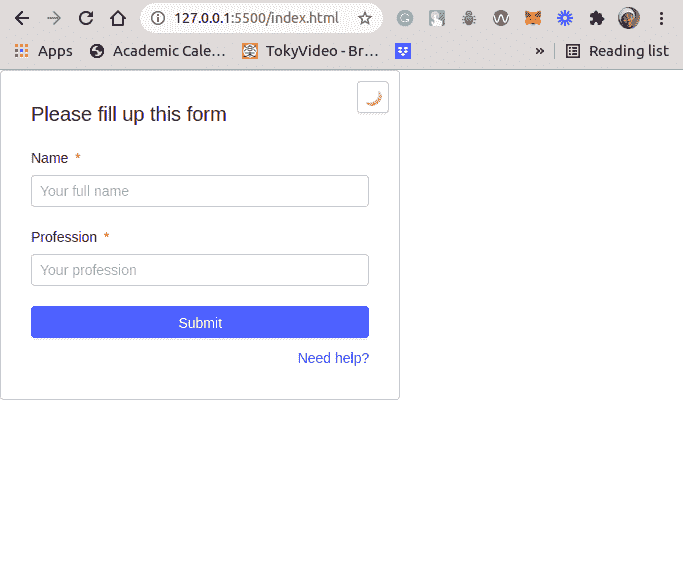
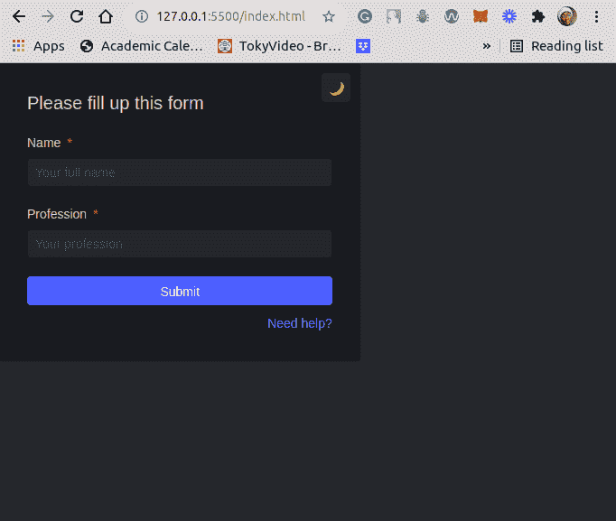
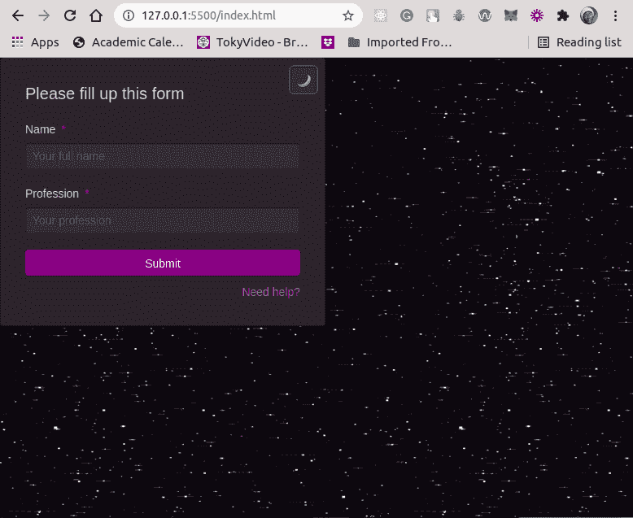

# 半月教程:如何定制你的网站用户界面为光明和黑暗模式

> 原文：<https://blog.logrocket.com/halfmoon-tutorial-customize-website-ui-light-dark-modes/>

虽然大多数 UI 库和框架都附带了一些预定义的样式和组件，但在定制方面有些还是欠缺的。这通常是因为他们将风格、设计决策和模式强加给了开发人员。如果您希望能够快速重新定义默认提供的样式、设计决策和模式，那么动态定制就很重要。

在本教程中，我们将向您介绍 Halfmoon，并演示如何使用这个通用框架构建可定制的动态用户界面。

为了展示 Halfmoon 的作用，我们将构建一个简单的表单，其中包含 Halfmoon 为亮暗模式预定义的默认样式。然后，我们将定制 UI 以包含我们的定制样式和设计决策。

我们的示例项目将是一个静态网页，除了半月形框架外，没有任何前端框架。

## 半月是什么？

Halfmoon 是一个构建网站用户界面的前端框架。其突出的功能之一是一个内置的黑暗模式，使您能够轻松创建可切换的主题。该框架在黑暗模式下为每个元素提供了一组不同的样式。

Halfmoon 附带了许多预先设计好的、响应迅速的、移动优先的组件，这些组件拥有一个明确的 UI 工具包，如 Bootstrap。尽管如此，它可以很容易地被定制，因为框架完全是使用 [CSS 变量](https://blog.logrocket.com/how-to-use-css-variables-like-a-pro/)(也称为 CSS 定制属性)构建的。Halfmoon 中有将近 1500 个 CSS 变量提供定制功能。这意味着几乎所有的东西都可以通过覆盖 CSS 文件中的属性来定制，这使得为你的网站或产品重新设计 Halfmoon 主题变得非常容易。

当父元素的 class 属性包含`.dark-mode`类名时，暗模式特性应用于每个子元素。Halfmoon 在`halfmoon`对象上实现并提供了`toggleDarkMode`接口来触发从亮模式到暗模式的转换。这个内置函数`halfmoon.toggleDarkMode()`，为将`.dark-mode`类添加到父元素提供了一个干净、简单的工作流。

半月可以用来创建几乎任何类型的网站。除了黑暗模式特性之外，Halfmoon 还提供了高度标准化的组件，这些组件可以在不同的管理面板、仪表盘、导航条和下拉菜单中快速重用。最重要的是，这些组件是可定制的。

## 用 Halfmoon 构建用户界面

让我们为我们的演示项目设置开发环境，首先在一个文件夹中创建`index.html`文件。这个文件将作为我们静态网页的入口点。

```
mkdir halfmoon-project
touch index.html

```

创建上述文件夹和 HTML 文件后，让我们用以下样板代码更新`index.html`文件:

```
<!DOCTYPE html>
<html lang="en">
  <head>
    <meta charset="utf-8" />
    <meta http-equiv="X-UA-Compatible" content="IE=edge,chrome=1" />
    <meta content="width=device-width, initial-scale=1.0, maximum-scale=1.0, user-scalable=0" name="viewport" />
    <meta name="viewport" content="width=device-width" />
    <link rel="icon" href="path/to/fav.png">
    <title>Static Webpage | Halfmoon</title>
  </head>
  <body>
  </body>
</html>

```

现在我们有了 HTML 代码，让我们下载半月框架，并建立我们的网页的其余部分。

导航至[半月谈官网](https://www.gethalfmoon.com/)的[下载页面](https://www.gethalfmoon.com/docs/download/)。对于本教程，我们将下载现成的编译代码。

这是一个压缩文件夹，所以您需要解压缩它。解压缩后，只将我们将在项目中使用的文件复制并粘贴到项目文件夹中:`./css/halfmoon-variables.css`和`./js/halfmoon.js`。在项目文件夹中创建 CSS 和 JS 文件夹，并分别粘贴`./css/halfmoon-variables.css`和`./js/halfmoon.js`文件。

现在让我们通过链接 Halfmoon 提供的样式和逻辑文件来更新`index.html`:

```
 <!DOCTYPE html>
<html lang="en">
  <head>
    ...
    <title>Static Webpage | Halfmoon</title>
    <link href="css/halfmoon-variables.css" rel="stylesheet" />
  </head>
  <body>
    <script src="js/halfmoon.js"></script>
  </body>
</html>

```

JS 文件应该放在`<body>`标签的末尾；如果没有，有些事情可能不会像预期的那样工作。

例如，使用`onclick="..."`事件来调用`js/halfmoon.js`文件中 Halfmoon 的内置方法之一将不起作用，除非将 JS 文件放在`<body>`标签的末尾。
至于 CSS 文件，可以放在`<head>`标签里面，这是大多数项目的惯例。

现在让我们用卡片和表单组件更新`index.html`文件，并为元素添加我们想要的各种样式的类名。这些类名很容易理解。

```
<!DOCTYPE html>
<html lang="en">
  <head>
    ...
    <title>Static Webpage | Halfmoon</title>
    <link href="css/halfmoon-variables.css" rel="stylesheet" />
  </head>
  <body class="with-custom-webkit-scrollbars with-custom-css-scrollbars" data-dm-shortcut-enabled="true" data-sidebar-shortcut-enabled="true" data-set-preferred-theme-onload="true">
    <div id="home" class="card w-400 mw-full m-0 position-relative">
      <div class="position-absolute top-0 right-0 z-10 p-10">
        <button
          class="btn btn-square"
          type="button"
          onclick={halfmoon.toggleDarkMode()}
        >
          <i class="fa fa-moon-o" aria-hidden="true">🌙</i>
          <span class="sr-only">Toggle dark mode</span>
        </button>
      </div>
      <h2 class="card-title">Please fill up this form</h2>
      <form action="..." method="...">
        <div class="form-group">
          <label for="full-name" class="required">
            Name
          </label>
          <input
            type="text"
            id="full-name"
            class="form-control"
            placeholder="Your full name"
            required="required"
          />
        </div>
        <div class="form-group">
          <label for="profession" class="required">
            Profession
          </label>
          <input
            type="text"
            id="profession"
            class="form-control"
            placeholder="Your profession"
            required="required"
          />
        </div>
        <input class="btn btn-primary btn-block" type="submit" value="Submit" />
        <div class="text-right mt-10">
          <a href="#home">Need help?</a>
        </div>
      </form>
    </div>
    <script src="js/halfmoon.js"></script>
  </body>
</html>

```

上面的标记代码包含了一个卡内的表单。该表单包含三个输入。其中两个具有`text`类型，而最后一个是具有`submit`类型的输入。

然后，在 card 组件内部，我们定义了一个带有`onclick`事件处理程序的按钮元素。这个事件处理程序调用`halfmoon.toggleDarkmode()`方法。亮模式和暗模式的用户界面结果如下:

灯光模式:



Dark mode:



## 自定义用户界面

为了定制上面的黑暗模式 UI，我们将改变`Submit`按钮的`background-color`和网页主体的`background-image`。我们还将更改卡组件的`Submit`按钮的`border-color`和`background-color`。

这些示例将指导您对 Halfmoon 中预定义的样式进行进一步的定制。

下面让我们在`./css/halfmoon-variables.css`文件中 CSS 样式的`:root`范围内定义我们的自定义样式。

```
...
:root {
  --cm-btn-bg-color: rgb(128, 0, 128);
  --cm-btn-bg-color-hover: rgb(201, 12, 201);
  --body-bg-gif: url("https://media.giphy.com/media/aRZ4vTsHnyW6A/giphy.gif");
  ...
}
...

```

现在搜索下面 CSS 变量的第一个匹配项，并用如下自定义样式替换它:

```
...
: root {
  ...
  --dm-button-primary-bg-color: var(--cm-btn-bg-color);
  --dm-button-primary-border-color: var(--cm-btn-bg-color);
  --dm-button-primary-bg-color-hover: var(--cm-btn-bg-color-hover);
  ...
}
...

```

接下来，让我们在黑暗模式下为`body`元素定义一个新的背景。在黑暗模式下，`body`元素的类名是`.dark-mode`。

让我们在 CSS 文件中查找这个类名，并用我们的自定义`background-image`更新它:

```
...
.dark-mode {
  ...
  background-image: var(--body-bg-gif);
  ...
}
...

```

上面的样式将 GIF 图像作为背景图像添加到`body`元素中。

我们将对卡组件进行最后的定制。我们将直接更新`background-color`而不需要定义自定义的样式变量。在黑暗模式下，卡组件有一个`.dark-mode .card`作为类名。

让我们更新该类，如下所示:

```
...
:root {
  ...
  --dm-card-bg-color: rgb(43, 36, 43);
}
...

.dark-mode .card {
  ...
  background-color: var(--dm-card-bg-color);
  ...
}

```

一旦我们成功地用这些自定义样式更新了我们的 CSS 文件，光模式的 UI 将保持不变。也就是说，我们已经定制了我们的黑暗模式，它看起来肯定会有所不同，如下所示:

黑暗模式:



## 结论

在本教程中，我们探索了 Halfmoon 框架，演示了一些用例，并逐步下载 Halfmoon 并将其快速包含在您的网页开发中。

我们还深入研究并向 hpw 展示了如何用我们自己定义的定制样式来覆盖预定义的样式。我们关注的是覆盖黑暗模式的样式，但是你也可以扩展从本教程中获得的知识来覆盖光明模式的样式。

根据经验，为浅色模式定义的样式以前缀`--lm`开始，为深色模式定义的样式以前缀`--dm`开始。许多风格都可以自定义为亮暗模式，这为您的网页打开了一个可能的自定义世界。

你可以在 [GitHub](https://github.com/IkehAkinyemi/halfmoon-project) 上找到本教程使用的完整代码。

## 你的前端是否占用了用户的 CPU？

随着 web 前端变得越来越复杂，资源贪婪的特性对浏览器的要求越来越高。如果您对监控和跟踪生产环境中所有用户的客户端 CPU 使用、内存使用等感兴趣，

[try LogRocket](https://lp.logrocket.com/blg/css-signup)

.

[](https://lp.logrocket.com/blg/css-signup)[https://logrocket.com/signup/](https://lp.logrocket.com/blg/css-signup)

LogRocket 就像是网络和移动应用的 DVR，记录你的网络应用或网站上发生的一切。您可以汇总和报告关键的前端性能指标，重放用户会话和应用程序状态，记录网络请求，并自动显示所有错误，而不是猜测问题发生的原因。

现代化您调试 web 和移动应用的方式— [开始免费监控](https://lp.logrocket.com/blg/css-signup)。