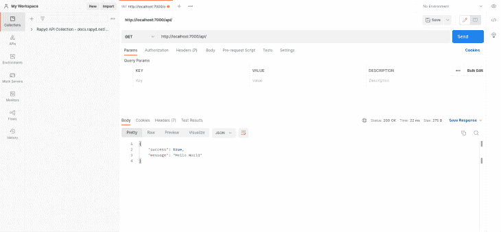
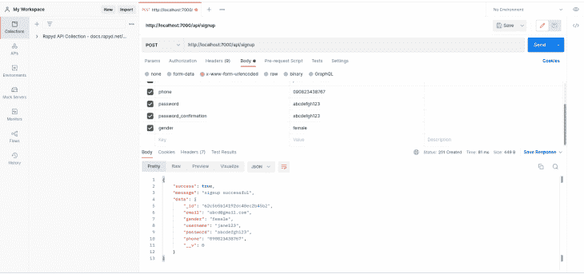
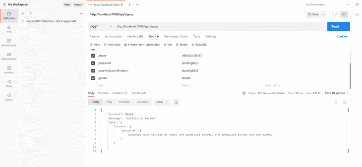
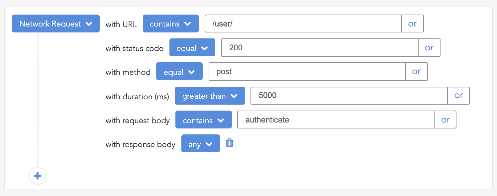

# 如何使用 validatorjs - LogRocket Blog 处理 Node.js 中的数据验证

> 原文：<https://blog.logrocket.com/handle-data-validation-node-js-validatorjs/>

***编者按:*** *本文最后一次更新于 2022 年 7 月 6 日，以使其与 Node.js 的最新版本保持一致*

## 介绍

构建后端 API 伴随着许多麻烦，其中之一就是用户输入验证。为输入数据增加一层额外的验证非常重要，因为你永远不能只依赖用户的输入。

Node.js 中执行输入验证的方法有很多，但在本文中，我们将讨论 [validatorjs](https://github.com/mikeerickson/validatorjs) ，这是一个受 [Laravel 框架的验证器](https://laravel.com/docs/9.x/validation#main-content)启发的验证库。

validatorjs 库简化了 JavaScript 中的数据验证。从官方网站来看，validatorjs 的一些优点是:

*   能够在浏览器和节点中工作
*   可读和声明性验证规则
*   多语言支持的错误消息
*   CommonJS/browser 验证支持
*   ES6 支持

### 内容

## 装置

让我们启动以下命令来初始化项目目录:

```
// clone starter application
git clone -b validation-starter https://github.com/lawrenceagles/validatorjs-example

// Enter app folder and install packages
cd validatorjs-example && npm install

```

在上面的代码中，我们安装了以下依赖项:

*   Express 是一个轻量级节点 web 框架，用于构建 RESTful APIs。我们将使用它来处理后端 API 中的路由
*   [body-parser](https://www.npmjs.com/package/body-parser) ，一个将传入的请求输入解析到我们的`req.body`对象中的中间件
*   [mongose](https://mongoosejs.com/docs/)，MongoDB 的对象建模工具。这将有助于创建和查询我们的`User`模式
*   [morgan](https://www.npmjs.com/package/morgan) ，Node 的 HTTP 请求记录器中间件。这将帮助我们在开发过程中调试我们的 API
*   [validatorjs](https://github.com/mikeerickson/validatorjs)
*   [Bcryptjs](https://www.npmjs.com/package/bcryptjs)

我们还安装了 [Nodemon](https://blog.logrocket.com/nodemon-tutorial-automatically-restart-node-js-apps-with-nodemon/) 作为开发依赖项。

## 用 validatorjs 进行基本验证

在这里，我们将学习如何在节点项目中执行基本的输入验证。

validatorjs 包为我们提供了一个带有以下签名的`Validator`构造函数:

```
let validation = new Validator(data, rules [, customErrorMessages]);

```

在上面的代码中，`Validator`构造函数有三个参数:

*   `data`，包含要验证的数据的对象
*   `rules`，包含验证规则的对象
*   `customErrorMessages`，一个包含要返回的自定义错误消息的对象(此参数是可选的)

为了使用 validatorjs，我们将编写一个简单的验证中间件来验证注册时的用户输入。为此，启动系统中的`MongoDB`驱动程序，并通过运行以下命令启动应用程序的开发服务器:

```
npm run dev

```

应用程序样板文件附带了一个简单的端点，您可以对其进行测试。在服务器运行的情况下，使用您喜欢的 API 客户机在`[http://localhost:7000/api/](http://localhost:7000/api/)`上运行一个`GET`请求。



现在，更新`helper`文件夹中的`validate.js`文件，如下所示:

```
const Validator = require('validatorjs');
const validator = async (body, rules, customMessages, callback) => {
    const validation = new Validator(body, rules, customMessages);
    validation.passes(() => callback(null, true));
    validation.fails(() => callback(validation.errors, false));
};
module.exports = validator;

```

上面的代码片段显示了如何以[和](https://en.wikipedia.org/wiki/Asynchronous_module_definition)格式初始化 validatorjs 包。当编写多个验证中间件时，这种方法简化了我们的代码。

现在更新验证中间件。中间件文件夹中的`validation-middleware.js`文件应该如下所示:

```
const validator = require('../helpers/validate');
const signup = async (req, res, next) => {
    const validationRule = {
        "email": "required|string|email",
        "username": "required|string",
        "phone": "required|string",
        "password": "required|string|min:6|confirmed",
        "gender": "string"
    };

    await validator(req.body, validationRule, {}, (err, status) => {
        if (!status) {
            res.status(412)
                .send({
                    success: false,
                    message: 'Validation failed',
                    data: err
                });
        } else {
            next();
        }
    }).catch( err => console.log(err))
}
module.exports = {
    signup
};

```

在上面的代码片段中，我们定义了一个包含验证规则的注册函数和扩展验证器构造函数的验证器高阶函数。这个验证器高阶函数接受四个参数:

*   要验证的数据
*   验证规则
*   自定义错误消息(如果有)
*   回调方法。

为了将验证规则应用到我们的请求体(`req.body`)，对象键名必须相同。例如，电子邮件字段验证规则如下所示:

```
"email": "required|email"

```

让我们回顾一下上面代码片段中使用的一些验证规则及其含义:

*   `required`表示字段长度必须大于零
*   `string`表示该字段必须是字符串
*   `email`表示正在验证的字段必须是电子邮件格式(如`[[email protected]](/cdn-cgi/l/email-protection)`)
*   `min:6`表示表示字段字符串长度必须大于或等于六位
*   `confirmed`表示被验证的字段必须有一个带有匹配值的匹配字段`foo_confirmation`，通常用于密码确认字段

现在我们知道了我们的验证规则以及它们的含义，更新`baseController.js`文件中的`signup`方法，如下所示:

```
// src/controllers/base-controller.js
const { User } = require("../models");

module.exports = {
 ...
    signup: async (req, res) => {
        const { email, gender, username, password, phone } = req.body;
        const newUser = new User({ email, gender, username, password, phone });
        try {
            await newUser.save();
            return res.status(201).json({
                success: true,
                message: "signup successful",
                data: newUser
            });
        } catch (error) {
            return res.status(412).send({
                success: false,
                message: error.message
            })
        }
    }

```

上面的代码片段通过在 MongoDB 数据库中创建和保存一个新用户来处理注册。并且只有当`req.body`对象通过验证时，`signup`方法才会执行。

成功的请求如下所示:



失败的请求如下所示:


注意，上面查询的端点是[http://localhost:7000/API/sign up](http://localhost:7000/api/signup)，它是一个`POST`请求。

## validatorjs 的高级验证规则

在本节中，我们将学习如何为这些用例编写自定义验证规则:

1.  实施严格的密码策略
2.  数据库中已经存在电子邮件/用户名属性

为了开始第一个用例，我们将更新`validate.js`文件，如下所示:

```
// src/helpers/validate.js
const Validator = require('validatorjs');
...
const passwordRegex = /^(?=.*[a-z])(?=.*[A-Z])(?=.*\d)[a-zA-Z\d]/;

// Tighten password policy
Validator.register('strict', value => passwordRegex.test(value),
    'password must contain at least one uppercase letter, one lowercase letter and one number');

module.exports = validator;

```

上面的代码片段使用 [regex](https://developer.mozilla.org/en-US/docs/Web/JavaScript/Guide/Regular_Expressions) 通过`strict`验证规则来验证输入字段的输入值。

更新`validationRule`对象，如下所示:

```
// src/middleware/validation-middleware.js
     ...
    const validationRule = {
            "email": "required|email",
            "username": "required|string",
            "phone": "required|string",
            "password": "required|string|min:6|confirmed|strict",
            "gender": "string"
    }
     ...

```

失败验证的请求和响应示例如下所示:



对于第二个用例，我们希望检查 email 或 username 属性是否已经存在，我们将对数据库进行异步调用来检查数据库并相应地返回一个错误。

我们将使用`Validator.registerAsync()`，这将使我们能够对我们的数据库进行非阻塞调用，并同时验证其他字段。

为此，首先将`Models`导入到`validate.js`文件中，代码如下:

```
const Models = require("../models");

```

然后更新`validate.js`文件，如下所示:

```
// src/helpers/validate.js
const Validator = require('validatorjs');
const Models = require("../models");
...

/**
 * Checks if incoming value already exist for unique and non-unique fields in the database
 * e.g email: required|email|exists:User,email
 */
Validator.registerAsync('exist', function(value,  attribute, req, passes) {
    if (!attribute) throw new Error('Specify Requirements i.e fieldName: exist:table,column');
    //split table and column
    let attArr = attribute.split(",");
    if (attArr.length !== 2) throw new Error(`Invalid format for validation rule on ${attribute}`);

    //assign array index 0 and 1 to table and column respectively
    const { 0: table, 1: column } = attArr;
    //define custom error message
    let msg = (column == "username") ? `${column} has already been taken `: `${column} already in use`
    //check if incoming value already exists in the database
    Models[table].valueExists({ [column]: value })
    .then((result) => {
        if(result){
            passes(false, msg); // return false if value exists
            return;
        }
        passes();
    })
});

module.exports = validator;

```

上面的代码片段接受表名和列名作为属性，并使用这些值在数据库中查询指定表和列中已经存在的值。

现在，让我们更新`signup`验证中间件中的验证规则，如下所示:

```
// src/middleware/validation-middleware.js
...

const validationRule = {
        "email": "required|email|exist:User,email",
        "username": "required|string|exist:User,username",
        "phone": "required|string",
        "password": "required|string|min:6|confirmed|strict",
        "gender": "string"
}

...

```

上面的代码片段检查数据库中是否已经存在 email 和 username 的值。下图显示了一个失败的请求示例:


## 结论

在本教程中，我们学习了如何用 validatorjs 进行基本的输入验证。我们还学习了如何为两个用例定义定制的验证规则。Validatorjs 有比本教程更多的预定义规则。你可以在这里了解更多[。](https://github.com/skaterdav85/validatorjs)

本教程的源代码也可以在 GitHub 上找到。请随意克隆它、派生它或提交一个问题。

## 200 只显示器出现故障，生产中网络请求缓慢

部署基于节点的 web 应用程序或网站是容易的部分。确保您的节点实例继续为您的应用程序提供资源是事情变得更加困难的地方。如果您对确保对后端或第三方服务的请求成功感兴趣，

[try LogRocket](https://lp.logrocket.com/blg/node-signup)

.

[](https://lp.logrocket.com/blg/node-signup)[https://logrocket.com/signup/](https://lp.logrocket.com/blg/node-signup)

LogRocket 就像是网络和移动应用程序的 DVR，记录下用户与你的应用程序交互时发生的一切。您可以汇总并报告有问题的网络请求，以快速了解根本原因，而不是猜测问题发生的原因。

LogRocket 检测您的应用程序以记录基线性能计时，如页面加载时间、到达第一个字节的时间、慢速网络请求，还记录 Redux、NgRx 和 Vuex 操作/状态。

[Start monitoring for free](https://lp.logrocket.com/blg/node-signup)

.