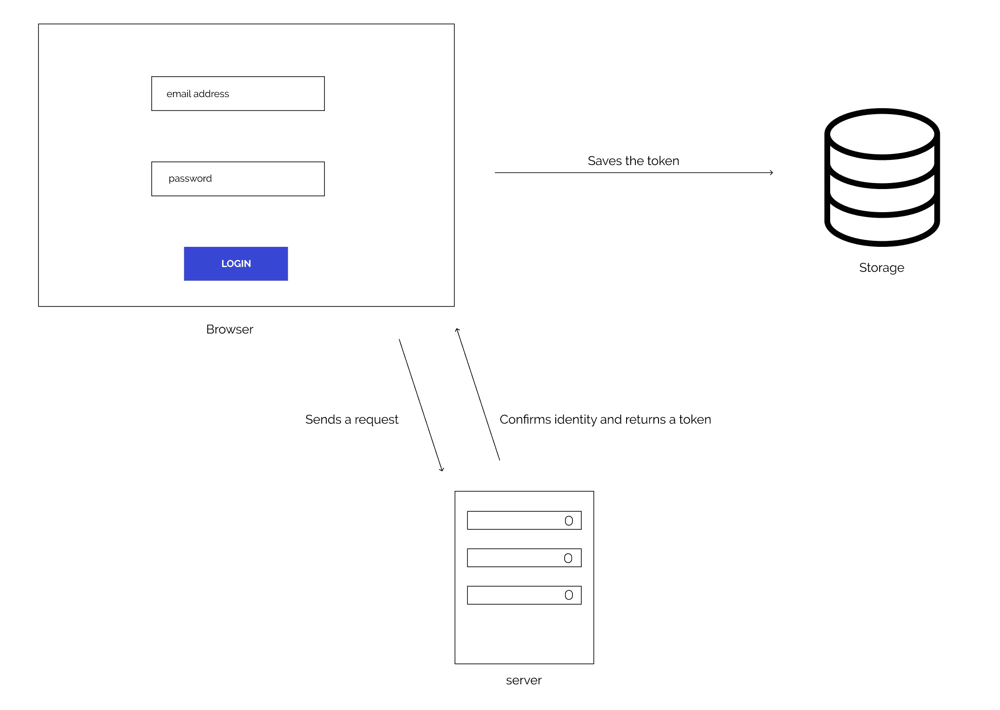
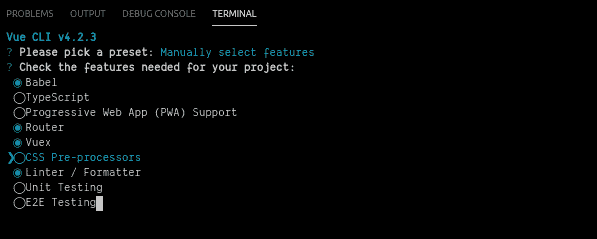
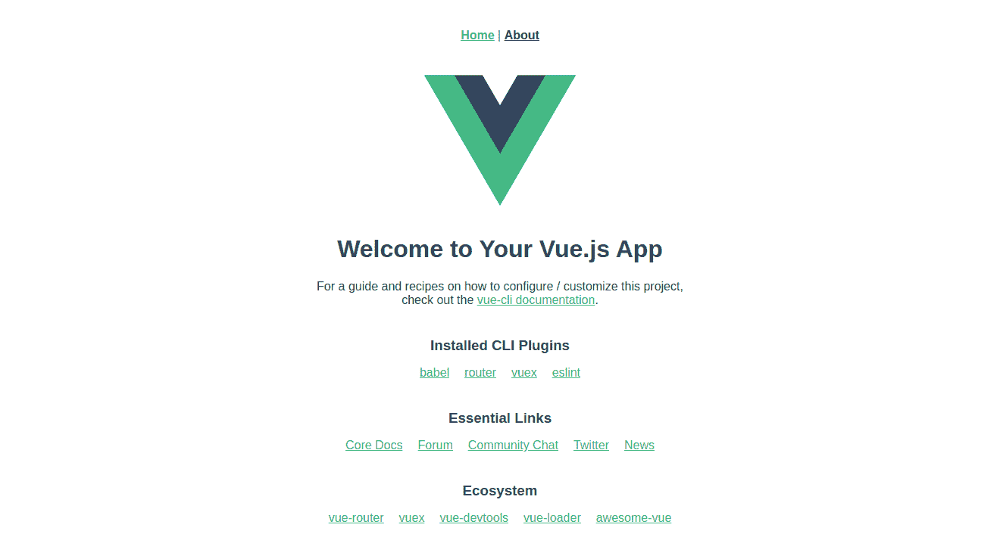
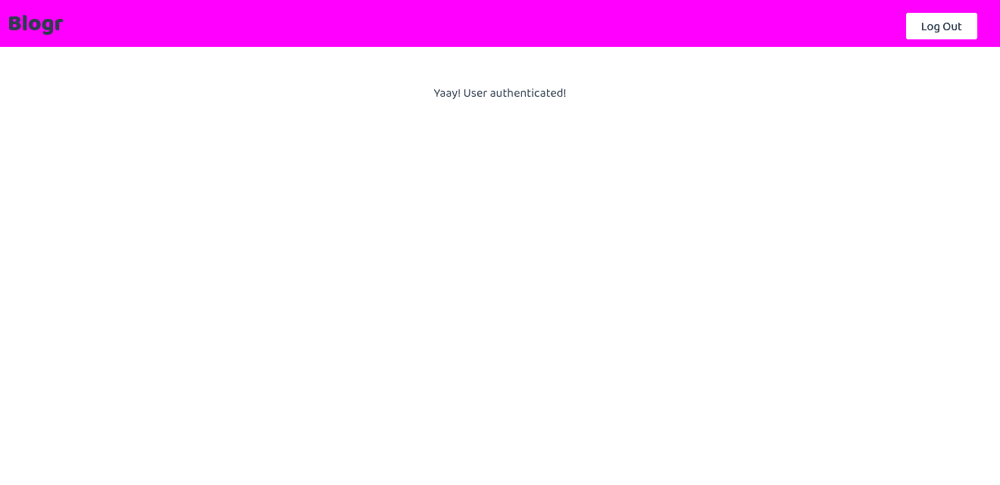
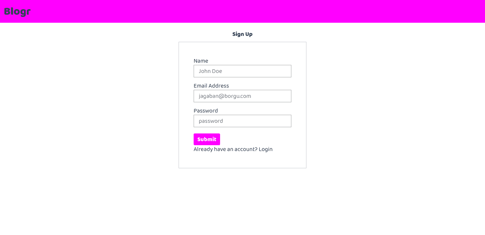
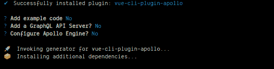
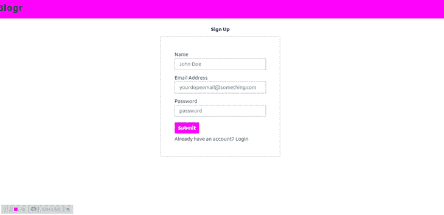

# 在你的 GraphQL 支持的 Vue 应用中处理认证

> 原文：<https://blog.logrocket.com/handling-authentication-in-your-graphql-powered-vue-app/>

身份验证的主要目标是识别请求资源的人。在开发应用程序时，这是一个非常棘手的问题，因为在我们的应用程序中没有处理身份验证的“一刀切”的规则。

在基于 web 的应用程序中，在客户端处理身份验证甚至更加棘手，因为存在诸如跨站点脚本(XSS)之类的安全问题，在跨站点脚本中，攻击者访问存储在浏览器中的信息，并使用它来伪装成用户。大多数 spa 实现基于令牌的身份验证，因为令牌是无状态的，并且它们很容易扩展，因为它消除了服务器跟踪会话状态的压力。

现代应用程序中的用户认证流程通常是这样的:

*   客户端向身份验证路由发送一个请求，其中包含电子邮件地址和密码等用户信息
*   服务器检查用户的身份，创建一个 JSON web 令牌(JWT ),并将其发送回浏览器
*   客户端将令牌存储到浏览器存储介质(API)之一中
*   客户端将令牌附加到授权头，以便向服务器发出后续请求



有三个存储选项可用于在客户端上保存令牌，它们包括:

*   局部存储器
*   会话存储
*   饼干

在本教程中，我们将了解如何在连接到 GraphQL API 的 Vue 应用程序中处理认证，我们将通过构建一个迷你应用程序来实现这一点。我们将利用本地存储来存储我们的令牌。

我们将要连接的 API 可以在[这里](https://bloggr-api.herokuapp.com/)找到。

## 先决条件

本教程假设读者具备以下条件:

您可以使用 Yarn 通过以下命令安装 Vue CLI:

```
yarn global add @vue/cli
```

我们将用于构建应用的工具包括:

Vue-Apollo —这是 Vue.js 的 Apollo 客户端集成，它有助于将 GraphQL 集成到我们的 Vue.js 应用中！

Vuex 是 Vue.js 应用程序的状态管理模式库，它是应用程序中所有组件的集中存储。它深受由[脸书](https://facebook.github.io/flux/)创造的[通量建筑模式](https://facebook.github.io/flux/docs/in-depth-overview/)的影响。

[Vue Router](https://router.vuejs.org/) —这是 [Vue.js](http://vuejs.org/) 的官方路由库，它使我们的 Vue.js 应用程序中的路由更容易。

## 入门指南

我们将使用 Vue CLI 工具来引导一个新的 Vue 项目，该工具帮助我们不必担心开始使用我们的应用程序的配置，因为我们可以手动选择我们的应用程序所需的包。

首先，我们使用`create`命令创建一个新项目:

```
vue create blogr
```

将向下箭头键移动到“手动选择功能”，按 enter 并选择以下功能:



接下来，使用以下命令将目录切换到项目文件夹:

```
cd blogr
```

使用命令启动您的项目:

```
yarn serve
```

在运行 yarn serve 命令后，您应该看到您的应用程序在 [http://localhost:8080](http://localhost:8080) 上运行。



## 创建用户界面

打开位于`src`文件夹中的`App.vue`文件，删除以下代码行:

```
<div id="nav">
  <router-link to="/">Home</router-link> |
  <router-link to="/about">About</router-link>
</div>
```

用以下内容替换删除的内容:

```
<header class="header">
  <div class="app-name">Blogr</div>
    <div v-if="authStatus" id="nav">
      <div>{{user.name}}</div>
      <button class="auth-button" @click="logOut" > Log Out</button>
    </div>
</header>
```

我们正在获取经过身份验证的用户的名字，并创建了一个触发`logOut`方法的注销按钮。

接下来，导航到`src/views`并创建一个`Register.vue`文件，并在文件中包含以下代码行:

```
<template>
  <div class="auth">
    <h3>Sign Up</h3>
    <form action="POST" @submit.prevent="registerUser">
      <label for="name"> Name</label>
      <input type="text" name="name"  placeholder="John Doe" v-model="authDetails.name" />
      <label for="email">Email Address</label>
      <input type="email" name="email"  placeholder="[email protected]" v-model="authDetails.email" />
      <label for="password">Password</label>
      <input type="password" name="password" placeholder="password" v-model="authDetails.password" />
      <button class="auth-submit">submit</button>
     <p class="auth-text"> Already have an account? <router-link to="/login"> Login </router-link> </p>
    </form>
  </div>
</template>
<script>
import { mapActions } from 'vuex'
export default {
  name: 'Register',
  data () {
    return {
      authDetails: {
        name: '',
        email: '',
        password: ''
      }
    }
  },
  methods: {
    registerUser: function () {

    }
  }
}
</script>
```

在这个代码块中，我们创建了一个没有任何功能的注册页面，单击 submit 按钮触发了`registerUser`方法，它现在什么都不做。

我们使用 v-model 在我们的输入框中创建一个到`authDetails`的双向数据绑定，如果表单的值改变了，那么`authDetails`中的值也会随之改变。

让我们给我们的应用程序添加一些样式，在`/src/assets`中创建一个`styles`文件夹。在`src`文件夹中创建一个`index.css`文件，包括以下内容:

```
.header {
    display: flex;
    justify-content: space-between;
    background-color: fuchsia;
    height: 25%;
    padding: 1rem;
}
.app-name {
    font-weight: 900;
    font-size: 3rem;
}
.auth {
    display: flex;
    flex-direction: column;
    align-items: center;
}
.auth h3 {
    margin-top: 2rem;
}
form {
    max-width: 50%;
    margin-top: 1rem;
    padding: 4rem;
    border: 1px solid #c4c4ce;
}
form input {
    display: block;
    margin-bottom: 1.2rem;
    padding: 0.4rem 1.2rem;
    background-color: white;
}
.auth-submit {
    margin-top: .5rem;
    padding: .5rem 1rem;
    border: none;
    background-color: fuchsia;
    color: white;
    font-weight: bold;
    text-transform: capitalize;
    border-radius: 0.3rem;
}
.auth-text a {
    color: black;
    text-decoration: none;
}
.auth-text a:visited {
    color: inherit;
}
.auth-text a:hover {
    text-decoration: underline;
}
.auth-text {
    margin-top: .5rem;
}
.auth-button{
    margin: .7rem 2rem 0 0;
    padding: .5rem 2rem;
    background-color: white;
    border: none;
    border-radius: .3rem;
}
main{
    margin-top: 5rem;
    display: flex;
    justify-content: center;
}
```

接下来，让我们构建登录页面，在`src/views`中创建一个`Login.vue`文件，并在其中包含以下内容:

```
<template>
  <div class="auth">
    <h3>Log In</h3>
    <form action="POST" @submit.prevent="loginUser">
      <label for="email">Email Address</label>
      <input type="email" name="email"  placeholder="[email protected]" v-model="authDetails.email" />
      <label for="password">Password</label>
      <input type="password" name="password" placeholder="password" v-model="authDetails.password" />
      <button class="auth-submit">submit</button>
     <p class="auth-text"> Don't have an account? <router-link to="/"> Register </router-link> </p>
    </form>
  </div>
</template>
<script>
import { mapActions } from 'vuex'
export default {
  name: 'Login',
  data () {
    return {
      authDetails: {
        email: '',
        password: ''
      }
    }
  },
  methods: {
    loginUser: function () {

    }
  }
}
</script>
```

这个页面类似于我们的`Register.vue`页面，点击提交按钮触发`loginUser`方法，它现在不做任何事情。

接下来，用以下内容替换`Home.vue`的内容:

```
<template>
  <div class="home">
    <main>
     Yaay! User authenticated!
    </main>
  </div>
</template>
<script>
// @ is an alias to /src

export default {
  name: 'Home',
  components: {
  },
  computed: {

  }
}
</script>
```

该页面将作为我们的仪表板页面，在用户通过身份验证后向他们显示:



## 配置路线

接下来，让我们在位于`src/router/`的路由器文件中包含登录、注册和仪表板页面的路由。

删除`routes`数组中的内容，并将以下内容添加到`index.js`文件中:

```
{
   path: '/dashboard',
   name: 'Home',
   component: () => import('@/views/Home.vue'),
 },
 {
   path: '/login',
   name: 'Login',
   // route level code-splitting
   // this generates a separate chunk (login.[hash].js) for this route
   // which is lazy-loaded when the route is visited.
   component: () => import(/* webpackChunkName: "login" */ '@/views/Login.vue')
 },
 {
   path: '/',
   name: 'Register',
   // route level code-splitting
   // this generates a separate chunk (register.[hash].js) for this route
   // which is lazy-loaded when the route is visited.
   component: () => import(/* webpackChunkName: "register" */ '@/views/Register.vue')
 },
 {
   path: '*',
   redirect: 'login'
 }
```

这些路线利用了 Webpack 的代码分割和延迟加载，这本质上提高了我们的应用程序性能。

我们还添加了一个`*`——这就是所谓的通配符路由器。如果请求的 URL 与任何定义的路由都不匹配，路由器将选择此路由，用户将被重定向到登录页面。

当您访问`localhost:8080`时，我们的应用程序现在看起来应该与此类似:



## 使用 Vue-Apollo 安装 Apollo 客户端

Apollo Client 是一个完整的 GraphQL 客户端，用于您的 UI 框架，它帮助您连接到 GraphQL 服务器，检索数据，并修改数据。

要将 Apollo 集成到我们的 Vue 应用程序中，我们必须为 vue-cli 安装 vue-apollo 插件:

```
vue add apollo
```



这个插件创建了两个文件，在项目根目录下的`apollo.config.js`和在`src`文件夹下的`vue-apollo.js`，它还在`main.js`的 Vue 实例中注入了 Apollo provider。

这个提供者使得在我们的 Vue 组件中使用 Apollo 客户端实例成为可能。接下来，让我们对位于`/src`文件夹中的`vue-apollo.js`文件进行一些配置。

在文件内容的顶部包括以下内容:

```
import { setContext } from 'apollo-link-context'
```

这有助于我们在向 HTTP 请求添加`authorization`头时利用`setContext`方法。

接下来，我们更改将要连接的`httpEndpoint`。用以下内容替换您的`httpEndpoint`变量的值:

```
const httpEndpoint = process.env.VUE_APP_GRAPHQL_HTTP || 'https://bloggr-api.herokuapp.com/'
```

定义`httpEndpoint`后，立即添加以下内容:

```
const authLink = setContext(async (_, { headers }) => {
  // get the authentication token from local storage if it exists
  const token = JSON.parse(localStorage.getItem('apollo-token'))
  // Return the headers to the context so httpLink can read them
  return {
    headers: {
      ...headers,
      authorization: token || ''
    }
  }
})
```

接下来，我们用`authLink`覆盖默认的 Apollo 链接，在`defaultOptions`对象中放置以下内容:

```
link: authLink
```

`defaultOptions`对象为`apolloClient`设置应用程序范围的默认值。

让我们继续用我们的`defaultOptions`对象作为值创建我们的`apolloClient`实例，我们用`export`导出它，这样我们就可以在我们的`vuex`商店中访问`apolloClient`:

```
export const { apolloClient, wsClient } = createApolloClient({
  ...defaultOptions
  // ...options
})
```

接下来，用以下内容替换`createProvider`功能:

```
export function createProvider () {
  // Create vue apollo provider
  const apolloProvider = new VueApollo({
    defaultClient: apolloClient,
    defaultOptions: {
      $query: {
        fetchPolicy: 'cache-and-network'
      }
    },
    errorHandler (error) {
      // eslint-disable-next-line no-console
      console.log('%cError', 'background: red; color: white; padding: 2px 4px; border-radius: 3px; font-weight: bold;', error.message)
    }
  })
  return apolloProvider
}
```

一旦我们的应用程序被初始化，`createProvider`函数就在`main.js`文件中被调用，它将 Apollo 客户端实例注入到我们的 Vue 应用程序中，并使得在我们的组件中使用 Apollo 成为可能。

## 查询和突变

在你的`/src`文件夹中创建一个名为`graphql`的文件夹，在里面用下面的命令创建两个文件:

```
touch queries.js mutations.js
```

`queries.js`文件将包含对我们的 GraphQL 服务器的查询，`Query`是对 API 检索数据的请求。查询类似于[REST API](https://blog.logrocket.com/the-essential-guide-for-designing-a-production-ready-developer-friendly-restful-api/)中的`HTTP GET`请求。

`mutations.js`文件包含对 GraphQL 服务器的修改，`Mutations`是改变 Apollo 服务器中数据状态的查询。突变类似于[REST API](https://blog.logrocket.com/the-essential-guide-for-designing-a-production-ready-developer-friendly-restful-api/)中的`HTTP PUT`、`POST`或`DELETE`请求。

接下来，在我们的`mutations.js`文件中添加以下代码行:

```
import gql from 'graphql-tag'
export const LOGIN_USER = gql`
mutation login ($email: String! $password: String! ){
  login(email: $email password: $password ){
    token
  }
}
`
export const REGISTER_USER = gql`
mutation createUser($name: String! $email: String! $password: String! ) {
    createUser( name: $name, email: $email, password: $password) {
      token
    }
}
`
```

`gql`帮助我们编写 GraphQL 查询，我们已经为登录和创建新用户创建了变异，我们表单的内容作为变异的变量。

在我们的`queries.js`文件中，包含以下查询，该查询获取当前经过身份验证的用户:

```
import gql from 'graphql-tag'

export const LOGGED_IN_USER = gql`
  query {
    me {
      id
      name
      email
    }
  }
`
```

## 配置 Vuex

首先，让我们导入我们的`Mutations`、`Queries`和`apolloClient`实例:

```
import { apolloClient } from '@/vue-apollo'
import { LOGGED_IN_USER } from '@/graphql/queries'
import { LOGIN_USER, REGISTER_USER } from '@/graphql/mutations'
```

导入`apolloClient`实例使我们能够在商店中执行 Apollo 操作。

接下来，设置我们将在`state`中需要的数据，将以下内容放入`state`对象中:

```
token: null,
user: {},
authStatus: false
```

[状态对象](https://vuex.vuejs.org/guide/state.html)是将在应用程序范围内使用的数据的中央存储。它代表了“真理的单一来源”。

`authStatus`是一个布尔值，它告诉用户是否通过了身份验证，用户对象将包含通过身份验证的用户的详细信息。

接下来，我们配置我们的`getters`，在`getters`对象中包含以下内容:

```
isAuthenticated: state => !!state.token,
authStatus: state => state.authStatus,
user: state => state.user
```

[Getters](https://vuex.vuejs.org/guide/getters.html) 帮助在我们的状态对象中检索项目，getter 的结果基于它的依赖关系被缓存，并且只有当它的一些依赖关系改变时才会重新评估。

继续创建新的[突变](https://vuex.vuejs.org/guide/mutations.html)，在`mutations`对象中:

```
SET_TOKEN (state, token) {
  state.token = token
},
LOGIN_USER (state, user) {
  state.authStatus = true
  state.user = { ...user }
},
LOGOUT_USER (state) {
  state.authStatus = ''
  state.token = '' && localStorage.removeItem('apollo-token')
}
```

我们创建了突变来改变 Vuex 存储中的状态，突变函数是同步的，它们通常采用两个参数——状态对象和有效载荷，有效载荷可以是变量或对象。

最后，让我们配置我们的`actions`、[动作](https://vuex.vuejs.org/guide/actions.html)是用于提交突变的异步函数。用`store.dispatch`方法触发动作:

```
async register ({ commit, dispatch }, authDetails) {
     try {
       const { data } = await apolloClient.mutate({ mutation: REGISTER_USER, variables: { ...authDetails } })
       const token = JSON.stringify(data.createUser.token)
       commit('SET_TOKEN', token)
       localStorage.setItem('apollo-token', token)
       dispatch('setUser')
     } catch (e) {
       console.log(e)
     }
   },
   async login ({ commit, dispatch }, authDetails) {
     try {
       const { data } = await apolloClient.mutate({ mutation: LOGIN_USER, variables: { ...authDetails } })
       const token = JSON.stringify(data.login.token)
       commit('SET_TOKEN', token)
       localStorage.setItem('apollo-token', token)
       dispatch('setUser')
     } catch (e) {
       console.log(e)
     }
   },
   async setUser ({ commit }) {
     const { data } = await apolloClient.query({ query: LOGGED_IN_USER })
     commit('LOGIN_USER', data.me)
   },
   async logOut ({ commit, dispatch }) {
     commit('LOGOUT_USER')
   }
```

现在我们的商店已经配置好了，让我们向我们的登录和注册表单添加功能，在您的`Register.vue`文件的`script`部分包含以下内容:

```
<script>
import { mapActions } from 'vuex'
  ....
  methods: {
    ...mapActions(['register']),
    registerUser: function () {
      this.register(this.authDetails)
        .then(() => this.$router.push('/dashboard'))
    }
  }
...
```

为了在我们的组件中分派动作，我们使用了将组件方法映射到`*this*.$store.dispatch`的`mapActions`助手。

上面的代码将表单细节作为有效载荷发送给 Vuex 存储中的`register`动作，然后将路由更改为`/dashboard`。

在您的`Login.vue`文件中包含以下内容:

```
<script>
import { mapActions } from 'vuex'
....
  methods: {
    ...mapActions(['login']),
    loginUser: function () {
      this.login(this.authDetails)
        .then(() => this.$router.push('/dashboard'))
    }
  }
...
```

在您的`Home.vue`文件的`script`部分包含以下内容，以获取用户详细信息:

```
<script>

import { mapGetters } from 'vuex'
....
  computed: {
    ...mapGetters(['user'])
  }
....
</script>
```

`mapGetters`助手只是将存储 getters 映射到本地计算属性。

## 守卫路线

在您的`router`文件的顶部导入`vuex`存储:

```
import store from '../store'
```

给我们的`/dashboard`路线添加一个`meta`字段，这个`meta`帮助我们定义我们的路线导航守卫中间件。我们的仪表板路线记录看起来如下:

```
{
  path: '/dashboard',
  name: 'Home',
  component: () => import('@/views/Home.vue'),
  meta: { requiresAuth: true }
},
```

在`export default router`之前包括以下内容:

```
router.beforeEach((to, from, next) => {
    // Check if the user is logged i
  const isUserLoggedIn = store.getters.isAuthenticated
  if (to.matched.some(record => record.meta.requiresAuth)) {
    if (!isUserLoggedIn) {
      store.dispatch('logOut')
      next({
        path: '/login',
        query: { redirect: to.fullPath }
      })
    } else {
      next()
    }
  } else {
    next()
  }
})
```

这为我们的路线记录定义了导航保护。当我们使用`requiresAuth`元字段导航到任何路由时，它会检查用户是否已经过身份验证并被授权访问该路由，如果用户没有被授权，它会将用户重定向到登录页面。

我们完成的应用程序应该如下所示:



## 结论

在这篇文章中，我们看到了如何用 vue-router、vue-apollo 和 Vuex 处理我们的 GraphQL APIs 的认证。你可以在这里了解更多关于 Apollo GraphQL 的信息，你也可以在 [LogRocket](https://blog.logrocket.com/tag/graphql/) 博客上了解更多关于 GraphQL 的信息。在 GitHub 上查看这个教程的[库](https://github.com/Jolaolu/graphql-vue-auth)，它可以作为模板来搭建你的应用。您还可以查看 GraphQL API [库](https://github.com/Jolaolu/graphql-blog-api)和我们的[应用](https://blogr.jola.now.sh/)的部署版本。

## 像用户一样体验您的 Vue 应用

调试 Vue.js 应用程序可能会很困难，尤其是当用户会话期间有几十个(如果不是几百个)突变时。如果您对监视和跟踪生产中所有用户的 Vue 突变感兴趣，

[try LogRocket](https://lp.logrocket.com/blg/vue-signup)

.

[](https://lp.logrocket.com/blg/vue-signup)[https://logrocket.com/signup/](https://lp.logrocket.com/blg/vue-signup)

LogRocket 就像是网络和移动应用程序的 DVR，记录你的 Vue 应用程序中发生的一切，包括网络请求、JavaScript 错误、性能问题等等。您可以汇总并报告问题发生时应用程序的状态，而不是猜测问题发生的原因。

LogRocket Vuex 插件将 Vuex 突变记录到 LogRocket 控制台，为您提供导致错误的环境，以及出现问题时应用程序的状态。

现代化您调试 Vue 应用的方式- [开始免费监控](https://lp.logrocket.com/blg/vue-signup)。