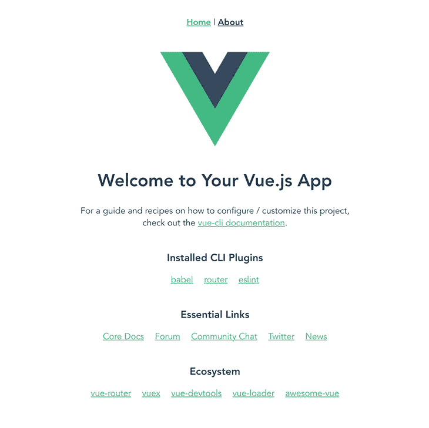
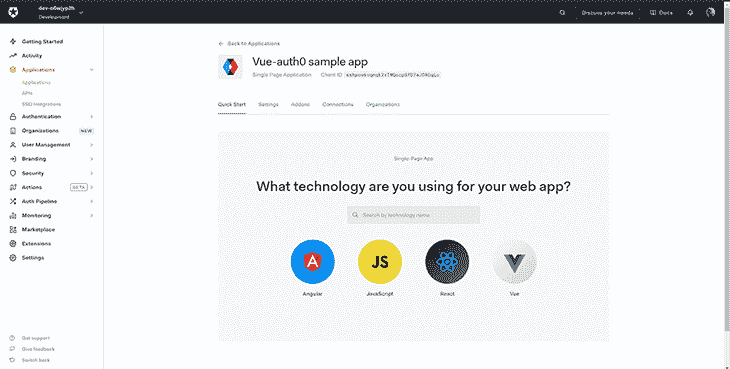
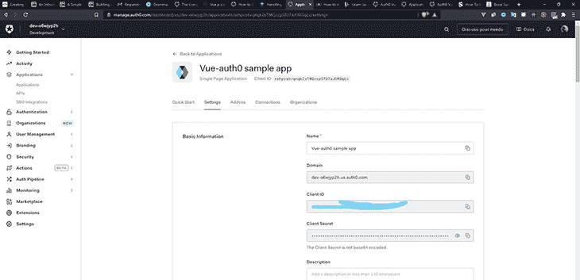
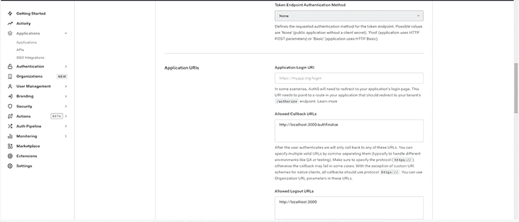
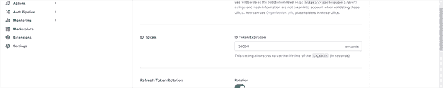
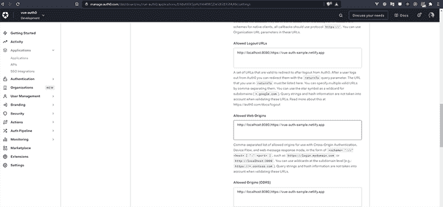
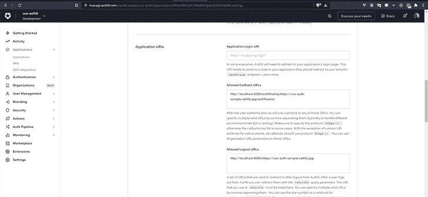

# 使用 Vuex、Vue 路由器和 Auth0 处理 Vue.js 中的认证

> 原文：<https://blog.logrocket.com/handling-authentication-vuejs-using-vuex-vue-router-and-auth0/>

身份验证是大多数现代 web 应用程序所需的安全性的关键要素。如果遭到破坏，它会将用户的数据暴露给不该暴露的人，从而给用户带来安全风险。许多现代 web 应用程序使用 [Auth0](https://auth0.com/) ，这是一个易于实现、适应性强的认证和授权平台，而不是从头开始处理认证。

Auth0 目前提供了一个 [SPA SDK](https://github.com/auth0/auth0-spa-js) 来处理 Vue 内的认证。然后，一个已经在文档中可用的 Vue 插件[包装了 SDK 的功能，这反过来提供了一个高级 API 抽象来处理认证实现的许多较小的细节。](https://auth0.com/docs/quickstart/spa/vuejs?framed=1&sq=1#configure-auth0)

在本教程中，您将学习如何使用 Auth0、传统 Vuex 和 Vue 路由器来实现认证，而不是像上面解释的那样使用插件和 SDK。最后，您将使用 Vue 和 Auth0 构建一个功能认证服务，并使用这些相同的过程在您选择的任何 web 应用程序中实现认证。我们开始吧！

## 安装 Vue CLI

我们将使用 Vue CLI 启动项目。如果您的系统上已经安装了 Vue CLI，您可以[跳到下一节](#setting-up-auth0)。

首先，您需要在系统上安装 Vue CLI。您可以使用以下命令进行全局安装:

```
npm install -g @vue/cli

```

我们现在可以使用 Vue CLI 来创建我们的项目。使用以下命令创建一个新项目:

```
vue create vue-sample-auth0

```

您将被要求选择一个预设。选择`Manually select features`，然后选择`Babel`、`Vuex`、`Router`和`Linter/Formatter`。

还会询问您是否要将`History mode`用于路由器—选择`Yes`。你可以选择任何你想要的棉绒，但在本教程中，我将使用 ESLint 和更漂亮。

创建项目后，导航到新项目文件夹:

```
cd vue-sample-auth0

```

然后启动服务器:

```
npm run serve

```

一旦服务器启动，您就可以打开浏览器查看它。您应该看到这个:



## 正在设置 Auth0

我们现在将安装 [Auth0 的库](https://www.npmjs.com/package/auth0-js)来处理客户端的认证:

```
npm i auth0-js

```

要开始使用 Auth0 ，您需要注册，创建一个新租户，并选择您所在的地区。然后，您可以继续执行以下步骤:

1.  在仪表盘上，点击**应用**。
    T3
2.  点击**创建应用**。
    T3
3.  该模式应该会弹出，您应该选择**单页面 Web 应用程序**。
    T3
4.  然后，我们可以从选项中选择 Vue。
    

## 配置您的 Auth0 设置

现在您已经创建了应用程序，是时候配置设置了。



您将在**基本信息**部分看到您的域名和客户端 ID。我们稍后会回到这个话题。首先，我们需要将这些值存储为环境变量，以便我们的应用程序能够工作。

在应用程序 URL 部分，我们需要定义这些值:

*   允许的回拨 URL
*   允许的注销 URL
*   允许的网站来源
*   允许原产地(CORS)

注意，您需要使用自己的本地 URL 来本地测试您的应用程序。

### 允许的回拨 URL

在用户成功登录后，您只需使用这些 URL 来重定向用户。我们将使用本地 URL:

```
http://localhost:8080/authfinalize

```

我将在本文后面解释为什么我们将用户发送到`authfinalize`路线。

### 允许的注销 URL

这些是 Auth0 可以用来在用户注销后重定向用户的 URL。

```
http://localhost:8080

```



### 允许的网站来源

这些是唯一允许向 Auth0 发送请求的 URL。您需要添加此 URL 以防止跨源资源共享(CORS)错误。现在，我们将添加本地 URL:

```
http://localhost:8080

```


### 允许原产地(CORS)

这些是唯一允许向服务器发出任何请求的 URL。

```
http://localhost:8080

```

在这里，我们必须以秒为单位设置我们的`id_token`到期时间。对于此示例站点，我们将使用 36，000 秒(10 小时):



现在，让我们回到我们的项目文件夹，为我们的本地开发创建一个`.env`文件。添加这些环境变量:

```
VUE_APP_AUTH0_CONFIG_RESPONSETYPE=token id_token
VUE_APP_AUTH0_CONFIG_SCOPE=openid profile email
VUE_APP_AUTH0_CONFIG_DOMAIN={{ Domain }}
VUE_APP_AUTH0_CONFIG_DOMAINURL=https://{{ Domain }}
VUE_APP_AUTH0_CONFIG_CLIENTID={{ ClientID }}
VUE_APP_DOMAINURL={{Local host URL}}
VUE_APP_DOMAINURL_REDIRECT={{ Allowed Callback URL }}
VUE_APP_EXPIRY=36000

```

这些变量将在我们的项目中使用。认证后将返回`access token`和`id_token`作为响应，用于验证被认证用户的身份。

`Domain`、`ClientID`、`Allowed Callback URL`都可以在**设置**页面找到。我们的`VUE_APP_AUTH0_CONFIG_DOMAIN`和`VUE_APP_AUTH0_CONFIG_DOMAINURL`唯一的区别就是我们需要在域名前面加上`https://`。Vue 中的所有环境变量都必须有前缀`VUE_APP`。

## 设置 Vuex

我们将 Vuex 视为应用程序的唯一真实来源，因此它将用于在应用程序中初始化 Auth0。我们还将使用它来处理应用程序中的数据。

首先，我们需要将`auth0-js`导入我们的应用程序，并设置我们的`state`。在我们的`state`中，我们将初始化 Auth0 并从上面讨论的环境变量中添加我们的应用程序细节。

```
import Vuex from "vuex";
import Vue from "vue";
import actions from "./auth/actions";
import getters from "./auth/getters";
import mutations from "./auth/mutations";
import auth0 from "auth0-js";
Vue.use(Vuex);
const state = () => ({
  userIsAuthorized: false,
  auth0: new auth0.WebAuth({
    domain: process.env.VUE_APP_AUTH0_CONFIG_DOMAIN,
    clientID: process.env.VUE_APP_AUTH0_CONFIG_CLIENTID,
    redirectUri: process.env.VUE_APP_DOMAINURL_REDIRECT,
    responseType: process.env.VUE_APP_AUTH0_CONFIG_RESPONSETYPE,
    scope: process.env.VUE_APP_AUTH0_CONFIG_SCOPE,
  }),
});
export default new Vuex.Store({
  namespaced: true,
  state,
  actions,
  getters,
  mutations,
});

```

我们将`userIsAuthorized`加到我们的`state`上来接受`boolean`。我们将使用它作为一个指示器来了解用户是否登录。请注意，在首次加载应用程序时，这将注册为 false。

## Vuex 动作

### `login`

使用 Auth0 对用户进行身份验证包括将用户发送到应用程序外部的 Auth0 门户。之后，我们将它们返回到我们的应用程序中。这个登录动作将在我们的组件中被调用来触发这个重定向。

```
//login.js

const login = ({state}) => {
    state.auth0.authorize()

}
export default login;
```

```
//logging in within the component

<template>
  <div class="home">
    <button @click="login">Login</button>
    <button @click="signup">Signup</button>
  </div>
</template>
<script>

export default {
  name: "Home",
  methods: {
    login() {
      this.$store.dispatch('login')
    },
    signup() {
      this.$store.dispatch('login')
    }
  }
};
</script>

```

### `authHandleAuthentication`

当用户返回到我们的应用程序时，`access token`和`id_token`作为响应被发送给我们。此操作设置令牌的到期时间，然后在将用户发送到安全页面或仪表板之前，在本地存储`access token`、`id_token`和到期时间。

该函数使用来自我们的`state`中的 Auth0 对象的`parseHash`来检查用户是否拥有`access token`和`id_token`，然后在将用户发送到仪表板之前将它们保存在本地。另一方面，如果有错误，用户会看到一个错误并被重定向回主页。

* * *

### 更多来自 LogRocket 的精彩文章:

* * *

```
//auth0HandleAuthentication.js

import router from '../../../router/index'
const auth0HandleAuthentication = (context) => {
  context.state.auth0.parseHash((err, authResult) => {
    if (authResult && authResult.accessToken && authResult.idToken) {
      let expiresAt = JSON.stringify(
        (process.env.VUE_APP_EXPIRY * 1000) + new Date().getTime()
      );
      // save the tokens locally
      localStorage.setItem("access_token", authResult.accessToken);
      localStorage.setItem("id_token", authResult.idToken);
      localStorage.setItem("expires_at", expiresAt);
      router.push({ name : "dashboard"})
    }
    else if (err) {
      alert("There's is an issue with signing up", err)
      router.replace({ name: "home" })
    }
  })
};
export default auth0HandleAuthentication;

```

### `logout`

我们使用`logout`按钮注销用户。用户需要回到 Auth0 的站点，才能完全退出我们的应用程序。然后，它使用我们之前添加的`Allowed Logout URLs`将它们发送回我们的应用程序。

```
//logout.js

const logout = () => {
  localStorage.removeItem("access_token");
  localStorage.removeItem("id_token");
  localStorage.removeItem("expires_at");
  window.location.href =
    process.env.VUE_APP_AUTH0_CONFIG_DOMAINURL +
    "/v2/logout?returnTo=" +
    process.env.VUE_APP_DOMAINURL +
    "/&client_id=" +
    process.env.VUE_APP_AUTH0_CONFIG_CLIENTID;
};
export default logout;

```

```
//logging out on the dashboard page

<template>
  <div class="hello">
    <h2>Here's the dashboard</h2>
    <button @click="logout">Logout</button>
  </div>
</template>
<script>
export default {
  name: 'Dashboard',
  methods: {
    logout() {
      this.$store.dispatch('logout')
    }
  }
}
</script>

```

## Vuex 突变

在我们的状态中，我们将只有一个突变用于触发我们的`userIsAuthorized`指示器。

```
 const setUserIsAuthenticated = (state, replacement) => {
    state.userIsAuthorized = replacement;
}

```

### `vue-router`

这是根据我们的路由保护中的特定条件触发操作和路由用户的地方。

用户流是直接的:

1.  用户尝试登录
2.  我们将用户发送到 Auth0 登录门户进行身份验证
3.  然后用`access token`、`id_token`等将它们发送回我们的应用程序(特别是`/authfinalize`页面)。
4.  我们将这些令牌与到期时间一起保存在本地，并将用户重定向到安全页面

在设置我们的路线时，我们将为每条路线添加`meta`对象。这将允许我们使用`requiresGuest`识别对每个人开放的路线，以及使用`requiresAuth`识别受保护的路线。

这些`meta`属性可以在路线位置和导航护栏上访问。

```
import Vue from "vue";
import VueRouter from "vue-router";
import Store from "../store"
import Home from "../views/Home.vue";
import Authfinalize from "../views/Authfinalize"
import Dashboard from "../views/Dashboard"
Vue.use(VueRouter);
const routes = [
  {
    path: "/",
    name: "home",
    component: Home,
    meta : {
      requiresGuest : true,
    }
  },
  {
    path: "/dashboard",
    name: "dashboard",
    component: Dashboard,
    meta : {
      requiresAuth : true
    }
  },
  {
    path: "/authfinalize",
    name: "Authfinalize",
    component: Authfinalize,
  },
];
const router = new VueRouter({
  mode: "history",
  base: process.env.BASE_URL,
  routes,
});
router.beforeEach((to, from, next) => {
  const requiresAuth = to.matched.some((x) => x.meta.requiresAuth);
  const requiresGuest = to.matched.some((x) => x.meta.requiresGuest);
  const auth0callback = to.matched.some(record=>record.path == "/authfinalize");
  let routerAuthCheck = false;  
  if(auth0callback) {
    Store.dispatch('auth0HandleAuthentication');
    next(false);
  }
  if( localStorage.getItem('access_token') && localStorage.getItem('id_token') && localStorage.getItem('expires_at') ){
    let expiresAt = JSON.parse(localStorage.getItem('expires_at'));
    routerAuthCheck = new Date().getTime() < expiresAt;  
  }
  Store.commit('setUserIsAuthenticated', routerAuthCheck); 
  if (requiresAuth) {  
    if(routerAuthCheck){
      next();
    }
    else{
      Store.dispatch('logout');
    }
  }

  if (requiresGuest && routerAuthCheck) {  
      next({ name: "dashboard" }); 
  } 
  next(); 
})

export default router;

```

在我们的`beforeEach` router guard 中，我们应该检查预期路由具有哪个`meta-object`,并相应地将其分配给一个`requiresAuth`或`requiresGuest`变量。如果我们导航到`/authfinalize`路径，我们也可以创建一个`auth0callback`变量。

然后，我们创建一个名为`routerAuthCheck`的变量，并将其赋给`false`。我们将使用这个变量来触发突变，这将改变我们之前谈到的 Vuex 中的指标。

第一个`if block`检查我们是否正在导航到`/authfinalize`路线，然后调用`auth0HandleAuthentication`。请注意，我们将导航到此路由的唯一时间是从 Auth0 重定向回来的时候。

第二个`if block`检查用户是否被认证，然后它发出一个`commit`，当用户登录时，它将我们的指示器切换到`true`，反之亦然。基本上，它检查本地存储以查看令牌和到期日期是否仍然存在。

然后，它进一步检查到期日期是否大于当前时间。`routerAuthCheck`将反映它是`true`还是`false`，然后它将提交到`setUserIsAuthenticated`突变，这将切换我们的应用程序指示器。

第三个`if` `block`检查预定路线是否需要认证(`requiresAuth`)，然后检查`routerAuthCheck`是`true`还是`false`。如果选择`true`，用户继续操作仪表板。如果`false`，用户被注销。

最后一个`if block`检查认证用户是否正在路由到主页(`requiresGuest`)。然后，它会自动将它们发送到仪表板。

## 部署您的应用

要部署应用程序，您需要将您的 live URL 添加到前面演示的每个设置中。用逗号分隔每个 URL。





请记住，您必须创建一个新的`.env`文件，并根据您用于部署的平台，在您的代码库或您要部署到的平台中设置 live 版本的 URL。

## 结论

虽然还有其他处理认证的方法，但是像 Auth0 这样的工具可以给你时间上的优势，同时你仍然可以确定你的应用程序的安全性。你可以[在 GitHub](https://github.com/Atanda1/vue-auth0-sample) 上查看我们的代码库，[在这里](https://vue-auth-sample.netlify.app/)找到演示站点。你也可以从 [Auth0 的文档](https://auth0.com/docs/libraries/auth0js)中了解更多。

## 像用户一样体验您的 Vue 应用

调试 Vue.js 应用程序可能会很困难，尤其是当用户会话期间有几十个(如果不是几百个)突变时。如果您对监视和跟踪生产中所有用户的 Vue 突变感兴趣，

[try LogRocket](https://lp.logrocket.com/blg/vue-signup)

.

[](https://lp.logrocket.com/blg/vue-signup)[https://logrocket.com/signup/](https://lp.logrocket.com/blg/vue-signup)

LogRocket 就像是网络和移动应用程序的 DVR，记录你的 Vue 应用程序中发生的一切，包括网络请求、JavaScript 错误、性能问题等等。您可以汇总并报告问题发生时应用程序的状态，而不是猜测问题发生的原因。

LogRocket Vuex 插件将 Vuex 突变记录到 LogRocket 控制台，为您提供导致错误的环境，以及出现问题时应用程序的状态。

现代化您调试 Vue 应用的方式- [开始免费监控](https://lp.logrocket.com/blg/vue-signup)。