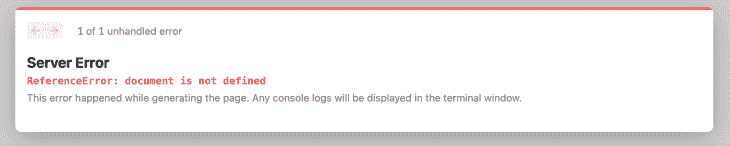
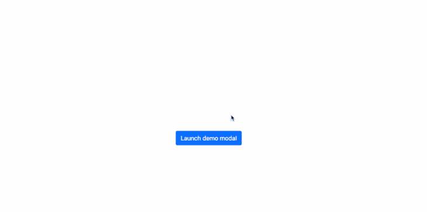
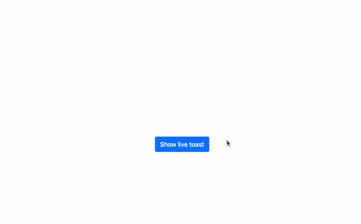

# 处理与 next . js-log 火箭博客的引导集成

> 原文：<https://blog.logrocket.com/handling-bootstrap-integration-next-js/>

您希望将 Bootstrap 集成到 Next.js 应用程序中有几个原因，其中之一是 Bootstrap 预构建了大量实用程序类和组件，使生活变得更加轻松。

然而，当将 bootstrap 集成到 Next.js 应用程序中时(与标准的 React 应用程序相反)，会出现某些错误，特别是在使用 Bootstrap JavaScript 特性(如切换导航条和模态)时。而这些问题经常是由 Next.js 的 SSR 功能引起的。

## 为什么 Next.js SSR 是 Bootstrap 的问题？

服务器端呈现(SSR)是 Next.js 和其他 JavaScript 库/框架的一项功能，允许 web 应用程序将服务器上的 HTML 文件转换为完全呈现给客户端的 HTML 页面。这意味着所有的活动都是在服务器上执行的，并且作为这些过程的结果而生成的标记文件被呈现给客户端。

另一方面，Bootstrap 中包含的 JavaScript 需要浏览器的`document`对象才能运行。而且，因为 Next.js 在默认情况下是 SSR，这意味着在页面完全加载之前,`document`对象还没有准备好，这就是为什么当您试图在 Next.js 应用程序中使用 Bootstrap 的 JavaScript 功能时会出现以下错误:



Next.js bootstrap ‘document is not defined’ error.

本文将解释如何修复这个错误，以及如何在 Next.js 应用程序中有效地使用 Bootstrap 的全部功能。

## 将引导添加到 Next.js

有几种方法可以将 Bootstrap 合并到 Next.js 应用程序中。然而，最常见的是安装引导软件包。在开始之前，让我们创建一个新的 Next.js 应用程序:

```
npx create-next-app my-app
```

### 安装引导模块

创建项目后，我们可以通过运行以下命令轻松地向其中添加最新稳定版本的 Bootstrap:

```
npm install bootstrap
```

安装 Bootstrap 后，我们可以将缩小的 Bootstrap CSS 文件导入 Next.js entry `pages/_app.js`文件，如下所示:

```
import "bootstrap/dist/css/bootstrap.min.css"; // Import bootstrap CSS
import "../styles/globals.css";

function MyApp({ Component, pageProps }) {
  return <Component {...pageProps} />;
}

export default MyApp;
```

与上面的代码一样，您希望确保在自定义 CSS 文件之前导入了 Bootstrap，这样就可以更容易地用这个文件覆盖 Bootstrap 的默认样式(当然，如果需要的话)。

### 使用 JavaScript 特性

如前所述，如果我们直接导入捆绑了 Bootstrap 的 JavaScript 文件，我们会得到一个`'document is not defined'`错误。然而，我们可以利用 React 的`useEffect()`钩子来完成导入:

```
// src/_app.js

import { useEffect } from "react";

useEffect(() => {
  require("bootstrap/dist/js/bootstrap.bundle.min.js");
}, []);
```

React 中的`useEffect()`钩子用于指示 React 组件在渲染后需要做些什么，在这个场景中，我们将使用它来导入捆绑的引导 JavaScript 文件。

添加后，我们的`_app.js`文件的完整代码将如下所示:

```
import "bootstrap/dist/css/bootstrap.min.css";
import "../styles/globals.css";
import { useEffect } from "react";

function MyApp({ Component, pageProps }) {
  useEffect(() => {
    require("bootstrap/dist/js/bootstrap.bundle.min.js");
  }, []);

  return <Component {...pageProps} />;
}

export default MyApp;
```

让我们创建一个简单的模型来进行试验。打开默认的`pages/index.js`文件，并用以下代码替换其内容:

```
export default function Home() {
  return (
    <div className="d-flex 
justify-content-center align-items-center">
      <button
        type="button"
        className="btn btn-primary"
        data-bs-toggle="modal"
        data-bs-target="#exampleModal"
      >
        Launch demo modal
      </button>

      <div
        className="modal fade"
        id="exampleModal"
        tabIndex="-1"
        aria-labelledby="exampleModalLabel"
        aria-hidden="true"
      >
        <div className="modal-dialog">
          <div className="modal-content">
            <div className="modal-header">
              <h5 className="modal-title" id="exampleModalLabel">
                Modal title
              </h5>
              <button
                type="button"
                className="btn-close"
                data-bs-dismiss="modal"
                aria-label="Close"
              ></button>
            </div>
            <div className="modal-body">...</div>
          </div>
        </div>
      </div>
    </div>
  );
}
```

如果我们用(`npm run dev`)运行我们的应用程序，并在浏览器中预览它的输出，我们应该观察到一切都按预期运行:



### 以编程方式调用引导组件

有些情况下，您希望以编程方式触发 Bootstrap 组件，而不是像我们在前面的示例中那样通过向按钮添加`data`属性。

例如，对于模态，引导包导出一个允许我们执行此操作的模块:

```
import bootstrap from "bootstrap";

 const showModal = () => {
    const myModals = new bootstrap.Modal("#exampleModal");
    myModal.show();
  };
```

然而，如果我们运行这段代码，我们仍然会得到`'document is not defined'`错误，因为我们已经清楚地将 Bootstrap 导入了当前页面。

解决这个问题的一个方法是简单地使用 JavaScript 析构语法在我们的自定义函数中导入前面提到的模块，如下面的代码所示:

```
 const showModal = () => {
    const { Modal } = require("bootstrap");
    const myModal = new Modal("#exampleModal");
    myModal.show();
  };
```

然后我们可以调用`showModal()`函数来轻松显示我们的模态:

```
<button type="button" className="btn btn-primary" onClick={showModal}>
  Launch demo modal
</button>
```

将此应用于示例页面，我们的完整代码将如下所示:

```
// pages/index.js

export default function Home() {
  const showModal = () => {
    const { Modal } = require("bootstrap");
    const myModal = new Modal("#exampleModal");

    myModal.show();
  };
  return (
    <div className="d-flex">
      <button type="button" className="btn" onClick={showModal}>
        Launch demo modal
      </button>

      <div
        className="modal fade"
        id="exampleModal"
        tabIndex="-1"
        aria-labelledby="exampleModalLabel"
        aria-hidden="true"
      >
        <div className="modal-dialog">
          <div className="modal-content">
            <div className="modal-header">
              <h5 className="modal-title" id="exampleModalLabel">
                Modal title
              </h5>
              <button
                type="button"
                className="btn-close"
                data-bs-dismiss="modal"
                aria-label="Close"
              ></button>
            </div>
            <div className="modal-body">
             . . .
            </div>
          </div>
        </div>
      </div>
    </div>
  );
}
```

这个解决方案可以很好地与所有支持通过 JavaScript 切换的引导组件一起工作。下面是一个如何在转盘中使用它的示例:

```
// pages/index.js

export default function Home() {
  const toggleCarousel = (action) => {
    const { Carousel } = require("bootstrap");
    const carousel = new Carousel("#myCarousel");
    if (action === "next") {
      carousel.next();
    } else {
      carousel.prev();
    }
  };
  return (
    <>
      {" "}
      <div>
        <button
          className="btn btn-primary"
          onClick={() => toggleCarousel("prev")}
        >
          Prev
        </button>
        <button
          className="btn btn-primary ms-3"
          onClick={() => toggleCarousel("next")}
        >
          Next
        </button>
      </div>
      <div>
        <div
          id="myCarousel"
          className="carousel slide"
          data-bs-touch="false"
          data-bs-interval="false"
          style={{ maxWidth: "50%", height: "80vh", overflow: "hidden" }}
        >
          <div className="carousel-inner">
            <div className="carousel-item active">
              
            </div>
            <div className="carousel-item">
              
            </div>
            <div className="carousel-item">
              
            </div>
          </div>
        </div>
      </div>
    </>
  );
}
```

运行上面的代码，我们在浏览器中得到以下输出:


您也可以创建这些引导组件作为定制的 React 组件，然后在禁用 SSR 的同时使用 Next.js 的动态导入特性将它们导入到您的页面中。

使用 Next.js 动态导入特性，我们能够动态导入组件并使用它们。虽然动态导入允许服务器端渲染，但如果需要，我们可以禁用它。

下面是如何以这种方式导入示例组件:

```
import dynamic from 'next/dynamic'

const DynamicComponentNoSSR = dynamic(
  () => import('../components/SampleComponent'),
  { ssr: false }
)
```

在位于`../components/SampleComponent`的组件文件中，我们能够在组件呈现之前运行任何客户端 JavaScript 相关代码。

为了进行试验，让我们在 Next.js 项目的根目录下创建一个新文件`Toast.js`，并将以下内容粘贴到其中:

```
const bootstrap = require("bootstrap");

const Toast = () => {
  const showToast = () => {
    const toast = new bootstrap.Toast("#liveToast");
    toast.show();
  };

  return (
    <div>
      <button type="button" onClick={showToast} className="btn">
        Show Toast
      </button>

      <div className="toast-container position-fixed p-3 top-0">
        <div
          id="liveToast"
          className="toast"
          role="alert"
          aria-live="assertive"
          aria-atomic="true"
        >
          <div className="toast-header">
             
            <strong className="me-auto">Bootstrap</strong>
            <small>2 secs ago</small>
            <button
              type="button"
              className="btn-close"
              data-bs-dismiss="toast"
              aria-label="Close"
            ></button>
          </div>
          <div className="toast-body">
            Hello, world! This is a toast message.
          </div>
        </div>
      </div>
    </div>
  );
};

export default Toast;
```

上面的代码只是一个 Bootstrap `Toast`组件的模板，我们使用一个自定义函数以编程方式触发该组件，正如您所看到的，我们还在该组件的顶层导入了 Bootstrap 模块。

现在，让我们转到我们的`public/index.js`文件，在禁用 SSR 的同时动态导入这个组件:

```
import dynamic from "next/dynamic";

const Toast = dynamic(() => import("../Toast"), {
  ssr: false,
});

export default function Home() {
  return (
    <>
      <Toast />
    </>
  );
}
```

如果我们运行代码并单击按钮，我们应该看到一切都运行良好，没有抛出任何错误:



## 结论

在本文中，我们讨论了如何在 Next.js 应用程序中使用 Bootstrap 的全部功能。我们还分析了在尝试使用 Bootstrap JavaScript 特性时最常见的问题，以及解决该错误的许多方法。我希望这回答了你关于将 Bootstrap 与 Next.js 集成的问题！

## [LogRocket](https://lp.logrocket.com/blg/nextjs-signup) :全面了解生产 Next.js 应用

调试下一个应用程序可能会很困难，尤其是当用户遇到难以重现的问题时。如果您对监视和跟踪状态、自动显示 JavaScript 错误、跟踪缓慢的网络请求和组件加载时间感兴趣，

[try LogRocket](https://lp.logrocket.com/blg/nextjs-signup)

.

[](https://lp.logrocket.com/blg/nextjs-signup)[](https://lp.logrocket.com/blg/nextjs-signup)

LogRocket 就像是网络和移动应用的 DVR，记录下你的 Next.js 应用上发生的一切。您可以汇总并报告问题发生时应用程序的状态，而不是猜测问题发生的原因。LogRocket 还可以监控应用程序的性能，报告客户端 CPU 负载、客户端内存使用等指标。

LogRocket Redux 中间件包为您的用户会话增加了一层额外的可见性。LogRocket 记录 Redux 存储中的所有操作和状态。

让您调试 Next.js 应用的方式现代化— [开始免费监控](https://lp.logrocket.com/blg/nextjs-signup)。