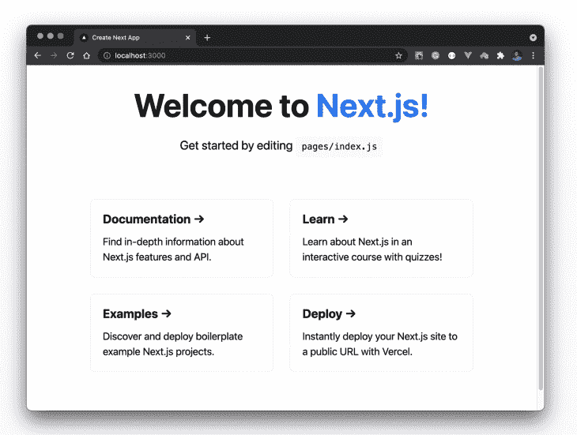
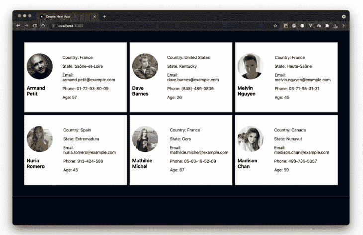

# 使用 useSWR - LogRocket Blog 处理 Next.js 中的数据获取

> 原文：<https://blog.logrocket.com/handling-data-fetching-next-js-useswr/>

数据获取模式是每个 web 框架中非常重要的一部分。这就是为什么每项网络技术的这一部分都在不断改进和创新。

鉴于现代 web 开发范例在很大程度上依赖于数据获取功能来支持 SSR 和 CSR 等特性，跟上 web 这一领域的变化是有意义的。

在这篇文章中，我将向您介绍最近刚刚引入 Next.js 的`useSWR`钩子，它有助于使数据获取更容易。为此，我们将构建一个随机用户生成站点。这并不是说你需要另外一个随机生成网站，但是它已经被证明可以有效地向开发者展示事情是如何工作的。

我的目标是确保在这篇文章结束时，你会对`useSWR`钩子有更多的了解，从而改善你的 Next.js 创作体验。在我们开始之前，先简单介绍一下。

## `useSWR`

在这个上下文中，SWR 代表“失效-重新验证”，我想 Next.js 开发人员对这个术语已经很熟悉了。Next.js 团队构建它是为了让开发人员在使用 Next 时有更多的方法来获取远程数据。它基本上是一组 React 挂钩，提供了诸如重新验证、变异、缓存等功能。开箱即用。

我喜欢这样想:`useSWR`为我解决的问题是，它让我有机会立即向用户展示一些东西，并提供了一种方便的方式来管理他们的体验，同时在幕后加载实际内容。它是这样的:

*   当发出请求时，它首先返回一个缓存值。可能是在`getStaticProps()`函数中生成的东西
*   接下来，服务器将启动一个重新验证过程，并获取页面的实际数据
*   最后，当重新验证成功时，SWR 将用实际数据更新页面

在这种情况下，用户就不会盯着加载屏幕看，你的网站也能保持快速和高性能。

### `useSWR`用打字稿

`useSWR`开箱即用的打字稿支持。它还为传入`fetcher`的参数推断了类型，以自动给出类型。也就是说，您可以用最简单的方式为自己的参数定义自定义类型，如下所示:

```
import useSWR from 'swr'
const { data } = useSWR('https://www.users.com', (apiURL: string) => fetch(apiURL).then(res => res.json())

```

使用 SWR 不需要特殊的 TypeScript 特定配置。你可以[在这里](https://swr.vercel.app/docs/typescript)阅读更多关于 SWR 的 TypeScript。

除了 SWR 的其他好处之外，您还可以使用它从任何支持 HTTP 的服务器检索数据。

让我们开始使用 Next.js 和`useSWR`钩子来设置我们的随机用户生成器应用程序。

## 设置 Next.js 应用程序

要快速设置 Next.js 应用程序，请打开一个终端窗口并运行`create-next-app`命令，如下所示:

```
npx create-next-app useswr-user-generator

```

按照提示完成设置过程，您应该在本地有一个`useswr-user-generator`应用程序。导航到应用程序目录，使用以下命令安装 SWR:

```
cd useswr-user-generator # navigate into the project directory
npm install swr axios # install swr and axios
npm run dev # run the dev server

```

上面的命令将安装 SWR 和 Axios 包，并在`localhost:3000`在浏览器上打开项目。如果您检查，我们应该让项目在该端口上运行，如下所示:



太好了，我们已经成功设置了一个 Next.js 应用程序。让我们继续建造这个随机发生器，好吗？

## 用 SWR 提取数据

在项目的根目录下，创建一个`components`文件夹。在这个文件夹中，添加一个`Users.js`文件，并用下面的代码片段更新它:

```
// components/Users.js

import axios from "axios";
import useSWR from "swr";
import Image from "next/image";

export default function Users() {
  const address = `https://randomuser.me/api/?results=6`;
  const fetcher = async (url) => await axios.get(url).then((res) => res.data);
  const { data, error } = useSWR(address, fetcher);

  if (error) <p>Loading failed...</p>;
  if (!data) <h1>Loading...</h1>;

  return (
    <div>
      <div className="container">
        {data &&
          data.results.map((item) => (
            <div key={item.cell} className={`user-card  ${item.gender}`}>
              <div>
                <Image
                  width={100}
                  height={100}
                  src={item.picture.large}
                  alt="user-avatar"
                  className="img"
                />
                <h3>{`${item.name.first}  ${item.name.last}`}</h3>
              </div>
              <div className="details">
                <p>Country: {item.location.country}</p>
                <p>State: {item.location.state}</p>
                <p>Email: {item.email}</p>
                <p>Phone: {item.phone}</p>
                <p>Age: {item.dob.age}</p>
              </div>
            </div>
          ))}
      </div>
    </div>
  );
}

```

让我们浏览一下这段代码。在上面的代码片段中，我们使用`useSWR()`钩子来获取 API `address`变量中指定的六个用户的数据。

`useSWR`钩子接受两个参数并返回两个值(基于请求的状态)。它接受:

*   一个`key` —一个字符串，作为我们正在获取的数据的唯一标识符。这通常是我们调用的 API URL
*   一个`fetcher` —任何返回提取数据的异步函数

它返回:

*   `data` —请求的结果(如果成功)
*   `error` —发生的错误(如果有错误)

在最简单的情况下，这就是如何用`useSWR`获取数据:

```
import useSWR from 'swr'

export defaul function Users() {
  const { data, error } = useSWR('/api/users', fetcher)

  if (error) return <div>failed to load</div>
  if (!data) return <div>loading...</div>
  return <div>hello {data.name}!</div>
}

```

在我们的例子中，我们将 API URL 保存在`address`变量中，并定义了`fetcher`函数来处理请求并返回响应。

*注意，[`useSWR`文档](https://swr.vercel.app/docs/data-fetching)建议使用 Next.js 原生 fetch 函数对 SWR 有效，但对我来说并非如此。我试过了，但是不太好用，所以我用 Axios 代替。*

让我们检查一下浏览器，看看我们是否得到了我们的用户。为了显示用户页面，让我们将`<Users />`组件导入到`pages/index.js`文件中，并像这样更新它:

```
// pages/index

import Head from "next/head";
import Users from "../components/Users";

export default function Home() {
  return (
    <div>
      <Head>
        <title>Create Next App</title>
        <meta name="description" content="Random user generator" />
        <link rel="icon" href="/favicon.ico" />
      </Head>
      <Users />

    </div>
  );
}

```

你可能已经注意到我使用了 [Next.js 图像组件](https://nextjs.org/docs/api-reference/next/image)来显示`Users.js`文件中的用户头像。因此，我们需要在`next.config.js`文件中指定图像域，如下所示:

```
module.exports = {
  reactStrictMode: true,
  images: {
    domains: ["randomuser.me"],
  },
};

```

现在，当您查看浏览器时，我们应该会看到我们的用户按预期出现:



那里！我们有我们的用户。所以，我们的`useSWR`钩子起作用了！但就这样吗？这与其他数据获取方法有何不同？请继续阅读…

## 为什么是`useSWR`？

这是一个很可能在这个时候问的问题。除了非常具有宣示性，我还不能说这对我来说是一个巨大的进步。这可能是现在谈论我非常喜欢的`useSWR`的一个特性(以及其他特性)的好时机:

### 页码

用`useSWR`分页轻而易举。让我们举个例子:想象一下，我们希望能够生成更多的用户，并根据需要将他们添加到这个页面，而不是只加载六个用户。当您构建的应用程序需要用户浏览相同内容的多个页面时，这一点尤其有用。我们可以通过在用户页面的末尾添加一个 Load More 按钮来演示这一点，以便在单击时生成更多的用户。让我们更新索引页面，将 count prop 传递给我们的`<Users />`组件:

```
// pages/index.js

import Head from "next/head";
import Users from "../components/Users";
export default function Home() {
  const [count, setCount ] = useState(0);
  return (
    <div>
      <Users count={count} setCount={setCount} />
    </div>
  );
}

```

接下来，让我们在`components/Users.js`文件中添加一个按钮来更新计数，并从我们的 API 向页面加载更多用户:

```
import axios from "axios";
import useSWR from "swr";
import Image from "next/image";

export default function Users({ count, setCount }) {
  const address = `https://randomuser.me/api/?results=${count}`;
  const fetcher = async (url) => await axios.get(url).then((res) => res.data);
  const { data, error } = useSWR(address, fetcher);
  if (error) <p>Loading failed...</p>;
  if (!data) <h1>Loading...</h1>;
  return (
    <div>
      <div className="container">
      // show users 
      </div>
      <center>
        <div className="btn">
          <button onClick={() => setCount(count + 3)}>Load More Users</button>
        </div>
      </center>
    </div>
  );
}

```

让我们检查一下浏览器，看看我们的按钮是否按预期工作。单击时，它应该加载另外三个用户，并在页面上呈现他们和现有用户:


很管用。然而，这给我们带来了另一个问题。当按钮被点击时，Next.js 将向我们的 API 发出一个新的请求来获取另外三个用户，这将触发我们的加载状态。这就是为什么当点击按钮时，你会注意到屏幕上的闪烁。幸运的是，我们有一个简单的解决方案，非常感谢 SWR 缓存。

我们可以预先生成这些用户(或者不同上下文中的下一个页面)，并在一个隐藏的`<div>`元素中呈现它们。这样，当按钮被单击时，我们将只显示该元素。因此，请求将在我们单击按钮之前发生，而不是在什么时候。


看到了吗？不再闪烁。

除此之外，这里有一些你从 SWR 的盒子里得到的惊人的特性:

*   可重用数据提取
*   内置缓存
*   SSR/ISR/SSG 支持
*   类型脚本支持
*   突变和重新验证

还有很多性能优势，我们无法在本文的范围内讨论。下一步，我想让你看看 [SWR 文档](https://swr.vercel.app/docs/getting-started)，了解更多关于用法和益处的细节。

## 复杂的用例

让我们探索一个更复杂的用例。

### 使用的突变和重新验证

假设我们有自己的`/friends`端点，可以从数据库中检索我们所有的朋友，还可以向端点发送消息来添加新朋友。

我们可以立即编写如下所示的代码:

```
import useSWR from "swr";  
  const address = `http://localhost:3000/api/friends`;  
  const fetcher = (...args) => fetch(...args).then((res) => res.json());
  const { data, error } = useSWR(address, fetcher);
  const addFriend = async () => {
    const newUser = {
      name: "Robbie Doe",
      location: "Lagos",
      age: 20,
      email: "[email protected]",
      image:
        "https://www.shareicon.net/data/2016/09/15/829474_user_512x512.png",
    };
    await fetcher(address, {
      method: "POST",
      body: JSON.stringify(newUser),
    });
  };

```

当我们单击一个按钮来触发`addFriend()`函数时，我们将使用`useSWR`来发送到`/friends`端点，有效地向数据库添加一个新朋友。然而，我们的网站不会“知道”有更新，因此我们不会在屏幕上看到那个朋友。

这就是 useSWR 突变出现的原因。我们可以使用突变来重新验证我们的页面:

1.  检查是否有新数据
2.  如果有，重新验证页面并呈现新数据，而不触发整个页面重新加载:

```
import useSWR from "swr";  
  const address = `http://localhost:3000/api/friends`;  
  const fetcher = (...args) => fetch(...args).then((res) => res.json());
  const { data, error } = useSWR(address, fetcher);
  const addFriend = async () => {
    const newUser = {
      name: "Robbie Doe",
      location: "Lagos",
      age: 20,
      email: "[email protected]",
      image:
        "https://www.shareicon.net/data/2016/09/15/829474_user_512x512.png",
    };
    await fetcher(address, { 
      method: "POST",
      body: JSON.stringify(newUser),
    });
    mutate(address);
  };
```

现在，当我们通过发布一个新朋友来更新数据库时，useSWR 将重新验证页面，并确保我们不提供陈旧的数据。

也就是说，useSWR 将自动在焦点上重新验证您的页面，以确保您的数据是最新的。但那可能很多。因此，您可以选择通过将此选项作为参数传递到 SWR 来退出对焦点的重新验证:

```
  const { data, error } = useSWR(address, fetcher, {
    revalidateOnFocus: false
  });

```

## 结论

在这篇文章中，我们已经学习了`useSWR`钩子的基础知识。我们还用 Next.js 构建了一个迷你随机用户生成器应用程序来演示 SWR 功能。我希望这篇文章为您提供了一些关于使用`useSWR`在 Next.js 应用程序中获取数据的见解。我们建立的网站的现场演示由[在 Netlify](https://random-userswith-swr.netlify.app) 上主持。你可以随意使用它，如果你想根据自己的喜好调整的话，也可以从 GitHub 获得[代码库。](https://github.com/kenny-io/useswr-hook-nextjs)

## [LogRocket](https://lp.logrocket.com/blg/nextjs-signup) :全面了解生产 Next.js 应用

调试下一个应用程序可能会很困难，尤其是当用户遇到难以重现的问题时。如果您对监视和跟踪状态、自动显示 JavaScript 错误、跟踪缓慢的网络请求和组件加载时间感兴趣，

[try LogRocket](https://lp.logrocket.com/blg/nextjs-signup)

.

[](https://lp.logrocket.com/blg/nextjs-signup)[](https://lp.logrocket.com/blg/nextjs-signup)

LogRocket 就像是网络和移动应用的 DVR，记录下你的 Next.js 应用上发生的一切。您可以汇总并报告问题发生时应用程序的状态，而不是猜测问题发生的原因。LogRocket 还可以监控应用程序的性能，报告客户端 CPU 负载、客户端内存使用等指标。

LogRocket Redux 中间件包为您的用户会话增加了一层额外的可见性。LogRocket 记录 Redux 存储中的所有操作和状态。

让您调试 Next.js 应用的方式现代化— [开始免费监控](https://lp.logrocket.com/blg/nextjs-signup)。