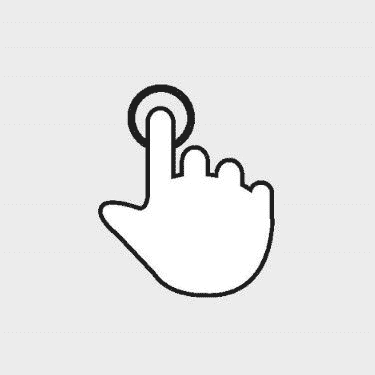
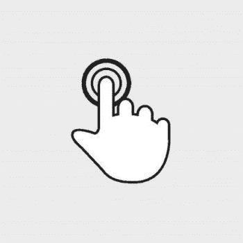
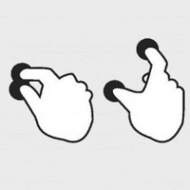
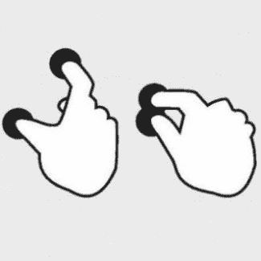
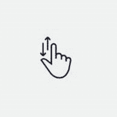
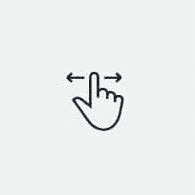
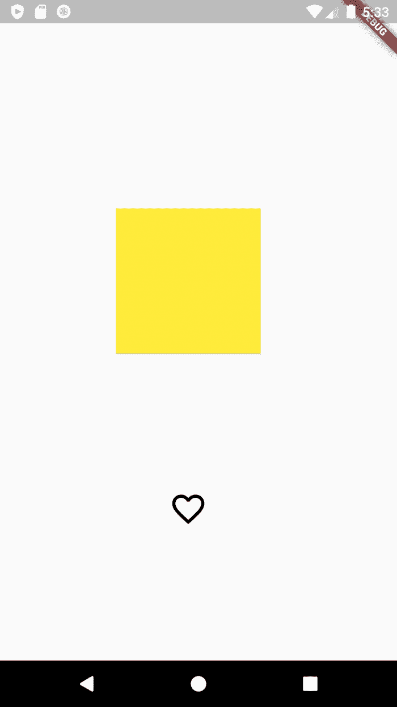
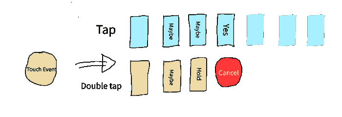

# 在 Flutter - LogRocket 博客中处理手势

> 原文：<https://blog.logrocket.com/handling-gestures-flutter-gesturedetector/>

当创建应用程序时，您必须处理用户手势，如触摸和拖动。这使得您的应用程序具有交互性。

为了有效地处理手势，你需要倾听手势并做出反应。Flutter 提供了各种小部件，有助于为您的应用程序添加交互性。

在本文中，我们将通过 [GestureDetector](https://api.flutter.dev/flutter/widgets/GestureDetector-class.html) 小部件来处理手势。

## 介绍

一些小部件，如`Container`和`Card`小部件，没有内置的检测手势的方式。此类部件被封装在`GestureDetector`部件中，该部件纯粹用于检测手势，不会产生任何视觉反应，如连锁反应。

`GestureDetector`小部件的工作原理是识别定义了回调的手势，并相应地对事件做出响应。如果一个手势被禁用，一个`null`值被传递给回调函数。

以下是`GestureDetector`小工具捕捉到的常见手势、它们对应的事件和可能的应用(所有插图都归功于[卢克·乌鲁布莱夫斯基的触摸手势参考指南](https://www.lukew.com/ff/entry.asp?1071)):

### 轻敲，水龙头

用户用指尖短暂触摸了一下屏幕。



*   `onTapDown` —当用户接触屏幕时触发，可能是轻击
*   `onTapUp` —当用户停止接触屏幕时触发
*   `onTap` —当用户短暂触摸屏幕时触发
*   `onTapCancel` —当触发`onTapDown`的事件不是点击时触发

点击手势的可能应用包括:

1.  挑选
2.  取消
3.  使服从

### 双击

用户在同一位置快速连续点击屏幕两次。



*   `onDoubleTapDown` —当用户接触屏幕时触发，可能是双击
*   `onDoubleTap` —当用户在同一位置快速连续点击屏幕两次时触发
*   `onDoubleTapCancel` —当触发`onDoubleTapDown`的事件不是双击时触发

双击手势的可能应用包括:

1.  喜欢/不喜欢
2.  屏幕开/关
3.  调整图像大小

### 长按

用户在同一位置长时间接触屏幕。


*   `onLongPressDown` —用户接触屏幕时触发，可能是长按
*   `onLongPressStart` —当检测到长按开始时触发
*   `onLongPress` —检测到长按时触发
*   `onLongPressMoveUpdate` —当检测到长按且用户拖动手指时触发
*   `onLongPressEnd` —当检测到长按结束时触发
*   `onLongPressUp` —当检测到长按结束时触发；长按后联系人已被移除
*   `onLongPressCancel` —当触发`onLongPressDown`的事件不是长按时触发

长按手势的可能应用包括:

1.  显示更多选项
2.  移动图标

### 规模

用户挤压或展开屏幕。





*   `onScaleStart` —当与屏幕接触建立焦点和初始比例 1.0 时触发
*   `onScaleUpdate` —当与屏幕的接触指示了新的焦点和/或标尺时触发
*   `onScaleEnd` —当用户不再与`screenPossible`应用程序接触以进行缩放手势时触发

缩放手势的用途包括:

1.  放大/缩小
2.  旋转

### 垂直阻力

用户与屏幕接触，并以稳定的方式垂直移动他们的指尖。



*   `onVerticalDragDown` —用户接触屏幕时触发，可能垂直移动
*   `onVerticalDragStart` —当用户接触屏幕并开始垂直移动时触发
*   `onVerticalDragUpdate` —当垂直移动的触点再次沿垂直方向移动时触发
*   `onVerticalDragEnd` —当检测到垂直拖动结束时触发
*   `onVerticalDragCancel` —当触发`onVerticalDragDown`的事件不是垂直拖动时触发

垂直拖动手势的可能应用包括:

1.  卷起

### 水平阻力

用户与屏幕接触，并以稳定的方式水平移动他们的指尖。



*   `onHorizontalDragDown` —用户接触屏幕时触发，可能水平移动
*   `onHorizontalDragStart` —当用户接触屏幕并开始水平移动时触发
*   `onHorizontalDragUpdate` —当水平移动的触点再次水平移动时触发
*   `onHorizontalDragEnd` —当检测到水平拖动结束时触发
*   `onHorizontalDragCancel` —当触发`onHorizontalDragDown`的事件不是水平拖动时触发

水平拖动手势的可能应用包括:

1.  删除
2.  档案馆
3.  导航到不同的视图

这不是检测到的手势的完整列表。查看官方文档以获得完整的列表。

我们来试试吧！

## 入门指南

要使用`GestureDetector`小部件:

1.  用`GestureDetector`小部件包装所需的小部件。
2.  为您希望检测的手势传递回调。
3.  相应地更新应用程序

我们将构建一个简单的演示应用程序，处理点击、双击、长按和缩放手势。

## 创建新的 Flutter 应用程序

创建一个新的 Flutter 应用程序，并清除`main.dart`文件中的默认代码。

### 更新用户界面

我们将创建以下四个文件。您可以[在这里](https://github.com/Ivy-Walobwa/flutter-gesture-detector)查看文件夹结构。

#### `main.dart`

```
import 'package:flutter/material.dart';
import 'presentation/my_app_widget.dart';
void main() {
  runApp(const MyApp());
}

```

#### `my_app_widget.dart`

```
import 'package:flutter/material.dart';
import 'home_page.dart';
class MyApp extends StatelessWidget {
  const MyApp({Key? key}) : super(key: key);
  @override
  Widget build(BuildContext context) {
    return MaterialApp(
      title: 'Flutter Gesture Detector Demo',
      theme: ThemeData(
        primarySwatch: Colors.blue,
      ),
      home:  const HomePage(),
    );
  }
}
```

#### `home_page.dart`

```
import 'package:flutter/material.dart';
import 'widgets/widgets.dart';
class HomePage extends StatelessWidget {
  const HomePage({Key? key}) : super(key: key);
  @override
  Widget build(BuildContext context) {
    final height = MediaQuery.of(context).size.height;
    final width = MediaQuery.of(context).size.width;
    return Scaffold(
      body: Padding(
        padding: EdgeInsets.symmetric(
            horizontal: width * 0.1, vertical: height * 0.2),
        child: Column(
          mainAxisAlignment: MainAxisAlignment.spaceBetween,
          children:  const [
            MyCardWidget(),
            MyFavoriteIconWidget()
          ],
        ),
      ),
    );
  }
}

```

#### `my_card_widget.dart`

```
import 'dart:math';
import 'package:flutter/material.dart';
class MyCardWidget extends StatefulWidget {
  const MyCardWidget({
    Key? key,
  }) : super(key: key);
  @override
  State<MyCardWidget> createState() => _MyCardWidgetState();
}
class _MyCardWidgetState extends State<MyCardWidget> {
  @override
  Widget build(BuildContext context) {
    return const Card(
      child: SizedBox(
        height: 300,
        width: 300,
      ),
      color: Colors.yellow,
    );
  }
}

```

#### `my_favorite_icon_widget.dart`

```
import 'package:flutter/material.dart';
class MyFavoriteIconWidget extends StatefulWidget {
  const MyFavoriteIconWidget({
    Key? key,
  }) : super(key: key);

  @override
  State<MyFavoriteIconWidget> createState() => _MyFavoriteIconWidgetState();
}

class _MyFavoriteIconWidgetState extends State<MyFavoriteIconWidget> {
  @override
  Widget build(BuildContext context) {
    return const Icon(
     Icons.favorite_border,
      size: 40,
    );
  }
}

```

最终的应用程序应该是这样的:



现在我们已经准备好了 UI，让我们来处理一些手势。

### 处理点击手势

在您的`my_favorite_icon_widget.dart`文件中:

1.  将选中的标志属性添加到`StatefulWidget`
    `bool isSelected = false;`
2.  用`GestureDetector`小部件包装`Icon`小部件
3.  提供对`onTap`属性的非空回调
4.  根据 flag 属性值更改图标和图标颜色

```
class _MyFavoriteIconWidgetState extends State<MyFavoriteIconWidget> {
  bool isSelected = false;

  @override
  Widget build(BuildContext context) {
    return GestureDetector(
        onTap: (){
          setState(() {
            isSelected = !isSelected;
          });
        },
        child:  Icon(
          isSelected ? Icons.favorite: Icons.favorite_border,
          size: 40,
          color: isSelected? Colors.red: Colors.black ,
        ));
  }
}

```

### 处理双击手势

在您的`my_card_widget.dart`文件中:

1.  添加颜色属性
2.  用`GestureDetector`小部件包装`Card`小部件
3.  提供对`onDoubleTap`属性的非空回调
4.  根据 color 属性的值更改卡片的颜色

```
class _MyCardWidgetState extends State<MyCardWidget> {
  Color bgColor = Colors.yellow;
  @override
  Widget build(BuildContext context) {
    return GestureDetector(
      onDoubleTap: (){
        setState(() {
          bgColor = Colors.primaries[Random().nextInt(Colors.primaries.length)];
        });
      },
      child:   Card(
        child: const SizedBox(
          height: 300,
          width: 300,
        ),
        color: bgColor,
      ),
    );
  }
}

```

### 处理长按手势

在你的`my_card_widget.dart`档案里:
1。添加一个`makeCircular`标志属性
2。为`onLongPress`属性
3 提供一个非空回调。根据`makeCircular`属性的值改变卡片的形状

```
class _MyCardWidgetState extends State<MyCardWidget> {
  Color bgColor = Colors.yellow;
  bool makeCircular = false;
  @override
  Widget build(BuildContext context) {
    return GestureDetector(
      onLongPress: (){
        setState(() {
          makeCircular = !makeCircular;
        });
      },
      child:   Card(
        shape: makeCircular? const CircleBorder(): const RoundedRectangleBorder(),
        child: const SizedBox(
          height: 300,
          width: 300,
        ),
        color: bgColor,
      ),
    );
  }
}

```

### 处理缩放手势

在您的`my_card_widget.dart`文件中:
1。添加一个`_scaleFactor`属性
2。添加一个`_baseFactor`属性
3。向`onScaleStart`属性提供一个非空回调—建立一个初始比例
4。向`onScaleUpdate`属性提供一个非空回调—建立一个新的标尺
5。向`onScaleEnd`属性提供一个非空回调—返回初始刻度
6。用`Transorm.scale`小部件
7 包裹`Card`小部件。根据`_scaleFactor`的值更改比例属性

```
class _MyCardWidgetState extends State<MyCardWidget> {
  Color bgColor = Colors.yellow;
  bool makeCircular = false;
  double _scaleFactor = 0.5;
  double _baseScaleFactor = 0.5;
  @override
  Widget build(BuildContext context) {
    return GestureDetector(
      onScaleStart: (details){
        _baseScaleFactor = _scaleFactor;
      },
      onScaleUpdate: (details){
        setState(() {
          _scaleFactor = _baseScaleFactor * details.scale;
        });
      },
      onScaleEnd: (details){
        // return to initial scale
        _scaleFactor = _baseScaleFactor;
      },
      child:   Transform.scale(
        scale: _scaleFactor,
        child: Card(
          shape: makeCircular? const CircleBorder(): const RoundedRectangleBorde(),
          child: const SizedBox(
            height: 300,
            width: 300,
          ),
        color: bgColor,
      ),
    );
  }
}

```

下面的视频显示了实现的手势:

## 手势歧义消除

那么，当我们为轻击和双击提供`onGestureDown`事件回调，并且发生两个延迟的短暂触摸事件时，会发生什么呢？

请看下图:



当识别出两个或更多具有非空回调的手势事件时，Flutter 通过让每个识别器加入手势竞技场来消除用户想要哪个手势的歧义。在手势竞技场中，事件【战斗】 和获胜的事件生效，而失败的事件被取消。

手势竞技场考虑了以下因素:

1.  用户触摸屏幕的时间长度
2.  每个方向上移动的像素数
3.  竞技场中的哪个手势
4.  哪个手势宣告胜利

这些是战斗状态:

*   也许——也许是一种姿态
*   保持——可能是一种姿态，如果它以特定的方式发展；对于我们的例子，发生了一次点击，如果第二次点击在预期时间内发生，则可能是两次点击
*   是——胜利宣言
*   取消—退出战斗

例如，假设发生以下情况:

1.`onTapDown`和`onDoubleTapDown`被触发
2。两个手势比拼
3。点击手势获胜，回调被执行(T2 回调)4。双击手势失败并取消(`onDoubleTapCancel`触发)

在我们的例子中，点击手势获胜是因为:

*   两次敲击之间的持续时间被延迟
*   轻拍手势以“是”宣告胜利
*   点击手势是取消双击后剩下的手势，没有其他竞争者

## 结论

我们已经浏览了`GestureDetector`小部件，并了解了它的工作原理。我们已经学会了如何使用它来为我们的应用程序添加交互性，并且我们已经实现了一些常见的手势，比如点击、长按、双击和缩放。我们最后看了手势消歧。

有了这些知识，我们现在对`GestureDetector`小部件有了更好的理解，可以轻松地使用它的任何属性来识别手势。随意摆弄不同的手势。你可以在 GitHub 上找到演示应用。

## 使用 [LogRocket](https://lp.logrocket.com/blg/signup) 消除传统错误报告的干扰

[](https://lp.logrocket.com/blg/signup)

[LogRocket](https://lp.logrocket.com/blg/signup) 是一个数字体验分析解决方案，它可以保护您免受数百个假阳性错误警报的影响，只针对几个真正重要的项目。LogRocket 会告诉您应用程序中实际影响用户的最具影响力的 bug 和 UX 问题。

然后，使用具有深层技术遥测的会话重放来确切地查看用户看到了什么以及是什么导致了问题，就像你在他们身后看一样。

LogRocket 自动聚合客户端错误、JS 异常、前端性能指标和用户交互。然后 LogRocket 使用机器学习来告诉你哪些问题正在影响大多数用户，并提供你需要修复它的上下文。

关注重要的 bug—[今天就试试 LogRocket】。](https://lp.logrocket.com/blg/signup-issue-free)