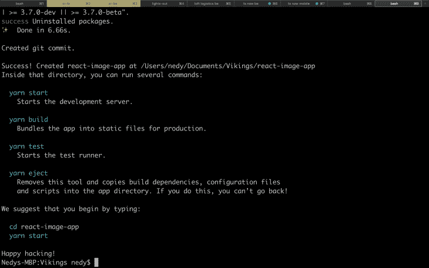
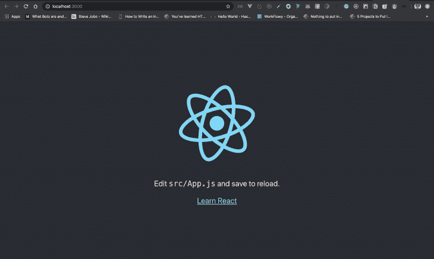
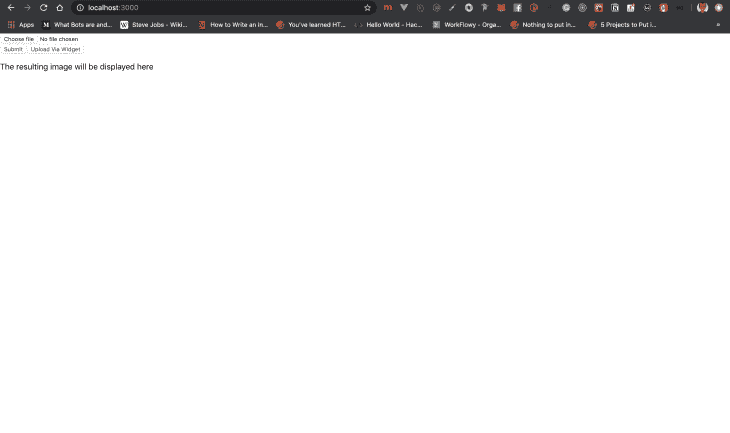
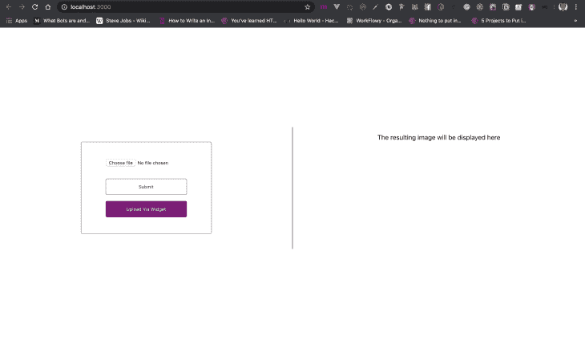
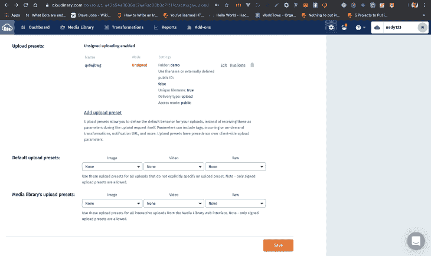
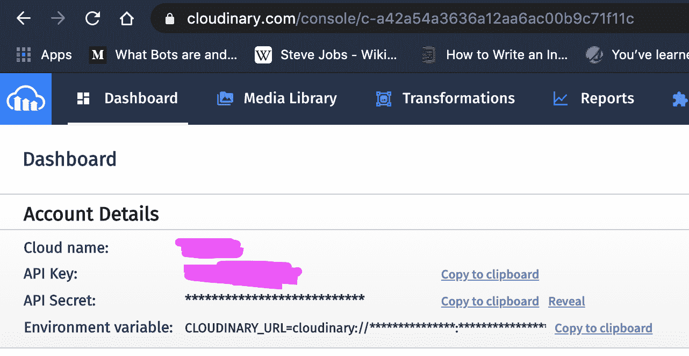
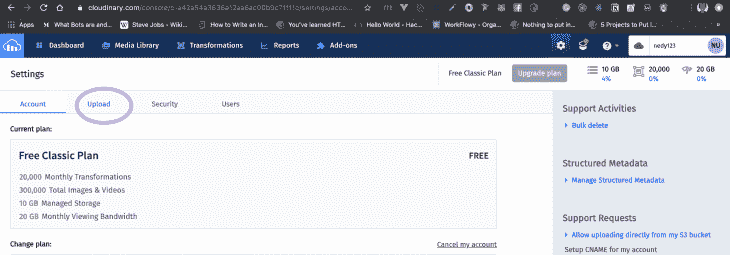
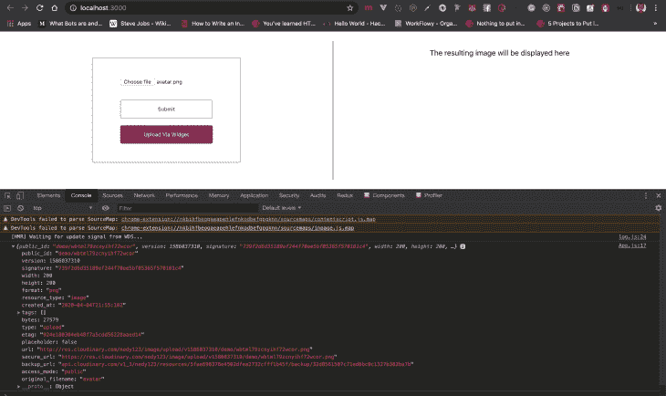
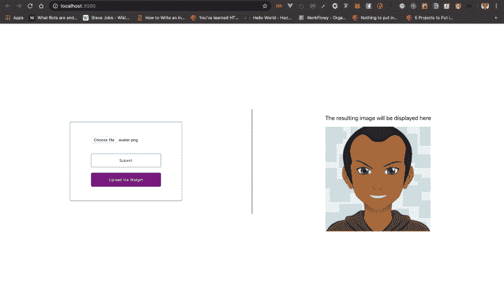
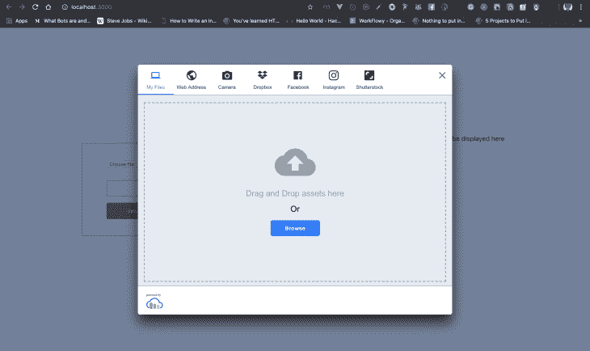

# 在 React - LogRocket 博客中用 Cloudinary 处理图像

> 原文：<https://blog.logrocket.com/handling-images-with-cloudinary-in-react/>

## 介绍

有时，在处理需要使用图像的应用程序时，将图像上传到服务器这样的简单过程会变得很困难。有了 Cloudinary，我们可以直接从前端上传和管理我们的图像。在这篇博文中，我们将看看如何使用 Cloudinary 在 React 应用程序中处理图像。

## 先决条件

*   JavaScript 的基础知识
*   React 的基础知识
*   您机器上安装的最新版本 [Node.js](https://nodejs.org/en/)
*   一个终端比如[iterm 2](https://iterm2.com/)(Mac OS)[Git bash](https://git-scm.com/downloads)(Windows)
*   一笔不清不楚的帐

## 创建云账户

Cloudinary 是一个基于云的图像和视频管理平台，工程团队和开发人员都使用它来管理应用程序中的媒体资产(图像、视频)。在我们继续之前，如果您还没有 Cloudinary 帐户，请花一分钟时间在此处创建您的 cloud inary 帐户。我们将使用 Cloudinary 来存储和检索我们上传的图像。

## 设置 React

在这个项目中，我们将建立一个小型 React 应用程序来演示如何使用 Cloudinary 处理 React 中的图像。

运行以下命令，使用您选择的终端在几秒钟内创建您的 React 应用程序:

```
npx create-react-app react-image-app
```

当这个操作完成后，你应该会在你的终端中得到类似如下的结果:

Run this command to change the current directory to your newly created React app and start it up:

```
cd react-image-app && npm start
```

您应该会在默认浏览器上看到这个屏幕:



现在我们已经启动并运行了 React 应用程序，让我们编辑它以包含一个输入字段和一个显示图像的位置。

打开您喜欢的编辑器，用以下内容替换`/src/App.js`的内容:

```
import React from 'react';
import './App.css';

class App extends React.Component{
  state = {
    imageUrl: null,
    imageAlt: null,
  }

  render() {
    const { imageUrl, imageAlt } = this.state;

    return (
      <main className="App">
        <section className="left-side">
          <form>
            <div className="form-group">
              <input type="file"/>
            </div>

            <button type="button" className="btn" onClick={this.handleImageUpload}>Submit</button>
            <button type="button" className="btn widget-btn">Upload Via Widget</button>
          </form>
        </section>
        <section className="right-side">
          <p>The resulting image will be displayed here</p>
          {imageUrl && (
            
          )}
        </section>
      </main>
    );
  }
}

export default App;
```

上面这段代码在 React 中返回一个类组件。该组件呈现一个界面，我们可以上传图像。

在第 5 行，我们将图像的 URL 和替代消息设置为`null`，因为我们没有这些图像属性的任何默认值。在第 26 行，我们使用`&&`操作符编写了一个条件渲染。这类似于内联 if else 语句，不同之处在于，如果表达式解析为 false，则不会向接口呈现任何内容。在这种情况下，如果没有图像的 URL，将不会呈现图像标记。

从第 15-24 行，我们看到界面的左侧有一个`file`类型的输入字段，用于从您的设备上传文件类型，如 Pdf、图像、音频、视频等。我们还为名为`handleImageUpload`的按钮定义了一个`onClick`函数，该按钮目前不做任何事情。

目前的结果如下所示:



这目前看起来并不美观，所以让我们用 CSS 添加一些样式。继续将`/src/App.css`的内容替换为:

```
.App {
  text-align: center;
  max-width: 100vw;
  min-height: 100vh;
  max-height: 100vh;
  display: flex;
  justify-content: center;
  align-items: center;
}

.App .left-side {
  display: flex;
  justify-content: center;
  align-items: center;
  border-right: .5px solid grey;
}

.App .right-side {
  border-left: .5px solid grey;
}

.App .left-side,
.App .right-side {
  height: 300px;
  width: 100%;
}

.App .left-side form {
  height: fit-content;
  background: white;
  border: 1px solid grey;
  border-radius: 4px;
  width: 300px;
  padding: 40px 10px;
}

.App .left-side form input {
  margin: 0 0 30px;
  width: 200px;
}

.App .left-side form .btn {
  height: 40px;
  width: 200px;
  background: white;
  border: 1px solid grey;
  cursor: pointer;
  border-radius: 4px;
}

.App .left-side form .btn:hover {
  color: white;
  background: grey;
}

.App .left-side form .btn:focus {
  box-shadow: none;
  outline: none;
}

.App .left-side form .btn.widget-btn {
  margin-top: 15px;
  background: #800080;
  border: 1px solid #800080;
  color: #FFFFFF;
}

.App .left-side form .btn.widget-btn:hover {
  margin-top: 15px;
  background: #4B0082;
  border: 1px solid #4B0082;
  color: #FFFFFF;
}

.App .right-side .displayed-image {
  height: 300px;
  width: 300px;
}
```

这里我们使用 CSS [Flexbox](https://developer.mozilla.org/en-US/docs/Web/CSS/CSS_Flexible_Box_Layout/Basic_Concepts_of_Flexbox) ，在屏幕上正确排列元素。我们还为按钮添加了背景颜色和悬停效果。现在，您在`[http://localhost:3000/](http://localhost:3000/)`上的应用程序应该如下所示:



现在我们有了界面设置，让我们来谈谈如何通过 Cloudinary 处理图像。

## 通过 Cloudinary 端点处理图像

在这个方法中，我们将通过向 Cloudinary 端点发送 POST 请求来将图像上传到 Cloudinary。这将上传图像并返回一个响应对象给我们。让我们来看看。

首先，我们将编写一些 JavaScript 代码来从我们的设备中获取选定的图像。如果你看一下第 17 行的`/src/App.js`，你会注意到我们调用了一个名为`handleImageUpload()`的函数。这个函数将处理通过端点上传到 Cloudinary 的图像。

**步骤 1** :在 App 函数中的 return 语句之前添加这段代码:

```
handleImageUpload = () => {
  const { files } = document.querySelector('input[type="file"]')
  console.log('Image file', files[0])
}
```

该函数查询文档以获取第一个具有文件类型的输入元素，然后从结果对象中解结构 files 数组，最后将数组的第一个元素记录到控制台的结果中。这段代码可以扩展成类似这样:

```
handleImageUpload = () => {
  // get the first input element with the type of file,
  const imageFile = document.querySelector('input[type="file"]')
  // destructure the files array from the resulting object
  const files = imageFile.files
  // log the result to the console
  console.log('Image file', files[0])
}
```

[析构](https://exploringjs.com/es6/ch_destructuring.html)是一种从存储在(可能是嵌套的)对象和数组中的数据提取多个值的便捷方式。

如果我们打开浏览器，选择图像文件，然后单击上传按钮，我们应该会看到类似这样的内容:


我们可以看到`file`对象被记录到我们的控制台。该对象包含各种数据，如文件名、文件大小、文件类型等。

**步骤 2** :我们将向 Cloudinary 端点发送一个 post 请求，其中包含从上面的函数中获得的 file 对象。

基本云二进制 API 端点如下所示:

`[https://api.Cloudinary.com/v1_1/:cloud_name/:action](https://api.Cloudinary.com/v1_1/:cloud_name/:action)`

`:cloud_name`可从您的 Cloudinary 仪表盘获得:


而 URL 中的`:action`参数表示您想要执行的任何操作，例如上传图像的`/image/upload`。API URL 示例如下所示:

`[https://api.Cloudinary.com/v1_1/john1234/image/upload](https://api.Cloudinary.com/v1_1/john1234/image/upload)`

其中`:cloud_name`是`john1234`，`:action`是`/image/upload`。

我们现在需要设置的最后一件事是上传预置。上传预设允许您定义上传的默认行为。您可以通过在 Cloudinary 仪表板中导航到“设置”,然后导航到“上传”来添加上传预设。完成后，您应该会看到这样的内容:



现在是时候编写代码，用所有必要的数据将 POST 请求发送到我们的端点。

用以下代码替换您的`handleImageUpload()`函数中的代码:

```
const { files } = document.querySelector('input[type="file"]')
const formData = new FormData();
formData.append('file', files[0]);
// replace this with your upload preset name
formData.append('upload_preset', 'qv5rfbwg');
const options = {
  method: 'POST',
  body: formData,
};

// replace cloudname with your Cloudinary cloud_name
return fetch('https://api.Cloudinary.com/v1_1/:cloud_name/image/upload', options)
  .then(res => res.json())
  .then(res => console.log(res))
  .catch(err => console.log(err));
```

将第 12 行的 cloud_name 替换为您自己的 Cloudinary cloud_name。这可以从您的 Cloudinary 仪表盘获得:



替换您在步骤 2 结束时设置的上传预设。用您的上传预设名称替换上面第 4 行中的虚拟预设。这可以在您的 Cloudinary 控制面板的“设置”的“上传”部分找到，要到达那里，请单击您的 Cloudinary 控制面板右上角的齿轮图标:


然后点击设置页面上的`Upload`选项卡:



向下滚动到页面底部有上传预设的地方，您应该会看到您的上传预设，或者如果您没有任何预设，可以选择添加新的预设。

我们可以在浏览器中打开 React 应用程序，上传一张图片，我们应该会看到类似这样的内容:



在这里，我们可以看到我们的图像已经成功上传，并且已经向我们返回了响应。要确认图像已上传，您可以继续复制`secure_url`的值，并将其粘贴到新选项卡的地址栏中，您将看到您上传的图像。

**步骤 3** :这里我们将在 React 应用程序的右侧显示我们上传的结果。为此，我们将用以下代码块替换将上传图像的结果记录到控制台的代码:

```
// Replace
.then(res => console.log(res))

// with this
.then(res => {
    this.setState({
      imageUrl: res.secure_url,
      imageAlt: `An image of ${res.original_filename}`
    })
  })
```

上传另一张图片，你的结果应该是这样的:


To confirm this you can go to your Cloudinary media library from your Cloudinary dashboard and see all your uploads.

## 通过 Cloudinary 小工具处理图像

在这个方法中，我们将调用一个名为 *Upload Widget* 的 Cloudinary widget，并让它为我们处理图像。有了这个 Cloudinary 小工具，我们几乎可以从各个地方上传图片，比如 Dropbox、脸书、Instagram，我们甚至可以用它拍照。听起来很有趣？让我们开始吧。

步骤 1:这里我们将把小部件的远程 JavaScript 文件包含在位于`public/index.html`的索引 HTML 文件中。我们将使用位于结束的`body`标签上方的`script`标签来包含该文件:

```
<script
  src="https://widget.Cloudinary.com/v2.0/global/all.js"
  type="text/javascript"
></script>
```

**第二步**:我们将创建一个小部件，点击后打开它。这两个动作将被包装在一个函数中。

```
// ...
openWidget = () => {
  // create the widget
  window.Cloudinary.createUploadWidget(
    {
      cloudName: 'john',
      uploadPreset: 'qv5rfbwg',
    },
    (error, result) => {
      this.setState({
        imageUrl: result.info.secure_url,
        imageAlt: `An image of ${result.info.original_filename}`
      })
    },
  ).open(); // open up the widget after creation
};

//...
```

这段代码应该放在渲染函数的上面。我们还使用了之前方法中的相同信息，如`cloud_name`和`uploadPreset`。打开小工具的功能被添加到`createUploadWidget()`中。或者，您可以这样编写这个函数:

```
// ...
openWidget = () => {
  // create the widget
  const widget = window.Cloudinary.createUploadWidget(
    {
      cloudName: 'john',
      uploadPreset: 'qv5rfbwg',
    },
    (error, result) => {
      if (result.event === 'success') {
        this.setState({
          imageUrl: result.info.secure_url,
          imageAlt: `An image of ${result.info.original_filename}`
        })
      }
    },
  );
  widget.open(); // open up the widget after creation
};

//...
```

无论哪种方式，小部件都将在创建后立即创建并打开。

当紫色按钮被点击时，我们将调用这个函数。用`widget-btn`代码的类更新你的按钮，如下所示:

```
<button type="button" className="btn widget-btn" onClick={this.openWidget}>Upload Via Widget</button>
```

现在，当您在浏览器中单击 React 应用程序上的小部件按钮时，您应该会看到类似如下的内容:



它的美妙之处在于，您可以定制您的小部件来满足您的需求。要做到这一点，请访问此[页面](https://cloudinary.com/documentation/upload_widget#look_and_feel_customization)了解更多关于小部件定制的详细信息。

您可以上传您的图像，并观看它显示在 React 应用程序的右侧:


## 结论

Cloudinary 使我们处理图像变得非常容易，尤其是使用 Cloudinary 小部件。这个项目的代码也可以在这个[资源库](https://github.com/NedyUdombat/react-image-app)中找到，供你参考。

## 使用 LogRocket 消除传统反应错误报告的噪音

[LogRocket](https://lp.logrocket.com/blg/react-signup-issue-free)

是一款 React analytics 解决方案，可保护您免受数百个误报错误警报的影响，只针对少数真正重要的项目。LogRocket 告诉您 React 应用程序中实际影响用户的最具影响力的 bug 和 UX 问题。

[ ](https://lp.logrocket.com/blg/react-signup-general) [  ](https://lp.logrocket.com/blg/react-signup-general) [LogRocket](https://lp.logrocket.com/blg/react-signup-issue-free)

自动聚合客户端错误、反应错误边界、还原状态、缓慢的组件加载时间、JS 异常、前端性能指标和用户交互。然后，LogRocket 使用机器学习来通知您影响大多数用户的最具影响力的问题，并提供您修复它所需的上下文。

关注重要的 React bug—[今天就试试 LogRocket】。](https://lp.logrocket.com/blg/react-signup-issue-free)