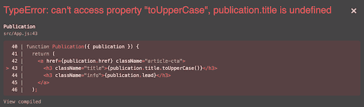
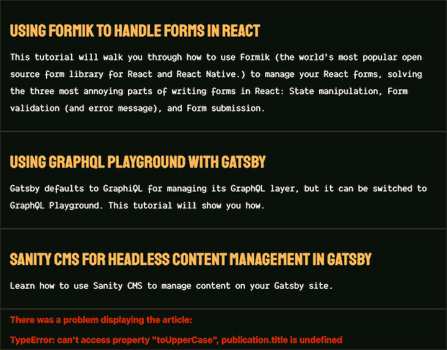
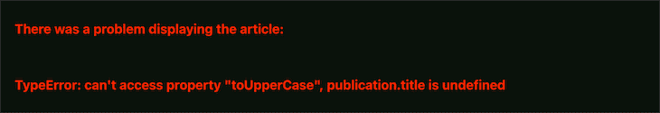

# 在 React with error boundaries-log rocket 博客中处理 JavaScript 错误

> 原文：<https://blog.logrocket.com/handling-javascript-errors-react-error-boundaries/>

错误是发展不可避免的一部分。它们似乎总是在最不合适的时候出现，以确保我们的应用程序不会像预期的那样工作。不管它们如何进入我们的代码，错误处理都是对这些无意的开发混乱的解药，更好的理解是异常。

在常规 JavaScript 中，`try…catch`语句提供了一个 API，我们可以用它来尝试并优雅地捕捉潜在的易错代码:

```
try {
  console.log(p)
} catch (error) {
  console.log(`Error: ${error}`) // ReferenceError: p is not defined 
}

```

在`try`块中检测到的任何错误都会作为异常抛出，并在`catch`块中被捕获，从而使我们的应用程序对错误更有弹性。在 React 中，这个构造可以很好地处理 JavaScript 错误，如下所示，其中我们用`useEffect`获取数据:

```
useEffect(() => {
  try {
    fetchUsers();
  } catch(error) {
    setError(error);
  }
}, []);

```

但是这在 React 组件中并不那么有效。

## 为什么`try...catch`不能捕捉 React 组件中的 JavaScript 错误

认为凭借它的功能和工作方式，`try...catch`语句可以用来捕捉 React 组件中的 JavaScript 错误是错误的。这是因为`try...catch`语句只适用于命令式代码，而不是组件中的[声明式代码](https://blog.logrocket.com/writing-readability-declarative-arrays/)。

```
function ErrorFallbackUI({ errorMessage }) {
  return (
    <div className="article-error">
      <h3>There was a problem displaying the article:</h3>
      <h3 className="error">{errorMessage}</h3>
    </div>
  );
}

// There's an attempt to uppercase each publication title
function Publication({ publication }) {
  return (
    <a href={publication.href} className="article-cta">
      <h3 className="title">{publication.title.toUpperCase()}</h3>
      <h3 className="info">{publication.lead}</h3>
    </a>
  );
}

// Map over the list of publications and try to render a <Publication/>
function Publications({ publications }) {
  try {
    return publications.map((publication, index) => (
      <div key={index}>
        <Publication {...{ publication }} />
      </div>
    ));
  } catch (error) {
    return <ErrorFallbackUI {...{ errorMessage: error.errorMessage }} />;
  }
}

```



This error fallback UI has been clipped to show the relevant part. Dismiss the error UI to view the normal state of the application.

需要注意的是，上述错误只会在开发过程中出现。在生产中，用户界面将被破坏，用户将看到一个空白屏幕。我们如何解决这个问题？输入误差界限。

> **N.B.** ，像 create-react-app 和 Next.js 这样的工具都有一个错误叠加组件，每当有错误的时候就会阻塞 UI，遮住你自己的错误边界。在本教程使用的 create-react-app 中，我们需要关闭右上角带有 **X** 标记的覆盖图，以查看我们自己使用的错误边界。

## 在 React 中使用错误边界

错误边界是 React 组件，它提供了一种方式来优雅地处理 React 组件中的 JavaScript 错误。有了它们，我们可以捕捉组件中的 JavaScript 运行时错误，处理这些错误，并显示一个后备 UI。

```
import ErrorBoundary from "error-boundary";

function Users() {
  return (
    <div>
      <ErrorBoundary>
        {/* the rest of your application */}
      </ErrorBoundary/>
    </div>
  )
}

```

错误边界的操作类似于 JavaScript `try...catch`语句中的`catch`块，但有几个例外:它们是声明性的，或许不用说，只捕捉 React 组件中的错误。

更具体地说，它们在渲染阶段和生命周期方法中捕捉子组件中的错误。在错误边界的任何子组件中抛出的错误将被委托给组件树中最近的错误边界。

相比之下，错误边界不会捕捉发生在以下位置的错误:

*   [事件处理程序](https://reactjs.org/docs/error-boundaries.html#how-about-event-handlers)
*   异步代码
*   服务器端渲染
*   错误边界本身引发的错误

对于充当误差边界的组件，有一些规则要遵循:

1.  它必须是一个类组件
2.  它必须定义生命周期方法`[static getDerivedStateFromError()](https://blog.logrocket.com/react-reference-guide-react-component/#fromerror)`或`[componentDidCatch()](https://blog.logrocket.com/react-reference-guide-react-component/#didcatch)`中的一个或两个

经验法则是，`static getDerivedStateFromError()`应该用于在抛出错误后呈现回退 UI，而`componentDidCatch()`应该用于记录这些错误。

下面的`<PublicationErrorBoundary/>`分量是一个误差边界，因为它满足必要的标准:

```
class PublicationErrorBoundary extends Component {
  state = { error: false, errorMessage: '' };

  static getDerivedStateFromError(error) {
    // Update state to render the fallback UI
    return { error: true, errorMessage: error.toString() };
  }

  componentDidCatch(error, errorInfo) {
    // Log error to an error reporting service like Sentry
    console.log({ error, errorInfo });
  }

  render() {
    const { error, errorMessage } = this.state;
    const { children } = this.props;

    return error ? <ErrorFallbackUI {...{ error, errorMessage }} /> : children;
  }
}

```

`<PublicationErrorBoundary/>`用以下更新替换上述`<Publications/>`组件中的`try...catch`模块:

```
function Publications({ publications }) {
  return publications.map((publication, index) => (
    <div key={index}>
      <PublicationErrorBoundary>
        <Publication {...{ publication }} />
      </PublicationErrorBoundary>
    </div>
  ));
}

```

现在，`<Publication/>`试图大写每个出版物标题时抛出的错误允许[进行优雅的异常处理](https://blog.logrocket.com/elegant-error-handling-javascript-either-monad/)。错误已被隔离，并显示了回退用户界面。



App UI with error boundary and a fallback UI.

你可以在 [CodeSandbox](https://codesandbox.io/s/react-error-boundary-zswhk?file=/src/App.js) 上看到这个例子。

## 在组件树中放置错误边界的位置

Next.js 文档很好地解释了[一般的经验法则](https://nextjs.org/docs/basic-features/fast-refresh#runtime-errors):错误边界不应该太细；它们由 React 在生产中使用，并且应该总是有意设计的。

错误边界是特殊的 React 组件，应该仅在适当的时候用于捕捉错误。可以在应用程序的不同部分使用不同的错误边界来处理上下文错误，尽管它们可以是通用的，例如，网络连接错误边界。

注意，在前面的例子中，`Publications`中使用的是`<PublicationErrorBoundary/>`，而不是`Publication`。如果以其他方式使用，那么`<PublicationErrorBoundary/>`不会捕捉到试图大写每个出版物标题时抛出的错误，因为`<PublicationErrorBoundary/>`的子节点将是一个超链接，而不是一个组件。然而，在`<Publications/>`中使用它解决了这个问题。

```
// This won't work because the children of `PublicationErrorBoundary`
// aren't components
function Publication({ publication }) {
  return (
    <PublicationErrorBoundary>
      <a href={publication.href} className="article-cta">
        <h3 className="title">{publication.title.toUpperCase()}</h3>
        <h3 className="info">{publication.lead}</h3>
      </a>
    </PublicationErrorBoundary>
  );
}

```

另外，请注意，每个发布都有一个错误边界来监听它是否出错。如果至少有一个出版物有错误，那么不显示任何出版物是有意义的，那该怎么办呢？`<Publications/>`可以更新:

```
// Before
function Publications({ publications }) {
  return publications.map((publication, index) => (
    <div key={index}>
      <PublicationErrorBoundary>
        <Publication {...{ publication }} />
      </PublicationErrorBoundary>
    </div>
  ));
}

// After. Notice the location of `PublicationErrorBoundary`
function Publications({ publications }) {
  return (
    <PublicationErrorBoundary>
      {publications.map((publication, index) => (
        <div key={index}>
          <Publication {...{ publication }} />
        </div>
      ))}
    </PublicationErrorBoundary>
  );
}

```

用户界面将被更新以显示回退用户界面:



## 误差边界传播

类似于`catch`块的工作方式，如果一个错误边界试图呈现错误消息失败，错误将传播到它上面最近的错误边界。如果抛出的错误没有被任何错误边界捕获，整个组件树将被卸载。

这是从 React 16 开始的[新行为，理由是完全移除损坏的 UI 比将其留在原处更好，并且在出现错误时提供更好的用户体验。](https://reactjs.org/docs/error-boundaries.html#new-behavior-for-uncaught-errors)

```
<AppErrorBoundary>
  <App>
    <PublicationsErrorBoundary>
      <Publications>
        <PublicationErrorBoundary>
          <Publication />
        <PublicationErrorBoundary>
      </Publications>
    </PublicationsErrorBoundary>
  </App>
</AppErrorBoundary>

```

以上面人为的组件树为例。如果在`<Publication/>`中捕捉到错误，最近的错误边界`<PublicationErrorBoundary/>`将对此负责。如果它不能履行自己的职责，`<PublicationsErrorBoundary/>`将作为后备力量。如果同样失败，`<AppErrorBoundary/>`将尝试在组件完全卸载之前处理错误。

## 重置误差边界

这是我在使用错误边界时发现的边缘情况之一。通常，这是通过重置 UI 状态并从损坏中恢复 UI 来完成的。

假设用户失去连接，并且连接错误边界已经成功地显示回退 UI，提醒用户检查他们的连接。当连接状态变为活动时，我们可以恢复 UI 吗？简单的回答是可以，另外就是看情况。

错误可能是棘手的、动态的和不确定的，您最好研究一下数据获取工具，如 SWR 或 React Query，或[React-error-boundary package](https://blog.logrocket.com/error-handling-react-error-boundary)，它们可以缓解这类问题。

## 结论

只要这样做是合理的，就应该使用错误边界来处理 React 应用程序中的运行时错误。你和他们越熟悉，你就越明白他们存在的理由。

特别是有了 react-error-boundary 包，您可以减少冗余代码的数量和您遇到的经过良好测试的抽象的不确定性——正如 Kent Dodds 所说的那样，这是任何人都需要的最后一个错误边界组件。

## [LogRocket](https://lp.logrocket.com/blg/react-signup-general) :全面了解您的生产 React 应用

调试 React 应用程序可能很困难，尤其是当用户遇到难以重现的问题时。如果您对监视和跟踪 Redux 状态、自动显示 JavaScript 错误以及跟踪缓慢的网络请求和组件加载时间感兴趣，

[try LogRocket](https://lp.logrocket.com/blg/react-signup-general)

.

[ ](https://lp.logrocket.com/blg/react-signup-general) [](https://lp.logrocket.com/blg/react-signup-general) 

LogRocket 结合了会话回放、产品分析和错误跟踪，使软件团队能够创建理想的 web 和移动产品体验。这对你来说意味着什么？

LogRocket 不是猜测错误发生的原因，也不是要求用户提供截图和日志转储，而是让您回放问题，就像它们发生在您自己的浏览器中一样，以快速了解哪里出错了。

不再有嘈杂的警报。智能错误跟踪允许您对问题进行分类，然后从中学习。获得有影响的用户问题的通知，而不是误报。警报越少，有用的信号越多。

LogRocket Redux 中间件包为您的用户会话增加了一层额外的可见性。LogRocket 记录 Redux 存储中的所有操作和状态。

现代化您调试 React 应用的方式— [开始免费监控](https://lp.logrocket.com/blg/react-signup-general)。