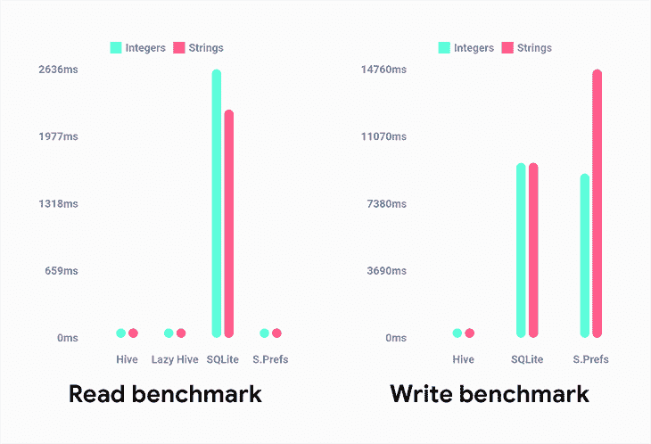
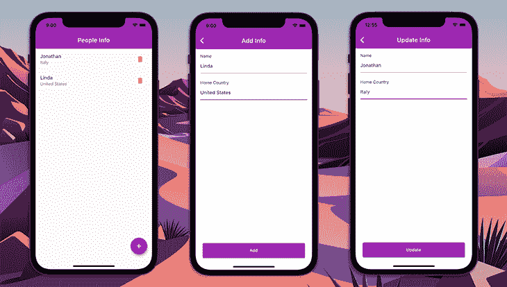
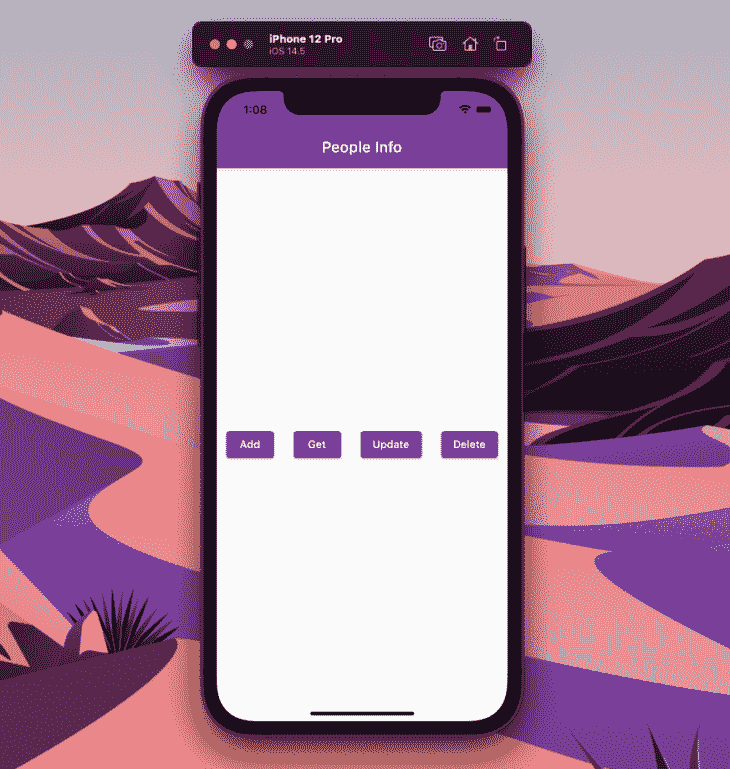
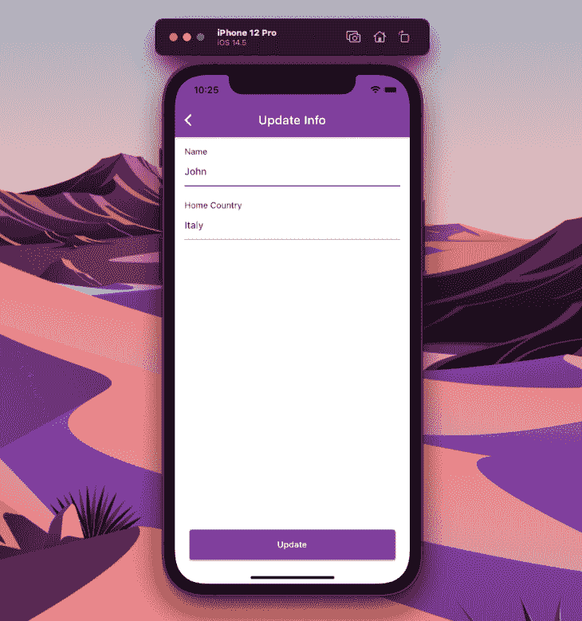
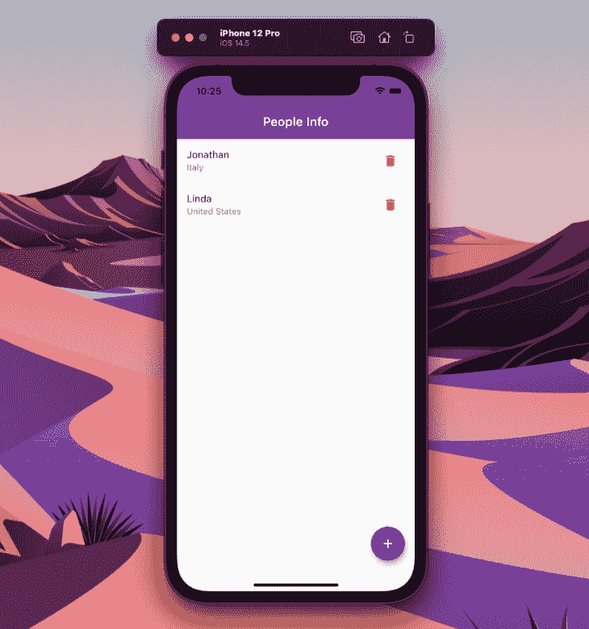
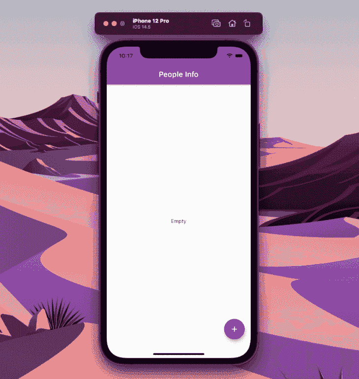

# 用 Hive - LogRocket 博客处理 Flutter 中的本地数据持久性

> 原文：<https://blog.logrocket.com/handling-local-data-persistence-flutter-hive/>

在本地存储数据并在应用启动之间保持数据是任何移动应用开发过程的基本概念之一。几乎每个应用程序都要求您处理数据，从存储送餐应用程序的客户信息，到游戏中的分数，或者一个简单的值，以了解用户在上次访问时是否打开了黑暗模式。

Flutter 提供了很多本地数据持久化选项供开发者选择。 [shared_preferences](https://pub.dev/packages/shared_preferences) 是一个很好的包，用于在本地存储小的键值对，而 [sqflite](https://pub.dev/packages/sqflite) ，Flutter 的 SQLite 包，当您处理需要您处理数据库中复杂关系的强关系数据时，是一个很好的选择。

但是如果你想要一个快速安全的本地数据库，没有本地依赖，也可以在 Flutter web 上运行(😉)，那么[蜂巢](https://pub.dev/packages/hive)是一个相当不错的选择。

在本文中，在我们使用 Flutter 构建一个简单的应用程序之前，您将了解如何开始使用 Hive。我们还将研究一个允许您在 Hive 中处理简单关系数据的概念。

## 为什么是蜂巢？

让我们首先来看看为什么应该选择 Hive，而不是其他可以在 Flutter 中本地持久化数据的解决方案。

Hive 是一个轻量级和快速的键值数据库解决方案，它是跨平台的(运行在移动、桌面和 web 上)，并且是用纯 Dart 编写的。这让它比不支持 Flutter web 的 [sqflite](https://pub.dev/packages/sqflite) 更具优势——Hive 没有原生依赖，所以它可以在 web 上无缝运行。

下图是 Hive 与其他类似数据库解决方案的对比基准:



This is a benchmark of 1000 read and write operations performed on a Oneplus 6T device with Android Q. You can learn more about this benchmark on [Hive’s GitHub](https://github.com/hivedb/hive#benchmark).

Hive 还允许您使用 [TypeAdapters](https://docs.hivedb.dev/#/custom-objects/type_adapters) 存储自定义类。我们将在本文后面的中更详细地介绍[。](#using-custom-objects-typeadapter)

## Hive 入门

让我们构建一个基本的应用程序，其中存储了用户的详细信息，并且可以对数据执行添加、读取、更新和删除操作。



使用以下命令创建一个新的[颤振项目](https://blog.logrocket.com/tag/flutter/):

```
flutter create hive_demo

```

您可以使用您最喜欢的 IDE 打开项目，但是对于这个例子，我将使用 VS 代码:

```
code hive_demo

```

将 Hive 和 [hive_flutter](https://pub.dev/packages/hive_flutter) 包添加到您的`pubspec.yaml`文件中:

```
dependencies:
  hive: ^2.1.0
  hive_flutter: ^1.1.0

```

将您的`main.dart`文件的内容替换为:

```
import 'package:flutter/material.dart';

main() {
  runApp(MyApp());
}

class MyApp extends StatelessWidget {
  @override
  Widget build(BuildContext context) {
    return MaterialApp(
      title: 'Hive Demo',
      theme: ThemeData(
        primarySwatch: Colors.purple,
      ),
      debugShowCheckedModeBanner: false,
      home: InfoScreen(),
    );
  }
}

```

`InfoScreen`将显示用户的详细信息——我们一会儿就来看看。在此之前，我们先了解一下 Hive 使用的一个重要概念。

## 了解 Hive 中的盒子

Hive 使用“盒子”的概念在数据库中存储数据。盒子类似于 SQL 数据库中的表，只是盒子没有严格的结构。这意味着盒子是灵活的，只能处理数据之间的简单关系。

在访问存储在盒子里的数据之前，你必须打开它。这会将盒子的全部内容从本地存储加载到内存中，以便可以轻松访问盒子中的任何数据。

下面的例子展示了如何打开一个名为`peopleBox`的盒子并从中获取参数`name`:

```
var box = await Hive.openBox('peopleBox');
String name = box.get('name');
```

除了普通盒子，还有两种不同的盒子:

### 在 Hive 中使用惰性盒

正常的蜂巢盒在打开时会将盒子的全部内容载入内存。但是如果盒子里有大量的数据，这可能不是加载盒子的好方法。

在打开一个惰性盒时，只有密钥被读取并存储在内存中。您可以使用键从框中检索其各自的值。

你可以像这样使用一个懒人盒子:

```
var lazyBox = await Hive.openLazyBox('hugePeopleBox');
String name = await lazyBox.get('name');
```

注意:为了从一个普通的盒子中访问一个值，你必须在不使用`await`的情况下获得它。但是，在惰性盒中，您必须使用`await`,因为内容不在内存中——只有它各自的键可用。

### 用加密箱存储敏感信息

您可能需要使用 Hive 存储一些敏感信息，这就是加密盒的用处。Hive 自带对 AES-256 加密的支持，以及一个使用福尔图娜算法生成加密密钥的帮助函数。

为了将加密密钥安全地存储在设备中，建议使用`flutter_secure_storage`包。

下面是一个创建和打开加密盒子的示例:

```
const secureStorage = FlutterSecureStorage();
final encryprionKey = await secureStorage.read(key: 'key');

if (encryprionKey == null) {
  final key = Hive.generateSecureKey();
  await secureStorage.write(
    key: 'key',
    value: base64UrlEncode(key),
  );
}

final key = await secureStorage.read(key: 'key');
final encryptionKey = base64Url.decode(key!);
print('Encryption key: $encryptionKey');

await Hive.openBox(
  'securedBox',
  encryptionCipher: HiveAesCipher(encryptionKey),
);
```

要在该框中获取和存储数据，可以使用以下方法:

```
final encryptedBox = Hive.box('securedBox');

_getData() {
  setState(() {
    data = encryptedBox.get('secret');
  });
  log('Fetched data');
}

_putData() async {
  await encryptedBox.put('secret', 'Test secret key');
  log('Stored data');
}
```

使用 Hive 加密盒的完整示例可从[这里](https://github.com/sbis04/hive_demo/tree/encrypted-box)获得。

## 正在初始化配置单元

在继续进行数据库的 CRUD 操作之前，初始化 Hive 并打开一个将用于存储数据的盒子。

Hive 应该在我们加载任何盒子之前进行初始化，所以最好在你的 Flutter app 的`main()`函数内部进行初始化，以避免任何错误。请注意，如果您在非 Flutter、纯 Dart 应用程序中使用 Hive，请使用`Hive.init()`来初始化 Hive。

```
main() async {
  // Initialize hive
  await Hive.initFlutter();
  runApp(MyApp());
}

```

让 main 函数异步，用`await`初始化 Hive。

现在，打开一个蜂箱。如果您计划在项目中使用多个盒子，请注意您应该在使用它之前打开一个盒子。

在这个应用程序中，我们将使用一个在 Hive 完成初始化后打开的盒子。

```
main() async {
  // Initialize hive
  await Hive.initFlutter();
  // Open the peopleBox
  await Hive.openBox('peopleBox');
  runApp(MyApp());
}

```

我们现在准备在本地数据库上执行 CRUD 操作。

* * *

### 更多来自 LogRocket 的精彩文章:

* * *

## 执行 CRUD 操作

我们将在`InfoScreen StatefulWidget`中定义基本的 CRUD 操作。这个类的结构如下:

```
import 'package:flutter/material.dart';
import 'package:hive/hive.dart';

class InfoScreen extends StatefulWidget {
  @override
  _InfoScreenState createState() => _InfoScreenState();
}

class _InfoScreenState extends State<InfoScreen> {
  late final Box box;

  @override
  void initState() {
    super.initState();
    // Get reference to an already opened box
    box = Hive.box('peopleBox');
  }

  @override
  void dispose() {
    // Closes all Hive boxes
    Hive.close();
    super.dispose();
  }

  @override
  Widget build(BuildContext context) {
    return Container();
  }
}

```

首先，我们在之前打开的`initState()`方法中检索对盒子的引用。在使用完打开的盒子后，在关闭应用程序之前，您应该关闭它们。

由于我们目前只需要这个小部件中的盒子，我们可以关闭这个类的`dispose()`方法中的盒子。

让我们创建一些方法来执行 CRUD 操作。

```
class _InfoScreenState extends State<InfoScreen> {
  late final Box box;

  _addInfo() async {
    // Add info to people box
  }

  _getInfo() {
    // Get info from people box
  }

  _updateInfo() {
    // Update info of people box
  }

  _deleteInfo() {
    // Delete info from people box
  }

  // ...
}

```

现在我们将构建一个非常基本的 UI，以便我们可以测试操作是否正常工作。

```
class _InfoScreenState extends State<InfoScreen> {
  // ...
  @override
  Widget build(BuildContext context) {
    return Scaffold(
      appBar: AppBar(
        title: Text('People Info'),
      ),
      body: Center(
        child: Row(
          mainAxisAlignment: MainAxisAlignment.spaceAround,
          children: [
            ElevatedButton(
              onPressed: _addInfo,
              child: Text('Add'),
            ),
            ElevatedButton(
              onPressed: _getInfo,
              child: Text('Get'),
            ),
            ElevatedButton(
              onPressed: _updateInfo,
              child: Text('Update'),
            ),
            ElevatedButton(
              onPressed: _deleteInfo,
              child: Text('Delete'),
            ),
          ],
        ),
      ),
    );
  }
}

```

该应用程序将如下所示:



### 在配置单元中存储数据

如果需要存储数据，可以使用对 Hive box 的引用，并在其上调用`put()`。此方法接受键值对。

```
// Add info to people box
_addInfo() async {
  // Storing key-value pair
  box.put('name', 'John');
  box.put('country', 'Italy');
  print('Info added to box!');
}

```

在这里，我们存储了两个键值对，一个是人的**名字**，另一个是他们的**祖国**。

Hive 还支持整数键，所以可以使用自动递增键。如果你存储多个值(有点类似于一个列表)并且想通过它们的索引来检索，这可能是有用的。你可以这样储存:

```
box.add('Linda'); // index 0, key 0
box.add('Dan');   // index 1, key 1

```

### 检索数据

要读取数据，可以对 box 对象使用`get()`方法。您只需提供`key`来检索它的值。

```
// Read info from people box
_getInfo() {
  var name = box.get('name');
  var country = box.get('country');
  print('Info retrieved from box: $name ($country)');
}

```

如果使用自动递增值，可以使用索引进行读取，如下所示:

```
box.getAt(0); // retrieves the value with index 0
box.getAt(1); // retrieves the value with index 1

```

### 更新数据

要更新特定键的数据，可以使用最初用来存储值的相同的`put()`方法。这将用新提供的值更新该键上的值。

```
// Update info of people box
_updateInfo() {
  box.put('name', 'Mike');
  box.put('country', 'United States');
  print('Info updated in box!');
}

```

如果使用自动递增的值，可以使用`putAt()`方法更新特定索引处的值。

```
box.putAt(0, 'Jenifer');

```

### 删除数据

要删除数据，您可以通过提供键来使用`delete()`方法。

```
// Delete info from people box
_deleteInfo() {
  box.delete('name');
  box.delete('country');
  print('Info deleted from box!');
}

```

这将删除这些特定键上的值。现在，如果您尝试使用这些键调用`get()`方法，它将返回空值。

如果使用自动递增值，可以通过提供索引来使用`deleteAt()`方法。

```
box.deleteAt(0);

```

## 将自定义对象与 TypeAdapter 一起使用

一般来说，Hive 支持所有的原语类型，如`List`、`Map`、`DateTime`和`Uint8List`。但是有时您可能需要存储定制的模型类来简化数据管理。

为此，您可以利用 TypeAdapter，它会生成`to`和`from`二进制方法。

TypeAdapters 可以手动编写，也可以自动生成。使用代码生成来生成所需的方法总是更好，因为它有助于防止手动编写时可能出现的任何错误(而且它也更快)。

我们将用于存储`Person`数据的模型类是:

```
class Person {
  final String name;
  final String country;

  Person({
    required this.name,
    required this.country,
  });
}

```

### 正在生成配置单元适配器

您需要添加一些依赖项来为配置单元生成 TypeAdapter。将以下内容添加到您的`pubspec.yaml`文件中:

```
dev_dependencies:
  hive_generator: ^1.1.2
  build_runner: ^2.1.8

```

注释模型类以使用代码生成:

```
import 'package:hive/hive.dart';
part 'people.g.dart';

@HiveType(typeId: 1)
class People {
  @HiveField(0)
  final String name;

  @HiveField(1)
  final String country;

  People({
    required this.name,
    required this.country,
  });
}

```

然后，您可以使用以下命令触发代码生成:

```
flutter packages pub run build_runner build

```

### 注册 TypeAdapter

您应该在打开使用 TypeAdapter 的盒子之前注册它，否则，它将产生一个错误。因为我们只使用了一个盒子，并在`main()`函数中打开了它，所以我们必须在此之前注册适配器。

```
main() async {
  // Initialize hive
  await Hive.initFlutter();
  // Registering the adapter
  Hive.registerAdapter(PersonAdapter());
  // Opening the box
  await Hive.openBox('peopleBox');

  runApp(MyApp());
}

```

现在，您可以使用这个自定义类直接执行数据库操作。

## 构建最终的应用程序

最终的应用程序将主要包括三个屏幕:

1.  `AddScreen`:用于在数据库中存储用户信息
2.  `InfoScreen`:用于显示 Hive 数据库中存在的用户信息，以及用于删除用户数据的按钮
3.  `UpdateScreen`:用于更新数据库中的用户信息

您不需要修改包含`MyApp`小部件和`main()`函数的`main.dart`文件。

### `AddScreen`

`AddScreen`将显示一个将用户数据作为输入的表格。在我们的例子中，我们将只输入两个值，**姓名**和**本国**。底部将有一个按钮发送数据到配置单元。


`AddScreen`的代码是:

```
class AddScreen extends StatefulWidget {
  @override
  _AddScreenState createState() => _AddScreenState();
}
class _AddScreenState extends State<AddScreen> {
  @override
  Widget build(BuildContext context) {
    return Scaffold(
      backgroundColor: Colors.white,
      appBar: AppBar(
        title: Text('Add Info'),
      ),
      body: Padding(
        padding: const EdgeInsets.all(16.0),
        child: AddPersonForm(),
      ),
    );
  }
}

```

`AddPersonForm`是创建表单 UI 的主要小部件。它还包含配置单元存储功能。

小部件的基本结构如下所示:

```
class AddPersonForm extends StatefulWidget {
  const AddPersonForm({Key? key}) : super(key: key);
  @override
  _AddPersonFormState createState() => _AddPersonFormState();
}

class _AddPersonFormState extends State<AddPersonForm> {
  late final Box box;

  @override
  void initState() {
    super.initState();
    // Get reference to an already opened box
    box = Hive.box('peopleBox');
  }

  @override
  Widget build(BuildContext context) {
    return Container(); 
  }
}

```

我们已经在`initState()`方法中获取了对盒子的引用。现在，我们必须为表单定义一个全局键，并添加一些文本编辑控制器。

```
class _AddPersonFormState extends State<AddPersonForm> {
  final _nameController = TextEditingController();
  final _countryController = TextEditingController();
  final _personFormKey = GlobalKey<FormState>();

  // ...
}

```

定义将数据存储到 Hive 的方法，并添加文本字段验证器:

```
class _AddPersonFormState extends State<AddPersonForm> {
  // ...

  // Add info to people box
  _addInfo() async {
    Person newPerson = Person(
      name: _nameController.text,
      country: _countryController.text,
    );
    box.add(newPerson);
    print('Info added to box!');
  }

  String? _fieldValidator(String? value) {
    if (value == null || value.isEmpty) {
      return 'Field can\'t be empty';
    }
    return null;
  }

  // ...
}

```

用户界面的代码如下:

```
class _AddPersonFormState extends State<AddPersonForm> {
  // ...

  @override
  Widget build(BuildContext context) {
    return Form(
      key: _personFormKey,
      child: Column(
        crossAxisAlignment: CrossAxisAlignment.start,
        children: [
          Text('Name'),
          TextFormField(
            controller: _nameController,
            validator: _fieldValidator,
          ),
          SizedBox(height: 24.0),
          Text('Home Country'),
          TextFormField(
            controller: _countryController,
            validator: _fieldValidator,
          ),
          Spacer(),
          Padding(
            padding: const EdgeInsets.fromLTRB(8.0, 0.0, 8.0, 24.0),
            child: Container(
              width: double.maxFinite,
              height: 50,
              child: ElevatedButton(
                onPressed: () {
                  if (_personFormKey.currentState!.validate()) {
                    _addInfo();
                    Navigator.of(context).pop();
                  }
                },
                child: Text('Add'),
              ),
            ),
          ),
        ],
      ),
    );
  }
}

```

### `UpdateScreen`在蜂房里

`UpdateScreen`将类似于`AddScreen`，但是这里我们将传递`Person`对象来显示文本字段中的当前值。



该屏幕的代码将是:

```
class UpdateScreen extends StatefulWidget {
  final int index;
  final Person person;

  const UpdateScreen({
    required this.index,
    required this.person,
  });

  @override
  _UpdateScreenState createState() => _UpdateScreenState();
}

class _UpdateScreenState extends State<UpdateScreen> {
  @override
  Widget build(BuildContext context) {
    return Scaffold(
      backgroundColor: Colors.white,
      appBar: AppBar(
        title: Text('Update Info'),
      ),
      body: Padding(
        padding: const EdgeInsets.all(16.0),
        child: UpdatePersonForm(
          index: widget.index,
          person: widget.person,
        ),
      ),
    );
  }
}

```

在`UpdatePersonForm`小部件中唯一的不同是它将包含一个更新 Hive 数据库中的值的方法。

```
class _UpdatePersonFormState extends State<UpdatePersonForm> {
  late final _nameController;
  late final _countryController;
  late final Box box;

  // ...

  // Update info of people box
  _updateInfo() {
    Person newPerson = Person(
      name: _nameController.text,
      country: _countryController.text,
    );
    box.putAt(widget.index, newPerson);
    print('Info updated in box!');
  }

  @override
  void initState() {
    super.initState();
    // Get reference to an already opened box
    box = Hive.box('peopleBox');
    // Show the current values
    _nameController = TextEditingController(text: widget.person.name);
    _countryController = TextEditingController(text: widget.person.country);
  }

  @override
  Widget build(BuildContext context) {
    return Form(
      // ...
    );
  }
}

```

### `InfoScreen`

`InfoScreen`将显示存储在 Hive 中的`Person`数据。基本上，`read`操作将在这里进行。



Hive 提供了一个名为`ValueListenableBuilder`的小部件，只有当数据库中的任何值被修改时才会刷新。

该屏幕将包含一些附加功能:

*   点击每个列表项旁边的**删除**按钮将从数据库中删除用户数据
*   点击每个列表项将导航至`UpdateScreen`
*   点击右下方的浮动操作按钮将带您进入`AddScreen`

该屏幕的代码是:

```
class InfoScreen extends StatefulWidget {
  @override
  _InfoScreenState createState() => _InfoScreenState();
}

class _InfoScreenState extends State<InfoScreen> {
  late final Box contactBox;

  // Delete info from people box
  _deleteInfo(int index) {
    contactBox.deleteAt(index);
    print('Item deleted from box at index: $index');
  }

  @override
  void initState() {
    super.initState();
    // Get reference to an already opened box
    contactBox = Hive.box('peopleBox');
  }

  @override
  Widget build(BuildContext context) {
    return Scaffold(
      appBar: AppBar(
        title: Text('People Info'),
      ),
      floatingActionButton: FloatingActionButton(
        onPressed: () => Navigator.of(context).push(
          MaterialPageRoute(
            builder: (context) => AddScreen(),
          ),
        ),
        child: Icon(Icons.add),
      ),
      body: ValueListenableBuilder(
        valueListenable: contactBox.listenable(),
        builder: (context, Box box, widget) {
          if (box.isEmpty) {
            return Center(
              child: Text('Empty'),
            );
          } else {
            return ListView.builder(
              itemCount: box.length,
              itemBuilder: (context, index) {
                var currentBox = box;
                var personData = currentBox.getAt(index)!;
                return InkWell(
                  onTap: () => Navigator.of(context).push(
                    MaterialPageRoute(
                      builder: (context) => UpdateScreen(
                        index: index,
                        person: personData,
                      ),
                    ),
                  ),
                  child: ListTile(
                    title: Text(personData.name),
                    subtitle: Text(personData.country),
                    trailing: IconButton(
                      onPressed: () => _deleteInfo(index),
                      icon: Icon(
                        Icons.delete,
                        color: Colors.red,
                      ),
                    ),
                  ),
                );
              },
            );
          }
        },
      ),
    );
  }
}

```

恭喜你，🥳，你已经使用 Hive 作为本地持久数据库完成了你的 Flutter 应用程序。

最终应用程序的演示如下所示:



## 结论

本文涵盖了 Hive 的大部分重要的基本概念。使用 Hive 数据库还可以做一些事情，包括存储简单的关系数据。使用 [HiveList](https://docs.hivedb.dev/#/custom-objects/relationships) 可以处理数据之间的简单关系，但是如果你在 Hive 中存储任何敏感数据，那么你应该使用[加密盒](https://docs.hivedb.dev/#/advanced/encrypted_box)。

简而言之，Hive 是 Flutter 中本地数据持久性的最佳选择之一，特别是考虑到它的速度非常快，而且[几乎支持所有平台](https://blog.logrocket.com/achieving-responsive-design-flutter/)。

感谢您阅读文章！如果你对这篇文章或例子有任何建议或问题，请随时通过 [Twitter](https://twitter.com/sbis04) 或 [LinkedIn](https://www.linkedin.com/in/sbis04/) 与我联系。你也可以在我的 GitHub 上找到示例应用[的资源库。](https://github.com/sbis04/hive_demo)

## 使用 [LogRocket](https://lp.logrocket.com/blg/signup) 消除传统错误报告的干扰

[](https://lp.logrocket.com/blg/signup)

[LogRocket](https://lp.logrocket.com/blg/signup) 是一个数字体验分析解决方案，它可以保护您免受数百个假阳性错误警报的影响，只针对几个真正重要的项目。LogRocket 会告诉您应用程序中实际影响用户的最具影响力的 bug 和 UX 问题。

然后，使用具有深层技术遥测的会话重放来确切地查看用户看到了什么以及是什么导致了问题，就像你在他们身后看一样。

LogRocket 自动聚合客户端错误、JS 异常、前端性能指标和用户交互。然后 LogRocket 使用机器学习来告诉你哪些问题正在影响大多数用户，并提供你需要修复它的上下文。

关注重要的 bug—[今天就试试 LogRocket】。](https://lp.logrocket.com/blg/signup-issue-free)