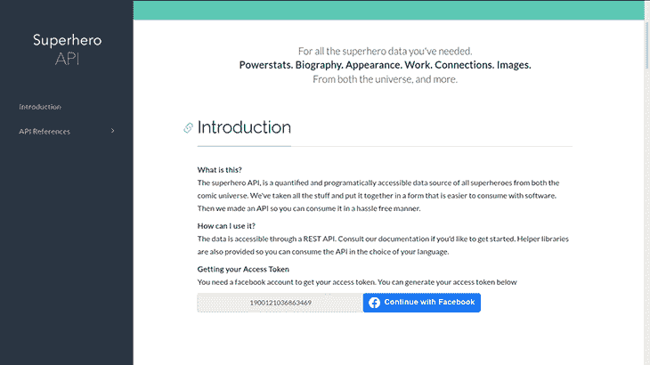
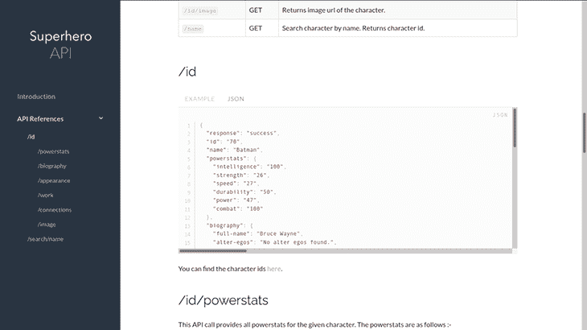
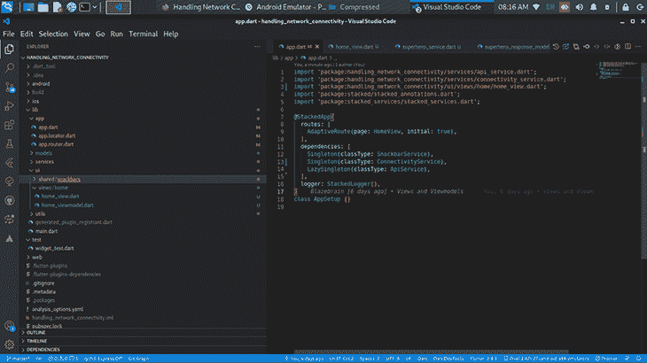

# 在 Flutter 中处理网络连接

> 原文：<https://blog.logrocket.com/handling-network-connectivity-flutter/>

## 介绍

三、二、一——开始！拿起你的手机，打开你最喜欢的应用程序，点击应用程序图标，它打开，让你登录，然后嘣…它继续加载。你可能认为它仍然在获取数据，所以你给它一分钟，然后一个变成两个，两个变成三个，三个变成五个——仍然在加载。没有信息，没有错误，只是加载。出于沮丧，你关闭了应用程序，要么寻找替代方案，要么在放弃前再试一次。

网络连接非常重要，尤其是对于我们的应用程序中严重依赖连接状态的特定部分。作为开发人员，我们应该处理好应用程序的这些方面。通过监控用户的互联网连接，我们可以触发一条消息，通知用户他们的连接有问题，最重要的是，一旦互联网连接恢复，触发一个加载所需数据的功能，为用户提供我们想要的无缝体验。

我们不希望不稳定的连接成为我们应用的败笔——即使我们用户的互联网连接质量不一定在我们的控制之下——但我们可以进行一些检查，通知我们的用户这个问题，并根据连接状态采取行动。

我们将在以下几节中对此进行实际探讨:

本文中的“连接状态”指的是活动连接、脱机、不稳定等。我们开始吧，好吗？

## 在我们的示例应用程序中实现连接处理程序

我们将在本节中构建的示例应用程序已经开始扭转局面(我们使用超级英雄 API 是有原因的)。我们将从超级英雄 API 获取数据并显示给用户。

让我们暂停一下。我们的目标是监控连通性，对吗？

虽然这是正确的，但我们还需要监控设备的互联网连接。当连接断开时，我们需要向用户显示一条消息，通知他们这种情况，当互联网连接恢复时，我们必须立即调用 API 并获取我们的数据。

为了确保我们的应用程序不会在连接状态每次改变时都获取数据，我们还将引入一个额外的变量，其职责是通知应用程序我们是否调用了加载数据的函数。

### 超级英雄 API 设置

在我们开始编写代码之前，在我们可以使用超级英雄 API 之前，我们需要在我们的示例站点上做一些事情。

首先，去超级英雄 API 网站。您需要使用脸书登录，以便获得我们将用于查询 API 的访问令牌。



登录后，您可以复制访问令牌并在应用程序中使用它。

第二件事是选择一个角色。超人？绝对的。

从文档中可以看出，超级英雄 API 为每个超级英雄提供了一个 [ID。然后，这个 ID 在我们的 API 查询中使用，并返回关于那个特定英雄的信息。超人的 ID 是`644`，所以记下来。](https://superheroapi.com/ids.html)

完成这两件事后，我们就可以自由地设置项目并开始查询 API 了。

## 项目设置

运行以下命令为项目创建新的基本代码。

```
flutter create handling_network_connectivity

```

在我们的`pubspec.yaml`文件中导入以下依赖项:

*   `[http](https://pub.dev/packages/http)`:向[超级英雄 API](https://superheroapi.com/?ref=apilist.fun) 发出`GET`请求，并检索我们选择的超级英雄的角色数据
*   这是我们将在这个包中使用的架构解决方案，[利用了幕后的提供者](https://blog.logrocket.com/provider-vs-riverpod-comparing-state-managers-in-flutter),让我们可以访问一些非常酷的类来增加我们开发过程的趣味
*   `[stacked_services](https://pub.dev/packages/stacked_services)`:堆叠包提供的现成服务
*   `[build_runner](https://pub.dev/packages/build_runner)`:提供从注释自动生成文件的运行命令
*   `[stacked_generator](https://pub.dev/packages/stacked_generator)`:从堆叠的标注生成文件
*   `[logger](https://pub.dev/packages/logger)`:将重要信息打印到调试控制台

```
dependencies:
 cupertino_icons: ^1.0.2
 flutter:
  sdk: flutter
 stacked: ^2.2.7
 stacked_services: ^0.8.15
 logger: ^1.1.0
dev_dependencies:
 build_runner: ^2.1.5
 flutter_lints: ^1.0.0
 flutter_test:
  sdk: flutter
 stacked_generator: ^0.5.6
flutter:
 uses-material-design: true

```

这样一来，我们就可以开始实际的开发了。

## 建立我们的数据模型

从[超级英雄 API 文档](https://superheroapi.com/?ref=apilist.fun#id)中，我们看到对特定`superheroId`的调用返回超级英雄的传记、能力统计、背景、外貌、形象等等。



在本文中，我们将只处理`biography`、`powerstats`和`image`字段，但是如果需要，您可以决定添加更多的数据。因此，我们需要创建模型来将 JSON 响应转换成我们的`Object`数据。

在`lib`目录下创建一个文件夹。将文件夹命名为`models`；所有模型都将在该文件夹中创建。创建一个名为`biography.dart`的新文件，我们将使用文档中的示例响应在其中创建`biography`模型类。

```
class Biography {
  String? fullName;
  String? alterEgos;
  List<String>? aliases;
  String? placeOfBirth;
  String? firstAppearance;
  String? publisher;
  String? alignment;
  Biography(
      {this.fullName,
      this.alterEgos,
      this.aliases,
      this.placeOfBirth,
      this.firstAppearance,
      this.publisher,
      this.alignment});
  Biography.fromJson(Map<String, dynamic> json) {
    fullName = json['full-name'];
    alterEgos = json['alter-egos'];
    aliases = json['aliases'].cast<String>();
    placeOfBirth = json['place-of-birth'];
    firstAppearance = json['first-appearance'];
    publisher = json['publisher'];
    alignment = json['alignment'];
  }
  Map<String, dynamic> toJson() {
    final Map<String, dynamic> data = {};
    data['full-name'] = fullName;
    data['alter-egos'] = alterEgos;
    data['aliases'] = aliases;
    data['place-of-birth'] = placeOfBirth;
    data['first-appearance'] = firstAppearance;
    data['publisher'] = publisher;
    data['alignment'] = alignment;
    return data;
  }
}

```

接下来，创建`Powerstats`模型:

```
class Powerstats {
  String? intelligence;
  String? strength;
  String? speed;
  String? durability;
  String? power;
  String? combat;
  Powerstats(
      {this.intelligence,
      this.strength,
      this.speed,
      this.durability,
      this.power,
      this.combat});
  Powerstats.fromJson(Map<String, dynamic> json) {
    intelligence = json['intelligence'];
    strength = json['strength'];
    speed = json['speed'];
    durability = json['durability'];
    power = json['power'];
    combat = json['combat'];
  }
  Map<String, dynamic> toJson() {
    final Map<String, dynamic> data = {};
    data['intelligence'] = intelligence;
    data['strength'] = strength;
    data['speed'] = speed;
    data['durability'] = durability;
    data['power'] = power;
    data['combat'] = combat;
    return data;
  }
}

```

下一个模型是`Image`模型:

```
class Image {
  String? url;
  Image({this.url});
  Image.fromJson(Map<String, dynamic> json) {
    url = json['url'];
  }
  Map<String, dynamic> toJson() {
    final Map<String, dynamic> data = {};
    data['url'] = url;
    return data;
  }
}

```

最后，我们有整体的`SuperheroResponse`模型，它将所有这些模型联系在一起。

* * *

### 更多来自 LogRocket 的精彩文章:

* * *

```
import 'package:handling_network_connectivity/models/power_stats_model.dart';
import 'biography_model.dart';
import 'image_model.dart';
class SuperheroResponse {
  String? response;
  String? id;
  String? name;
  Powerstats? powerstats;
  Biography? biography;
  Image? image;
  SuperheroResponse(
      {this.response,
      this.id,
      this.name,
      this.powerstats,
      this.biography,
      this.image});
  SuperheroResponse.fromJson(Map<String, dynamic> json) {
    response = json['response'];
    id = json['id'];
    name = json['name'];
    powerstats = json['powerstats'] != null
        ? Powerstats.fromJson(json['powerstats'])
        : null;
    biography = json['biography'] != null
        ? Biography.fromJson(json['biography'])
        : null;
    image = json['image'] != null ? Image.fromJson(json['image']) : null;
  }
  Map<String, dynamic> toJson() {
    final Map<String, dynamic> data = {};
    data['response'] = response;
    data['id'] = id;
    data['name'] = name;
    if (powerstats != null) {
      data['powerstats'] = powerstats!.toJson();
    }
    if (biography != null) {
      data['biography'] = biography!.toJson();
    }
    if (image != null) {
      data['image'] = image!.toJson();
    }
    return data;
  }
}

```

有了这些，我们就可以前进到下一步，即创建处理我们应用程序各个方面的服务。

## 注册依赖关系和路由

在`lib`目录下新建一个文件夹，命名为`app`。在这个文件夹中，创建一个文件来保存我们所有必要的配置，比如路由、服务和日志，并将其命名为`app.dart`。要做到这一点，我们需要为这些配置创建基本的文件夹结构，但是我们将在继续进行的过程中充分充实它们。

现在，创建一个名为`UI`的新文件夹。我们将在我们的演示应用程序中有一个单独的屏幕，即`homeView`，它将显示数据。

在`UI`目录中，创建两个文件夹:

1.  `shared`，它将包含我们共享的 UI 组件，如`snackbars`、`bottomsheets`等。，我们将在整个应用中使用
2.  `views`，它将包含实际的视图文件



在`view`目录中，创建一个名为`homeView`的新文件夹，并创建两个新文件，`home_view.dart`用于业务逻辑和功能，而`home_viewmodel.dart`用于 UI 代码。

在`home_viewmodel.dart`类中，创建一个扩展`BaseViewModel`的空类。

```
class HomeViewModel extends BaseViewModel{}

```

在`home_view.dart`文件中，创建一个无状态小部件，并从堆栈包中返回`ViewModelBuilder.reactive()`函数。无状态小部件返回`ViewModelBuilder.reactive()`构造函数，它将视图文件与`viewmodel`绑定，允许我们访问在`viewmodel`文件中声明的逻辑和函数。

现在是`homeView`了:

```
class HomeView extends StatelessWidget {
 const HomeView({Key? key}) : super(key: key);
 @override
 Widget build(BuildContext context) {
  return ViewModelBuilder<HomeViewModel>.reactive(
   viewModelBuilder: () => HomeViewModel(),
   onModelReady: (viewModel) => viewModel.setUp(),
   builder: (context, viewModel, child) {
    return Scaffold();
   },
  );
 }
}

```

接下来，我们将创建服务的基础结构。在`lib`目录下创建一个名为`services`的新文件夹。这个文件夹是我们创建三个新文件及其基础结构的地方。

我们将提供三种服务:

1.  `ApiService`:处理来自我们的应用程序
    `class ApiService {}`的所有出站连接
2.  `SuperheroService`:处理对超级英雄 API 的调用，使用我们的模型类解析响应，并将数据返回给我们的`viewmodel
    class SuperheroService{}`
3.  `ConnectivityService`:负责监控用户活跃的互联网连接
    `class ConnectivityService{}`

接下来，设置我们的路线并注册服务。我们将利用来自堆栈包的`@StackedApp`注释。这个注释允许我们访问两个参数:routes 和 dependencies。在 dependencies 块中注册服务，并在 route 块中声明路由。

我们将把`SnackbarService`和`ConnectivityService`注册为`Singleton`,而不是`LazySingleton`,因为我们希望它们在应用程序启动时加载、启动并运行，而不是等到第一次实例化。

```
import 'package:handling_network_connectivity/services/api_service.dart';
import 'package:handling_network_connectivity/services/connectivity_service.dart';
import 'package:handling_network_connectivity/ui/home/home_view.dart';
import 'package:stacked/stacked_annotations.dart';
import 'package:stacked_services/stacked_services.dart';
@StackedApp(
  routes: [
    AdaptiveRoute(page: HomeView, initial: true),
  ],
  dependencies: [
    Singleton(classType: SnackbarService),
    Singleton(classType: ConnectivityService),
    LazySingleton(classType: ApiService),
    LazySingleton(classType: SuperheroService)
  ],
  logger: StackedLogger(),
)
class AppSetup {}

```

运行下面的 Flutter 命令来生成所需的文件。

```
flutter pub run build_runner build --delete-conflicting-outputs

```

该命令生成`app.locator.dart`和`app.router.dart`文件，我们的依赖项和路由被注册到这些文件中。

## 填写服务

要设置的第一个服务是`ApiService`。这是一个非常干净的类，我们将用它来处理使用`http`包的出站/远程连接。

将 http 包作为`http`导入，并创建一个方法。get 方法接受一个`url`参数，这是我们将请求指向的`url`。使用`http`包调用`url`，检查我们的`statusCode`是否是`200`，如果是，我们返回`decodedResponse`。

然后我们用一个`try-catch`块包装整个调用，以便捕捉任何可能抛出的异常。那基本上就是我们`ApiService`里的一切了。我们保持它的甜蜜和简单，但你一定可以调整你认为合适的。

```
import 'dart:async';
import 'dart:convert';
import 'dart:io';
import 'package:http/http.dart' as http;
class ApiService {
  Future<dynamic> get(url) async {
    try {
      final response = await http.get(url);
      if (response.statusCode == 200) {
        return json.decode(response.body);
      }
    } on SocketException {
      rethrow;
    } on Exception catch (e) {
      throw Exception(e);
    }
  }
}

```

接下来，创建一个类来处理与 API 调用相关的常量。当我们最终打电话时，这将使事情变得容易得多。

在`lib`目录下，创建一个名为`utils`的新文件夹和一个名为`api_constants.dart`的新文件。这将保存所有的常量，使我们的 API 调用更加简洁和容易。

```
class ApiConstants {
  static const scheme = 'https';
  static const baseUrl = 'superheroapi.com';
  static const token = '1900121036863469';
  static const superHeroId = 644;
  static get getSuperhero =>
      Uri(host: baseUrl, scheme: scheme, path: '/api/$token/$superHeroId');
}

```

此后，调用远程 API 的`SuperheroesService`获取数据，并使用我们之前创建的模型解析数据。

```
import '../app/app.locator.dart';
import '../models/superhero_response_model.dart';
import '../utils/api_constant.dart';
import 'api_service.dart';
class SuperheroService {
  final _apiService = locator<ApiService>();

  Future<SuperheroResponseModel?> getCharactersDetails() async {
    try {
      final response = await _apiService.get(ApiConstants.getSuperhero);
      if (response != null) {
        final superheroData = SuperheroResponseModel.fromJson(response);
        return superheroData;
      }
    } catch (e) {
      rethrow;
    }
  }
}

```

## 检查互联网连接的可用性

接下来是设置`ConnectivityService`类。我们之前在设置 services 文件夹时为它创建了一个空类。该类检查应用程序中可用的互联网连接。

首先，我们将在`ConnectivityService`类中创建一个名为`checkInternetConnection`的方法。我们将使用这种方法来检查设备是否连接到互联网。

Dart 为我们提供了一个方便的`InternetAddress.lookup()`函数，我们可以在检查互联网可用性时使用它。当有稳定的互联网连接时，该函数返回一个`notEmpty`响应，并且还包含与我们传递的 URL 相关的`rawAddress`。如果没有互联网连接，这两个功能就会失败，我们可以有把握地说，目前没有互联网连接。

创建一个布尔变量并将其命名为`hasConnection`。默认情况下，`hasConnection`变量将被设置为`false`。当对`InternetAddress.lookup()`函数的调用通过时，我们将`hasConnection`变量设置为`true`；当调用失败时，我们将其设置为`false`。

作为额外的检查，当有一个`SocketException`，这也意味着没有互联网连接，我们设置`hasConnection`变量为`false`。最后，我们返回`hasConnection`作为函数的结果。

```
import 'dart:async';
import 'dart:io';
import 'package:connectivity_plus/connectivity_plus.dart';
class ConnectivityService {
  Connectivity connectivity = Connectivity();
  bool hasConnection = false;
  ConnectivityResult? connectionMedium;
  StreamController<bool> connectionChangeController =
      StreamController.broadcast();
  Stream<bool> get connectionChange => connectionChangeController.stream;
  ConnectivityService() {
    checkInternetConnection();
  }
  Future<bool> checkInternetConnection() async {
    bool previousConnection = hasConnection;
    try {
      final result = await InternetAddress.lookup('google.com');
      if (result.isNotEmpty && result[0].rawAddress.isNotEmpty) {
        hasConnection = true;
      } else {
        hasConnection = false;
      }
    } on SocketException catch (_) {
      hasConnection = false;
    }
    if (previousConnection != hasConnection) {
      connectionChangeController.add(hasConnection);
    }
    return hasConnection;
  }
}

```

通过`ConnectivityService`设置，我们可以轻松检查应用程序中是否有可用的互联网连接。`checkInternetConnection`方法将在后续部分中使用，以监控 UI 并根据结果更新屏幕。

## 设置我们的小吃店

在构建视图之前，让我们设置自定义的 snackbars。我们将有两种类型的小吃店:成功和错误。为此，我们将创建一个`SnackbarType`的枚举来保存这两种类型。

在`lib`目录下的`utils`文件夹中，创建一个名为`enums.dart`的新文件。我们将在这个文件中声明 snackbar 类型。

```
enum SnackbarType { positive, negative }

```

接下来是实际配置 snackbar UI(颜色、样式等。).在`UI`目录下的`shared`文件夹中，创建一个名为`setup_snackbar_ui.dart`的新文件。它将保存两个配置注册，分别用于`success` snackbar 类型和`error` snackbar 类型。

```
import 'package:flutter/material.dart';
import 'package:handling_network_connectivity/app/app.locator.dart';
import 'package:handling_network_connectivity/utils/enums.dart';
import 'package:stacked_services/stacked_services.dart';

Future<void> setupSnackBarUI() async {
  await locator.allReady();
  final service = locator<SnackbarService>();
  // Registers a config to be used when calling showSnackbar
  service.registerCustomSnackbarConfig(
    variant: SnackbarType.positive,
    config: SnackbarConfig(
      backgroundColor: Colors.green,
      textColor: Colors.white,
      snackPosition: SnackPosition.TOP,
      snackStyle: SnackStyle.GROUNDED,
      borderRadius: 48,
      icon: const Icon(
        Icons.info,
        color: Colors.white,
        size: 20,
      ),
    ),
  );
  service.registerCustomSnackbarConfig(
    variant: SnackbarType.negative,
    config: SnackbarConfig(
      backgroundColor: Colors.red,
      textColor: Colors.white,
      snackPosition: SnackPosition.BOTTOM,
      snackStyle: SnackStyle.GROUNDED,
      borderRadius: 48,
      icon: const Icon(
        Icons.info,
        color: Colors.white,
        size: 20,
      ),
    ),
  );
}

```

转到`main.dart`文件，调用函数在主程序块中设置定位器和`snackbarUI`。

```
import 'package:flutter/material.dart';
import 'package:handling_network_connectivity/app/app.router.dart';
import 'package:handling_network_connectivity/ui/shared/snackbars/setup_snackbar_ui.dart';
import 'package:stacked_services/stacked_services.dart';
import 'app/app.locator.dart';
Future main() async {
  WidgetsFlutterBinding.ensureInitialized();
  setupLocator();
  await setupSnackBarUI();
  runApp(const MyApp());
}
class MyApp extends StatelessWidget {
  const MyApp({Key? key}) : super(key: key);
  @override
  Widget build(BuildContext context) {
    return MaterialApp(
      debugShowCheckedModeBanner: false,
      title: 'Connectivity',
      onGenerateRoute: StackedRouter().onGenerateRoute,
      navigatorKey: StackedService.navigatorKey,
    );
  }
}

```

完成这些后，我们就可以开始构建 UI 和监控连接了。

## 使用流监控互联网连接

我们希望监控`homeView`屏幕的互联网连接，然后根据连接状态采取行动。因为我们希望它随着连接的变化而不断更新，所以我们将利用一个[流](https://blog.logrocket.com/understanding-flutter-streams/)。

Stacked 为我们提供了一种使用`[StreamViewModel](https://pub.dev/documentation/stacked/latest/stacked/StreamViewModel-class.html)`处理流的非常方便的方法。我们将流链接到`checkInternetConnectivity`函数，并使用它来控制视图的状态。

按照以下步骤链接流以控制视图的状态:

1.  创建我们将要收听的流。这个流从`ConnectivityService`类中调用`checkInternetConnectivity`方法，然后不断产生结果作为`bool`的`Stream`
2.  将来自该函数的流与视图模型的流覆盖挂钩，以授予流对连接到该视图模型的所有视图的访问权
3.  创建一个名为`connectionStatus`的布尔变量来给出每个点的连接状态——实际状态，而不是状态流
4.  创建一个名为`status`的 getter 来监听流
    1.  将`connectionState`设置为它接收的事件，然后调用`notifyListeners`，更新流程中的`connectionStatus`状态
    2.  关于 getter 更重要的一点是——当没有连接时，应用程序不会加载主视图所需的基本数据。但是当连接返回时，我们希望它自动再次运行调用并获取数据，以确保操作流没有中断
5.  为了确保我们不会在第一次调用后不断尝试获取数据，即使网络后来发生波动，也要创建一个名为`hasCalled`的布尔变量，默认情况下将其设置为`false`，然后，在成功调用后，将其设置为`true`以防止应用程序重新获取数据
    1.  在 getter 中，我们检查`hasCalled`变量，如果它是`false`，我们触发一个重新获取
6.  最后，创建调用`SuperheroService`并获取数据的方法。将数据分配给`SuperheroResponseModel`类的一个实例，我们将在视图中使用它来显示数据
7.  成功或出错时，我们向用户显示相应的 snackbar，通知他们状态

完成这些步骤后，我们就完全完成了视图模型的设置和网络连接的监控！

```
class HomeViewModel extends StreamViewModel {
  final _connectivityService = locator<ConnectivityService>();
  final _snackbarService = locator<SnackbarService>();
  final _superheroService = locator<SuperheroService>();
  final log = getLogger('HomeViewModel');

  //7
  SuperheroResponseModel? superHeroDetail;
  // 3
  bool connectionStatus = false;
  bool hasCalled = false;
  bool hasShownSnackbar = false;

  // 1
 Stream<bool> checkConnectivity() async* {
    yield await _connectivityService.checkInternetConnection();
  }

  // 2
  @override
  Stream get stream => checkConnectivity();

  // 4
  bool get status {
    stream.listen((event) {
      connectionStatus = event;
      notifyListeners();
  // 5 & 6
      if (hasCalled == false) getCharacters();
    });
    return connectionStatus;
  }

  Future<void> getCharacters() async {
    if (connectionStatus == true) {
      try {
        detail = await runBusyFuture(
          _superheroService.getCharactersDetails(),
          throwException: true,
        );
        // 6b:  We set the 'hasCalled' boolean to true only if the call is successful, which then prevents the app from re-fetching the data
        hasCalled = true;
        notifyListeners();
      } on SocketException catch (e) {
        hasCalled = true;
        notifyListeners();
        // 8
        _snackbarService.showCustomSnackBar(
          variant: SnackbarType.negative,
          message: e.toString(),
        );
      } on Exception catch (e) {
        hasCalled = true;
        notifyListeners();
        // 8
        _snackbarService.showCustomSnackBar(
          variant: SnackbarType.negative,
          message: e.toString(),
        );
      }
    } else {
      log.e('Internet Connectivity Error');
      if (hasShownSnackbar == false) {
      // 8
        _snackbarService.showCustomSnackBar(
          variant: SnackbarType.negative,
          message: 'Error: Internet Connection is weak or disconnected',
          duration: const Duration(seconds: 5),
        );
        hasShownSnackbar = true;
        notifyListeners();
      }
    }
  }

}

```

让我们继续构建视图。

## 构建用户界面

最后，我们可以将各个部分组合起来构建 UI。我们将为这个 UI 构建两个东西:

*   应用程序栏，当连接改变时会改变颜色和文本
*   主体，显示超级英雄 API 的详细信息

由于我们之前已经构建了 UI 屏幕的基本框架，现在我们可以开始设计样式了。

在`Scaffold`小部件中，让我们创建一个带有`backgroundColor`的`AppBar`，它根据视图模型中的`status`布尔变量而变化。

```
Scaffold(
            appBar: AppBar(
              backgroundColor: viewModel.status ? Colors.green : Colors.red,
              centerTitle: true,
              title: const Text(
                'Characters List',
                style: TextStyle(
                  fontWeight: FontWeight.bold,
                  fontSize: 24,
                  color: Colors.black,
                ),
              ),
              actions: [
                Text(
                  viewModel.status ? "Online" : "Offline",
                  style: const TextStyle(color: Colors.black),
                )
              ],
            ),
        )

```

一旦`status`为`true`，背景颜色会变成绿色；当它为假时，它会变成红色。除此之外，我们引入了一个文本框，根据此时的连接状态显示`Online`或`Offline`。

在`Scaffold`小部件的主体中，检查连接状态是否为`false`。如果是，我们向用户显示一个文本框，告诉他们没有互联网连接。如果不是，我们就显示我们的数据。

```
viewModel.status == false
                  ? const Center(
                      child: Text(
                        'No Internet Connection',
                        style: TextStyle(fontSize: 24),
                      ),
                    )
                  : Column()

```

完成后，继续创建 UI 来显示从超级英雄 API 中提取的细节。你可以在这个 GitHub Gist 里[查看一下。](https://gist.github.com/Blazebrain/0fdfeae52da857321825fa4a7b969e4e)

让我们运行应用程序，看看它们是如何组合在一起的。

## 结论

最后，我们在主视图上全面监控互联网连接。你已经做得很好了！您已经成功地学习了如何设置连接服务，将它链接到您想要控制的屏幕的视图模型，以及如何将应用程序中的视图状态传达给用户。

查看示例应用程序的[完整源代码](https://github.com/Blazebrain/handling_network_connectivity)。如果您有任何问题或咨询，请随时在 Twitter: [@Blazebrain](https://www.twitter.com/Blazebrain01) 或 LinkedIn: [@Blazebrain](https://www.linkedin.com/in/david-adegoke) 联系我。

## 使用 [LogRocket](https://lp.logrocket.com/blg/signup) 消除传统错误报告的干扰

[](https://lp.logrocket.com/blg/signup)

[LogRocket](https://lp.logrocket.com/blg/signup) 是一个数字体验分析解决方案，它可以保护您免受数百个假阳性错误警报的影响，只针对几个真正重要的项目。LogRocket 会告诉您应用程序中实际影响用户的最具影响力的 bug 和 UX 问题。

然后，使用具有深层技术遥测的会话重放来确切地查看用户看到了什么以及是什么导致了问题，就像你在他们身后看一样。

LogRocket 自动聚合客户端错误、JS 异常、前端性能指标和用户交互。然后 LogRocket 使用机器学习来告诉你哪些问题正在影响大多数用户，并提供你需要修复它的上下文。

关注重要的 bug—[今天就试试 LogRocket】。](https://lp.logrocket.com/blg/signup-issue-free)