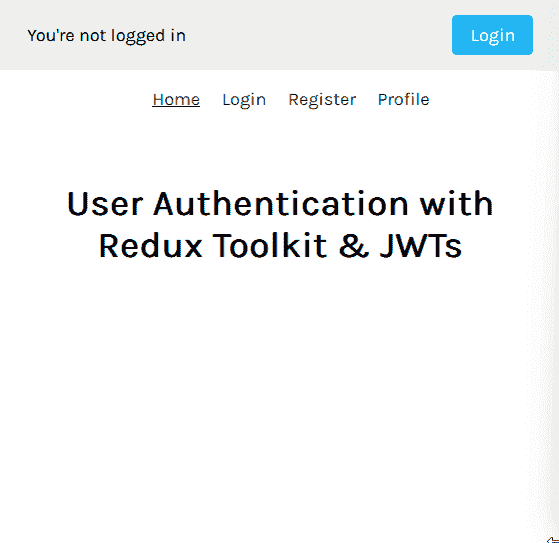
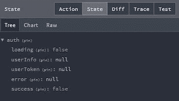
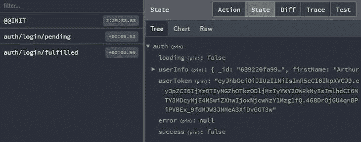
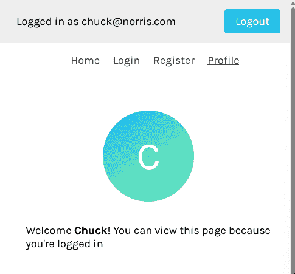

# 用 Redux Toolkit 处理用户认证

> 原文：<https://blog.logrocket.com/handling-user-authentication-redux-toolkit/>

用户身份验证可以通过多种方式处理。由于这一功能的重要性，我们已经看到更多的公司提供认证解决方案来简化这一过程——Firebase、Auth0 和 NextAuth.js，仅举几例。

不管这些服务如何处理它们端的身份验证和授权，实现过程通常都涉及调用一些 API 端点并接收一个私有令牌——通常是一个 [JSON Web 令牌](https://jwt.io/introduction)或 JWT——用于前端基础设施。

在本文中，您将了解如何使用 Redux Toolkit (RTK)和 RTK Query 在 React 中创建前端身份验证工作流。我们将使用基本的工具包 API，如`createSlice`、`createAsyncThunk`、`createApi`和`fetchBaseQuery`，向 Express 后端发出异步请求。

向前跳:

这个项目的后端是使用 Express 和 MongoDB 数据库构建的。但是，前端工作流仍应适用于您使用的任何提供令牌的认证服务。

您可以从[项目的资源库](https://github.com/Chinwike1/redux-user-auth)下载源代码，其中包含如何建立数据库的说明，并且可以在本地运行应用程序。点击这里观看[的现场演示，看看最终的项目会是什么样子:](https://redux-user-auth.netlify.app/)



## 先决条件

要继续学习，您需要熟悉以下内容:

现在，让我们开始认证！

## 从 GitHub 克隆启动文件

存储库包括一个`[starter-files](https://github.com/Chinwike1/redux-user-auth/tree/starter-files)` [分支](https://github.com/Chinwike1/redux-user-auth/tree/starter-files)，其中包含引导该应用程序所需的文件。前端文件夹还包括在演示中看到的各种用户界面，如`Home`、`Login`、`Register`和`Profile`屏幕，分别显示路径`/`、`/login`、`/register`和`/user-profile`。

路由结构目前看起来是这样的:

```
// App.js
import { BrowserRouter as Router, Routes, Route } from 'react-router-dom'
import Header from './components/Header'
import LoginScreen from './screens/LoginScreen'
import RegisterScreen from './screens/RegisterScreen'
import ProfileScreen from './screens/ProfileScreen'
import HomeScreen from './screens/HomeScreen'
import './App.css'

function App() {
  return (
    <Router>
      <Header />
      <main className='container content'>
        <Routes>
          <Route path='/' element={<HomeScreen />} />
          <Route path='/login' element={<LoginScreen />} />
          <Route path='/register' element={<RegisterScreen />} />
          <Route path='/user-profile' element={<ProfileScreen />} />
        </Routes>
      </main>
    </Router>
  )
}
export default App

```

注册页面上的输入字段连接到 [React 钩子表单](https://blog.logrocket.com/react-hook-form-complete-guide/)，它干净利落地抓取输入值并在`handleSubmit`函数中返回它们:

```
// Login.js
import { useForm } from 'react-hook-form'

const LoginScreen = () => {
  const { register, handleSubmit } = useForm()

  const submitForm = (data) => {
    console.log(data.email)
  }

  return (
    <form onSubmit={handleSubmit(submitForm)}>
      <div className='form-group'>
        <label htmlFor='email'>Email</label>
        <input
          type='email'
          className='form-input'
          {...register('email')}
          required
        />
      </div>
      <div className='form-group'>
        <label htmlFor='password'>Password</label>
        <input
          type='password'
          className='form-input'
          {...register('password')}
          required
        />
      </div>
      <button type='submit' className='button'>
        Login
      </button>
    </form>
  )
}
export default LoginScreen

```

在您的终端中，使用以下命令克隆`starter-files`分支:

```
git clone --branch starter-files --single-branch https://github.com/Chinwike1/redux-user-auth.git

```

接下来，安装所有项目依赖项:

```
npm install
cd frontend
npm install

```

上述过程在前端安装以下软件包:

如果需要，可以先[熟悉这些冗余术语](https://redux.js.org/understanding/thinking-in-redux/glossary)。

最后，使用以下命令运行应用程序:

```
cd ..
npm run dev

```

## 配置 Redux 存储

[Redux Toolkit 引入了创建商店的新方法](https://blog.logrocket.com/smarter-redux-redux-toolkit/)。它将存储的各个部分分成不同的文件，称为切片。

一个切片代表一个 Redux 状态单元。它是应用程序中单个特性的 reducer 逻辑和动作的集合，通常一起定义在单个文件中。对于我们来说，这个文件就是`features/auth`。

通过使用 RTK 的`createSlice` API，我们可以创建一个 Redux 切片，如下所示:

```
// features/auth/authSlice.js
import { createSlice } from '@reduxjs/toolkit'

const initialState = {
  loading: false,
  userInfo: {}, // for user object
  userToken: null, // for storing the JWT
  error: null,
  success: false, // for monitoring the registration process.
}

const authSlice = createSlice({
  name: 'auth',
  initialState,
  reducers: {},
  extraReducers: {},
})

export default authSlice.reducer

```

接下来，将`authSlice`中的`reducer`属性导入到存储中，使其反映在根 Redux 状态对象中:

```
// app/store.js
import { configureStore } from '@reduxjs/toolkit'
import authReducer from '../features/auth/authSlice'

const store = configureStore({
  reducer: {
    auth: authReducer
  }
})
export default store

```



To make these store values accessible to every component, wrap the entire application with the React Redux `Provider` component:

```
// index.js
import React from 'react'
import ReactDOM from 'react-dom/client'
import App from './App'
import { Provider } from 'react-redux'
import store from './app/store'

const root = ReactDOM.createRoot(document.getElementById('root'))
root.render(
  <React.StrictMode>
    <Provider store={store}>
      <App />
    </Provider>
  </React.StrictMode>
)

```

## 组织 Redux 切片和动作

Redux Toolkit 文档建议将动作和还原器合并到一个切片文件中。相反，我发现当我将这两部分分成单独的文件时，我的代码可读性更好——例如，`features/auth/authActions.js`。这里，我们将创建向后端发出异步请求的动作。

但在此之前，我将快速概述一下目前可用的后端路线。

## 后端架构

我们的 Express 服务器托管在`localhost:5000`上，目前有三条路线。

首先，`api/user/login`是登录路线。它接受`POST`请求，并要求用户的电子邮件和密码作为参数。然后，它会在成功认证后返回一个 JWT 或一条错误消息。这个令牌有 12 小时的寿命。

二、`api/user/register`是报名路线。它接受`POST`请求，并要求用户的名字、电子邮件和密码。

第三，`api/user/profile`是一条授权路线。它接受`GET`请求，并需要一个令牌从数据库中获取用户详细信息。它在成功授权或出现错误消息后返回用户的对象。

我们将使用`createAsyncThunk`来创建登录和注册动作。然后，我们将为概要文件路由创建一个 RTK 查询`getUserDetails`查询。

## Redux 验证:注册操作

在`authAction.js`中，您将导入并使用`createAsyncThunk` API。`createAsyncThunk`接受三个参数:一个字符串动作类型、一个回调函数和一个可选的`options`对象。

回调函数是一个重要的参数，在编写 Redux 操作时需要考虑两个关键参数。

第一个参数是调用动作时传递给`dispatch`方法的单个值。如果需要传递多个值，可以传入一个对象。

第二个参数是一个对象，包含通常传递给 Redux thunk 函数的参数。参数包括`getState`、`dispatch`、`rejectWithValue`等。

参见下面的代码:

```
// authActions.js
import axios from 'axios'
import { createAsyncThunk } from '@reduxjs/toolkit'

const backendURL = 'http://127.0.0.1:5000'

export const registerUser = createAsyncThunk(
  'auth/register',
  async ({ firstName, email, password }, { rejectWithValue }) => {
    try {
      const config = {
        headers: {
          'Content-Type': 'application/json',
        },
      }
      await axios.post(
        `${backendURL}/api/user/register`,
        { firstName, email, password },
        config
      )
    } catch (error) {
    // return custom error message from backend if present
      if (error.response && error.response.data.message) {
        return rejectWithValue(error.response.data.message)
      } else {
        return rejectWithValue(error.message)
      }
    }
  }
)

```

在上面的代码块中，我们首先将 Express 服务器的 URL 存储在一个`backendURL`变量中。然后，注册表中的值用于通过 Axios 向`register`路由发出 POST 请求。

如果出现错误，`thunkAPI.rejectWithValue`将从后端返回定制的错误消息，作为有效负载返回给 reducer。

### 在`extraReducers`中处理异步函数

用`createAsyncThunk`创建的动作生成三种可能的生命周期动作类型:`pending`、`fulfilled`和`rejected`。

您可以利用`authSlice`的`extraReducers`属性中的这些动作类型对您的状态进行适当的更改:

```
// authSlice.js
import { createSlice } from '@reduxjs/toolkit'
import { registerUser } from './authActions'

const initialState = {
  loading: false,
  userInfo: null,
  userToken: null,
  error: null,
  success: false,
}

const authSlice = createSlice({
  name: 'auth',
  initialState,
  reducers: {},
  extraReducers: {
    // register user
    [registerUser.pending]: (state) => {
      state.loading = true
      state.error = null
    },
    [registerUser.fulfilled]: (state, { payload }) => {
      state.loading = false
      state.success = true // registration successful
    },
    [registerUser.rejected]: (state, { payload }) => {
      state.loading = false
      state.error = payload
    },
  },
})
export default authSlice.reducer

```

在这种情况下，当动作完成时，我们将`success`值设置为`true`,以表示注册成功。接下来，您将使用更新后的状态进行适当的 UI 更改。

### React Redux 的`useDispatch`和`useSelector`钩子

通过使用`react-redux`包中的`useSelector`和`useDispatch`，您可以从 Redux 存储中读取状态，并分别从任何组件中分派动作:

```
// RegisterScreen.js
import { useForm } from 'react-hook-form'
import { useDispatch, useSelector } from 'react-redux'
import Error from '../components/Error'
import Spinner from '../components/Spinner'
import { registerUser } from '../features/auth/authActions'

const RegisterScreen = () => {
  const { loading, userInfo, error, success } = useSelector(
    (state) => state.auth
  )
  const dispatch = useDispatch()
  const { register, handleSubmit } = useForm()

  const submitForm = (data) => {
    // check if passwords match
    if (data.password !== data.confirmPassword) {
      alert('Password mismatch')
    }
    // transform email string to lowercase to avoid case sensitivity issues in login
    data.email = data.email.toLowerCase()
    dispatch(registerUser(data))
  }
  return (
    <form onSubmit={handleSubmit(submitForm)}>
      {error && <Error>{error}</Error>}
      <div className='form-group'>
        <label htmlFor='firstName'>First Name</label>
        <input
          type='text'
          className='form-input'
          {...register('firstName')}
          required
        />
      </div>
      <div className='form-group'>
        <label htmlFor='email'>Email</label>
        <input
          type='email'
          className='form-input'
          {...register('email')}
          required
        />
      </div>
      <div className='form-group'>
        <label htmlFor='password'>Password</label>
        <input
          type='password'
          className='form-input'
          {...register('password')}
          required
        />
      </div>
      <div className='form-group'>
        <label htmlFor='email'>Confirm Password</label>
        <input
          type='password'
          className='form-input'
          {...register('confirmPassword')}
          required
        />
      </div>
      <button type='submit' className='button' disabled={loading}>
        {loading ? <Spinner /> : 'Register'}
      </button>
    </form>
  )
}
export default RegisterScreen

```

提交表单时，首先检查两个密码字段是否匹配。如果是这样的话，就用表单数据作为参数来调度`registerUser`动作。

* * *

### 更多来自 LogRocket 的精彩文章:

* * *

`useSelector`钩子用于从 Redux 存储中的`auth`对象中取出`loading`和`error`状态值。然后，这些值用于进行某些 UI 更改，比如在请求进行过程中禁用提交按钮、显示微调器以及显示错误消息。

目前，当用户完成注册后，没有迹象表明他们已经成功了。使用来自`userSlice`的`success`值以及 React 路由器的`useNavigate`钩子和`useEffect`钩子，您可以在注册后将用户重定向到`Login`页面。

这看起来是这样的:

```
// RegisterScreen.js
import { useEffect } from 'react'
import { useForm } from 'react-hook-form'
import { useDispatch, useSelector } from 'react-redux'
import { useNavigate } from 'react-router-dom'
import Error from '../components/Error'
import { registerUser } from '../features/auth/authActions'

const RegisterScreen = () => {
  const { loading, userInfo, error, success } = useSelector(
    (state) => state.user
  )
  const dispatch = useDispatch()
  const { register, handleSubmit } = useForm()

  const navigate = useNavigate()

  useEffect(() => {
    // redirect user to login page if registration was successful
    if (success) navigate('/login')
    // redirect authenticated user to profile screen
    if (userInfo) navigate('/user-profile')
  }, [navigate, userInfo, success])

  const submitForm = (data) => {
    // check if passwords match
    if (data.password !== data.confirmPassword) {
      alert('Password mismatch')
      return
    }
    // transform email string to lowercase to avoid case sensitivity issues in login
    data.email = data.email.toLowerCase()
    dispatch(registerUser(data))
  }

  return (
    <form onSubmit={handleSubmit(submitForm)}>
      {/* form markup... */}
    </form>
  )
}
export default RegisterScreen

```

在编写 RTK 逻辑时，您会注意到一个熟悉的模式。通常是这样的:

*   在操作文件中创建 Redux 操作
*   编写减速器逻辑来处理上述动作的状态变化
*   在组件内调度操作
*   进行必要的 UI 更新/由于分派的操作而产生的副作用

不一定要按这个顺序，但它们通常是重复出现的步骤。让我们用登录操作重复这个过程。

## Redux 验证:登录操作

登录操作类似于注册操作。不同之处在于，对于登录操作，在将结果传递给 reducer 之前，您需要将从后端返回的 JWT 存储在本地存储中:

```
// authActions.js
const backendURL = 'http://127.0.0.1:5000'
export const userLogin = createAsyncThunk(
  'auth/login',
  async ({ email, password }, { rejectWithValue }) => {
    try {
      // configure header's Content-Type as JSON
      const config = {
        headers: {
          'Content-Type': 'application/json',
        },
      }
      const { data } = await axios.post(
        `${backendURL}/api/user/login`,
        { email, password },
        config
      )
      // store user's token in local storage
      localStorage.setItem('userToken', data.userToken)
      return data
    } catch (error) {
      // return custom error message from API if any
      if (error.response && error.response.data.message) {
        return rejectWithValue(error.response.data.message)
      } else {
        return rejectWithValue(error.message)
      }
    }
  }
)

```

现在您可以在`authSlice.js`中处理生命周期动作类型:

```
// authSlice.js
import { createSlice } from '@reduxjs/toolkit'
import { registerUser, userLogin } from './authActions'

// initialize userToken from local storage
const userToken = localStorage.getItem('userToken')
  ? localStorage.getItem('userToken')
  : null

const initialState = {
  loading: false,
  userInfo: null,
  userToken,
  error: null,
  success: false,
}

const authSlice = createSlice({
  name: 'auth',
  initialState,
  reducers: {},
  extraReducers: {
    // login user
    [userLogin.pending]: (state) => {
      state.loading = true
      state.error = null
    },
    [userLogin.fulfilled]: (state, { payload }) => {
      state.loading = false
      state.userInfo = payload
      state.userToken = payload.userToken
    },
    [userLogin.rejected]: (state, { payload }) => {
      state.loading = false
      state.error = payload
    },
    // register user reducer...
  },
})
export default userSlice.reducer

```



因为`userToken`的值取决于来自`localStorage`的令牌的值，所以最好在开始时初始化它，如上所述。

现在，您可以在提交表单时调度此操作，并进行您喜欢的 UI 更新:

```
// LoginScreen.js
import { useForm } from 'react-hook-form'
import { useDispatch, useSelector } from 'react-redux'
import { userLogin } from '../features/auth/authActions'
import Error from '../components/Error'

const LoginScreen = () => {
  const { loading, error } = useSelector((state) => state.user)
  const dispatch = useDispatch()
  const { register, handleSubmit } = useForm()

  const submitForm = (data) => {
    dispatch(userLogin(data))
  }

  return (
    <form onSubmit={handleSubmit(submitForm)}>
      {error && <Error>{error}</Error>}
      <div className='form-group'>
        <label htmlFor='email'>Email</label>
        <input
          type='email'
          className='form-input'
          {...register('email')}
          required
        />
      </div>
      <div className='form-group'>
        <label htmlFor='password'>Password</label>
        <input
          type='password'
          className='form-input'
          {...register('password')}
          required
        />
      </div>
      <button type='submit' className='button' disabled={loading}>
        {loading ? <Spinner /> : 'Login'}
      </button>
    </form>
  )
}
export default LoginScreen

```

您还需要确保以前通过身份验证的用户无法访问此页面。`userInfo`的值可用于将通过身份验证的用户重定向到带有`useNavigate`和`useEffect`的`Login`页面:

```
// LoginScreen.js
import { useEffect } from 'react'
import { useForm } from 'react-hook-form'
import { useNavigate } from 'react-router-dom'
import { useDispatch, useSelector } from 'react-redux'
import { userLogin } from '../features/user/userActions'
import Error from '../components/Error'

const LoginScreen = () => {
  const { loading, userInfo, error } = useSelector((state) => state.user)
  const dispatch = useDispatch()
  const { register, handleSubmit } = useForm()
  const navigate = useNavigate()

  // redirect authenticated user to profile screen
  useEffect(() => {
    if (userInfo) {
      navigate('/user-profile')
    }
  }, [navigate, userInfo]k)

  const submitForm = (data) => {
    dispatch(userLogin(data))
  }

  return (
    <form onSubmit={handleSubmit(submitForm)}>
      {/* form markup... */}
    </form>
  )
}
export default LoginScreen

```

注册过程到此结束！

### Redux 认证:`getUserDetails`查询

接下来，您将学习如何使用 RTK Query 创建查询。该查询将自动验证其有效令牌存储在浏览器中的用户。

### 什么是 RTK 查询？

[RTK 查询文档](https://redux-toolkit.js.org/rtk-query/overview)将其定义为一个强大的数据获取和缓存工具。它简化了 React 应用程序中的数据获取和缓存，并建立在 RTK 的`createSlice`和`createAsyncThunk`API 之上。RTK Query 类似于 React Query 和 SWR 等其他数据提取库。

尽管 Redux 是一个与 UI 无关的工具，但 RTK Query 提供了一个特定于 React 的入口点，用于生成覆盖整个数据获取过程的 React 挂钩，提供可以在组件中使用的`data`和`isLoading`值。让我们看看如何创建查询。

### 创建新的 RTK 查询

要在您的应用程序中使用 RTK Query，您将首先使用 RTKQ 的`createApi`和`fetchBaseQuery`函数创建一个 RTKQ 服务定义。在下面的目录`app/services/auth/`中创建一个`authService.js`文件，并填入下面的代码:

```
// app/services/auth/authService.js
// React-specific entry point to allow generating React hooks
import { createApi, fetchBaseQuery } from '@reduxjs/toolkit/query/react'

export const authApi = createApi({
  reducerPath: 'authApi',
  baseQuery: fetchBaseQuery({
    baseUrl: 'http://127.0.0.1:5000/',
    prepareHeaders: (headers, { getState }) => {}),
    endpoints: () => ({}),
  }),
})

```

`createApi`是 RTK 查询功能的核心。它允许您定义一组描述如何从后端 API 检索数据的“端点”。

`reducerPath`是一个唯一的密钥，您的服务将被安装到您的商店中。默认为`'api'`。

如果未指定`queryFn`选项，每个定义的端点将使用`baseQuery`。RTK Query 提供了一个名为`[fetchBaseQuery](https://redux-toolkit.js.org/rtk-query/api/fetchBaseQuery)`的实用程序，它是围绕`fetch`的轻量级包装器。

延伸到`/api/user/profile`后端路由的最终服务定义应该如下所示:

```
// app/services/auth/authService.js
// React-specific entry point to allow generating React hooks
import { createApi, fetchBaseQuery } from '@reduxjs/toolkit/query/react'

export const authApi = createApi({
  reducerPath: 'authApi',
  baseQuery: fetchBaseQuery({
    // base url of backend API
    baseUrl: 'http://127.0.0.1:5000/',
    // prepareHeaders is used to configure the header of every request and gives access to getState which we use to include the token from the store
    prepareHeaders: (headers, { getState }) => {
      const token = getState().auth.userToken
      if (token) {
       // include token in req header
        headers.set('authorization', `Bearer ${token}`)  
        return headers
      }
    },
  }),
  endpoints: (builder) => ({
    getUserDetails: builder.query({
      query: () => ({
        url: 'api/user/profile',
        method: 'GET',
      }),
    }),
  }),
})

// export hooks for usage in functional components, which are
// auto-generated based on the defined endpoints
export const { useGetUserDetailsQuery } = authApi

```

`endpoints`是您想要对服务器执行的一组操作。使用构建器语法将它们定义为一个对象。

有两种基本的端点类型:查询和突变。上面，我们已经创建了一个查询端点，它向配置文件路由发出 GET 请求。然后，我们导出了这个端点生成的 React 钩子。

接下来，您必须将这个身份验证服务添加到存储中。RTKQ 服务生成一个“切片缩减器”和一个处理数据获取的定制中间件。两者都需要添加到 Redux 存储中:

```
// app/store.js
import { configureStore } from '@reduxjs/toolkit'
import authReducer from '../features/auth/authSlice'
import { authApi } from './services/auth/authService'

const store = configureStore({
  reducer: {
    auth: authReducer,
    [authApi.reducerPath]: authApi.reducer,
  },
  middleware: (getDefaultMiddleware) =>
    getDefaultMiddleware().concat(authApi.middleware),
})
export default store

```

现在您已经准备好在一个组件中执行`useGetUserDetailsQuery`。我们将在 Header 组件中使用它，因为它在应用程序的每个页面上都是可见的。

### 执行查询

我们对该查询的预期行为是，当 header 组件挂载时，它将从服务器获取用户的详细信息。我们还希望定期验证令牌，比如每 15 分钟一次，以确保它没有过期。

您可以使用如下的`useGetUserDetailsQuery`查询来实现这一点:

```
// components/Header.js
import { useDispatch, useSelector } from 'react-redux'
import { NavLink } from 'react-router-dom'
import { useGetUserDetailsQuery } from '../app/services/auth/authService'
import '../styles/header.css'

const Header = () => {
  const { userInfo } = useSelector((state) => state.auth)
  const dispatch = useDispatch()

  // automatically authenticate user if token is found
  const { data, isFetching } = useGetUserDetailsQuery('userDetails', {
  // perform a refetch every 15mins
    pollingInterval: 900000,
  })

  console.log(data) // user object

  return (
    <header>
      {/* header markup */}
    </header>
  )
}
export default Header

```

`pollingInterval`表示查询执行重新提取之前的时间(以毫秒为单位)。

现在，查询按预期工作，如果存在有效的令牌，`data`应该包含用户的信息。但是目前，这些信息并没有保存到商店中。为了实现这一点，您将在`authSlice.js`中创建一个`setCredentials`缩减器，它像这样更新存储值:

```
// features/auth/authSlice.js
import { createSlice } from '@reduxjs/toolkit'
import { registerUser, userLogin } from './authActions'

// initialize userToken from local storage
const userToken = localStorage.getItem('userToken')
  ? localStorage.getItem('userToken')
  : null

const initialState = {
  // ...initial state
}

const authSlice = createSlice({
  name: 'auth',
  initialState,
  reducers: {
    logout: (state) => {
      // ...logout reducer
    },
    setCredentials: (state, { payload }) => {
      state.userInfo = payload
    },
  },
  extraReducers: {
    // ...userLogin reducer
    // ...registerUser reducer
  },
})

export const { logout, setCredentials } = authSlice.actions
export default authSlice.reducer

```

现在，在一个`useEffect`函数中分派这个 reducer，以便在`data`发生变化时更新存储:

```
// components/Header.js
import { useEffect } from 'react'
import { useDispatch, useSelector } from 'react-redux'
import { NavLink } from 'react-router-dom'
import { useGetUserDetailsQuery } from '../app/services/auth/authService'
import { logout, setCredentials } from '../features/auth/authSlice'
import '../styles/header.css'

const Header = () => {
  const { userInfo } = useSelector((state) => state.auth)
  const dispatch = useDispatch()

  // automatically authenticate user if token is found
  const { data, isFetching } = useGetUserDetailsQuery('userDetails', {
    pollingInterval: 900000, // 15mins
  })

  useEffect(() => {
    if (data) dispatch(setCredentials(data))
  }, [data, dispatch])

  return (
    <header>
      <div className='header-status'>
        <span>
          {isFetching
            ? `Fetching your profile...`
            : userInfo !== null
            ? `Logged in as ${userInfo.email}`
            : "You're not logged in"}
        </span>
        <div className='cta'>
          {userInfo ? (
            <button className='button' onClick={() => dispatch(logout())}>
              Logout
            </button>
          ) : (
            <NavLink className='button' to='/login'>
              Login
            </NavLink>
          )}
        </div>
      </div>
      <nav className='container navigation'>
        <NavLink to='/'>Home</NavLink>
        <NavLink to='/login'>Login</NavLink>
        <NavLink to='/register'>Register</NavLink>
        <NavLink to='/user-profile'>Profile</NavLink>
      </nav>
    </header>
  )
}
export default Header

```

注意使用`isFetching`和`userInfo`在导航栏上显示与用户身份验证状态相关的不同消息和元素。

这就完成了`getUserDetails`查询！现在您可以继续在`Profile`屏幕上呈现用户的详细信息。

### 设置`Profile`屏幕

将`useSeletor`导入`ProfileScreen.js`以显示来自商店的值:

```
// ProfileScreen.js
import { useSelector } from 'react-redux'
import '../styles/profile.css'

const ProfileScreen = () => {
  const { userInfo } = useSelector((state) => state.user)

  return (
    <div>
      <figure>{userInfo?.firstName.charAt(0).toUpperCase()}</figure>
      <span>
        Welcome <strong>{userInfo?.firstName}!</strong> You can view this page
        because you're logged in
      </span>
    </div>
  )
}
export default ProfileScreen

```

目前，无论身份验证状态如何，每个人都可以访问`Profile`页面。我们希望通过在授予用户访问页面的权限之前验证用户是否存在来保护这个路由。这个逻辑可以提取到一个单独的`ProtectedRoute`组件中，接下来您将创建这个组件。

### 使用 React 路由器保护路由

在`src`中创建一个名为`routing`的文件夹和一个名为`ProtectedRoute.js`的文件。`ProtectedRoute`旨在用作父路由元素，其子元素受驻留在该组件中的逻辑保护。

在这里，您可以使用`userInfo`的值来检测用户是否登录。如果`userInfo`不存在，则返回未授权的模板。否则，我们使用 React 路由器的`Outlet`组件来呈现子路由:

```
// ProtectedRoute.js
import { useSelector } from 'react-redux'
import { NavLink, Outlet } from 'react-router-dom'

const ProtectedRoute = () => {
  const { userInfo } = useSelector((state) => state.user)

  // show unauthorized screen if no user is found in redux store
  if (!userInfo) {
    return (
      <div className='unauthorized'>
        <h1>Unauthorized :(</h1>
        <span>
          <NavLink to='/login'>Login</NavLink> to gain access
        </span>
      </div>
    )
  }

  // returns child route elements
  return <Outlet />
}
export default ProtectedRoute

```

[根据文档](https://reactrouter.com/docs/en/v6/components/outlet#outlet)，`<Outlet>`应该用在父路由元素中来呈现它们的子路由元素。这意味着`<Outlet>`不会在屏幕上呈现任何标记，而是被 route 子元素所替代。

现在，您可以像这样用受保护的路由包装`ProfileScreen`:

```
// App.js
import { BrowserRouter as Router, Routes, Route } from 'react-router-dom'
import Header from './components/Header'
import LoginScreen from './screens/LoginScreen'
import RegisterScreen from './screens/RegisterScreen'
import ProfileScreen from './screens/ProfileScreen'
import HomeScreen from './screens/HomeScreen'
import ProtectedRoute from './routing/ProtectedRoute'
import './App.css'

function App() {
  return (
    <Router>
      <Header />
      <main className='container content'>
        <Routes>
          <Route path='/' element={<HomeScreen />} />
          <Route path='/login' element={<LoginScreen />} />
          <Route path='/register' element={<RegisterScreen />} />
          <Route element={<ProtectedRoute />}>
            <Route path='/user-profile' element={<ProfileScreen />} />
          </Route>
        </Routes>
      </main>
    </Router>
  )
}
export default App

```

这是大部分的应用程序完成！现在让我们看看如何注销用户。

## Redux 验证:注销操作

要注销用户，您将创建一个操作，将 Redux 存储重置为初始值，并从本地存储中清除令牌。因为这不是一个异步任务，所以您可以使用`reducer`属性在`userSlice`中直接创建它:

```
// userSlice.js
import { createSlice } from '@reduxjs/toolkit'
import { getUserDetails, registerUser, userLogin } from './userActions'

// initialize userToken from local storage
const userToken = localStorage.getItem('userToken')
  ? localStorage.getItem('userToken')
  : null

const initialState = {
  loading: false,
  userInfo: null,
  userToken,
  error: null,
  success: false,
}

const userSlice = createSlice({
  name: 'user',
  initialState,
  reducers: {
    logout: (state) => {
      localStorage.removeItem('userToken') // deletes token from storage
      state.loading = false
      state.userInfo = null
      state.userToken = null
      state.error = null
    },
  },
  extraReducers: {
    // userLogin reducer ...
    // registerUser reducer ...
    // getUserDetails reducer ...
  },
})
// export actions
export const { logout } = userSlice.actions
export default userSlice.reducer

```

然后，您可以在`Header`组件中分派注销操作:

```
// Header.js
import { useEffect } from 'react'
import { useDispatch, useSelector } from 'react-redux'
import { NavLink } from 'react-router-dom'
import { getUserDetails } from '../features/user/userActions'
import { logout } from '../features/user/userSlice'
import '../styles/header.css'

const Header = () => {
  const { userInfo, userToken } = useSelector((state) => state.user)
  const dispatch = useDispatch()

  // automatically authenticate user if token is found
  useEffect(() => {
    if (userToken) {
      dispatch(getUserDetails())
    }
  }, [userToken, dispatch])

  return (
    <header>
      <div className='header-status'>
        <span>
          {userInfo ? `Logged in as ${userInfo.email}` : "You're not logged in"}
        </span>
        <div className='cta'>
          {userInfo ? (
            <button className='button' onClick={() => dispatch(logout())}>
              Logout
            </button>
          ) : (
            <NavLink className='button' to='/login'>
              Login
            </NavLink>
          )}
        </div>
      </div>
      <nav className='container navigation'>
        <NavLink to='/'>Home</NavLink>
        <NavLink to='/login'>Login</NavLink>
        <NavLink to='/register'>Register</NavLink>
        <NavLink to='/user-profile'>Profile</NavLink>
      </nav>
    </header>
  )
}
export default Header

```



这就完成了我们的申请！您现在有了一个 [MERN 堆栈应用程序](https://blog.logrocket.com/mern-stack-tutorial/)，它具有一个由 Redux Toolkit 管理的前端认证工作流。

## 额外好处:使用 RTK 进行基于角色的认证和授权

基于角色的身份验证是一种根据用户在应用程序中的角色来识别和验证用户的方法。这意味着，当用户尝试登录系统时，他们在组织中的分配角色(而不是他们的个人权限)决定了他们对系统某些部分的访问权限。

要在 React 中实现基于角色的身份验证，首先需要确定用户在应用程序中可以拥有的不同角色——例如，admin、regular user 或 guest。这个角色通常存储在服务器上的用户对象中，由客户端通过一个`fetch`请求来检索。

一旦知道了经过身份验证的用户的角色，您就可以使用它来控制他们在您的应用程序中可以做什么。这可以通过在代码中添加条件语句来实现，这些语句在允许用户执行某些操作之前检查用户的角色。

例如，假设您有一个`AdminScreen`组件，它只呈现给具有管理员角色的用户。您的解决方案可能如下所示:

```
import { useSelector } from 'react-redux'

const AdminScreen = () => {
  const { userInfo } = useSelector((state) => state.auth)

  if (userInfo.role === "regular") return <Navigate to="/dashboard/regular" />
  if (userInfo.role === "admin") return <AdminLayout />
}

export default AdminScreen

```

总的来说，在 React 中实现基于角色的身份验证包括设置登录系统、安全地存储用户角色，以及使用条件语句根据用户角色控制对不同特性的访问。

## 结论

毫不奇怪，在 React 中创建身份验证工作流并不容易。您必须做出许多决定，比如如何跟踪身份验证状态、向后端 API 发出异步请求、在浏览器中安全地存储令牌等等。

Redux Toolkit 和 RTK Query 很好地简化了状态管理和数据获取过程。您甚至可以使用它们为您的应用程序设置基于角色的身份验证和授权。

欢迎在评论中分享你对前端认证和授权的看法！

## 使用 [LogRocket](https://lp.logrocket.com/blg/signup) 消除传统错误报告的干扰

[](https://lp.logrocket.com/blg/signup)

[LogRocket](https://lp.logrocket.com/blg/signup) 是一个数字体验分析解决方案，它可以保护您免受数百个假阳性错误警报的影响，只针对几个真正重要的项目。LogRocket 会告诉您应用程序中实际影响用户的最具影响力的 bug 和 UX 问题。

然后，使用具有深层技术遥测的会话重放来确切地查看用户看到了什么以及是什么导致了问题，就像你在他们身后看一样。

LogRocket 自动聚合客户端错误、JS 异常、前端性能指标和用户交互。然后 LogRocket 使用机器学习来告诉你哪些问题正在影响大多数用户，并提供你需要修复它的上下文。

关注重要的 bug—[今天就试试 LogRocket】。](https://lp.logrocket.com/blg/signup-issue-free)