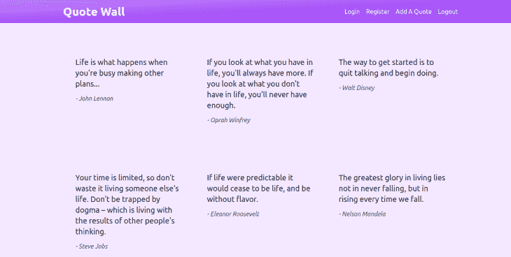
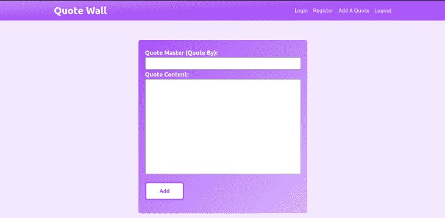

# 用 Remix - LogRocket 博客处理用户认证

> 原文：<https://blog.logrocket.com/handling-user-authentication-remix/>

Remix 是一个全栈 React 框架，带有支持服务器渲染、数据加载和路由的 API。它使用 Web Fetch API 来实现快速页面加载和几个站点之间的无缝转换，并且可以在任何地方运行。

今天，我们将在本教程中学习如何在 Remix 中管理用户认证。我们将创建一个报价墙应用程序，其中经过身份验证的用户可以查看和发布报价，而未经身份验证的用户只能查看帖子，不能发帖。

## 目录

## 先决条件

要阅读本文，您需要具备以下条件:

*   [Node.js](https://nodejs.org/) 14 以上
*   npm 7 或更高
*   有 HTML，CSS，JavaScript，React 的知识
*   顺风 CSS 的基础知识

## 使用 Remix 设置报价墙应用程序

### 创建新的混音应用程序

要开始，重要的是选择**只是基本的**、 **Remix 应用服务器**，然后在提示时选择**打字稿**。

让我们用下面的命令搭建一个基本的混音应用程序:

```
npx [email protected] remix-quote-wall
cd remix-quote-wall
npm run dev

```

### 设置顺风

要将 Tailwind 添加到我们的混音应用程序中，让我们执行以下操作:

1.  安装顺风

通过`npm`安装`tailwindcss`、它的对等依赖项和`concurrently`，然后运行 init 命令生成`tailwind.config.js`和`postcss.config.js`:

```
npm install -D tailwindcss postcss autoprefixer concurrently
npx tailwindcss init -p

```

1.  配置您的模板路径

在`tailwind.config.js`文件中添加所有模板文件的路径:

```
//tailwind.config.js

module.exports = {
  content: [
    "./app/**/*.{js,ts,jsx,tsx}",
  ],
  theme: {
    extend: {},
  },
  plugins: [],
}

```

1.  更新您的`package.json`脚本

更新您的`package.json`文件中的脚本来构建您的开发和生产 CSS:

```
...
{
  "scripts": {
    "build": "npm run build:css && remix build",
    "build:css": "tailwindcss -m -i ./styles/app.css -o app/styles/app.css",
    "dev": "concurrently \"npm run dev:css\" \"remix dev\"",
    "dev:css": "tailwindcss -w -o ./app/styles/app.css",
  }
}
...

```

1.  将顺风指令添加到 CSS 中

创建一个`./styles/app.css`文件，并为每个顺风层添加`@tailwind`指令:

```
/*app.css*/

@tailwind base;
@tailwind components;
@tailwind utilities;

```

1.  导入 CSS 文件

通过添加以下内容，将编译后的`./app/styles/app.css`文件导入到您的`./app/root.jsx`文件中:

```
...
import styles from "~/styles/app.css"

export function links() {
  return [{ rel: "stylesheet", href: styles }]
        }
...

```

现在，让我们用下面的命令运行我们的开发服务器:

```
npm run dev

```

### 设置`root.jsx`

让我们通过将`app/root.jsx`的内容替换为以下内容，向应用程序组件添加一些顺风类:

```
// app/root.jsx

import {
    Links,
    LiveReload,
    Meta,
    Outlet
} from "@remix-run/react";
import styles from "./styles/app.css"

export function links() {
    return [{ rel: "stylesheet", href: styles }]
}

export const meta = () => ({
    charset: "utf-8",
    title: "Quote Wall App",
    viewport: "width=device-width,initial-scale=1",
});

export default function App() {
    return (
        <html lang="en">
            <head>
                <Meta />
                <Links />
            </head>
            <body className="bg-purple-100 relative px-5">
                <div className="mt-20 w-full max-w-screen-lg mx-auto">
                    <Outlet />
                </div>
                <LiveReload />
            </body>
        </html>
    );
}

```

### 路线

之后，让我们建立我们的路线结构。我们将有几条路线:

```
/
/login
/new-quote

```

先说索引路线(`/`)。为此，创建一个文件`app/routes/index.tsx`，并向其中添加以下内容:

```
export default function Index() {

  return (
    <div>
      <div className="grid lg:grid-flow-row grid-cols-1 lg:grid-cols-3">
        Hello
      </div>
    </div>
  )
}

```

然后，让我们用以下内容更新我们的`app/root.tsx`文件:

```
import {
  Link,
  Links,
  LiveReload,
  Meta,
  Outlet
} from "@remix-run/react";
import styles from "./styles/app.css"

export function links() {
  return [{ rel: "stylesheet", href: styles }]
}

export const meta = () => ({
  charset: "utf-8",
  title: "Quote Wall App",
  viewport: "width=device-width,initial-scale=1",
});

export default function App() {
  return (
    <html lang="en">
      <head>
        <Meta />
        <Links />
      </head>
      <body className="bg-purple-100 relative px-5">
        <div className="mt-20 w-full max-w-screen-lg mx-auto">
          <Outlet />
        </div>
        <LiveReload />
      </body>
    </html>
  );
}

```

我们的应用程序正在成形！随着我们的进展，我们将创建缺失的路线。

### 导航组件

让我们用导航段更新我们的`app/routes/index.jsx`文件，如下所示:

```
import { Link } from "@remix-run/react";

export default function Index() {

    return (
      <div>
        <nav className="bg-gradient-to-br from-purple-400 via-purple-500 to-purple-500 w-full fixed top-0 left-0 px-5">
          <div
            className="w-full max-w-screen-lg mx-auto flex justify-between content-center py-3 ">
            <Link className="text-white text-3xl font-bold" to={"/"}>Quote Wall</Link>
            <div className="flex flex-col md:flex-row items-center justify-between gap-x-4 text-blue-50">

              <Link to={"login"}>Login</Link>
              <Link to={"login"}>Register</Link>

              <Link to={"new-quote"}>Add A Quote</Link>
              <Link to={"logout"}>Logout</Link>
            </div>
          </div>

        </nav>
      </div>
    )
}

```

### 报价段

由于我们不会在多个文件中使用我们的报价组件，我们将把它添加到`app/routes/index.jsx`文件中。

让我们用报价段更新我们的`app/routes/index.jsx`文件，如下所示:

```
...

export default function Index() {

    return (
        <div>
          <nav>...</nav>
            <div className="grid lg:grid-flow-row grid-cols-1 lg:grid-cols-3">
                <figure className="m-4 py-10 px-4 shadow-md shadow-sky-100">
                    <blockquote cite="https://wisdomman.com" className="py-3">
                        <p className="text-gray-800  text-xl">
                            A stitch in Time saves Nine.
                        </p>
                    </blockquote>
                    <figcaption>
                        <cite className="text-gray-600 text-md mb-4 text-right">
                            - Unknown
                        </cite>
                    </figcaption>
                </figure>
            </div>
        </div>
    )
}

```

让我们使用虚拟数据给我们的程序添加一些额外的引用。

我们需要编写一个 loader 函数来帮助加载和提供数据。将以下内容添加到我们的`app/routes/index.jsx`文件中:

```
// app/routes/index.jsx
import { Link, useLoaderData } from "@remix-run/react";
import { json } from "@remix-run/node";

export const loader = async () => {

    return json({
        quotes: [
            {
                quote: 'Light at the end of the tunnel, dey don cut am.',
                by: 'Brain Jotter'
            },
            {
                quote: 'Promised to stand by you, we don sit down.',
                by: 'Brain Jotter'
            },
            {
                quote: 'Polythecnic wey dey in Italy, Napoli.',
                by: 'Comrade with wisdom and Understanding'
            }
        ]
    })
};
...

```

在这里，我们从`'@remix-run/react`钩子导入`useLoaderData`，这样我们就可以从 loader 函数中访问所提供的数据。同样，我们`import { json } from ‘@remix-run/node`以 JSON 格式返回数据。

现在，让我们用引号填充页面。有了提供的数据，让我们用`map`函数在页面上填充它:

```
// app/routes/index.jsx
...
export default function Index() {
  const { quotes } = useLoaderData();

  return (
    <div>
      <nav>...</nav>
      <div className="grid lg:grid-flow-row grid-cols-1 lg:grid-cols-3">
        {
          quotes.map((q, i) => {
            const { quote, by } = q;
            return (
              <figure key={i} className="m-4 py-10 px-4 shadow-md shadow-sky-100">
                <blockquote cite="https://wisdomman.com" className="py-3">
                  <p className="text-gray-800  text-xl">
                    {quote}
                  </p>
                </blockquote>
                <figcaption>
                  <cite className="text-gray-600 text-md mb-4 text-right">
                    - {by}
                  </cite>
                </figcaption>
              </figure>
            )
          })
        }
      </div>
    </div>
  )
}

```

## 设置数据库

几乎所有现实世界的应用程序都需要数据持久性。我们希望将我们的报价保存到数据库中，以便其他人可以阅读它们，并可能提交他们自己的报价。

### 设置 Prisma

在本文中，我们将使用我们自己的 SQLite 数据库。它基本上是一个数据库，位于你电脑上的一个文件中，功能非常强大，最棒的是它得到了 Prisma 的支持。如果您不确定使用哪个数据库，这是一个很好的起点。

首先，我们必须安装以下软件包:

*   用于在开发过程中与我们的数据库和模式进行交互
*   用于在运行时查询我们的数据库

安装 Prisma 软件包:

```
npm install --save-dev prisma
npm install @prisma/client

```

现在我们可以用 SQLite 初始化 Prisma:

```
npx prisma init --datasource-provider sqlite
```

以下是您将获得的内容:

```
✔ Your Prisma schema was created at prisma/schema.prisma
  You can now open it in your favorite editor.

warn You already have a .gitignore. Don't forget to exclude .env to not commit any secret.

Next steps:
1\. Set the DATABASE_URL in the .env file to point to your existing database. If your database has no tables yet, read https://pris.ly/d/getting-started
2\. Run prisma db pull to turn your database schema into a Prisma schema.
3\. Run prisma generate to generate the Prisma Client. You can then start querying your database.

More information in our documentation:

开始

```

运行上面的命令后，我们应该会注意到像`prisma/schema.prisma`这样的新文件和文件夹。

我们的`prisma/schema.prisma`应该是这样的:

```
// prisma/schema.prisma
// This is your Prisma schema file,
// learn more about it in the docs: https://pris.ly/d/prisma-schema

generator client {
  provider = "prisma-client-js"
}

datasource db {
  provider = "sqlite"
  url      = env("DATABASE_URL")
}

```

现在已经安装并设置好了 Prisma，让我们开始建模我们的应用程序。

用以下内容更新`prisma/schema.prisma`:

```
// prisma/schema.prisma
// This is your Prisma schema file,
// learn more about it in the docs: https://pris.ly/d/prisma-schema

generator client {
  provider = "prisma-client-js"
}

datasource db {
  provider = "sqlite"
  url      = env("DATABASE_URL")
}

model Quote {
  id        String   @id @default(uuid())
  createdAt DateTime @default(now())
  updatedAt DateTime @updatedAt
  by        String
  quote     String
}

```

现在，让我们运行以下命令:

```
npx prisma db push

```

该命令的输出如下所示:

```
Environment variables loaded from .env
Prisma schema loaded from prisma/schema.prisma
Datasource "db": SQLite database "dev.db" at "file:./dev.db"

SQLite database dev.db created at file:./dev.db

🚀  Your database is now in sync with your schema. Done in 158ms

✔ Generated Prisma Client (3.14.0 | library) to ./node_modules/@prisma/client in
 1.44s

```

首先创建我们的数据库`prisma/dev.db`，然后对数据库进行所有必要的修改，以反映我们在(`prisma/schema.prisma`)文件中指定的模式。最后，它构建了 Prisma 的 TypeScript 类型，这样当我们使用它的 API 连接数据库时，我们将获得非常棒的自动完成和类型检查。

接下来，让我们添加那个`prisma/dev.db`和。`env`到我们的`.gitignore`，所以我们不会将它们提交到我们的 GitHub 库:

```
node_modules
.output
.cache

/.cache
/build/
/public/build
/api/index.js

`

```

如果您的数据库变得混乱，您可以删除`prisma/dev.db`文件并再次运行`npx prisma db push`命令。

## 连接到数据库

这就是我们将应用程序与数据库连接的方式。我们将在`prisma/seed.ts file`的顶部添加以下内容，我们将在以后的工作中创建它:

```
import { PrismaClient } from "@prisma/client";
const db = new PrismaClient();

```

虽然这工作得很好，但我们不希望每次在开发过程中进行服务器端修改时都必须关闭并重启服务器。因此，`@remix-run/serve`从头开始重新构建代码。

这种策略的问题是，每次我们修改代码时，我们都会创建一个新的数据库连接，并且很快就会用完连接。对于访问数据库的应用程序，这是一个普遍的问题。因此，Prisma 发出警告:

> 警告:10 个 Prisma 客户端已经在运行

为了避免这个开发时间问题，我们需要做一些额外的工作。

创建一个新文件`app/utils/db.server.ts`并将以下代码粘贴到其中:

```
import { PrismaClient } from "@prisma/client";

let db: PrismaClient;

declare global {
  var __db: PrismaClient | undefined;
}

// this is needed because in development we don't want to restart
// the server with every change, but we want to make sure we don't
// create a new connection to the DB with every change either.
if (process.env.NODE_ENV === "production") {
  db = new PrismaClient();
} else {
  if (!global.__db) {
    global.__db = new PrismaClient();
  }
  db = global.__db;
}

export { db };

```

文件命名惯例是我想指出的一点。文件名的`.server`部分告诉 Remix 这段代码不应该在浏览器中显示。这不是必需的，因为 Remix 在保持服务器代码在客户端之外方面做得非常好。

然而，因为一些仅服务器的依赖关系可能很难进行树抖动，所以在文件名后附加`.server`告诉编译器在为浏览器绑定时忽略这个模块及其导入。对于编译器来说，`.server`是一种屏障。

让我们创建一个名为`prisma/seed.ts`的新文件，并粘贴以下代码片段:

```
import { PrismaClient } from "@prisma/client";

const db = new PrismaClient();

async function seed() {
    await Promise.all(
        getQuotes().map((quote) => {
            return db.quote.create({ data: quote })
        })
    )
}
seed();

function getQuotes() {
    return [
        {
            quote: 'The greatest glory in living lies not in never falling, but in rising every time we fall.',
            by: 'Nelson Mandela'
        },
        {
            quote: 'The way to get started is to quit talking and begin doing.',
            by: 'Walt Disney'
        },
        {
            quote: "Your time is limited, so don't waste it living someone else's life. Don't be trapped by dogma – which is living with the results of other people's thinking.",
            by: 'Steve Jobs'
        },
        {
            quote: "If life were predictable it would cease to be life, and be without flavor.",
            by: 'Eleanor Roosevelt'
        },
        {
            quote: "If you look at what you have in life, you'll always have more. If you look at what you don't have in life, you'll never have enough.",
            by: 'Oprah Winfrey'
        },
        {
            quote: "If you set your goals ridiculously high and it's a failure, you will fail above everyone else's success.",
            by: 'James Cameron'
        },
        {
            quote: "Life is what happens when you're busy making other plans.",
            by: 'John Lennon'
        }
    ]
}

```

欢迎您向此列表贡献新的报价。

* * *

### 更多来自 LogRocket 的精彩文章:

* * *

我们现在必须运行这个程序，以便在我们的数据库中植入虚假报价。

安装`esbuild-register`作为开发依赖项，以便运行种子文件:

```
npm install --save-dev esbuild-register

```

现在我们可以用下面的命令运行我们的`seed.ts`文件:

```
node --require esbuild-register prisma/seed.ts

```

虚假报价现在已经被植入我们的数据库。
我们不需要在每次重置数据库时都运行上面的命令，所以我们将把它放到我们的`package.json`文件中:

```
// ...
  "prisma": {
    "seed": "node --require esbuild-register prisma/seed.ts"
  },
  "scripts": {
// ...

```

现在，每当我们重置数据库时，Prisma 也会调用我们的种子文件。

## 使用 Remix loader 从数据库中获取报价

我们的目标是将报价列表放在`/`路线上

一个`loader`用于将数据加载到一个再混合路由模块中。这本质上是一个您导出的返回响应的`async`函数，并通过组件上的`useLoaderData`钩子来访问。

让我们对`app/route/index.tsx`做一些修改:

```
...
import { db } from "~/utils/db.server";

export const loader = async () => {

  return json({
    quotes: await db.quote.findMany()
  })
};

export default function Index() {
  const { quotes } = useLoaderData();

  return (
    <div>
      <nav></nav>
      <div className="grid lg:grid-flow-row grid-cols-1 lg:grid-cols-3">
        {
          quotes.map((q, i) => {
            const { id, quote, by } = q;
            return (
              <figure key={id} className="m-4 py-10 px-4 shadow-md shadow-sky-100">
                <blockquote  className="py-3">
                  <p className="text-gray-800  text-xl">
                    {quote}
                  </p>
                </blockquote>
                <figcaption>
                  <cite className="text-gray-600 text-md mb-4 text-right">
                    - {by}
                  </cite>
                </figcaption>
              </figure>
            )
          })
        }
      </div>
    </div>
  )
}

```

运行`npm run dev`,你会看到:



## 创建新报价

既然我们已经能够从数据库存储中显示新的报价，那么让我们构建一种向数据库添加新报价的方法，好吗？

创建`app/routes/new-quote.tsx`文件，并将以下内容添加到文件中:

```
const inputClassName = `w-full rounded border border-gray-500 px-2 py-1 text-lg text-purple-900 outline-purple-300 `;
export default function NewQuoteRoute() {
    return (
      <div className="flex justify-center items-center content-center">
            <div className="lg:m-10 my-10 md:w-2/3 lg:w-1/2 bg-gradient-to-br from-purple-500 via-purple-400 to-purple-300  font-bold px-5 py-6 rounded-md">
                <form method="post">
                    <label className="text-lg leading-7 text-white">
                        Quote Master (Quote By):
                        <input
                            type="text"
                            className={inputClassName}
                            name="by"
                            required
                        />
                    </label>
                    <label className="text-lg leading-7 text-white">
                        Quote Content:
                        <textarea required className={`${inputClassName} resize-none `} id="" cols={30} rows={10} name="quote"></textarea>
                    </label>
                    <button className="my-4 py-3 px-10 text-purple-500 font-bold border-4 hover:scale-105 border-purple-500 rounded-lg bg-white" type="submit">Add</button>
                </form>
            </div>
        </div>
    )
}

```

下面是表单页面的外观:



让我们用下面的内容更新`app/routes/new-quote.tsx`文件，以便提交数据。

```
import { redirect } from "@remix-run/node";
import { db } from "~/utils/db.server";

export const action = async ({ request }) => {

    const form = await request.formData();
    const by = form.get('by');
    const quote = form.get('quote');

    if (
        typeof by !== "string" || by === "" ||
        typeof quote !== "string" || quote === ""
    ) {
        redirect('/new-quote')
        throw new Error(`Form not submitted correctly.`);
    }
    const fields = { by, quote };

    await db.quote.create({ data: fields });
    return redirect('/');
}
...

```

对于`POST`、`PATCH`、`PUT`和`DELETE` HTTP 方法调用 action 方法，用于编辑或变更数据。request 属性为我们提供了对表单数据的访问，这样我们就可以验证它并将请求提交给服务器。

我们现在可以添加报价，这将把我们带到主页，主页将显示我们添加的新报价。

注意我们是如何在不使用任何 React 钩子的情况下处理表单提交的。

## 身份验证选项:Remix Auth vs. bcrypt

[Remix Auth](https://github.com/sergiodxa/remix-auth) 是一款面向 Remix.run 应用的一体化开源认证解决方案。它的灵感来自 Passport.js，但是基于 [Web Fetch API](https://developer.mozilla.org/en-US/docs/Web/API/Fetch_API) ，并且只需要很少的设置就可以实现完整的服务器端认证和完整的 TypeScript 支持。

Remix Auth 支持基于社交策略的身份验证，并允许实现定制的身份验证策略。

对于需要执行复杂身份验证策略的开发人员来说，Remix Auth 通常是一个不错的选择，比如使用 Google、LinkedIn、Twitter 或其他社交平台登录。你可以在这里找到由 remix-auth 社区[建立的可用策略列表。](https://github.com/sergiodxa/remix-auth/discussions/111)

[bcrypt](https://www.npmjs.com/package/bcrypt) 是一个 JavaScript 库，用于散列和比较密码。bcrypt 不支持基于社交策略的身份验证，但如果您正在考虑基于电子邮件或用户名和密码的简单登录或注册策略，它会很有用。

bcrypt v5.0.0 有一个环绕错误，它会截断超过 255 个字符的密码，从而导致密码严重弱化。不过这个 bug 在 v5.0.1 中修复了，更加安全。因此，仅推荐 bcrypt 5 . 0 . 1 及更高版本。

## 用户名/密码验证

让我们看看如何处理身份验证来限制未注册用户发帖。

在本文中，我们将实现传统的用户名/密码认证策略。

我们将使用`[bcryptjs](https://npm.im/bcryptjs)`来散列我们的密码，因此没有人能够合理地强行进入一个帐户。

我们将安装 bcrypt 库及其类型定义，如下所示:

```
npm install bcryptjs
npm install --save-dev @types/bcryptjs

```

我们必须用用户模型更新`prisma/schema.prisma`文件，它应该是这样的:

```
generator client {
  provider = "prisma-client-js"
}
datasource db {
  provider = "sqlite"
  url      = env("DATABASE_URL")
}
model User {
  id           String   @id @default(uuid())
  createAt     DateTime @default(now())
  updatedAt    DateTime @updatedAt
  username     String   @unique
  passwordHash String
  quotes       Quote[]
}
model Quote {
  id        String   @id @default(uuid())
  userId    String
  addedBy   User     @relation(fields: [userId], references: [id])
  createdAt DateTime @default(now())
  updatedAt DateTime @updatedAt
  by        String
  quote     String
}

```

接下来，我们将通过运行以下命令使用该模式重置数据库:

```
npx prisma db push

```

运行这个命令会提示你重置数据库，点击 **Y** 确认。

接下来，我们将更新`prisma/seed.ts`文件中的种子函数，如下所示:

```
...
async function seed() {
    // WisdomMan is a default user with the password   'twixrox'
    const wisdomMan = await db.user.create({
        data: {
          username: "WisdomMan",
          // this is a hashed version of "twixrox"
          passwordHash:
            "$2b$10$K7L1OJ45/4Y2nIvhRVpCe.FSmhDdWoXehVzJptJ/op0lSsvqNu/1u",
        },
      });
    await Promise.all(
        getQuotes().map((quote) => {
            const data = {userId:wisdomMan.id, ...quote}
            return db.quote.create({ data })
        })
    )
}
seed();
...

```

这里，我们植入一个用户名为“WisdomMan”的用户，密码为“twixrox”。“此外，我们在数据库中植入了我们所有的虚拟报价。

我们必须使用以下代码再次运行 seed:

```
npx prisma db seed

```

## 用`action`进行表单验证

让我们通过为我们的登录和注册表单添加一个包含以下验证逻辑的`app/routes/login.tsx`文件来创建一个`/login`路由:

```
import { json } from "@remix-run/node";

function validateUsername(username: unknown) {
    if (typeof username !== "string" || username.length < 3) {
        return `Usernames must be at least 3 characters long`;
    }
}
function validatePassword(password: unknown) {
    if (typeof password !== "string" || password.length < 6) {
        return `Passwords must be at least 6 characters long`;
    }
}
function validateUrl(url: any) {
    console.log(url);
    let urls = ["/"];
    if (urls.includes(url)) {
        return url;
    }
    return "/";
}
const badRequest = (data: any) =>
    json(data, { status: 400 }
);

```

这里，我们为用户名、密码和 url 编写了一些自定义验证逻辑。

接下来，我们将使用以下 JSX 模板更新`app/routes/login.tsx`文件:

```
import type {
  ActionFunction,
  LinksFunction,
} from "@remix-run/node";
import {
  useActionData,
  Link,
  useSearchParams,
} from "@remix-run/react";
import { db } from "~/utils/db.server";
...

const inputClassName = `w-full rounded border border-gray-500 px-2 py-1 text-lg text-purple-900 outline-purple-300 `;
export default function LoginRoute() {
    const actionData = useActionData();
    const [searchParams] = useSearchParams();
    return (
        <div className="flex justify-center items-center content-center text-white">
            <div className="lg:m-10 my-10 md:w-2/3 lg:w-1/2 bg-gradient-to-br from-purple-500 via-purple-400 to-purple-300  font-bold px-5 py-6 rounded-md">
                <form method="post">
                    <h1 className="text-center text-2xl text-white">Login</h1>
                    <input
                        type="hidden"
                        name="redirectTo"
                        value={
                            searchParams.get("redirectTo") ?? undefined
                        }
                    />
                    <fieldset className="text-center ">
                        <legend className="sr-only">
                            Login or Register?
                        </legend>
                        <label>
                            <input
                                type="radio"
                                name="loginType"
                                value="login"
                                defaultChecked={
                                    !actionData?.fields?.loginType ||
                                    actionData?.fields?.loginType === "login"
                                }
                            />{" "}
                            Login
                        </label>
                        <label>
                            <input
                                type="radio"
                                name="loginType"
                                value="register"
                                defaultChecked={
                                    actionData?.fields?.loginType ===
                                    "register"
                                }
                            />{" "}
                            Register
                        </label>
                    </fieldset>
                    <label className="text-lg leading-7 text-white">
                        Username:
                        <input
                            type="text"
                            className={inputClassName}
                            name="username"
                            required
                            minLength={3}
                            defaultValue={actionData?.fields?.username}
                            aria-invalid={Boolean(
                                actionData?.fieldErrors?.username
                            )}
                            aria-errormessage={
                                actionData?.fieldErrors?.username
                                    ? "username-error"
                                    : undefined
                            }
                        />
                        {actionData?.fieldErrors?.username ? (
                            <p
                                className="text-red-500"
                                role="alert"
                                id="username-error"
                            >
                                {actionData.fieldErrors.username}
                            </p>
                        ) : null}
                    </label>
                    <label className="text-lg leading-7 text-white">
                        Password
                        <input
                            name="password"
                            className={inputClassName}
                            required
                            defaultValue={actionData?.fields?.password}
                            type="password"
                            aria-invalid={
                                Boolean(
                                    actionData?.fieldErrors?.password
                                ) || undefined
                            }
                            aria-errormessage={
                                actionData?.fieldErrors?.password
                                    ? "password-error"
                                    : undefined
                            }
                        />
                        {actionData?.fieldErrors?.password ? (
                            <p
                                className="text-red-500"
                                role="alert"
                                id="password-error"
                            >
                                {actionData.fieldErrors.password}
                            </p>
                        ) : null}
                    </label>
                    <div id="form-error-message">
                        {actionData?.formError ? (
                            <p
                                className="text-red-500"
                                role="alert"
                            >
                                {actionData.formError}
                            </p>
                        ) : null}
                    </div>
                    <button className="my-4 py-2 px-7 text-purple-500 font-bold border-2 hover:scale-105 border-purple-500 rounded-lg bg-white" type="submit">Login</button>
                </form>
            </div>
        </div>
    )
}

```

这里，我们使用`useSearchParams`来获取`redirectTo`查询参数，并将其放入一个隐藏输入中。这样，我们的`action`可以知道将用户重定向到哪里。我们将使用它将用户重定向到登录和注册页面。我们在 JSX 中添加了一些条件，以便在出现错误时在表单中显示错误消息。

## 创建会话助手

在创建我们的会话助手之前，让我们将会话秘密添加到我们的`.env`文件中，如下所示:

```
SESSION_SECRET=secret

```

让我们创建一个名为`app/utils/session.server.ts`的文件，并添加以下会话助手函数:

```
import bcrypt from "bcryptjs";
import {
    createCookieSessionStorage,
    redirect,
} from "@remix-run/node";
import { db } from "./db.server";
const sessionSecret = process.env.SESSION_SECRET;
if (!sessionSecret) {
    throw new Error("SESSION_SECRET must be set");
}
const storage = createCookieSessionStorage({
    cookie: {
        name: "RJ_session",
        // normally you want this to be `secure: true`
        // but that doesn't work on localhost for Safari
        // https://web.dev/when-to-use-local-https/
        secure: process.env.NODE_ENV === "production",
        secrets: [sessionSecret],
        sameSite: "lax",
        path: "/",
        maxAge: 60 * 60 * 24 * 30,
        httpOnly: true,
    },
});
export async function createUserSession(
    userId: string,
    redirectTo: string
) {
    const session = await storage.getSession();
    session.set("userId", userId);
    return redirect(redirectTo, {
        headers: {
            "Set-Cookie": await storage.commitSession(session),
        },
    });
}
function getUserSession(request: Request) {
    return storage.getSession(request.headers.get("Cookie"));
}

```

这里，我们使用`createCookieSessionStorage`方法创建会话存储。`createUserSession`函数获取存储的会话，将其设置为我们唯一的用户 ID，并将 cookie 设置为请求头。`getUser`函数从请求头中检索用户 cookie。

接下来，我们将添加助手函数，通过用户的唯一 ID 来检索用户。

将以下内容添加到`app/utils/session.server.ts`文件中:

```
...

export async function getUserId(request: Request) {
  const session = await getUserSession(request);
  const userId = session.get("userId");
  if (!userId || typeof userId !== "string") return null;
  return userId;
}

export async function getUser(request: Request) {
  const userId = await getUserId(request);
  if (typeof userId !== "string") {
    return null;
  }
  try {
    const user = await db.user.findUnique({
      where: { id: userId },
      select: { id: true, username: true },
    });
    return user;
  } catch {
    throw logout(request);
  }
}

```

这里，`getUserId`函数从现有会话中检索用户 id，而`getUser`函数使用检索到的用户 ID 在数据库中查询具有匹配 ID 的用户。我们将继续实现注销会话助手。

接下来，我们将创建一个助手函数来防止未经验证的用户创建报价。

将以下内容添加到`app/utils/session.server.ts`文件中:

```
export async function requireUserId(
  request: Request,
  redirectTo: string = new URL(request.url).pathname
) {
  const session = await getUserSession(request);
  const userId = session.get("userId");
  if (!userId || typeof userId !== "string") {
    const searchParams = new URLSearchParams([
      ["redirectTo", redirectTo],
    ]);
    throw redirect(`/login?${searchParams}`);
  }
  return userId;
}

```

通过以下实施，未登录的用户在尝试创建报价时将被重定向到登录路径。

接下来，登录、注册和注销助手函数。

将以下内容添加到`app/utils/session.server.ts`文件中:

```
...
type LoginForm = {
  username: string;
  password: string;
};

export async function register({
  username,
  password,
}: LoginForm) {
  const passwordHash = await bcrypt.hash(password, 10);
  const user = await db.user.create({
    data: { username, passwordHash },
  });
  return { id: user.id, username };
}

export async function login({
  username,
  password,
}: LoginForm) {
  const user = await db.user.findUnique({
    where: { username },
  });
  if (!user) return null;
  const isCorrectPassword = await bcrypt.compare(
    password,
    user.passwordHash
  );
  if (!isCorrectPassword) return null;
  return { id: user.id, username };
}

export async function logout(request: Request) {
  const session = await getUserSession(request);
  return redirect("/login", {
    headers: {
      "Set-Cookie": await storage.destroySession(session),
    },
  });
}

```

在我们将密码存储在数据库中之前，`register`函数使用`bcrypt.hash`散列密码，然后返回用户 ID 和用户名。`login`函数通过用户名查询数据库。如果找到了，使用`bcrypt.compare`方法将密码与 passwordhash 进行比较，然后返回用户 id 和用户名。`logout`功能破坏现有的用户会话，并重定向到登录路由。

## 处理登录和注册表单提交

您应该对如何处理表单提交有一定的了解，因为我们已经在创建新报价部分做了同样的事情。

类似地，我们将创建一个接受请求对象的操作方法，用于修改或变更服务器上的数据。

现在，让我们用以下内容更新`app/routes/login.tsx`文件:

```
import { createUserSession, login, register } from "~/utils/session.server";
...
export const action: ActionFunction = async ({ request }) => {
    const form = await request.formData();
    const loginType = form.get("loginType");
    const username = form.get("username");
    const password = form.get("password");
    const redirectTo = validateUrl(
        form.get("redirectTo") || "/"
    );
    if (
        typeof loginType !== "string" ||
        typeof username !== "string" ||
        typeof password !== "string" ||
        typeof redirectTo !== "string"
    ) {
        return badRequest({
            formError: `Form not submitted correctly.`,
        });
    }
    const fields = { loginType, username, password };
    const fieldErrors = {
        username: validateUsername(username),
        password: validatePassword(password),
    };
    if (Object.values(fieldErrors).some(Boolean))
        return badRequest({ fieldErrors, fields });
    switch (loginType) {
        case "login": {
            const user = await login({ username, password });
            console.log({ user });
            if (!user) {
                return badRequest({
                    fields,
                    formError: `Username/Password combination is incorrect`,
                });
            }
            return createUserSession(user.id, redirectTo);
        }
        case "register": {
            const userExists = await db.user.findFirst({
                where: { username },
            });
            if (userExists) {
                return badRequest({
                    fields,
                    formError: `User with username ${username} already exists`,
                });
            }
            const user = await register({ username, password });
            if (!user) {
                return badRequest({
                    fields,
                    formError: `Something went wrong trying to create a new user.`,
                });
            }
            return createUserSession(user.id, redirectTo);
        }
        default: {
            return badRequest({
                fields,
                formError: `Login type invalid`,
            });
        }
    }
};

```

这里，我们使用`switch`语句为登录和注册两种情况编写了一个控制流。对于登录流，如果没有用户，将返回字段和一个`formError`。如果有用户，我们将创建他们的会话并重定向到`/quotes`。对于注册流，我们检查用户是否存在。如果没有用户，我们将在会话旁边创建一个用户，并重定向到`/`。

## 创建注销功能

让我们创建一个名为`app/routes/logout.tsx`的文件，并添加以下内容:

```
import type { ActionFunction, LoaderFunction } from "@remix-run/node";
import { redirect } from "@remix-run/node";
import { logout } from "~/utils/session.server";
export const action: ActionFunction = async ({ request }) => {
  return logout(request);
};
export const loader: LoaderFunction = async () => {
  return redirect("/");
};

```

用以下内容更新`app/routes/index.tsx`文件:

```
...
import { getUser } from "~/utils/session.server";

export const loader = async ({ request }) => {
  const user = await getUser(request);
  return json({
    quotes: await db.quote.findMany(),
    user
  })
};
export default function Index() {
  const { quotes, user } = useLoaderData();
  return (
    <div>
      <nav className="bg-gradient-to-br from-purple-400 via-purple-500 to-purple-500 w-full fixed top-0 left-0 px-5">
        <div
          className="w-full max-w-screen-lg mx-auto flex justify-between content-center py-3 ">
          <Link className="text-white text-3xl font-bold" to={"/"}>Quote Wall</Link>
          <div className="flex flex-row items-center justify-between gap-x-4 text-blue-50">
            {
              user ? (
                <>
                  <Link to={"new-quote"}>Add A Quote</Link>

                  <form action="/logout" method="post">
                    <button type="submit" className="button">
                      Logout
                    </button>
                  </form>
                </>) : (
                <>
                  <Link to={"login"}>Login</Link>
                  <Link to={"login"}>Register</Link>
                </>
              )
            }

          </div>
        </div >
      </nav >
      <div className="grid lg:grid-flow-row grid-cols-1 lg:grid-cols-3">
        ...
      </div>
    </div >
  )
}

```

现在我们已经完成了所有的认证逻辑，我们需要更新`routes/new-quote`,这样只有通过认证的用户才能创建新的报价。

用以下内容更新`app/routes/new-quote.tsx`文件:

```
import { redirect, json } from "@remix-run/node";
import { db } from "~/utils/db.server";
import { requireUserId, getUser } from "~/utils/session.server";
import { Link, useLoaderData } from "@remix-run/react";

export const action = async ({ request }) => {
  const userId = await requireUserId(request);
  const form = await request.formData();
  const by = form.get("by");
  const quote = form.get("quote");
  if (
    typeof by !== "string" ||
    by === "" ||
    typeof quote !== "string" ||
    quote === ""
  ) {
    redirect("/new-quote");
    throw new Error(`Form not submitted correctly.`);
  }
  const fields = { by, quote };
  await db.quote.create({
    data: { ...fields, userId: userId },
  });
  return redirect("/");
};
export const loader = async ({ request }) => {
  const user = await getUser(request);
  return json({
    user,
  });
};

```

接下来，我们将按如下方式更新我们的 TSX 模板:

```
...

const inputClassName = `w-full rounded border border-gray-500 px-2 py-1 text-lg text-purple-900 outline-purple-300 `;
export default function NewQuoteRoute() {
    const { user } = useLoaderData();
  return (
    <>
      <nav className="bg-gradient-to-br from-purple-400 via-purple-500 to-purple-500 w-full fixed top-0 left-0 px-5">
        <div className="w-full max-w-screen-lg mx-auto flex justify-between content-center py-3 ">
          <Link className="text-white text-3xl font-bold" to={"/"}>
            Quote Wall
          </Link>
          <div className="flex flex-row items-center justify-between gap-x-4 text-blue-50">
            {user ? (
              <>
                <Link to={"new-quote"}>Add A Quote</Link>
                <form action="/logout" method="post">
                  <button type="submit" className="button">
                    Logout
                  </button>
                </form>
              </>
            ) : (
              <>
                <Link to={"login"}>Login</Link>
                <Link to={"register"}>Register</Link>
              </>
            )}
          </div>
        </div>
      </nav>
      <div className="flex justify-center items-center content-center">
        <div className="lg:m-10 my-10 md:w-2/3 lg:w-1/2 bg-gradient-to-br from-purple-500 via-purple-400 to-purple-300  font-bold px-5 py-6 rounded-md">
          <form method="post">
            <label className="text-lg leading-7 text-white">
              Quote Master (Quote By):
              <input
                type="text"
                className={inputClassName}
                name="by"
                required
              />
            </label>
            <label className="text-lg leading-7 text-white">
              Quote Content:
              <textarea
                required
                className={`${inputClassName} resize-none `}
                id=""
                cols={30}
                rows={10}
                name="quote"
              ></textarea>
            </label>
            <button
              className="my-4 py-3 px-10 text-purple-500 font-bold border-4 hover:scale-105 border-purple-500 rounded-lg bg-white"
              type="submit"
            >
              Add
            </button>
          </form>
        </div>
      </div>
    </>
  );
}

```

现在，只有经过认证的用户可以在我们的应用程序中创建新报价，而未经认证的用户在尝试创建新报价时将被重定向到`/login`路线。我们可以通过使用以下命令启动开发服务器来检查项目的最终版本:

```
npm run dev

```

## 结论

我们终于来到了本教程的结尾。我们已经了解了如何在 [Remix](https://blog.logrocket.com/remix-guide-newly-open-sourced-react-framework/) 应用上实现认证，并且我们已经成功构建了一个支持用户认证的全栈报价墙应用。有很多方法可以改进这一点，我迫不及待地想看看你用 Remix 接下来会做什么。感谢阅读。

## 使用 [LogRocket](https://lp.logrocket.com/blg/signup) 消除传统错误报告的干扰

[](https://lp.logrocket.com/blg/signup)

[LogRocket](https://lp.logrocket.com/blg/signup) 是一个数字体验分析解决方案，它可以保护您免受数百个假阳性错误警报的影响，只针对几个真正重要的项目。LogRocket 会告诉您应用程序中实际影响用户的最具影响力的 bug 和 UX 问题。

然后，使用具有深层技术遥测的会话重放来确切地查看用户看到了什么以及是什么导致了问题，就像你在他们身后看一样。

LogRocket 自动聚合客户端错误、JS 异常、前端性能指标和用户交互。然后 LogRocket 使用机器学习来告诉你哪些问题正在影响大多数用户，并提供你需要修复它的上下文。

关注重要的 bug—[今天就试试 LogRocket】。](https://lp.logrocket.com/blg/signup-issue-free)