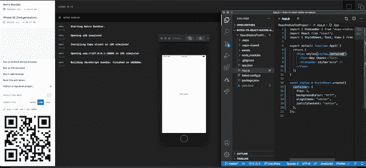
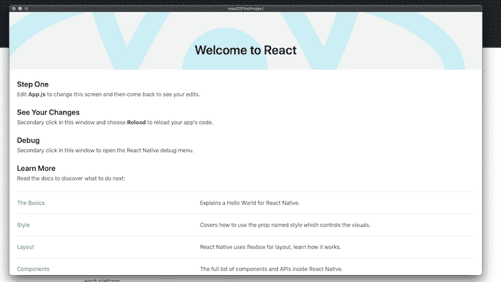
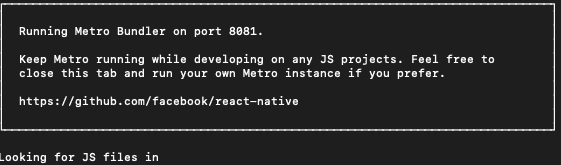
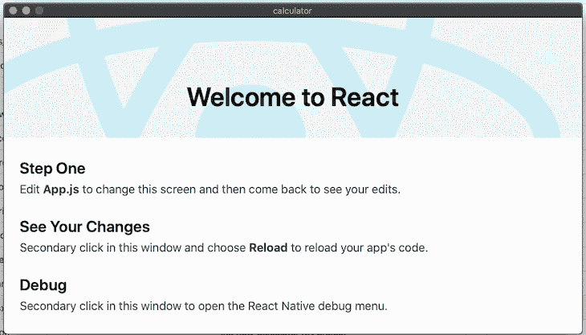
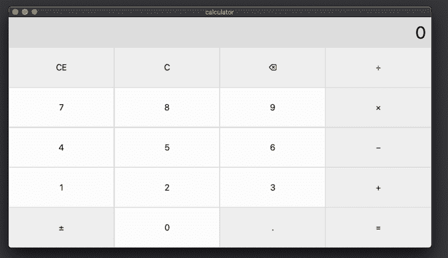
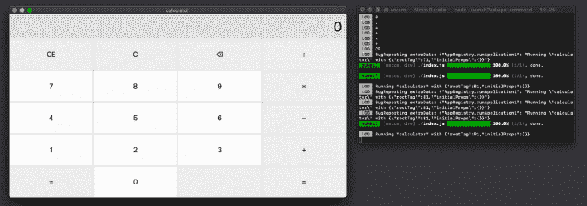
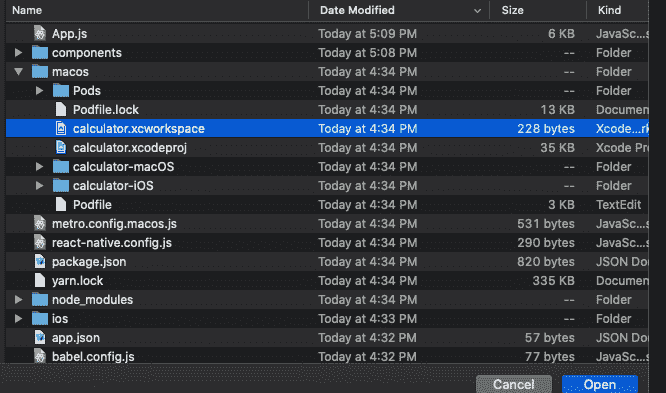
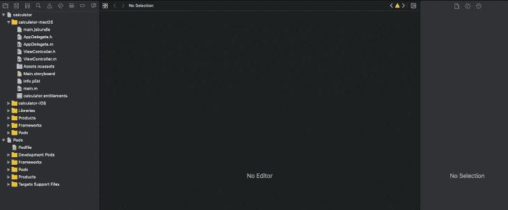

# 操作 React Native for macOS - LogRocket 博客

> 原文：<https://blog.logrocket.com/hands-on-react-native-macos/>

在为 Android 或 iOS 等原生平台构建应用程序时，传统上您必须学习如何用特定的语言(Java、Swift 等)进行编码。)并学习其他工具，如模拟器。

当 [React Native](https://reactnative.dev/) 问世时，它是前端开发人员的游戏改变者，因为他们能够使用他们在日常 web 开发中应用的相同技能为本机平台开发应用程序。

5 月，微软发布了 React Native for macOS 的预览版。这扩大了反应原生世界的范围；现在，您可以使用以前用于 Android 和 iOS 的相同工具来创建桌面应用程序。

本帖将介绍 React Native for macOS。我将通过 GitHub repo 的访问一个示例项目。

这篇文章和所有的例子都是在 MacBook Pro 上运行的。因为我们将利用 Xcode，所以这是一种依赖关系，需要遵循这里介绍的方法和讨论。

## 什么是 React Native？

[React Native](https://reactnative.dev/) 是 React 生态系统的扩展，使 web 开发人员无需学习新的语言和技能就能进入原生开发。当然，开发人员需要学习新的工具，但是只要他们熟悉 React 开发，这种学习曲线是最小的。

React Native 将 JavaScript 代码转换为本地应用，这些应用实际上可以部署到各种应用商店中。有一组核心组件，任何开发人员都可以利用它们快速上手。点击查看 [React 本地组件页面了解更多信息。](https://reactnative.dev/docs/components-and-apis)

还有各种工具和 CLI 可用于 React Native 的开发。我发现使用 Expo CLI 是最容易启动和运行的，我建议按照这里的中的[说明进行操作。](https://reactnative.dev/docs/environment-setup)

如果您选择 Expo CLI 路线，您可以运行`expo init ReactNativeFirstProject`来创建您的第一个项目。这将创建一个如下所示的项目:



正如你所看到的，React Native 可以在模拟器上运行你的 JS 代码(在这种情况下，我在我的 MacBook 上使用 iPhone 模拟器)。只需修改`App.js`文件，重新编译 app，创建一个原生 app。如果您也利用[React Native CLI](https://github.com/react-native-community/cli)，这种体验是类似的。

在我的示例项目中，我已经在文件夹`ReactNativeFirstProject`中创建了一个通用的 React Native 项目，您可以[到达这里](https://www.github.com/andrewevans0102/into-to-react-native-for-macos/ReactNativeFirstProject)。

## 在 macOS 上本地反应

React Native for macOS 构建于原始 React Native 项目之上，以包括 Mac 上的桌面环境。还有一个针对 Windows 开发的版本— [点击这里查看微软的公告](https://microsoft.github.io/react-native-windows/blog/2020/05/19/rn4mupdadates)。

React Native for macOS 有一个类似的设置，您可以在前面的 Expo CLI 中看到。首先，我建议在查看[微软页面。微软文档推荐的流程是使用 React Native `npx`脚本，如下所示:](https://microsoft.github.io/react-native-windows/)

`npx react-native init <projectName>`

一旦你运行了初始脚本，`cd`进入你的项目，用
`npx react-native-macos-init`安装 macOS 扩展。

安装好这些之后，您应该能够通过打开终端、导航到项目目录并运行`npx react-native run-macos`来运行应用程序。结果应该如下所示:



## 初始设置和您的第一个 React 本机 macOS 项目

为了展示基本的开发(和一些更高级的特性)，我们将创建一个计算器。这个计算器的原始版本的源代码是从这里的 [react-native-windows 示例](https://github.com/microsoft/react-native-windows-samples/tree/master/samples/Calculator)中复制的。我修改了这段代码，以便它能在 macOS 上运行。

> 如果你想在我的示例 GitHub 项目中看到完整的版本，导航到`calculator`文件夹，你可以[在这里看到](https://www.github.com/andrewevans0102/into-to-react-native-for-macos/calculator)。

这一节将只关注创建计算器，我们将在下一节讨论代码实际上在做什么。

打开你的终端，运行`npx react-native init calculator`。完成后，导航到已经创建的`calculator`文件夹，用`npx react-native-macos-init`添加`macOS`扩展名。

一旦初始安装完成，在`calculator`文件夹中，使用`npx react-native run-macos`在本地运行应用程序。

运行后，您将看到一个额外的终端屏幕，显示 Metro bundler 正在进行的热重装:



您构建的初始应用程序应该会在 Mac 上打开一个应用程序窗口，您应该会看到以下内容:



完成所有这些后，我们就可以开始构建我们的计算器了。该应用程序应该正在运行，它会在您更改和保存项目时热重新加载。

首先，用以下内容替换您的`App.js`文件的内容:

```
/**
 * Sample React Native App
 * https://github.com/facebook/react-native
 *
 * @format
 * @flow strict-local
 */
import React, {useState} from 'react';
import {StyleSheet, View, Text} from 'react-native';
import CalcButton from './components/CalcButton';
const operators = {
  clearEntry: 'CE',
  clear: 'C',
  backspace: '⌫',
  decimal: '.',
  sign: '±',
  add: '+',
  subtract: '−',
  multiply: '×',
  divide: '÷',
  equals: '=',
};
let calc = {
  stackValue: NaN,
  pendingOperator: '',
  decimalPressed: false,
  showingPreviousResult: false,
};
const App: () => React$Node = () => {
  const [displayText, setDisplayText] = useState('0');
  const buttonPress = (btn) => {
    let text = displayText;
    if (btn === operators.clearEntry) {
      // Clear entry
      clearEntry();
    } else if (btn === operators.clear) {
      // Clear
      calc.stackValue = NaN;
      calc.pendingOperator = '';
      clearEntry();
    } else if (btn === operators.backspace) {
      // Backspace
      if (calc.decimalPressed) {
        calc.decimalPressed = false;
      } else {
        if (isFinite(Number(text))) {
          text = text.substring(0, text.length - 1);
          if (text.length === 0) {
            text = '0';
          } else if (text[text.length - 1] === operators.decimal) {
            text = text.substring(0, text.length - 1);
          }
          setDisplayText(text);
        }
      }
    } else if (btn === operators.decimal) {
      // Decimal
      if (isFinite(Number(text))) {
        if (!calc.decimalPressed && text.indexOf(operators.decimal) === -1) {
          calc.decimalPressed = true;
        }
      }
    } else if (btn === operators.sign) {
      // Sign change
      if (isFinite(Number(text))) {
        let num = Number(text);
        num *= -1.0;
        setDisplayText(num.toString());
      }
    } else if (
      btn === operators.add ||
      btn === operators.subtract ||
      btn === operators.multiply ||
      btn === operators.divide
    ) {
      // Add, Subrtract, Multiply, or Divide
      if (isFinite(Number(text))) {
        computeAndUpdate(btn);
        setDisplayText(calc.stackValue);
      }
    } else if (btn === operators.equals) {
      // Equals
      if (isFinite(Number(text))) {
        computeAndUpdate(btn);
        setDisplayText(calc.stackValue);
        calc.stackValue = NaN;
      }
    } else if (!isNaN(Number(btn))) {
      // Number
      if (isFinite(Number(text))) {
        if (calc.showingPreviousResult) {
          text = '0';
          calc.showingPreviousResult = false;
        }
        if (calc.decimalPressed) {
          text += '.';
          calc.decimalPressed = false;
        }
        if (text === '0') {
          text = '';
        }
        text += btn;
        setDisplayText(text);
      }
    } else {
      alert('error occured');
    }
  };
  const clearEntry = () => {
    calc.decimalPressed = false;
    calc.showingPreviousResult = false;
    setDisplayText('0');
  };
  const computeAndUpdate = (nextOperator) => {
    if (!isNaN(calc.stackValue)) {
      // There's something on the stack, let's compute
      let o1 = calc.stackValue;
      let o2 = Number(displayText);
      if (calc.pendingOperator === operators.add) {
        o1 = o1 + o2;
      } else if (calc.pendingOperator === operators.subtract) {
        o1 = o1 - o2;
      } else if (calc.pendingOperator === operators.multiply) {
        o1 = o1 * o2;
      } else if (calc.pendingOperator === operators.divide) {
        o1 = o1 / o2;
      }
      calc.stackValue = o1;
    } else {
      let num = Number(displayText);
      calc.stackValue = num;
    }
    calc.pendingOperator = nextOperator;
    calc.showingPreviousResult = true;
  };
  return (
    <View style={styles.container}>
      <View style={styles.textRow}>
        <Text style={styles.text}>{displayText}</Text>
      </View>
      <View style={styles.buttonRow}>
        <CalcButton
          name={operators.clearEntry}
          onPress={(n) => buttonPress(n)}
        />
        <CalcButton name={operators.clear} onPress={(n) => buttonPress(n)} />
        <CalcButton
          name={operators.backspace}
          onPress={(n) => buttonPress(n)}
        />
        <CalcButton name={operators.divide} onPress={(n) => buttonPress(n)} />
      </View>
      <View style={styles.buttonRow}>
        <CalcButton name="7" onPress={(n) => buttonPress(n)} />
        <CalcButton name="8" onPress={(n) => buttonPress(n)} />
        <CalcButton name="9" onPress={(n) => buttonPress(n)} />
        <CalcButton name={operators.multiply} onPress={(n) => buttonPress(n)} />
      </View>
      <View style={styles.buttonRow}>
        <CalcButton name="4" onPress={(n) => buttonPress(n)} />
        <CalcButton name="5" onPress={(n) => buttonPress(n)} />
        <CalcButton name="6" onPress={(n) => buttonPress(n)} />
        <CalcButton name={operators.subtract} onPress={(n) => buttonPress(n)} />
      </View>
      <View style={styles.buttonRow}>
        <CalcButton name="1" onPress={(n) => buttonPress(n)} />
        <CalcButton name="2" onPress={(n) => buttonPress(n)} />
        <CalcButton name="3" onPress={(n) => buttonPress(n)} />
        <CalcButton name={operators.add} onPress={(n) => buttonPress(n)} />
      </View>
      <View style={styles.buttonRow}>
        <CalcButton name={operators.sign} onPress={(n) => buttonPress(n)} />
        <CalcButton name="0" onPress={(n) => buttonPress(n)} />
        <CalcButton name={operators.decimal} onPress={(n) => buttonPress(n)} />
        <CalcButton name={operators.equals} onPress={(n) => buttonPress(n)} />
      </View>
    </View>
  );
};
const styles = StyleSheet.create({
  container: {
    flex: 1,
    backgroundColor: '#dddddd',
  },
  textRow: {
    padding: 5,
    alignItems: 'flex-end',
  },
  text: {
    padding: 5,
    fontSize: 36,
  },
  buttonRow: {
    flex: 1,
    flexDirection: 'row',
  },
});
export default App;
```

我们还将为计算器按钮创建一个组件，因此在`components/CalcButton.js`处创建一个文件并添加以下内容:

```
import React from 'react';
import {StyleSheet, Text, TouchableHighlight} from 'react-native';
function CalcButton(props) {
  return (
    <TouchableHighlight
      style={[
        styles.button,
        !isNaN(Number(props.name)) && styles.buttonNumeric,
      ]}
      onPress={() => props.onPress(props.name)}>
      <Text style={styles.buttonText}>{props.name}</Text>
    </TouchableHighlight>
  );
}
const styles = StyleSheet.create({
  button: {
    flex: 1,
    justifyContent: 'center',
    alignItems: 'center',
    backgroundColor: '#eeeeee',
    borderWidth: 1,
    borderColor: '#dddddd',
  },
  buttonNumeric: {
    backgroundColor: '#fcfcfc',
  },
  buttonText: {
    fontSize: 18,
  },
});
export default CalcButton;
```

当你完成时，你应该有一个全功能的计算器——就像这样:



下面是计算器运行的屏幕截图，旁边有热重装程序:



有了这个设置，让我们在下一节讨论代码在做什么。

## 计算器如何工作

在前面的部分中，我们运行了一个计算器。现在，让我们浏览一下代码，讨论它实际上是如何做它正在做的事情的。

如果您注意到在`App.js`文件中，我们的模板看起来像这样:

```
    <View style={styles.container}>
      <View style={styles.textRow}>
        <Text style={styles.text}>{displayText}</Text>
      </View>
      <View style={styles.buttonRow}>
        <CalcButton
          name={operators.clearEntry}
          onPress={(n) => buttonPress(n)}
        />
        <CalcButton name={operators.clear} onPress={(n) => buttonPress(n)} />
        <CalcButton
          name={operators.backspace}
          onPress={(n) => buttonPress(n)}
        />
        <CalcButton name={operators.divide} onPress={(n) => buttonPress(n)} />
      </View>
      <View style={styles.buttonRow}>
        <CalcButton name="7" onPress={(n) => buttonPress(n)} />
        <CalcButton name="8" onPress={(n) => buttonPress(n)} />
        <CalcButton name="9" onPress={(n) => buttonPress(n)} />
        <CalcButton name={operators.multiply} onPress={(n) => buttonPress(n)} />
      </View>
      <View style={styles.buttonRow}>
        <CalcButton name="4" onPress={(n) => buttonPress(n)} />
        <CalcButton name="5" onPress={(n) => buttonPress(n)} />
        <CalcButton name="6" onPress={(n) => buttonPress(n)} />
        <CalcButton name={operators.subtract} onPress={(n) => buttonPress(n)} />
      </View>
      <View style={styles.buttonRow}>
        <CalcButton name="1" onPress={(n) => buttonPress(n)} />
        <CalcButton name="2" onPress={(n) => buttonPress(n)} />
        <CalcButton name="3" onPress={(n) => buttonPress(n)} />
        <CalcButton name={operators.add} onPress={(n) => buttonPress(n)} />
      </View>
      <View style={styles.buttonRow}>
        <CalcButton name={operators.sign} onPress={(n) => buttonPress(n)} />
        <CalcButton name="0" onPress={(n) => buttonPress(n)} />
        <CalcButton name={operators.decimal} onPress={(n) => buttonPress(n)} />
        <CalcButton name={operators.equals} onPress={(n) => buttonPress(n)} />
      </View>
    </View>
```

你会注意到这里有`<View>`和`<Text>`标签，而不是我们通常在模板中看到的传统元素。正如我在介绍部分所述，构建 React 原生应用程序的方法是利用您在这里看到的核心组件[。](https://reactnative.dev/docs/intro-react-native-components)

具体来说，`<View>`标签是一个预构建的 React 本地元素，支持基本布局，包括 flexbox 和一些辅助功能控件。您通常用这个元素或者核心组件中的一个类似变体来包装您的内容区域。要了解更多关于`<View>`的信息，请点击查看[文档。](https://reactnative.dev/docs/0.48/view)

`<Text>`元素类似于你看到的带有`<p>`标签或类似标签的元素。您可以用它来显示应用程序中的文本。要了解更多关于`<Text>`元素的信息，请点击查看[文档。](https://reactnative.dev/docs/0.48/text)

如果您转到我们也创建的`CalcButton`组件，您会注意到模板如下所示:

```
    <TouchableHighlight
      style={[
        styles.button,
        !isNaN(Number(props.name)) && styles.buttonNumeric,
      ]}
      onPress={() => props.onPress(props.name)}>
      <Text style={styles.buttonText}>{props.name}</Text>
    </TouchableHighlight>
```

`<TouchableHighlight>`组件是一个包装器，用于使`<View>`正确响应触摸事件。我们这里的应用程序是专门针对 macOS 的，不需要这个，但是我保留了它，因为我使用的是微软 repo 中提供的示例代码。这也突出了为本机设备构建的 React 本机项目的不同可能性。

`App`和`CalcButton`组件的其余部分与您在任何其他 React 项目中看到的类似。如果你注意到，我们正在从`react`进口典型的`react-native`组件:

```
import React, {useState} from 'react';
import {StyleSheet, View, Text} from 'react-native';
```

从这里，您可以像在任何其他 React 应用程序中一样构建额外的组件——您甚至可以使用钩子。我已经在使用一个带有`useState`的 React 钩子，它的工作方式和 web 应用程序一样。

## 部署打包

这基本上是你的开始，但你最终可能还想部署一个应用程序。在开发过程中，您可以使用 Metro bundler 在构建时热重新加载代码。

当涉及到部署时，您应该依靠 Xcode 来读取您已经创建的项目。在 Xcode 中打开项目后，您可以去几个地方。React Native 提供了一套全面的文档[，专门用于这里的部署](https://reactnative.dev/docs/0.48/running-on-device)。你也应该在这里阅读一下[的苹果文档](https://developer.apple.com/documentation/xcode/preparing_your_app_for_distribution)。

要在 Xcode 中打开您的项目，您需要找到创建的`macos`文件夹，然后打开相关的工作空间文件。在我们的例子中，使用计算器应用程序，您需要打开`macos/calculator.xcworkspace`，如下所示:



用 Xcode 打开这个文件，现在您可以获得在 Apple App Store 中提交项目以供审查所需的所有必要构件:



## 结束语

在这篇文章中，你已经看到了对 React Native for macOS 的介绍。我们介绍了什么是 React Native，然后看到了一个我们用 React Native 为 macOS 构建的真实示例应用程序。

如果你是一个想进入原生应用程序的开发人员，React Native 是一个很好的起点。工具非常直观，React Native 有一套很棒的文档。

在这篇文章中，我们只看到了一小部分可能性。最好的部分是，如果你熟悉 React，React Native for macOS 只需要很少的学习时间。您可以使用 React Native 的工具构建与 React 相同质量的应用程序。

感谢您阅读我的帖子！在 Twitter 上关注我，地址: [@AndrewEvans0102](https://www.twitter.com/andrewevans0102) ！

## [LogRocket](https://lp.logrocket.com/blg/react-native-signup) :即时重现 React 原生应用中的问题。

[](https://lp.logrocket.com/blg/react-native-signup)

[LogRocket](https://lp.logrocket.com/blg/react-native-signup) 是一款 React 原生监控解决方案，可帮助您即时重现问题、确定 bug 的优先级并了解 React 原生应用的性能。

LogRocket 还可以向你展示用户是如何与你的应用程序互动的，从而帮助你提高转化率和产品使用率。LogRocket 的产品分析功能揭示了用户不完成特定流程或不采用新功能的原因。

开始主动监控您的 React 原生应用— [免费试用 LogRocket】。](https://lp.logrocket.com/blg/react-native-signup)