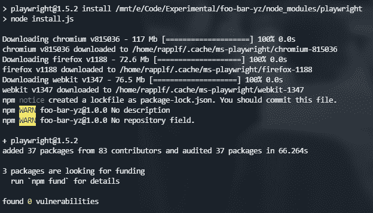

# 无头记录器:加速浏览器自动化的新工具

> 原文：<https://blog.logrocket.com/headless-recorder-browser-automation/>

古老的格言说，只有一小部分开发时间进入实际开发。虽然编写软件肯定是一件重要的事情，但是像文档或测试这样的领域也不应该被忽略——尤其是后者，可能是一个很大的负担，会消耗开发人员大量的时间。

当然，这就是自动化测试派上用场的地方。虽然单元测试形成了一个坚实的基础，但它们既不是完全结论性的，也不是对内部变化健壮的。很多时候，我们发现自己要么为了拥有更健壮和结论性的测试而过度工程化，要么不得不模仿太多的实现细节。

避开单元测试的许多陷阱的一个好方法是混合组件或集成测试。在这里，执行完整的端到端测试的想法当然很有吸引力。

最后，我们可能有一个给我们 80/20(覆盖率/工作量)分布的设置，这正是我们所追求的。不幸的是，端到端测试可能比单元测试更脆弱，需要更复杂的设置。更糟糕的是，写它们可能也更难了。

这就是无头录音机的用处。

## 什么是无头记录仪？

术语 headless 通常表示缺少适当的前端或 UI；取而代之的是更具技术含量的界面。对于[无头记录仪](https://github.com/checkly/headless-recorder)项目来说，事实并非如此。在这里，作者希望找到他们应用的所有潜在目标的共同特征。我们一会儿会回到这个话题。

首先，让我们来看看 Headless Recorder 到底是什么:它是一个可以在浏览器中用来记录网站上所有操作的小工具。然后，这些动作被转换成 JavaScript 代码，供剧作家或木偶师使用(事实上，Headless Recorder 以前被称为木偶师记录器)。

如果你没有听说过这些工具，它们是浏览器自动化应用程序。它们被用来编程浏览器应该做什么，比如点击一个链接或者填写一些表格。

这已经解释了为什么作者选择使用“无头”记录器这个名字。它是所谓的浏览器自动化框架的记录器，通常用于无头模式的浏览器，即在没有 UI 的情况下运行。记录器实际上有一个(非常小的)用户界面。它带有暂停或修改录音的按钮。

该工具以浏览器扩展的形式出现，可以通过 Chrome 网络商店安装[。一旦安装完毕，就很容易运行了。](https://chrome.google.com/webstore/detail/headless-recorder/djeegiggegleadkkbgopoonhjimgehda)

在接下来的章节中，我们将使用剧作家作为我们选择的框架。

## 使用剧作家

剧作家是木偶戏的现代替代品。在大多数情况下，API 方法几乎是相同的，而其他的 API 方法则是出于不同的目的而设计的。

为了运行剧作家，我们采用一个现有的 Node.js 项目，并将其作为一个依赖项进行安装。

```
npm i playwright
```

这看起来像:



我们可以看到，安装还提供了所有必要的浏览器驱动程序；包括 Webkit、Chrome 和 Firefox。

使用剧作家的简单脚本可能如下所示:

```
const { chromium } = require('playwright');

(async () => {
  const browser = await chromium.launch();
  const page = await browser.newPage();
  await page.goto('http://whatsmyuseragent.org/');
  await page.screenshot({ path: `example.png` });
  await browser.close();
})();
```

虽然这个脚本看起来简单，写起来很快，但是真实世界的脚本要长得多，而且很难写对。这里的主要问题是稳定性——指导工具可靠地工作，即使是在很小的事情发生变化或时间发生变化时。

像剧作家这样的工具有多种用例。如前所述，编写端到端测试就是其中之一。在这里，剧作家可以与 Jest 这样的测试框架相结合，代表一种强大的方法，可以解决任何端到端的测试挑战。

## 通用工作流程

现在我们已经知道了一些关于无头记录器和它在剧作家中的一个潜在目标，我们可以看看如何准确地使用它。

让我们从一个简单的任务开始:在亚马逊上搜索一个商品，并获得结果的数量。首先，我们需要理解(并且能够手动执行)这个任务。否则，任何自动化的尝试最终都会失败。

确定的步骤可以读作:

1.  打开亚马逊页面
2.  输入搜索文本
3.  点击搜索
4.  选择结果的数量

这些步骤听起来可能很简单，但诀窍在于教会剧作家如何去做。幸运的是，我们可以使用无头记录器来帮助我们。

我们重新开始，记录步骤。在我们执行了这四个步骤之后，我们停止记录并使用剧作家版本提取代码。

我们得到:

```
const { chromium } = require('playwright');
(async () => {
  const browser = await chromium.launch()
  const context = await browser.newContext()
  const page = await context.newPage()

  const navigationPromise = page.waitForNavigation()

  await page.goto('https://www.amazon.com/')

  await page.setViewportSize({ width: 1920, height: 969 })

  await navigationPromise

  await page.waitForSelector('#nav-search #twotabsearchtextbox')
  await page.click('#nav-search #twotabsearchtextbox')

  await page.waitForSelector('.nav-searchbar > .nav-right > .nav-search-submit > #nav-search-submit-text > .nav-input')
  await page.click('.nav-searchbar > .nav-right > .nav-search-submit > #nav-search-submit-text > .nav-input')

  await navigationPromise

  await page.waitForSelector('.s-desktop-width-max > .sg-col-14-of-20 > .sg-col-inner > .a-section > span:nth-child(1)')
  await page.click('.s-desktop-width-max > .sg-col-14-of-20 > .sg-col-inner > .a-section > span:nth-child(1)')

  await browser.close()
})()
```

虽然上面的代码不是很漂亮，但它也有一些问题:

*   输入丢失
*   一些选择器似乎非常脆弱
*   `navigationPromise`被多次使用，但可能只有一次有效
*   结果是只点击不选择

好消息是生成的代码已经为增强提供了很好的基础。

* * *

### 更多来自 LogRocket 的精彩文章:

* * *

我们将从移除`navigationPromise`开始。这一部分也可以用无头记录器中的设置来完成。接下来，我们将使用`fill`函数来搜索单词“headless”，而不是在搜索文本框中只使用一个`click`最后，我们通过获取`textContent`来替换结果文本上的`click`。

修改后的变体如下所示:

```
const { chromium } = require('playwright');
(async () => {
  const browser = await chromium.launch()
  const context = await browser.newContext()
  const page = await context.newPage()

  await page.goto('https://www.amazon.com/')

  await page.setViewportSize({ width: 1920, height: 969 })

  await page.waitForSelector('#nav-search #twotabsearchtextbox')
  await page.fill('#nav-search #twotabsearchtextbox', 'headless')

  await page.waitForSelector('.nav-searchbar > .nav-right > .nav-search-submit > #nav-search-submit-text > .nav-input')
  await page.click('.nav-searchbar > .nav-right > .nav-search-submit > #nav-search-submit-text > .nav-input')

  await page.waitForSelector('.s-desktop-width-max > .sg-col-14-of-20 > .sg-col-inner > .a-section > span:nth-child(1)')
  const content = await page.textContent('.s-desktop-width-max > .sg-col-14-of-20 > .sg-col-inner > .a-section > span:nth-child(1)')

  console.log(content)

  await browser.close()
})();
```

同样，大多数呼叫保持不变；因此，这里省略了大部分工作。

因此，这将在控制台中打印`1-48 of over 2,000 results for`。

另一个流行的用例是自动测试浏览器。这里，我们可以使用一个测试运行程序，比如 Jest，来实际收集结果。

添加 Jest 的一种方法是安装两个包:

```
npm i jest jest-cli --save-dev
```

添加以`.test.js`为后缀的文件将被识别为使用默认配置的测试。使用之前的代码，我们将得到:

```
const { chromium } = require('playwright');

test('has the right search results', async () => {
    const browser = await chromium.launch()
    const context = await browser.newContext()
    const page = await context.newPage()

    await page.goto('https://www.amazon.com/')

    await page.setViewportSize({ width: 1920, height: 969 })

    await page.waitForSelector('#nav-search #twotabsearchtextbox')
    await page.fill('#nav-search #twotabsearchtextbox', 'headless')

    await page.waitForSelector('.nav-searchbar > .nav-right > .nav-search-submit > #nav-search-submit-text > .nav-input')
    await page.click('.nav-searchbar > .nav-right > .nav-search-submit > #nav-search-submit-text > .nav-input')

    await page.waitForSelector('.s-desktop-width-max > .sg-col-14-of-20 > .sg-col-inner > .a-section > span:nth-child(1)')
    const content = await page.textContent('.s-desktop-width-max > .sg-col-14-of-20 > .sg-col-inner > .a-section > span:nth-child(1)')

    await browser.close()

    expect(content).toBe('1-48 of over 2,000 results for');
});
```

更多的断言也是可能的。一般来说，我们可以通过将共享功能放入所有测试都重用的方法中来简化其中的一些测试。

在优化之前，让我们检查命令行中的输出:

```
$ npx jest
 PASS  ./my.test.js (14.371 s)
  ✓ has the right search results (2160 ms)

Test Suites: 1 passed, 1 total
Tests:       1 passed, 1 total
Snapshots:   0 total
Time:        25.854 s
Ran all test suites.
```

现在我们来提炼一下上面的代码。我们获得:

```
const { chromium } = require('playwright');

let browser, context, page;

beforeEach(async () => {
    browser = await chromium.launch()
    context = await browser.newContext()
    page = await context.newPage()
});

afterEach(async () => {
    await browser.close()
});

test('has the right search results', async () => {
    await page.goto('https://www.amazon.com/')

    // ... (as above)

    expect(content).toBe('1-48 of over 2,000 results for');
});
```

太棒了——在不使用任何 E2E 测试框架的情况下，我们能够利用 E2E 测试来防止回归并使用可靠的冒烟测试。

浏览器自动化的另一个重要用途是增强日志记录。在这里，我们本质上希望允许使用用户动作的重放来[简化错误报告](https://blog.logrocket.com/rethinking-front-end-error-reporting-659db3950db3/)和简化开发。

## 结论

浏览器自动化已经走过了漫长的道路，但仍然面临着这样的问题，即大量的工作是必要的，以确保正确的行动被自动执行。使用 Headless Recorder，我们可以大大改善这种情况，让我们专注于功能而不是技术细节。虽然我们仍然需要注意一些技术细节，但是工具极大地提高了我们的生产力。

你会怎么处理无头录音机？