# 舵图分布-日志火箭博客

> 原文：<https://blog.logrocket.com/helm-chart-distribution/>

Helm 是 Kubernetes 的包装经理。类似于 Debian 的 Apt 和 Python 的 pip，Helm 提供了一种查找、共享和管理 Kubernetes 应用程序的方法。

Helm charts 帮助您定义、安装和升级 Kubernetes 应用程序，而无需直接管理 Kubernetes 清单。它们易于创建、版本化、共享和发布。

Helm 包是在 Kubernetes 中预配置的图表，可以随时部署。图表由配置文件(大部分在 YAML)组成，配置文件包括描述应用程序的元数据、根据标准 Kubernetes 清单操作应用程序所需的基础设施，以及定制的配置文件。

## 先决条件

要跟随本教程，您需要:

## 安装舵

Helm 客户端是一个命令行界面(CLI ),使您能够开发图表；管理集群上的存储库、版本和图表。以及与 Kubernetes API 服务器的接口。

在本教程中，我们将使用 Helm3。

在本文中，我们将使用 [Helm3](https://thenewstack.io/helm-3-is-almost-boring-and-thats-a-great-sign-of-maturity/) ，你可以在这里了解更多关于它所提供的[。](https://thenewstack.io/helm-3-is-almost-boring-and-thats-a-great-sign-of-maturity/)

要安装[舵](https://helm.sh/)，执行以下命令。

```
$ curl https://raw.githubusercontent.com/kubernetes/helm/master/scripts/get-helm-3 > get_helm.sh
$ chmod 700 get_helm.sh
$ ./get_helm.sh

```

您可以通过执行以下命令来测试安装。

```
$ helm version

```

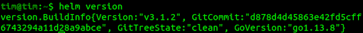

## 舵图

一旦安装了 Helm，您就可以添加图表存储库，这是安装 Kubernetes 图表应用程序所必需的。

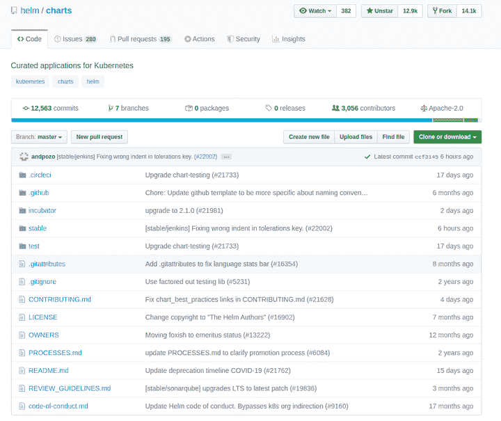

要添加正式的舵稳定图表，请执行以下操作。

```
helm repo add stable https://kubernetes-charts.storage.googleapis.com/

```

您可以使用以下方式列出存储库中的图表:

```
helm search repo stable

```

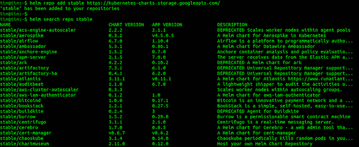

这列出了可以安装到集群的`stable` repo 中可用的所有图表。

## 舵毂

您还可以在 [Helm Hub](https://hub.helm.sh/) 上发现代表 Kubernetes 应用程序的令人惊叹的 Helm 图表。

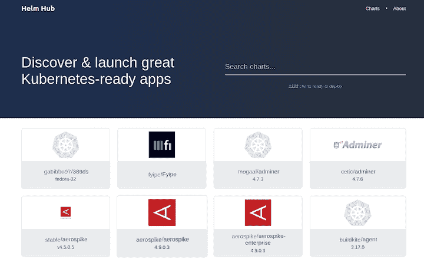

单击任何图表，查看如何使用它的说明和其他详细信息。

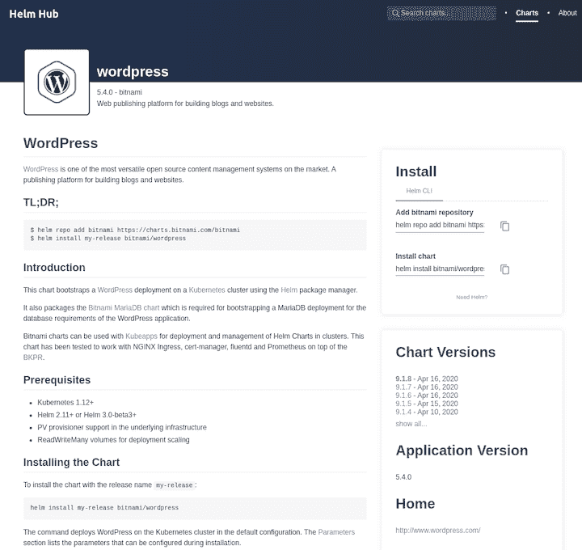

## 安装图表

您可以从公共图表安装任何现有图表。在这个练习中，我们将使用 [Bitnami Helm 图表库](https://kubeapps.com/charts/search?q=bitnami)安装一个 WordPress 应用程序。这也打包了 [Bitnami MariaDB 图表](https://github.com/kubernetes/charts/tree/master/stable/mariadb)，这是为 WordPress 应用程序的数据库需求引导 MariaDB 部署所必需的。

首先，通过执行以下命令添加存储库:

```
helm repo add bitnami https://charts.bitnami.com/bitnami

```

接下来，安装 WordPress 应用程序，并选择发布名称。我们将调用我们的项目`myblog`并为 WordPress 用户名和密码传递自定义值。

```
helm install myblog bitnami/wordpress --version 8.1.4 --set wordpressUsername=admin,wordpressPassword=password

```

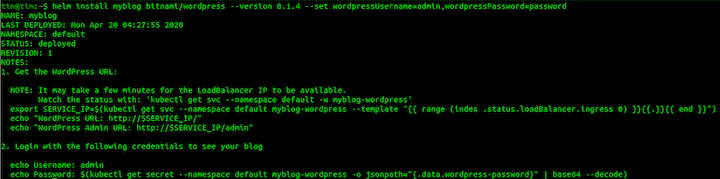

这个图表使用 Helm package manager 在您的 [Kubernetes](http://kubernetes.io/) 集群上启动一个 [WordPress](https://github.com/bitnami/bitnami-docker-wordpress) 部署。

上面的命令还将 WordPress 管理员帐户的用户名和密码分别设置为`admin`和`password`。注意这是以`-wordpress`的形式出现的*。*你可以在 [HelmHub](https://hub.helm.sh/charts/bitnami/wordpress) 上阅读更多关于 Bitnami WordPress 图表及其配置参数的信息。

要获得 Kubernetes 应用程序的运行窗格，请执行以下命令。

```
kubectl get pods

```

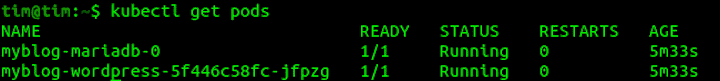

运行以下命令获取 Kubernetes 应用程序的 IP 地址。

```
kubectl get service myblog-wordpress

```

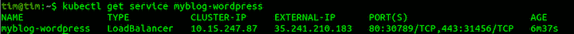

要获得安装图表时创建的所有 Kubernetes 对象的列表，请执行:

```
kubectl get all

```

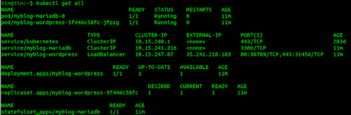

记住，我们用发布名称`myblog`安装了图表。这是图表的运行实例。它可以用不同的版本名安装多次。

使用`helm ls`获取所有已安装版本的列表。

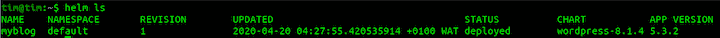

前往[官方文档](https://helm.sh/docs/helm/)获取更多头盔命令。

## 删除图表

Helm 还允许您删除、升级或回滚图表发布。

要卸载一个应用程序并删除与之相关的所有 Kubernetes 对象，请执行以下命令。

```
helm delete myblog

```

## 创建图表

Helm 使您能够支持图表的创建，从而创建图表所需的基本文件。

要创建图表，请运行以下命令。

```
helm create samplechart

```

舵图文件的结构如下。

```
samplechart/
  Chart.yaml
  values.yaml
  charts/
  templates/
    deployment.yaml
    ingress.yaml
    serviceaccount.yaml
    _helpers.tpl
    NOTES.txt
    service.yaml
    tests/
      test-connection.yaml

```

`Chart.yaml`包含图表的详细描述。可以在模板中访问它。

`charts/`包含其他图表，称为子图表。

`values.yaml`包含图表的默认值。您可以通过传递自定义值文件或使用`set`命令在`helm install`或`helm upgrade`期间覆盖这些值。

`templates/`目录包含模板文件。Helm 通过模板渲染引擎发送`templates/`目录下的所有文件。然后它收集这些模板的结果，并将它们作为清单发送给 Kubernetes。

`templates/`目录中的其他文件包括:

*   `NOTES.txt` —图表的“帮助文本”。这将在您的用户运行 helm install 时向他们显示。
*   `deployment.yaml` —创建 Kubernetes 部署的基本清单
*   `service.yaml` —为您的部署创建服务端点的基本清单
*   `_helpers.tpl` —放置可以在整个图表中重复使用的模板助手的地方

这些文档概述了创建你自己的舵图的一些最佳实践。

通过执行以下命令，按原样安装本地图表:

```
helm install sample-app ./samplechart

```

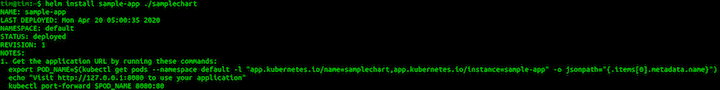

如果您按照安装图表后显示的信息进行操作，当您访问运行转发窗格时，您会看到默认的 Nginx 页面。

## 结论

Helm 是 Kubernetes 工作流的一个有用工具，因为它可以帮助您避免直接编写或修改 Kubernetes 清单。它还抽象了许多复杂性，并帮助您更有效地部署和管理应用程序。

要更深入地了解 Helm，请查看以下资源。

## 使用 [LogRocket](https://lp.logrocket.com/blg/signup) 消除传统错误报告的干扰

[](https://lp.logrocket.com/blg/signup)

[LogRocket](https://lp.logrocket.com/blg/signup) 是一个数字体验分析解决方案，它可以保护您免受数百个假阳性错误警报的影响，只针对几个真正重要的项目。LogRocket 会告诉您应用程序中实际影响用户的最具影响力的 bug 和 UX 问题。

然后，使用具有深层技术遥测的会话重放来确切地查看用户看到了什么以及是什么导致了问题，就像你在他们身后看一样。

LogRocket 自动聚合客户端错误、JS 异常、前端性能指标和用户交互。然后 LogRocket 使用机器学习来告诉你哪些问题正在影响大多数用户，并提供你需要修复它的上下文。

关注重要的 bug—[今天就试试 LogRocket】。](https://lp.logrocket.com/blg/signup-issue-free)