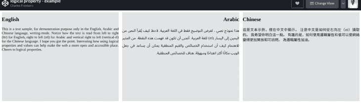

# 以下是如何在 CSS 中使用逻辑属性

> 原文：<https://blog.logrocket.com/heres-how-to-use-logical-properties-in-css/>

## 介绍

CSS 是一种处理网络表达的语言。最初创建它是为了瞄准屏幕的物理坐标(或尺寸)。作为开发人员，我们通过使用`margin-top`、`margin-right`、`margin-bottom`等属性来编写针对屏幕尺寸的样式。

但是网络是全球化的，语言并不完全朝着同一个方向发展。比如英语是从左向右写(`ltr`)，而阿拉伯语是从右向左写(`rtl`)。

为了解决国际化的问题，我们现在有了逻辑属性和值。以下是规范对逻辑属性和值的描述:

> 逻辑属性和值为作者(开发人员)提供了通过逻辑而非物理的方向和维度映射来控制布局的能力。–[W3C 规范](https://drafts.csswg.org/css-logical/)

这意味着我们可以在 CSS 样式中使用流相关的术语，而不是针对屏幕的物理部分。

例如，`width`的逻辑映射是`inline-size`，而`height`的逻辑映射是`block-side`。`inline-size`将决定内嵌尺寸的长度，而`block-side`决定块尺寸的长度。使用`inline-size`和`block-size`代替`width`和`height`将产生相同的布局。

这里有一个 codepen 上的例子，展示了两个`<div>`的样式，一个带有`width`和`height`，另一个带有`inline-size`和`block-size`。请注意，输出是相同的:

```
<div class="container">
  <div class="item physical-section"> 
  </div>
  <div class="item logical-section">
  </div>
</div>
```

```
.physical-section{
  width: 300px;
  height: 300px;
  background-color: blue;
}

.logical-section{
  inline-size: 300px;
  block-size: 300px;
  background-color: yellow;
}
```

您可以在[密码笔](https://codepen.io/freeborncharles/full/zYqMJQm)上查看结果。

## 一看`writing-mode`和`direction`属性

全球有不同类型的书写系统。每个书写系统可以根据语言以特定的方向书写。例如，英语书写系统是从左到右(`ltr`)。同时，阿拉伯语或希伯来语从右向左书写(`rtl`)。

### `Writing-mode`

> 书写模式 CSS 属性设置文本行是水平还是垂直布局，以及块前进的方向。
> 
> [-MDN](https://developer.mozilla.org/en-US/docs/Web/CSS/writing-mod)

上面的定义是这样的:文本行是包含在一个像`<p>`元素这样的块元素中的文本。这些文本行将从左到右(`ltr`)或从右到左(`rtl`)以水平的从上到下(`horizontal-tb`)或垂直的从左到右(`vertical-lr`)或垂直的从右到左(`vertical-rl`)，这取决于书写系统。

为了适应不同语言的书写风格，我们有了`writing-mode`属性。而我们为什么会有`writing-mode`？我们使用`writing-mode`来定位起点。

`Writing-mode`还决定文本行的布局，可以是水平的或垂直的，以及块的方向(`ltr`或`rtl`)。

让我们通过`inline`和`block-level`元素来了解`writing-mode`。

HTML `<p>`元素是一个`block-level`元素(容器)。这就是为什么另一个`<p>`元素会在前一个段落下面开始一个新段落的原因。但是`<p>`元素通常包含文本，这些文本就是`inline-level`内容。

所以`writing-mode`将决定`block-level`容器的堆叠，而方向将决定`inline-level`内容的流向。

这是规格中 [`writing-mode`属性](https://drafts.csswg.org/css-logical/#biblio-css-writing-modes-4)的复杂索引。

### 句法

```
writing-mode: horizontal-tb; 
writing-mode: vertical-rl;
writing-mode: vertical-lr;
writing-mode: sideways-rl;
writing-mode: sideways-lr;
```

下面是 Codepen 中的一个例子:

> ltr–英语这就是英语中的文本！注意当你阅读这个例子时，你的眼睛是如何从左向右移动的。如果你的母语是英语，或者习惯于写和读英语文章，这是显而易见的。

`Direction`

### CSS 属性设置文本、表格列和水平溢出的方向。–[MDN](https://developer.mozilla.org/en-US/docs/Web/CSS/direction#:~:text=The%20direction%20CSS%20property%20sets,English%20and%20most%20other%20languages)。

> `direction`属性可以取这两个值中的任意一个:`ltr`(从左到右)或`rtl`(从右到左)。`Direction`用于定义文字的方向。
> 语法

下面是一个使用`direction` `rtl`的希伯来语示例文本。可以在 codepen 上查看。请注意，该文本是用谷歌翻译的:

```
/* Keyword values*/

direction: ltr;            /* text goes from left to right.*/
direction: rtl;            /* text goes from right to left. */
```

HTML 中还有一个`dir`属性，可以设置在 HTML 文档的根，定义文本的方向。要使用`dir`属性，我们可以这样做:

```
<p class="sampleText">
 טקסט לדוגמה בעברית. תורגם באמצעות Google Translate.
</p>
```

```
.sampleText {
  direction: rtl;
}
```

逻辑属性和值

```
<html dir="rtl">
<p>This sample text will be read from right to left</p>
</html>
```

## 对一些概念如`writing-mode`和`direction`有了一些基本的理解，我们现在可以通过一些例子来深入理解逻辑属性和值。

逻辑属性是它们对应的 CSS 物理属性的`writing-mode`等价物。

以下是逻辑属性和物理属性的非详尽列表:

**逻辑属性**

| **物理特性** | 边框-块-结束 |
| --- | --- |
| 边框-底部 | 边框-块-结束-颜色 |
| 边框-底部-颜色 | 边框-块-结束-样式 |
| 边框底部样式 | 边距-块-结束 |
| 页边距-底部 | 边距-块-开始 |
| 上边距 | 边距-行内-结尾 |
| 右边距 | 边距-内联-开始 |
| 左边距 | 填充块结束 |
| 底部填充 | 填充-块-开始 |
| 衬垫顶部 | 填充-内联-结束 |
| 填充-右侧 | 填充-内联-开始 |
| 填充-左侧 | 有关逻辑属性的完整列表，请参见此处的[和](https://drafts.csswg.org/css-logical/)。 |

有了逻辑属性，开发人员现在可以用开始/结束对齐的心态来编写样式，而不是顶部、右侧、底部、左侧(屏幕的物理尺寸)，甚至像我们习惯的那样浮动。

所以我们有`inline-start`和`inline-end`代表`inline direction`，有`block-start`和`block-end`代表`block direction`。

逻辑属性使开发人员可以很容易地更改或改变布局。想想 CSS 网格(`grid-row-start`、`grid-row-end`、`grid-column-start`和`grid-column-end`)。

为什么`block`和`inline`维度在逻辑属性中很重要

### 逻辑属性和值使用`block`和`inline`作为流程方向的抽象。

`Block` dimension 处理一行中一行内文本的流向。对于水平`writing-mode`，文本将沿垂直方向流动。对于垂直`writing-mode`，文本将沿水平方向流动。

行内尺寸平行于一行内的文本流向。同时，`horizontal-writing-mode`中的水平尺寸和`vertical-writing-mode`中的垂直尺寸。

例子

### 下面是一个为三种不同语言的`writing-mode`使用逻辑属性的例子:英语、阿拉伯语和汉语。



```
<!--- HTML index.html -->

<div class="container">
 <div class="english-style item">
   <h2>English</h2>
   <p>
     This is a text sample, for demonstration purposes only in the English, Arabic. and Chinese language, writing-mode. Notice how the text is read from left to right (ltr) for English, right to left (rtl) for Arabic and vertical right to left (vertical-rl) for the Chinese language. Interesting how using logical properties and values can help make the web a more open and accessible place. Cheers to logical properties. </p> </div> <div class="arabic-syle item"> <h2>Arabic</h2> <p> هذا نموذج نصي ، لغرض التوضيح فقط في اللغة العربية. لاحظ كيف يُقرأ النص من اليمين إلى اليسار (rtl) للغة العربية. أتمنى أن تكون قد فهمت هذه النقطة. من المثير للاهتمام كيف أن استخدام الخصائص والقيم المنطقية يمكن أن يساعد في جعل الويب مكانًا أكثر انفتاحًا وسهولة. هتاف الخصائص المنطقية. </p> </div> <div class="chinese-style item"> <h2>Chinese</h2> <p> 這是文本示例，僅在中文中顯示。 注意中文是如何從右向左（rtl）讀取的。 我希望你明白這一點。 有趣的是，如何使用邏輯屬性和值可以使網絡變得更加開放和可訪問。 為邏輯屬性加油。 </p> </div> </div>
```

```
/* Styles.css*/

.container{
  display: grid;
  grid-template-columns: repeat(3, 1fr);
  grid-template-rows: 400px;
  gap: 1rem;
}

.item{
  background: #E1E3E4;
  text-align: justify;
}

.english-style{
  writing: horizontal-tb;
  direction: ltr;
}

.arabic-syle{
  writing-mode: horizontal-tb;
  direction: rtl;
}

.chinese-style{
  writing-mode: vertical-rl;
}
```

参见 Codepen 上的示例[。](https://codepen.io/freeborncharles/full/QWNzXRX)

浏览器兼容性

### 虽然并非所有浏览器都完全支持逻辑属性和值，但对逻辑属性的基本理解是理解和使用布局的关键。

请使用[can 使用](https://caniuse.com/css-logical-props)检查浏览器支持以及逻辑属性和值的兼容性。

结论

## 我建议你开始使用逻辑属性来编写你的风格，因为网络无疑是一个国际化的工具。

有了逻辑属性，开发人员现在可以让文本垂直运行和流动，翻转布局，并为世界各地的语言处理不同的`writing-mode`。

尽管逻辑属性尚未在所有浏览器中得到完全支持，但我强烈建议您开始使用逻辑属性而不是物理属性来编写样式。

更多阅读资料和资源:

你的前端是否占用了用户的 CPU？

## 随着 web 前端变得越来越复杂，资源贪婪的特性对浏览器的要求越来越高。如果您对监控和跟踪生产环境中所有用户的客户端 CPU 使用情况、内存使用情况等感兴趣，

.

[try LogRocket](https://lp.logrocket.com/blg/css-signup)

LogRocket 就像是网络和移动应用的 DVR，记录你的网络应用或网站上发生的一切。您可以汇总和报告关键的前端性能指标，重放用户会话和应用程序状态，记录网络请求，并自动显示所有错误，而不是猜测问题发生的原因。

[](https://lp.logrocket.com/blg/css-signup)[https://logrocket.com/signup/](https://lp.logrocket.com/blg/css-signup)

现代化您调试 web 和移动应用的方式— [开始免费监控](https://lp.logrocket.com/blg/css-signup)。

Modernize how you debug web and mobile apps — [Start monitoring for free](https://lp.logrocket.com/blg/css-signup).