# Heroku 部署 Node.js 应用程序的替代方案

> 原文：<https://blog.logrocket.com/heroku-alternatives-deploy-node-js-app/>

多年来，Heroku 的免费层一直是许多开发人员向公众发布原型、爱好项目和作品集的标准。

不幸的是， [Heroku 宣布计划从 2022 年 11 月 28 日开始停用其免费层](https://blog.heroku.com/next-chapter),这让许多开发者争相寻找替代方案来托管他们的训练营和组合项目。

在这篇文章中，我们将回顾使用 Heroku 部署应用程序的几种替代方案。我们将构建一个简单的、无框架的 Node.js 应用程序，然后将其部署到三个提供免费层的不同服务中， [Render](https://render.com/) 、 [Railway](https://railway.app/) 和 [Fly.io](https://fly.io/) 。我们还将探索静态部署和无服务器功能的一些 Heroku 替代方案。我们开始吧！

*向前跳转:*

## 构建我们的测试应用

我们将构建一个普通的 Node.js 服务器，但是如果您使用任何流行的 Node.js 框架，如 Express、Koa、Fastify、NestJS、FoalTS 等，同样的原则也适用。您的计算机上应该已经安装了 Node.js。

打开编辑器，打开一个空文件夹。使用`npm init -y`命令从终端创建一个新的 Node.js 项目。

创建一个名为`touch index.js`的`index.js`文件。在`package.json`中，让我们用下面的命令设置我们的启动脚本:

```
  "scripts": {
    "start": "node index.js"
  },

```

在`index.js`中，运行下面的代码来配置一个基本的“Hello，World！”Node.js 服务器:

```
// Import http library
const http = require("http")
// use env variable to define tcp/ip port with a default
const PORT = process.env.PORT || 8080
//create our server object
const server = http.createServer()
// We define a function that runs in response a request event
server.on("request", (request, response) => {
  // handle request based on method then URL
  response.statusCode = 200
  response.write("Hello World")
  response.end()
})
// get the server to start listening
server.listen(PORT, err => {
  // error checking
  err ? console.error(err) : console.log(`listening on port ${PORT}`)
})

```

让我们通过运行`node start`然后转到`localhost:8080`来进行本地测试。如果你看到“你好，世界！”，那么它正在工作，您可以开始部署它。从您的终端，创建一个名为`git init`的 git 存储库。用`git add .`命令将所有文件添加到 staging，然后用`git commit -m"First Commit"`提交。

接下来，前往[GitHub.com](https://github.com)，创建一个新的存储库，并获取 URL。将您的 GitHub.com 回购作为远程设备添加到您的本地回购，并确保使用您的 URL:

```
git remote add origin https://github.com/username/reponame

```

然后，将您的代码推送到遥控器`git push origin main`。您可以使用命令`git branch`确认您的分支是主分支还是主控分支。

现在我们已经在 GitHub 上有了示例代码，我们可以开始部署它了。作为参考，你可以[查看我对这个教程](https://github.com/AlexMercedCoder/node-app-for-test-deployment)的回购。

## 部署以渲染

[Render 的自由层](https://render.com)使 React、Vue 和 Angular 应用的静态部署以及 Node.js 应用的 web 服务部署变得简单。只需遵循以下步骤:

*   使用您的 GitHub 帐户登录 Render.com
*   点击**新建** > **Web 服务**
*   连接您刚刚创建的 GitHub 存储库
*   在下一个屏幕上，为您的项目命名，接受所有默认值和自由层，然后部署

在下面的屏幕中，我们等待部署完成，这可能需要一段时间。在左上角，您可以找到完成后的 URL:

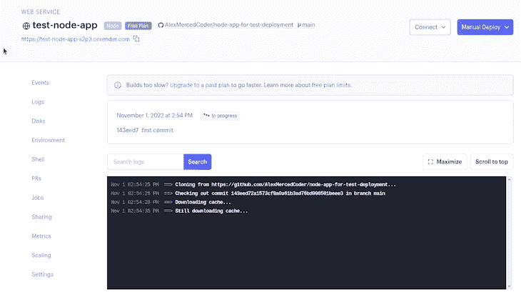

完成后，点击为您生成的 URL，您应该会看到我们的“Hello，World！”消息。那很容易，不是吗！

Render 提供了其他一些服务，在您构建应用程序时可能会发现这些服务很有用，比如数据库和 cron 作业，它们是按照设定的时间表运行的脚本。

## 部署到铁路

与 Render 类似， [Railway](https://railway.app/) 是一项服务，允许您部署应用程序并提供几种类型的数据库，如 Postgres、mySQL 和 MongoDB。在 Railway 上部署 Node.js 应用程序的步骤与 Render 非常相似:

*   使用您的 GitHub 帐户登录
*   创建一个新项目，从 **GitHub** 中选择 **deploy**
*   选择您的回购，然后选择**立即部署**

它应该会很快完成，您会看到以下屏幕:

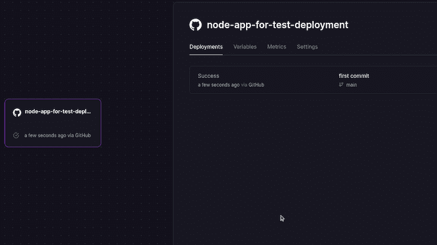

默认情况下，它没有可公开访问的域名。要生成一个，前往**设置**选项卡，点击**生成域**；这将创建一个 URL，您可以使用它与他人共享您的项目。就是这样！

## 使用 Fly.io 部署

Fly.io 主要专注于部署 Docker 容器，在过去的几年里，它使这一过程变得更加容易。首先，用你的 GitHub 账户注册。在使用 Fly.io 进行部署时，我们将采用不同的方法:

*   安装 Fly.io 的命令行工具， [FlyCtl](https://fly.io/docs/hands-on/install-flyctl/)
*   使用命令`flyctl auth login`登录。它会要求你提供支付信息，但只要你还在免费层，就不会被收费
*   从终端，使用`flyctl launch`部署应用程序
*   回答提示并接受默认值，然后等待部署完成

这可能需要一段时间，但一旦部署完毕，您将在 Fly.io 仪表板上看到该应用程序以及它所在的 URL。

如果您将来需要更新您的应用程序，只需从您的应用程序所在的目录运行`flyctl deploy`命令。当您运行`flyctl launch`时，它创建了一个`fly.toml`文件，其中包含了加速更新的所有部署设置，因此它知道要更新哪个部署。

如果它不起作用，仔细检查在`fly.toml`中显示的端口是否与在第 4 行的`index.js`中显示的默认端口相同。

## 静态部署的 Heroku 替代方案

并非每个应用程序都要求您部署服务器；比如 frontend React、Vue、SolidJS、Svelte、Angular apps 都可以部署成静态 app。

有几个免费部署这些静态应用的选项只需要你将你的 GitHub 库与你的项目连接，包括 Render、Railway、Fly.io、Netlify、GitHub Pages、Vercel、App by Digital Ocean、Surge.sh、Firebase 和 Azure 静态应用。

不是在提供者的服务器上持续运行服务器代码，而是只交付项目中的静态 HTML、CSS 和 JavaScript 文件。所以，免费选项比较少。

### 渲染时静态部署

要在 Render 上部署静态站点，请转到您的仪表板，添加一个新的**静态站点**:

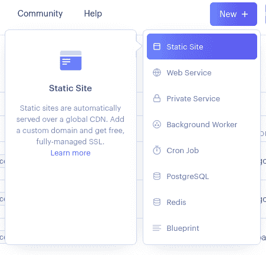

从这里，您只需将存储库与您的静态网站连接起来，为 React 指定任何构建命令，如`npm run build`，然后单击 **deploy** 。

### 网络上的静态站点部署

登录 Netlify.com，然后在仪表盘上点击**添加**T2【新站点】T3:

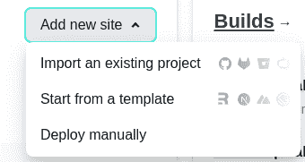

然后，选择一个 GitHub 存储库:


设置您的构建命令和发布目录，这将根据您使用的前端框架而有所不同:

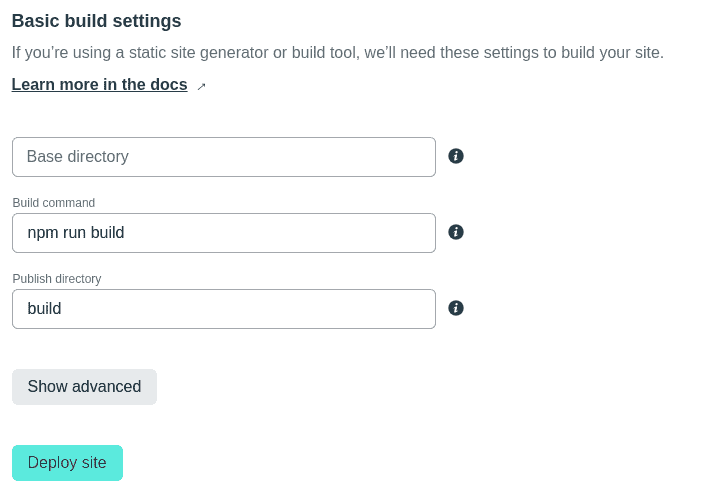

最后，点击**部署** **站点**，大功告成！

### Vercel 上的静态站点部署

登录[Vercel](https://vercel.com/login)；从仪表板上，点击**添加新的**，然后选择**项目**:

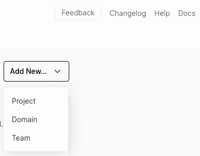

选择要部署的 GitHub 存储库:

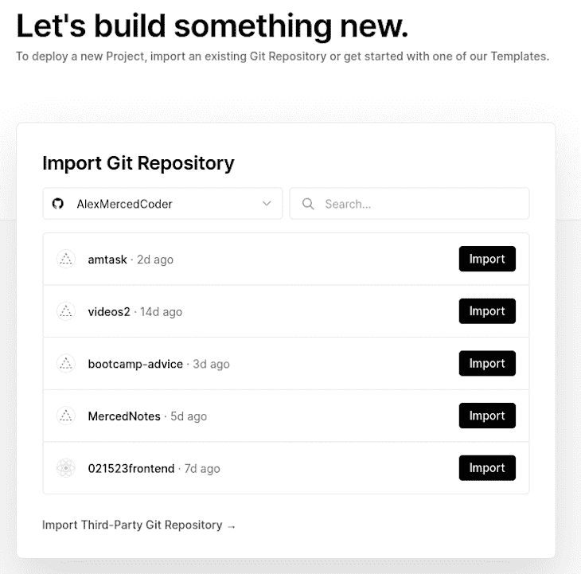

设置您的构建命令和输出指导，然后单击 **deploy** :

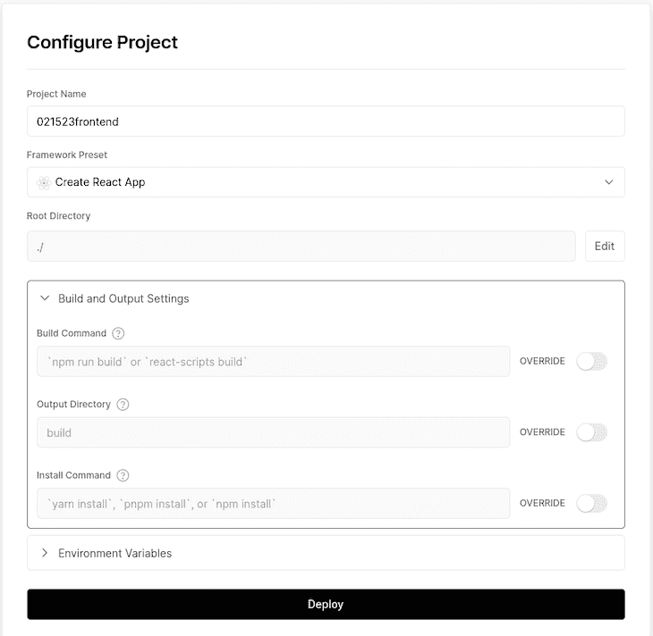

### 数字海洋应用平台上的静态站点部署

前往[数字海洋仪表盘](https://cloud.digitalocean.com/login)的**应用**部分，然后点击**创建**并选择**应用**:

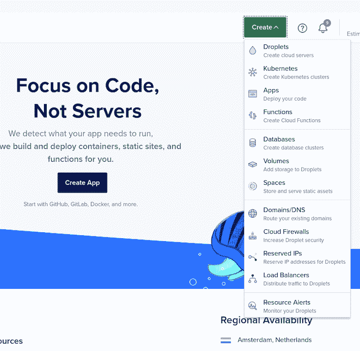

为您的应用程序选择一个 GitHub 存储库，并向其传递必要的配置，如源目录:

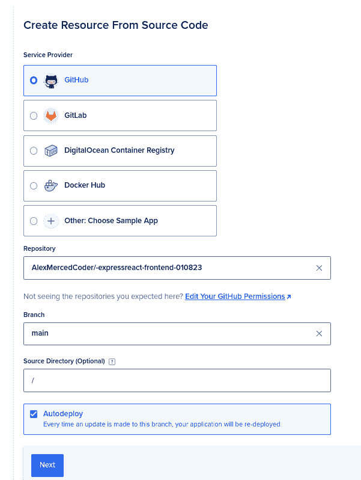

在下一页，我们将应用程序设置为静态站点部署:

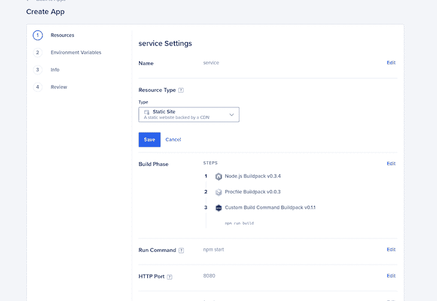

要部署像 Heroku 这样的后端服务，还可以选择 **Web 服务**，但这在数字海洋上不是免费的。将其更改为静态站点后，请确保检查构建命令和输出目录:

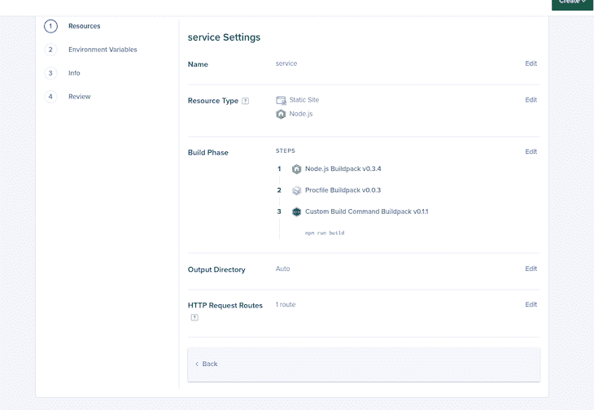

点击**审核**然后**创建资源**，你的 app 就部署好了！

### GitHub 页面上的静态站点部署

在任何拥有静态站点的 GitHub 存储库中，只需进入**设置**部分，点击**页面**:

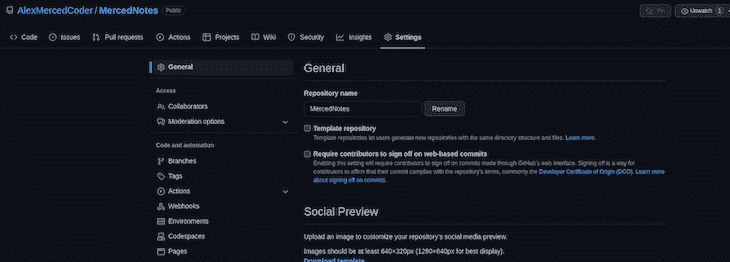

接下来，选择一个要部署的分支，并**保存**，几分钟后，该站点将处于活动状态:

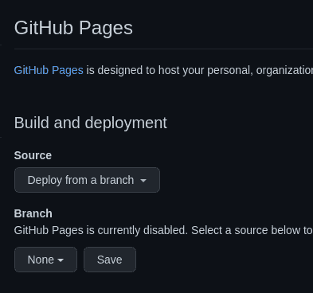

## 无服务器功能

无服务器功能是处理后端数据库交互和 API 交付的另一种选择，这是我们通常部署服务器应用程序的目的。

不用编写全天候运行的服务器，您可以编写具有所需逻辑的函数，在提供商的服务器上按需运行。所有主要的云，如 AWS、Azure 和 Google，都以服务的形式提供无服务器功能，但也有其他服务使使用无服务器功能变得更加容易。

通常，这些服务要求您将 GitHub repo 与您想要部署的每个功能的一个文件连接起来，然后为它分配一个 URL，您可以从您的前端应用程序调用它。

### 在 Netlify 上使用无服务器功能

要向部署在 Netlify 上的静态应用程序添加一些后端功能，只需在存储库中创建一个`/netlify/functions`文件夹。您可以在此文件夹中添加任意数量的 JavaScript 文件；例如，让我们假设我创建了一个类似如下的`/netlify/functions/cheese.js`文件:

```
exports.handler = async function (event, context) {
  return {
    statusCode: 200,
    body: JSON.stringify({ cheese: "Gouda" }),
  };
};

```

当上面的代码被部署到 Netlify 时，它将创建一个您可以在`/.netlify/functions/cheese`发出请求的路由。您可以使用项目的`package.json`中加载的任何库，因此连接到数据库和其他典型的后端活动都是公平的。

### 在 Vercel 上使用无服务器功能

要对部署在 Vercel 上的静态应用程序使用无服务器函数，您可以使用 Vercel 函数，当您使用 JavaScript 时，它与 ExpressJS 有相似的感觉。

只需在项目中名为`/api`的文件夹中创建 JavaScript 或 TypeScript 文件。例如，假设我创建了一个名为`/api/cheese.js`的文件，它执行以下操作:

```
export default function handler(req,res) {
  res.json({cheese: "gouda"});
}

```

当我将我的应用程序部署到 Vercel 时，我可以向`/api/cheese`发出任何 API 请求，以从该函数获得响应。

## 付费期权

Heroku 的主要目的是部署动态服务器应用程序。除了 Render、Railway 和 Fly.io 的免费选项之外，其他一些付费选项也是如此，连接 GitHub repo 并发布您的应用程序:

*   来自数字海洋的应用平台:起价 5 美元/月
*   AWS Amplify:定价取决于运行应用程序所需的 AWS 资源成本

## 结论

是的，我们失去 Heroku 的免费层是有点破坏性，但由此导致的许多不同服务的分裂，如 Render，Railway 和 Fly.io 将使行业更具弹性。随着开发者不再受制于一家厂商，市场份额的竞争将加速创新的动力:

| 供应者 | 免费静态部署 | 免费服务器部署 | 免费无服务器功能 | 付费入口点 |
| --- | --- | --- | --- | --- |
| Fly.io | 不 | 是 | 不 | 计量价格 |
| 提供；给予 | 是 | 是 | 不 | 起步项目 7 美元/月 |
| 铁路 | 是 | 是 | 不 | 计量定价 |
| 赫罗库 | 不 | 不 | 不 | 5 美元/月 |
| 网络生活 | 是 | 不 | 是 | 19 美元/月 |
| GitHub 页面 | 是 | 不 | 不 | 没有人 |
| 韦尔塞尔 | 是 | 不 | 是 | 20 美元/月 |
| 数字海洋应用 | 是 | 不 | 不 | 5 美元/月支持服务器/静态 |
| 重火力点 | 是 | 不 | 是 | 计量定价 |
| Surge.sh | 是 | 不 | 不 | 30 美元/月 |

我希望你喜欢这篇文章。如果您有任何问题，请务必留下评论，并让我知道您更喜欢哪个服务作为 Heroku 的替代服务。编码快乐！

## 200 只显示器出现故障，生产中网络请求缓慢

部署基于节点的 web 应用程序或网站是容易的部分。确保您的节点实例继续为您的应用程序提供资源是事情变得更加困难的地方。如果您对确保对后端或第三方服务的请求成功感兴趣，

[try LogRocket](https://lp.logrocket.com/blg/node-signup)

.

[](https://lp.logrocket.com/blg/node-signup)[https://logrocket.com/signup/](https://lp.logrocket.com/blg/node-signup)

LogRocket 就像是网络和移动应用程序的 DVR，记录下用户与你的应用程序交互时发生的一切。您可以汇总并报告有问题的网络请求，以快速了解根本原因，而不是猜测问题发生的原因。

LogRocket 检测您的应用程序以记录基线性能计时，如页面加载时间、到达第一个字节的时间、慢速网络请求，还记录 Redux、NgRx 和 Vuex 操作/状态。

[Start monitoring for free](https://lp.logrocket.com/blg/node-signup)

.