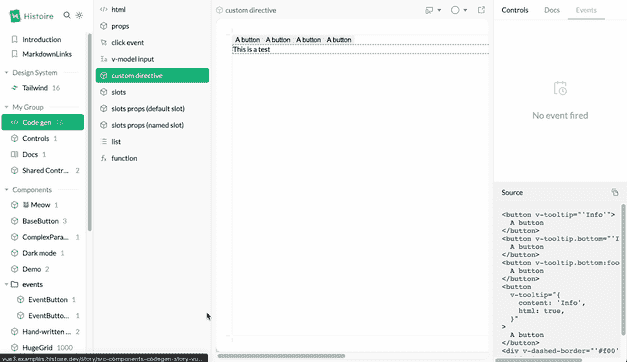
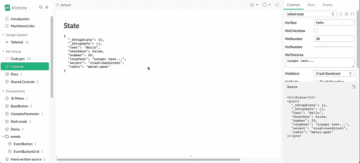
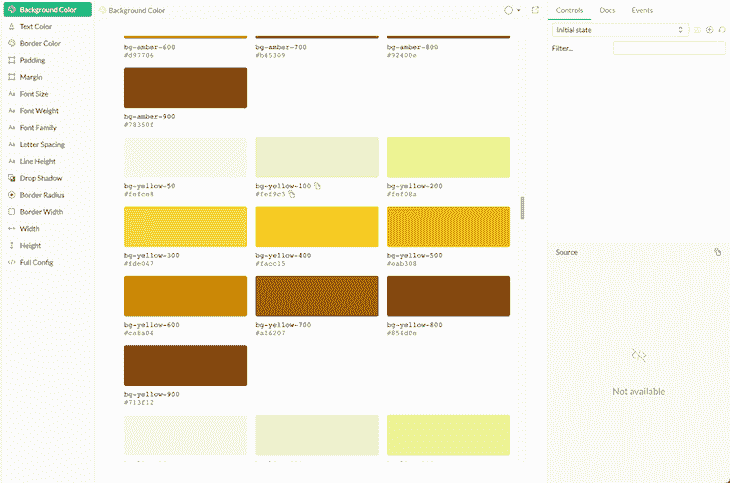

# 用 Histoire 改进组件故事

> 原文：<https://blog.logrocket.com/histoire-component-stories/>

Histoire 是一个前端工具，通过创建故事来帮助开发人员沙盒化他们的 UI 组件，然后可以单独观察、测试和展示这些故事。故事被定义为一个场景，在该场景中，您可以在特定条件下展示一个或多个 UI 组件。

本文将涵盖以下内容:

## 为什么应该使用 Histoire

Histoire 提供了一组很棒的特性，可以帮助开发人员更好地组织他们的组件。

### 历史的速度

用 Histoire 创作故事时，你首先注意到的是它的速度。Histoire 依靠 Vite 作为构建工具提供的能力，这使得热重新加载几乎是即时的，包括故事和父组件编辑。

Histoire 以最快的速度展示您的组件，允许您实时可视化文档、源、操作和事件更改:


### his tier 的支持和兼容性

在撰写本文时，Histoire 提供了一流的 Vue 3 和 Svelte 3 支持。使用这些框架，您可以轻松地创建故事。

下面是一个为 Vue 组件创建的简单故事。这个故事是用组合 API 在 Vue SFC 中编写的，可以用 Vue 的 API 特性进行扩展:

```
<!-- Avatar.story.vue -->
<script setup>
import Avatar from '../components/Avatar.vue';
</script>

<template>
  <Story title="Avatar">
    <Variant>
      <Avatar src="https//image.jpg" name="John Doe"/>
    </Variant>

    <Variant title="Avatar without image">
      <Avatar name="John Doe"/>
    </Variant>
  </Story>
</template>

<docs lang="md">
# Avatar component
A simple avatar component
</docs>

```

当使用 Vue 编写故事时，Histoire 提供了从故事的当前状态生成源代码的能力。当您需要在特定场景中重用组件时，这个特性非常强大。

兼容性表[可以在这里](https://histoire.dev/guide/getting-started.html#supported-frameworks)进行跟踪。

### 历史 UI 和 UX

Histoire 提供了一个已经很漂亮且响应迅速的 web 应用程序，可以帮助展示您的组件。任何 Histoire 实例都可以被主题化、更名，并具有灵活的配置系统。

Histoire 为主应用程序提供了明暗模式切换，以及编辑组件背后的背景以更好地适应您想要呈现它们的场景的能力:



故事及其变体可以组织在文件夹中，并在网格和列表中展示。

Histoire 还提供了内置的控制按钮，使您能够构建自己的场景控件，这些控件可以在**控件**面板上找到。这些控件可以帮助您创建简单和复杂的状态。



Histoire 附带了一个强大且非常直观的内置搜索功能，使您能够在不依赖第三方服务的情况下搜索您的故事和文档。

### Histoire 的简单文档

Histoire 有一个[像样的文档网站](https://histoire.dev/guide/vue3/docs.html)，根据你选择为其编写故事的框架，其步骤被很好地描述和组织。

[API 参考页面](https://storybook.js.org/)给出了你可以用来创建故事和编辑 Histoire 实例的几乎所有东西的简要概述。

## 故事 vs 故事书

尽管相当新，Histoire 已经是 Vue 和 Svelte 3 故事开发的 API 参考页的有力竞争者。以下几点概述了 Histoire 和 Storybook 之间的比较。

### 用 Histoire 和 Storybook 支持其他框架

如上所述，Storybook 提供了强大的 Vue 和 Svelte 支持，使您能够用纯 Vue 或 Svelte 语法编写您的故事。没有必要学习一种新的语法来帮助你写你的故事——它们对你正在使用的框架来说是天生的。

Storybook 尽最大努力支持所有主要框架(Angular、Vue 和 React)，社区支持[svelite](https://svelte.dev/)、 [Preact](https://preactjs.com/) 和 [Ember](https://emberjs.com/) 。这种支持有时会失败，因为 Storybook 通常只与 React 保持同步。然而，你可以[追踪 Storybook 对框架的特性支持](https://storybook.js.org/docs/react/api/frameworks-feature-support)。

Histoire 有一个看似不同的哲学。在编写故事时，它为开发人员提供了一种非常容易理解的语法，旨在帮助开发人员在很少使用该库 API 的情况下创建故事。

### 历史故事和故事书的用户体验

Storybook 在其默认的 web 应用程序上提供了坚实的 UX。然而，Histoire 的首次发布给人留下了非常深刻的印象。它已经提供了构成我们喜欢故事书的大部分功能:可搜索的故事、有组织的故事、故事变体、文档和视图编辑。

Storybook 通过提供诸如颜色过滤器、可缩放的故事、可访问性检查等工具，以及一个漂亮的控制描述面板(它也控制 URL ),使您能够共享创建的场景的链接，从而使 UX 更上一层楼。

这些 UX 附加物感觉棒极了。至于 Histoire，时间会证明一切，但我已经认为它有很大的潜力来创建一个精心处理细节的 web 应用程序。

### Histoire 和 Storybook 的开发者体验

Histoire 的速度非常快，这是因为它依赖于 Vite，并重用项目的 Vite 配置来帮助设置应用程序。同时，Storybook 有多个构建者——其中一个是 Vite。尽管如此，在启动和故事发展方面，Storybook 仍然感觉不如 Histoire 快。

用 Storybook 写故事的时候，需要学习 [CSF](https://storybook.js.org/docs/react/api/csf) (组件故事格式)，它增强了你的故事，并且已经基于你的组件是什么样子了。您可能还需要学习 [MDX](https://storybook.js.org/docs/react/api/mdx) ，这在编写文档时会有所帮助。

相比之下，Histoire 为开发者提供了一种不那么抽象的写故事的方式。使用 Histoire，故事是在编写组件的框架中编写的(Vue 或 Svelte)。

Histoire 的文档已经很好了，基于正在使用的框架进行了分离。每个框架都有自己写故事和与 Histoire 的 API 交互的方式。提供的可能性用[可行示例](https://github.com/histoire-dev/histoire/tree/main/examples)记录。Storybook 还有一个非常直观的文档，里面有大量的例子、展示应用，甚至还有一个[插件页面](https://storybook.js.org/addons/)。然而，有时我们可能会在其他组件的专用文档页面下找到 React 片段。

当您开始拥有一个复杂的 Storybook 实例时，您经常会感觉被依赖项淹没，并且您的项目感觉不可能更新到下一个 Storybook 版本。为了解决这个问题，Storybook 有一个强大的 CLI，可以帮助升级或迁移到更高版本的 Storybook。

## 故事书特色

毫无疑问，Storybook 提供了比 Histoire 更多的功能，包括:

*   可定制的背景
*   文件（documents 的简写）
*   视口编辑
*   统治者
*   控制
*   概述

这些只是应用程序附带的基本功能。除了上面的特性，Storybook 还提供了大量的插件，从 Figma 插件到可视化回归测试。所有这些特性为开发者使用故事书提供了深度和广度，并且具有很高的灵活性。

Histoire 提供了编写精彩故事所需的基本工具:背景、视口、控件、事件跟踪和文档。这些特性为您记录和展示组件打下了坚实的基础。如果您需要更高级的工具，比如组件国际化(i18n——翻译您的故事),您可能会发现缺少 Histoire。尽管如此，你可以编写自己的插件。

Storybook 尽了很大的努力来提供额外的功能作为插件，然而这种深度的可能性有时会使软件膨胀，使其不直观。另一方面，Histoire 提供了任何用户记录故事所需要的东西。

## 性能和捆绑包大小

有些人会说，在帮助编写组件故事的应用程序中，包的大小和性能是一个重要的方面(因为它们经常被用作组件文档)，但是我强烈认为，在选择用来记录组件的工具时，这是一个应该考虑的重要细节。一些 UI 框架作者使用 Histoire 和 Storybook 这样的工具作为他们唯一的库文档。因此，这些网站必须加载足够快，以服务他们的用户。

## 自动设计令牌集成

Histoire 能够自动使用您的 Tailwind CSS 配置在 Histoire 的实例中生成一个设计令牌故事。这些故事可以在团队中作为参考/文档小册子，用于定制的 Tailwind CSS 集成:



## 外挂程式历程

Histoire 提供了感觉非常自然的官方插件,也可以在你的组件文档中进一步帮助你的需求。除此之外，一个早期但清晰的插件开发指南可供你编写自己的插件。

## 结论

很难比较故事书和历史书。Storybook 已经在游戏中存在很长时间了，并且一直在快速改进。Histoire 很新，感觉不那么臃肿，因为它还年轻。然而，这两种工具各有优缺点。如果你正在开始一个新项目，最佳选择将取决于你的具体需求。

通常，如果您有一个 React 项目，并且需要一个强大的工具来创建故事以展示和记录 React 组件，那么 Storybook 是更好的选择。但是，如果您有基本的组件文档需求，或者喜欢对 Vue 或 Svelte 的更好支持，那么 Histoire 很可能是更好的工具。

## 使用 [LogRocket](https://lp.logrocket.com/blg/signup) 消除传统错误报告的干扰

[](https://lp.logrocket.com/blg/signup)

[LogRocket](https://lp.logrocket.com/blg/signup) 是一个数字体验分析解决方案，它可以保护您免受数百个假阳性错误警报的影响，只针对几个真正重要的项目。LogRocket 会告诉您应用程序中实际影响用户的最具影响力的 bug 和 UX 问题。

然后，使用具有深层技术遥测的会话重放来确切地查看用户看到了什么以及是什么导致了问题，就像你在他们身后看一样。

LogRocket 自动聚合客户端错误、JS 异常、前端性能指标和用户交互。然后 LogRocket 使用机器学习来告诉你哪些问题正在影响大多数用户，并提供你需要修复它的上下文。

关注重要的 bug—[今天就试试 LogRocket】。](https://lp.logrocket.com/blg/signup-issue-free)