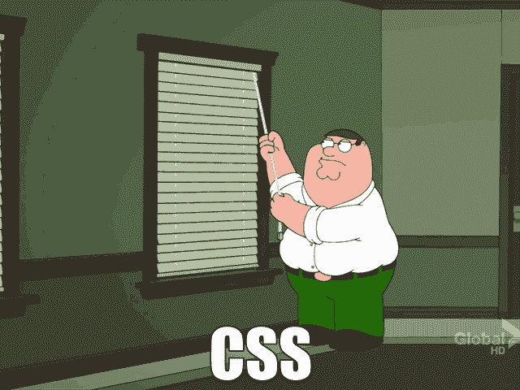
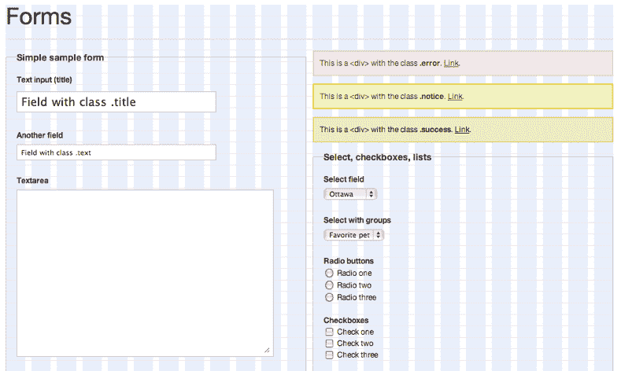
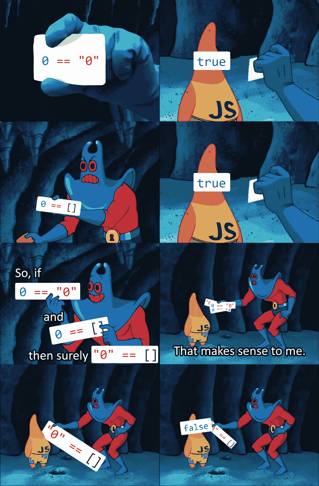
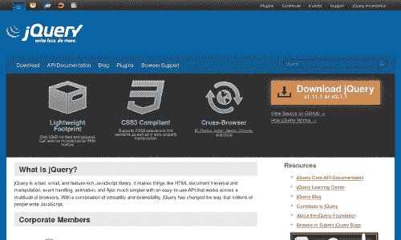
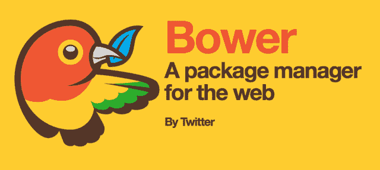
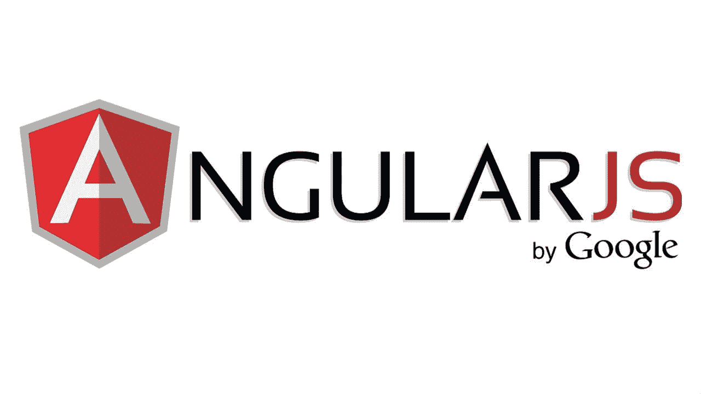
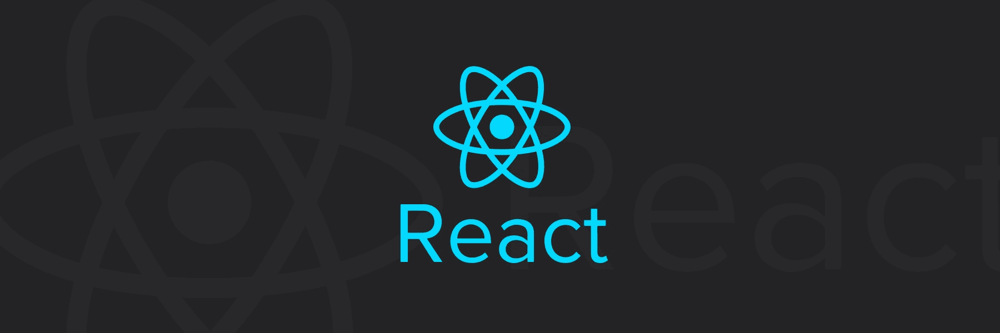
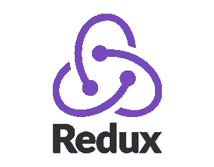
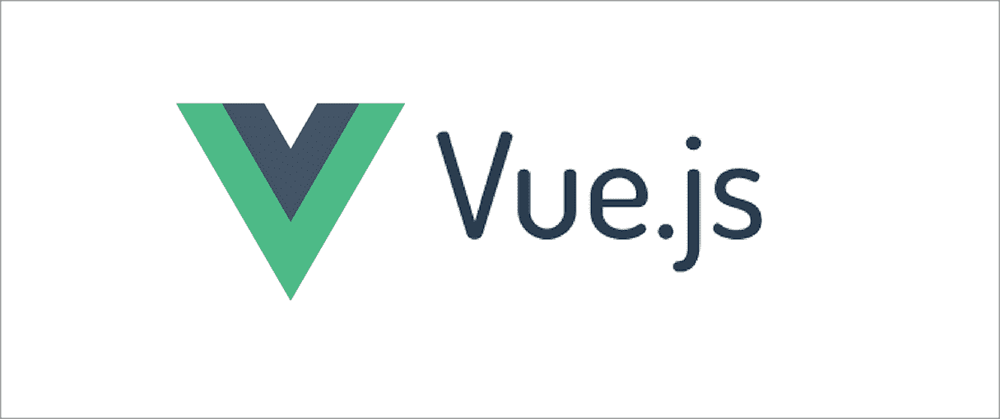

# 前端框架的历史

> 原文：<https://blog.logrocket.com/history-of-frontend-frameworks/>

## 介绍

你有没有尝试过只用普通的 HTML5、CSS3 和 JavaScript 来构建一个前端 web 界面？嗯，这年头其实也没那么难。如果所需的特性不复杂，你可以相对容易地完成一个小项目。对于大中型项目，您至少需要一个框架来处理用户需求带来的复杂性。

今天，一个初学者可以比 20 年前更快地构建更复杂的前端界面。

在本文中，我们将看看现代前端框架是如何发展到提供这种复杂程度的。

## 基础技术时间表

让我们首先快速浏览一下构成网络的基本技术。

HTML、CSS 和 JavaScript 的历史非常丰富，可以很轻松地填满一整本书。我将重点介绍过去 30 年中发生的一些值得注意的时刻。

Tim Berners-Lee at CERN

第一个 HTML 规范于 1991 年底由 T2·蒂姆·伯纳斯·李·T3 公布。当时它只支持文本，只有 18 个标签。后来，CSS 由[hkon Wium Lie](https://twitter.com/wiumlie)于 1994 年[10 月](https://www.w3.org/People/howcome/p/cascade.html)提出。

大约两年后，HTML 4.0 发布了，这是第一个支持 CSS 的规范。Internet Explorer 3 成为第一个支持 CSS 的商业浏览器。这是在 CSS 级成为万维网联盟推荐标准之前。

1995 年，一种新的浏览器脚本语言叫做*摩卡*由[布伦丹·艾希](https://twitter.com/BrendanEich)只用了 10 天就创造出来了。它被重新命名为 *LiveScript* 。几个月后，它被重新命名为 *JavaScript* ，正如我们现在所知。 [Ecma International](https://logrocket-blog.ghost.io/history-of-frontend-frameworks/#) 目前负责开发 JavaScript 规范。HTML 和 CSS 规范属于万维网联盟，也被称为 W3C。

## CSS 的问题是

在我们深入框架之前，我想先做一个关于 CSS 的重要说明。

在 web 的早期，大多数浏览器都不符合标准化的 CSS 规范。开发一个在一个浏览器上看起来不错的网站，而在另一个浏览器上却一塌糊涂，这非常令人沮丧。

支持多种浏览器是一场噩梦。当时，Internet Explorer 是最流行的浏览器，但它没有很好地实现几个 CSS 功能，如 *box model* 。人们创造了各种 CSS 技巧来解决特定浏览器的各种问题。

一个名为 [Web 标准项目](http://www.webstandards.org/)的组织创建了一系列 CSS 测试，称为 ACID tests。当 CSS 在浏览器中正确实现时，应该会出现以下图像:

然而，这是出现在 Internet Explorer 7 上的内容:

IE7 ACID2 screenshot

你不会想看到以前的版本有多糟糕。所有主流浏览器都受到了不同程度的影响。由于 Web 标准项目和在线社区的努力，大多数 CSS 问题现在已经在主流浏览器中得到解决。

当 CSS 2.1 在 2011 年 4 月成为*推荐提案*时，大约用了 13 年才完成。CSS level 2 是从 1998 年开始的 W3C 推荐标准*。花费这么长时间的原因是由于一些 CSS 特性延迟了新版本的完成。至于 CSS3，整个 2.1 级规范被分解成模块。每个模块现在都是独立开发的。规范的分解极大地帮助了浏览器厂商在模块级别上更快地赶上最新的建议。*

 *今天，我们在第 4 级有一些模块处于草案阶段。其他都是三级。如果添加了新的 CSS 特性，它就变成了级别 1。可以访问 [W3C CSS 工作页面](https://www.w3.org/Style/CSS/current-work.en.html)查看各个模块的当前状态。你也可以访问 css3test.com 的[来检查你的浏览器对不同 CSS 模块的支持程度。](http://css3test.com/)

## CSS 框架

大约在 2000 年代中期，CSS 库和框架开始涌现。这些框架引入了网格系统来帮助网页设计者布局他们的内容。这些框架支持大多数浏览器(对设计者来说少了一个头疼的问题)。最早的一些 CSS 框架包括[蓝图](http://blueprintcss.org/)、 [960](https://960.gs/) 、 [YUI 网格](https://yuilibrary.com/yui/docs/cssgrids/)和 [YAML](http://www.yaml.de/) 。

Blueprint CSS Framework UI Elements

当手机制造商开始销售带有网络浏览器的设备时，并没有为手机重新设计网站。移动浏览器本身能够重新格式化网页以适应小屏幕。

随着时间的推移，手机中的硬件有了很大的改进。2006 年，Opera Mobile 成为第一个通过 [ACID2 测试](https://en.wikipedia.org/wiki/ACID2)的手机浏览器。Safari 是第一款通过测试的桌面浏览器。

2007 年，史蒂夫·乔布斯发布了第一部 iPhone。它拥有当时最大的屏幕。很快，安卓设备推出了类似或更大的屏幕尺寸。智能手机和移动浏览的普及导致互联网使用率大幅上升。很快，公司开始意识到为手机屏幕设计网站的重要性。

2011 年，Twitter 发布了 Bootstrap CSS 框架作为开源项目。2012 年，Bootstrap 2 发布了一个 12 列响应网格布局系统以及许多其他新功能。2013 年，发布了 Bootstrap 3，它重新设计了组件，并具有移动优先的设计理念。

2017 年 8 月发布的 Bootstrap 版本 4 增加了对 [Sass](https://blog.logrocket.com/its-2018-you-shouldn-t-be-writing-vanilla-css-b3d09b9c2c41) 和 [Flexbox](https://blog.logrocket.com/flexing-with-css-flexbox-b7940b329a8a) 的支持。Bootstrap 是目前最流行的 CSS 框架。它更受希望快速原型化一个好看的 web 界面的开发人员的欢迎。

2011 年 10 月，ZURB 开源了他们的 CSS 框架，并将其发布为 [Foundation 2.0](https://foundation.zurb.com/) 。它以响应网格为特色，并支持 Sass。它也有一个预先设计的 UI 元素的广泛列表。Foundation 更受希望完全控制站点定制的设计师的欢迎。Foundation 还附带了电子邮件模板。

还有很多其他很棒的 CSS 框架。您可以通过下面的链接了解每个框架的更多信息:

## JavaScript 框架

就像 CSS 一样，JavaScript 经历了一段艰难的时期，浏览器兼容性是一个问题。您必须付出额外的努力来确保您的 JavaScript 代码能够在您支持的所有浏览器上正确运行。您还需要注意它的一些怪癖，尤其是如果您来自强类型语言的话。

最早让 JavaScript 变得有趣的库之一是 jQuery。它于 2006 年 8 月发布。它帮助开发人员编写 JavaScript 代码，而不用担心浏览器兼容性。它包含了大量有用的功能，使得任何网站都变得容易互动。

在此之前是早在 1996 年就存在的 AJAX 技术。当时它有一个不同的名字，最初是由 Internet Explorer 和 Mozilla 实现的。然而，这项技术没有得到充分利用。2004 年，谷歌在其 Gmail 和谷歌地图产品上实现了标准版本的 AJAX 技术。

不久之后，他们开始在 web 应用程序中实现它。jQuery 等框架和库开始增加对 AJAX 的支持。

随着前端框架和库数量的增加，管理依赖关系的需求越来越迫切。2012 年，Twitter 推出了前端依赖包管理器 [Bower](https://bower.io/) 。

Bower 用于获取和下载遍布 web 的依赖项。

2014 年，创建了一个前端包的中央存储库，称为 [npm 注册表](https://www.npmjs.com/)。

它目前托管超过 350，000 个包。

* * *

### 更多来自 LogRocket 的精彩文章:

* * *

虽然 jQuery 是最流行的 web 界面 JavaScript 库，但它缺乏在共享视图间一致处理数据的工具。构建了几个框架来解决这个问题。 [Backbone](http://backbonejs.org/) 、 [Knockout](https://knockoutjs.com/index.html) 和 [Ember](https://www.emberjs.com/) 是迅速流行起来的最早的 JavaScript 框架。

[AngularJS](https://angularjs.org/) 于 2010 年 10 月在[上市。它很快成为最流行的 JavaScript MVC 框架。它提供了双向数据绑定、依赖注入、路由包等等。](https://github.com/angular/angular.js/releases?after=v0.9.10)

AngularJS 帮助开发人员解决了他们在构建 web 项目时面临的许多问题。然而，随着 AngularJS 项目复杂性的增加，web 开发人员开始对这个框架感到失望。

AngularJS 团队决定重新设计整个框架，并将其命名为 Angular 2。

不幸的是，这个新版本与 AngularJS 完全不兼容。没有提供迁移路径。这激怒了很多 AngularJS 开发者，导致他们完全放弃了这个框架。从那以后，Angular 就再也没能达到它曾经拥有的数字。

2013 年 5 月，在美国举行的一次 JavaScript 会议上，推出了一个名为 [React](https://reactjs.org/) 的新游戏规则库。它是由为脸书工作的软件工程师[乔丹·沃克](https://twitter.com/jordwalke)创造的。观众对它的许多创新功能感到惊讶，如虚拟 DOM、单向数据流和流动模式。

React 团队解释了这种架构如何帮助他们解决在为脸书修复 bug 时面临的一些最大的重复挑战。大会结束后不久，React 迅速走红。

2015 年， [Redux 库](https://redux.js.org/)由[丹·阿布拉莫夫](https://twitter.com/dan_abramov)和[安德鲁·克拉克](https://twitter.com/dan_abramov)创建。它成为了一种革命性的数据流架构，灵感来自于脸书的 Flux 架构。

您可能知道，React 构建了一个丰富的库和工具生态系统。甚至现有的 CSS 框架如 Bootstrap 也为 React 构建了[版本。如今，React 是最流行的 JavaScript 技术。如果您正在使用 React，很难找到符合您项目要求的库。](https://react-bootstrap.github.io/)

在 AngularJS 的秋天，一个与 Angular 和 React 都有相似之处的新框架已经兴起。 [Vue.js](https://vuejs.org/) ，一个进步的 JavaScript 框架，最初由[尤雨溪](https://twitter.com/youyuxi)于 2014 年 2 月在[发布。](http://blog.evanyou.me/2014/02/11/first-week-of-launching-an-oss-project/)

他之前在谷歌和流星公司工作。与非常灵活的 React 或非常固执己见的 Angular 不同，Vue 试图选择中间立场。Vue.js 提供了一个轻量级框架，周围是一个由 Vue 团队官方维护的生态系统。

## 时间表摘要

标准化的过程就像胶水一样把所有的层粘在一起。没有它，前端技术将会更加分散和不可用。如今，这种技术正在被压缩。

为了更全面地了解情况，让我们快速回顾一下:

1990-1995 年 : HTML、CSS 和 JavaScript 被发明出来

1996–1999 年:标准化工作开始。浏览器合规很可怕。浏览器大战点燃。

2000–2004 年 : CSS 框架开始出现。jQuery 诞生了。前端包管理。

**2005–2009:**符合 W3C 规范。Chrome 浏览器独占鳌头。介绍了响应式设计和框架。

**2010–2015:**JavaScript 框架诞生即 Backbone、Ember、AngularJS、React、Angular、Vue。HTML5 公布。

**2016–2018:**graph QL 崭露头角。原生 HTML，CSS & JavaScript 变得更强大。建立在现有 JavaScript 框架之上的新平台不断涌现: [StoryBook](https://storybook.js.org/) ， [Motion UI](https://zurb.com/playground/motion-ui) ， [Gatsby](https://www.gatsbyjs.org/) ， [Next.js](https://zeit.co/blog/next) 。

## 今后

我将通过展望前端框架的未来来结束这篇文章。对于即将到来的开发者来说，未来确实看起来很光明，因为他们不必处理过去十年的混乱。

大多数前端框架现在是稳定的，目前正在进一步优化，以使它们性能更好，对开发人员更友好。

静态站点生成器正在成为一种趋势。静态网站对 SEO 更友好，并且比服务器渲染的网站提供更好的性能。生成的网站更容易缓存并通过 CDN 网络分发。我们目前有使用 React 的 [Next.js](https://nextjs.org/) 和 [Gatsby](https://www.gatsbyjs.org/) 。其他流行的静态站点生成器包括 [Nuxt](https://nuxtjs.org/) 、 [Jekyll](https://jekyllrb.com/) 和 [Hugo](https://gohugo.io/) 。

当前版本的 HTML、CSS 和 Javascript 远比十年前先进。大多数浏览器现在都在竞相满足合规性，因此最新的规范推出得更快。很有可能现代图书馆提供的大部分繁重任务将很快在未来实现。

因此，新一代高性能轻量级框架正在开发中。使用[苗条](https://svelte.technology/)的 [Sapper](https://sapper.svelte.technology/) 框架已经对公众开放。Angular Ivy 和 React Prepack 仍在开发中。

Node.js 平台可能很快就会被一个叫做 [Deno](https://github.com/denoland/deno) 的新平台所取代。最初的 Node.js 创建者[瑞安·达尔](https://github.com/ry)正在开发它。他在一次 js 会议上提出了 Node.js 的[无法修复的问题。这些问题正在他的新项目中得到解决。](https://medium.com/@imior/10-things-i-regret-about-node-js-ryan-dahl-2ba71ff6b4dc)

我真的希望 Deno 能尽快准备好，并且整个社区能很快转向它。它将使开发变得更加容易、精简和快速。这可能意味着重写现有的框架和库，它们可能不是向后兼容的。尽管有缺点，我认为在开发过程中使用的总资源的节省将是巨大的。

最后，我想通过预测 Drag n Drop builders，如 [Bootstrap Studio](https://bootstrapstudio.io/) 将很快成为主流，如果它们是开源的话。这可能在未来 5 年内发生。它们生成的代码比十年前所见即所得编辑器生成的垃圾要干净得多。越来越多的人将很快开始创建几乎没有技术背景的网站。

## [LogRocket](https://lp.logrocket.com/blg/react-signup-general) :全面了解您的生产 React 应用

调试 React 应用程序可能很困难，尤其是当用户遇到难以重现的问题时。如果您对监视和跟踪 Redux 状态、自动显示 JavaScript 错误以及跟踪缓慢的网络请求和组件加载时间感兴趣，

[try LogRocket](https://lp.logrocket.com/blg/react-signup-general)

.

  

LogRocket 结合了会话回放、产品分析和错误跟踪，使软件团队能够创建理想的 web 和移动产品体验。这对你来说意味着什么？

LogRocket 不是猜测错误发生的原因，也不是要求用户提供截图和日志转储，而是让您回放问题，就像它们发生在您自己的浏览器中一样，以快速了解哪里出错了。

不再有嘈杂的警报。智能错误跟踪允许您对问题进行分类，然后从中学习。获得有影响的用户问题的通知，而不是误报。警报越少，有用的信号越多。

LogRocket Redux 中间件包为您的用户会话增加了一层额外的可见性。LogRocket 记录 Redux 存储中的所有操作和状态。

现代化您调试 React 应用的方式— [开始免费监控](https://lp.logrocket.com/blg/react-signup-general)。

## 像用户一样体验您的 Vue 应用

调试 Vue.js 应用程序可能会很困难，尤其是当用户会话期间有几十个(如果不是几百个)突变时。如果您对监视和跟踪生产中所有用户的 Vue 突变感兴趣，

[try LogRocket](https://lp.logrocket.com/blg/vue-signup)

.

[https://logrocket.com/signup/](https://lp.logrocket.com/blg/vue-signup)

LogRocket 就像是网络和移动应用程序的 DVR，记录你的 Vue 应用程序中发生的一切，包括网络请求、JavaScript 错误、性能问题等等。您可以汇总并报告问题发生时应用程序的状态，而不是猜测问题发生的原因。

LogRocket Vuex 插件将 Vuex 突变记录到 LogRocket 控制台，为您提供导致错误的环境，以及出现问题时应用程序的状态。

现代化您调试 Vue 应用的方式- [开始免费监控](https://lp.logrocket.com/blg/vue-signup)。*