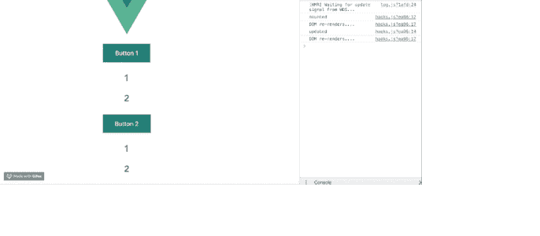

# 钩子来了 vue . js 3.0 版- LogRocket 博客

> 原文：<https://blog.logrocket.com/hooks-are-coming-to-vue/>

本文介绍了一个名为[钩子](https://blog.logrocket.com/frustrations-with-react-hooks/)的实验性 Vue 特性。

## 开始之前

这篇文章适合所有阶段的开发者，包括初学者。在阅读本文之前，这里有一些你应该已经具备的东西。

您需要在您的电脑中安装以下设备:

*   [Node.js 版本 10.x](https://nodejs.org/en/) 及以上安装。您可以通过在终端/命令提示符下运行以下命令来验证您是否知道:

```
node -v
```

*   代码编辑器:强烈推荐使用 Visual Studio 代码
*   [Vue 的最新版本](https://vuejs.org/)，全球安装在您的机器上
*   安装在您机器上的 Vue CLI 3.0 。为此，请先卸载旧版本的 CLI:

```
npm uninstall -g vue-cli
```

然后安装新的:

```
npm install -g @vue/cli
```

*   在这里下载一个 Vue starter 项目
*   解压缩下载的项目
*   导航到解压缩后的文件，并运行命令以保持所有依赖项最新:

```
npm install
```

## 简介:钩子

最初，包含状态逻辑的 React 组件必须是一个类组件。尽管 React 中已经有了无状态的功能组件，但是仍然需要创建适应状态逻辑的组件，而不是类。那是胡克斯出生的时候。钩子是在功能组件中使用状态逻辑的一种方式，因此不需要编写类。

## 上课有什么不好？

首先，类没有错，但是 React 团队发现[理解类如何工作已经成为 React 采用的一个障碍](https://reactjs.org/docs/hooks-intro.html#classes-confuse-both-people-and-machines)。随着项目规模和复杂性的增加，它可能很难理解，也可能变得模糊不清。

### 但是我一般不在 Vue.js 里用类…

如果你是一个 Vue 开发者，你可能想知道为什么讨论类，因为你在你的 Vue 项目中默认不使用类。虽然这是真的，但 Vue.js 让您可以使用无状态的功能组件和 [mixins](https://vuejs.org/v2/guide/mixins.html) 。使用 Vue mixins，您可以在特定文件中定义逻辑或功能，并在功能组件中使用甚至重用它。

## 混音的问题是

在几个月前的一篇博文中，[莎拉·德拉斯纳](https://twitter.com/sarah_edo?ref_src=twsrc%5Egoogle%7Ctwcamp%5Eserp%7Ctwgr%5Eauthor)，一位非常受欢迎的 Vue 核心团队成员，写下了她与 Vue.js 的创建者[尤雨溪](https://twitter.com/youyuxi?ref_src=twsrc%5Egoogle%7Ctwcamp%5Eserp%7Ctwgr%5Eauthor)的对话。莎拉透露，一个 mixin 不能消费或使用另一个 mixin 的状态，这使得封装逻辑的链接很难实现。这就是 Vue Hooks 解决的混音限制。

## 介绍 Vue 挂钩

Vue 钩子基本上是 mixin 的增强版本，如果你不知道 mixin 是什么，它们是 Vue 中的一个平台，用于重用组件之间的逻辑(在这篇文章中你会看到 mixin 的快速演示)。Vue Hooks 允许你将逻辑从一个钩子传递到另一个钩子，你也可以从另一个钩子使用一个钩子中的状态。所以就像在 React 中一样，Vue 中的钩子是在函数中定义的，这可以是一种更干净、更灵活的方式来定义和共享逻辑，并且可以返回状态。

## 演示 A: Vue mixins

如果你从一开始就关注这篇文章，你一定已经下载了[起始项目文件](https://github.com/viclotana/vue-canvas)，并在你的 VS 代码应用程序中打开了它。我们将创建一个包含计数器逻辑的 mixin，然后将其导入到任何选择的组件中。首先，在根目录下创建一个名为 mixins 的文件夹，并创建一个新文件，命名为`clickMixin.js`，并将下面的代码块复制到其中:

```
export default { 
    data (){
      return{
        count: 1,
        double: 2
      }
    },
    methods: {
      clicked(){
       this.count++; 
       this.double = this.count*2;
      }
    }
  }
```

这个 mixin 包含计数器逻辑，还包含一个返回双倍计数的变量，您会看到 export 语句，因为它必须被导入到您选择的组件中。打开您的`Test.vue`组件，并将下面的代码块复制到其中:

```
<template>
  <div> 
    <button v-on:click="clicked()">Button 1</button>
    <h2>{{this.count}}</h2>
    <h2>{{this.double}}</h2>
  </div>
</template>
<script>
import clickMixin from '../Mixins/clickMixin'
export default {
  name: 'Test',
  mixins: [clickMixin]
}
</script>
```

这里你可以看到 mixins 是如何被导入和注册的，它是一个 Vue 实例属性，就像数据、方法或计算属性一样。您还可以看到，在模板内部，您可以在 JavaScript 中访问它，因为它与 mixin 相关(几乎就像 mixin 是在组件内部定义的)。如果您在开发服务器上运行该应用程序，它应该是这样的:


当您单击按钮 1 时，计数器增加 1，下面的数字是计数器数字的两倍，正如您的代码中的模板所示。

## 演示 b:胡克斯视图

你可以很容易地用 Vue 钩子重新创建这个逻辑，钩子的目的是在将来潜在地替换 mixins。首先，你要用 npm 安装 vue-hooks 包。在 VS 代码中打开一个新的终端并运行:

```
npm install vue-hooks
```

然后打开您的`main.js`文件，在新的 Vue 语句前用一行命令行初始化钩子:

```
Vue.use(hooks);
```

打开 components 文件夹并在其中创建一个新文件，命名为`Modal.vue`，然后导航回根目录并创建一个名为 Hooks 的新文件夹。在 Hooks 文件夹中创建一个名为`Hooks.js`的新文件，并将下面的代码块复制到其中:

```
import { useData, useMounted, useEffect, useComputed, useUpdated} from 'vue-hooks'
export default function clickedHook(){
const data = useData({ count:1 })
const double = useComputed(() => data.count * 2)
useMounted(()=> {console.log('mounted')});
useUpdated(()=> {console.log('updated')});
useEffect(()=> {
     console.log('DOM re-renders....')
 });
return {
     data, double
   }
}
```

就像在 React 中一样，Vue Hooks 借用了 use-prefix 语法，并以 Vue 的方式使用它。您还会注意到，每个 Vue 实例可用的生命周期挂钩都可以在 Vue 挂钩内访问，其中一些是:

*   `useData`:处理钩子内部的数据初始化，因此计数在钩子内部被初始化
*   这更像是钩子内部的计算属性，所以双重计算是在钩子内部完成的
*   除了钩子之外，其行为与 Vue 实例中挂载的生命周期钩子完全一样
*   与 Vue 实例中更新的生命周期挂钩的行为完全一样，除了挂钩
*   `useEffect`:处理 DOM 重新渲染的逻辑

你还可以导入其他属性，整个列表可以在 GitHub 的找到。您会注意到它被导出为一个函数，打开您之前创建的`Modal.vue`文件，并将下面的代码块复制到其中:

```
<template>
  <div> 
    <button v-on:click="data.count++">Button 2</button>
    <h2>{{data.count}}</h2>
    <h2>{{double}}</h2>
  </div>
</template>
<script>
import clickedHook from '../Hooks/Hooks'
export default {
  name: 'Modal',
  Hooks(){
    return clickedHook();
  }
}
</script>
```

请注意，在导入钩子文件后，您可以访问之前在这个组件的钩子中定义的数据和 double 常量。我们还看到，钩子注册与数据注册具有相同的语法，其中设置了函数和返回对象。

### 
需要注意的是…

你可以使用 npm 或者通过链接访问 [GitHub 来获得项目资源库。](https://github.com/yyx990803/vue-hooks)

## 查看 Vue 应用程序中的 DOM，了解用户是如何操作的

调试 Vue.js 应用程序可能会很困难，尤其是当用户会话期间有几十个(如果不是几百个)突变时。如果您对监视和跟踪生产中所有用户的 Vue 突变感兴趣，[请尝试 LogRocket](https://logrocket.com/signup/) 。[](https://logrocket.com/signup/)[https://logrocket.com/signup/](https://logrocket.com/signup/)

LogRocket 就像是网络应用的 DVR，记录下你网站上发生的每一件事。您可以汇总并报告问题发生时应用程序的状态，而不是猜测问题发生的原因。

LogRocket Vuex 插件将 Vuex 突变记录到 LogRocket 控制台，为您提供导致错误的环境，以及出现问题时应用程序的状态。

现代化您调试 Vue 应用的方式-[开始免费监控](https://logrocket.com/signup/)。

## 结论

这是对 Vue.js 中钩子的一个快速概述，以及它们与启发它的 React 钩子有什么不同。我们还为没有接触过 mixinss 概念的读者强调了 mixin，我们看了一个使用钩子的例子。你对 Vue Hooks 感到兴奋吗？

## 像用户一样体验您的 Vue 应用

调试 Vue.js 应用程序可能会很困难，尤其是当用户会话期间有几十个(如果不是几百个)突变时。如果您对监视和跟踪生产中所有用户的 Vue 突变感兴趣，

[try LogRocket](https://lp.logrocket.com/blg/vue-signup)

.

[](https://lp.logrocket.com/blg/vue-signup)[https://logrocket.com/signup/](https://lp.logrocket.com/blg/vue-signup)

LogRocket 就像是网络和移动应用程序的 DVR，记录你的 Vue 应用程序中发生的一切，包括网络请求、JavaScript 错误、性能问题等等。您可以汇总并报告问题发生时应用程序的状态，而不是猜测问题发生的原因。

LogRocket Vuex 插件将 Vuex 突变记录到 LogRocket 控制台，为您提供导致错误的环境，以及出现问题时应用程序的状态。

现代化您调试 Vue 应用的方式- [开始免费监控](https://lp.logrocket.com/blg/vue-signup)。