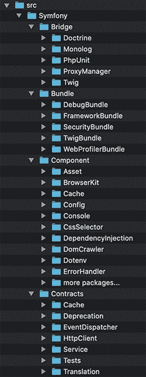
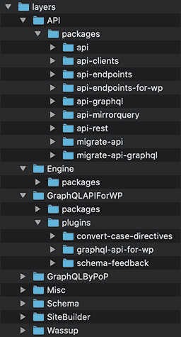
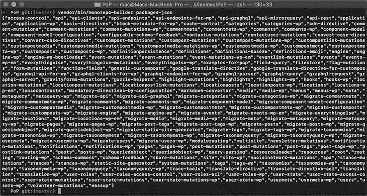
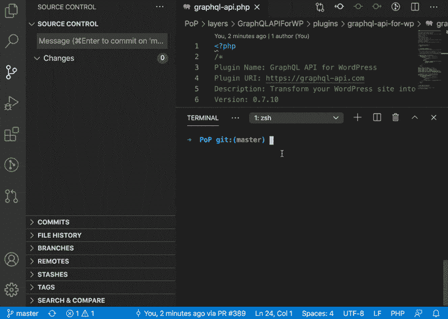

# 在 monorepo 中托管所有 PHP 包

> 原文：<https://blog.logrocket.com/hosting-all-your-php-packages-together-in-a-monorepo/>

当一个 PHP 项目变得庞大而复杂时，它就变得难以管理。

在这种情况下，我们将项目分割成独立的包，并使用 Composer 将所有包导入到项目中。然后，不同的功能可以由不同的团队实现和维护，也可以由其他项目重用。

Composer 使用 [Packagist](https://packagist.org/) 注册表来分发 PHP 包。Packagist 要求我们在发布新软件包时提供一个存储库 URL。

因此，将一个项目分割成包也会影响它们的托管方式:从托管整个代码的单个存储库到托管每个包的代码的多个存储库。

因此，我们已经解决了管理项目代码的问题，但代价是产生了一个新问题:现在我们必须管理代码的托管。

## 分散包托管的问题是

我们的包将被版本化，包的每个版本将依赖于另一个包的某个特定版本，而另一个包本身又依赖于另一个包的某个版本，等等。

这在为您的项目提交拉请求时会成为一个问题；很可能，您还需要修改某个包中的代码，因此您需要为该包创建一个新的分支，并在您的`composer.json`中指向它。

然后，如果这个包依赖于其他也必须修改的包，您需要为它创建一个新的分支，并更新第一个包的`composer.json`来指向它。

如果这个包依赖于其他包，你就明白了。

然后，一旦您批准了 pull 请求，您需要撤销所有`composer.json`文件中的所有修改，以指向包的新发布版本。

这一切变得如此难以实现，以至于你很可能会完全停止使用特性分支并直接发布到`master`，这样你将无法跟踪跨包的变化。那么，如果将来您需要恢复更改，祝您好运，找到所有包中被修改的所有代码片段。

我们能做些什么呢？

## monorepo 简介

这就是 monorepo 拯救世界的地方。我们可以将所有的包托管在一个存储库中，而不是将我们的代码分布在多个存储库中。

monorepo 允许我们一起对所有的包进行版本控制，因此创建一个新的分支和提交一个 pull 请求将在一个地方完成，包括所有可能受它影响的包的代码。

然而，我们仍然受到 Packagist 的约束:出于分发的目的，每个包都需要存在于它自己的存储库之下。

我们现在要干嘛？

### 解决包装限制

解决方案是分离代码的开发和分发:

*   使用 monorepo 开发代码
*   使用多个存储库(每个包一个回购)来分发它(著名的“[只读]”回购)

然后，我们必须保持所有的源库和分布库同步。

当在 monorepo 中开发代码时，在一个新的 pull 请求被合并之后，每个包的新代码必须被复制到它自己的存储库中，从那里它可以被分发。

这被称为分割单一回购协议。

## 如何拆分单一回购协议

一个简单的解决方案是[使用`git subtree split`创建一个脚本](https://stackoverflow.com/questions/359424/detach-move-subdirectory-into-separate-git-repository/17864475#17864475)，然后将包代码同步到它自己的 repo 中。

一个更好的解决方案是使用一个工具来完成这项工作，这样我们就可以避免手动操作。有几种工具可供选择:

由此，我选择使用 Monorepo builder，因为它是用 PHP 编写的，所以我可以用自定义功能来扩展它。(相比之下，`splitsh/lite`是用 Go 写的，`dflydev/git-subsplit`是 Bash 脚本。)

> **注意**，Monorepo builder 仅适用于 PHP 包。如果您需要管理 JavaScript 包或其他任何东西，您必须使用另一个工具。

## 组织单一回购结构

您必须创建一个结构来组织 monorepo 中的代码。在最简单的情况下，您可以有一个根`packages/`文件夹，并将每个包添加到它自己的子文件夹中。

如果您的代码更复杂，不仅包含包，还包含束、合同或其他内容，那么您可以创建一个多级结构。

例如，Symfony 在其 monorepo `[symfony/symfony](https://github.com/symfony/symfony)`中使用了以下结构:



Symfony monorepo structure

就我自己而言，我最近才建立了一个 monorepo 来托管我所有的项目。(原因是我有一个潜在的贡献者，他不能设法建立开发环境，所以他离开了😢。)

我的整个项目包含多个层次:WordPress 的 GraphQL API 插件位于服务器[之上，GraphQL by PoP](https://graphql-by-pop.com) 位于框架[之上。](https://github.com/leoloso/PoP)

虽然这些是相关的，但它们也是独立的:我们可以使用 PoP 来驱动其他应用程序，而不仅仅是 GraphQL by PoPPoP 的 GraphQL 可以支持任何 CMS，而不仅仅是 WordPress。

因此，我决定将这些视为“层”，其中每一层[可能会看到并使用另一层，但其他层](https://github.com/leoloso/PoP#dependency-graph)不会。

在创建 monorepo 结构时，我复制了这个想法，将代码分两个层次:首先是`layers/`，然后是`packages/`(对于一个特定的情况，还有`plugins/`):



PoP monorepo structure

我没有创建一个新的库，而是决定重用来自 PoP 的库，在 [`leoloso/PoP`](https://github.com/leoloso/PoP) 下，因为它是整个代码的基础(也因为我不想失去它被赋予的星星😁).

一旦定义了 monorepo 结构，就可以从每个包的存储库中迁移代码。

## 导入代码，包括 Git 历史

如果您从头开始 monorepo，您可以运行 [`monorepo-builder init`](https://github.com/symplify/monorepo-builder#0-are-you-new-to-monorepo) 来设置它，并为您的每个新包创建一个新的存储库。否则，如果您已经在它们自己的存储库中开发了您的包，您将需要把它们移植到 monorepo。

最有可能的情况是，在迁移包时，您还会希望移植它们的 Git 历史和提交散列，以便将它们作为文档来浏览，并跟踪谁做了什么，什么时候做的，以及为什么做。

Monorepo builder 不会帮助您完成这项任务。因此，您需要使用另一个工具:

在您迁移了代码之后，您可以开始使用 Monorepo builder 来管理它，正如其自述文件中所解释的那样。

## 单一的`composer.json`来统治他们所有人

每个 PHP 包都有自己的`composer.json`文件，定义了它的依赖关系。

monorepo 也有自己的`composer.json`文件，包含所有 PHP 包的所有依赖项。这样，我们可以通过从 monorepo 根执行一个命令，对所有包中的所有代码运行 PHPUnit 测试、PHPStan 静态分析或任何其他东西。

为此，PHP 包必须包含相同依赖项的相同版本！那么如果 A 包要求 PHPUnit 7.5，B 包要求 PHPUnit 9.3，就不行了。

Monorepo builder 提供了以下命令:

*   `monorepo-builder validate`检查所有`composer.json`中的依赖关系是否不冲突
*   `monorepo-builder merge`从所有`composer.json`中提取所有依赖项(和其他信息),并将它们合并到 monorepo 自己的`composer.json`中

我花了一点时间才意识到，你不能手动编辑根目录`composer.json`！由于该文件是自动生成的，如果没有通过工具的配置文件添加，您可能会丢失自定义更改。

有趣的是，处理 Monorepo 构建器本身就是这种情况。要在您的项目中安装这个库，您可以像往常一样在 monorepo 根目录中运行`composer require symplify/monorepo-builder --dev`。但是紧接着，您应该[在配置文件](https://github.com/leoloso/PoP/blob/18712eb48d8002baf1fbf457cd61caa6f13115a0/composer.json#L35) [`monorepo-builder.php`](https://github.com/leoloso/PoP/blob/ba20f72ef087f743962bb315003022924bf60a8c/monorepo-builder.php#L69:L72) 中重新创建依赖关系:

```
return static function (ContainerConfigurator $containerConfigurator): void {
  $parameters = $containerConfigurator->parameters();
  $parameters->set(Option::DATA_TO_APPEND, [
    'require-dev' => [
      'symplify/monorepo-builder' => '^9.0',
    ]
  ]);
}

```

## 分割单一报告

因此，您已经合并了一个拉取请求。现在是时候将新代码同步到包存储库中了。这就叫分裂。

如果您在 GitHub 上托管您的 monorepo，您可以创建一个在`master`(或`main`)分支的`push`事件上触发的动作来执行 Monorepo Split 的 [GitHub 动作，指示哪个是源包目录，以及要将内容复制到哪个存储库:](https://github.com/symplify/monorepo-split-github-action)

```
name: 'Monorepo Split'

on:
  push:
    branches:
      - master

jobs:
  monorepo_split_test:
    runs-on: ubuntu-latest

    steps:
      - uses: actions/[email protected]
        with:
          fetch-depth: 0

      - uses: "symplify/[email protected]"
        env:
          GITHUB_TOKEN: ${{ secrets.ACCESS_TOKEN }}
        with:
          # ↓ split "packages/your-package-name" directory
          package-directory: 'packages/your-package-name'

          # ↓ into https://github.com/your-organization/your-package-name repository
          split-repository-organization: 'your-organization'
          split-repository-name: 'your-package-name'

          # ↓ the user signed under the split commit
          user-name: "your-github-username"
          user-email: "[email protected]"

```

为了让这个工作，你还需要创建一个新的访问令牌，作用域为“回购”和“工作流”，如这里的所解释的[，并在秘密`ACCESS_TOKEN`下设置这个令牌，如这里的](https://docs.github.com/en/github/authenticating-to-github/creating-a-personal-access-token)所解释的[。](https://docs.github.com/en/actions/reference/encrypted-secrets)

上面的例子适用于分割单个包。我们如何设法分割多个包？我们必须为它们中的每一个声明一个工作流吗？

当然不是。GitHub 动作支持[定义不同作业配置的矩阵](https://docs.github.com/en/actions/reference/workflow-syntax-for-github-actions#jobsjob_idstrategymatrix)。因此，我们可以定义一个矩阵来并行启动许多 runner 实例，每个包一个 runner 来拆分:

```
jobs:
  provide_packages_json:
    runs-on: ubuntu-latest

    steps:
      - uses: actions/[email protected]

      - uses: shivammathur/[email protected]
        with:
          php-version: 7.4
          coverage: none

      - uses: "ramsey/[email protected]"

      # get package json list
      - id: output_data
        run: echo "::set-output name=matrix::$(vendor/bin/monorepo-builder packages-json)"

    outputs:
      matrix: ${{ steps.output_data.outputs.matrix }}

  split_monorepo:
    needs: provide_packages_json

    runs-on: ubuntu-latest
    strategy:
      fail-fast: false
      matrix:
        package: ${{fromJson(needs.provide_packages_json.outputs.matrix)}}

    steps:
      - uses: actions/[email protected]

      - name: Monorepo Split of ${{ matrix.package }}
        uses: symplify/[email protected]
        env:
          GITHUB_TOKEN: ${{ secrets.ACCESS_TOKEN }}
        with:
          package-directory: 'packages/${{ matrix.package }}'
          split-repository-organization: 'your-organization'
          split-repository-name: '${{ matrix.package }}'
          user-name: "your-github-username"
          user-email: "[email protected]"

```

现在，包名不再是硬编码，而是来自母体(“现实是，勺子不存在”)。

此外，由于包列表是通过`monorepo-builder.php`配置文件提供的，我们可以从那里提取它。这是通过执行命令`vendor/bin/monorepo-builder packages-json`完成的，它产生一个包含所有包的字符串化的 JSON 输出:



Retrieving the list of packages.

## 发布新版本(针对所有软件包)

monorepo 通过对所有包一起进行版本控制来保持简单，对所有包使用相同的版本。因此，版本为 0.7 的包 A 将依赖于版本为 0.7 的包 B，依此类推。

这意味着我们将标记包，即使包中的代码没有改变。例如，如果包 A 已被修改，它将被标记为 0.7，但包 B 也是如此，即使它不包含任何修改。

Monorepo builder 使标记所有包变得非常容易。我们首先需要有一个[工作流来在标记了](https://github.com/leoloso/PoP/blob/c090d436b9558b877d3dea8fa3398a1a782757a7/.github/workflows/split_monorepo_tagged.yaml)的时候分割 monorepo(基本上与上面的工作流相同，加上[将标记传递给](https://github.com/leoloso/PoP/blob/c090d436b9558b877d3dea8fa3398a1a782757a7/.github/workflows/split_monorepo_tagged.yaml#L73) `symplify/github-action-monorepo-split`)。

然后，我们通过[运行命令](https://github.com/symplify/monorepo-builder#6-release-flow)将 monorepo 标记为版本`0.7`:

```
vendor/bin/monorepo-builder release "0.7" 
```

执行这个命令真的很神奇。它首先发布用于生产的代码:

*   将包之间的相互依赖提升到`0.7`
*   用`0.7`标记 monorepo
*   用标签`0.7`做一个`git push`

然后，它将代码还原用于开发:

*   将所有包中`dev-master`的分支别名更新为`0.8-dev`
*   将相互依赖提升到`0.8-dev`
*   做一个`git push`

观看它的实际操作一直让我着迷。检查在执行一个命令时，整个环境看起来是如何自生自灭的:



## 从包中删除工作流

即使我们在 monorepo 中为所有包运行 PHPUnit，我们可能仍然希望在每个包被分割后，在它自己的存储库中对每个包运行 PHPUnit，即使只是为了显示一个成功徽章。

然而，我们不能再这样下去了。或者至少不那么容易。

事实上，所有的包都被一起版本化并同时发布，并且每个包的新版本需要一点时间才能在 Packagist 上可用——比如说五分钟——这意味着在运行`composer install`时依赖项可能不可用，导致 PHPUnit 工作流失败。

例如，如果包 A 依赖于包 B，用版本 0.3 标记它们意味着包 A 的版本 0.3 将依赖于包 B 的版本 0.3。但是，由于两者同时被拆分和标记，当包 A 运行一个由推送到`master`触发的动作时，包 B 的 0.3 版本还不可用，工作流会失败。

总之:您将需要从每个包的存储库中删除运行这些工作流，并且只依赖 monorepo 中的工作流。

或者，如果你真的想要那个成功徽章，为它找一些窍门(比如延迟 10 分钟工作流的执行)。

## 结论

monorepo 有助于管理大型代码库的复杂性。它使得维护整个项目的一致快照或状态变得容易，允许提交一个包含来自多个包的代码的 pull 请求，并且欢迎第一次的贡献者来设置项目而不打嗝。

所有这些特征也可以通过使用大量的存储库来获得，但是在实践中，它们很难执行。

单一回购协议本身必须得到管理。关于 PHP 包，我们可以通过 Monorepo builder 库来实现。在本文中，我们学习了如何设置这个工具，配置它，并使用它发布我们的包。

## 使用 [LogRocket](https://lp.logrocket.com/blg/signup) 消除传统错误报告的干扰

[](https://lp.logrocket.com/blg/signup)

[LogRocket](https://lp.logrocket.com/blg/signup) 是一个数字体验分析解决方案，它可以保护您免受数百个假阳性错误警报的影响，只针对几个真正重要的项目。LogRocket 会告诉您应用程序中实际影响用户的最具影响力的 bug 和 UX 问题。

然后，使用具有深层技术遥测的会话重放来确切地查看用户看到了什么以及是什么导致了问题，就像你在他们身后看一样。

LogRocket 自动聚合客户端错误、JS 异常、前端性能指标和用户交互。然后 LogRocket 使用机器学习来告诉你哪些问题正在影响大多数用户，并提供你需要修复它的上下文。

关注重要的 bug—[今天就试试 LogRocket】。](https://lp.logrocket.com/blg/signup-issue-free)