# 如何将 Firebase 添加到您的 Unity 项目

> 原文：<https://blog.logrocket.com/how-add-firebase-unity-project/>

在 Unity 内部开发游戏很有趣，但当涉及到创建后端系统时，这是一种痛苦。这是因为开发人员必须离开 Unity 游戏引擎，并转移到一个全新的开发环境来创建后端数据库和 API 端点。将此与身份验证、存储、托管、分析和测试基础架构相结合，您会发现自己陷入了一个深深的兔子洞。

为了防止这种情况，Firebase 将所有这些不同的后端服务捆绑在一个地方。它是由谷歌开发的，很容易用 Unity 设置。

在本文中，您将学习如何创建一个 Firebase 项目，将其与 Unity 集成，并使用 Firebase 执行 CRUD 操作。

## Unity 项目设置

如果你还没有这样做，创建一个新的 Unity 3D 项目，并将其命名为 **Hello Firebase** 。

你可以在电脑上启动 Unity Hub，点击**新建项目**来完成。


点击**新建项目**后，弹出如下窗口。要确保我们创建的是 3D 项目，请完成以下步骤:

1.  从模板中选择 **3D**
2.  将**项目名称**从**我的项目**更新为 **Hello Firebase**
3.  点击**创建项目**按钮

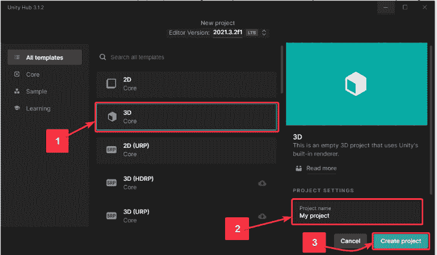

该项目将需要几分钟时间在 Unity 中打开。

保持项目开放，让我们开始配置 Firebase。

## 如何在 Firebase 控制台中设置 Firebase 项目

在浏览器中打开 [Firebase 控制台](https://console.firebase.google.com)。点击**添加项目**。

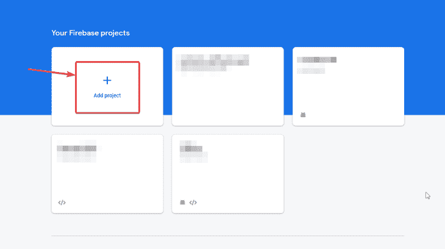

给项目命名 **HelloFirebaseUnity** (由你决定)。

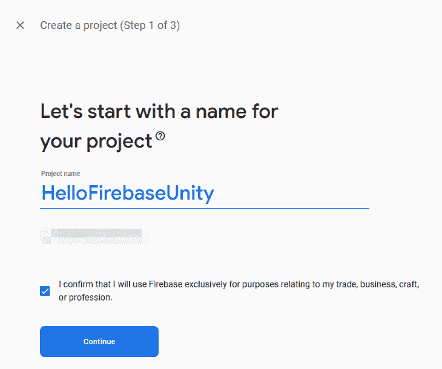

保持谷歌分析*禁用*。你不需要谷歌分析来学习 Firebase。如果需要，我们可以随时从 Firebase 控制台将其添加到同一个项目中。

点击**创建项目**,等待项目创建完成。

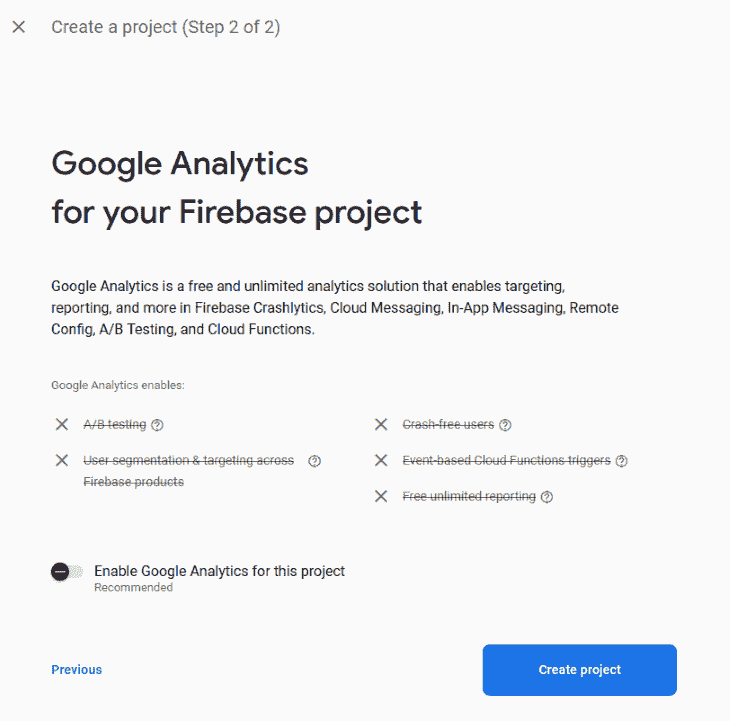

一旦项目准备就绪，您的项目控制台将会打开。点击项目概述页面中的 Unity 徽标。

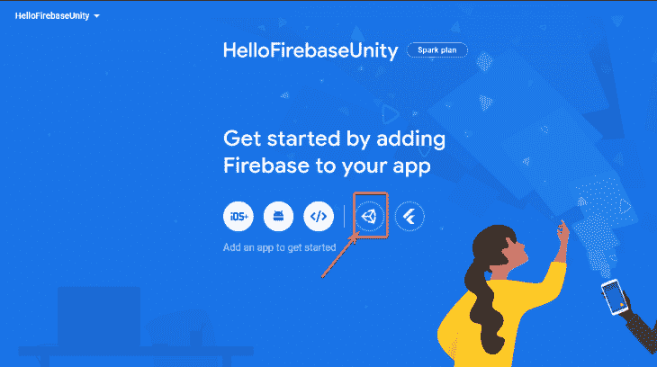

然后，输入您的包名。这个可以在 **HelloFirebase** Unity 项目中找到(在**文件** > **下构建设置** > **平台** > **其他设置** > **包名**)。您可以覆盖此设置，并将其更改为以下格式的任何内容:*com . your company . your project name*。

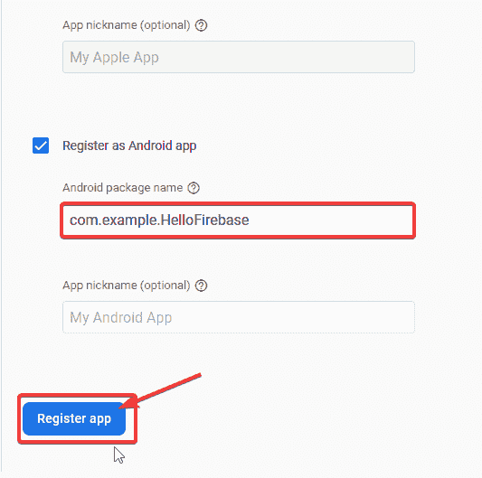

下载`google-services.json`文件并把它放在你的 HelloFirebase Unity 项目的 **Assets** 文件夹中。

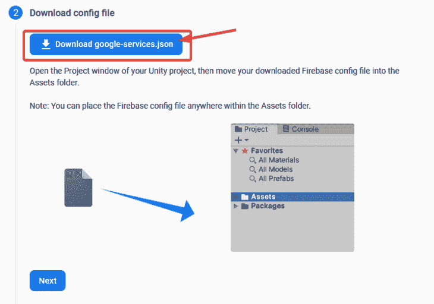

下载 [Firebase Unity SDK](https://firebase.google.com/download/unity?authuser=0&hl=en) 并将其解压缩到本地机器的任意位置。

在解压后的文件夹内进入**firebase _ unity _ SDK**>**dot net 4**>双击**firebase database . unity package**。它将在您的 Unity 项目中打开此弹出窗口。点击**导入**。如果您在控制台中看到任何错误，只需点击**清除**。

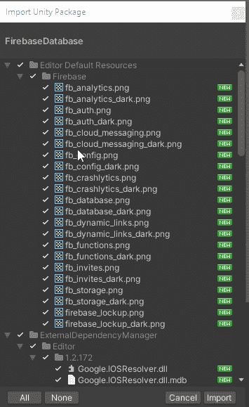

至此，您已经完成了配置 Firebase 项目和向 Firebase 注册在 Unity 中开发的应用程序所需的所有步骤。

为了创建数据库，请转到项目的 Firebase 控制台。从左侧菜单中，点击**实时数据库**。

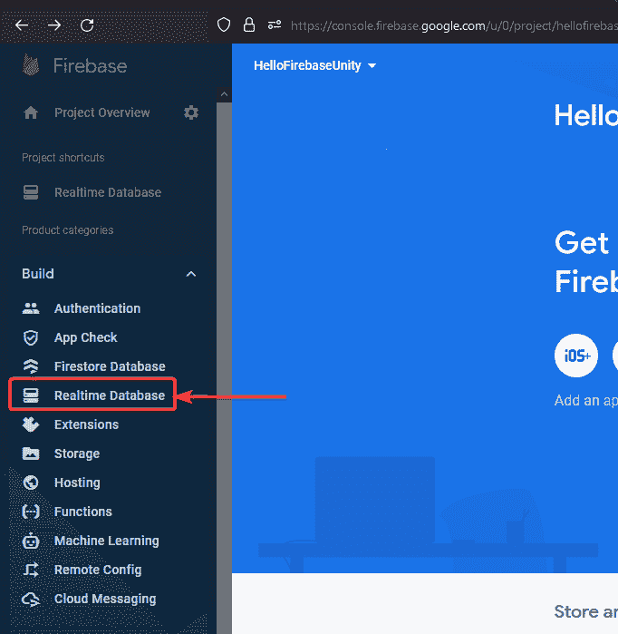

点击**创建数据库**。

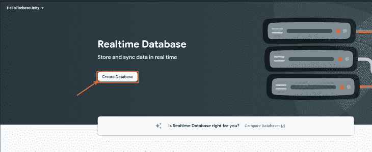

选择**实时数据库位置**为**美国**。点击**下一个**。

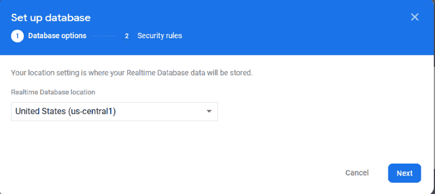

选择**测试模式**。点击**启用**。

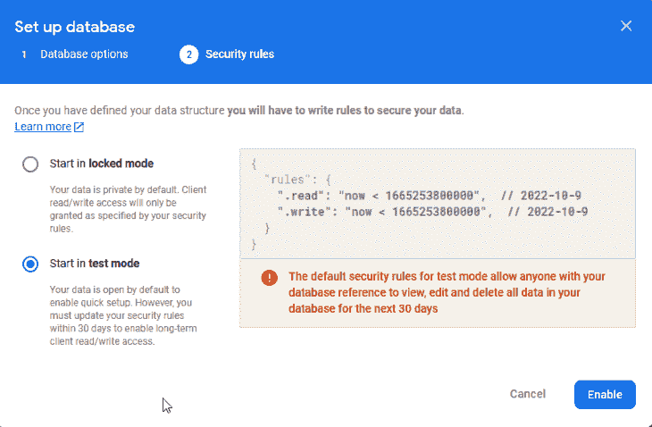

请注意，在生产过程中，永远不要让数据库处于**测试模式**。这是非常不安全的，因为任何人都可以对您的数据库进行更改。如果你在周围做实验或者随便做一些研究，那么**测试模式**是完全可以接受的。

## 如何在 Firebase 中组织数据

在进入脚本和代码之前，让我们花一点时间来理解 Firebase 如何在实时数据库中存储数据。

实时数据库如此命名是因为它实时存储和同步数据。这意味着，如果数据在一个地方被更改或更新，它会在所有连接的设备中立即得到更新，而无需从客户端向服务器发出新的请求。这不是很好吗？所有安装了您的应用的设备都会在几毫秒内同步任何更新的数据。

所有这些数据都以 JSON 格式存储。JSON 是存储和传输数据的标准格式。这些数据是以键值对的形式存在的。看起来是这样的:

```
{
      "users" : {
            "user_id_1" : {"name": "John Doe", "score":"100"},  
        "user_id_2" : {"name": "Jane Doe", "score": "500"}
       }
}
```

上述数据可解读如下:

*   无名氏是个使用者。他得了 100 分
*   无名氏是个瘾君子。她得了 500 分

有几种方法来表示数据。你可以用完全不同的方式来表现我上面展示的数据。

## 如何使用 Unity 在 Firebase 中执行 CRUD 操作

CRUD 代表:

*   创造
*   阅读
*   更新
*   删除

这些是标准操作，可以通过编程方式或从 Firebase 控制台手动在所有数据库上执行。我们将在下面看看这两种方式。

让我们来一个一个地学习如何执行这些操作。

## 如何在 Firebase 中创建数据库

### 用手

从 **Firebase 控制台** > **你的项目** > **实时数据库**点击加号图标。

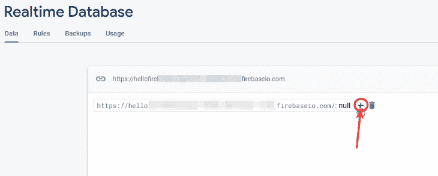

然后，添加**用户**作为键。然后，单击加号图标。

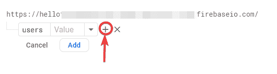

然后添加 **user_id_1** 作为键，添加 **John Doe** 作为值。点击**添加**。这是**用户**的子用户。我以 **user_id_1** 为例。理想情况下， **user_id_1** 应该以编程方式生成。它可以是设备的唯一标识号或任何其他唯一的字符串。

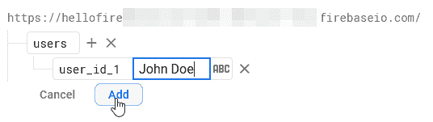

这个数据库是手动创建的，但当你有自己的游戏或应用程序的用户时，你不能遵循相同的过程。

想想看:如果你的游戏很受欢迎，有一百万用户，你真的会坐下来输入一百万个名字和用户 id 吗？当然不是！

因此，让我们看看如何以编程方式实现这一点。

### 程序化

要以编程方式创建上述相同的数据库:

打开你的 Unity 项目。

创建一个空的游戏对象(右键点击**层级**面板> **创建空的**)。如果你在检查面板中检查这个游戏对象的属性，它不会有任何东西。这就是为什么它是一个空的对象。

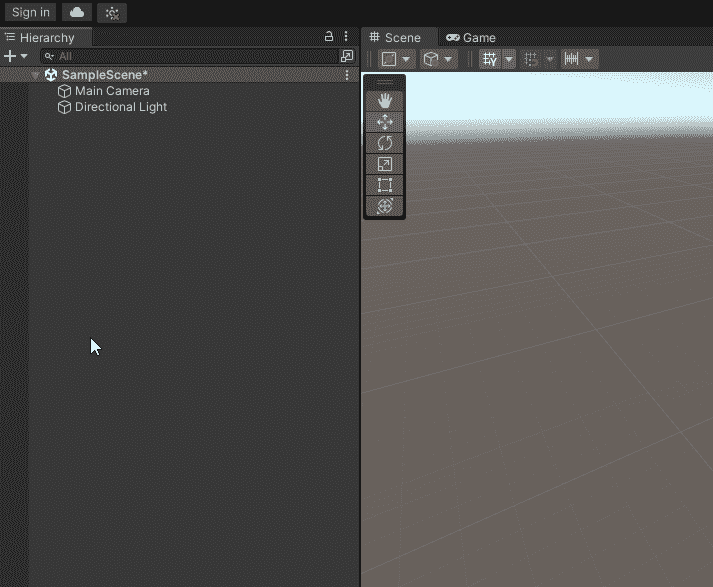

将空的**游戏对象**重命名为 **FirebaseDatabaseManager** 。然后点击**添加组件** > **新建脚本** >将脚本命名为**FirebaseDatabaseManager**>**创建并添加**。

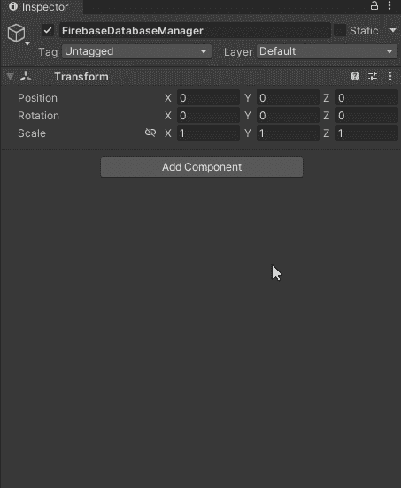

双击在 Visual Studio 中打开`FirebaseDatabaseManager.cs`脚本。

用这段代码替换掉所有东西(稍后的代码我们会明白其中的逻辑)。保存文件(CTRL + S)很重要。否则，它不会反映您对`FirebaseDatabaseManager.cs`脚本所做的更改:

```
using Firebase.Database;
using System.Collections;
using System.Collections.Generic;
using UnityEngine;

public class FirebaseDatabaseManager : MonoBehaviour
{
    string userId;
    DatabaseReference reference;

    void Start()
    {
        userId = SystemInfo.deviceUniqueIdentifier;
        reference = FirebaseDatabase.DefaultInstance.RootReference;
        CreateNewUser();
    }

    public void CreateNewUser()
    {
        reference.Child("users").Child(userId).SetValueAsync("John Doe");
        Debug.Log("New User Created");
    }
}
```

跳回 Unity 编辑器，点击**播放**按钮，然后查看控制台。您应该看到`New User Created`没有错误消息。

现在进入 Firebase 控制台>**你的项目** > **实时数据库**。您将看到一个密钥(您设备的密钥),其值为创建的`John Doe`。


好吧！让我们来理解代码:

1.  `userId`存储设备(应用程序在其中运行)的唯一识别码
2.  存储 Firebase 实时数据库的根目录
3.  `CreateNewUser()`只是一个方法调用。在里面，
    *   我们正在遍历 JSON 树。所以我们从根开始，创建一个名为`users`的子节点。然后我们创建另一个名为`system_user_id`的孩子，并将其值设为`John Doe`
    *   然后我添加了一个简单的 print 语句用于调试。类似这样的消息有助于开发人员理解这个方法确实被执行了

太好了。您可以将数据写入数据库。

您的数据库有用户名，但没有分数。如果你还记得的话，我们想要这样组织我们的数据:

```
{
      "users" : {
            "user_id_1" : {"name": "John Doe", "score":"100"},  
            "user_id_2" : {"name": "Jane Doe", "score": "500"}
       }
}
```

那么我们该怎么做呢？尝试一次，然后向下滚动查看解决方案。

我们所要做的就是进入`FirebaseDatabaseManager.cs`脚本并向`CreateNewUser()`方法添加一行:

```
public void CreateNewUser()
{
        reference.Child("users")
            .Child(userId)
            .Child("name")
            .SetValueAsync("John Doe");

        reference.Child("users")
            .Child(userId)
            .Child("score")
            .SetValueAsync(100);

        Debug.Log("New User Created");
}
```

点击播放按钮，回到你的 Firebase 控制台。如果一切顺利，您将会看到:

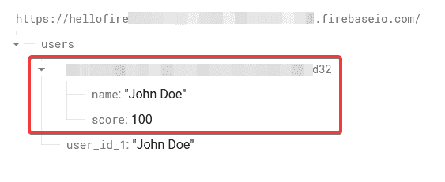

厉害！我们在 Unity 中使用 C#脚本在 Firebase 实时数据库中创建数据。

## 如何读取数据库

转到您的`FirebaseDatabaseManager.cs`脚本。

注释掉`CreateNewUser()`,因为我们不再需要调用它。

创建另一个方法`ReadDatabase()` 并在`Start`方法中调用它，如下所示:

```
 void Start()
    {
        userId = SystemInfo.deviceUniqueIdentifier;
        reference = FirebaseDatabase.DefaultInstance.RootReference;
        // CreateNewUser();
        ReadDatabase();
    }

public void ReadDatabase()
    {
        reference.Child("users")
                 .Child(userId)
                 .Child("name")
                 .GetValueAsync().ContinueWithOnMainThread(task => {
                    if (task.IsFaulted)
                        {
                             Debug.Log(task.Exception.Message);
                        }
                        else if (task.IsCompleted)
                        {
                            DataSnapshot snapshot = task.Result;
                            Debug.Log("Name=" + snapshot.Value);
                        }
                   });
    }
```

返回 Unity 编辑器。点击播放按钮。您将在控制台上看到`Name=John Doe`消息。

在上面的代码中，`DataSnapshot`是您选择在 JSON 树中遍历的路径上的键值对或子数据的快照。如果没有数据，就会得到 null。

## 如何更新数据库

更新数据库仅仅意味着:

1.  如果数据库中已经有匹配的记录，那么它的值应该被改变
2.  如果数据库中没有匹配的记录，那么场景就和我们前面看到的创建数据库一样

您可以在[如何在 Firebase](#how-to-create-a-database-in-firebase) 部分中尝试相同的代码。只是用你自己的名字代替**约翰·多伊**。它会自动找到一个带有您的系统 ID 的孩子，并更新该项的值。

## 如何删除数据库

转到您的`FirebaseDatabaseManager.cs`脚本。

注释掉`CreateNewUser()`,因为我们不再需要调用它。

创建另一个方法`RemoveUserWithUserID()`并在`Start`方法中调用它，如下所示:

```
void Start()
{
        userId = SystemInfo.deviceUniqueIdentifier;
        reference = FirebaseDatabase.DefaultInstance.RootReference;
        // CreateNewUser();

        RemoveUserWithUserID();
}

public void RemoveUserWithUserID()
{
        reference.Child("users")
            .Child(userId)
            .RemoveValueAsync(); 

        Debug.Log("User removed");
}

```

返回 Unity 编辑器。点击播放按钮。您将在控制台中看到打印的`User removed`消息。

然后去你的`FirebaseConsole`。您将看到具有您的系统 ID 的孩子已从数据库中成功删除。

## 结论

厉害！您刚刚在 Unity 中创建了一个 C#脚本来与 Firebase 实时数据库通信。请随意探索 Firebase 的其他惊人特性。

如果你面临任何问题或需要一些帮助，请在 [Twitter](https://twitter.com/knightcube) 或 [LinkedIn](https://linkedin.com/in/knightcube) 上 ping 我，如果你正在寻找更多 3D 或 AR/VR 相关资源，请查看我的 [Gumroad 页面](https://knightcube.gumroad.com)或 [YouTube 频道](youtube.com/knightcubexr?sub_confirmation=1)。

## 使用 [LogRocket](https://lp.logrocket.com/blg/signup) 消除传统错误报告的干扰

[](https://lp.logrocket.com/blg/signup)

[LogRocket](https://lp.logrocket.com/blg/signup) 是一个数字体验分析解决方案，它可以保护您免受数百个假阳性错误警报的影响，只针对几个真正重要的项目。LogRocket 会告诉您应用程序中实际影响用户的最具影响力的 bug 和 UX 问题。

然后，使用具有深层技术遥测的会话重放来确切地查看用户看到了什么以及是什么导致了问题，就像你在他们身后看一样。

LogRocket 自动聚合客户端错误、JS 异常、前端性能指标和用户交互。然后 LogRocket 使用机器学习来告诉你哪些问题正在影响大多数用户，并提供你需要修复它的上下文。

关注重要的 bug—[今天就试试 LogRocket】。](https://lp.logrocket.com/blg/signup-issue-free)