# 如何在 Flutter 中添加 ListTile:带示例的教程

> 原文：<https://blog.logrocket.com/how-add-list-tile-flutter/>

在开发的大部分时间里，您可能会发现自己在用某种预定义的格式填充 ListView。您可以使用 [Flutter](https://blog.logrocket.com/tag/flutter/) 中的现成小部件 [ListTile](https://api.flutter.dev/flutter/material/ListTile-class.html) 来帮助创建这个布局，而不是使用行、列和容器。

在本教程中，我将通过一些实际例子向您展示如何在 Flutter 应用程序中添加 ListTile 小部件。

以下是我们今天要讲的内容:

## 什么是 ListTile？

Flutter 中的 ListTile 小部件是一个显示相关信息的 UI 元素。

它遵循材料设计的[列表](https://material.io/components/lists)规范。典型的列表分为三个部分；开始、居中和结束。开始部分包含前导小部件；中间部分包含标题和副标题，结尾部分包含尾随小部件。

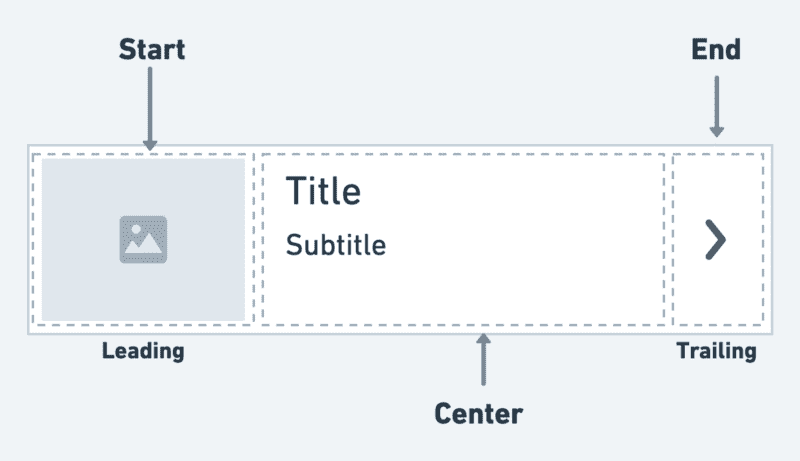

它主要用于填充可滚动视图，如 ListView、Column 和 Row。例如，您可以使用列表框来显示待办事项、电子邮件、导航选项等的列表。您也可以通过点击列表框来接收点击事件。

如果你是视觉学习者，看看这个快速视频教程:

 [https://www.youtube.com/embed/l8dj0yPBvgQ?version=3&rel=1&showsearch=0&showinfo=1&iv_load_policy=1&fs=1&hl=en-US&autohide=2&wmode=transparent](https://www.youtube.com/embed/l8dj0yPBvgQ?version=3&rel=1&showsearch=0&showinfo=1&iv_load_policy=1&fs=1&hl=en-US&autohide=2&wmode=transparent)

视频

### 添加列表文件

下面是在 ListView 小部件中显示 ListTile 的最少代码:

```
ListView(
  children: const [
    ListTile(
      leading: Icon(Icons.car_rental),
      title: Text('Car'),
      trailing: Icon(Icons.more_vert),
    ),
    ListTile(
      leading: Icon(Icons.flight),
      title: Text('Flight'),
      trailing: Icon(Icons.more_vert),
    ),
    ListTile(
      leading: Icon(Icons.train),
      title: Text('Train'),
      trailing: Icon(Icons.more_vert),
    )
  ],
)

```

下面是代码如何转化为设计:

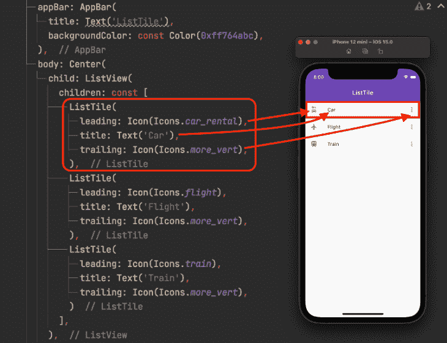

当您希望使用 ListTile 来填充可能来自后端的长列表时，可以将单个 ListTile 小部件包装在 ListView 中。生成器并显示 ListTile 中的数据，如以下代码所示:

```
final List<String> items = List<String>.generate(10000, (i) => '$i');
ListView.builder(
  itemCount: items.length,
  itemBuilder: (context, index) {
    return ListTile(
      leading: CircleAvatar(
        backgroundColor: const Color(0xff764abc),
        child: Text(items[index]),
      ),
      title: Text('Item ${items[index]}'),
      subtitle: Text('Item description'),
      trailing: Icon(Icons.more_vert),
    );
  },
)

```

输出:

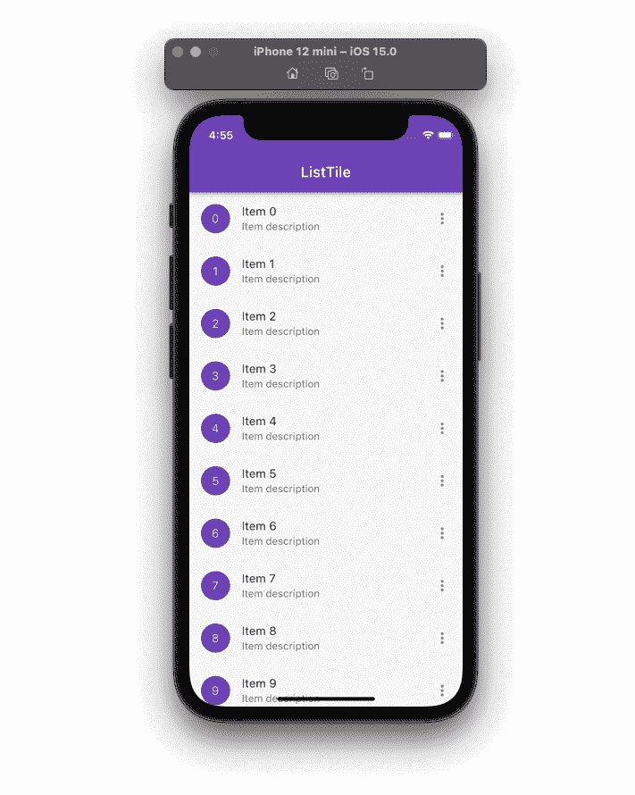

## 列表文件变体

还存在其他类型的 ListTile，允许您对其执行特定的操作。

这些是:

1.  复选框列表
2.  放射虫化石
3.  切换列表

### 复选框列表

[CheckboxListTile](https://api.flutter.dev/flutter/material/CheckboxListTile-class.html) 小部件是 ListTile 和 [Checkbox](https://api.flutter.dev/flutter/material/Checkbox-class.html) 小部件的组合。

您可以使用此小部件将任何项目标记为完成，例如；待办事项。默认情况下，复选框显示在列表框的右侧(对于从左到右的语言)。

下面是添加 CheckboxListTile 小部件的方法:

```
class Language {
  String name;
  bool isChecked;
  Language(this.name, {this.isChecked = false});
}
// 1.
final List<Language> languages = [Language('English'), Language('French'), Language('German')];
ListView.builder(
  itemCount: languages.length,
  itemBuilder: (context, index) {
    return CheckboxListTile(
      // 2.
      title: Text('${languages[index].name}'),
      // 3.
      value: languages[index].isChecked,
      // 4.
      onChanged: (bool? value) {
        setState(() {
          languages[index].isChecked = value!;
        });
      },
      // 5.
      secondary: const Icon(Icons.language),
    );
  },
)

```

代码块中数字的解释:

1.  保存语言列表的变量
2.  这将显示复选框标签
3.  这将决定是选中还是取消选中该项目
4.  当你点击列表文件时，这个函数被调用
5.  这是一个领先的图标

**输出**:

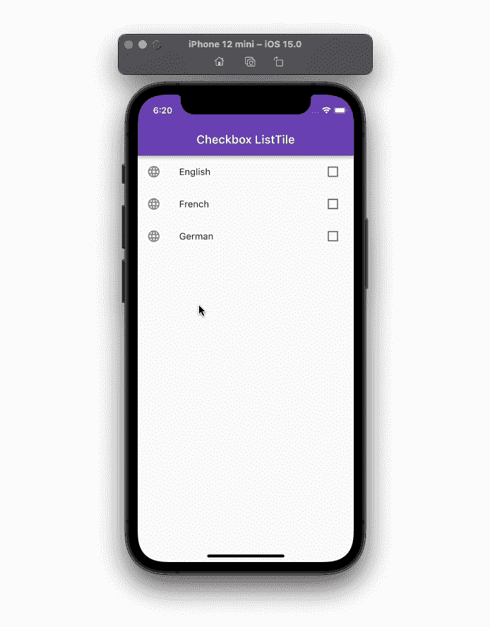

要交换次要(主要)小部件和复选框，可以使用`controlAffinity`属性并将其设置为`ListTileControlAffinity.leading`。

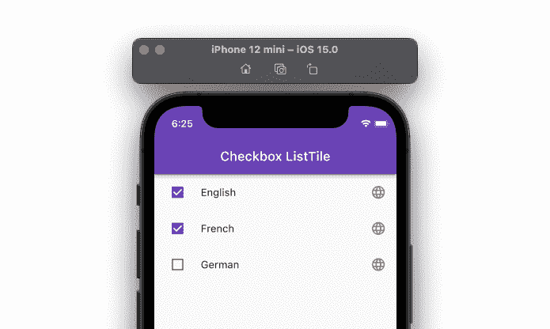

您还可以通过添加`checkboxShape`参数并将其设置为`RoundedRectangleBorder(borderRadius: BorderRadius.circular(20))`来更改复选框的形状。

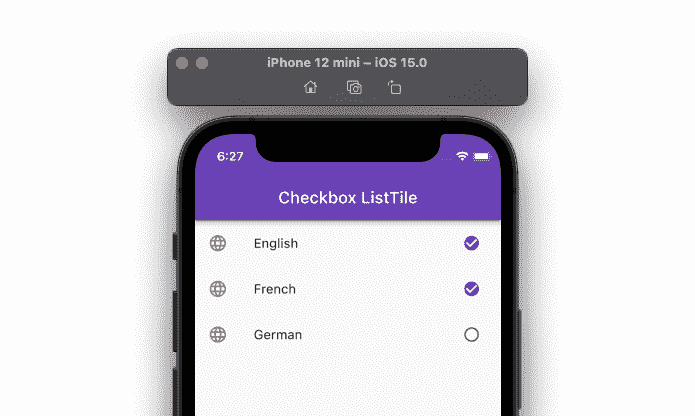

### 放射虫化石

[RadioListTile](https://api.flutter.dev/flutter/material/RadioListTile-class.html) 小部件是 ListTile 和 [RadioButton](https://api.flutter.dev/flutter/material/Radio-class.html) 小部件的组合——这个小部件用于从项目列表中选择一个选项。

以下是添加 RadioListTile 小部件的方法:

```
// 1.
enum Gender { male, female }
// 2.
Gender? _gender = Gender.male;
ListView(
  children: [
    // 3.
    RadioListTile<Gender>(
      secondary: Icon(Icons.male),
      controlAffinity: ListTileControlAffinity.trailing,
      title: const Text('Male'),
      // 4.
      value: Gender.male,
      // 5.
      groupValue: _gender,
      // 6.
      onChanged: (Gender? value) {
        setState(() {
          _gender = value;
        });
      },
    ),
    RadioListTile<Gender>(
      secondary: Icon(Icons.female),
      controlAffinity: ListTileControlAffinity.trailing,
      title: const Text('Female'),
      value: Gender.female,
      groupValue: _gender,
      onChanged: (Gender? value) {
        setState(() {
          _gender = value;
        });
      },
    ),
  ],
)

```

代码块中数字的解释:

1.  保存 [RadioListTile](https://api.flutter.dev/flutter/material/RadioListTile-class.html) 的所有选择值的枚举
2.  这将使用枚举保存默认选择
3.  添加枚举类型的放射性同位素
4.  将选择值分配给当前列表框。ListTile 代表这个值
5.  这用于显示当前选择的值
6.  当您切换单选按钮时，该选项将被调用

**输出:**

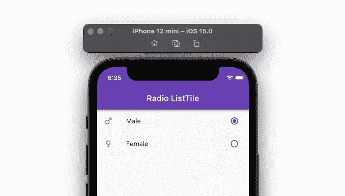

### 切换列表

[开关列表框](https://api.flutter.dev/flutter/material/SwitchListTile-class.html)小部件是列表框和[开关](https://api.flutter.dev/flutter/material/Switch-class.html)小部件的组合。

您可以使用这个小部件来构建允许用户打开或关闭应用程序设置的 UI 交互。

以下是添加 SwitchListTile 小部件的方法:

```
class Appliance {
  String name;
  bool isOn;
  Appliance(this.name, {this.isOn = false});
}
// 1.
final List<Appliance> appliances = [
  Appliance('TV'),
  Appliance('Fan'),
  Appliance('Refrigerator'),
];
ListView.builder(
  itemCount: appliances.length,
  itemBuilder: (context, index) {
    return SwitchListTile(
      // 2.
      title: Text('${appliances[index].name}'),
      // 3.
      value: appliances[index].isOn,
      // 4.
      onChanged: (bool value) {
        setState(() {
          appliances[index].isOn = value;
        });
      },
    );
  },
)

```

代码块中数字的解释:

1.  保存设备列表的变量
2.  这显示了列表文件的名称或标题
3.  这决定了是打开还是关闭开关
4.  当您拨动开关时，这被调用

**输出:**

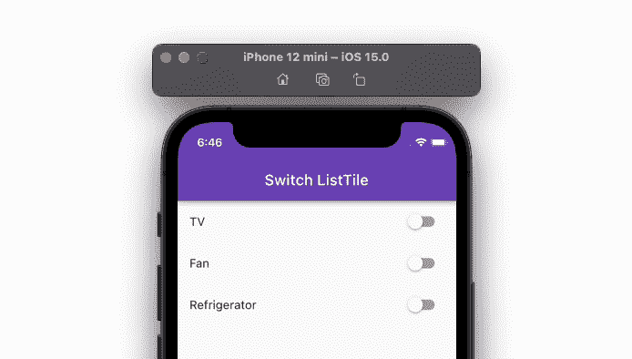

## 管理列表文件主题

主题是开发前端应用程序的一个重要方面。主题传达了你的品牌，如果不小心管理，你可能会浪费很多时间让所有的 UI 元素遵循相同的规则。

假设您想要更改 ListTile 的外观以匹配您的设计。你真的有以下两个选择:

1.  在小部件级别更改主题
2.  在应用程序级别更改主题

### 在小部件级别更改主题

您可以通过直接修改 ListTile 的属性(如颜色、形状和大小)来更改其外观。

以下是更改列表框的背景色、文本颜色和图标颜色的方法:

```
return ListTile(
  // 1.
  tileColor: Colors.redAccent,
  // 2.
  textColor: Colors.white,
  // 3.
  iconColor: Colors.white,
);

```

代码块中数字的解释:

1.  这将更改列表标题的背景颜色
2.  这将改变列表标题中所有文本的颜色
3.  这将改变列表标题中所有图标的颜色

### 在应用程序级别更改主题

您可能希望在所有应用程序页面中更改 ListTile 小部件的视觉美感。您可以通过定义`listTileTheme`并添加`ListTileThemeData`小部件来做到这一点。

在`ListTileThemeData`小部件中，您可以为项目中的所有 ListTile 小部件指定您想要更改的所有属性。

下面是代码示例:

```
return MaterialApp(
  title: 'Flutter Demo',
  debugShowCheckedModeBanner: false,
  theme: ThemeData(
    primarySwatch: Colors.blue,
    listTileTheme: ListTileThemeData(
      tileColor: Colors.redAccent,
      textColor: Colors.white,
      iconColor: Colors.white,
    ),
  ),
  home: MyHomePage(),
);

```

第一种和第二种方法产生相同的结果，如下所示:

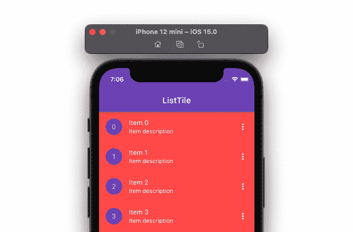

## 添加分隔线

添加分隔线有助于您清楚地区分项目，尤其是当项目在中间部分显示为三行时。

要在 ListTile 项目之间添加分隔线，请添加`ListView`小部件。在`ListView`中，添加带有 tiles 属性和 ListTiles 列表的`ListTile.divideTiles`。

代码示例:

```
ListView(
  children: ListTile.divideTiles(context: context, tiles: [
    ListTile(
      leading: Icon(Icons.car_rental),
      title: Text('Car'),
    ),
    ListTile(
      leading: Icon(Icons.flight),
      title: Text('Flight'),
    ),
    ListTile(
      leading: Icon(Icons.train),
      title: Text('Train'),
    ),
  ]).toList(),
)

```

输出:


如果你正在使用`ListView.Builder`，你可以用`ListView.separated`代替它，并添加返回除法器的`separatorBuilder`参数。

代码示例:

```
ListView.separated( // <-- SEE HERE
  itemCount: items.length,
  itemBuilder: (context, index) {
    return ListTile(
      leading: CircleAvatar(
        backgroundColor: const Color(0xff764abc),
        child: Text(items[index]),
      ),
      title: Text('Item ${items[index]}'),
      subtitle: Text('Item description'),
      trailing: Icon(Icons.more_vert),
    );
  },
  separatorBuilder: (context, index) { // <-- SEE HERE
    return Divider();
  },
)

```

输出:

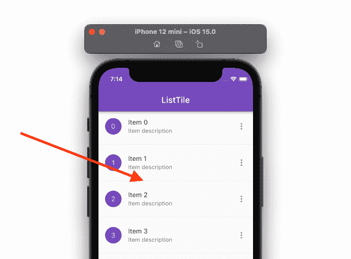

## 添加推送至解散行为

滑动到关闭功能允许您使用滑动手势从列表中移除特定的列表框。例如，您可以使用此功能从您的列表中删除一封电子邮件。

以下是步骤:

1.  将您的`ListTile`小部件包装在[可忽略的](https://api.flutter.dev/flutter/widgets/Dismissible-class.html)小部件中
2.  在可忽略的小部件中，添加`onDismissed`参数并注册一个回调。您可以在这里编写从列表中删除项目的逻辑

```
ListView.builder(
  itemCount: items.length,
  itemBuilder: (context, index) {
    return Dismissible( // Step 1
      key: Key(items[index]),
      onDismissed: (direction) { // Step 2
        setState(() {
          items.removeAt(index);
        });
        ScaffoldMessenger.of(context).showSnackBar(SnackBar(content: Text('${items[index]} dismissed')));
      },
      child: ListTile(
        //visualDensity: VisualDensity(vertical: 4),
        leading: CircleAvatar(
          backgroundColor: const Color(0xff764abc),
          child: Text(items[index]),
        ),
        title: Text('Item ${items[index]}'),
        subtitle: Text('Item description'),
        trailing: Icon(Icons.more_vert),
      ),
    );
  },
)
)
```

(注意:上面的代码只从 UI 中删除了 ListTile，您必须自己编写业务逻辑来从数据库中删除该项)

输出:

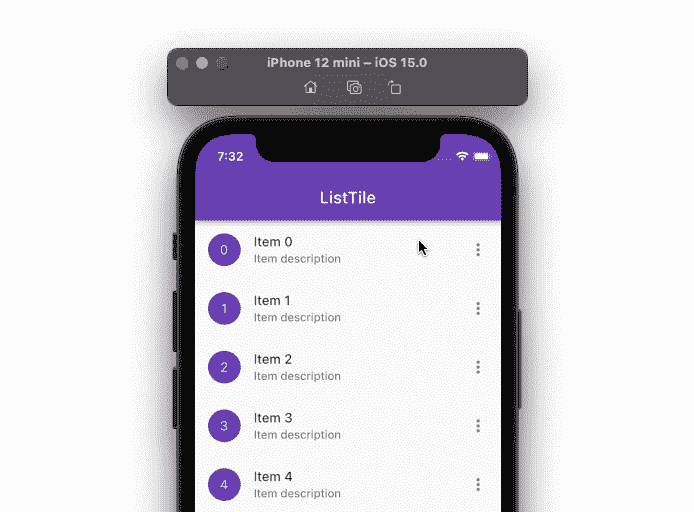

## 更改列表高度

有时，您可能希望在一定程度上调整列表框的高度。ListTile 小部件不直接支持 height 属性，因为它的尺寸受[材料设计规范](https://material.io/design/components/lists.html)的约束。因此，为了增加或减少 ListTile 的高度，可以使用`visualDensity`属性。

将`visualDensity`设置为正数将增加列表框的高度，而负数将减少高度。

(注意:可以设置的最大值和最小值是 4 和-4)

下面是代码示例:

```
ListTile(
  visualDensity: VisualDensity(vertical: 4), //<-- SEE HERE
  leading: CircleAvatar(
    backgroundColor: const Color(0xff764abc),
    child: Text(items[index]),
  ),
  title: Text('Item ${items[index]}'),
  subtitle: Text('Item description'),
  trailing: Icon(Icons.more_vert),
);

```

输出:

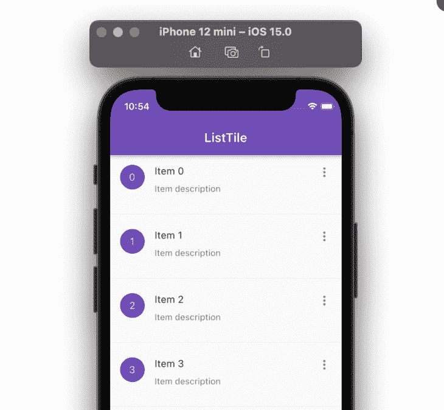

## 用户化

您可以利用可用的属性向 ListTile 添加各种自定义。例如，你可以改变它的颜色(在不同的状态，如悬停，按下等。)，形状，在标题和其他元素之间添加空格，改变其高度等。

通过导航到它的定义，可以看到它支持的所有属性。要查看所有属性，只需右键单击，然后“转到>定位”或“用法”。

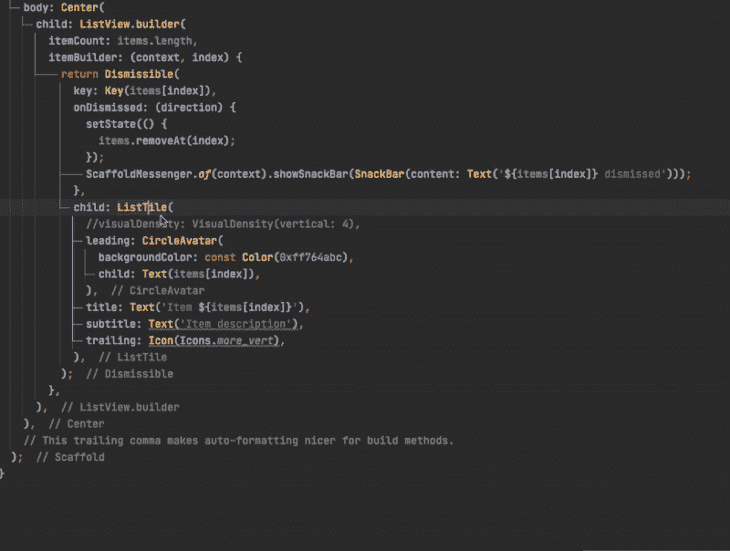

## 结论

添加 ListTile 小部件有助于提高应用程序开发速度。它遵循材料规范，涵盖了你展示一件有意义的物品所需的一切。

在本教程中，我们首先看了如何添加 ListTile，它的类型，以及如何管理主题，并涵盖了一些场景，如添加分隔线和滑动以消除功能，以及更改 ListTile 的高度，我希望所有这些都有助于您构建下一个列表。

## 使用 [LogRocket](https://lp.logrocket.com/blg/signup) 消除传统错误报告的干扰

[](https://lp.logrocket.com/blg/signup)

[LogRocket](https://lp.logrocket.com/blg/signup) 是一个数字体验分析解决方案，它可以保护您免受数百个假阳性错误警报的影响，只针对几个真正重要的项目。LogRocket 会告诉您应用程序中实际影响用户的最具影响力的 bug 和 UX 问题。

然后，使用具有深层技术遥测的会话重放来确切地查看用户看到了什么以及是什么导致了问题，就像你在他们身后看一样。

LogRocket 自动聚合客户端错误、JS 异常、前端性能指标和用户交互。然后 LogRocket 使用机器学习来告诉你哪些问题正在影响大多数用户，并提供你需要修复它的上下文。

关注重要的 bug—[今天就试试 LogRocket】。](https://lp.logrocket.com/blg/signup-issue-free)