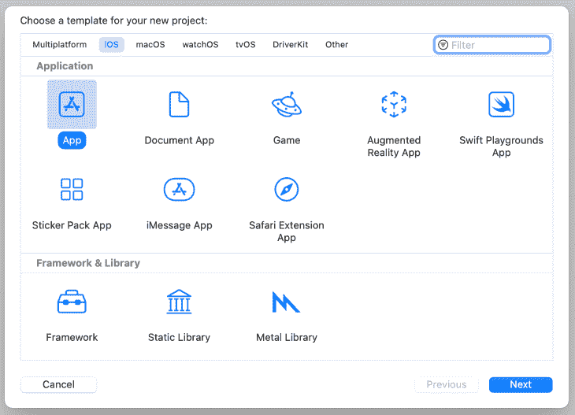
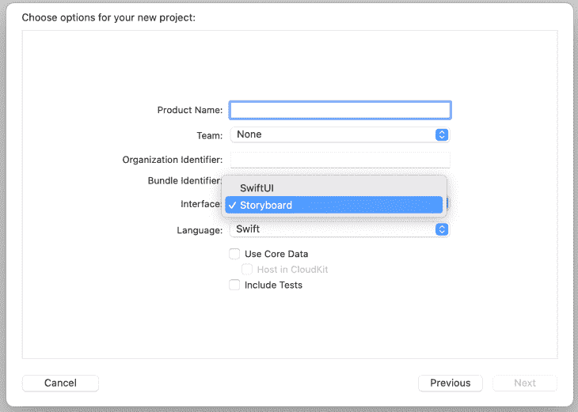
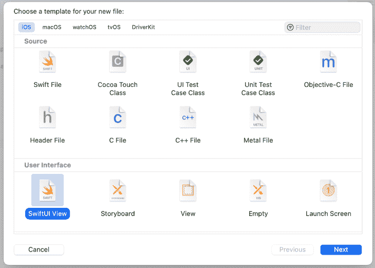
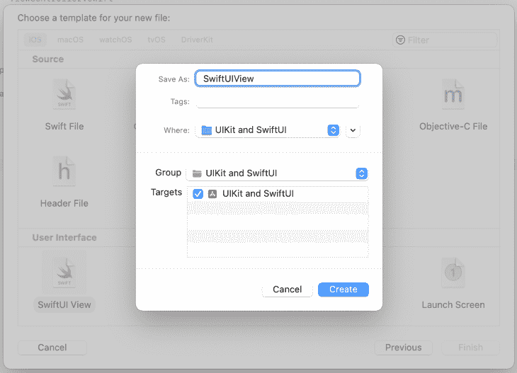
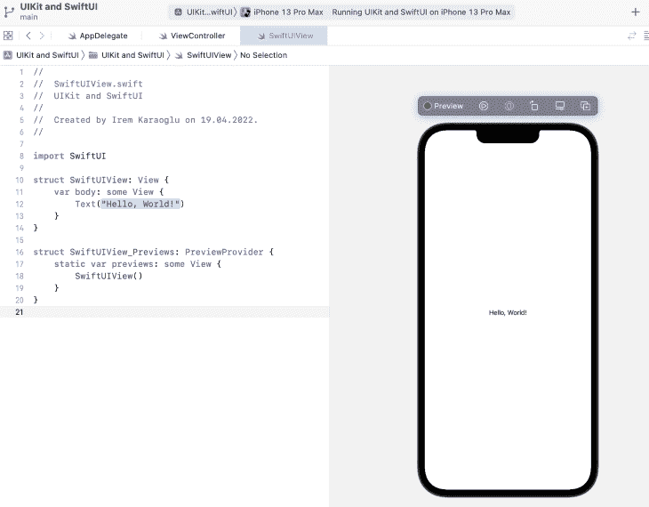
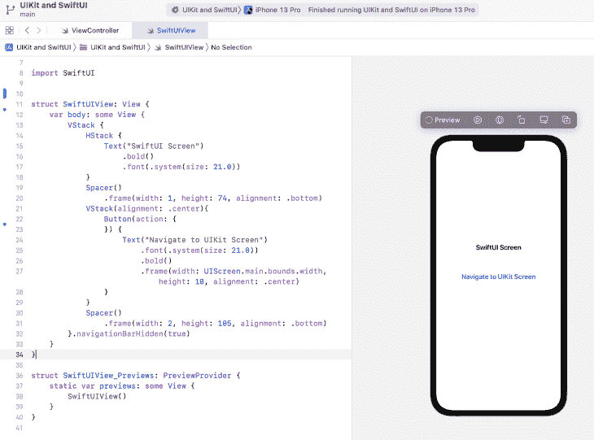

# 如何将 SwiftUI 添加到 UIKit 项目中

> 原文：<https://blog.logrocket.com/how-add-swiftui-uikit-project/>

UIKit 框架是苹果在 2008 年和 iPhone OS2 一起推出的。10 多年后的 2019 年，苹果推出了 [SwiftUI](https://developer.apple.com/xcode/swiftui/) ，意在节省开发者的时间。

SwiftUI 框架支持声明式编程，这意味着它需要更少的代码。此外，它可以轻松管理主题，提供实时预览，使用 Canvas 而不是 Interface Builder，并且不容易崩溃。

那么，SwiftUI 和 ui kit——哪个更好？嗯，尽管 SwiftUI 有很多优点，但公司在 iOS 应用中采用 swift ui 的速度一直很慢。一些组织愿意为一个新项目尝试 SwiftUI，但是许多组织不愿意将现有的 UIKit 项目迁移到这个框架。

SwiftUI 需要 iOS 13 或更高版本，因此它与使用旧版本 iOS 开发的应用不兼容。此外，将大型应用程序转移到不同的框架非常耗时，可能会限制开发人员的带宽。

本教程将演示如何向 UIKit 项目添加 SwiftUI 屏幕。这种 SwiftUI UIKit 集成解决方案可以提供使用 SwiftUI 的体验，而无需从头创建新的应用程序。将 SwiftUI 添加到现有的 UIKit 项目也将使我们在未来更容易将应用程序迁移到 SwiftUI。

*向前跳转:*

## 最终项目:与 SwiftUI 屏幕 UIKit 应用程序

这是我们将在本教程中构建的应用程序的最终版本:

 [https://www.youtube.com/embed/Sz0bDK-ghDs?version=3&rel=1&showsearch=0&showinfo=1&iv_load_policy=1&fs=1&hl=en-US&autohide=2&wmode=transparent](https://www.youtube.com/embed/Sz0bDK-ghDs?version=3&rel=1&showsearch=0&showinfo=1&iv_load_policy=1&fs=1&hl=en-US&autohide=2&wmode=transparent)

视频

我们将在 UIKit 应用程序中创建一个 SwiftUI 屏幕，然后添加允许在 SwiftUI 屏幕和 UIKit 屏幕之间导航的功能。

## 创建带有故事板界面的 iOS 项目

让我们从创建 UIKit 项目开始。

首先，我们将从 **iOS** 选项卡中选择**应用**:



然后，我们将从**界面**下拉菜单中选择**故事板**:



对于本教程，我将删除故事板，并以编程方式构建应用程序的用户界面。这里有一篇文章，你可能会觉得有助于了解更多关于[用故事板和编程方式创建 iOS 应用的 UI](https://blog.logrocket.com/storyboard-vs-programmatically-ios-ui-design/)。

检查这个 GitHub [commit](https://github.com/iremkaraoglu/iOS_SwiftUI_in_UIKit_Project/commit/531177cda292b591b81836fb33288b6d24d654f2) 以获得从示例项目中移除故事板所必需的更改，并将导航控制器指定为根视图控制器。

## 创建 SwiftUI 屏幕

现在，让我们创建一个 SwiftUI 视图文件。

在 SwiftUI 中创建新文件。为平台选择 **iOS** ，为用户界面选择 **SwiftUI View** ;



接下来，给文件命名，并点击**创建:**



现在，您应该看到默认的 SwiftUI 视图文件，文本为“Hello，World！”



接下来，让我们添加一个简单的 UI 设计，由一些文本和一个按钮组成:

```
struct SwiftUIView: View {
    var body: some View {
        VStack {
            HStack {
                Text("SwiftUI Screen")
                    .bold()
                    .font(.system(size: 21.0))
            }
            Spacer()
                .frame(width: 1, height: 74, alignment: .bottom)
            VStack(alignment: .center){
                Button(action: {
                }) {
                    Text("Navigate to UIKit Screen")
                        .font(.system(size: 21.0))
                        .bold()
                        .frame(width: UIScreen.main.bounds.width, height: 10, alignment: .center)
                }
            }
            Spacer()
                .frame(width: 2, height: 105, alignment: .bottom)
        }.navigationBarHidden(true)
    }
}

```

更新 SwiftUI 屏幕后，我们可以在画布上看到实时预览。我们新的 SwiftUI 屏幕有一个标签 SwiftUI 屏幕和一个导航到 UIKit 屏幕的按钮。



## 创建 UIKit 视图

现在，让我们用 UIKit 的`ViewController`创建一个基本的用户界面。它将包括一个带有文本“UIKit screen”的标签和一个导航到 SwiftUI 屏幕的按钮。

```
override func viewDidLoad() {
        super.viewDidLoad()

        view.backgroundColor = .white

        let label = UILabel()
        label.text = "UIKit Screen"
        label.textColor = .black
        label.translatesAutoresizingMaskIntoConstraints = false
        label.font = .boldSystemFont(ofSize: 21)
        view.addSubview(label)

        let button = UIButton()
        button.setTitleColor(.blue, for: .normal)
        button.setTitle("Navigate to SwiftUI Screen", for: .normal)
        button.titleLabel?.textAlignment = .center
        button.translatesAutoresizingMaskIntoConstraints = false
        button.addTarget(self, action: #selector(openSwiftUIScreen), for: .touchUpInside)
        button.titleLabel?.font = .boldSystemFont(ofSize: 21)
        view.addSubview(button)

        NSLayoutConstraint.activate([
            button.centerXAnchor.constraint(equalTo: view.centerXAnchor),
            label.centerXAnchor.constraint(equalTo: view.centerXAnchor),
            button.centerYAnchor.constraint(equalTo: view.centerYAnchor),
            button.topAnchor.constraint(equalTo: label.bottomAnchor, constant: 64)])
    }

```

## 显示 SwiftUI 屏幕

我们需要一种方式来呈现我们的 SwiftUI 屏幕。现在，我们的应用程序打开了 UIKit 屏幕，但没有导航到 SwiftUI 屏幕。

为了设置在 UIKit 屏幕和 SwiftUI 屏幕之间导航的功能，我们将使用 UIKit 的`UIHostingController`类。`UIHostingController`是管理 SwiftUI 视图层次结构的 UIKit 视图控制器。

要创建`UIHostingController`，请确保在代码模块的顶部导入 SwiftUI。

现在，让我们打开`ViewController.swift`文件并创建一个函数来导航到 SwiftUI 屏幕:

```
@objc func openSwiftUIScreen() {
        let swiftUIViewController = UIHostingController(rootView: SwiftUIView())
        self.navigationController?.pushViewController(swiftUIViewController, animated: true)
    }

```

在这个函数中，我们通过将 SwiftUI 屏幕作为根视图传递来创建一个`UIHostingController`,并将主导航控制器传递给它。`UIHostingController`是一个 UIKit 视图控制器，我们将该视图控制器推送到我们的导航控制器。

接下来，我们需要为按钮添加一个目标来触发`openSwiftUIScreen`函数:

```
button.addTarget(self, action: #selector(openSwiftUIScreen), for: .touchUpInside)

```

现在，我们可以从 UIKit 屏幕导航，如下图所示。请注意，我们无法从 SwiftUI 屏幕返回。这是因为我们没有对按钮进行任何操作。

 [https://www.youtube.com/embed/DXTCvNzOP14?version=3&rel=1&showsearch=0&showinfo=1&iv_load_policy=1&fs=1&hl=en-US&autohide=2&wmode=transparent](https://www.youtube.com/embed/DXTCvNzOP14?version=3&rel=1&showsearch=0&showinfo=1&iv_load_policy=1&fs=1&hl=en-US&autohide=2&wmode=transparent)

视频

要从 SwiftUI 屏幕返回，我们需要添加一个`UINavigationController`并将我们的根导航控制器传递给 SwiftUI 屏幕。

在使用`UIHostingController`之前，我们推至 SwiftUI 屏幕。现在，我们将使用`UINavigationController`返回到 UIKit 屏幕。

```
struct SwiftUIView: View {

    weak var navigationController: UINavigationController?

    var body: some View {
        VStack {
            HStack {
                Text("SwiftUI Screen")
                    .bold()
                    .font(.system(size: 21.0))
            }
            Spacer()
                .frame(width: 1, height: 74, alignment: .bottom)
            VStack(alignment: .center){
                Button(action: {
                    navigationController?.popViewController(animated: true)
                }) {
                    Text("Navigate to UIKit Screen")
                        .font(.system(size: 21.0))
                        .bold()
                        .frame(width: UIScreen.main.bounds.width, height: 10, alignment: .center)
                }
            }
            Spacer()
                .frame(width: 2, height: 105, alignment: .bottom)
        }.navigationBarHidden(true)
    }
}

```

接下来，让我们更新我们在`ViewController`中的函数:

```
@objc func openSwiftUIScreen() {
        let swiftUIViewController = UIHostingController(rootView: SwiftUIView(navigationController: self.navigationController))
        self.navigationController?.pushViewController(swiftUIViewController, animated: true)
    }

```

通过此次更新，我们能够从 UIKit 屏幕导航到 SwiftUI 屏幕，然后再回到 UIKit 屏幕。

这是我们应用程序的最终版本:

 [https://www.youtube.com/embed/Sz0bDK-ghDs?version=3&rel=1&showsearch=0&showinfo=1&iv_load_policy=1&fs=1&hl=en-US&autohide=2&wmode=transparent](https://www.youtube.com/embed/Sz0bDK-ghDs?version=3&rel=1&showsearch=0&showinfo=1&iv_load_policy=1&fs=1&hl=en-US&autohide=2&wmode=transparent)

视频

## 结论

在本文中，我们演示了如何将 SwiftUI 集成到 UIKit 项目中。 [2021 年 iOS 开发者社区调查](https://iosdevsurvey.com/2020/08-swiftui/)显示了对 SwiftUI 的高度兴趣。鉴于 SwiftUI 在开发人员中越来越受欢迎，但组织的采用率较低，了解在一个应用程序中同时使用 SwiftUI 和 UIKit 是可能的，这一点很重要。

我希望你喜欢这篇文章。您可以在评论区分享您的宝贵反馈或问题，或者通过[【电子邮件保护】](/cdn-cgi/l/email-protection)在下一篇文章中再见！保重！

## 使用 [LogRocket](https://lp.logrocket.com/blg/signup) 消除传统错误报告的干扰

[](https://lp.logrocket.com/blg/signup)

[LogRocket](https://lp.logrocket.com/blg/signup) 是一个数字体验分析解决方案，它可以保护您免受数百个假阳性错误警报的影响，只针对几个真正重要的项目。LogRocket 会告诉您应用程序中实际影响用户的最具影响力的 bug 和 UX 问题。

然后，使用具有深层技术遥测的会话重放来确切地查看用户看到了什么以及是什么导致了问题，就像你在他们身后看一样。

LogRocket 自动聚合客户端错误、JS 异常、前端性能指标和用户交互。然后 LogRocket 使用机器学习来告诉你哪些问题正在影响大多数用户，并提供你需要修复它的上下文。

关注重要的 bug—[今天就试试 LogRocket】。](https://lp.logrocket.com/blg/signup-issue-free)