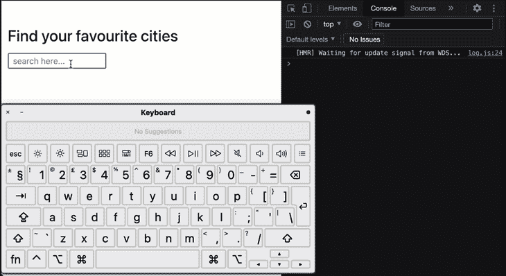
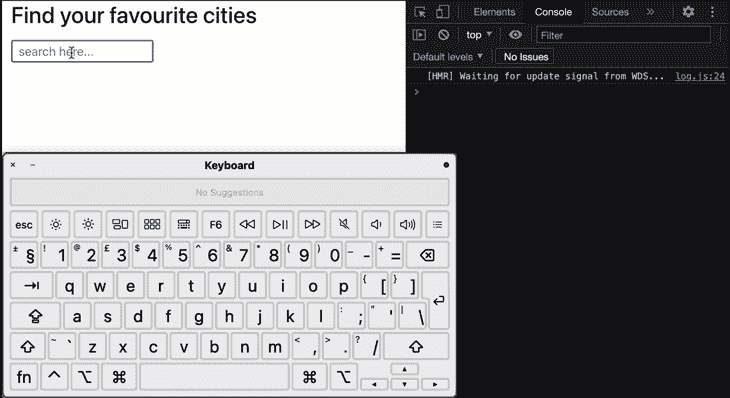
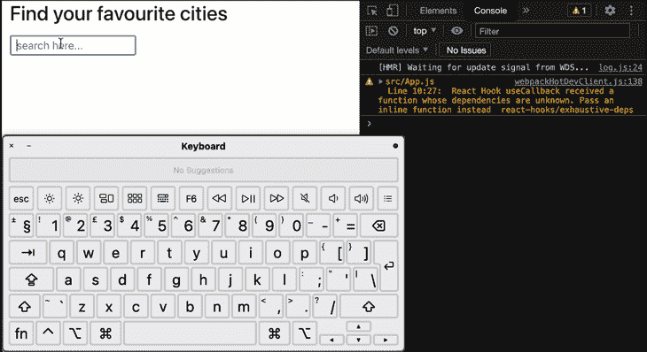
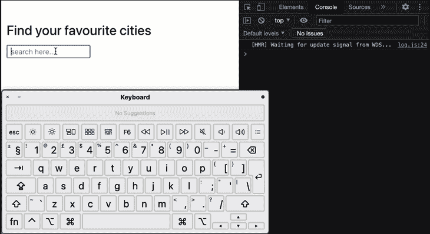
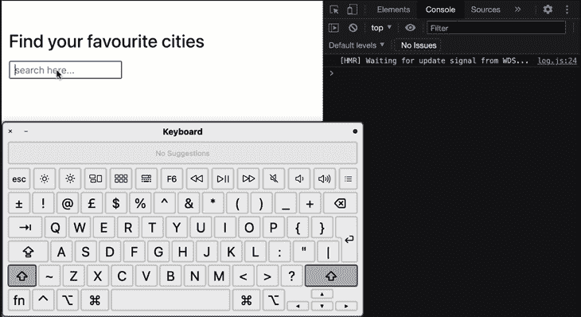

# 如何以及何时在 React 中去抖或节流

> 原文：<https://blog.logrocket.com/how-and-when-to-debounce-or-throttle-in-react/>

您是否曾经遇到过这样的情况:当您在输入栏中键入内容时，您的电脑或手机停止响应，或者您滚动浏览网页时，它变得没有响应？

这通常发生在有事件监听器连接到正在执行的操作时，例如在您键入时获得搜索查询的实时结果，或者在您仍在滚动时在社交媒体平台上获取新帖子或推文。

下面是一个例子，当我们在输入框中输入内容时，显示实时搜索结果会使我们的计算机无响应:



在上面的演示中，我试图在大量数据中搜索一个特定的城市。我打开了我的虚拟键盘，所以你可以看到我正在输入，但是我们的输入区域停止了响应。

这是因为我们的城市列表包含超过 70，000 个城市，所以你可以想象这对我们的计算机处理器来说是多么大的工作量。

似乎过滤这一大串数据还不够，我们要求我们的计算机对单词“圣彼得堡”的 16 次击键进行 16 次过滤。因此，当我们在输入框中输入“S”时，我们的计算机会试图找到所有包含字母“S”的城市。当它还在这样做的时候，我们要求它寻找所有包含“Sa”的城市。“赛”也是如此，等等。，直到我们打完“圣彼得堡”。

在我们的演示中，我们没有发出服务器请求来获取我们过滤的城市。如果是的话，那会更加昂贵和耗时。幸运的是，有一种方法可以解决我们的城市滤波器问题，在本文中，我们将学习如何在 React 中通过去抖和节流来实现这一点。

## 什么是去抖节流？

正如你刚刚在我们的城市过滤问题中看到的，我们要求我们的计算机启动另一个进程，同时它仍在试图完成前一个进程，去抖和节流是两种不同的方法，可以防止一个函数同时在多个实例中运行。

这意味着在我们的城市过滤器中，我们将不能要求我们的计算机过滤掉带有“Sa”的城市，而它仍然试图对名称中带有“S”的城市做同样的事情。我们要么阻止第二个过程的发生，要么停止第一个过程，然后开始第二个过程。

如果我们决定将第一个进程延迟一段时间，看看我们的用户是否想输入其他内容，如果他们想输入，我们将取消第一个进程，然后转而处理第二个进程，这就是去抖。

如果我们决定通过确保函数在给定的时间间隔内只能运行一次来阻止第二个进程的发生，这就是节流。

对于我们的城市过滤器应用程序，我们将使用去抖来解决我们的问题。如果我们的用户想要搜索“圣彼得堡”，我们要做的是给用户一个包含“圣彼得堡”的城市列表，而不是每个以“S”、“Sa”或“Sai”开头的城市。因此，我们一直等到确定用户已经完成输入。有可能我们的用户想要的只是“圣”而不是“圣彼得堡”，但我们不能确定，直到我们等待。

## 我们解决问题的过程

这是我们将用于我们的应用程序的流程。当用户键入“S”时，我们会等待半秒钟(或三秒钟——可以是任何时间),然后开始过滤我们的大型数据列表。如果用户继续输入“a ”,我们从最后一次击键开始再等待 500 毫秒。这样，我们可以将过滤函数延迟到用户键入“g”之后 500 毫秒，这是圣彼得堡的最后一次击键。

因此，我们不再要求计算机过滤超过 70，000 条数据 13 次，而是只做一次。

在 JavaScript 中，`setTimeout()`方法是实现这种解决方案的最佳选择。这是我们的组件目前的样子:

```
import cities from 'cities-list'
import { useState } from 'react'

const citiesArray = Object.keys(cities)

const App = () => {
  const [filteredCities, setFilteredCities] = useState([])

  const doCityFilter = query => {
    if (!query) return setFilteredCities([])

    setFilteredCities(citiesArray.filter(
      city => city.toLowerCase().includes(query.toLowerCase())
    ))
  }

  return (
    <div className="container">
      <h1>Find your favourite cities</h1>

      <form className="mt-3 mb-5">
        <input
          type="text"
          className="px-2"
          placeholder="search here..."
          onChange={event => (doCityFilter(event.target.value))}
        />
      </form>

      <div>
        {filteredCities?.map((city, index) => (
          <p key={index}>{city}</p>
        ))}
      </div>
    </div>
  )
}

export default App

```

要在你的电脑上设置这个，用 [Create React app](https://blog.logrocket.com/tag/create-react-app) 创建一个新的 React App，并用上面的代码替换你的`App.js`文件的内容。你还需要在你的终端上运行`npm install cities-list`来安装`cities-list`。

在我们的`App.js`文件中，我们使用 React `useState`钩子来存储过滤后的城市，我们在 JSX 代码中返回这些城市。我们的`<input />`标签有一个`onChange`事件监听器，它接收用户的输入并运行`doCityFilter()`功能。每次输入字段的值改变时都会发生这种情况。

在我们的`doCityFilter()`函数中，我们使用`Array.filter()`方法过滤从`cities-list`包中获得的`citiesArray`，然后使用`setFilteredCities`方法更新`filteredCities`的值。

## 使用 JavaScript `setTimeout`去反跳

由于过滤过程发生在`setFilteredCities`函数调用中，让我们使用`setTimeout`方法将其延迟 500ms:

```
const doCityFilter = query => {
  if (!query) return setFilteredCities([])

  setTimeout(() => {
    console.log('====>', query)
    setFilteredCities(citiesArray.filter(
      city => city.toLowerCase().includes(query.toLowerCase())
    ))
  }, 500)
}

```


虽然这会延迟我们的功能，但请注意，我们还有另一个问题。我们的 filter 方法仍然会在每次击键时被调用——同样，总共 16 次。我们最终只把 16 个电话中的每一个都延迟了 500 毫秒。我们想要的是每当我们点击一个新的键时取消前面的`setTimeout`方法，这样如果我们有 16 次击键，我们将只为最后一个键调用过滤函数。让我们使用`cleartimeout`方法来实现它:

```
let filterTimeout

const doCityFilter = query => {
  clearTimeout(filterTimeout)
  if (!query) return setFilteredCities([])

  filterTimeout = setTimeout(() => {
    console.log('====>', query)
    setFilteredCities(citiesArray.filter(
      city => city.toLowerCase().includes(query.toLowerCase())
    ))
  }, 500)
}

```

对于我们新的`doCityFilter`函数，我们从在其作用域之外声明一个名为`filterTimeout`的可变变量开始。这样我们就可以将我们的`setTimeout`方法赋给这个变量，然后在我们创建另一个之前用它来清除我们的超时。这是我们的应用程序现在的样子:


我们刚刚成功地去抖了我们的函数！我们的应用程序始终响应迅速，我们的过滤过程只运行一次。

## 使用 Lodash 去抖

对于我们的用例，第一个解决方案是可行的。但是我们可能想要覆盖更多的去抖条件，比如如果发生什么事情就立即调用一个函数，或者在等待超时的前沿或后沿调用一个函数，甚至其他用例可能需要的许多其他条件。

如果您必须自己为每个函数实现所有这些，您将编写比您最初期望的更多的代码，这将反过来增加您的代码库的复杂性。

幸运的是， [Lodash](https://lodash.com/) 有一个`debounce`方法，其有用的功能比我们所能涵盖的更多。更幸运的是，你可以只安装这个`debounce`函数，这样你就不会因为一个方法而把整个库带入你的应用程序。

让我们在终端上运行以下命令来安装`lodash.debounce`:

```
npm install lodash.debounce

```

接下来，我们将把它导入到我们的`App.js`文件中。让我们在第三行做那件事。

```
...
import debounce from 'lodash.debounce'

```

`lodash.debounce`方法需要三个参数:

*   我们想要去抖的函数
*   等待时间
*   其他配置的选项对象

我们的第一反应可能是对`setFilteredCities`函数调用去抖，就像我们对`setTimeout`实现所做的那样:

```
const doCityFilter = query => {
  if (!query) return setFilteredCities([])

  const debouncedFilter = debounce(() => {
    console.log('====>', query)
    setFilteredCities(citiesArray.filter(
      city => city.toLowerCase().includes(query.toLowerCase())
    ))
  }, 500)

  debouncedFilter()
}

```

但是这仍然会导致对圣彼得堡这个城市的 16 个函数调用，并且我们的城市过滤器仍然不能像预期的那样工作:



因此，我们必须做更多的事情。

### 使用`Lodash.debounce`和反作用`useCallback`钩工作

我们可以使用 React 的 [`useCallback`钩子](https://blog.logrocket.com/react-hooks-cheat-sheet-unlock-solutions-to-common-problems-af4caf699e70/)来防止我们的函数在每次输入字段的值改变时被重新创建。

首先，让我们从“react”导入`useCallback`:

```
...
import { useCallback, useState } from 'react'
...

```

接下来，我们将把我们的`debouncedFilter`变量移到`doCityFilter()`函数之外，作为它的值，我们将调用`useCallback`钩子并提供去抖函数调用作为它的参数:

```
...
const debouncedFilter = useCallback(debounce(query =>
  setFilteredCities(citiesArray.filter(
    city => city.toLowerCase().includes(query?.toLowerCase())
  )), 500), []
)

const doCityFilter = query => {
        ...
}

```

我们现在可以在`doCityFilter`函数中调用我们的`debouncedFilter`方法:

```
 const doCityFilter = query => {
    if (!query) return setFilteredCities([])
    debouncedFilter(query)
  }

```

如果我们运行我们的应用程序，您将会看到它像预期的那样工作:



对于这个用例，我们可以忽略依赖警告。但是你可以看到我们的代码现在看起来很复杂。

让我们通过去抖动整个`doCityFilter`函数，而不是其中的`setFilteredCities`函数调用，来避免所有这些额外的步骤。

```
const doCityFilter = debounce(query => {
  if (!query) return setFilteredCities([])

  console.log('====>', query)

  setFilteredCities(citiesArray.filter(
    city => city.toLowerCase().includes(query.toLowerCase())
  ))
}, 500)

```

当我们去抖整个`doCityFilter`函数时，我们不再需要`useCallback`钩子。我们的功能现在看起来简单多了，我们的应用程序也像预期的那样工作:



## 用`Lodash.throttle`节流

我们也可以使用 Lodash 来节流函数。当我们节流一个函数时，它在一个给定的周期内只会被调用一次，不管它对应的事件监听器被触发了多少次。就像`lodash.debounce`一样，我们可以通过在终端上运行以下命令来安装`lodash.throttle`:

```
npm install lodash.throttle 

```

接下来，我们将使用以下代码行来导入它:

```
import throttle from 'lodash.throttle'

```

其用法类似于`lodash.debounce`方法。我们调用`throttle`方法并提供我们想要去抖的函数作为第一个参数，等待时间(以毫秒为单位)作为第二个参数，可选的 config 对象作为第三个参数。

对于我们的过滤器问题，节流不是一个好的解决方案，所以我们不会在我们的应用程序中使用它。

## 使用`react-debounce-input`更容易去抖

在 React 中实现输入去抖还有一种更简单的方法。让我们学习如何使用`react-debounce-input`包来解决我们的城市过滤器问题。

这个包附带了一个`DebounceInput`组件，我们可以用它来代替`<input />`标签。它有一个内置的去抖功能，所以我们不需要任何外部去抖方法去抖我们的`onChange`事件。

在您的终端上运行这个命令来安装`react-debounce-input`包:

```
npm install react-debounce-input

```

接下来，我们将从`react-debounce-input`导入`DebounceInput`:

```
...
import { DebounceInput } from 'react-debounce-input'
... 

```

让我们粘贴以下内容，而不是 JSX 代码中当前的`<input/>`标签:

```
<DebounceInput
  className="px-2"
  placeholder="search here..."
  minLength={1}
  debounceTimeout={500}
  onChange={event => (doCityFilter(event.target.value))}
/>

```

我们的`<DebounceInput />`组件带有一个`debounceTimeout`属性，用于指定在调用`onChange`函数之前我们希望等待多长时间。这里，我们用了 500 毫秒。我们还有一个`minLength`来指定在我们的`onChange`事件被触发之前我们想要的最小输入数。

既然我们正在使用`<DebounceInput />`组件，我们可以回到简单版本的`doCityFilter()`函数:

```
const doCityFilter = query => {
  if (!query) return setFilteredCities([])

  setFilteredCities(citiesArray.filter(
    city => city.toLowerCase().includes(query.toLowerCase())
  ))
}

```

让我们预览一下我们应用程序的另一个演示:



你可以看到我们的城市过滤器应用程序如预期那样工作。这就是我们需要用`react-debounce-input`去抖我们的功能！我认为这是过滤器问题的最佳解决方案，因为它的代码少得多，这使得在应用程序的多个部分中维护和实现更容易。

## 结论

在本文中，我们已经学习了如何在 [React](https://blog.logrocket.com/tag/react) 中去抖和节流功能，并且我们能够用不同的实现来解决我们的城市滤波器问题。虽然它们都可以工作，但是最好理解一个解决方案并不适合所有场景。因此，选择适合您的用例的最简单的方法。

你可以在我的 GitHub 上找到这个例子的回购协议。在 repo 中，您会发现实现的不同分支。如果你想保持联系，可以考虑订阅我的 [YouTube 频道](https://youtube.com/ebenezerdon)，在 [LinkedIn](https://www.linkedin.com/in/ebenezerdon/) 上关注我。继续建！

## [LogRocket](https://lp.logrocket.com/blg/react-signup-general) :全面了解您的生产 React 应用

调试 React 应用程序可能很困难，尤其是当用户遇到难以重现的问题时。如果您对监视和跟踪 Redux 状态、自动显示 JavaScript 错误以及跟踪缓慢的网络请求和组件加载时间感兴趣，

[try LogRocket](https://lp.logrocket.com/blg/react-signup-general)

.

[ ](https://lp.logrocket.com/blg/react-signup-general) [](https://lp.logrocket.com/blg/react-signup-general) 

LogRocket 结合了会话回放、产品分析和错误跟踪，使软件团队能够创建理想的 web 和移动产品体验。这对你来说意味着什么？

LogRocket 不是猜测错误发生的原因，也不是要求用户提供截图和日志转储，而是让您回放问题，就像它们发生在您自己的浏览器中一样，以快速了解哪里出错了。

不再有嘈杂的警报。智能错误跟踪允许您对问题进行分类，然后从中学习。获得有影响的用户问题的通知，而不是误报。警报越少，有用的信号越多。

LogRocket Redux 中间件包为您的用户会话增加了一层额外的可见性。LogRocket 记录 Redux 存储中的所有操作和状态。

现代化您调试 React 应用的方式— [开始免费监控](https://lp.logrocket.com/blg/react-signup-general)。