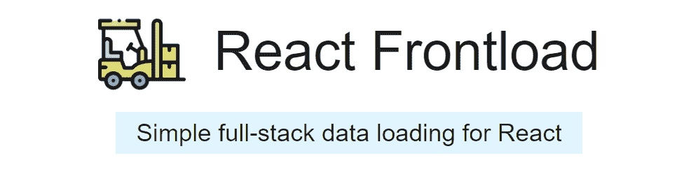

# 如何以及为什么使用 React Frontload - LogRocket 博客

> 原文：<https://blog.logrocket.com/how-and-why-to-use-react-frontload/>

Web 应用程序关注两个主要活动:加载数据和有效地显示数据。虽然 React 在原生 CSS、JS 中的 CSS 和其他样式选择的帮助下在显示数据方面做得很好，但在加载部分却有所欠缺。

对于一个完整的客户端应用程序来说，将获取和适当的生命周期事件结合起来可能是一个好的解决方案，但是当东西放到服务器上时，这是不够的。这就是名为 [React Frontload](https://davnicwil.com/react-frontload/) 的第三方库的用武之地。React Frontload 是解决跨环境数据获取问题的有效工具，它有一个无缝接口，允许您内联加载数据。

就这些吗？让我们来了解一下！



## 什么是反应前置？

React Frontload 是一个基于 React 的应用程序库，有助于在服务器和客户端环境中获取内联数据。它提供了几个特性，使得集成和使用非常简单。它提供了一个用于加载数据的钩子，以有状态对象的形式返回数据，还提供了一个用于跟踪网络请求状态的`frontloadMeta`对象。

这里需要重点关注的一点是，Frontload 的最新版本附带了一个开箱即用的状态管理解决方案，因此作为开发人员，您不需要担心手动将数据移交给 Redux 或 MobX 等状态容器。

凭借通过 npm 每周超过 6k 的下载量，React Frontload 因其简单的设置和开发人员友好的界面而开始吸引人们的注意。在我们深入研究如何让它运行之前，让我们来详细了解一下最初的问题以及 Frontload 是如何解决它的。

## 它解决什么问题？

如前所述，React 没有提供现成的解决方案来处理数据获取。JavaScript 中的 fetch API 能够访问外部 API 端点并接收数据。但是对于 React 应用程序来说，还有更多的工作要做。一旦接收到数据，需要通知 React DOM 请求的结果。

如果请求失败，就必须正确处理这个场景。当您为这些情况找到一个可行的解决方案时，服务器端呈现的应用程序就会出现，使您的 fetch + useEffect 解决方案变得毫无意义。

服务器端渲染有它的问题。虽然与呈现 UI 并行获取数据的异步方式非常适合开发人员，但服务器端呈现迫使用户在完成所有 API 调用和加载所有数据之前等待，然后再呈现布局并将其发送到浏览器客户端。

这就是为什么在组件内部异步获取数据的传统方法变得无关紧要了。

有人可能会说，解决这个问题的好方法是在服务器端呈现的应用程序中全局加载数据，并将其传递给各个组件。这也适用于客户端，因为根组件仍然可以处理获取数据，并通过 props 将其传递给其子组件。

但这不是一个实际的解决方案。这种方法可以证明在搜索结果页面或用户资料页面等结构中是有效的，但在用户订阅源或社交媒体帖子等情况下，它会不必要地增加复杂性。

React Frontload 可以帮助解决这个问题。该库提供了一种以组件为中心的方法来实现数据获取，并且内置了与 SSR 应用程序的兼容性。这意味着您不需要为这两种场景实现不同的解决方案，也不会被迫在应用程序的架构上妥协。

### 它是如何工作的？

React Frontload 构建在特定于组件的数据获取方法上，并调整应用程序的服务器端呈现来处理同步请求。这意味着您可以通过 React 挂钩访问 Frontload API，并且仍然让它在 SSR 中工作，因为您的 web 服务器被指示像标准 React 客户端一样异步工作。

React Frontload 帮助您的服务器异步加载数据并呈现页面。它同时返回客户端水合的数据。您需要做的只是添加一行代码，将数据融合到客户机中。一旦我们深入了解图书馆的设置，你就会更好地理解这一点。

React Frontload 使用一个`reactFrontloadServer`调用来呈现来自 React 源代码的客户端代码，React 源代码在内部寻找`useFrontload`钩子。每当遇到这样的钩子，它的承诺就被收集。一旦收集了所有的承诺，就等待它们，它们的数据被注入到相应的组件中。

完成后，`reactFrontLoadServer`调用将再次遍历源代码，以查找可能源自前一轮承诺收集的任何新的`useFrontload`调用。如果发现任何新的调用，则使用它们重复该过程。如果没有遇到新的调用，则呈现将被标记为 final 并发送到客户端。

## React Frontload 入门

### 初始设置

在您可以使用 React Frontload 之前，您需要进行一些配置更改。

以下是你需要做的事情:

**使用 React 前端加载提供商** 包装您的应用

```
import { FrontloadProvider } from 'react-frontload'

const App = ({ frontloadState }) => (
  <FrontloadProvider initialState={frontloadState}>
    <Content>...</Content>
  </FrontloadProvider>
)
```

**如果你有一个 SSR 应用，用`reactFrontloadServerRender`** 包装你现有的同步服务器渲染代码

* * *

### 更多来自 LogRocket 的精彩文章:

* * *

`reactFrontloadServerRender`与 React 服务器渲染的工作方式类似。它增加的只是上面解释的异步加载部分。

```
import { renderToString } from 'react-dom/server'
import { createFrontloadState, frontloadServerRender } from 'react-frontload'
import apiClient from './api_client'

app.get('*', async (req, res) => {
  ...

  // create a new state object for each render
  // this will eventually be passed to the FrontloadProvider in <App>
  const frontloadState = createFrontloadState.server({

  // apiClient is a custom implementation of an API handler, that can make HTTP calls, DB operations etc 
    context: { api: apiClient}
  })

  try {
    // frontloadServerRender is first used to fetch data instead of the generic, straightforward renderToString
    const { rendered, data } = await frontloadServerRender({
      frontloadState,
      render: () => renderToString(<App frontloadState={frontloadState} />)
    })

    res.send(`
      <html>
        ...
        <!-- server rendered markup -->
        ${rendered}

        <!-- loaded data hydration on client -->
        <script>window._frontloadData=${toSanitizedJSON(data)}</script>
        ...
      </html>
    `)
  } catch (err) {
    ...
  }
})
```

显然，`frontloadServerRender`返回数据以及呈现的标记。然后，将标记按原样发送到客户端，同时将数据标记为已合并。

这样做是为了确保与组件初始视图相关的数据不会在客户端渲染时重新加载，并且预取的数据会通过`initialState`注入到组件中。

**在客户端处理水合操作**

SSR 就绪应用程序流程的最后一步是在客户端处理初始数据合并。

这可以通过下面的代码来完成:

```
import apiClient from './api_client'

const frontloadState = createFrontloadState.client({
  // use client's implementation of api to load data.
  context: { api: apiClient },

  // hydrate state from SSR
  serverRenderedData: window._frontloadData
})
...
ReactDOM.hydrate(<App frontloadState={frontloadState} />, ...)
```

这就是初始设置。现在，让我们看看在获取组件内部的数据时如何使用它。

### 如何使用 React 前端加载

下面是一个示例组件，它使用 React Frontload 从 API 异步加载数据，并处理 HTTP 请求的所有可能结果:

```
const Component = () => {
  const { data, frontloadMeta } = useFrontload('some-component', async ({ api }) => ({
    something: await api.fetchSomething()
  }))

  if (frontloadMeta.pending) return <div>loading</div>
  if (frontloadMeta.error)   return <div>error</div>

  return <div>{data.something}</div>
}
```

在上面的例子中，`useFrontload`钩子被用来获取数据和元对象。数据对象包含来自 API 调用的响应，并被定义为包含属性`something`的对象，该属性由 API 客户端获取。

请注意，这个 API 客户机(`api`)与您在初始设置的步骤 3 中传递的客户机相同。典型的 API 客户端会公开可用于执行基于远程服务器的操作并返回结果和/或数据的方法。

当 API 客户端忙于加载数据时，元对象将 pending 属性设置为`true`，在上面的例子中，它用于向用户显示加载 UI。另外，通过检查`meta.error`属性可以很容易地处理错误。

`useFrontload`还公开了一些其他属性，在各种情况下都能派上用场。例如，`setData`方法与数据变量一起公开，如果您计划基于用户活动获取更多数据，它允许您稍后更新数据对象。

这是它的实现方式:

```
const Component = () => {
  // setData is a tiny reducer that can update the data object on the fly.
  const { data, setData, frontloadMeta } = useFrontload('some-component', async ({ api }) => ({
    something: await api.fetchSomething()
  }))

  if (frontloadMeta.pending) return <div>loading</div>
  if (frontloadMeta.error)   return <div>error</div>

  const updateSomething = async () => {
    try {
      const updatedSomething = await updateSomething('new value') // API call to update the data
      setData(data => ({ ...data, something: updatedSomething })) // update data in state
    } catch {
      ...
    }
  }

  return (
    <>
      <div>{data.something}</div>
      <button onClick={updateSomething}>Update!</button>
    <>
  )
```

似乎很简单，不是吗？让我们把事情提高一个档次。

下面是使用 React Frontload 的一个组件中的两个 API 调用:

```
const Component = () => {
  const { data, frontloadMeta } = useFrontload('some-component', async ({ api }) => ({
    something: await api.fetchSomething(),
    someMoreThings: await api.fetchSomeMoreThings() // just added this as an additional API call
  }))

  if (frontloadMeta.pending) return <div>Loading!</div>
  if (frontloadMeta.error)   return <div>Something went wrong</div>

  return <div>{data.something} and {data.someMoreThings}</div> 
}
```

我们忽略了一件小事。如果您看一下我们在上面的例子中使用的`useFrontload`调用的性能，您会注意到它相当慢。

显然，这是因为它在等待一个又一个的承诺。这可以通过并行加载它们来改善。

以下是在同一个代码片段中对该问题的修复:

```
const Component = () => {
  const { data, frontloadMeta } = useFrontload('some-component', async ({ api }) => {
    const [something, someMoreThings] = await Promise.all([
    api.fetchSomething(),
    api.fetchSomeMoreThings()
  ])

  return { something, someMoreThings }
  })

  if (frontloadMeta.pending) return <div>Loading!</div>
  if (frontloadMeta.error)   return <div>Something went wrong</div>

  return <div>{data.something} and {data.someMoreThings}</div> 
}
```

就是这样。您将极快的数据获取与一个状态容器捆绑在一起，该容器有自己的小缩减器来尽可能快速地获取、呈现和更新数据。

## 结论

在高效处理远程数据方面，React Frontload 是一个方便的工具，当您考虑它的所有特性时，它只会变得更好。作为一名 React 开发人员，如果你的目标是快速扩展可靠的应用程序，你必须至少检查一次这个库。我很确定它会满足您的需求，并使您的开发过程更快。

这个项目正在积极开发中，在最新版本中已经引入了很多最热门的特性，所以可以肯定地说，随着时间的推移，它只会变得更好。

## 使用 LogRocket 消除传统反应错误报告的噪音

[LogRocket](https://lp.logrocket.com/blg/react-signup-issue-free)

是一款 React analytics 解决方案，可保护您免受数百个误报错误警报的影响，只针对少数真正重要的项目。LogRocket 告诉您 React 应用程序中实际影响用户的最具影响力的 bug 和 UX 问题。

[ ](https://lp.logrocket.com/blg/react-signup-general) [  ](https://lp.logrocket.com/blg/react-signup-general) [LogRocket](https://lp.logrocket.com/blg/react-signup-issue-free)

自动聚合客户端错误、反应错误边界、还原状态、缓慢的组件加载时间、JS 异常、前端性能指标和用户交互。然后，LogRocket 使用机器学习来通知您影响大多数用户的最具影响力的问题，并提供您修复它所需的上下文。

关注重要的 React bug—[今天就试试 LogRocket】。](https://lp.logrocket.com/blg/react-signup-issue-free)