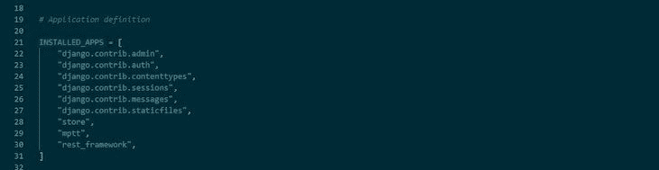
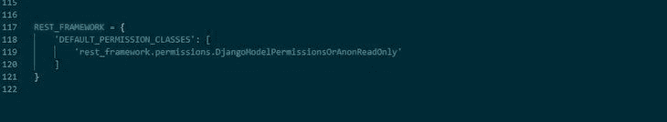

# 如何以及为什么应该在 Django 中使用 Next.js

> 原文：<https://blog.logrocket.com/how-and-why-you-should-use-next-js-django/>

Next.js 是基于 React 的 UI 库构建的前端 JavaScript 框架，它是轻量级的、服务器渲染的、灵活的。开发人员通常使用 Next.js 来构建快速易用的静态、完全交互式的网站和应用程序。

Django 是一个基于 Python 语言的免费开源 web 开发框架，它提供了一种灵活、高效、简单的方法来构建 web 应用程序。这两个框架都有效地处理 web 应用程序的前端和后端，因此毫不奇怪，它们的组合有一些用例，包括构建电子商务网站、市场管理网站、实时聊天应用程序和工作门户网站，等等。

在本教程中，我们将探讨为什么您应该考虑将 Next.js 与 Django 一起使用，包括一个简单的例子。我们开始吧！

## 目录

## 如何在 Django 中使用 Next.js

您可以使用 Next.js 作为前端，同时使用 Django 在后端提供和存储信息。此外，[使用 Django Rest 框架](https://blog.logrocket.com/django-rest-framework-create-api/)，您可以构建 API，让您的网站以创纪录的速度运行。

在执行服务器端和客户端渲染时，将 Next.js 和 Django 结合使用可以简化 CRUD 特性的实现。例如，由于 Django 附带了一个管理面板，涵盖了日常的 CRUD 管理任务，所以构建一个自定义管理只需要很少的时间。

让我们讨论用 Django 设置 Next.js 的两个潜在选项。

### 使用`django-nextjs`

将 Next.js 和 Django 结合使用的一个简单方法是安装 [`django-nextjs`](https://pypi.org/project/django-nextjs/) 。这个包同时运行 Django 和 Next.js 服务器，使 Django 能够处理 web 请求，并将 Next.js 作为生成 HTML 的内部服务。

要开始使用`django-nextjs`，首先在 Python 环境中运行下面的代码来安装它:

```
pip install django-nextjs

```

已经集成了 Django 和 Next.js，让您可以立即开始您的项目。

### 用 Next.js 手动实现 Django

要用 Next.js 和 Django 手动构建一个项目，您必须创建两个不同的文件夹来分别保存前端和后端。这是您所想的任何用例或项目所必需的。

设置好 Django 应用程序后，您可以使用 Django Rest 框架创建 Django API。一旦您的服务器设置好了，您的管理员就可以访问了，并且您添加了您的数据，您就可以继续配置 Django Rest 框架，它使您能够将您的应用程序转换成 API。

您将需要 Django Rest 框架来使 Next.js 能够访问和收集您用 Django 在数据库中设置的数据。为此，您需要设置您的 URL、视图和序列化程序文件夹，它们都是相互连接的，并且是 Django 和 Next.js web 应用程序正常运行的组成部分。

首先，通过运行下面的代码安装 Django Rest 框架:

```
pip install djangorestframework

```

接下来，您需要进入后端项目的设置，并按照官方文档的指示，将下面的代码添加到`INSTALLED_APPS`部分:

```
rest_framework
```

上面的代码激活了 Django 应用程序中的 REST 框架，如下图所示:



为了增加安全性，您可以添加下面的代码块，它定义了默认权限。该代码块确保匿名用户无权编辑数据库。相反，他们拥有只读访问权限:

```
REST_FRAMEWORK = {
    'DEFAULT_PERMISSION_CLASSES': [
        'rest_framework.permissions.DjangoModelPermissionsOrAnonReadOnly'
    ]
}

```

下图显示了它在您的应用程序中的外观示例:



序列化程序文件很重要，它以一种可以发送到 Next.js 的方式格式化数据。您应该在后端 Django 文件夹下创建一个 Python 文件形式的序列化程序文件，`serializers.py`:

```
from rest_framework import serializers
from .models import Category, Product, ProductImage

class ImageSerializer(serializers.ModelSerializer):
    class Meta:
        model = ProductImage
        fields = ["image", "alt_text"]

class ProductSerializer(serializers.ModelSerializer):
    product_image = ImageSerializer(many=True, read_only=True)
    class Meta:
        model = Product
        fields = ["id", "category", "title", "description", "slug", "regular_price", "product_image"]

class CategorySerializer(serializers.ModelSerializer):
    class Meta:
        model = Category
        fields = ["name", "slug"]

```

您还应该将您的`views`文件创建为 Python 文件，给我们一个`views.py`文件。`views.py`文件连接到我们的 URL，执行所需的动作并收集数据。下面是`views.py`文件的代码:

```
from django.shortcuts import render
from rest_framework import generics
from . import models
from .models import Category, Product
from .serializers import CategorySerializer, ProductSerializer

class ProductListView(generics.ListAPIView):
    queryset = Product.objects.all()
    serializer_class = ProductSerializer

class Product(generics.RetrieveAPIView):
    lookup_field = "slug"
    queryset = Product.objects.all()
    serializer_class = ProductSerializer

class CategoryItemView(generics.ListAPIView):
    serializer_class = ProductSerializer
    def get_queryset(self):
        return models.Product.objects.filter(
            category__in=Category.objects.get(slug=self.kwargs["slug"]).get_descendants(include_self=True)
        )

class CategoryListView(generics.ListAPIView):
    queryset = Category.objects.filter(level=1)
    serializer_class = CategorySerializer

```

`url.py`文件对于链接我们网站上的不同页面和产品非常重要:

```
from django.urls import path
from . import views
app_name = "JExpress"
urlpatterns = [
    path("api/", views.ProductListView.as_view(), name="store_home"),
# lists all the products in the database

    path("api/category/", views.CategoryListView.as_view(), name="categories"),

    path("api/<slug:slug>/", views.Product.as_view(), name="product"),
    path("api/category/<slug:slug>/", views.CategoryItemView.as_view(), name="category_item"),
]

```

## 为什么要将 Next.js 与 Django 一起使用？

Next.js 和 Django 的结合可以为 SEO 创造奇迹。除了 [Next.js 的服务器端渲染功能，它还提供了对许多工具的访问，而没有单个页面应用程序可能带来的 SEO 问题](https://blog.logrocket.com/how-next-js-can-help-improve-seo/)。许多开发者会认为 Next.js 甚至比 React 更适合 SEO[。](https://blog.logrocket.com/react-structured-data-and-seo/)

### 快速开发时间

Django 已经有了现成的 admin。再加上前端和后端是分离的，这导致了更快的开发时间，因为开发人员不需要从零开始。

这种独立的体系结构还使得测试应用程序、检测错误以及进行必要的更新和更改变得更加容易。

### 用户体验

每个应用程序都是为潜在用户设计的。用 Next.js 和 Django 构建保证了更快的加载时间和更好的用户体验。后台数据的转换将会更快，并且不太容易被用户注意到。

### 良好的代码管理

由于前端与后端的分离，您可以使用这些 Django 和 Next.js 轻松实现良好的代码管理。开发人员可以轻松部署后端，而无需重新部署前端，反之亦然。

### 自定义

这两个框架都支持高级定制，使您的应用程序更具可扩展性，更适合高级功能。

### 多团队支持

由于我们的 Next.js 和 Django 应用程序的架构，多个团队可以轻松地在应用程序上工作，而不必相互依赖来完成工作。前端团队可以轻松地在前端工作，而后端团队可以同时在应用程序的后端工作。

## 结论

将 Next.js 与 Django 一起使用简单明了，提供了很好的 UX。这种组合不仅适用于简单的应用程序，通过添加一些技术，这种组合还适用于更大更复杂的 web 和移动应用程序。

在本文中，我们回顾了结合 Next.js 和 Django 的一些好处，并探索了两种入门方法。一定要留下评论，让我知道你使用这两个框架构建了什么类型的应用程序。

## [LogRocket](https://lp.logrocket.com/blg/nextjs-signup) :全面了解生产 Next.js 应用

调试下一个应用程序可能会很困难，尤其是当用户遇到难以重现的问题时。如果您对监视和跟踪状态、自动显示 JavaScript 错误、跟踪缓慢的网络请求和组件加载时间感兴趣，

[try LogRocket](https://lp.logrocket.com/blg/nextjs-signup)

.

[](https://lp.logrocket.com/blg/nextjs-signup)[](https://lp.logrocket.com/blg/nextjs-signup)

LogRocket 就像是网络和移动应用的 DVR，记录下你的 Next.js 应用上发生的一切。您可以汇总并报告问题发生时应用程序的状态，而不是猜测问题发生的原因。LogRocket 还可以监控应用程序的性能，报告客户端 CPU 负载、客户端内存使用等指标。

LogRocket Redux 中间件包为您的用户会话增加了一层额外的可见性。LogRocket 记录 Redux 存储中的所有操作和状态。

让您调试 Next.js 应用的方式现代化— [开始免费监控](https://lp.logrocket.com/blg/nextjs-signup)。