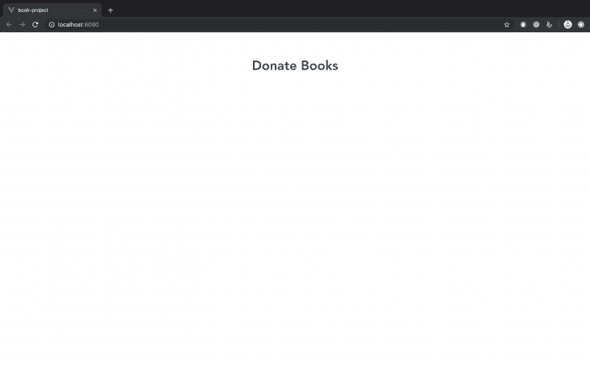
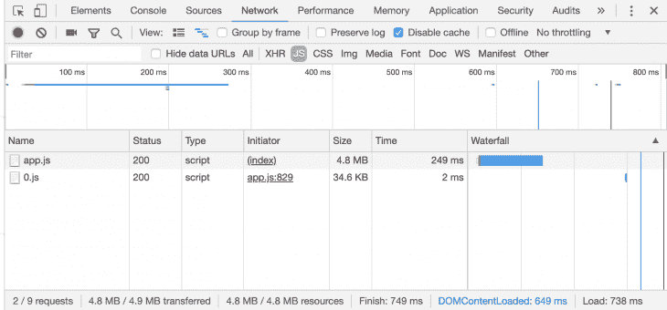

# 异步组件如何优化 Vue 应用的性能

> 原文：<https://blog.logrocket.com/how-async-components-can-optimize-performance-in-vue-apps/>

当使用 JavaScript 框架创建大型应用程序时，考虑组件结构是很重要的。

通过考虑组件结构，您可以避免在运行时加载每个组件并降低应用程序的速度。在构建应用程序时，您还可以避免将不必要的数据返回给用户，或者造成总体糟糕的用户体验。

像 React 和 [Angular](https://blog.logrocket.com/new-angular-features-you-didnt-know-existed-7f292a6e7afc/) 这样的框架分别使用`React.lazy()`和路由模型来考虑组件结构。

在这篇博文中，我们将实现几个演示，看看 Vue 如何使用异步组件，通过采用延迟加载和代码分割技术来减少应用程序的加载时间。

### 在 Vue 中创建组件

为了理解这是如何工作的，让我们从创建一个基本组件开始。

导航到您的终端，安装 [Vue 的 CLI](https://blog.logrocket.com/getting-started-with-the-new-vue-cli-3-43bcbe1ae759/) ，并创建一个项目:

```
npm install -g vue/cli
vue create book-project
#choose the default setting when prompted
```

在我们的新项目文件夹中，让我们替换默认文件的内容，包括`HelloWorld.vue`和`App.vue`。我们将从创建一个图书捐赠页面开始。将`HelloWorld.vue`重命名为`Book.vue`，并将其内容替换为:

```
<!--Book.vue-->
<template>
  <h1>Donate Books</h1>
</template>
```

然后用以下内容替换`App.vue`的内容:

```
<!--App.vue-->
<template>
  <div>
    <book></book>
  </div>
</template>

<script>
  Import Book from "./components/Book"
  export default {
    components: {
      Book
    }
  }
</script>

<style>
#app {
  font-family: 'Avenir', Helvetica, Arial, sans-serif;
  -webkit-font-smoothing: antialiased;
  -moz-osx-font-smoothing: grayscale;
  text-align: center;
  color: #2c3e50;
  margin-top: 60px;
}
</style>
```

在上面的代码块中，您会注意到`Book`组件是静态导入的。这意味着每次我们加载应用程序时都会加载`Book`组件。

接下来，在您的终端中运行`npm run serve`，导航到`localhost:8080`，查看您的基本组件:



目前，每次加载应用程序时都加载`Book`组件似乎不是一个重大的性能问题。然而，随着你的应用变得越来越大，在运行时加载每一个组件都会变得很麻烦。

您的用户不会与应用程序中的每一项功能都进行交互，所以只满足他们的需求是有意义的。问题是，你怎么能只加载你的用户需要的东西呢？

这就是延迟加载和代码分割技术发挥作用的地方。延迟加载会延迟组件的初始加载，阻止图像等资源的加载，直到用户导航到页面上的位置。

代码拆分是最初由 [webpack](https://webpack.js.org/) 提供的功能。Webpack 允许您将代码拆分成不同的包，仅在需要时使用。

Vue 通过一个称为动态导入的特性来执行代码分割。

这个导入使用 web pack——或者任何模块捆绑器，比如[包](https://parceljs.org/)——来异步加载您的组件。它是用一个包含承诺的语法编写的，并被包装在一个箭头函数中:

```
// dynamic import
import("./components/Book").then(Book => {
  // Insert the Book module here
});
```

让我们在我们的`App.vue`组件上实现它:

```
<template>
  <div>
    <book></book>
  </div>
</template>

<script>
export default {
  components: {
    Book: () => import("./components/Book")
  }
};
</script>
```

在上面的代码示例中，`import()`函数返回了`Book`组件，这使我们能够异步加载它。如果我们看一下浏览器 devtools 中的`Network`选项卡，有一个由`App.js`发起的名为`0.js`的文件。该文件包含我们的异步组件:



### 使用异步组件创建 Vue 应用程序

让我们继续构建一个基本的图书捐赠应用程序，展示如何利用异步组件。最终，我们只想在用户点击捐赠按钮时加载我们的`Donate`组件。

首先，让我们导航到终端并在我们的项目文件夹中安装`vue-material`。我们将用它来设计应用程序:

```
cd book-project
npm i vue-material
```

我们将通过在`src/main.js`中导入`vue-material`来将它包含在应用程序中:

```
import Vue from 'vue'
import App from './App.vue'
Vue.config.productionTip = false
import VueMaterial from 'vue-material'
import 'vue-material/dist/vue-material.min.css'
import 'vue-material/dist/theme/default.css'
Vue.use(VueMaterial)
new Vue({
  render: h => h(App),
}).$mount('#app')
```

现在，让我们构建我们之前创建的`Book`组件:

```
<!--Book.vue-->
    <template>
     <div id="app">
      <md-card md-with-hover v-for="(book, key) in books" v-bind:key="key">
          <md-ripple>
            <md-card-header>
              <div class="md-title">{{book.name}}</div>
              <div class="md-subhead">{{book.genre}}</div>
            </md-card-header>
            <md-card-actions>
              <md-button type="primary" @click="addBook(key)">Donate to improve {{book.genre}}</md-button>
            </md-card-actions>
          </md-ripple>
        </md-card>
        <div v-if="show">
          <md-card-content>
         <donate v-bind:selectList="selectList"></donate>
          </md-card-content>
    </div>
        <md-button @click="show = true" id="donate">Donate {{selectList.length}} book(s)</md-button>
      </div>  
    </template>

    <script>
      export default {
      name: 'RegularButtons',
      methods: {
        addBook (key) {
          if(!this.selectList.includes(key)) {
            this.selectList.push(key);
          }
        }
      },
      components: {
        donate: () => import('./Donate')
      },
      data: () => ({
        books: [
          { name: 'Using Creatine', genre: 'Workouts' },
          { name: 'Learn Parkour', genre: 'Sports' },
          { name: 'Snorkelling', genre: 'Diving' },
        ],
        selectList: [],
        show: false
      })
    }
    </script>
```

在上面的代码块中，从一个`Book`数组中检索并显示图书列表。如果用户点击附在每本书上的按钮，`addBook()`方法会将选中的书推送到一个`selectList`数组中，并显示捐赠书籍的总数。

还有一个单独的按钮，专门用于加载我们的异步组件。它有一个参数`show`设置为`true`。这使得`v-if`语句能够显示`donate`组件，该组件包含选择捐赠的书籍数量。

已经通过`<script>`标签中的`components`属性动态导入了`donate`组件。

让我们创建我们的`donate`组件。在`src/components`文件夹中，创建一个名为`Donate.vue`的新文件，并输入下面的代码示例:

```
<template>
      <div title="Donate Books" key="donate">
          <p v-for="(x, y) in this.selectList" :key="y">
          Tip: {{books[Number(x)].name}} is about {{books[Number(x)].genre}}
          </p>
      </div>
</template>
<script>
export default {
  props: ['selectList'],
  data: () => ({
    books: [
      { name: 'Using Creatine', genre: 'Workouts' },
      { name: 'Learn Parkour', genre: 'Sports' },
      { name: 'Snorkelling', genre: 'Underwater' },
    ]
  })
}
</script>
```

导航到您的终端并运行`npm run serve.`

如果应用程序编译成功，请在浏览器中打开`localhost:8080`。当你在 Devtools 中查看网络标签时点击应用程序，只有当你点击`Donate`按钮时`Donate`组件才会加载。

 [https://www.youtube.com/embed/Pfam0bIH4To?version=3&rel=1&showsearch=0&showinfo=1&iv_load_policy=1&fs=1&hl=en-US&autohide=2&wmode=transparent](https://www.youtube.com/embed/Pfam0bIH4To?version=3&rel=1&showsearch=0&showinfo=1&iv_load_policy=1&fs=1&hl=en-US&autohide=2&wmode=transparent)

视频

你会在上面的视频中看到，`donate`组件由`1.js`表示，并且不会在初始应用渲染中加载。

### 异步组件的错误处理

异步组件需要尽可能简单，以便快速加载。然而，在我们的异步组件中定义加载和错误组件来处理加载状态并在需要时显示错误消息是有帮助的。

```
In src/components, let's create two components: LoadingState.vue and ErrorState.vue:
```

```
<!--LoadingState.vue-->
    <template>
      <p><em>Loading...</em></p>
    </template>
```

```
<!--ErrorState.vue-->
    <template>
      <p>Could not display books. Kindly check your internet conection.</p>
    </template>
```

现在，在`App.vue`中，我们将导入两个组件，并将它们添加到我们的`Book`组件中:

```
<!--App.vue-->
<script>
import LoadingState from "./components/LoadingState"
import ErrorState from "./components/ErrorState"
const Book = import("./components/Book")
export default {
  components: {
    Book: () => ({
// Book is our default component
      component: Book,
// LoadingState is the component that is displayed while our default component
// is loading
      loading: LoadingState,
// ErrorState is the component that is displayed should our default component have an // error while loading
      error: ErrorState,
// A delay is set up before the loading component is shown
      delay: 100,
// Should this timeout be reached, the default component is considered to have failed // to load
      timeout: 2000
    })
  }
};
</script>
```

除非您的互联网连接速度非常慢或有问题，否则不会出现加载和错误状态。为了测试它们是否正常工作，让我们将`timeout`属性设置为`0`并尝试加载应用程序:

 [https://www.youtube.com/embed/5IbMToLgouk?version=3&rel=1&showsearch=0&showinfo=1&iv_load_policy=1&fs=1&hl=en-US&autohide=2&wmode=transparent](https://www.youtube.com/embed/5IbMToLgouk?version=3&rel=1&showsearch=0&showinfo=1&iv_load_policy=1&fs=1&hl=en-US&autohide=2&wmode=transparent)

视频

### 结论

使用异步组件构建大规模应用程序是保持最佳性能的关键。异步组件不仅因为更快的加载时间而确保您的保留率更高，而且还可以帮助您更有效地检测错误，因为您的组件是作为函数来限定范围和传递的。如果你想看看这个演示的源代码，你可以在 GitHub 的这里找到它。

## 像用户一样体验您的 Vue 应用

调试 Vue.js 应用程序可能会很困难，尤其是当用户会话期间有几十个(如果不是几百个)突变时。如果您对监视和跟踪生产中所有用户的 Vue 突变感兴趣，

[try LogRocket](https://lp.logrocket.com/blg/vue-signup)

.

[](https://lp.logrocket.com/blg/vue-signup)[https://logrocket.com/signup/](https://lp.logrocket.com/blg/vue-signup)

LogRocket 就像是网络和移动应用程序的 DVR，记录你的 Vue 应用程序中发生的一切，包括网络请求、JavaScript 错误、性能问题等等。您可以汇总并报告问题发生时应用程序的状态，而不是猜测问题发生的原因。

LogRocket Vuex 插件将 Vuex 突变记录到 LogRocket 控制台，为您提供导致错误的环境，以及出现问题时应用程序的状态。

现代化您调试 Vue 应用的方式- [开始免费监控](https://lp.logrocket.com/blg/vue-signup)。