# 浏览器渲染如何工作——幕后——log rocket 博客

> 原文：<https://blog.logrocket.com/how-browser-rendering-works-behind-scenes/>

***编者按:**本文于 2021 年 6 月审核更新。*

本文的目的是用非常简单的术语解释你的浏览器将 HTML、CSS 和 JavaScript 转换成你可以与之交互的工作网站的步骤。了解您的浏览器将网站变得生动的过程将使您能够优化您的 web 应用程序以获得更快的速度和性能。

让我们开始吧。

## 浏览器如何渲染网站概述

浏览器到底是怎么渲染网站的？我将很快解构这个过程，但是首先，重要的是回顾一些基础知识。

web 浏览器是一种软件，它从远程服务器(或者本地磁盘)加载文件，并向您显示这些文件，允许用户进行交互。我知道你知道什么是浏览器🙂

然而，在浏览器中，有一个软件可以根据接收到的文件计算出向你显示什么。这就是所谓的浏览器引擎。

浏览器引擎是每一个主流浏览器的核心软件组件，不同的浏览器厂商对其引擎的称呼也不尽相同。火狐的浏览器引擎叫 Gecko，Chrome 的叫 Blink，恰好是 WebKit 的一个分支。

如果你感兴趣的话，你可以看看各种浏览器引擎的对比。不要让这些名字迷惑了你——它们只是名字。

为了便于说明，让我们假设我们有一个通用的浏览器引擎。这个浏览器引擎将被图形化表示，如下所示。


In this article, I use “browser” and “browser engine” interchangeably. Don’t let that confuse you; what’s important is that you know the browser engine is the key software responsible for what we’re discussing.

## 向浏览器发送和接收信息

这不应该是一门计算机科学网络课，但是你可能记得数据是以字节大小的数据包的形式通过互联网发送的。


我想说的是，当你写一些 HTML、CSS 和 JS，并试图在浏览器中打开 HTML 文件时，浏览器会从你的硬盘(或网络)中读取 HTML 的原始字节。

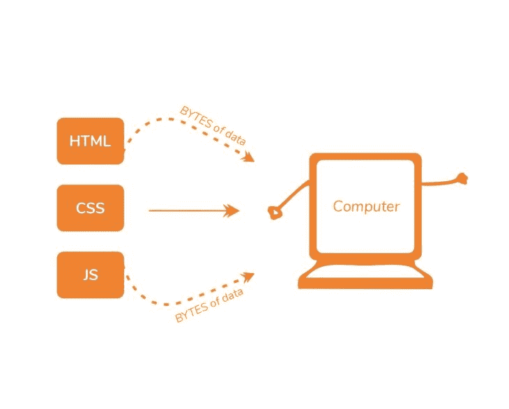

明白了吗？浏览器读取数据的原始字节，而不是您编写的代码的实际字符。我们继续吧。

浏览器接收数据的字节，但是它不能真正地用它做任何事情；数据的原始字节必须转换成它能理解的形式。这是第一步。

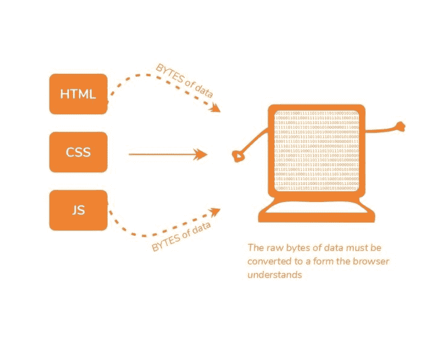

## 从 HTML 的原始字节到 DOM

浏览器对象需要处理的是文档对象模型(DOM)对象。那么，DOM 对象是如何派生出来的呢？嗯，很简单。

首先，数据的原始字节被转换成字符。


您可能会从您编写的代码的字符中看到这一点。这种转换是基于 HTML 文件的字符编码完成的。

此时，浏览器已经从原始数据字节变成了文件中的实际字符。角色很棒，但不是最终的结果。这些字符被进一步解析成称为标记的东西。

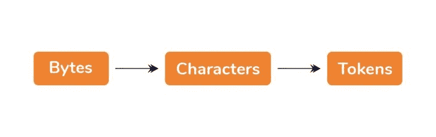

这些代币是什么？

文本文件中的一堆字符对浏览器引擎没什么好处。如果没有这个标记化过程，这一串字符只会产生一串无意义的文本，即 HTML 代码，而不会产生一个实际的网站。

当你保存一个扩展名为`.html`的文件时，你向浏览器引擎发出信号，将该文件解释为一个 HTML 文档。浏览器解释该文件的方式是首先解析它。在解析过程中，尤其是在标记化过程中，文件中的每个开始和结束 HTML 标记都被考虑在内。

解析器理解尖括号中的每个字符串(例如，`<html>`、`<p>`)，并理解适用于每个字符串的规则集。例如，表示锚标记的标记与表示段落标记的标记具有不同的属性。

从概念上讲，您可能会将令牌视为某种数据结构，其中包含有关某个 HTML 标记的信息。从本质上讲，HTML 文件被分解成称为标记的小解析单元。这是浏览器开始理解你写的东西的方式。

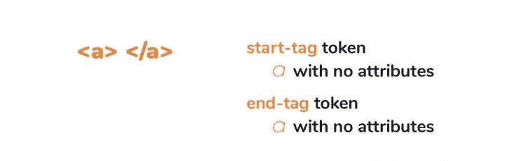

Tokens are great, but they are also not our final result. After the tokenization is done, the tokens are then converted into nodes. You may think of nodes as distinct objects with specific properties. In fact, a better way to explain this is to see a node as a separate entity within the document object tree.

节点是伟大的，但是它们仍然不是最终的结果。

现在，这是最后一点。创建这些节点后，这些节点被链接到一个称为 DOM 的树数据结构中。DOM 建立了父子关系、相邻兄弟关系等。每个节点之间的关系都是在这个 DOM 对象中建立的。

现在，这是我们可以做的事情。

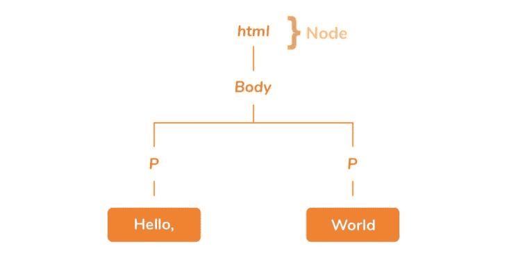

如果你还记得《网页设计 101》，你不会在浏览器中打开 CSS 或 JS 文件来浏览网页。不——你打开 HTML 文件，大多数时候是以`index.html`的形式。这正是你这样做的原因:在任何事情发生之前，浏览器必须将 HTML 数据的原始字节转换成 DOM。

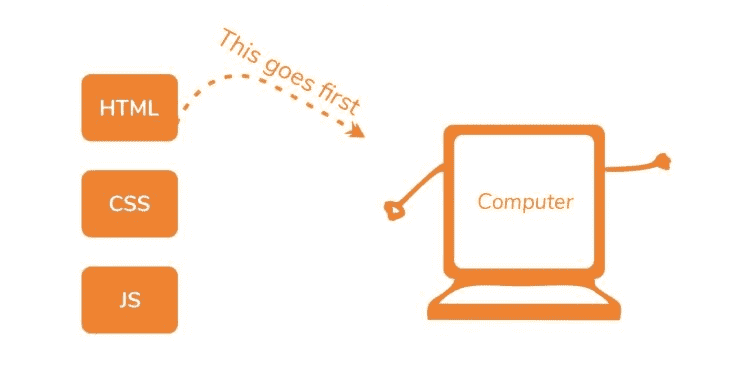

根据 HTML 文件的大小，DOM 构造过程可能需要一些时间。不管文件有多小，都需要一些时间，不管文件有多大。

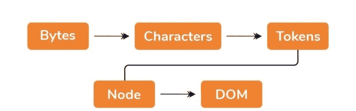

## 但是等等——获取 CSS 怎么办？

DOM 已创建。太好了。

带有一些 CSS 的典型 HTML 文件将具有如下所示的样式表链接:

```
<!DOCTYPE html>
<html>
<head>
    <link rel="stylesheet" type="text/css" media="screen" href="main.css" />
</head>
<body>

</body>
</html>
```

当浏览器接收数据的原始字节并开始 DOM 构造过程时，它还会请求获取链接的`main.css`样式表。一旦浏览器开始解析 HTML，在找到 CSS 文件的`link`标签时，它同时发出获取该标签的请求。

正如您可能已经猜到的，浏览器也接收 CSS 数据的原始字节，无论是来自互联网还是您的本地磁盘。但是这些 CSS 数据的原始字节到底是用来做什么的呢？

## 从 CSS 的原始字节到 CSSOM

你看，当浏览器接收到 CSS 的原始字节时，类似的处理 HTML 的原始字节的过程也被启动。

换句话说，数据的原始字节被转换成字符，然后被标记化。节点也形成了，最后，树结构形成了。

什么是树形结构？大多数人都知道有个东西叫 DOM。同样，也有一个 CSS 树结构，称为 CSS 对象模型(CSSOM)。

你看，浏览器不能处理 HTML 或 CSS 的原始字节。这必须被转换成它能识别的形式——而这恰好就是这些树形结构。

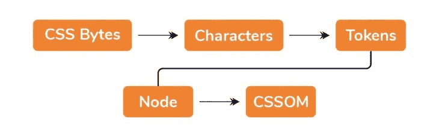

CSS 有一种叫做[级联](https://blog.logrocket.com/how-css-works-understanding-the-cascade-d181cd89a4d8)的东西。层叠是浏览器决定将什么样式应用于元素的方式。因为影响元素的样式可能来自父元素(例如，通过继承)，或者已经在元素本身上设置，所以 CSSOM 树结构变得很重要。

为什么？这是因为浏览器必须递归地遍历 CSS 树结构，并确定影响特定元素的样式。

一切都好。浏览器有 DOM 和 CSSOM 对象。我们现在能把一些东西渲染到屏幕上吗？

## 渲染树

我们现在拥有的是两个独立的树状结构，它们似乎没有共同的目标。

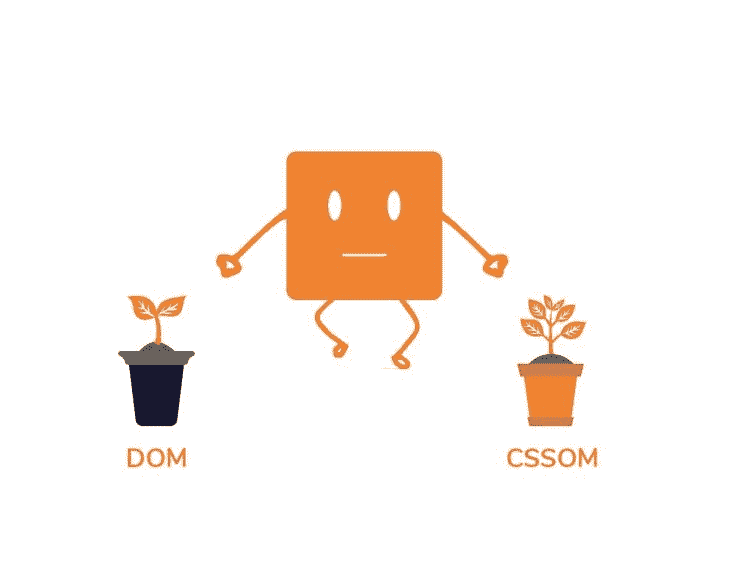

DOM 和 CSSOM 是独立的树形结构。

DOM 和 CSSOM 树结构是两个独立的结构。DOM 包含关于页面 HTML 元素关系的所有信息，而 CSSOM 包含关于元素样式的信息。

好了，浏览器现在将 DOM 和 CSSOM 树合并成一棵渲染树。


DOM+CSSOM =渲染树

呈现树包含页面上所有可见 DOM 内容的信息，以及不同节点所需的所有 CSSOM 信息。注意，如果一个元素被 CSS 隐藏(例如，通过使用`display; none`)，该节点将不会在渲染树中显示。

隐藏元素将出现在 DOM 中，但不会出现在呈现树中。这是因为渲染树结合了来自 DOM 和 CSSOM 的信息，所以它知道不要在树中包含隐藏元素。

渲染树构建完成后，浏览器进入下一步:布局！

### 布局渲染树

渲染树构建完成后，下一步是执行布局。现在，我们有了屏幕上所有可见内容的内容和样式信息，但是实际上我们还没有向屏幕呈现任何内容。

首先，浏览器必须计算页面上每个对象的确切大小和位置。这就像将页面上要呈现的所有元素的内容和样式信息传递给一个天才的数学家。这位数学家然后用浏览器视窗计算出每个元素的确切位置和大小。


Amazing, right?

这个布局步骤(您有时会听到称为“reflow”步骤)考虑了从 DOM 和 CSSOM 接收的内容和样式，并进行所有必要的布局计算。

### 让艺术家出来

现在已经计算出了每个元素的确切位置，剩下的工作就是将元素“绘制”到屏幕上。想想看:我们已经获得了在屏幕上实际显示元素所需的所有信息。让我们把它展示给用户，好吗？

是啊！这正是这个舞台的意义所在。有了关于内容(DOM)、样式(CSSOM)的信息，以及计算出的元素的确切布局，浏览器现在将单个节点“绘制”到屏幕上。最后，元素现在被渲染到屏幕上！

## 渲染阻塞资源

当你听到渲染阻塞时，你会想到什么？嗯，我的猜测是，“阻止在屏幕上实际绘制节点的东西”。"

如果你那样说，你绝对是对的！

优化网站的第一条规则是尽快将最重要的 HTML 和 CSS 交付给客户。DOM 和 CSSOM 必须在成功绘制之前构建，因此 HTML 和 CSS 都是渲染阻塞资源。

关键是，你应该尽可能快地把你的 HTML 和 CSS 送到客户端，以优化你的应用程序第一次呈现的时间。

## 但是等等 JavaScript 呢？

一个像样的 web 应用程序肯定会用到一些 JavaScript。那是必然的。JavaScript 的“问题”是您可以使用 JavaScript 修改页面的内容和样式。记得吗？

这意味着，您可以从 DOM 树中删除和添加元素，也可以通过 JavaScript 修改元素的 CSSOM 属性。

这太棒了！然而，这是有代价的。考虑下面的 HTML 文档:

```
<!DOCTYPE html>
<html>

<head>
    <meta name="viewport" content="width=device-width,initial-scale=1">
    <title>Medium Article Demo</title>
    <link rel="stylesheet" href="style.css">
</head>

<body>
    <p id="header">How Browser Rendering Works</p>
    <div>
</body>

</html>
```

这是一份非常简单的文件。

`style.css`样式表有一个声明，如下所示:

```
body {
  background: #8cacea;
}
```

这样的结果是:


一个基本的 HTML 页面呈现。

一个简单的文本和图像呈现在屏幕上。根据前面的解释，浏览器从磁盘(或网络)读取 HTML 文件的原始字节，并将其转换为字符。

字符被进一步解析成标记。一旦解析器到达带有`<link rel="stylesheet" href="style.css">`的行，就发出获取 CSS 文件的请求，`style.css`DOM 构造继续进行，一旦 CSS 文件返回一些内容，就开始 CSSOM 构造。

一旦我们引入 JavaScript，这个流程会发生什么变化？嗯，要记住的最重要的事情之一是，每当浏览器遇到一个`script`标签，DOM 构造就会暂停！整个 DOM 构造过程会暂停，直到脚本执行完毕。

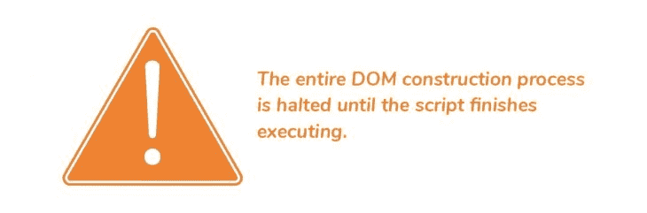

这是因为 JavaScript 可以改变 DOM 和 CSSOM。因为浏览器不确定这个特定的 JavaScript 会做什么，所以它采取了预防措施，完全停止了整个 DOM 构造。

这能有多糟？让我们看一看。

在我之前分享的基本 HTML 文档中，让我们引入一个带有一些基本 JavaScript 的`script`标签:

```
<!DOCTYPE html>
<html>

<head>
    <meta name="viewport" content="width=device-width,initial-scale=1">
    <title>Medium Article Demo</title>
    <link rel="stylesheet" href="style.css">
</head>

<body>
    <p id="header">How Browser Rendering Works</p>
    <div>
    <script>
        let header = document.getElementById("header");

        console.log("header is: ", header);
    </script>
</body>

</html>
```

在`script`标记中，我正在访问带有`id`和`header`的节点的 DOM，然后将它记录到控制台。

这很好，如下所示:

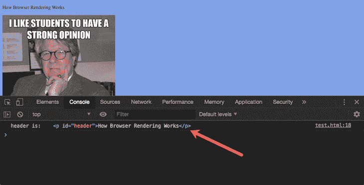

DOM 操作成功。

但是，您是否注意到这个`script`标签被放在了`body`标签的底部？让我们把它放在头部，看看会发生什么:

```
<!DOCTYPE html>
<html>

<head>
    <meta name="viewport" content="width=device-width,initial-scale=1">
    <title>Medium Article Demo</title>
    <link rel="stylesheet" href="style.css">
    <script>
        let header = document.getElementById("header");

        console.log("header is: ", header);
    </script>
</head>

<body>
    <p id="header">How Browser Rendering Works</p>
    <div>
</body>
</html>

```

一旦我这样做了，头变量就被解析为`null`。


DOM 操作失败的☹️

为什么？很简单。

当 HTML 解析器在构建 DOM 的过程中，发现了一个`script` 标签。此时，`body`标签及其所有内容还没有被解析。DOM 构造会暂停，直到脚本执行完毕:

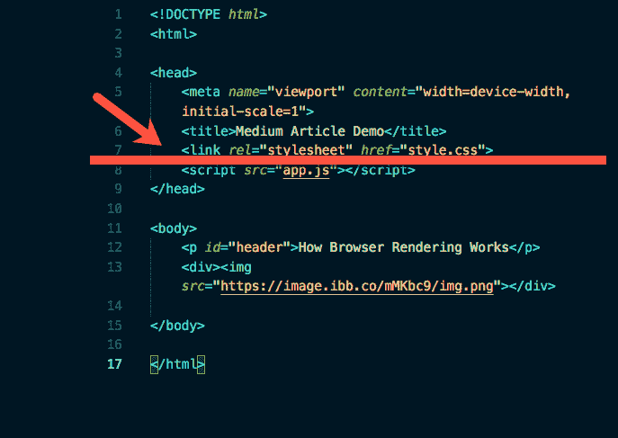

DOM 建设暂停的地方。

当`script`试图访问一个`id`为`header`的 DOM 节点时，它已经不存在了，因为 DOM 还没有完成对文档的解析！

这给我们带来了另一个要点:脚本的位置很重要。


这还不是全部。如果您将内联`script`提取到一个外部本地文件，行为是一样的。DOM 构造仍然处于暂停状态:

```
<!DOCTYPE html>
<html>

<head>
    <meta name="viewport" content="width=device-width,initial-scale=1">
    <title>Medium Article Demo</title>
    <link rel="stylesheet" href="style.css">
    <script src="app.js"></script>
</head>

<body>
    <p id="header">How Browser Rendering Works</p>
    <div>
</body>

</html>
```

同样，这还不是全部！如果这个`app.js`不是本地的，而是必须通过互联网获取，那该怎么办？

```
<!DOCTYPE html>
<html>

<head>
    <meta name="viewport" content="width=device-width,initial-scale=1">
    <title>Medium Article Demo</title>
    <link rel="stylesheet" href="style.css">
    <script src="https://some-link-to-app.js">
</head>

<body>
    <p id="header">How Browser Rendering Works</p>
    <div>
</body>

</html>
```

如果网络很慢，并且获取`app.js`需要几千毫秒，那么 DOM 构造也会停止几千毫秒！这是一个很大的性能问题，*还有，*这还不是全部。请记住，JavaScript 也可以访问 CSSOM 并对其进行更改。例如，这是有效的 JavaScript:

```
document.getElementsByTagName("body")[0].style.backgroundColor = "red";
```

那么，当解析器遇到一个`script`标签，但是 CSSOM 还没有准备好的时候会发生什么呢？

答案很简单:Javascript 执行将被暂停，直到 CSSOM 准备好。


因此，即使 DOM 构造在遇到一个遇到的`script`标记之前停止，CSSOM 也不会发生这种情况。

对于 CSSOM，JS 执行等待。没有 CSSOM，就没有 JS 执行。

### 异步属性

默认情况下，每个脚本都是解析器拦截器！DOM 构造将总是停止。

不过，有一种方法可以改变这种默认行为。

如果将`async`关键字添加到`script`标签中，DOM 的构建将不会停止。DOM 构造将继续，脚本将在下载完成并准备就绪后执行。

这里有一个例子:

```
<!DOCTYPE html>
<html>

<head>
    <meta name="viewport" content="width=device-width,initial-scale=1">
    <title>Medium Article Demo</title>
    <link rel="stylesheet" href="style.css">
    <script src="https://some-link-to-app.js" async></script>
</head>

<body>
    <p id="header">How Browser Rendering Works</p>
    <div>
</body>

</html>

```

## 关键渲染路径(CRP)

在这段时间里，我们讨论了接收 HTML、CSS 和 JS 字节并将其转化为屏幕上呈现的像素之间的步骤。

这整个过程被称为关键渲染路径(CRP)。优化你的网站性能就是优化 CRP。一个优化良好的站点应该进行渐进式渲染，而不是阻塞整个过程。


这就是一个 web 应用被认为是慢还是快的区别。

一个经过深思熟虑的 CRP 优化策略使浏览器能够通过确定加载资源的优先级和加载顺序来尽可能快地加载页面。

## 跟踪应用程序的渲染方式

既然您已经知道了浏览器渲染的工作原理，那么确保应用程序中的组件和元素按照您的预期进行渲染就非常重要了。如果你有兴趣监控和跟踪与浏览器渲染相关的问题*和*看看用户如何与特定组件交互，[试试 LogRocket](https://logrocket.com/signup/) 。[](https://logrocket.com/signup/)[https://logrocket.com/signup/](https://logrocket.com/signup/)

LogRocket 就像是网络应用的 DVR，记录下你网站上发生的每一件事。不用猜测你的应用或网站在特定浏览器中的表现，你可以确切地看到用户体验到了什么。使用 LogRocket，您可以了解用户如何与组件进行交互，以及如何处理与元素未正确呈现相关的任何错误。

此外，LogRocket 记录 Redux 存储中的所有操作和状态。LogRocket 让你的应用程序记录带有标题和正文的请求/响应。它还记录页面上的 HTML 和 CSS，甚至可以重建最复杂的单页面应用程序的像素级完美视频。现代化您调试 React 应用的方式— [开始免费监控](https://logrocket.com/signup/)。

## 结论

了解了浏览器如何呈现 HTML、CSS 和 JS 的基础知识后，我恳请您花时间探索如何利用这些知识来优化页面速度。

一个好的起点是 Google Web 基础文档的[性能部分](https://developers.google.com/web/fundamentals/performance/why-performance-matters/)。

## 通过理解上下文，更容易地调试 JavaScript 错误

调试代码总是一项乏味的任务。但是你越了解你的错误就越容易改正。

LogRocket 让你以新的独特的方式理解这些错误。我们的前端监控解决方案跟踪用户与您的 JavaScript 前端的互动，让您能够准确找出导致错误的用户行为。

[](https://lp.logrocket.com/blg/javascript-signup)

LogRocket 记录控制台日志、页面加载时间、堆栈跟踪、慢速网络请求/响应(带有标题+正文)、浏览器元数据和自定义日志。理解您的 JavaScript 代码的影响从来没有这么简单过！

[Try it for free](https://lp.logrocket.com/blg/javascript-signup)

.