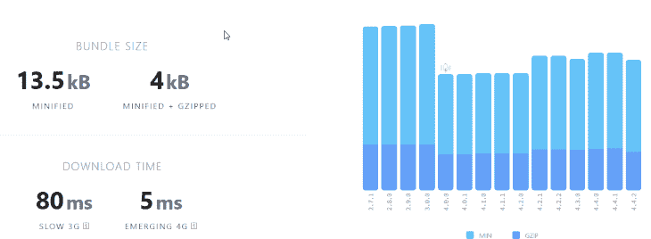
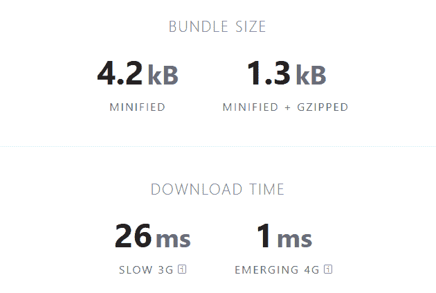
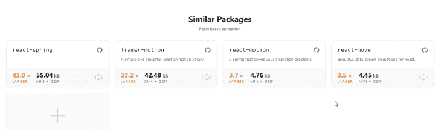
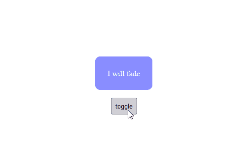
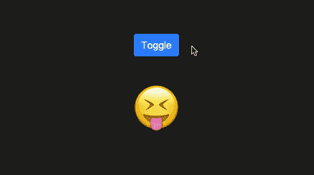

# 如何在 React 中构建更快的动画过渡

> 原文：<https://blog.logrocket.com/how-build-faster-animation-transitions-react/>

在你的网站的组件和元素中添加动画和过渡效果可以改善用户体验，也可以增加一些特色。然而，使用大量动画库创建的过渡往往很慢，因为这些库会增加应用程序的开销。

虽然我们不能完全消除由动画造成的性能下降，即使在较小的库中，我们可以通过选择正确的包来减少它。

在本教程中，我们将演示如何使用[过渡钩子](https://github.com/iamyoki/transition-hook)在 React 中创建快速过渡动画。

本文将涵盖以下内容:

在撰写本文时，transition-hook 还没有准备好投入生产，所以不能用于实际应用。然而，它已经达到了 v1.5.1 发布状态，因此一个稳定的、可用于生产的版本可能指日可待！

## 入门指南

按照本文中使用的示例，设置一个 React 项目并安装带有 Yarn 或 npm 的过渡挂钩:

```
/*yarn*/
yarn add transition-hook

/*npm*/
npm install transition-hook --save

```

## 什么是过渡钩？

transition-hook 是 React 中许多可用于创建动画的挂钩之一。它类似于流行的 [react-transition-group](https://github.com/reactjs/react-transition-group) ，但是它是轻量级的，语法更简单，性能更高。

需要明确的是，transition-hook 并不是一个像[成帧器动作](https://www.framer.com/motion/)或[反应弹簧](https://react-spring.io)那样的全能动画库。它不会自动激活元素。相反，它允许您使用 CSS 类和样式的生命周期方法将动画添加到元素的 DOM 入口和出口。

用 [React Hooks](https://reactjs.org/docs/hooks-intro.html) 为你的应用程序添加动画的开销是可以忽略的，因为与完整的动画库相比，Hooks 是相当小的。

例如，缩小版的 [react-transition-group](https://github.com/reactjs/react-transition-group) 为应用程序增加了 13.5kB 的包重量，在 4G 网络上加载大约需要 5 毫秒。相比之下，transition-hook 只增加了 4.3kB 的包重量，加载时间仅为 1 毫秒。它的轻量级本质和渲染快速、优化动画的能力使 transition-hook 比它的前辈更具性能。

下面是两个库的包大小的对比:



Source: [bundlephobia](https://bundlephobia.com/package/react-transition-group@4.4.2).



Source: [bundlephobia](https://bundlephobia.com/package/transition-hook@1.5.2).

这里有一个比较，显示了过渡钩束大小与其他 React 动画库的比较:react-spring、framer-motion、 [react-motion](https://github.com/chenglou/react-motion) 和 [react-move](https://github.com/sghall/react-move) :



Source: [bundlephobia](https://bundlephobia.com/package/transition-hook@1.5.2).

## 过渡挂钩是如何工作的？

transition-hook 利用了当组件进入和退出 DOM 时调用的一系列生命周期方法。transition-hook 使用这些生命周期方法来创建过渡阶段，允许我们根据组件的安装和卸载时间，使用 CSS 类和样式向组件添加动画。

当一个组件被挂载时，它作为一个元素被插入到 DOM 中。当一个组件被卸载时，情况正好相反；它会从 DOM 中移除。但是，这些生命周期方法可以被覆盖，以便在流程中的特定时间运行所需的逻辑。

transition-hook 公开了三个 React 挂钩:

*   `useTransition`
*   `useSwitchTransition`
*   `listTransition`

这些挂钩将布尔状态转换为转换阶段，当组件在指定的持续时间后安装或卸载时，可以调用这些转换阶段。这允许我们根据不同的阶段添加 CSS 样式来创建动画过渡。

以下是 transition-hook 的过渡阶段:

*   `from`:元素进入前
*   `enter`:元素进入时
*   `leave`:元素退出前

现在，让我们看一些实际的例子来清楚地了解它是如何工作的。

## 使用`useTransition`

下面是一个简单组件的例子，使用`useTransition`钩子实现淡入淡出动画:

```
const [onOff, setOnOff] = useState(true)
const {stage, shouldMount} = useTransition(onOff, 300) // (state, timeout)
return <div>
  {shouldMount && (
    <p style={{
      ….
      transition: '.3s',
      opacity: stage === 'enter' ? 1 : 0
    }}>
      I will fade
    </p>
  )}
  <button onClick={()=>setOnOff(!onOff)}>toggle</button>
</div>

```

在这个例子中，我们首先用`useState`钩子创建一个`onOff`状态变量，然后将它作为一个道具传递给`useTransition`钩子，附带一个 3 毫秒的超时时间。

`onOff`状态变量通过控制来自`useTransition`钩子的被析构的`shouldMount`变量的布尔值来指示组件是否应该进入 DOM。如果该值设置为 true，则组件将被装载，并且在指定的超时时间内将调用转换阶段，直到组件被卸载。

```
const {stage, shouldMount} = useTransition(onOff, 300)

```

`stage`变量让我们可以访问前面提到的转换阶段。我们可以使用`stage`变量来改变组件的 CSS 样式和动画组件。

但是首先，我们需要检查组件是否已经安装。我们使用逻辑 AND ( `&&`)操作符在下面的代码片段中执行这个检查。只有当`shouldMount`变量的布尔值为真时，`&&`右边的元素才会被计算(安装)。在这种情况下，`onOff`状态变量的值被默认设置为 true，因此组件将被挂载，从而允许我们访问转换阶段。

```
  {shouldMount && (
    <p style={{
      ….
      transition: '.3s',
      opacity: stage === 'enter' ? 1 : 0
    }}>
      I will fade
    </p>
  )}

```

在下面的代码中，负责动画的 CSS 样式内联应用于段落元素。属性是魔法发生的地方！

用 CSS 创建动画就像给元素添加一个过渡属性，然后有条件地切换`opacity`或变换值一样简单。这正是我们在这个例子中所做的；段落元素上的`opacity`属性的值基于`transition`阶段有条件地应用。

```
<p style={{
      ….
      transition: 'all 3s',
      opacity: stage === 'enter' ? 1 : 0
    }}>
      I will fade
</p>
```

当组件到达`enter`转换阶段时，段落的`opacity`值将被设置为 1，否则，它将被设置为零。

```
opacity: stage === 'enter' ? 1 : 0
```

由于一个`transition`属性也被应用到元素，当组件被安装和卸载时，淡入和淡出效果将被创建，如下所示:



还可以通过将样式应用于具有类的元素来创建动画。但是在这种情况下，`className`是有条件应用的:

```
<p className={stage === 'enter' ? 'fade-in' : 'fade-out'}>
      I will fade
</p>

```

`useTransition`挂钩对于创建简单的线性动画很有用。然而，当动画基于特定的标准和复杂的功能时，`useSwitchTransition`和`listTransition`挂钩是更好的选择。

接下来，我们将回顾几个可用于动画元素的 React 挂钩，并查看每个挂钩的具体用例。

## 使用`useSwitchTransition`

`useSwitchTransition`钩子根据状态变化来激活元素。假设我们有一个按钮，它在两种状态之间来回切换，并需要改变另一个元素的外观。在这种情况下，`useSwitchTransition`是最好的钩子。

* * *

### 更多来自 LogRocket 的精彩文章:

* * *

useSwitchTransition 挂钩接受三个属性；`state`、`timeout`和`mode`。我们已经在前面的章节中讨论了前两个道具，我们将看看`mode`道具，并通过一个实际例子来学习如何使用它。

`mode`道具指示组件的状态如何改变，以及它们如何进入或退出场景。当组件的状态改变时，该组件退出，具有新状态的新组件进入。

`mode`属性接受三个值之一:`default`、`out-in`或`in-out`。`out-in`值表示在新状态进入之前，旧状态将首先退出场景。相反，`in-out`值表示新状态将在旧状态退出之前进入场景。

下面一个表情切换器的例子恰当地展示了`useSwitchTransition`钩子的综合用途:

```
export function EmojiSwitchTransition() {
  const [isHappy, setIsHappy] = useState(false)
  const transition = useSwitchTransition(isHappy, 300)

  return (
    <div className="EmojiSwitchTransition">
      <Button
        onClick={() => {
          setIsHappy(!isHappy)
        }}
      >
        Toggle
      </Button>

      <div
        style={{
          display: 'flex',
          justifyContent: 'center',
        }}
      >
        {transition((state, stage) => (
          <h1
            style={{
              transition: '.3s',
              marginTop: 40,
              fontSize: '5em',
              position: 'absolute',
              opacity: stage === 'enter' ? 1 : 0,
              transformOrigin: 'center bottom',
              transform: {
                from: 'translateX(-100%) rotate(-90deg)',
                enter: 'translateX(0%)',
                leave: 'translateX(100%) rotate(90deg)',
              }[stage],
            }}
          >
            {state ? '🤣' : '😝'}
          </h1>
        ))}
      </div>
    </div>
  )
}

```

在这个例子中，我们有一个`isHappy`状态变量和一个`transition`变量，它存储了带有`isHappy`状态变量的`useSwitchTransition`函数、一个 3 毫秒超时和一个传递给它的`default`模式属性。

```
  const [isHappy, setIsHappy] = useState(false)
  const transition = useSwitchTransition(isHappy, 300, "default")

```

在前面的`useTransition`例子中，我们从`useTransition`钩子中析构了 stage 和`shouldMount`变量，而不是像这个例子那样将它们存储在一个变量中。

在组件主体中，有一个带有事件监听器的按钮，用于在 true 和 false 之间切换`isHappy`变量的状态，还有一个包装转换呈现函数的 div 元素。

```
{transition((state, stage) => (
          <h1
            style={{
              transition: '.3s',
              marginTop: 40,
              fontSize: '5em',
              position: 'absolute',
              opacity: stage === 'enter' ? 1 : 0,
              transformOrigin: 'center bottom',
              transform: {
                from: 'translateX(-100%) rotate(-90deg)',
                enter: 'translateX(0%)',
                leave: 'translateX(100%) rotate(90deg)',
              }[stage],
            }}
          >
            {state ? '🤣' : '😝'}
          </h1>
        ))}       

```

在 render 函数中，有一个回调函数，它有两个参数:`state`和`stage`。这些参数分别代表`isHappy`状态和`transition`阶段。

回调函数中有一个`h1`元素，根据当前状态显示两个表情符号中的一个。

```
{state ? '🤣' : '😝'}

```

这些表情符号由应用于`h1`元素的内嵌样式激活。`opacity`和`transform`属性负责动画，它们是基于过渡阶段设置的。

```
style={{
              ...
              opacity: stage === 'enter' ? 1 : 0,
              ...
          }}          

```

每个表情符号的`opacity`默认设置为 0，当状态变化到进入阶段时，`opacity`会设置为 1，休假时设置为 0。这将在元素进入和退出场景时向元素添加淡入和淡出动画。

`transform`方法根据过渡阶段向元素添加平移和旋转动画。

```
style={{
              ...
              …
              transform: {
                from: 'translateX(-100%) rotate(-90deg)',
                enter: 'translateX(0%)',
                leave: 'translateX(100%) rotate(90deg)',
              }[stage],
          }}          

```

当处于`from`过渡阶段时，表情符号从 x 轴的负平面(即从左侧)移动，并在进入场景时逆时针旋转 90 度。

在`enter`过渡阶段，translate 方法被设置为零，从而使表情符号采用其默认的变换位置。离开过渡阶段通过将表情符号从默认位置移动到 x 轴的正平面(即向右)并将其顺时针旋转 90 度来启动退出动画。



## 使用`listTransition`

如果您有一个项目列表，并且想要在列表中添加或删除元素时显示动画，那么`listTransition`挂钩是最好的选择。

这个钩子接受数组列表和`useRef`钩子的当前属性作为超时属性。在组件体中，封装了一个带有两个参数的回调函数:`item`和`stage`。`item`参数表示将基于过渡阶段使用`stage`参数进行动画处理的项目数组。

下面是来自 CodeSandbox 的`listTransition`钩子[的一个实际应用:](https://codesandbox.io/embed/transition-hook-examples-o3f41?codemirror=1)

```
export function ListShifting() {
  const [list, setList] = useState([1])
  const timeoutRef = useRef(300)
  const transition = useListTransition(list, timeoutRef.current)

  return (
    <div className="ListShifting">
      <div
        style={{
          display: 'flex',
          alignItems: 'center',
          justifyContent: 'center',
          gap: 20,
          marginBottom: 50,
        }}
      >
        <Button onClick={() => setList((prev) => prev.concat(prev.length + 1))}>
          Add Item
        </Button>
        <Button
          variant="danger"
          onClick={() => {
            setList([])
            timeoutRef.current = list.length * 50
          }}
        >
          Remove All
        </Button>
      </div>
      {transition((item, stage) => (
        <h1
          style={{
            transition: '.3s',
            ...(stage === 'leave' && { transitionDelay: item * 50 + 'ms' }),
            opacity: stage === 'enter' ? 1 : 0,
            display: 'flex',
            alignItems: 'center',
            justifyContent: 'center',
            gap: 20,
            transformOrigin: 'center right',
            transform: {
              from: 'translateX(-100%) rotate(90deg)',
              enter: 'translateX(0%)',
              leave: 'translateX(100%) rotate(-90deg)',
            }[stage],
          }}
        >
          Item: {item}
          <Button
            variant="danger"
            size="sm"
            onClick={() =>
              setList((prev) => prev.filter((pitem) => pitem !== item))
            }
          >
            <RiSubtractLine />
          </Button>
        </h1>
      ))}
    </div>
  )
}

```

## 使用 FaCC 模式

transition-hook 提供了使用函数作为子组件(FaCC)模式创建动画的选项。该模式允许您将渲染函数作为子道具传递给组件。

这是一种更简洁、更全面的用过渡钩子创建动画的方式。我们可以使用这种模式将转换函数定义为组件，并将`state`、`timeout`和`mode`作为道具传递给它们。

### 带`useTransition`的 FaCC 模式

这里有一个 JSX 的`Transition`函数的例子:

```
const [onOff, setOnOff] = useState(true);
const {stage, shouldMount} = useTransition(onOff, 300);
...
{shouldMount && (
   {...}  
)}

```

下面是使用带有`useTransition`的 FaCC 模式的同一个例子:

```
const [onOff, setOnOff] = useState(true);
...
<Transition state={onOff} timeout={300}>
    {...}
</Transition>

```

### 带`useSwitchTransition`的 FaCC 模式

这里有一个 JSX 的`SwitchTransition`函数的例子:

```
const [isHappy, setIsHappy] = useState(false);
const transition = useSwitchTransition(isHappy, 300, "default");
...
{transition((state, stage) => (
     {...}     
  )}

```

下面是使用带有`useSwitchTansition`的 FaCC 模式的同一个例子:

```
const [isHappy, setIsHappy] = useState(false);
...
<SwitchTransition state={isHappy} timeout={300} mode='default'>
    {...}
</SwitchTransition>

```

### 带`listTransition`的 FaCC 模式

这里有一个 JSX 的`listTransition`函数的例子:

```
const [list, setList] = useState([1]);
  const timeoutRef = useRef(300);
  const transition = useListTransition(list, timeoutRef.current);
...
{transition((item, stage) => (
    {...}
  )
}

```

下面是使用带有`listTransition`的 FaCC 模式的同一个例子:

```
const [list, setList] = useState([1]);
const timeoutRef = useRef(300);
...
<listTransition state={list} timeout={timeoutRef.current}>
 {...}
</listTransition>

```

## 结论

在本教程中，我们讨论了 transition-hook 的特性及其工作原理。我们还演示了如何使用 transition-hook 在 React 组件进入或退出 DOM 时对其进行动画处理，并查看了该库公开的每个钩子的具体用例。

要了解更多关于 transition-hook 的信息，请访问 [GitHub](https://github.com/iamyoki/transition-hook#useswitchtransitionstate-timeout-mode) 。如需更多示例和用例，请访问这个[代码沙箱](https://codesandbox.io/embed/transition-hook-examples-o3f41?codemirror=1)。

## [LogRocket](https://lp.logrocket.com/blg/react-signup-general) :全面了解您的生产 React 应用

调试 React 应用程序可能很困难，尤其是当用户遇到难以重现的问题时。如果您对监视和跟踪 Redux 状态、自动显示 JavaScript 错误以及跟踪缓慢的网络请求和组件加载时间感兴趣，

[try LogRocket](https://lp.logrocket.com/blg/react-signup-general)

.

[ ](https://lp.logrocket.com/blg/react-signup-general) [](https://lp.logrocket.com/blg/react-signup-general) 

LogRocket 结合了会话回放、产品分析和错误跟踪，使软件团队能够创建理想的 web 和移动产品体验。这对你来说意味着什么？

LogRocket 不是猜测错误发生的原因，也不是要求用户提供截图和日志转储，而是让您回放问题，就像它们发生在您自己的浏览器中一样，以快速了解哪里出错了。

不再有嘈杂的警报。智能错误跟踪允许您对问题进行分类，然后从中学习。获得有影响的用户问题的通知，而不是误报。警报越少，有用的信号越多。

LogRocket Redux 中间件包为您的用户会话增加了一层额外的可见性。LogRocket 记录 Redux 存储中的所有操作和状态。

现代化您调试 React 应用的方式— [开始免费监控](https://lp.logrocket.com/blg/react-signup-general)。