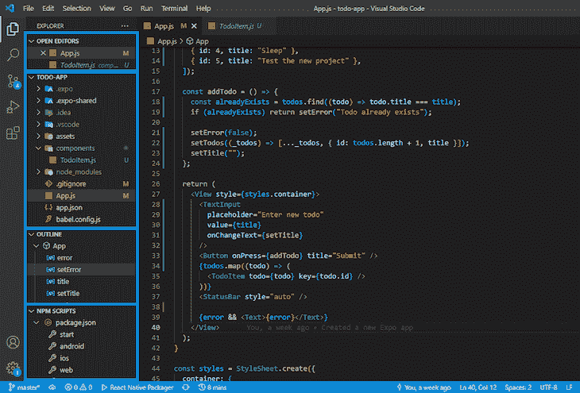
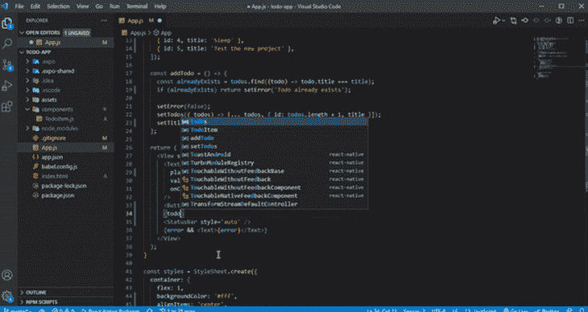
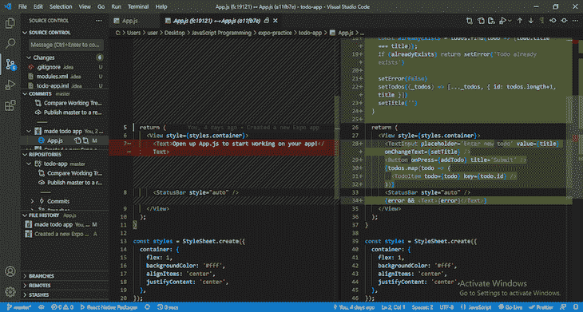
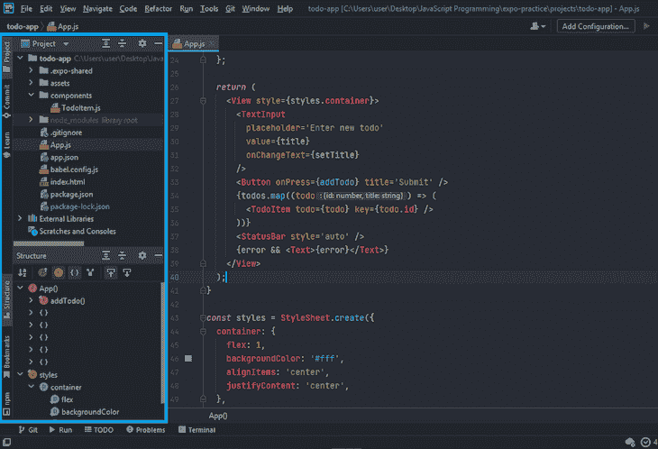
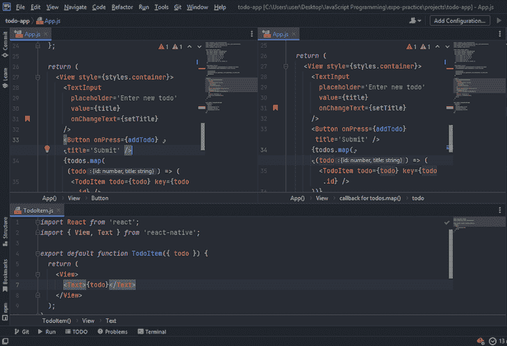
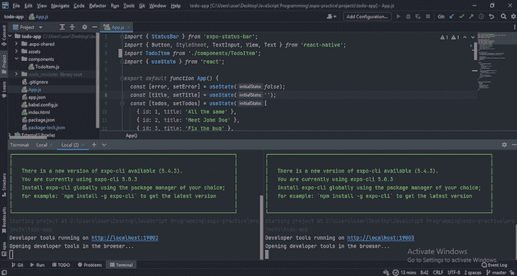
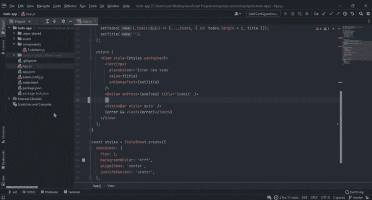
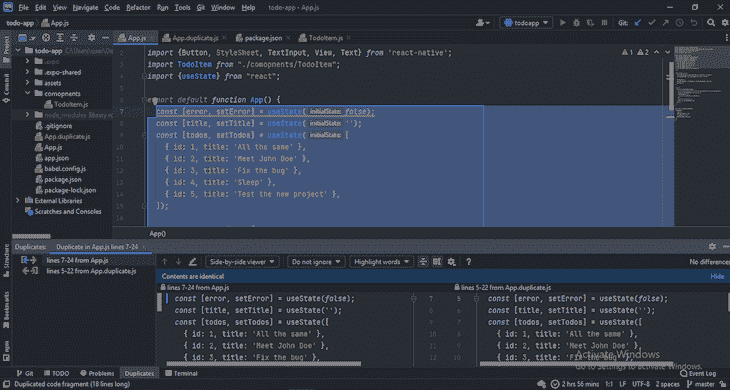
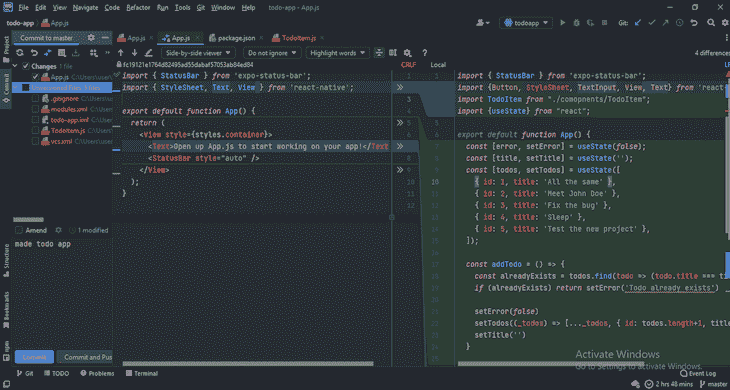

# 如何为 React Native 选择最好的 IDE

> 原文：<https://blog.logrocket.com/how-choose-best-ide-react-native/>

自 2015 年首次发布以来，React Native 已成为开发原生应用的流行框架。它之所以受欢迎有很多原因，包括庞大而活跃的社区、框架的可用性以及为支持更多原生特性而构建的组件库。

这些好处都有助于改善开发人员的体验。此外，开发社区不断构建集成开发环境(IDE)和 IDE 扩展，以支持和增强 React Native 的开发项目。

有这么多的 ide 可供选择，决定哪一个选项最能支持您的开发工作流是一个挑战。让我们看看如何选择使用 React Native 开发本机应用程序的最佳 IDE，并比较一些流行的选项。

在本文中:

我们还将使用一个[示例 React Native 项目](https://github.com/elijah-trillionz/react-native-todo-sample-app)来帮助我们更好地理解这些 ide 如何帮助我们加速 React Native 中的开发。

## 选择 React 本机 IDE 时需要考虑什么

由于 [React Native](https://reactnative.dev/) 是用 JavaScript 编写的，所以你需要一个支持 JavaScript 的 IDE 来确保它也支持 React Native。对 JavaScript 语法扩展的 [JSX 的支持也非常重要。](https://blog.logrocket.com/diving-into-the-new-jsx-transform/)

你还应该考虑性能和易用性、[调试能力](https://blog.logrocket.com/react-native-debugger-fast-debugging/)、版本控制系统(VCS)和可扩展性。

让我们看看这些因素的一些例子以及 VS 代码、WebStorm、IntelliJ IDEA 和 Atom 中其他有用的特性。

## Visual Studio 代码(VS 代码)

VS Code 是一个免费的开源代码编辑器，内置了对 JavaScript 和其他多种语言和框架的支持。[每月发布新功能](https://github.com/microsoft/vscode/wiki/Iteration-Plans)给开发者最好的开发体验。

正如我提到的，VS 代码被设计成代码编辑器，而不是 IDE。但是，它可以归类为 IDE，因为如果您需要任何非内置的功能，通常可以通过安装扩展来实现。

根据 [2021 栈溢出开发者调查](https://insights.stackoverflow.com/survey/2021#section-most-popular-technologies-integrated-development-environment)显示，VS 代码是当今开发者最常用的 IDE。它有一个非常简单的，可定制的用户界面，支持多种主题，包括自定义主题。

### VS 代码浏览器

在 VS 代码侧边栏中有一个资源管理器，包含当前项目中的所有文件和目录。资源管理器还包含打开文件的列表、当前文件中便于导航的代码结构大纲以及其他相关的项目信息。

看看示例 React 原生项目在 VS 代码资源管理器中的样子，如下所示。我用蓝框突出了侧边栏中的各个部分:

出现在 NPM 脚本部分的内容取决于您的`package.json`文件中的脚本。你可以使用这个部分[点击一个按钮，轻松运行你的 React 本地项目](https://blog.logrocket.com/complete-guide-react-native-web/)。侧边栏可以左右移动，隐藏或可见。

### VS 代码文本编辑器

在 VS 代码中需要注意的另一件事是文本编辑器。除了打开一个简单的文件，你还可以将文件分成不同的组，以及将编辑器面板分成屏幕顶部、底部、左侧和右侧的不同部分，如下所示:

在此图中，顶部面板显示了一个分成两部分的文件。每个部分都可以独立滚动，但是在一个部分中所做的任何更改都会反映在另一个部分中。

我发现这个特性对于样式化很有用:我可以在一个部分显示我创建的样式，而另一个部分显示组件。这样，我就可以传递适合每个组件的样式，而不用不停地上下滚动。

### VS 代码集成终端和其他功能

[VS 代码还包含一个集成的终端](https://code.visualstudio.com/docs/editor/integrated-terminal)，你可以用它来创建多个终端或将终端视图分成两个部分。

其他值得注意的 VS 代码特性包括:

*   将多个项目文件夹附着到一个工作空间
*   选择保存所有未保存的文件或单独保存
*   缓存未保存的更改
*   在新窗口中工作
*   通过单击创建文件或目录
*   名为 Breadcrumbs 的[导航栏](https://code.visualstudio.com/docs/editor/editingevolved#_breadcrumbs)
*   换行
*   多个光标用于多项选择
*   几十个[可定制的键盘快捷键](https://blog.logrocket.com/learn-these-keyboard-shortcuts-to-become-a-vs-code-ninja/)

### 性能和易用性

VS 代码有大量的内置特性，这些特性帮助它成为一个非常强大和智能的 IDE。支持 VS 代码的性能和易用性的一个主要特性是[智能感知](https://code.visualstudio.com/docs/editor/intellisense)。

IntelliSense 是 VS 代码中的一个通用术语，指的是它的各种代码编辑功能，如代码完成、参数信息、快速信息和相关建议。IntelliSense 内置了对 React 本机语言(JavaScript、TypeScript、JSON)的支持。

在您键入时，IntelliSense 会提供代码完成和参数信息，包括方法参数的类型推断。这是可能的，因为 IntelliSense 由 TypeScript 提供支持，它可以很容易地推断出现成的参数类型。

键入时，IntelliSense 还提供与您正在键入的内容相关的智能建议，包括代码片段。片段或模板是另一个可以加速开发的性能特性。

您可以轻松地[为您在 React Native 中经常使用的代码片段或代码块](https://blog.logrocket.com/custom-polymorphic-code-snippets-in-vs-code-e76d8cad656b/)创建代码片段。还有一些扩展为重复出现的代码提供了几十个 React 本机代码片段，比如生成一个新的组件或样式表模板。

另一个有用的智能感知功能是悬停功能。当你将鼠标悬停在一段代码上时，你可以看到一段简短的描述。该描述告诉您代码是什么，包括推断的类型，并提供相关文档或代码声明位置的链接。

代码动作是另一个提高代码质量的性能特性。选择一段或一块代码后，您可以看到源代码重构和对检测到的问题的快速修复，例如重命名变量、转换函数等等。

通常，您会发现需要更改在多个文件中使用的文件名或变量名。VS 代码的查找和替换功能是一个很好的方法。

查找和替换功能搜索关键字的所有匹配项，并用新单词替换它。通常，更改文件、变量、函数或组件的名称会提示 VS 代码更改项目中使用的名称。

### 在 VS 代码中调试

React Native 提供了一种在浏览器中调试代码的方法，但是如果可以在编辑器中调试代码，通常会更方便。

VS 代码带有一个内置的高级调试器，并且[为您的 React 原生项目设置这个调试器是非常容易的](https://blog.logrocket.com/debugging-react-native-vs-code/)。设置完成后，只需单击一下，就可以轻松地运行和调试项目，并单步执行、单步执行、单步执行、暂停、重新启动和停止调试器。

你可以很容易地切换文件中任何一行代码的断点，就像在谷歌的 Chromium 浏览器中一样。

还有一个调试控制台，您可以在其中查看记录的消息。记录的消息由日志点提供支持。与断点不同，它们在调试控制台中记录自定义消息，而不是中断调试器。

### VS 代码中的版本控制系统

VCS 是一个非常重要的工具，它帮助团队跟踪和管理代码随时间的变化。VS 代码的 VCS 是 Git。

VS 代码自带对 Git 的内置支持。这个特性可以帮助您轻松地初始化和克隆 Git 存储库、进行未暂存的更改、暂存和提交文件、比较提交、比较暂存文件、创建分支等等。

还有一些扩展通过 Git 增强了 VS 代码中的代码管理能力。

其中一些扩展提供了关于文件中每一行代码的提交/暂存信息。其他的可以让你把你的 GitHub 和 VS 代码连接起来，帮助你从 GitHub 跟踪你的项目的问题，还有很多其他的功能。

### VS 代码中的可扩展性

有了所有的内置特性和代码，我们可以轻松地结束一天的工作，拥有足够好的开发体验。然而， [VS 代码最受欢迎是因为它的可扩展性](https://blog.logrocket.com/writing-vs-code-extensions-in-javascript/)通过扩展是由个人开发者和团队完成的。

VS 代码中有数百个 React 原生扩展，有助于使用 VS 代码更容易、更快速地开发 React 原生应用。上图显示了 VS 代码中 React 本地扩展的搜索结果的一个小样本。

以下是您可能会发现在 React 原生项目中有用的几种类型的扩展:

*   提供 React 本机代码片段
*   增强 VS 代码的调试能力
*   林挺，或发现问题并提供自动修复
*   格式化或美化您的代码
*   自动重命名 JSX 组件的开始和结束标记
*   制作待办事项列表
*   增强 VS 代码的 VCS 能力
*   美化文件或目录图标
*   跟踪花费在项目上的时间

VS 代码中的扩展在发布之前不会被审查，所以在安装扩展时应该记住这一点。写得不好的扩展会降低 VS 代码的性能，导致糟糕的开发体验。

## 网络风暴

软件开发公司 [JetBrains 为 JavaScript 和其他相关技术，如 JSON 或 TypeScript，提供了一个名为 WebStorm](https://www.jetbrains.com/webstorm/) 的 IDE。在 2021 年栈溢出开发者调查中，它被选为最可怕和最想要的 IDE 之一。

WebStorm 的个人第一年使用费用为 59 美元，这是它不如 VS Code 受欢迎的一个主要原因。但是请相信我:如果你用过 WebStorm，你会明白它物有所值。

虽然 VS 代码在开发人员中很受欢迎，但它仍然被设计为代码编辑器，因此可能不太适合大型项目。另一方面，WebStorm 是一个智能而强大的 IDE，具有许多内置特性，对于任何规模的项目都很有价值。

学生、开源开发者和其他一些人可以获得 WebStorm 和其他 JetBrains IDEs 的免费许可。即使你不能免费获得 WebStorm，在你决定不使用它之前，让我们来看看它是如何加快你的开发速度的。

### 网络风暴用户界面

像每一个 JetBrains IDE 一样，WebStorm 的 UI 是可定制的，使用简单。你可以随意移动任何面板或横条。WebStorm 还支持任何其他主题，包括定制的主题。

就像 VS 代码一样，WebStorm 侧边栏包含当前项目的文件和目录列表。这个侧栏还包含一个概述文件中代码块结构的部分。您可以使用此部分轻松浏览文件。

在 WebStorm 中导航的另一种方式是使用列出代码中书签和断点的部分。您可以为一行代码添加书签，并在需要时轻松导航到该行代码。

也像在 VS 代码中一样，侧边栏中有一个 NPM 脚本部分，可以让你运行`package.json`中可用的 NPM 脚本命令。这个侧边栏的每个部分都可以拖放到编辑器的顶部、底部、左侧或右侧，并使其可见或隐藏。

### 网络风暴文本编辑器

WebStorm 中的编辑器可以分为上、下、左、右四个部分。单个文件也可以分成不同的部分，这样您就可以轻松地处理文件的不同部分，而不必上下滚动。

### WebStorm 集成终端和其他功能

WebStorm 也有一个集成的终端，您可以使用它打开多个终端或将一个打开的终端分成多个部分。

如果这些特性听起来很熟悉，那是因为您可以在 VS 代码中找到内置的或作为扩展的特性。然而，虽然您可能需要扩展来将 VS 代码用作 IDE，但是您需要的大多数或所有特性都内置在 WebStorm 中。

我们可以花一整天的时间来讨论 WebStorm 的内置特性，但仍然无法涵盖所有内容。面包屑、换行、附加多个项目、保存文件、TODO 注释、多个光标等等都存在于 WebStorm 中。

这些内置特性使 WebStorm 比 VS Code 等免费选项更具优势，尤其是在大型项目中。

### WebStorm 的性能和易用性

从一开始，WebStorm 就可以轻松地生成一个新的 React 原生项目，只需点击几下鼠标，而不是搜索命令来启动和运行新项目。

当您编码时，JavaScript 的代码完成特性有助于在 WebStorm 中获得良好的开发体验。这些功能包括:

*   反应原料药和 JSX
*   代码或代码片段建议
*   自动导入
*   快速信息
*   参数信息
*   道具信息
*   用字典进行拼写检查

WebStorm 可以在您编码时检测问题，如冗余，并提供修复。它还可以检测重复，并为您选择的代码提供安全的重构(如果有的话)。

您可以在 WebStorm 的弹出窗口中查看参数信息。该弹出窗口包含关于可用参数的信息，包括它们的推断数据类型。

WebStorm 可以推断参数的类型，并在使用错误的数据类型时抛出警告指示。当您将鼠标悬停在警告指示符上时，它会提供有关变量类型不适合给定参数的原因的更多信息。

类似地，将鼠标悬停在所有其他警告和错误指示器上将提供更多信息和快速修复(如果可用)。WebStorm 中快速修复的警告示例包括未使用的变量、未使用的导入、冗余、数据类型冲突等等。

在 WebStorm 中发现问题并提供快速修复是非常常见的。这是通过已经安装的 lint 插件实现的。

与参数信息一样，WebStorm 也提供了各种组件的属性信息，如果缺少定制组件所需的属性，它会抛出一个警告指示器。WebStorm 还推断组件道具的数据类型。

当你将鼠标悬停在关键词、变量、方法或组件上时，WebStorm 会提供该代码所代表的内容的简短描述。它还提供了文档的链接(如果有)。

还有一个跳转到源代码的功能，可以让你跳转到你悬停的源代码。跳转到源代码不局限于你写的代码；例如，您可以跳转到声明 React Native 中的`Text`组件的地方。

WebStorm 中的自动导入和自动完成功能就像 VS 代码一样，但是更快更高级。

自动标签完成是 WebStorm 自带的另一个很酷的功能。您可以使用自动标记完成功能自动重命名结束标记，就像重命名开始标记一样，反之亦然；他们独立工作。

WebStorm 中的重复代码片段检查有助于防止你重复自己，这有利于代码管理。

当检测到重复时，会显示一个警告指示器。只需将鼠标悬停在警告指示器上，就可以查看该代码块在其他什么地方被使用过，这样就可以进行必要的调整。

复制面板是可定制的。WebStorm 也可以设置为基于特定条件检测重复。

WebStorm 中支持的一些安全重构是文件重命名、变量重命名、将箭头函数转换为命名函数以及连接变量声明。

重命名变量或文件会自动重命名任何出现的变量名或文件名。重命名的多次出现或冲突通常会触发一个确认，告诉您出现的位置。

WebStorm 中还有许多其他很酷的性能特性，包括:

*   访问本地历史
*   查找和比较代码用法
*   [到处寻找](https://www.jetbrains.com/help/webstorm/searching-everywhere.html)
*   将文件与剪贴板进行比较
*   自动生成版权
*   推送至 GitHub gist
*   生成代码结构图
*   在 WebStorm 中与我合作[代码](https://www.jetbrains.com/help/webstorm/code-with-me.html)

### 在 WebStorm 中调试

WebStorm 为[调试 React 本地应用](https://www.jetbrains.com/help/webstorm/react-native.html#ws_react_native_debugger_process_chrome)提供了很大的灵活性，提供了大量的内置函数。设置完成后，只需点击一个按钮，您就可以在模拟器或物理设备中轻松运行或调试您的应用程序。

默认情况下，WebStorm 依赖 Chrome 和其他基于 Chrome 的浏览器来调试 JavaScript 代码；当你运行调试器时，一个 Chrome 窗口将会打开并连接到 WebStorm。如果你不想要 Chrome 窗口，你就得[设置 Chrome 无头](https://www.jetbrains.com/help/webstorm/react-native.html#ws_react_native_debugger_process_chrome)。

就像在 VS 代码和 Chromium 浏览器中一样，您可以轻松地为任何一行代码切换断点。您可以单步执行、单步执行、单步退出、暂停、重新启动和停止调试器会话。

### 网络风暴中的 VCS

在 WebStorm 中，您可以轻松地将 VCS 附加到 React 原生项目中。一旦启用，您可以执行多种操作，如提交、比较更改、显示历史、创建和读取或删除分支、推送或拉取、存储或取消存储更改，等等。

默认情况下，WebStorm 通过一组捆绑插件在 IDE 级别启用 VCS 集成。WebStorm 还提供了[关于版本控制](https://www.jetbrains.com/help/webstorm/version-control-integration.html)的有用文档。

### WebStorm 中的可扩展性

当你安装 WebStorm 时，已经安装并启用了一些插件，包括上面列出的一些“内置”功能。然而，还有其他可用的插件，使 WebStorm 可扩展。

WebStorm 中不需要插件，但是有一些推荐用 JavaScript 开发。例如:

*   码头工人
*   HTML 工具
*   实时预览
*   节点. js
*   JavaScript 调试器
*   较美丽
*   TSLint
*   降价
*   厚颜无耻
*   饭桶
*   httpclient

您可以很容易地禁用那些您不想要的，但是很有可能您需要它们中的大部分。

你也可以从市场上安装由个人或团队开发的[插件。这些插件在发布前都是经过 JetBrains 验证的，所以你不需要太担心写得不好的插件。](https://blog.jetbrains.com/webstorm/2021/09/building-a-plugin-for-webstorm-part-1/)

## 对方

React Native 还有许多其他的 ide。这些选项非常有用，并且可能具有 React 本地开发人员可能需要的特性之外的附加特性。然而，大多数倾向于类似于 VS 代码和 WebStorm。

让我们看看另外两个流行的 React 原生 ide:IntelliJ IDEA 和 Atom。

由于我们已经回顾了 VS 代码和 WebStorm 中的性能和易用性、调试、VCS 和可扩展性，我们将重点关注 IntelliJ IDEA 和 Atom 的一些显著特性。

### 智能理念

IntelliJ IDEA 是一个用于 Java 开发和其他 JVM 语言的 IDE，比如 Kotlin。这是一个来自 JetBrains 的智能 IDE，具有与 WebStorm 相同的易于使用的 UI。

IntelliJ IDEA 社区版是免费和开源的，而 IntelliJ IDEA Ultimate 要求您在 30 天免费试用后购买许可证。如果您已经购买了 WebStorm 的许可证，您不需要为 IntelliJ IDEA Ultimate 购买新的许可证。

IntelliJ IDEA Ultimate 具有 WebStorm 的所有功能，例如内置对 JavaScript 和其他相关技术的支持。它还附带了应用程序开发功能，作为 React 原生开发人员，您可能不需要这些功能。

### 原子

Atom 是 GitHub 团队开发的一个流行的可破解的 JavaScript 文本编辑器。像 VS 代码一样，Atom 可以像您的 React 原生项目的 IDE 一样工作，但是您可能需要安装许多包来实现您需要的功能。

Atom 提供的一些优势包括对调试的内置支持、智能自动完成、直接使用 Git 和 GitHub 的能力等等。

## 结论

我们今天已经列出了很多 ide，但是你并不需要所有的。问题是:你应该选择哪一个？我是这样想的:

如果你想要有一个很棒的社区的免费且足够好的东西，那么我建议你使用 VS 代码。但是，如果你不介意为更多的功能和更流畅、更快的体验付费，或者如果你有一个大型、复杂的项目，那么我会推荐 WebStorm 或 IntelliJ IDEA。

既然有很多优质的 IDEs 可以选择，那么选择就没有对错之分。重要的是你的偏好，以及你觉得哪个选项会让你更舒服、更有效率。

感谢阅读和快乐的黑客。

## [LogRocket](https://lp.logrocket.com/blg/react-native-signup) :即时重现 React 原生应用中的问题。

[LogRocket](https://lp.logrocket.com/blg/react-native-signup) 是一款 React 原生监控解决方案，可帮助您即时重现问题、确定 bug 的优先级并了解 React 原生应用的性能。

LogRocket 还可以向你展示用户是如何与你的应用程序互动的，从而帮助你提高转化率和产品使用率。LogRocket 的产品分析功能揭示了用户不完成特定流程或不采用新功能的原因。

开始主动监控您的 React 原生应用— [免费试用 LogRocket】。](https://lp.logrocket.com/blg/react-native-signup)