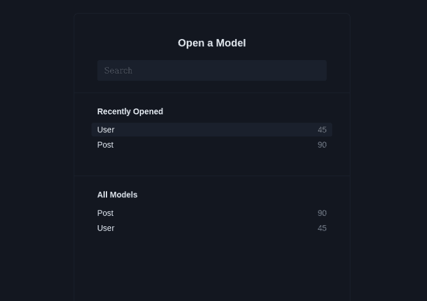
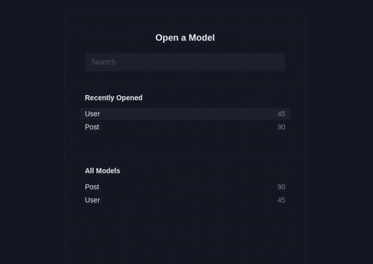
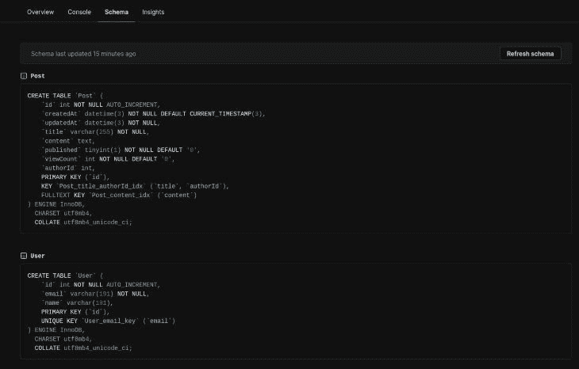

# 如何在 Prisma 中配置索引

> 原文：<https://blog.logrocket.com/how-configure-indexes-prisma/>

> 对 Node.js、Git 和 Prisma 的基本理解和知识是本教程的先决条件。

在涉及大型数据集的情况下，查询数据对于基础架构和业务运营来说都是一项既耗时又昂贵的活动。

举个例子，我们试图在一个包含数百万行数据的表中获取满足查询`SELECT * FROM users WHERE 'email' = '[[email protected]](/cdn-cgi/l/email-protection)'`的数据(可能由一些电子商务企业操作)。

数据库需要对表`users`进行顺序扫描，读取每条记录，直到它到达满足我们查询的行，并将数据返回给我们的应用程序。

这样一个过程是昂贵的，因为它将花费大量的时间来完成这个查询，这些时间将干扰我们想象的电子商务业务的顺利执行，因为我们仍然期望在正常情况下对这个数据库进行几次查询。

在这种情况下，我们需要使用数据库索引，这种数据库数据结构可以帮助我们摆脱困境。

在本教程中，我们将向您介绍数据库索引。以下是我们将要介绍的内容:

## 什么是数据库索引？

在数据库中，索引是一种特殊的数据结构，它通过帮助快速执行查询来优化数据访问，从而提高数据库性能。

在上面的场景中，索引有助于快速访问数据库查询的信息，而不必读取用户表中的所有数据。

解释数据库索引的一个最好的例子是我们通常在书的末尾找到的索引页。

通常，当我们只需要阅读书的某些部分时，我们使用在书的背面找到的索引来容易地找到我们感兴趣的主题或题目的页码。然后，我们跳转到目标页面，消费我们正在寻找的信息。

这节省了我们用来浏览一本书的每一页来寻找我们想要阅读的内容的时间。

## 数据库索引的重要性

正如所观察到的，数据库索引将使具有大型数据集的数据库中的数据检索操作——在正常情况下需要几分钟、几小时甚至几天才能完成——只需几秒钟或更短时间即可完成。

这将转化为我们的应用程序的平稳运行，进而是业务运营，最终是收入(因为向用户交付服务所用的时间，尤其是在业务应用程序中，通常会直接影响收入)。

## Prisma 是什么？

Prisma 是一个用于 JavaScript 应用程序的对象关系映射(ORM)工具。对象关系映射是一种编程技术，它使我们能够从背后的数据库中抽象出代码。我们在对人类友好的模式中建模我们的数据，最多，很少担心特定于数据库的差异。

这意味着我们可以简单地改变正在使用的数据库，而不需要对我们的数据模型进行大的改变——创建代码(最少地应用改变)。ORM 有助于简化从我们的数据库中检索数据，因为我们不用编写显式的数据库查询来从数据库中获取数据，我们只与特定类的对象交互，这些对象表示在它们内部创建的记录。

Prisma 有两个主要组件:Prisma [客户端](https://www.prisma.io/client)和 [Prisma 迁移](https://www.prisma.io/docs/concepts/components/prisma-migrate)。

Prisma client 是一个查询构建器，可以根据我们在应用程序中定义的 Prisma 模式自动生成查询。

Prisma Migrate 是一个数据库模式迁移工具，它使我们能够在进行更改时保持数据库模式与 Prisma 模式同步，同时维护数据库中的现有数据。

Prisma 集成了许多流行的数据库，包括 MySQL、SQLite、PostgreSQL、SQL Server、MongoDB 和 CockroachDB。

## 在 Prisma 中配置索引

从 Prisma 3 . 5 . 0 及以上版本开始，可以通过`extendedIndexes`预览功能启用索引。但是，从版本 4.0.0 和更高版本开始， [Prisma](https://blog.logrocket.com/effortless-database-schema-migration-prisma/) 允许开箱即用地配置数据库索引，但有一些例外，我们将在后面看到。

通常，我们可以配置我们的数据库使用单列或双列索引，Prisma 对两者都有支持。

Prisma 中的索引可以使用`@@index`属性进行配置。可以使用以下属性参数进一步配置该属性:

*   `fields`:`fields`参数是这个列表中唯一必需的参数，它允许您列出在我们的数据模型中被索引的表列
*   `name`:`name`参数允许您为正在定义的索引设置一个名称
*   `map`:如果没有使用`name`参数显式提供，该参数允许您定义索引名称的命名约定。Prisma 默认的语法是:`tablename.field1_field2_field3_unique`
*   `length`:该参数允许您指定在`String`和`Bytes`类型上索引的值的子部分的最大长度。它只能在 MySQL 数据库上设置。这个参数对于这些类型来说非常重要，尤其是在全值超过 MySQL 的索引大小限制的情况下
*   `sort`:此参数允许您指定索引条目在数据库中的存储顺序。支持的选项有`Asc`和`Desc`
*   `type`:这是一个 PostgreSQL 专用(仅在 PostgreSQL 数据库中可用)参数，允许您支持除 PostgreSQL 的默认`BTree`访问方法之外的索引访问方法。除`BTree`外，支持`Hash`、`Gist`、`Gin`、`SpGist`和`Brin`的访问方式
*   `clustered`:此参数允许您配置索引是聚集的还是非聚集的。它仅在 SQL server 数据库上受支持
*   `ops`:这是另一个仅支持 PostgreSQL 的参数，允许您为某些索引类型定义索引操作符

### 使用 Prisma 设置 JavaScript 项目

> 在继续之前，需要安装 Git、Node.js 和一个 JavaScript 包管理器(Node.js 通常预装了 npm)。

为了使我们的学习过程直观，我们将在一个项目上工作，我们将配置索引。

首先，在您的终端上运行以下命令，复制我们将要处理的项目的基本源代码，然后切换到它的目录:

```
git clone [email protected]:xinnks/indexes-in-prisma.git

cd indexes-in-prisma

```

我们的项目是一个包含博客数据的 Express.js 服务器，典型的前端博客可以使用这些数据。

您可以通过观察我们在`./prisma/schema.prisma`文件中处理的数据模型来了解这个想法。

在`./src/index.js`中浏览我们的服务器端点，您会看到它提供注册请求，获取用户数据，并在用户帖子上运行 CRUD 操作。我们可以看到诸如`Post`模型的`title`和`content`列这样的字段，它们被查询以获取帖子提要。

我们可以观察到被频繁查询的其他字段是`User`和`Post`模型 id。我们不会为这些字段创建索引，我们将在不久的将来了解原因。

让我们看看如何为`Post`模型的`title`和`content`列配置索引。

在继续之前，运行`npm install`来安装项目的依赖项。

接下来，将这个项目根目录下的`sample.env`文件重命名为`.env`。打开产生的环境变量文件`.env`，下面应该是包含的内容。

```
DATABASE_URL_SQLITE='file:./dev.db'
DATABASE_URL_MYSQL=
DATABASE_URL_MONGODB=

```

随着我们继续这个例子，我们将用不同的数据库 URL 填充这些环境变量，这些 URL 属于我们将为其配置索引的数据库。

### 在 SQL 数据库中配置索引

到目前为止，我们知道可以通过使用 Prisma 中的`@@index`属性来添加索引。但是，由于 SQL 数据库中的约束和索引几乎是相似的，所以当为列定义唯一约束时，SQL 数据库会创建相应的唯一索引。

这意味着每一个`@unique`列也会被分配一个索引。如果我们喜欢，我们可以使用约束来为 SQL 数据库添加索引，而不是使用`@@index` API。

让我们演示如何使用 Prisma 在 SQLite 数据库中配置索引。

#### SQLite 数据库中的索引

您会注意到，我们应用程序的基本状态是 SQLite 就绪。因此，运行下面的 Prisma 命令将创建数据库文件`./prisma/dev.db`，创建数据库迁移，生成与在`./prisma/schema.prisma`文件中找到的数据模型相对应的 Prisma 客户端，并按照在`./prisma/seed.js`中找到的指令播种我们的数据库:

```
#npm
npx prisma migrate dev --name init

#pnpm
pnpm dlx prisma migrate dev --name init

```

由于我们已经在`package.json`文件中的`prisma`键的`seed`键中设置了`node prisma/seed.js`命令，所以数据会被 Prisma 迁移命令自动植入。

通过运行 Prisma studio 命令`npx prisma studio`，我们可以预览我们的数据库，并看到已经被植入到`User`和`Post`模型中的数据。





如果您打开在运行上面的 Prisma `migrate`命令后创建的迁移文件，您将看到已经为`User`型号`email`列创建了一个唯一的索引:

```
-- CreateIndex
CREATE UNIQUE INDEX "User_email_key" ON "User"("email");

```

这是上面迭代的结果:SQL 数据库为声明的约束创建索引。

至此，您可以通过运行`npm run dev`并访问该项目中可用的各种端点来本地部署 REST API，期望从它们那里获得预期的响应。

在部署服务器之后，尝试访问`/feed`端点。

*注意，SQLite 不支持将* `ALTER TABLE` *语句与* `ADD CONSTRAINT` *一起操作。因此，如果您决定使用约束来为您的 SQLite 数据库定义索引，您最初只能使用* `CREATE TABLE` *操作来这样做。*

现在，通过向在`./prisma/schema.prisma`文件中找到的`Post`模型添加以下属性，继续为这个 SQLite 数据库配置一个双列索引:

```
model Post {
  id        Int      @id @default(autoincrement())
  createdAt DateTime @default(now())
  updatedAt DateTime @updatedAt
  title     String
  content   String?
  published Boolean  @default(false)
  viewCount Int      @default(0)
  author    User?    @relation(fields: [authorId], references: [id])
  authorId  Int?

  @@index([title, content])
}

```

最后一行添加了索引，带有属性`@@index([title, content])`及其相应的参数，即`title`和`content`列。

再次，随后运行 Prisma `migrate`命令，给`--name`标志分配一个合适的名称:

```
#npm
npx prisma migrate dev --name add_some_indexes

#pnpm
pnpm dlx prisma migrate dev --name add_some_indexes

```

当我们观察在`prisma`迁移目录下新创建的迁移文件时，我们将看到下面的索引创建 SQL 脚本，它具有我们在`@@index`属性上定义的相同参数:

```
-- CreateIndex
CREATE INDEX "Post_title_content_idx" ON "Post"("title", "content");

```

#### MySQL 数据库中的索引

在 [Planetscale](https://planetscale.com) 或任何其他与 Prisma 集成的 MySQL DBaaS 服务上创建一个新的数据库。如果你使用过 Planetscale，并且是新手，使用[这个指南](https://planetscale.com/docs/tutorials/automatic-prisma-migrations)来学习如何创建与 Prisma 的平滑集成。

获取 MySQL 数据库的 URL，转到项目根目录下的`.env`文件，并将其赋给`DATABASE_URL_MYSQL`变量。

用以下代码更新`./prisma/shema.prisma`文件中的`generator`和`Post`模型:

```
generator client {
  provider = "prisma-client-js"
  previewFeatures = ["fullTextIndex", "referentialIntegrity"]
}

model Post {
  id        Int      @id @default(autoincrement())
  createdAt DateTime @default(now())
  updatedAt DateTime @updatedAt
  title     String   @db.VarChar(255)
  content   String?  @db.Text
  published Boolean  @default(false)
  viewCount Int      @default(0)
  author    User?    @relation(fields: [authorId], references: [id])
  authorId  Int?

  @@fulltext([content])
  @@index([title, authorId])
}

```

观察上面修改后的数据模型模式，您可以看到，除了常规索引，我们还添加了一个新的`@@fulltext`属性，并为其指定了`content`列名。

从 3.0.6 版本开始，Prisma 在 MySQL 和 MongoDB 数据库中引入了对全文索引的迁移和内省的支持。这是通过`fullTextIndex`预览功能提供的`@@fulltext`属性实现的。这解释了在生成器的`previewFeatures`属性上添加`fullTextIndex`的原因。

接下来，使用 Prisma `db push`命令将模式推送到在线数据库`./prisma/schema.prisma`中。

本例中的 Prisma `db push`命令基于 Planetscale 上托管的一个远程 MySQL 数据库。因此，使用了 Prima `db push`命令。在使用本地 MySQL 设置时，您可以像我们在 SQLite 示例中一样使用`migrate`命令:

```
# npm
npx prisma db push

# pnpm
pnpm dlx prisma db push

```

当您查看数据库模式时，无论它位于何处，您都会看到类似这样的内容。



### 在 NoSQL 数据库中配置索引

正如我们上面讨论的，Prisma 支持 MongoDB，这是最流行的 NoSQL 数据库之一。而且，从 3.12.0 版本开始，Prisma 已经支持在[复合类型](https://www.prisma.io/docs/concepts/components/prisma-schema/data-model#defining-composite-types)上定义索引。

复合类型(MongoDB 中的嵌入式文档)通过允许您定义以类似于 Prisma 模型的方式结构化和类型化的新对象类型，为嵌入在其他记录中的文档提供支持。

除了我们已经看到的索引声明 API 之外，Prisma 还允许使用嵌入文档的字段(复合类型)作为索引字段参数。

因此，在使用 MongoDB 时，我们可以将单个列索引定义为`@@index([field_name])`、`@@index([compositeType.field])`，将一个或多个模型和复合类型字段(如`@@index([field_name, compositeType.field])`和`@@index([compositeType.field_one, compositeType.field_two], …)`)混合起来定义多个列索引。

让我们继续在 MongoDB 模型中创建一个多列索引，在索引字段参数中使用文档的复合字段。

首先，更新`DATABASE_URL_MONGODB`环境变量，将您的 MongoDB 数据库的 URL 分配给它。

用以下代码修改我们项目中的`./prisma/schema.prisma`文件:

```
generator client {
  provider = "prisma-client-js"
  previewFeatures = ["fullTextIndex"]
}
datasource db {
  provider = "mongodb"
  url      = env("DATABASE_URL_MONGODB")
}

model User {
  id    String  @id @default(auto()) @map("_id") @db.ObjectId
  email String  @unique
  name  String?
  posts Post[]
}

type Banner {
  height  Int?
  width   Int?
  url     String?
}

model Post {
  id        String  @id @default(auto()) @map("_id") @db.ObjectId
  createdAt DateTime @default(now())
  updatedAt DateTime @updatedAt
  title     String
  content   String?
  banner    Banner?
  published Boolean  @default(false)
  viewCount Int      @default(0)
  author    User?    @relation(fields: [authorId], references: [id])
  authorId  String?   @db.ObjectId

  @@fulltext([title(sort: "Asc"), content])
  @@index([title, banner.url], map: "title_banner_url_idx")
}

```

在上面的 Prisma 模式中，我们将 datasource provider 修改为“mongodb”，声明复合类型`Banner`，并将其作为嵌入文档添加到`Post`模型中。

我们还设置了与 MongoDB 相对应的适当的模型 id。

我们为`Post`模型定义了两个索引:一个是由`title`和`content`列组成的多列`fulltext`索引，其中`title`列按升序排序。第二个索引是另一个多列索引，由`title` post 模型列和`Banner`复合类型的`url`字段组成。

此外，用以下代码替换`./prisma/seed.js`文件中的代码:

```
const { PrismaClient } = require('@prisma/client')
const userData = require("./data.json")
const banners = require("./banners.json")

const prisma = new PrismaClient()

async function main() {
  console.log(`Start seeding ...`);
  await prisma.$connect();

  try {
    let index = 0
    for (const u of userData) {
      const uPosts = u.posts.map(x => {
        index++
        return Object.assign(x, {
          banner: banners[index]
        })
      })
      delete u.posts;
      const user = await prisma.user.create({
        data: u,
      })

      await prisma.post.createMany({
        data: uPosts.map(p => Object.assign(p, {
          authorId: user.id
        })),
      })
      console.log(`Created user with id: ${user.id}; added ${uPosts.length} posts`)
    }
    console.log(`Seeding finished.`)
  } catch(err) {
    console.log({err})
  }
}

main()
  .then(async () => {
    await prisma.$disconnect()
  })
  .catch(async (e) => {
    console.error(e)
    await prisma.$disconnect()
    process.exit(1)
  })

```

然后，运行 Prisma 的`generate`和`seed`命令，将 Prisma 客户端代码和种子数据重新创建到 MongoDB 数据库中:

```
npx prisma generate && npx prisma db seed

```

从这里开始，您可以继续向我们的服务器发出请求，使用数据库索引会带来预期的好处。

请注意，在我们工作的项目中调用请求时，不会注意到太大的差异，因为它由非常小的数据集组成。在使用大型数据集时，使用索引的优势是显而易见的。

如果管理不当，数据库索引会带来额外的写操作和内存消耗的开销成本；并非每个被查询的列都需要被索引。这样做可能会对数据库的存储和写操作产生不利影响。

如果使用得当，索引可以优化对频繁查询的数据的访问并提高性能。反之亦然，如果不小心添加它们，我们就会面临负面影响的风险，包括数据库大小和写入效率。

## 摘要

总的来说，我们在本文中讨论了以下内容:

*   什么是数据库索引，以及它们对数据库操作的重要性
*   Prisma 是什么
*   如何在 JavaScript 项目中使用 Prisma，在这里是一个 Express.js 应用程序
*   如何使用 Prisma 在 SQL 和非 SQL 数据库中配置数据库索引
*   各种 Prisma 模型索引参数、它们的用例以及它们所支持的数据库类型
*   各种数据库在配置索引时的差异和相似之处

要了解更多关于 Prisma 的信息，并了解它与各种数据库的集成，您可以访问 Prisma 的官方文档。

## 使用 [LogRocket](https://lp.logrocket.com/blg/signup) 消除传统错误报告的干扰

[](https://lp.logrocket.com/blg/signup)

[LogRocket](https://lp.logrocket.com/blg/signup) 是一个数字体验分析解决方案，它可以保护您免受数百个假阳性错误警报的影响，只针对几个真正重要的项目。LogRocket 会告诉您应用程序中实际影响用户的最具影响力的 bug 和 UX 问题。

然后，使用具有深层技术遥测的会话重放来确切地查看用户看到了什么以及是什么导致了问题，就像你在他们身后看一样。

LogRocket 自动聚合客户端错误、JS 异常、前端性能指标和用户交互。然后 LogRocket 使用机器学习来告诉你哪些问题正在影响大多数用户，并提供你需要修复它的上下文。

关注重要的 bug—[今天就试试 LogRocket】。](https://lp.logrocket.com/blg/signup-issue-free)