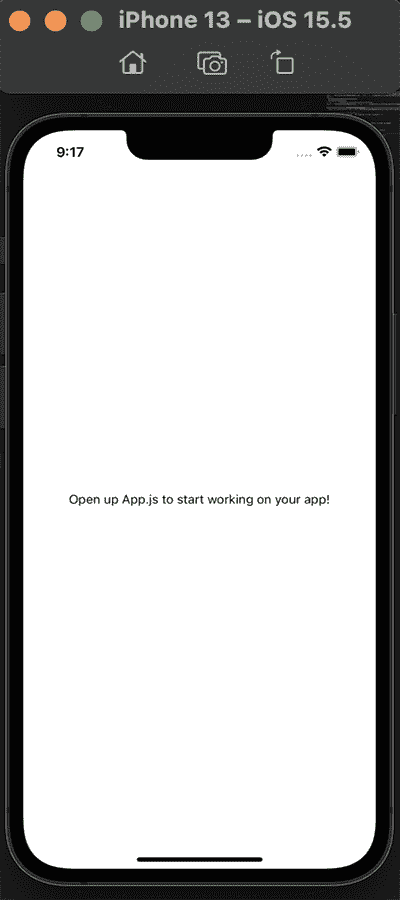
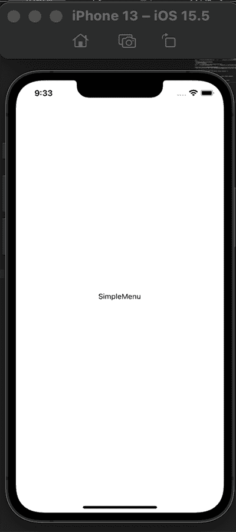
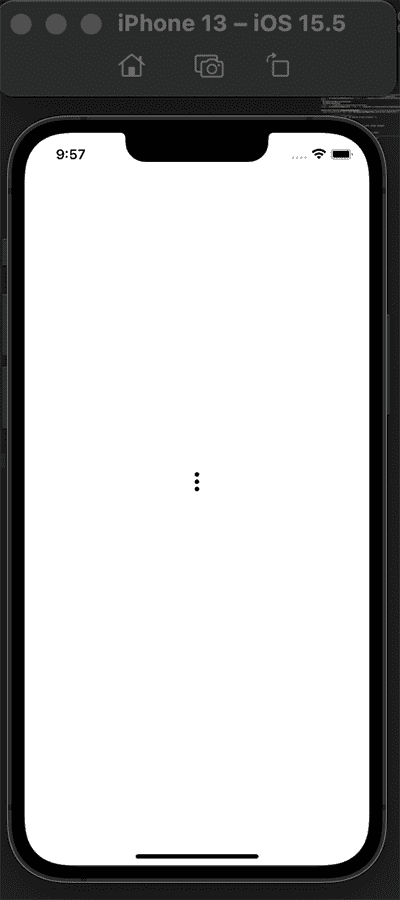
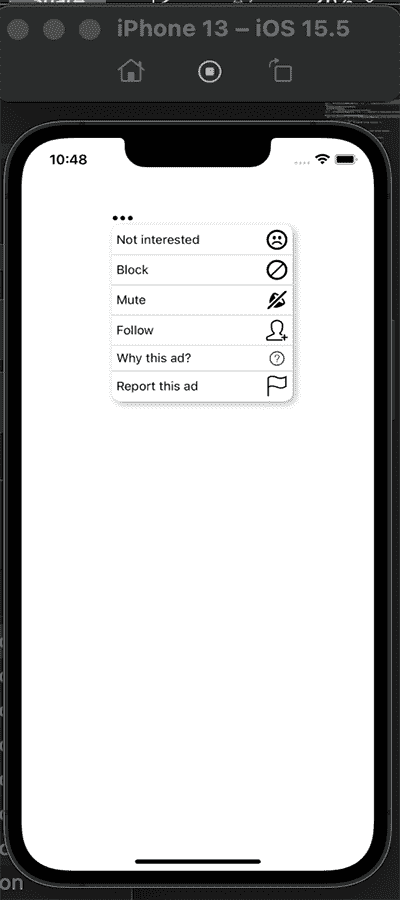

# 如何在 React Native 中创建定制的弹出菜单

> 原文：<https://blog.logrocket.com/how-create-customized-pop-up-menus-react-native/>

如今，弹出菜单已经成为移动应用程序中重要且常见的一部分。当我们需要在单击按钮后提供一些菜单选项时，弹出菜单会很方便，这主要是因为我们不必使用额外的抽屉导航器。

弹出菜单通常显示在触发它的元素的顶部，如下面这个来自 Twitter 的例子所示:


弹出菜单是改进 React 本机应用程序 UI 的一个好方法。它们提供了一个溢出菜单，如上所示，这些可以作为一个项目或按钮的辅助动作。

在本文中，我们将通过不同的例子来探索如何在 React Native 中创建弹出菜单。我们将创建一个基本的弹出菜单，一个带有图标和分隔线的自定义弹出菜单，以及一个带有滚动视图的弹出菜单(也包括图标和分隔线)。

## 设置我们的环境

为了建立开发环境，我们将使用 Expo 来引导我们的项目。首先，我们将在终端中运行以下命令:

```
npx create-expo-app rn-popup-menu 

```

这将创建一个名为`rn-popup-menu`的 Expo 项目。

接下来，我们将安装创建弹出菜单所需的库。这个库是 react-native-popup-menu，[在它的 GitHub repo 上找到这里](https://github.com/instea/react-native-popup-menu):

```
npm install react-native-popup-menu --save

```

为了在模拟器/仿真器中启动项目，我们将运行命令`npx expo start`并为 iOS 选择 **i** ，为 Android 选择 **a** 。现在，我们应该在 iOS 模拟器中看到这个:



接下来，我们将创建一个名为`components`的文件夹。我们将在这里创建不同的弹出菜单示例。

[为了创建一个由点击按钮触发的基本弹出菜单](https://blog.logrocket.com/creating-a-pop-up-modal-in-react-native/)，我们将在我们的`component`文件夹中创建一个名为`SimpleMenu.js`的文件。该组件将被呈现在`App.js`文件中:

```
// SimpleMenu.js
import { StyleSheet, Text, View } from "react-native";
import React from "react";

const SimpleMenu = () => {
 return (
   <View style={styles.container}>
     <Text>SimpleMenu</Text>
   </View>
 );
};

export default SimpleMenu;

const styles = StyleSheet.create({
 container: {
   flex: 1,
   backgroundColor: "#fff",
   justifyContent: "center",
   alignItems: "center",
 },
});

```

```
// App.js
import { StyleSheet, Text, View } from "react-native";
import SimpleMenu from "./components/SimpleMenu";

export default function App() {
 return (
   <View style={styles.container}>
     <SimpleMenu />
   </View>
 );
}

const styles = StyleSheet.create({
 container: {
   flex: 1,
   backgroundColor: "#fff",
 },
});

```

现在，这将在我们的模拟器/仿真器中呈现:



接下来，从弹出菜单的实现开始，我们来看看这个库的一些内置 API:

*   这是一个 API，提供了强制处理弹出菜单的方法
*   `Menu`:作为根菜单组件，用于定义菜单名称和其他必要的事件
*   `MenuTrigger`:允许我们定义弹出菜单的显示位置
*   `MenuOptions`:包含所有菜单选项
*   `MenuOption`:所有菜单选项的包装组件

[你可以在这里](https://github.com/instea/react-native-popup-menu/blob/master/doc/api.md)阅读更多关于这些 API 的信息。现在，我们将利用这些 API 来创建一个`SimpleMenu.js`文件:

```
// SimpleMenu.js
import { StyleSheet, Text, View } from "react-native";
import React from "react";
import {
 Menu,
 MenuProvider,
 MenuOptions,
 MenuOption,
 MenuTrigger,
} from "react-native-popup-menu";

const SimpleMenu = () => {
 return (
   <MenuProvider style={styles.container}>
     <Menu>
       <MenuTrigger
         text="Click for Option menu"
         customStyles={{
           triggerWrapper: {
             top: -20,
           },
         }}
       />
       <MenuOptions>
         <MenuOption onSelect={() => alert(`Save`)} text="Save" />
         <MenuOption onSelect={() => alert(`Delete`)} text="Delete" />
       </MenuOptions>
     </Menu>
   </MenuProvider>
 );
};

export default SimpleMenu;

const styles = StyleSheet.create({
 container: {
   flex: 1,
   backgroundColor: "#fff",
   justifyContent: "center",
   alignItems: "center",
   padding: 30,
   flexDirection: "column",
 },
});

```

这里，我们用上面的 API 创建了一个简单的弹出菜单。`MenuProvider`包装所有菜单内容。在`MenuTrigger`中，我们正在传递我们想要显示的文本选项，这是**点击选项菜单。**

我们还使用自定义样式来定义`MenuTrigger`内容样式。`MenuOptions`有两个`MenuOption`孩子；这些是点击`MenuTrigger`时会弹出的内容。

最后，`onSelect`事件在菜单选项被选中时触发它。当我们选择每个菜单选项时，我们将显示一条警告消息:

`MenuTrigger`和`MenuOption`可以有个性化的子结构，也就是说，我们可以按照我们想要的方式定义子结构及其样式。让我们用图标代替文本(**点击选项菜单**)来显示`MenuTrigger`:

```
// SimpleMenu.js
import {
 Menu,
 MenuProvider,
 MenuOptions,
 MenuOption,
 MenuTrigger,
} from "react-native-popup-menu";
import { Entypo } from "@expo/vector-icons";

const SimpleMenu = () => {
 return (
   <MenuProvider style={styles.container}>
     <Menu>
       <MenuTrigger
         customStyles={{
           triggerWrapper: {
             top: -20,
           },
         }}
       >
         <Entypo name="dots-three-vertical" size={24} color="black" />
       </MenuTrigger>
       <MenuOptions>
         <MenuOption onSelect={() => alert(`Save`)} text="Save" />
         <MenuOption onSelect={() => alert(`Delete`)} text="Delete" />
       </MenuOptions>
     </Menu>
   </MenuProvider>
 );
};

export default SimpleMenu;

```

现在，我们的仿真器/模拟器中将显示一个菜单图标，可用于触发菜单选项:



我们可以将我们创建的弹出菜单向前推进一步，就像我们在文章开头显示的示例菜单一样。为此，我们将定制`MenuTrigger`和`MenuOption`来拥有一个文本分隔线和图标。

为此，我们将创建两个新文件`CustomMenu.js`和`CustomContents.js`。在`CustomMenu.js`中，我们将照常导入 API，为`MenuTrigger`创建一个图标，并将其命名为`customStyles`。

对于`MenuOptions`，我们将显示六个选项。每个选项都是在`CustomContents.js`中创建的组件:

```
// CustomContents.js 
import { MenuOption } from "react-native-popup-menu";
import { Text } from "react-native";
import { Entypo } from "@expo/vector-icons";
import { SimpleLineIcons } from "@expo/vector-icons";
import { EvilIcons } from "@expo/vector-icons";

export const Block = ({ text, iconName, value }) => (
 <MenuOption
   onSelect={() => alert(`You clicked ${value}`)}
   customStyles={{
     optionWrapper: {
       flexDirection: "row",
       alignItems: "center",
       justifyContent: "space-between",
     },
   }}
 >
   <Text>{text}</Text>
   <Entypo name={iconName} size={24} color="black" />
 </MenuOption>
);

export const Mute = ({ text, iconName, value }) => (
 <MenuOption
   onSelect={() => alert(`You clicked ${value}`)}
   customStyles={{
     optionWrapper: {
       flexDirection: "row",
       alignItems: "center",
       justifyContent: "space-between",
     },
   }}
 >
   <Text>{text}</Text>
   <Entypo name={iconName} size={24} color="black" />
 </MenuOption>
);
export const Follow = ({ text, iconName, value }) => (
 <MenuOption
   onSelect={() => alert(`You clicked ${value}`)}
   customStyles={{
     optionWrapper: {
       flexDirection: "row",
       alignItems: "center",
       justifyContent: "space-between",
     },
   }}
 >
   <Text>{text}</Text>
   <SimpleLineIcons name={iconName} size={24} color="black" />
 </MenuOption>
);

export const Why = ({ text, iconName, value }) => (
 <MenuOption
   onSelect={() => alert(`You clicked ${value}`)}
   customStyles={{
     optionWrapper: {
       flexDirection: "row",
       alignItems: "center",
       justifyContent: "space-between",
     },
   }}
 >
   <Text>{text}</Text>
   <EvilIcons name={iconName} size={24} color="black" />
 </MenuOption>
);
export const Question = ({ text, iconName, value }) => (
 <MenuOption
   onSelect={() => alert(`You clicked ${value}`)}
   customStyles={{
     optionWrapper: {
       flexDirection: "row",
       alignItems: "center",
       justifyContent: "space-between",
     },
   }}
 >
   <Text>{text}</Text>
   <SimpleLineIcons name={iconName} size={24} color="black" />
 </MenuOption>
);
export const NotInterested = ({ text, iconName, value }) => (
 <MenuOption
   onSelect={() => alert(`You clicked ${value}`)}
   customStyles={{
     optionWrapper: {
       flexDirection: "row",
       alignItems: "center",
       justifyContent: "space-between",
     },
   }}
 >
   <Text>{text}</Text>
   <Entypo name={iconName} size={24} color="black" />
 </MenuOption>
);

```

对于这里的每个组件，我们正在析构三个道具:`text`、`iconName`和`value`，它们来自我们传递给`CustomMenu.js`的每个组件。

基本上，我们显示一个文本和一个图标，并使用`onSelect`在选项被点击时触发一个事件。

在`CustomMenu.js`文件中，我们正在导入所有的组件(`Block`、 `Mute`、`Follow`、`Why`、`Question`和 `NotInterested`)，并将它们作为`MenuOptions`子组件。然后，我们为之前析构的三个道具传递值。

我们还创建了一个`divider`组件，并赋予它自己的风格:

```
import { StyleSheet, Text, View } from "react-native";
import React from "react";
import {
 Menu,
 MenuProvider,
 MenuOptions,
 MenuTrigger,
} from "react-native-popup-menu";
import { Entypo } from "@expo/vector-icons";
import {
 Block,
 Mute,
 Follow,
 Why,
 Question,
 NotInterested,
} from "./CustomContents";

const Divider = () => <View style={styles.divider} />;
const CustomMenu = () => {
 return (
   <MenuProvider style={styles.container}>
     <Menu>
       <MenuTrigger
         customStyles={{
           triggerWrapper: {
             top: -20,
           },
         }}
       >
         <Entypo name="dots-three-horizontal" size={24} color="black" />
       </MenuTrigger>
       <MenuOptions
         customStyles={{
           optionsContainer: {
             borderRadius: 10,
           },
         }}
       >
         <NotInterested
           text="Not interested"
           value="Not Interested"
           iconName="emoji-sad"
         />
         <Divider />
         <Block text="Block" value="Block" iconName="block" />
         <Divider />
         <Mute text="Mute" value="Mute" iconName="sound-mute" />
         <Divider />
         <Follow text="Follow" value="Follow" iconName="user-follow" />
         <Divider />
         <Why text="Why this ad?" value="why this ad" iconName="question" />
         <Divider />
         <Question
           text="Report this ad"
           value="Report this ad"
           iconName="flag"
         />
       </MenuOptions>
     </Menu>
   </MenuProvider>
 );
};

export default CustomMenu;

const styles = StyleSheet.create({
 container: {
   flex: 1,
   backgroundColor: "#fff",
   marginVertical: 100,
   marginHorizontal: 100,
 },
 divider: {
   height: StyleSheet.hairlineWidth,
   backgroundColor: "#7F8487",
 },
});

```

现在，我们可以检查我们所拥有的:



对于带有滚动视图的[弹出菜单的渲染，](https://blog.logrocket.com/common-bugs-react-native-scrollview/)我们可以使用`FlatList`或`ScrollView`。

就像平常一样，我们将创建一个`ScrollViewMenu.js`文件。我们还将创建一个`data.js`文件，在这里我们将获得用于滚动视图的数据。在这个文件中，我们将使用`FlatList`和`ScrollView`来实现`ScrollView`。

我们将用于创建滚动视图的数据将在`data.js`文件中创建:

```
// data.js
import { Entypo } from "@expo/vector-icons";
export const data = [
 {
   id: 1,
   name: "Mute",
   icon: <Entypo name="sound-mute" size={24} color="black" />,
 },
 {
   id: 2,
   name: "Block",
   icon: <Entypo name="block" size={24} color="black" />,
 },
 {
   id: 3,
   name: "Attachment",
   icon: <Entypo name="attachment" size={24} color="black" />,
 },
 {
   id: 4,
   name: "Battery",
   icon: <Entypo name="battery" size={24} color="black" />,
 },
 {
   id: 5,
   name: "Behance",
   icon: <Entypo name="behance" size={24} color="black" />,
 },
 {
   id: 6,
   name: "Bookmark",
   icon: <Entypo name="bookmark" size={24} color="black" />,
 },
 {
   id: 7,
   name: "Chat",
   icon: <Entypo name="chat" size={24} color="black" />,
 },
 {
   id: 8,
   name: "Camera",
   icon: <Entypo name="camera" size={24} color="black" />,
 },
];

```

对于`FlatList`，我们将从新创建的`data.js`文件中导入数据，并导入菜单弹出 API。数据数组将被传递给`FlatList` API 组件，并将被映射，因此每个项目都可以在滚动视图中呈现:

```
// ScrollViewMenu.js
import { StyleSheet, Text, View, FlatList, ScrollView } from "react-native";
import React from "react";
import {
 Menu,
 MenuProvider,
 MenuOptions,
 MenuOption,
 MenuTrigger,
} from "react-native-popup-menu";
import { Entypo } from "@expo/vector-icons";
import { data } from "../data";

const ScrollViewMenu = () => {
 return (
   <MenuProvider style={styles.container}>
     <Menu>
       <MenuTrigger
         customStyles={{
           triggerWrapper: {
             top: -40,
           },
         }}
       >
         <Entypo name="dots-three-vertical" size={24} color="black" />
       </MenuTrigger>
       <MenuOptions>
         <FlatList
           data={data}
           keyExtractor={(item) => item.id}
           style={{ height: 200 }}
           renderItem={({ item }) => (
             <MenuOption
               onSelect={() => alert(item.name)}
               customStyles={{
                 optionWrapper: {
                   flexDirection: "row",
                   alignItems: "center",
                   justifyContent: "space-between",
                 },
               }}
             >
               <Text>{item.name}</Text>
               <Text>{item.icon}</Text>
             </MenuOption>
           )}
         />
       </MenuOptions>
     </Menu>
   </MenuProvider>
 );
};

export default ScrollViewMenu;

const styles = StyleSheet.create({
 container: {
   flex: 1,
   backgroundColor: "#fff",
   marginVertical: 200,
   marginHorizontal: 100,
 },
});

```

现在，我们可以检查模拟器/仿真器中的内容:

对于`ScrollView`，将重复相同的过程，除了我们将使用`ScrollView` API 组件:

```
import { StyleSheet, Text, View, FlatList, ScrollView } from "react-native";
import React from "react";
import {
 Menu,
 MenuProvider,
 MenuOptions,
 MenuOption,
 MenuTrigger,
} from "react-native-popup-menu";
import { Entypo } from "@expo/vector-icons";
import { data } from "../data";

const ScrollViewMenu = () => {
 return (
   <MenuProvider style={styles.container}>
     <Menu>
       <MenuTrigger
         customStyles={{
           triggerWrapper: {
             top: -40,
           },
         }}
       >
         <Entypo name="dots-three-vertical" size={24} color="black" />
       </MenuTrigger>
       <MenuOptions>
          <ScrollView style={{ height: 200 }}>
           {data.map((item) => (
             <MenuOption
               key={item.key}
               customStyles={{
                 optionWrapper: {
                   flexDirection: "row",
                   alignItems: "center",
                   justifyContent: "space-between",
                 },
               }}
             >
               <Text>{item.name}</Text>
               <Text>{item.icon}</Text>
             </MenuOption>
           ))}
         </ScrollView>
       </MenuOptions>
     </Menu>
   </MenuProvider>
 );
};

export default ScrollViewMenu;

const styles = StyleSheet.create({
 container: {
   flex: 1,
   backgroundColor: "#fff",
   marginVertical: 200,
   marginHorizontal: 100,
 },
});

```

最后，我们已经成功地在 React Native 中实现了一个带有滚动视图的弹出菜单，如上面的模拟器/仿真器所示！

## 结论

我希望这篇文章能让您了解如何根据自己的喜好构建自己的 React 本机弹出菜单！

当在 React Native 中构建在弹出菜单中有几个选项的移动应用程序时，它们肯定会派上用场。弹出式菜单也允许用户滚动到他们喜欢的选项。

希望本文也向您展示了如何在弹出菜单中实现图标，以及如何使用分隔线之类的东西。

你可以在这里查看完整的代码。

## [LogRocket](https://lp.logrocket.com/blg/react-native-signup) :即时重现 React 原生应用中的问题。

[](https://lp.logrocket.com/blg/react-native-signup)

[LogRocket](https://lp.logrocket.com/blg/react-native-signup) 是一款 React 原生监控解决方案，可帮助您即时重现问题、确定 bug 的优先级并了解 React 原生应用的性能。

LogRocket 还可以向你展示用户是如何与你的应用程序互动的，从而帮助你提高转化率和产品使用率。LogRocket 的产品分析功能揭示了用户不完成特定流程或不采用新功能的原因。

开始主动监控您的 React 原生应用— [免费试用 LogRocket】。](https://lp.logrocket.com/blg/react-native-signup)