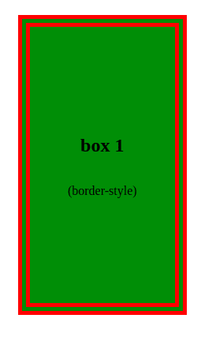
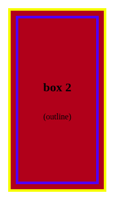
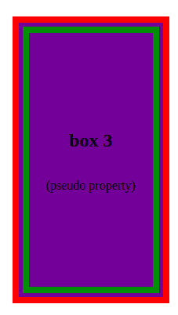
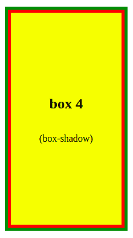
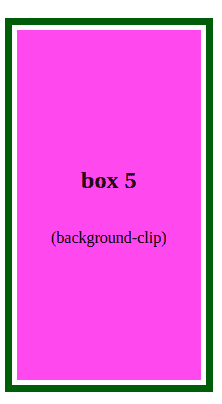
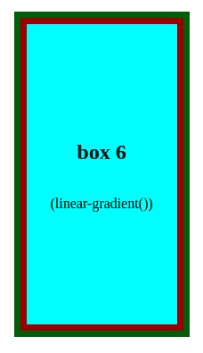
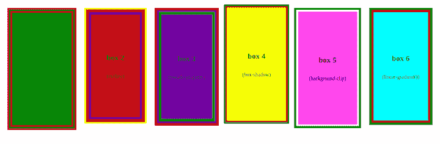

# 如何在 CSS 中创建双边框

> 原文：<https://blog.logrocket.com/how-create-double-border-css/>

可以使用 CSS 中的`border`快捷方式属性来设置元素的边框。此外，我们可以使用 CSS 边框属性来定义元素边框的样式、宽度和颜色。

有三个 CSS 边框属性可以更改:`border-color`、`border-style`和`border-width`。`border-style`和`border-width`指定边框的颜色和宽度；`border-style`指定边框是实线、虚线、双线还是其他样式。

在这篇文章中，我们将回顾六种不同的 CSS 方法来为网页元素创建双边框效果。

让我们开始吧。

*向前跳转:*

## 设置示例元素

首先，让我们创建六个示例框，我们可以用它们来说明本文中涉及的每个 CSS 方法。

首先，创建一个名为`index.html`的 HTML 文件，并粘贴以下代码:

```
<!DOCTYPE html>
<html lang="en">
<head>
  <meta charset="UTF-8">
  <meta http-equiv="X-UA-Compatible" content="IE=edge">
  <meta name="viewport" content="width=device-width, initial-scale=1.0">
  <link rel="stylesheet" href="./style.css" />
  <title>Document</title>
</head>
<body>

  <div class="box-1"> <h2>box 1</h2> <p>(border-style)</p> </div>
  <div class="box-2"> <h2>box 2</h2> <p>(outline)</p> </div>
  <div class="box-3"> <h2>box 3</h2> <p>(pseudo property)</p> </div>
  <div class="box-4"> <h2>box 4</h2> <p>(box-shadow)</p> </div>
  <div class="box-5"> <h2>box 5</h2> <p>(background-clip)</p></div>
  <div class="box-6"> <h2>box 6</h2> <p>(linear-gradient())</p></div>
</body>
</html>

```

然后，创建一个`style.css`文件，并编写以下内容:

```
*{
  padding: 0;
  margin: 0;
  box-sizing: border-box;
}

body{
  display: flex;
  justify-content: flex-start;
  gap: 25px;
  padding: 15px;
}
div{
  width: 350px;
  height: 350px;
  display: flex;
  flex-direction: column;
  justify-content: center;
  align-items: center;
}

.box-1{
  background-color: green;
}

.box-2{
  background-color: rebeccapurple;
}

.box-3{
  background-color: brown;
}

.box-4{
  background-color: yellow;
}

.box-5 {
  background-color: violet;
}
.box-6{
  background-color: aqua;
}

```

上面的代码创建了几个宽度和高度分别为`350px`的`<div>`框，每个框根据其类名使用不同的背景颜色。

## 使用 CSS `border-style`属性设置样式

对于第一个示例，让我们使用`box-1`元素。使用带有`double`关键字值的`border-style`属性是在 CSS 中创建双线的传统方法:

```
.box-1{
  background-color: green;
  border-width: 15px;
  border-color: red;
  border-style: double;
}

```

CSS 属性允许我们在盒子的四个边上设置元素的线条样式。可以为该属性分配几个关键字值。

为了创建双边框，使用了关键字值`double`。这将自动在两条边框线之间创建填充。我们还可以使用`border-[left/right/top/bottom]`在元素的特定一侧创建一个双边框样式。

下面是我们使用 CSS `border-style`属性的双边框示例:



## 使用 CSS `outline`属性设置样式

接下来，我们来看看`outline`属性。轮廓和边框非常相似，只是轮廓不占用任何空间，因为它们是在元素内容之外绘制的。此外，边框提供了更多的样式选择。例如，每条边框线可以用您选择的不同颜色来设计。

为了用`outline`属性实现双边框效果，我们需要使用单边框和轮廓。然而，与`border-style`属性不同的是，`outline`属性不会自动在自身和边框之间创建一个空格。要在轮廓和边框之间添加空间，我们需要使用`outline-offset`属性:

```
.box-2{
  background-color: brown;
  border: 5px solid yellow; 
  outline: 5px solid blue;
  outline-offset: -20px;
}

```

如上面的代码所示，`outline-offset`属性可用于向内调整轮廓(如设置负值，如`-20px`)或向外调整轮廓(如设置正值，如`5px`)。

此示例的输出将如下图所示。这里，我们使用了一个负片`outline-offset`向内调整蓝色轮廓，使黄色边框看起来像一个外部的双边框:



## 使用 CSS 伪元素关键字进行样式设置

现在，让我们看看用 CSS 伪元素创建一个双边框。我们将赋予`box-3`元素自己的边界和相对位置。然后，我们将使用`::before`伪元素添加第二个边框:

```
box-3{
  background-color: rebeccapurple;
  position: relative;
  border: 8px solid red;
}

.box-3::before{
  content: " ";
  position: absolute;
  top: 5px;
  left: 5px;
  right: 5px;
  bottom: 5px;
  border: 8px solid green;
}

```

这里我们使用了一个`border`属性在盒子上方创建了一个红色的外部边框。我们用绝对定位设置绿色内边框，并使用`top`、`left`、`bottom`和`right`值插入它。这些插入值调整两个边框之间的间距。

下面是我们使用 CSS 伪元素关键字的双边框示例:



## 使用 CSS `box-shadow`属性设置样式

接下来，让我们用`box-shadow`属性创建一个双边框。通过使用两个逗号分隔的阴影，将“偏移”和“模糊”设置设置为零，并为每个阴影指定适当的大小，可以使方框阴影看起来像双边框:

```
.box-4{
  background-color: yellow;
  box-shadow:
  0 0 0 5px red,
  0 0 0 10px green;
}

```

在这个例子中，第二个(绿色)阴影是第一个(红色)阴影的两倍大，但是它们看起来一样大，因为它们重叠了。

这个`box-shadow`属性示例的输出如下所示:



## 使用 CSS `background-clip`属性设置样式

现在，让我们使用`background-clip`属性在`box-5`元素上创建一个双边框效果。

```
.box-5{
    border: 7px solid rgb(36, 85, 7);
  padding: 5px;
  background-clip: content-box;
  background-color: violet;
}

```

这里，CSS `background-clip`属性用于使框元素的背景在填充之前停止。这在`content``-box`周围创造了空间，给人一种白色边框的感觉。这样，元素的常规边框就有点像双边框。

下面是我们使用 CSS `background-clip`属性的双边框示例:



## 使用 CSS `linear-gradient()`功能进行造型

作为最后一个例子，让我们使用`linear-gradient()`函数创建一个双边框。此功能可用于沿直线在两种或多种颜色之间产生逐渐过渡。

关键字`to`组成渐变线的起点。它指定渐变的方向(`left`、`right`、`top`或`bottom`)。侧关键字的顺序无关紧要。如果未指定，默认为`to bottom`。

我们也可以用角度来指示方向。值`to top`、`to bottom`、`to left`和`to right`分别对应于角度`0deg`、`180deg`、`270deg`和`90deg`。

在这个例子中，我们首先给`box-6`元素一个`7px`的边框宽度和一个绿色。然后，我们在`background`属性上为每一边设置线性渐变:

```
.box-6{
  border: 7px solid rgb(36, 85, 7);
  background: linear-gradient(to top, #8f0404 7px, transparent 1px), /* bottom border */
  linear-gradient(to bottom, #8f0404 7px, transparent 1px),  /* top border */
  linear-gradient(to left, #8f0404 7px, transparent 1px),  /* right border */
  linear-gradient(to right, #8f0404 7px, transparent 1px);  /* left border */
  background-color: aqua;
}

```

这里，渐变从红色(宽度为`7px`)变为透明。透明渐变的宽度必须小于指定的颜色，以消除任何褪色效果。

这个`linear-gradient()`函数示例的输出如下所示:



如果我们在浏览器中运行代码，我们将得到下面的结果。在这里，我们可以并排看到所有的 CSS 双边框样式方法:



## 排除边框不渲染的故障

设置 CSS 速记 border 属性后边框不呈现的最常见原因是未指定边框样式。必须为要呈现的边框定义 CSS `border-style`属性，但是,`border-width`和`border-color`属性值可以留空。

## 结论

在本文中，我们演示了如何使用 border 属性设置网页元素的边框样式。属性决定了边框应该是实线、虚线、双线还是其他样式。

我们探索了创建双边框的传统`border-style: double`方法的许多替代方法，例如`outline`、`box-shadow`和`background-clip`属性、伪元素关键字和`linear-gradient`函数。

## 你的前端是否占用了用户的 CPU？

随着 web 前端变得越来越复杂，资源贪婪的特性对浏览器的要求越来越高。如果您对监控和跟踪生产环境中所有用户的客户端 CPU 使用、内存使用等感兴趣，

[try LogRocket](https://lp.logrocket.com/blg/css-signup)

.

[](https://lp.logrocket.com/blg/css-signup)[https://logrocket.com/signup/](https://lp.logrocket.com/blg/css-signup)

LogRocket 就像是网络和移动应用的 DVR，记录你的网络应用或网站上发生的一切。您可以汇总和报告关键的前端性能指标，重放用户会话和应用程序状态，记录网络请求，并自动显示所有错误，而不是猜测问题发生的原因。

现代化您调试 web 和移动应用的方式— [开始免费监控](https://lp.logrocket.com/blg/css-signup)。