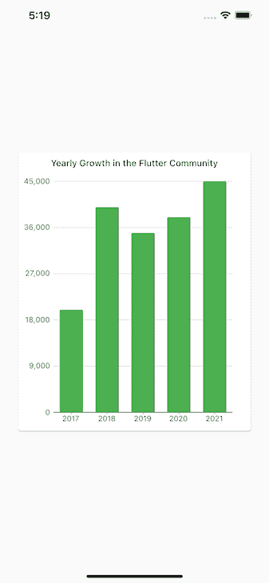
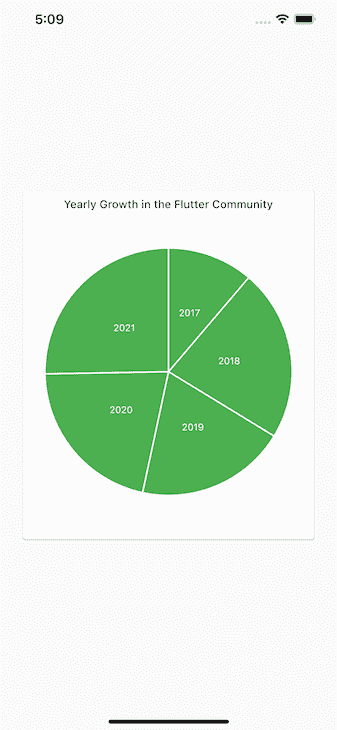
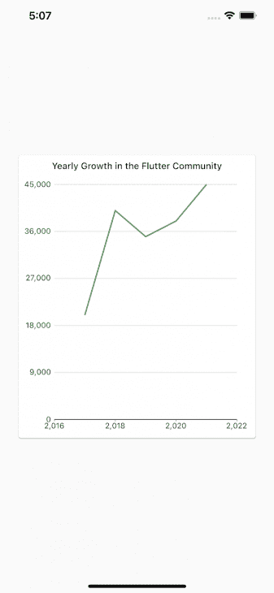

# 如何用 charts_flutter 创建颤振图表

> 原文：<https://blog.logrocket.com/how-create-flutter-charts-with-charts-flutter/>

应用程序中的图表提供跨行业和应用程序的数据的图形显示或图形表示。Mint 等移动应用程序使用饼图来监控消费习惯，Strava 等健身应用程序使用折线图和条形图来分析步速、心率和海拔增益。

当构建 Flutter 应用程序时，开发人员可以使用由谷歌维护的官方`charts_flutter`库来创建这些类型的图表。

在本教程中，我们将学习如何使用`charts_flutter`创建一些最常见的图表——折线图、饼状图和条形图。

我们将使用这些图表来展示一个虚构的 Flutter charts 开发人员社区五年来的发展。虽然本教程中的数据是虚构的，但本教程可以很容易地利用真实数据。

## 先决条件

要学习本教程，您必须具备以下条件:

## 用`charts_flutter`创建并设置一个颤振项目

要创建新的颤振项目，请运行以下命令:

```
flutter create projectName

```

接下来，在代码编辑器中打开新项目。如上所述，我们将使用`[chart_flutter](https://pub.dev/packages/charts_flutter)` [，Flutter 的官方库](https://pub.dev/packages/charts_flutter)。

要将`chart_flutter`导入到您的项目中，请打开`pubspec.yaml`文件并将其添加到依赖项下:

```
dependencies:
  flutter:
    sdk: flutter

  charts_flutter: ^0.11.0

```

### 搭建应用程序

现在我们有了新的 Flutter 应用程序的基本代码:一个记录按钮被按下次数的计数器。

因为我们在条形图应用程序中不需要它，所以继续删除在`main.dart`页面中找到的代码。删除除以下内容之外的所有内容:

```
import ‘package:flutter/material.dart’;
void main() => runApp(MyApp());
class MyApp extends StatelessWidget {
@override
Widget build(BuildContext context) {
            //TODO: implement build
            Return MaterialApp(
            );
     }
}

```

现在，在我们的 build 小部件中返回`MaterialApp`类，这样我们就可以使用材质设计。

#### 创建主页

要为我们的应用程序创建主页，导航到`lib`文件夹并创建一个名为`home.dart`的新页面:

```
import 'package:flutter/material.dart';

class HomePage extends StatelessWidget {
  @override
  Widget build(BuildContext context) {
    return Scaffold(
      body: Center(
        child: ,
      ),
    );
  }
}

```

使用`import 'package:flutter/material.dart'`，我们可以导入材料设计。

然后，`HomePage`类扩展了`statelessWidget`，因为在这个页面上没有状态改变。

在`BuildContext`小部件中，我们返回了`Scaffold`类，为我们提供了一个基本的材质设计布局结构。我们的条形图将放在子参数所在的位置，我们将把它放在屏幕主体的中心。

所有这些现在都是我们应用程序的脚手架。

主页完成后，我们可以在我们的`main.dart`文件中指定`HomePage`，因为`main.dart`集合了我们应用程序中的所有功能:

```
class MyApp extends StatelessWidget {
  @override
  Widget build(BuildContext context) {
    return MaterialApp(
      debugShowCheckedModeBanner: false,
      home: HomePage(), //This is where we specify our homepage
    );
  }
}

```

有了这个代码，`main.dart`就知道在应用程序加载时首先显示哪个页面。

请注意，将`debugShowCheckedModeBanner`设置为`false`会从我们的应用程序中移除调试标记。

## 创建颤动图表应用程序

### 系列和型号

在我们创建 chart 应用程序之前，让我们熟悉一下颤振图表常用的两个术语:系列和模型。

系列是一组(或一系列)信息，我们可以用它们来绘制图表。模型是我们的信息进入的格式，它指定了使用模型的每个数据项必须具有的属性。

### 创建条形图

#### 为条形图数据创建模型

首先，我们将创建一个条形图来显示过去五年中新增的虚构的 Flutter chart 开发人员的数量。换句话说，我们希望跟踪虚构的 Flutter chart 社区的增长。

我们的模型定义了我们数据的格式，由我们正在查看的年份、当年加入 Flutter chart 社区的开发人员数量以及相应的条形的颜色组成。

在`lib`文件夹中，创建一个名为`developer_series.dart`的文件。下面，为我们的模型实现代码:

```
import 'package:charts_flutter/flutter.dart' as charts;
import 'package:flutter/foundation.dart';

class DeveloperSeries {
  final int year;
  final int developers;
  final charts.Color barColor;

  DeveloperSeries(
    {
      @required this.year,
      @required this.developers,
      @required this.barColor
    }
  );
}

```

我们将模型命名为`DeveloperSeries`，并指定每个系列项目必须具有的属性(`year`、`developers`和`barColor`)。

为了防止在创建类的对象时类的参数为空，我们使用了`@required`注释，如上面的代码块所示。

要使用`@required`关键字，我们必须导入`foundation.dart`包。

#### 为条形图创建数据

现在我们有了条形图数据的模型，让我们继续实际创建一些数据。在主页中，通过添加以下内容为条形图生成数据:

```
import 'package:flutter/material.dart';
import 'package:charts_flutter/flutter.dart' as charts;
import 'package:;lib/developer_series.dart';

class HomePage extends StatelessWidget {
  final List<DeveloperSeries> data = [

    DeveloperSeries(
      year: "2017",
      developers: 40000,
      barColor: charts.ColorUtil.fromDartColor(Colors.green),
    ),
    DeveloperSeries(
      year: "2018",
      developers: 5000,
      barColor: charts.ColorUtil.fromDartColor(Colors.green),
    ),
    DeveloperSeries(
      year: "2019",
      developers: 40000,
      barColor: charts.ColorUtil.fromDartColor(Colors.green),
    ),
    DeveloperSeries(
      year: "2020",
      developers: 35000,
      barColor: charts.ColorUtil.fromDartColor(Colors.green),
    ),
    DeveloperSeries(
      year: "2021",
      developers: 45000,
      barColor: charts.ColorUtil.fromDartColor(Colors.green),
    ),
  ];

  @override
  Widget build(BuildContext context) {
    return Scaffold(
      body: Center(
        child: ,
      ),
    );
  }
}

```

这是一个名为`data`的简单列表。列表中的每一项都模仿了`DeveloperSeries`模型，这意味着每一项都有一个年份(`year`)、开发者数量(`developers`)和条形颜色(`barColor`)属性。

* * *

### 更多来自 LogRocket 的精彩文章:

* * *

注意，上面的数据是真实的，所以可以随意操纵数字和颜色。

### 构建条形图

我们已经成功地为条形图创建了数据。现在，让我们创建条形图本身。为了使我们的项目有条理，我们将把条形图的代码放在一个单独的文件中。

在`lib`中，创建一个`developer_chart.dart`文件:

```
import 'package:flutter/material.dart';
import 'package:charts_flutter/flutter.dart' as charts;
import 'package:lib/developer_series.dart';

class DeveloperChart extends StatelessWidget {
  final List<DeveloperSeries> data;

  DeveloperChart({@required this.data});
  @override
  Widget build(BuildContext context) {
    List<charts.Series<DeveloperSeries, String>> series = [
      charts.Series(
        id: "developers",
        data: data,
        domainFn: (DeveloperSeries series, _) => series.year,
        measureFn: (DeveloperSeries series, _) => series.developers,
        colorFn: (DeveloperSeries series, _) => series.barColor
      )
    ];

    Return charts.Barchart(series, animate: true);
  }

}

```

使用`final List<DeveloperSeries> data`，我们定义了一个名为`data`的列表，它是我们之前创建的`DeveloperSeries`模型形式的数据项的`List`。

列表中的每个数据项都有相应的年份、开发者数量和条形颜色。

类内的`DeveloperChart`构造函数保证了无论在哪里使用条形图类，它所需要的数据总是被提供；这是使用`@required`关键字完成的。

实际的条形图是在我们的 build 小部件中创建的。如您所知，所有条形图都有相互对照的数据组(在我们的例子中，是过去五年和 Flutter chart 社区获得的开发人员数量)。

这些数据组合在一起称为一个系列。该系列告诉我们 Flutter 将哪组数据放在条形图的水平侧，将哪组数据放在垂直侧。

我们之前创建的数据列表会插入到我们的系列中，并由 Flutter 适当地使用。

使用`List<charts.Series<DeveloperSeries, String>> series`，我们创建了一个名为`series`的列表。这个列表有一个类型`charts.Series`；`charts`将 Flutter 导入到我们的项目中，`Series`函数为 Flutter 中的条形图创建系列。

我们刚刚创建的系列是模仿我们的`DeveloperSeries`模型。

我们将在我们的系列中指定的参数包括`id`、`data`、`domainFn`、`measureFn`和`colorFN`:

*   `id`标识图表
*   `data`指向要在条形图上绘制的项目列表
*   `domainFn`指向条形图水平侧的数值
*   `measureFn`指向量的垂直边上的值
*   `colorFN`指条形的颜色

使用`domainFn`、`measureFn`和`colorFN`函数，我们创建以`Subscriber`系列作为参数的函数，创建它的实例，然后使用这些实例访问它的不同属性。

文件中的下划线表示不需要第二个参数。

在将我们的系列指向它需要的所有数据之后，我们使用 Flutter 的`BarChart`函数用它来创建我们的条形图。

我们还可以通过简单地将`animate`设置为`true`来添加一个动画，这样可以用一个漂亮的动画来呈现图表。

#### 将条形图添加到主页

现在，我们可以将新创建的条形图添加到我们的主页并显示它:

```
import 'package:flutter/material.dart';
import 'package:charts_flutter/flutter.dart' as charts;
import 'package:lib/developer_series.dart';
import 'package:lib/developer_chart.dart';

class HomePage extends StatelessWidget {
  // ...

  @override
  Widget build(BuildContext context) {
    return Scaffold(
      body: Center(
        child: DeveloperChart(
          data: data,
        )
      ),
    );
  }
}

```

这里，我们简单地调用页面主体中的`DeveloperChart`类，并将其指向我们想要使用的数据。

为了确保我们的图表适合屏幕，我们将把它放在一个`Card`中，用一个容器包住它，并给它一个设定的高度和一些填充:

```
…

class DeveloperChart extends StatelessWidget {
  final List<DeveloperSeries> data;

  DeveloperChart({@required this.data});
  @override
  Widget build(BuildContext context) {
    List<charts.Series<DeveloperSeries, String>> series = [
      charts.Series(
        id: "developers",
        data: data,
        domainFn: (DeveloperSeries series, _) => series.year,
        measureFn: (DeveloperSeries series, _) => series.developers,
        colorFn: (DeveloperSeries series, _) => series.barColor
      )
    ];

    return Container(
      height: 300,
      padding: EdgeInsets.all(25),
      child: Card(
        child: Padding(
          padding: const EdgeInsets.all(9.0),
          child: Column(
            children: <Widget>[
              Text(
                "Yearly Growth in the Flutter Community",
                style: Theme.of(context).textTheme.body2,
              ),
              Expanded(
                child: charts.BarChart(series, animate: true),
              )
            ],
          ),
        ),
      ),
    );
  }

}

```

通过使用`expanded`小部件，我们将条形图很好地扩展到了`Card`中。上面的`Text`小部件给我们的条形图一个标题，让人们知道它是关于什么的。

并且，在`Theme.of(context).textTheme.body2`中，我们将 Material Design 的默认风格应用于我们的标题正文。

使用`padding: const EdgeInsets.all(9.0)`，我们给了这张卡片所有边上 9 px 的条形图填充。最后，我们将`Card`包装在一个容器中，容器的高度为 300 像素，各边的填充为 25 像素。

现在，我们的条形图应该很好地呈现在屏幕上。



### 创建饼图

我们也可以使用`charts_flutter`包来创建饼状图。事实上，我们上面遵循的过程和我们编写的代码可以创建一个饼图。

要将我们创建的条形图更改为饼图，只需将`charts.BarChart(series, animate: true)`更改为`child:( charts.PieChart(series, animate: true)`。

然后，我们可以向饼图添加标签:

```
Expanded(
          child: charts.PieChart(series,
           defaultRenderer: charts.ArcRendererConfig(
            arcRendererDecorators: [
                     charts.ArcLabelDecorator(
                        labelPosition: charts.ArcLabelPosition.inside)
          ])
           animate: true),
)

```

`ArcRendererConfig`函数配置饼图的外观，我们可以使用`ArcLabelDecorator`函数向图表添加标签。

`labelPosition`指定放置标签的位置，无论是内部还是外部；在这种情况下，我们指定它们应该在外面。



### 创建折线图

我们可以用创建其他两个图表的相同方法来创建折线图。我们将简单地对我们的数据配置做一个小小的调整。

在我们的系列列表中，`List<charts.Series<DeveloperSeries, String>>`变成了`List<charts.Series<DeveloperSeries, num>>`，因为折线图只适用于数字:

```
List<charts.Series<DeveloperSeries, num>> series = [
      charts.Series(
        id: "developers",
        data: data,
        domainFn: (DeveloperSeries series, _) => series.year,
        measureFn: (DeveloperSeries series, _) => series.developers,
        colorFn: (DeveloperSeries series, _) => series.barColor
      )
    ];

```

现在我们可以将`charts.PieChart`改为`charts.Linechart`来得到我们的折线图。默认情况下，折线图从原点零开始。但我们关注的年份是从 2016 年到 2021 年。因此，下面是如何让我们的折线图跨越这个范围:

```
Expanded(
          child: charts.LineChart(series,
           domainAxis: const charts.NumericAxisSpec(
                 tickProviderSpec:
                 charts.BasicNumericTickProviderSpec(zeroBound: false),
                 viewport: charts.NumericExtents(2016.0, 2022.0),
           ),
           animate: true),
)

```

`NumericAxisSpec`功能为图表中的轴设置规格。使用`BasicNumericTickProviderSpec`函数，我们将`zeroBound`设置为`false`，这样我们的图表就不会从原点零开始。

最后，使用`NumericExtents`功能，我们设置我们想要轴跨越的范围。



## 其他图表库

虽然我个人更喜欢 charts_flutter，但也有其他令人惊叹的开源图表库。

### fl _ 图表

与 charts_flutter 类似， [fl_chart](https://github.com/imaNNeoFighT/fl_chart) 为你提供了条形图、饼状图、折线图、散点图、雷达图。

库中的所有图表都可以自定义和制作动画。它们还具有触摸交互性，让您的应用程序用户能够与您的图表进行交互并对其进行更改。

您可以在图表中添加工具提示和其他指示器，如果没有内置的触摸功能符合您的口味，您可以创建新的功能。

### fl _ 动画 _ 折线图

这个库为你提供了折线图和面积图。这些图表可以根据您的需要进行动画制作和定制，并且它们提供了对日期-时间轴的支持。

[fl_animated_linechart](https://github.com/JacobJust/fl_animated_linechart) 库使您可以轻松创建具有多个不同单位的 y 轴的图表。

### 贝塞尔图表

[贝塞尔图](https://github.com/aeyrium/bezier-chart)为你提供了一个贝塞尔线图小工具。

该图表是高度可定制的，并且非常具有交互性。您的应用程序用户可以与它进行交互，以进行修改或获取有关图表数据的更多信息。该库支持触摸、滚动和缩放等手势。您也可以在图表中添加多条贝塞尔曲线。

### 颤动圆形图

[颤振圆形图](https://github.com/xqwzts/flutter_circular_chart)为您提供径向图和饼图。与列表中的其他库一样，这个库中的图表是高度可定制的，并且可以制作动画。

### MPFlutterChart

[MPFlutterChart](https://github.com/SunPointed/MPFlutterChart) 附带不同种类的折线图、条形图、饼图、散点图、气泡图、雷达图、蜡烛图和滚动图。

类似于我们看到的其他库，这个库中的所有图表都可以定制，并支持动画、缩放和交互性。

我个人最喜欢 charts_flutter。它是由谷歌(Flutter 的创造者)用材料设计创建的，所以它的图表有不同的时尚风格和良好的用户体验。此外，它还带有许多不同的图表、绘图和图形。

## 结论

本教程的目标是向 Flutter 开发者展示如何在他们的应用程序中实现不同的图表。使用 Google 创建的令人惊叹的`charts_flutter`包，我们能够实现一个条形图、一个饼状图和一个折线图。

要了解更多关于这个包的功能，请访问 pub.dev 。

## 使用 [LogRocket](https://lp.logrocket.com/blg/signup) 消除传统错误报告的干扰

[](https://lp.logrocket.com/blg/signup)

[LogRocket](https://lp.logrocket.com/blg/signup) 是一个数字体验分析解决方案，它可以保护您免受数百个假阳性错误警报的影响，只针对几个真正重要的项目。LogRocket 会告诉您应用程序中实际影响用户的最具影响力的 bug 和 UX 问题。

然后，使用具有深层技术遥测的会话重放来确切地查看用户看到了什么以及是什么导致了问题，就像你在他们身后看一样。

LogRocket 自动聚合客户端错误、JS 异常、前端性能指标和用户交互。然后 LogRocket 使用机器学习来告诉你哪些问题正在影响大多数用户，并提供你需要修复它的上下文。

关注重要的 bug—[今天就试试 LogRocket】。](https://lp.logrocket.com/blg/signup-issue-free)