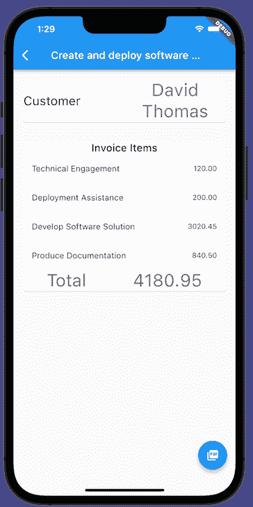
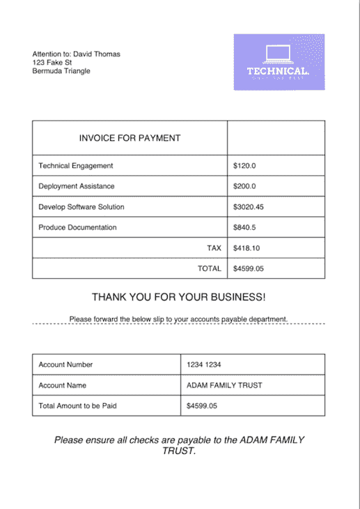
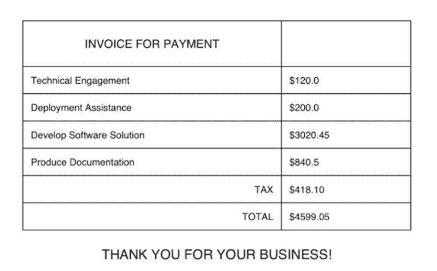

# 如何在 Flutter - LogRocket 博客中创建 pdf

> 原文：<https://blog.logrocket.com/how-create-pdfs-flutter/>

说到共享文档，没有比使用 PDF 更好的方法了。最初开发 pdf 是为了让文档无论在哪里打开都看起来一样，现在几乎世界上的每个企业都在使用 pdf。

出于多种原因，使用 pdf 来传输用户可读的数据是一个很好的选择。例如，无论用什么设备打开 PDF，文档看起来都一样。此外，就文件大小而言，pdf 相对较小。

pdf 的另一个有用的特性是每个人都可以打开这种类型的文件。任何主流操作系统，如 Android 或 iOS，都将提供开箱即用的功能。

在本教程中，我们将回顾:

## 设置生成 pdf 的 Flutter 应用程序

从我们的 Flutter 应用程序中生成 pdf 实际上是一种非常愉快的体验，原因有三。

首先，在 pub.dev 上有一个成熟且经过充分测试的[库，恰当地称为](https://pub.dev/packages/pdf) `[pdf](https://pub.dev/packages/pdf)`。

第二，Flutter PDF 库布局 PDF 元素很像[Flutter 如何在 UI](https://blog.logrocket.com/widgets-the-building-blocks-of-flutter-apps/) 中布局小部件。如果您已经知道行和列是如何工作的，您可以在 Flutter 中重用这些知识来创建和编辑您的 PDF。

第三，一个名为 `[printing](https://pub.dev/packages/printing)`的[配套包可以让你在应用程序中轻松预览、分享和打印 pdf。](https://pub.dev/packages/printing)

作为我们如何在 Flutter 中创建 pdf 的一个例子，我们将通过创建一个应用程序来为客户生成发票。这个示例应用程序还将让我们指定新的行项目，并计算应付的总金额。

一旦我们创建了发票，我们将能够将其转换为 PDF 格式发送给我们的客户。让我们看看如何在我们的 Flutter 应用程序中实现这一点！

### 配置我们的`pubspec.yaml`

首先，我们需要向我们的 pubspec 文件添加两个适当的包:

*   用于 PDF 制作的`pdf`包
*   用于预览我们制作的 pdf 的`printing`包

我们将使用这两个包来制作并分享我们创建的 pdf。

把`pdf`和`printing`加到你的`pubspec.yaml`上，像这样:

```
dependencies:
  flutter:
    sdk: flutter

  # The following adds the Cupertino Icons font to your application.
  # Use with the CupertinoIcons class for iOS style icons.
  cupertino_icons: ^1.0.2
  pdf: ## add this
  printing: ## also add this

```

### 设置我们的发票模型

现在，我们需要创建一个数据模型来创建和存储这些发票。发票应包含相关的客户信息，显示正在开具发票的行项目列表，并汇总这些项目的成本。

为了实现这些元素，让我们创建我们的数据模型，如下所示:

```
class Invoice {
  final String customer;
  final String address;
  final List<LineItem> items;
  Invoice(this.customer, this.address, this.items);
  double totalCost() {
    return items.fold(0, (previousValue, element) => previousValue + element.cost);
  }
}

class LineItem {
  final String description;
  final double cost;

  LineItem(this.description, this.cost);
}

```

这是一个非常简单的数据类，用于保存我们的发票数据。

您可能已经注意到我们还声明了一个`totalCost`函数，它使用`.fold`操作符来计算与该发票相关的所有行项目的总成本。这个方便的函数将为我们处理这个计算，所以我们不必手动添加每个值。

### 使用我们的 UI:发票列表页面

当我们的应用程序启动时，它应该会显示我们的发票列表。我们将对一些测试数据进行采样，这样当我们第一次打开列表时，我们的列表会显示一些项目。

首先，让我们创建一个名为`pages`的新文件夹。在该文件夹中，创建一个名为`invoices.dart`的 Dart 文件。我们还将创建一个`StatelessWidget`，它最初会显示这个发票列表。

在这个类中，我们还将为发票本身声明一些样本数据。实际上，您可能会从一个 API 或等效的 API 中查询这些数据，但是在我们的例子中，样本数据足以显示如何在 Flutter 应用程序中生成 pdf。

对于每张发票，我们的样本数据应包括:

*   客户的名称和地址
*   发票的名称
*   向客户提供的逐项服务列表，包括各自的名称和费用

```
final invoices = [
  Invoice(
      customer: 'David Thomas',
      address: '123 Fake St\r\nBermuda Triangle',
      items: [
        LineItem(
          'Technical Engagement',
          120,
        ),
        LineItem('Deployment Assistance', 200),
        LineItem('Develop Software Solution', 3020.45),
        LineItem('Produce Documentation', 840.50),
      ],
      name: 'Create and deploy software package'),
  Invoice(
    customer: 'Michael Ambiguous',
    address: '82 Unsure St\r\nBaggle Palace',
    items: [
      LineItem('Professional Advice', 100),
      LineItem('Lunch Bill', 43.55),
      LineItem('Remote Assistance', 50),
    ],
    name: 'Provide remote support after lunch',
  ),
  Invoice(
    customer: 'Marty McDanceFace',
    address: '55 Dancing Parade\r\nDance Place',
    items: [
      LineItem('Program the robots', 400.50),
      LineItem('Find tasteful dance moves for the robots', 80.55),
      LineItem('General quality assurance', 80),
    ],
    name: 'Create software to teach robots how to dance',
  )
];
```

在我们的`InvoicePage`类中，我们还将设计一个相当简单的 UI 来显示列表中所有现有的发票。该列表中的每一项都应该显示发票详细信息的预览，包括发票名称、客户名称和总成本。

这是通过将一个`ListView`小部件与任何`ListTile`项组合起来完成的，如下所示:

```
@override
Widget build(BuildContext context) {
  return Scaffold(
    appBar: AppBar(
      title: Text('Invoices'),
    ),
    body: ListView(
      children: [
        ...invoices.map(
          (e) => ListTile(
            title: Text(e.name),
            subtitle: Text(e.customer),
            trailing: Text('\$${e.totalCost().toStringAsFixed(2)}'),
            onTap: () {
              Navigator.of(context).push(
                MaterialPageRoute(
                  builder: (builder) => DetailPage(invoice: e),
                ),
              );
            },
          ),
        )
      ],
    ),
  );
}

```

通过在`invoices`列表上使用`map`操作符，我们将列表转换成`ListTile`项，这些项可以显示在我们的`ListView`中。我们还使用`trailing`方法设置要显示的发票总成本:

```
trailing: Text('\$${e.totalCost().toStringAsFixed(2)}'),

```

这种字符串插值方法可能会有点混乱。让我们分解一下，以便更好地理解它。

在我们的字符串中呈现为美元符号。我们必须给它加上前缀`\`,因为`$`通常用于表示字符串插值。在这种情况下，我们实际上想要使用原始的美元符号本身，所以我们必须通过使用一个`\`来避免它的正常用法。

`$`的无前缀用法开始了我们对发票的`totalCost`函数的字符串插值。最后，当我们将数字转换为字符串时，我们截断到两位小数。

小部件生成所有发票的列表，如下所示:


当我们点击每张发票时，我们的应用程序会导航到一个`DetailPage`。现在让我们看看如何创建一个示例详细页面。

### 使用我们的用户界面:发票详细信息页面

`DetailPage`接受发票作为参数，并在生成 PDF 之前，将发票对象转换为用户可以在 Flutter 应用程序中检查的内容。

同样，我们使用带有`ListView`的`Scaffold`来显示发票的详细信息。我们还使用了一个`[FloatingActionButton](https://blog.logrocket.com/flutter-floatingactionbutton-a-complete-tutorial-with-examples/)` [，它是 Flutter](https://blog.logrocket.com/flutter-floatingactionbutton-a-complete-tutorial-with-examples/) 中的一个独特的小部件，让用户生成并共享包含发票信息的 PDF。

这些都是在 Flutter 中需要了解的很棒的 UI 元素，但是让我们继续关注我们将用来生成这个`DetailPage`的代码，它应该看起来像这样:

```
class DetailPage extends StatelessWidget {
  final Invoice invoice;
  const DetailPage({
    Key? key,
    required this.invoice,
  }) : super(key: key);

  @override
  Widget build(BuildContext context) {
    return Scaffold(
      floatingActionButton: FloatingActionButton(
        onPressed: () {
          Navigator.of(context).push(
            MaterialPageRoute(
              builder: (context) => PdfPreviewPage(invoice: invoice),
            ),
          );
          // rootBundle.
        },
        child: Icon(Icons.picture_as_pdf),
      ),
      appBar: AppBar(
        title: Text(invoice.name),
      ),
      body: ListView(
        children: [
          Padding(
            padding: const EdgeInsets.all(15.0),
            child: Card(
              child: Row(
                mainAxisAlignment: MainAxisAlignment.spaceBetween,
                children: [
                  Expanded(
                    child: Text(
                      'Customer',
                      style: Theme.of(context).textTheme.headline5,
                    ),
                  ),
                  Expanded(
                    child: Text(
                      invoice.customer,
                      style: Theme.of(context).textTheme.headline4,
                      textAlign: TextAlign.center,
                    ),
                  ),
                ],
              ),
            ),
          ),
          Padding(
            padding: const EdgeInsets.all(15.0),
            child: Card(
              child: Column(
                children: [
                  Text(
                    'Invoice Items',
                    style: Theme.of(context).textTheme.headline6,
                  ),
                  ...invoice.items.map(
                    (e) => ListTile(
                      title: Text(e.description),
                      trailing: Text(
                        e.cost.toStringAsFixed(2),
                      ),
                    ),
                  ),
                  DefaultTextStyle.merge(
                    style: Theme.of(context).textTheme.headline4,
                    child: Row(
                      mainAxisAlignment: MainAxisAlignment.spaceAround,
                      children: [
                        Text("Total"),
                        Text(
                          invoice.totalCost().toStringAsFixed(2),
                        ),
                      ],
                    ),
                  )
                ],
              ),
            ),
          ),
        ],
      ),
    );
  }
}

```

这段代码应该会产生如下所示的发票预览页面:



## 在 Flutter 中向 PDF 添加元素

要为我们的发票应用程序创建 PDF，我们首先需要一些成品应该是什么样子的想法。大多数发票包含:

*   关于客户的信息
*   公司标志
*   提供的服务列表
*   最终价格(包括商品及服务税)
*   付款详情，或公司处理发票所需的信息

为此，我们的 PDF 需要相当复杂的视觉布局。我们需要我们的 PDF 发票有图片，文字，表格和虚线，以表明线以下的一切都是应付帐款部门。

通常情况下，我们必须使用偏移量，并真正尝试在像素中准确地表达我们想要的一切。然而，`pdf`包的主要优势之一是它使用与 Flutter 相同的[布局规则来帮助你构建 pdf。](https://blog.logrocket.com/best-practices-laying-out-flutter-app/)

如果你已经知道如何创建`Columns`和`Rows`，加载图片，并设置填充，你也应该已经知道如何布局你的 PDF。这立即降低了在 Flutter 应用程序中创建和制作您自己的 pdf 的障碍。

为了创建我们的 PDF，我们将创建一个名为`pdfexport`的新 Dart 文件。我们的类将公开一个函数，该函数返回我们正在创建的 PDF 的二进制数据。

让我们在 Dart 文件中声明`makePdf`函数，并让它接受一个类型为`Invoice`的参数。接下来，我们将通过声明我们的`Document`对象、添加一个页面以及向页面添加一个`Column`来构建我们的 PDF 文档的外壳。

```
Future<Uint8List> makePdf(Invoice invoice) async {
  final pdf = Document();
  pdf.addPage(
    Page(
    build: (context) {
      return Column(
        children: []
      }
    );
}

```

我们将根据需要向该页面添加单独的信息。PDF 将需要三个主要领域:客户的详细资料，成本的细分，以及给应付账款的滑。

完成后，我们的 PDF 将如下所示:



### 创建地址和徽标行

发票中的第一行是我们的客户信息和徽标行。因为它包含了我们公司的徽标，我们将为我们的公司徽标添加对我们的`pubspec.yaml`的引用。在我的例子中，我只生成了一个简单的 logo，但是你可以使用任何你喜欢的 PNG 图像。

```
assets:
   - assets/technical_logo.png

```

回到我们的`makePdf`函数中，我们现在需要从要在我们的 PDF 中显示的资产中加载这个 PNG。幸运的是，这就像告诉 Flutter 我们想要加载这个特定的图像并将其存储在内存中一样简单。

```
final imageLogo = MemoryImage((await rootBundle.load('assets/technical_logo.png')).buffer.asUint8List());

```

这样，我们现在可以创建包含客户详细信息和公司徽标的第一行。

```
Row(
  mainAxisAlignment: MainAxisAlignment.spaceBetween,
  children: [
    Column(
      children: [
        Text("Attention to: ${invoice.customer}"),
        Text(invoice.address),
      ],
      crossAxisAlignment: CrossAxisAlignment.start,
    ),
    SizedBox(
      height: 150,
      width: 150,
      child: Image(imageLogo),
    )
  ],
),

```

我们使用`MainAxisAlignment.spaceBetween`将这一行的两个子元素对齐，使其在可用空间允许的情况下尽可能远离对方。然后，我们在第一个`Column`中指定客户详细信息，并将这个`Column`的子节点向左对齐。

接下来，我们将我们的`Image`加载到一个`SizedBox`中，将大小和高度限制为 150，这样公司徽标就不会占用太多空间。这一行的结果如下所示:


希望我们可以开始看到如何使用像`Row`和`Column`这样普遍可用的结构让我们以自己喜欢的方式设计 PDF 变得非常容易。

接下来，让我们创建一个包含发票详细信息的表。

### 创建发票表

我们的发票表应该提供一份货物或服务的清单。它还应该显示每个项目的单独成本。

在表格中以适当的间距显示项目，可以很容易地看出发票上某个特定行项目的相关成本。为了帮助解决这个问题，让我们添加一个简单的名为`PaddedText`的助手类来指定我们希望在`Text`对象周围使用什么样的填充。

```
Widget PaddedText(
  final String text, {
  final TextAlign align = TextAlign.left,
}) =>
    Padding(
      padding: EdgeInsets.all(10),
      child: Text(
        text,
        textAlign: align,
      ),
    );

```

我们可以在`pdf`包中使用`Table`来实现这个功能。这将让我们设置一个带有适当黑色边框的表格，以便在我们的 PDF 中显示。

因为这一行的布局有点复杂，您可以参考下面的行内注释来理解这是如何实现的。

```
Table(
  border: TableBorder.all(color: PdfColors.black),
  children: [
   // The first row just contains a phrase 'INVOICE FOR PAYMENT'
    TableRow(
      children: [
        Padding(
          child: Text(
            'INVOICE FOR PAYMENT',
            style: Theme.of(context).header4,
            textAlign: TextAlign.center,
          ),
          padding: EdgeInsets.all(20),
        ),
      ],
    ),
    // The remaining rows contain each item from the invoice, and uses the
    // map operator (the ...) to include these items in the list
    ...invoice.items.map(
    // Each new line item for the invoice should be rendered on a new TableRow
      (e) => TableRow(
        children: [
          // We can use an Expanded widget, and use the flex parameter to specify
          // how wide this particular widget should be. With a flex parameter of
          // 2, the description widget will be 66% of the available width.
          Expanded(
            child: PaddedText(e.description),
            flex: 2,
          ),
          // Again, with a flex parameter of 1, the cost widget will be 33% of the
          // available width.
          Expanded(
            child: PaddedText("\$${e.cost}"),
            flex: 1,
          )
        ],
      ),
    ),
    // After the itemized breakdown of costs, show the tax amount for this invoice
    // In this case, it's just 10% of the invoice amount
    TableRow(
      children: [
        PaddedText('TAX', align: TextAlign.right),
        PaddedText('\$${(invoice.totalCost() * 0.1).toStringAsFixed(2)}'),
      ],
    ),
    // Show the total 
    TableRow(
      children: [
        PaddedText('TOTAL', align: TextAlign.right),
        PaddedText("\$${invoice.totalCost()}"),
      ],
    )
  ],
),
Padding(
  child: Text(
    "THANK YOU FOR YOUR BUSINESS!",
    style: Theme.of(context).header2,
  ),
  padding: EdgeInsets.all(20),
),

```

此代码的结果显示了与发票相关的商品或服务的明细列表及其各自的成本，如下所示:



### 创建付款单

最后，我们需要包括一条虚线，以表明发票的第二部分可以转交给应付账款部门。该 PDF 元素还应显示付款细节，以便客户能够正确支付发票。

下面的代码演示了如何在我们的 PDF 中指定一条虚线，并使用另一个表格来显示帐户信息。它以支付该发票时在支票上包括什么信息的指示结束。

同样，由于这是一段较长的代码，请参考行内注释来理解发生了什么。

```
Text("Please forward the below slip to your accounts payable department."),
// Create a divider that is 1 unit high and make the appearance of
// the line dashed
Divider(
  height: 1,
  borderStyle: BorderStyle.dashed,
),
// Space out the invoice appropriately
Container(height: 50),
// Create another table with the payment details
Table(
  border: TableBorder.all(color: PdfColors.black),
  children: [
    TableRow(
      children: [
        PaddedText('Account Number'),
        PaddedText(
          '1234 1234',
        )
      ],
    ),
    TableRow(
      children: [
        PaddedText(
          'Account Name',
        ),
        PaddedText(
          'ADAM FAMILY TRUST',
        )
      ],
    ),
    TableRow(
      children: [
        PaddedText(
          'Total Amount to be Paid',
        ),
        PaddedText('\$${(invoice.totalCost() * 1.1).toStringAsFixed(2)}')
      ],
    )
  ],
),
// Add a final instruction about how checks should be created
// Center align and italicize this text to draw the reader's attention
// to it.
Padding(
  padding: EdgeInsets.all(30),
  child: Text(
    'Please ensure all checks are payable to the ADAM FAMILY TRUST.',
    style: Theme.of(context).header3.copyWith(
          fontStyle: FontStyle.italic,
        ),
    textAlign: TextAlign.center,
  ),
)

```

最后，在我们的`makePdf`函数结束时，我们还应该将生成的 PDF 返回给调用者。

```
return pdf.save();

```

我们需要做的最后一件事是创建一个基本页面来显示`PdfPreview`小部件。让我们现在做那件事。

## 在 Flutter 中创建 PDF 预览页面

使用`printing`包创建一个 PDF 预览器很简单。我们只需要包含一个`Scaffold`(这样用户仍然可以在我们的应用程序中导航)，然后将`Scaffold`的主体指定为`PdfPreview`。

在我们的`PdfPreview`的`build`函数中，我们调用创建我们的 PDF 的函数。这个构建函数将接受 PDF 的一个字节数组，但是它也将接受一个为 PDF 产生一个字节数组的`Future`。

这些选项使得调用创建 PDF 的函数变得容易，即使生成 PDF 的代码是异步的。

```
class PdfPreviewPage extends StatelessWidget {
  final Invoice invoice;
  const PdfPreviewPage({Key? key, required this.invoice}) : super(key: key);

  @override
  Widget build(BuildContext context) {
    return Scaffold(
      appBar: AppBar(
        title: Text('PDF Preview'),
      ),
      body: PdfPreview(
        build: (context) => makePdf(invoice),
      ),
    );
  }
}

```

## 你的成品应该是什么样子

上面的结果是一个基于我们指定的数据生成 pdf 的应用程序。我们还可以看到，在我们的`PdfPreviewPage`中，`PdfPreview`小部件包括让我们通过电子邮件或打印来下载和共享 PDF 的选项。


本文中的例子使用了静态数据，但是从 API 加载这些数据，然后在 PDF 中显示出来，这是相当简单的。和往常一样，你可以从 GitHub 获取一份代码。

希望本文向您展示了如何在 Flutter 中创建和共享 pdf。如果您已经对 Flutter 布局系统有所了解，您可以在您的应用程序中重复使用这些知识来创建美观且信息丰富的 pdf。

## 使用 [LogRocket](https://lp.logrocket.com/blg/signup) 消除传统错误报告的干扰

[](https://lp.logrocket.com/blg/signup)

[LogRocket](https://lp.logrocket.com/blg/signup) 是一个数字体验分析解决方案，它可以保护您免受数百个假阳性错误警报的影响，只针对几个真正重要的项目。LogRocket 会告诉您应用程序中实际影响用户的最具影响力的 bug 和 UX 问题。

然后，使用具有深层技术遥测的会话重放来确切地查看用户看到了什么以及是什么导致了问题，就像你在他们身后看一样。

LogRocket 自动聚合客户端错误、JS 异常、前端性能指标和用户交互。然后 LogRocket 使用机器学习来告诉你哪些问题正在影响大多数用户，并提供你需要修复它的上下文。

关注重要的 bug—[今天就试试 LogRocket】。](https://lp.logrocket.com/blg/signup-issue-free)