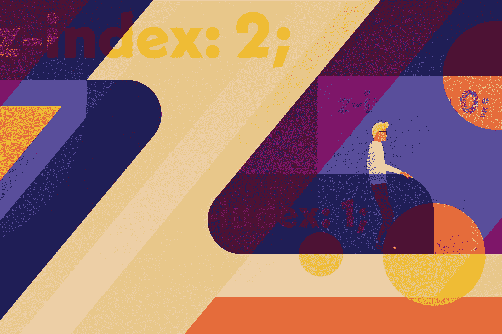
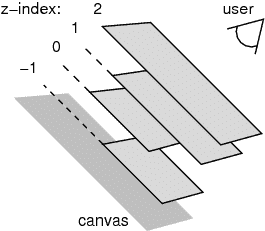
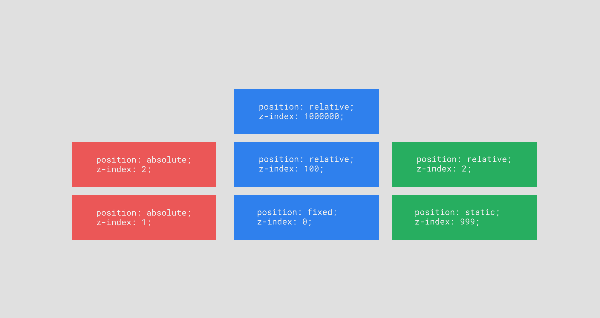

# CSS 如何工作:用 z-index 创建图层

> 原文：<https://blog.logrocket.com/how-css-works-creating-layers-with-z-index-6a20afe1550e/>

### 介绍

这篇文章是“CSS 如何工作”系列的第三篇，在这个系列中，我们深入研究 CSS 的基本构建模块，这些模块有时感觉像是魔法。不管你如何创作你的 CSS，知道你的样式表的“运行时间”总是好的，这样你就可以写高效的，可伸缩的 CSS。

以下是该系列的前两篇文章:

1.  [CSS 如何工作:解析&在关键渲染路径中绘制 CSS](https://blog.logrocket.com/how-css-works-parsing-painting-css-in-the-critical-rendering-path-b3ee290762d3):深入了解从浏览器请求 CSS 文件到用户实际看到屏幕上的像素之间 CSS 引擎中发生了什么。
2.  [CSS 如何工作:理解层叠](https://blog.logrocket.com/how-css-works-understanding-the-cascade-d181cd89a4d8):概述“CSS”中的“C”以及层叠算法如何将各种 CSS 规则解析为在浏览器中显示的实际样式。

今天我们将深入 CSS 的另一个“黑魔法”部分。玩弄`z-index`通常感觉就像把一个更高的数字扔向墙壁，看看会粘上什么。

但是如果我们剥开`z-index`(双关语😂)并看一看管理它的规则？

我们会发现它并不像我们想象的那么可怕。

### Z-Index 到底是什么？

归根结底，我们在浏览器中使用的屏幕是二维平面，有一堆像素。但是，如果你曾经在网上呆过一段时间，你可能经常会有“三维”的体验。例如，您可以单击一个按钮并打开一个模态，或者让工具提示显示在触发器的“上方”。

如果你假设用户正在“看着屏幕”,并想象屏幕是一个进入三维世界的入口，你可以开始想象浏览器中的三维空间是什么样子。首先，如果我们把这个空间想象成一个房间，那么“最远”的“墙”就是“画布”。

当在屏幕上绘制像素时，浏览器确保最靠近画布(或离我们最远)的像素首先被绘制。然后，它逐渐继续绘制更接近用户的元素，覆盖先前绘制的像素。

`z-index`属性指的是这个三维浏览器幻象中一个元素的绘制顺序。默认情况下，所有元素都有一个`0`的`z-index`，浏览器按照 DOM 顺序绘制。然而，`z—index`实际上给了我们对何时绘制元素的细粒度控制。通过分配一个较高的`z-index`，我们可以让元素以这样一种方式绘制，即当分配一个较低的(或负的！)`z-index`让我们将元素画得更接近画布。

在深入研究 [CSS 位置&布局规范的时候，](https://www.w3.org/TR/css-position-3/#layered-presentation)我发现了这张有用的图表，可以直观地向用户展示`z-index`层的外观。

Elements with a higher z-index appear “closer” to the user

如果我们只看`z-index`的这种行为，很容易被诱惑认为它是 100%直截了当的:更高的`z-index`等于更接近用户，更低的`z-index`则更远。然而，`z-index`有几个细微差别会引起很多困惑。

附加到`z-index`的第一个警告是*必须在定位元素*上才能生效。这意味着`z-index`只能用于改变堆叠顺序，如果你设置了`position`而不是`static`。在任何没有在元素上设置`position`的情况下，`z-index`将没有任何效果。

### 介绍堆叠环境

当我们考虑`z-index`的第二个警告时，`z-index`周围的水域变得更加模糊:它只适用于位于*堆栈上下文*中的元素。

堆叠上下文涉及一个 HTML 节点及其所有子节点。堆栈上下文根级别的 HTML 元素可以称为*堆栈根。*

文档的默认堆叠上下文(或“根堆叠上下文”)将`html`标记作为其堆叠根，默认情况下所有元素都属于该堆叠上下文。然而，任何 HTML 节点也可以是“本地堆栈上下文”的根元素。

有几种方法可以将元素指定为新的本地堆栈上下文的根:

1.  在元件上设置`position: absolute`或`position: relative`以及除`auto`之外的任何`z-index`。
2.  在元素上使用`position: fixed`或`position: sticky`。
3.  在元素上设置小于 1 的`opacity`。
4.  在元素上使用`transform`或`will-change`。

如果您想查看创建新堆栈上下文的更全面的方法列表，请查看 MDN 上的[这篇文章。](https://developer.mozilla.org/en-US/docs/Web/CSS/CSS_Positioning/Understanding_z_index/The_stacking_context)

作为一个例子，让我们想象三棵树的 HTML 节点，可视化为三个堆栈。在下图中，每个堆栈的底部是父 HTML 节点，子元素堆叠在顶部(有点像 HTML 树的“颠倒”表示)。让我们假设这些元素都是`body`标签的直接子元素。

Three stacks of elements, parent elements are on the bottom

如果我们在浏览器中预览这些 HTML 元素，它看起来会像这样:

Notice anything strange going on with the layers?

注意到什么有趣的事了吗？

首先，为什么`blue-child-2`在其他任何东西下面？它的`z-index`是一百万，所以应该在上面吧？

另外，为什么`green-child-1`显示在所有东西的上面，尽管它有一个`2`的`z-index`？我们不是说过较高的 z 索引“赢”过较低的 z 索引吗？

先说`green-child-1`。因为它的“父元素”—`green-parent`——有一个`999`的`z-index`，我们期望`green-parent`也在所有其他元素之上。但是如果我们回想起使用`z-index`的第一个警告，它对静态定位的元素没有影响。这意味着`green-child-1`是根堆叠上下文的一部分，它是根据根堆叠层中仅有的另外两个元素`red-parent`和`blue-parent`来衡量的。它的`z-index`比这两个都高，所以它显示在顶部。

了解到`red-parent`和`blue-parent`都创建了它们自己的本地堆栈上下文，这也有助于我们理解为什么`blue-child-2`出现在`red-parent`下面，尽管它的`z-index`比*高得多*。由于`z-index`只控制元素的位置*在其本地堆栈上下文*中，`blue-child-2`肯定会在`blue-parent`的所有子元素之上。但是`red-parent`比`blue-parent`有一个更高的`z-index`，*`*red-parent*`*里面的所有元素都会显示的比* `*blue-parent*` *高，不管它们的* `*z-index*` *是什么。**

 ** * *

### 更多来自 LogRocket 的精彩文章:

* * **  *为了让`blue-child-2`显示在`red-parent`之上，我们实际上必须改变我们的 HTML 结构，将`blue-child-2`从其当前的本地堆栈上下文&中取出，放入根堆栈上下文(或者至少放入`red-parent`之上的堆栈上下文)。

在一个较大的应用程序中，像这样的提取常常是棘手的(甚至是危险的)，尤其是当您试图管理语义 HTML 结构、可访问性和模块化组件架构之类的东西时。

您经常会看到许多组件库通过将元素附加到`body`标签而不是组件所在的位置来实现它们的重层 UI(工具提示和模态之类的东西)——这在很大程度上是为了避开这些堆栈上下文“陷阱”。这样做保证了严重依赖层的组件上的`z-index`总是引用根堆栈上下文，因此他们可以设置类似于`1000`的`z-index`,并相信它会显示在大多数元素的顶部。

### 结论

在一些场景中使用`z-index`可能很棘手，但是当我们知道它如何在幕后工作的规则时，我们发现它实际上表现得相当可预测。我猜想，围绕`z-index`的 99%的困惑源于对我们讨论的两个警告的误解。

作为一个快速的复习，它们又出现了，在 TL 中；时尚博士。

1.  `z-index`只作用于除了`static`之外还有`position`值的元素。
2.  `z-index`仅适用于一个元素在其所属*的*堆栈上下文*中的位置。*

我希望了解了`z-index`的内部知识后，你在接近多层 ui 及其各种陷阱时会有信心。我知道研究`z-index`和堆叠层对我感觉我进行 UI 开发的方式很有帮助——知道*分配什么数字*比仅仅把`z-index`值扔在墙上是一个很大的进步。

## 200 只显示器出现故障，生产中网络请求缓慢

部署基于节点的 web 应用程序或网站是容易的部分。确保您的节点实例继续为您的应用程序提供资源是事情变得更加困难的地方。如果您对确保对后端或第三方服务的请求成功感兴趣，

[try LogRocket](https://lp.logrocket.com/blg/node-signup)

.

[https://logrocket.com/signup/](https://lp.logrocket.com/blg/node-signup)

LogRocket 就像是网络和移动应用程序的 DVR，记录下用户与你的应用程序交互时发生的一切。您可以汇总并报告有问题的网络请求，以快速了解根本原因，而不是猜测问题发生的原因。

LogRocket 检测您的应用程序以记录基线性能计时，如页面加载时间、到达第一个字节的时间、慢速网络请求，还记录 Redux、NgRx 和 Vuex 操作/状态。

[Start monitoring for free](https://lp.logrocket.com/blg/node-signup)

.

* * **