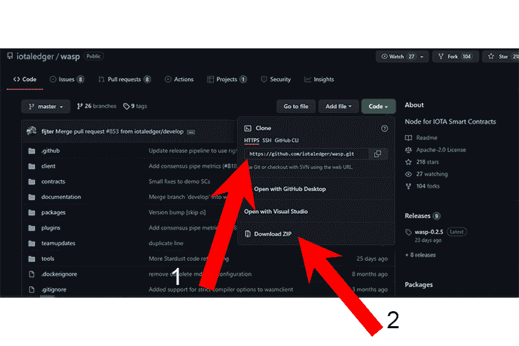
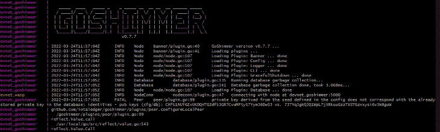
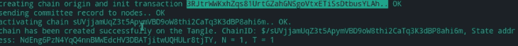
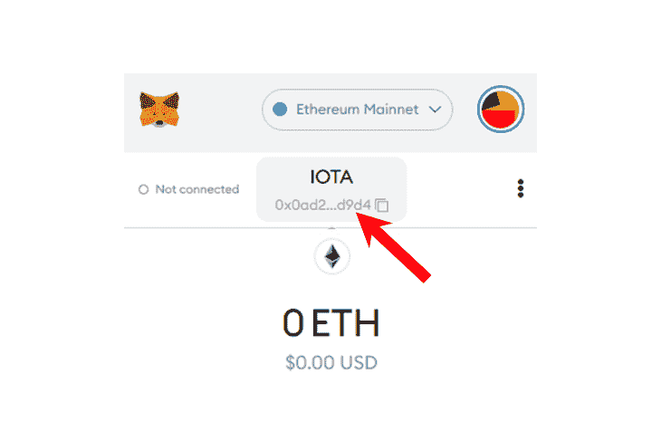
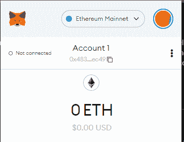
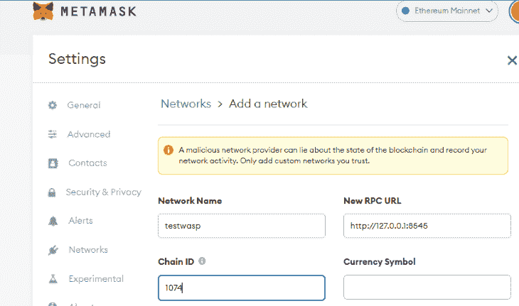
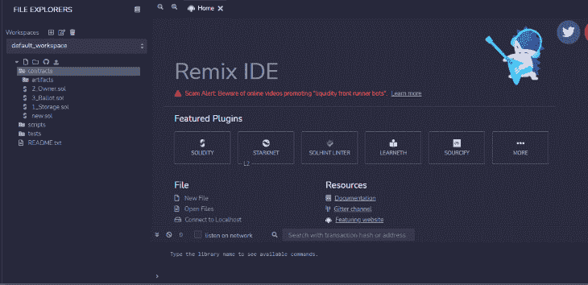
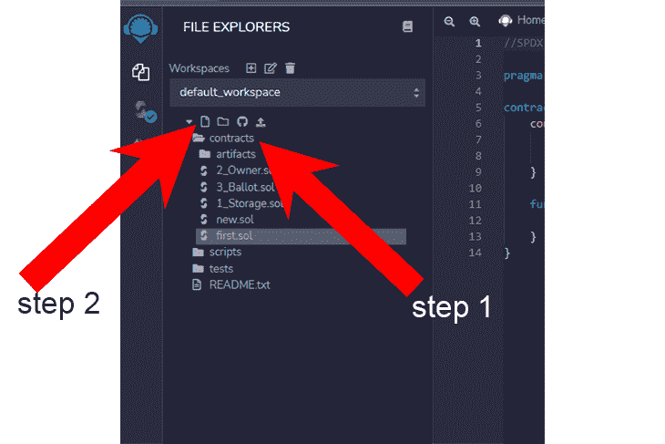
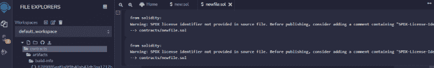
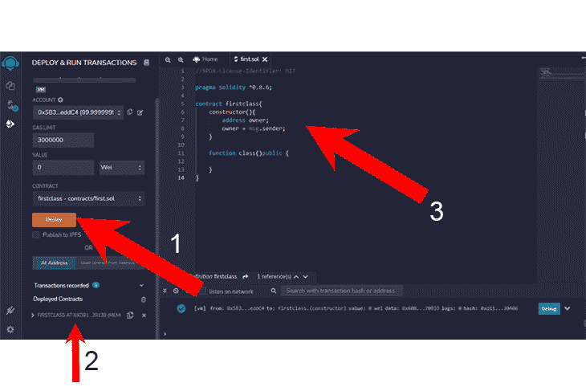

# 如何在 IOTA - LogRocket 博客上部署智能合同

> 原文：<https://blog.logrocket.com/how-deploy-smart-contracts-iota/>

本文介绍了开源分布式分类帐 [IOTA](https://www.iota.org) (物联网应用程序)，解释了 IOTA 的无气体交易如何工作，并演示了在 IOTA 上部署智能合同的两种方法。

在撰写本文时，IOTA 仍然是一个早期的平台，它的文档相当混乱。本文旨在揭示并简化 IOTA 智能合约部署过程。

在演示中，我们将使用 [IOTA 智能合约协议(ISCP)](https://wiki.iota.org/smart-contracts/overview#1-create-a-smart-contract) 逐步完成 IOTA 上节点、链和 EVM 合约的完整部署。我们还将展示如何使用 Remix IDE 在 IOTA 上部署智能合约。

*向前跳转:*

## 先决条件

要跟随本文中的演示，您需要以下内容:

*   固体的基本知识
*   具有至少三个内核的新一代处理器
*   GitHub 账户；如果你没有，你可以[在这里](https://docs.github.com/en/github-ae@latest/get-started/writing-on-github/editing-and-sharing-content-with-gists/creating-gists)创建一个
*   Go 1.16
*   码头工人
*   尝试
*   访问用于生产的 [GoShimmer](https://github.com/iotaledger/goshimmer) 节点(可选)
*   再搅拌

在开始演示之前，让我们花点时间来探索 IOTA。

## IOTA 和区块链有什么不同？

IOTA 是一个分布式分类账，就像区块链一样，但是它的数据结构是不同的。IOTA 不是以块的形式存储和传输数据，而是使用一个有向无环图(DAG ),称为 Tangle。IOTA 称自己为 DLT 解决方案，而不是区块链。

以下是关于 IOTA 的一些附加细节:

*   收费:不收费；IOA 是免费的
*   验证:对矿工的工作证明激励
*   事务和数据存储:称为消息的对象用于存储数据和事务；消息存储在 Tangle 中，并由节点维护
*   事务处理时间:与区块链不同，在后者中，验证器只能将新消息放在块的末尾，处理按顺序进行，IOTA 消息可以放在混乱中的任何地方，它们被并行处理
*   交易验证时间:由于其并行处理，IOTA 交易在[秒](https://explorer.iota.org/mainnet)内验证，相比之下，以太坊的[约为 13 分钟](https://ycharts.com/indicators/ethereum_average_block_time)，比特币的[约为 19 分钟](https://ycharts.com/indicators/bitcoin_average_confirmation_time)

有关 IOTA 的更多信息，请参见[官方维基](https://wiki.iota.org/learn/about-iota/an-introduction-to-iota)。

## IOTA 智能合同协议演示

要使用 ISCP 在 IOTA 上运行智能合约，我们需要创建以下内容:

让我们从创建一个 Wasp 节点并让它运行开始。一个 [Wasp](https://github.com/iotaledger/wasp) 节点是一个基础二进制软件，专门开发用于在 IOTA 智能合同协议(ISCP)上运行。

### 运行 Wasp 节点

要运行 Wasp 节点，首先打开 Bash。

然后，将 cd 放入您的文件夹(下面的步骤 1)并克隆 Wasp [GitHub repo](https://github.com/iotaledger/wasp) (下面的步骤 2):



代码如下:

```
cd Desktop 
git clone https://github.com/iotaledger/wasp
cd wasp
make build -t wasp-node .

```

在上面的代码块中，你会注意到我们使用了`make build`而不是`make install`。我们实际上可以使用这两个命令中的任何一个来构建我们的节点库，但是每一个做同样的事情都有一点不同。

`make install`将二进制文件存储在我们的全局 bin 中，可以使用`./wasp`调用。

然而，`make build`将二进制文件存储在我们的本地 bin 文件中，并且可以直接从我们想要的目录中调用。

对于这个演示，我将使用一个预先配置的开发 Docker 设置。Docker 将使用修改后的 GoShimmer 映像和 Wasp 二进制文件，以方便节点通信。

如果您愿意，您可以遵循直接节点安装，而不是 [Docker 安装](https://wiki.iota.org/smart-contracts/guide/chains_and_nodes/docker_standalone)。你可以在这里找到直接节点安装[的说明。](https://wiki.iota.org/smart-contracts/guide/chains_and_nodes/running-a-node)

接下来，通过运行以下命令设置`docker-compose`:

```
docker-compose up

```

构建和存储二进制文件需要几分钟时间。在等待二进制文件完成时，您可能想喝杯咖啡。

安装后，使用您选择的编辑器打开`docker_config.json`文件。

```
notepad docker_config.json 

```

现在，如下面的代码块所示更改`nodeconn`。这一点非常重要。

```
  "database": {
    "directory": "waspdb"
  },
  "logger": {
    "level": "debug",
    "disableCaller": false,
    "disableStacktrace": true,
    "encoding": "console",
    "outputPaths": [
      "stdout",
      "wasp.log"
    ],
    "disableEvents": true
  },
  "network": {
    "bindAddress": "0.0.0.0",
    "externalAddress": "auto"
  },
  "node": {
    "disablePlugins": [],
    "enablePlugins": []
  },
  "webapi": {
    "bindAddress": "0.0.0.0:9090"
  },
  "dashboard": {
    "auth": {
      "scheme": "basic",
      "username": "wasp",
      "password": "wasp"
    },
    "bindAddress": "0.0.0.0:7000"
  },
  "peering":{
    "port": 4000,
    "netid": "127.0.0.1:4000"
  },
  "nodeconn": {
    "address": "goshimmer:5000"
  },
  "nanomsg":{
    "port": 5550
  }
}

```

接下来，通过运行以下命令测试您的节点:

```
docker-compose up

```

您应该会在屏幕上看到这样的输出:



您可以通过打开本地主机上的 GoShimmer 页面来检查您的结果:`[http://127.0.0.1:7000](http://127.0.0.1:7000)`。

### 创造一条黄蜂链

既然已经创建了节点，下一步就是创建 Wasp 链(IOTA 对区块链的术语)来运行节点。

要运行 Wasp 链，您必须已经有一个 Wasp 节点在运行。使用此命令:

```
docker-compose up

```

节点运行后，立即初始化链:

```
./wasp-cli init

```

这将创建一个`wasp-cli.json`文件:



接下来，添加您的元掩码钱包地址:



这将初始化文件并创建一个 wallet。但是，由于您可能在页面上看不到这样的内容，所以复制代码并保存在您的`wasp-cli.json`文件中:

```
{
"wallet":{
"seed": "j0x483f2BF505E7e494a87cC4AC9eD563e21756ec49"
},
"wasp":{
"0":
"api": "127.0.0.1:9090",
"namomsg":127.0.0:5550",
"peering":127.0.0:4000"
}
},
"goshimmer":{
"api":"shimmer.chrysalis2.com:8080",
"faucetpowtarget": -1
}
}

```

现在，保存文件并通过运行以下命令请求资金:

```
./wasp-cli request funds

```


接下来，运行以下代码，使用 Wasp CLI 工具部署一个链:

```
./wasp-cli chain deploy --committee=0 --quorum=1 --chain=wasptest --description="My first deployment" 

```

上述命令功能定义如下:

*   `committee`:创建在一个节点中一起工作的多个相似的对等体
*   `quorum`:在允许一个交易通过之前可以同意的节点数
*   `chain`:部署的名称

要了解更多关于建立 Wasp 链的信息，请参见 IOTA 的 Wiki。

### 创建以太坊虚拟机链

接下来，我们将在 IOTA Wasp 链中创建一个以太坊虚拟机链。这是我们之前创建的 IOTA 链，目前正在 Wasp 节点上运行。

我应该在这里提到，我们选择使用 EVM 链来引入混音和 MetaMask。还有很多其他的连锁店可以选择，但是 EVM 提供了很多资源，比其他连锁店更稳定。要了解更多关于 EVM 和 IOTA 的信息，请参考 IOTA 的 Wiki。

你应该知道 IOTA 对 EVM 的支持仍然是试验性的。以下是一些需要注意的限制:

*   EVM 链将需要从分配给单个地址的新的 EVM 专用令牌供应开始
*   EVM 在 IOTA 智能合约中运行，因此任何令牌都需要手动存放

这些信息瞬息万变，但你可以在这里阅读最新的更新[。](https://wiki.iota.org/smart-contracts/guide/evm/limitations)

### 部署智能合同

目前，ISCP 不会自动执行构建智能合同的流程。但是，您可以[从头构建一个 Solidity smart 契约](https://blog.logrocket.com/writing-smart-contracts-solidity/)或者使用 Remix IDE 开发一个契约(我们将在本文后面演示)。

要部署您的智能合同，您必须同时运行 Wasp 节点和 Wasp 链。

接下来，使用以下命令为您的帐户注入资金:

```
wasp-cli chain deposit IOTA:10000

```

这为支付 EVM 连锁合同提供了资金。



现在，使用以下代码片段部署协定:

```
wasp-cli chain evm deploy -a mychain --alloc 0x483f2BF505E7e494a87cC4AC9eD563e21756ec49:1000000000000000000000000

```

此时，您已经部署了 EVM 合同。现在，我们需要链接元掩码帐户。

### 设置 RPC 服务器

为了使您的元掩码帐户能够与合同通信，我们需要设置一个 RPC 服务器。

运行以下命令:

```
wasp-cli chain evm jsonrpc --chainid 1074

```

这将在端口 8545 上启动一个链 ID 为 1074 的 JSON-RPC 服务器。



我们已经演示了如何使用 IOTA 智能合约协议部署智能合约。现在，让我们看看如何使用 Remix IDE 在 IOTA 上构建和部署智能契约。

## 重新混合 IDE 智能合约演示

对于这个演示，我们将使用 Remix IDE 来构建和部署我们的 Solidity 智能合约。

点击[这里](https://remix.ethereum.org/#optimize=false&runs=200&evmVersion=null&version=soljson-v0.8.7+commit.e28d00a7.js)开始——这将打开混音界面。



接下来，点击**合同**(下面的步骤 1)并点击文件图标(下面的步骤 2)来创建一个名为`first.sol`的新文档



出于演示的目的，我们将创建一个简单的契约，它什么也不做，只是使我们能够将重新混合过程和接口分解成简单的步骤。

### 工作空间

所有的混音合同和项目都存放在一个工作空间中。我们将创建一个名为`new.sol`的新合同。`.sol`文件前缀表示它是为了稳固。



### 许可证

稳固必须总是从许可证开始。我们有许多不同的许可证，但我们将使用`MIT license`。如果您没有包含许可证，Solidity 将抛出一个错误。

### 版本

对于这个演示，我们将使用 Solidity v0.8.6。版本很重要，因为如果版本和编译器不同，它将抛出一个错误。请注意，在下面的代码块中，我们在版本之前使用了^。对于这个字符，我们指定我们希望 Solidity 使用列出的版本(0.8.6)或更高版本。

```
//SPDX-License-Identifier: MIT
pragma solidity ^0.8.6;

```

我们也可以这样规定实度版本:`>=0.4.17 < 0.9.0;`。这将指示编译器使用从`0.4.17`到`0.9.0`的任何版本

### 合同名称和`constructor()`

在创建合同时，我们用花括号{ }打开它，并把合同名称作为我们打开的合同`firstclass`。

构造函数是一个非常重要的函数，只运行一次，它在部署契约时运行。

```
contract firstclass{
    constructor(){
        address owner;
        owner = msg.sender;
    }
    function class()public {

    }
}

```

### 通过 Remix IDE 进行部署

在部署合同之前，检查其中的错误非常重要。如果存在错误，则不会部署合同。

在左侧面板(下方)上，您可以看到部署按钮(#1)，单击该按钮会创建一个部署文件(#2)。合同代码在#3 中可见。这是已部署的契约，因为它可以在 IOTA chainlink 上进行交互。



## 结论

吼吼！！！我们刚刚使用两种不同的方法在 IOTA 上完成了 Wasp 节点、链、EVM 合同的全面部署。在撰写本文时，IOTA 仍处于相当早期的阶段，但它正在迅速普及。IOTA 的无气基础设施提供了很多希望，特别是随着人们对许多区块链的环境影响越来越关注。

这里有一些额外的资源，用于[在 Solidity】中从头开始编写智能合同，以及](https://blog.logrocket.com/writing-smart-contracts-solidity/)[在 IOTA](https://wiki.iota.org/smart-contracts/overview#1-create-a-smart-contract) 上创建智能合同。

## 加入像 Bitso 和 Coinsquare 这样的组织，他们使用 LogRocket 主动监控他们的 Web3 应用

影响用户在您的应用中激活和交易的能力的客户端问题会极大地影响您的底线。如果您对监控 UX 问题、自动显示 JavaScript 错误、跟踪缓慢的网络请求和组件加载时间感兴趣，

[try LogRocket](https://lp.logrocket.com/blg/web3-signup)

.

[](https://lp.logrocket.com/blg/web3-signup)[https://logrocket.com/signup/](https://lp.logrocket.com/blg/web3-signup)

LogRocket 就像是网络和移动应用的 DVR，记录你的网络应用或网站上发生的一切。您可以汇总和报告关键的前端性能指标，重放用户会话和应用程序状态，记录网络请求，并自动显示所有错误，而不是猜测问题发生的原因。

现代化您调试 web 和移动应用的方式— [开始免费监控](https://lp.logrocket.com/blg/web3-signup)。