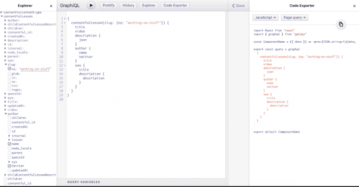

# GraphQL 如何提升 Gatsby 的性能

> 原文：<https://blog.logrocket.com/how-graphql-boosts-performance-in-gatsby/>

随着网络创作过程的不断发展，我们看到方法也在不断改进。工程师们想方设法将最佳技术的最佳部分融合在一起，创造出一个更高效的系统。

当在传统的网络平台中获取数据时，这个过程主要由[获取 API](https://developer.mozilla.org/en-US/docs/Web/API/Fetch_API) 、 [Axios 库](https://www.npmjs.com/package/axios)或者使用像 [GraphQL](https://graphql.org/learn/) 这样的查询语言来处理。这些数据主要在运行时处理。然而，我们已经看到，在运行时处理数据时，我们可能会注意到，如果处理不当，应用程序中的这个例程可能会导致比所需时间更长的加载时间。作为一个解决方案，我们可以利用一些抽象，在运行时获取一些数据，同时在构建时使用静态内容进行优化，并提供性能优势。

与静态站点一样，大多数数据都是在构建时获取的。在本文中，我们将了解 PWA 生成器 [Gatsby](https://gatsbyjs.org) 如何使用 [GraphQL](https://graphql.org/learn/) 在构建时获取数据，以及它对性能的影响。

## 在没有 GraphQL 的情况下在 Gatsby 中提取数据

Gatsby 提供了三种在站点中创建路由的主要方法——将组件添加到页面文件夹，使用 CreatPages API 从`gatsby-node.js`文件以编程方式创建页面，以及使用可以创建页面的插件。

这些方法可以同时使用，也可以单独使用，如果使用正确，会给你最好的盖茨比体验。为了理解 GraphQL 在 Gatsby 中的优势，您将看到一个不用 GraphQL 以编程方式创建页面的示例。

Gatsby 允许您使用`gatsby-node.js`中的 createPages API 以编程方式创建页面，如下面的代码块所示:

```
exports.createPages = ({ actions: { createPage } }) => {
  createPage({
    path: "/page-with-no-graphql/",
    component: require.resolve("./src/templates/page-with-no-graphql"),
    context: {
      title: "Getting data without GraphQL!",
      content: "<p>This is page content.</p><p>No GraphQL required!</p>",
    },
  })
}
```

在上面的代码块中，我们从`actions`对象中析构了`createPage`函数，并向其传递了一个路径。这个路径就是页面显示时显示的路线。我们还解析了一个组件，它是页面将要填充的模板布局。最后，页面的上下文是在带有`pageContext`对象的模板中可用的内容。

从下面的代码块中，我们可以看到，在`/src/templates/page-with-no-graphql`文件中，我们可以通过 pageContext 访问`gatsby.node.js`中的上下文:

```
import React from "react"

const WithContext = ({ pageContext }) => (
  <section>
    <h1>{pageContext.title}</h1>
    <div dangerouslySetInnerHTML={{ __html: pageContext.content }} />
  </section>
)

export default WithContext
```

运行`gatsby develop`后，你会在`[http://localhost:8000/page-with-no-graphql/](http://localhost:8000/page-with-no-graphql/)`看到网站。

这种方法的缺点是，我们必须不断地改变和更新我们想要创建的每个页面的上下文。这感觉像是一个永远无法完成的任务。

## 向`gatsby-node.js`介绍查询

为了解决必须手动更新在`gatsby-node.js`中创建的每个页面的路径的缺点，Gatsby 附带了 GraphQL，它使您能够使用查询来获得您正在获取的数据的更具描述性的视图。

为了使这个过程更容易，可以从一个叫做 [GraphiQL](https://github.com/graphql/graphiql) 的工具中生成查询，在运行`gatsby develop`之后的`[http://localhost:8000/___graphql](http://localhost:8000/___graphql)`可以获得这个工具。

通过单击左侧的框，将为您生成查询。您还可以通过点击左上角的 play 按钮来测试查询，看看它们返回了什么。这将显示查询的预期值，并给出如何获得所需值的想法。它进一步允许您使用代码导出器在组件设置中可视化查询:



在`gatsby-node.js`中，您可以使用刚刚编写的 GraphQL 查询来生成页面，就像这样:

```
exports.createPages = async ({ actions: { createPage }, graphql }) => {
  const results = await graphql(`
    {
      allProductsJson {
        edges {
          node {
            slug
          }
        }
      }
    }
  `)
  results.data.allProductsJson.edges.forEach(edge => {
    const product = edge.node
    createPage({
      path: `/gql/${product.slug}/`,
      component: require.resolve("./src/templates/product-graphql.js"),
      context: {
        slug: product.slug,
      },
    })
  })
}
```

您需要使用`[createPages](https://www.gatsbyjs.org/docs/node-apis/#createPages)` [节点 API](https://www.gatsbyjs.org/docs/node-apis/#createPages) 可用的`graphql`助手来执行查询。要确保在继续之前返回查询结果，请使用 [`async/await`](https://developer.mozilla.org/en-US/docs/Web/JavaScript/Reference/Statements/async_function) 。

返回的结果与`data/products.json`的内容非常相似，因此您可以遍历结果并为每个结果创建一个页面。

但是，请注意，您只是在`context`中传递了`slug`——您将在模板组件中使用它来加载更多的产品数据。

正如您已经看到的，`context`参数可用于`pageContext`属性中的模板组件。为了使查询更强大，Gatsby 还将`context`中的所有东西都公开为一个 GraphQL 变量，这意味着您可以编写一个查询，用简单的英语说，“用`context`中传递的 slug 加载产品数据”。

下面是来自`src/templates/product-graphql.js`文件的实际情况:

```
import React from "react"
import { graphql } from "gatsby"
import Image from "gatsby-image"
export const query = graphql`
  query($slug: String!) {
    productsJson(slug: { eq: $slug }) {
      title
      description
      price
      image {
        childImageSharp {
          fluid {
            ...GatsbyImageSharpFluid
          }
        }
      }
    }
  }
`
const Product = ({ data }) => {
  const product = data.productsJson
  return (
    <div>
      <h1>{product.title}</h1>
      <Image
        fluid={product.image.childImageSharp.fluid}
        alt={product.title}
        style={{ float: "left", marginRight: "1rem", width: 150 }}
      />
      <p>{product.price}</p>
      <div dangerouslySetInnerHTML={{ __html: product.description }} />
    </div>
  )
}
export default Product
```

## 查询`gatsby-node.js`的上下文对象中的所有字段

想象一个场景，您可以在`gatsby-node.js`中查询模板需要的所有参数。这意味着什么？在本节中，我们将对此进行研究。

在最初的方法中，您已经看到了`gatsby-node.js`文件将具有如下查询块:

```
const queryResults = await graphql(`
    query AllProducts {
      allProducts {
        nodes {
          id
        }
      }
    }
  `);
```

使用`id`作为访问点来查询模板中的其他属性是默认的方法。但是，假设您有一个产品列表，其中包含您想要查询的属性。完全从`gatsby-node.js`处理查询将导致查询如下所示:

```
exports.createPages = async ({ graphql, actions }) => {
  const { createPage } = actions;
  const queryResults = await graphql(`
    query AllProducts {
      allProducts {
        nodes {
          id
          name
          price
          description
        }
      }
    }
  `);
  const productTemplate = path.resolve(`src/templates/product.js`);
  queryResults.data.allProducts.nodes.forEach(node => {
    createPage({
      path: `/products/${node.id}`,
      component: productTemplate,
      context: {
        // This time the entire product is passed down as context
        product: node
      }
    });
  });
};
};
```

> 您现在在一个查询中请求您需要的所有数据(这要求服务器端支持在一个数据库查询中获取许多产品)。
> 只要您可以通过`pageContext`将这些数据传递给模板组件，模板根本不需要进行 GraphQL 查询。

您的模板`src/templates/product.js`文件看起来会像这样:

```
function Product({ pageContext }) {
  return (
    <div>
      Name: {pageContext.name}
      Price: {pageContext.price}
      Description: {pageContext.description}
    </div>
  )
}
```

## 从`gatsby-node.js`查询所有字段的性能影响

在模板组件中使用`pageContext` props 可以带来性能优势，即在构建时从 createPages API 中获取所有需要的数据。这消除了在模板组件中使用 GraphQL 查询的需要。它的好处是在声明了`context`参数之后，可以从一个地方查询数据。

然而，它并没有给你机会去了解你在模板中到底在查询什么，以及在`gatsby-node.js`中组件查询结构是否发生了任何变化。[热重装](https://www.gatsbyjs.org/docs/glossary#hot-module-replacement)被取消，站点需要重建以反映变化。

Gatsby 将页面元数据(包括上下文)存储在 redux store 中(这也意味着它存储页面的内存)。对于较大的网站(通过页面上下文传递的页面数量和/或数据量)，这将导致问题。如果数据太多或性能下降，可能会出现“内存不足”故障:

> 如果存在内存压力，Node.js 将更频繁地尝试垃圾收集，这是一个已知的性能问题。

页面查询结果不会永久存储在内存中，而是在运行查询后立即保存到磁盘中。

我建议传递“id”或“slugs ”,并在页面模板查询中进行完整查询，以避免这种情况。

## 这种方法的增量构建权衡

在`gatsby-node.js`中查询所有数据的另一个缺点是，每次做出更改时，您的站点都必须重新构建，因此您将无法利用增量构建。

## 结论

在这篇博文中，我们已经了解了 Gatsby 如何在其数据层使用 GraphQL 在构建时获取静态数据。我们还看到了查询`gatsby-node.js`中所有字段的性能含义。我希望这篇博文有助于解开围绕这两种技术之间关系的“为什么”,以及它们如何帮助为 Gatsby 用户提供惊人的体验。快乐编码，一定要看看[盖茨比教程](https://www.gatsbyjs.org/tutorial/)。

## 监控生产中失败和缓慢的 GraphQL 请求

虽然 GraphQL 有一些调试请求和响应的特性，但确保 GraphQL 可靠地为您的生产应用程序提供资源是一件比较困难的事情。如果您对确保对后端或第三方服务的网络请求成功感兴趣，

[try LogRocket](https://lp.logrocket.com/blg/graphql-signup)

.

[](https://lp.logrocket.com/blg/graphql-signup)[https://logrocket.com/signup/](https://lp.logrocket.com/blg/graphql-signup)

LogRocket 就像是网络和移动应用的 DVR，记录下你网站上发生的每一件事。您可以汇总并报告有问题的 GraphQL 请求，以快速了解根本原因，而不是猜测问题发生的原因。此外，您可以跟踪 Apollo 客户机状态并检查 GraphQL 查询的键值对。

LogRocket 检测您的应用程序以记录基线性能计时，如页面加载时间、到达第一个字节的时间、慢速网络请求，还记录 Redux、NgRx 和 Vuex 操作/状态。

[Start monitoring for free](https://lp.logrocket.com/blg/graphql-signup)

.