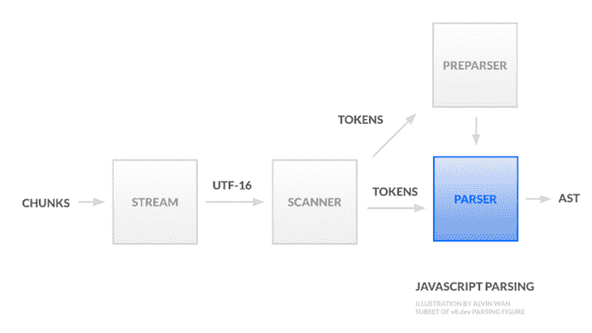

# JavaScript 如何工作:优化解析效率

> 原文：<https://blog.logrocket.com/how-javascript-works-optimizing-for-parsing-efficiency/>

理解 JavaScript 如何工作是编写高效 JavaScript 的关键。有无数种方法可以写出更高效的代码。例如，你可以编写[编译器友好的 JavaScript](https://blog.logrocket.com/how-javascript-works-optimizing-the-v8-compiler-for-efficiency/) 来避免一个简单的单行程序的[速度降低 7 倍。](https://www.freecodecamp.org/news/javascript-essentials-why-you-should-know-how-the-engine-works-c2cc0d321553/)

在本文中，我们将重点关注最小化解析时间的 JavaScript 优化方法。我们将把我们的讨论缩小到 V8，为[电子](https://electronjs.org/)、 [Node.js](https://nodejs.org/en/) 和[谷歌 Chrome](https://www.google.com/chrome/) 提供动力的 JS 引擎。为了理解解析友好的优化，我们必须首先讨论 JavaScript 解析是如何工作的。本教程概述了编写更快 JavaScript 的三个技巧，每一个都源于对解析的更深入理解。

作为复习，让我们回顾一下 JavaScript 执行的三个阶段。

1.  源到语法树—解析器从源生成一个[抽象语法树(AST)](https://en.wikipedia.org/wiki/Abstract_syntax_tree)
2.  字节码的语法树——V8 的解释器， [Ignition](https://v8.dev/docs/ignition) ，从语法树生成字节码(这个字节码步骤在 2017 之前[不存在；这里描述的是 2017 款前 V8](https://docs.google.com/presentation/d/1chhN90uB8yPaIhx_h2M3lPyxPgdPmkADqSNAoXYQiVE/edit#slide=id.g18d89eb289_1_362)
3.  字节码到机器码——V8 的编译器[涡扇](https://v8.dev/docs/turbofan)从字节码生成图形，用高度优化的机器码替换字节码部分

第二和第三阶段涉及 [JavaScript 编译](https://blog.logrocket.com/how-javascript-works-optimizing-the-v8-compiler-for-efficiency/)。在本教程中，我们将详细讨论第一个阶段，并揭示其对编写高效 JavaScript 的影响。我们将按从左到右和从上到下的顺序讨论解析管道。管道接受源代码并输出语法树。



Abstract syntax tree (AST). The tree itself is constructed in the parser, highlighted in blue.

## 扫描仪

源代码首先被分成块；每个组块可以与不同的编码相关联。然后一个流统一了 UTF-16 编码下的所有块。

在解析之前，扫描器将 UTF-16 流分解成标记。标记是脚本中具有语义意义的最小单位。有几类标记，包括空白(用于自动分号插入(T1))、标识符、关键字和代理对(只有当代理对不能被识别为其他任何东西时，才组合成标识符)。然后，这些标记首先被提供给解析器，然后被提供给解析器。

## 准备

预解析器做最少的工作，仅够跳过传入的源代码，支持延迟解析(与急切解析相反)。预解析器确保输入源代码包含有效的语法，并产生足够的信息来正确编译外部函数。这个预解析的函数以后会根据需要进行编译。

## 句法分析程序

给定扫描器生成的标记，解析器现在需要生成一个中间表示供编译器使用。

我们需要首先讨论解析树。解析树，或[具体语法树(CST)](https://en.wikipedia.org/wiki/Parse_tree) ，将源语法表示为树。每个叶节点是一个标记，每个中间节点代表一个语法规则。对于英语，语法规则可以是名词、主语等。对于代码来说，语法规则就是一个表达式。然而，相对于程序的大小，解析树的大小增长很快。

另一方面，[抽象语法树(AST)](https://en.wikipedia.org/wiki/Abstract_syntax_tree) 要紧凑得多。每个中间体代表一个构造，比如一个减法运算(`-`)，并不是源代码中的所有细节都在树中表示。例如，由括号定义的分组隐含在树形结构中。此外，省略了标点符号、分隔符和空格。你可以在这里找到 ASTs 和 CST 区别的具体例子[。](https://ruslanspivak.com/lsbasi-part7/)

让我们特别关注一下 ASTs。以下面 JavaScript 中的 Fibonacci 程序为例。

```
function fib(n) {
  if (n <= 1) return n;
  return fib(n-1) + fib(n-2);
}

```

对应的[抽象语法](https://gist.github.com/alvinwan/845fd8ecbb559124271bfdc7bf4491f6)如下，表示为 JSON，使用 [AST Explorer](https://astexplorer.net/#/gist/638ea8b192e66137d361988bc7772f39/81a762666377d6bb1853d79409378b9f0233b67d) 生成(如果你需要复习一下，请阅读[如何读取 JSON 格式的 AST 的详细演练](https://blog.logrocket.com/using-typescript-transforms-to-enrich-runtime-code-3fd2863221ed/))。

```
{
  "type": "Program",
  "start": 0,
  "end": 73,
  "body": [
    {
      "type": "FunctionDeclaration",
      "start": 0,
      "end": 73,
      "id": {
        "type": "Identifier",
        "start": 9,
        "end": 12,
        "name": "fib"
      },
      "expression": false,
      "generator": false,
      "async": false,
      "params": [
        {
          "type": "Identifier",
          "start": 13,
          "end": 14,
          "name": "n"
        }
      ],
      "body": {
        "type": "BlockStatement",
        "start": 16,
        "end": 73,
        "body": [
          {
            "type": "IfStatement",
            "start": 20,
            "end": 41,
            "test": {
              "type": "BinaryExpression",
              "start": 24,
              "end": 30,
              "left": {
                "type": "Identifier",
                "start": 24,
                "end": 25,
                "name": "n"
              },
              "operator": "<=",
              "right": {
                "type": "Literal",
                "start": 29,
                "end": 30,
                "value": 1,
                "raw": "1"
              }
            },
            "consequent": {
              "type": "ReturnStatement",
              "start": 32,
              "end": 41,
              "argument": {
                "type": "Identifier",
                "start": 39,
                "end": 40,
                "name": "n"
              }
            },
            "alternate": null
          },
          {
            "type": "ReturnStatement",
            "start": 44,
            "end": 71,
            "argument": {
              "type": "BinaryExpression",
              "start": 51,
              "end": 70,
              "left": {
                "type": "CallExpression",
                "start": 51,
                "end": 59,
                "callee": {
                  "type": "Identifier",
                  "start": 51,
                  "end": 54,
                  "name": "fib"
                },
                "arguments": [
                  {
                    "type": "BinaryExpression",
                    "start": 55,
                    "end": 58,
                    "left": {
                      "type": "Identifier",
                      "start": 55,
                      "end": 56,
                      "name": "n"
                    },
                    "operator": "-",
                    "right": {
                      "type": "Literal",
                      "start": 57,
                      "end": 58,
                      "value": 1,
                      "raw": "1"
                    }
                  }
                ]
              },
              "operator": "+",
              "right": {
                "type": "CallExpression",
                "start": 62,
                "end": 70,
                "callee": {
                  "type": "Identifier",
                  "start": 62,
                  "end": 65,
                  "name": "fib"
                },
                "arguments": [
                  {
                    "type": "BinaryExpression",
                    "start": 66,
                    "end": 69,
                    "left": {
                      "type": "Identifier",
                      "start": 66,
                      "end": 67,
                      "name": "n"
                    },
                    "operator": "-",
                    "right": {
                      "type": "Literal",
                      "start": 68,
                      "end": 69,
                      "value": 2,
                      "raw": "2"
                    }
                  }
                ]
              }
            }
          }
        ]
      }
    }
  ],
  "sourceType": "module"
}

*(Source: [GitHub](https://gist.github.com/alvinwan/845fd8ecbb559124271bfdc7bf4491f6))*
```

上面的要点是每个节点是一个操作符，叶子是操作数。然后，这个 AST 被作为 JavaScript 执行的下两个阶段的输入。

## 优化 JavaScript 的 3 个技巧

在下面的列表中，我们将省略那些被广泛采用的技巧，比如缩小你的代码以最大化信息密度，使扫描器更省时。此外，我们将跳过不太适用的建议，比如避免使用非 ASCII 字符。

可以采取无数步骤来提高解析性能。让我们突出几个最广泛适用的。

### 1.尽可能遵从工作线程

阻塞主线程会延迟用户交互，因此应该尽可能地从主线程上卸载工作。关键是识别和避免可能导致主线程中长时间运行任务的解析器行为。

这种启发性超越了对解析器的优化。例如，用户控制的 JavaScript 片段可以利用 [web workers](https://blog.logrocket.com/using-webworkers-for-safe-concurrent-javascript-3f33da4eb0b2/) 达到同样的效果。有关更多信息，请参见这些教程，分别针对[实时处理应用](https://blog.logrocket.com/real-time-processing-web-workers/)和 [angular with web workers](https://blog.logrocket.com/how-to-execute-a-function-with-a-web-worker-on-a-different-thread-in-angular/) 。

#### 避免大型内联脚本

内联脚本在主线程上处理，根据上面的启发，应该避免使用。事实上，任何 JavaScript 加载都会阻塞主线程，除了异步和延迟加载。

#### 避免包装外部函数

惰性编译也发生在主线程上。但是，如果操作正确，惰性解析可以加快启动时间。为了[强制急切解析](https://blog.sessionstack.com/how-javascript-works-parsing-abstract-syntax-trees-asts-5-tips-on-how-to-minimize-parse-time-abfcf7e8a0c8)，你可以使用像 [optimize.js](https://github.com/nolanlawson/optimize-js) (无人维护)这样的工具来决定是急切解析还是懒惰解析。

#### 分解 100kB 以上的文件

将大文件分解成小文件，以最大化并行脚本加载。“[Java](https://v8.dev/blog/cost-of-javascript-2019#impact)[S](https://v8.dev/blog/cost-of-javascript-2019#impact)[script 2019](https://v8.dev/blog/cost-of-javascript-2019#impact)”报告比较了脸书和 Reddit 的文件大小。前者只在主线程上执行了 30%的解析和编译，将大约 6MB 的 JavaScript 代码分配给近 300 个请求。相比之下，Reddit JavaScript 80%的解析和编译都是在主线程上进行的。

## 2.有时使用 JSON 代替对象文字

解析 JSON 比用 JavaScript 解析对象文字要高效得多。正如这个[解析基准](https://github.com/GoogleChromeLabs/json-parse-benchmark)所展示的，对于一个 8MB 的文件来说，这在所有主要的 JavaScript 执行引擎中都是如此。

这种 JSON 解析效率有两个原因，正如在 2019 年的 [Chrome Dev Summit 上讨论的:](https://youtu.be/ff4fgQxPaO0)

1.  JSON 是一个字符串标记，而对象文字可能包含各种各样的嵌套对象和标记
2.  语法是上下文相关的。解析器逐个字符地检查源代码，不知道这个代码块是一个对象文字。左大括号不仅可以表示对象文字，还可以表示对象析构或箭头函数

不过，值得注意的是`JSON.parse`也会阻塞主线程。对于大于 1MB 的文件，[flatbuffer](https://google.github.io/flatbuffers/flatbuffers_guide_use_javascript.html)可以[提高解析效率](https://engineering.fb.com/android/improving-facebook-s-performance-on-android-with-flatbuffers/)。

 *## 3.最大化代码缓存

最后，您可以通过完全跳过解析来提高解析效率。服务器端编译的一个选项是[web assembly](https://blog.logrocket.com/webassembly-how-and-why-559b7f96cd71/)[【WASM】](https://blog.logrocket.com/webassembly-how-and-why-559b7f96cd71/)。然而，这不是 JavaScript 的替代品。对于所有的 JS，另一种可能性是最大化代码缓存。

缓存何时生效值得注意。任何在执行结束前编译的代码都会被缓存，这意味着处理程序、侦听器等。不被缓存。要最大化代码缓存，必须在执行结束前最大化编译的代码量。一种方法是利用立即调用函数表达式(life)试探法:解析器使用试探法来识别这些 life 函数，然后立即编译这些函数。因此，利用这些启发法可以确保在脚本执行结束之前编译好函数。

此外，缓存是基于每个脚本执行的。这意味着更新脚本将使其缓存失效。然而，V8 开发人员发现了矛盾的原因，无论是[分割](https://v8.dev/blog/code-caching-for-devs#split)还是[合并](https://v8.dev/blog/code-caching-for-devs#merge)脚本来利用代码缓存。有关代码缓存的更多信息，请参见“【JavaScript 开发人员代码缓存

## 结论

优化解析时间包括将解析推迟到工作线程，并通过最大化缓存来完全避免解析。理解了 V8 解析框架之后，我们可以推导出上面没有列出的其他优化方法。

下面是学习解析框架的更多资源，因为它通常适用于 V8 和 JavaScript 解析。

## 额外提示:了解 JavaScript 错误和性能如何影响用户。

追踪生产 JavaScript 异常或错误的原因是耗时且令人沮丧的。如果您对监控 JavaScript 错误和应用程序性能感兴趣，看看问题如何影响用户，[试试 LogRocket](https://logrocket.com/signup/) 。[](https://logrocket.com/signup/)[https://logrocket.com/signup/](https://logrocket.com/signup/)

LogRocket 就像是网络应用的 DVR，记录下你网站上发生的每一件事。LogRocket 使您能够聚合和报告错误，以查看它们发生的频率以及它们影响了多少用户群。您可以轻松地重放发生错误的特定用户会话，以查看导致错误的用户操作。

LogRocket 让你的应用程序记录带有标题+正文的请求/响应，以及关于用户的上下文信息，以全面了解问题。它还记录页面上的 HTML 和 CSS，甚至可以重建最复杂的单页面应用程序的像素级完美视频。

增强您的 JavaScript 错误监控能力—[开始免费监控](https://logrocket.com/signup/)。

## 通过理解上下文，更容易地调试 JavaScript 错误

调试代码总是一项单调乏味的任务。但是你越了解自己的错误，就越容易改正。

LogRocket 让你以新的独特的方式理解这些错误。我们的前端监控解决方案跟踪用户与您的 JavaScript 前端的互动，让您能够准确找出导致错误的用户行为。

[](https://lp.logrocket.com/blg/javascript-signup)

LogRocket 记录控制台日志、页面加载时间、堆栈跟踪、慢速网络请求/响应(带有标题+正文)、浏览器元数据和自定义日志。理解您的 JavaScript 代码的影响从来没有这么简单过！

[Try it for free](https://lp.logrocket.com/blg/javascript-signup)

.*