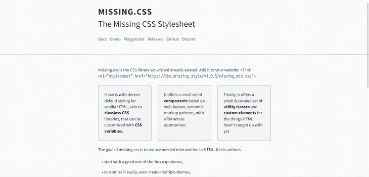
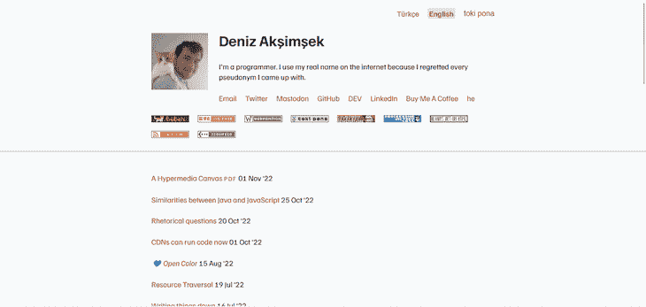
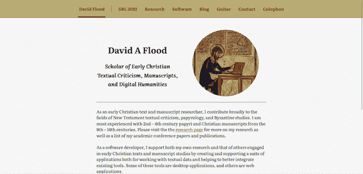
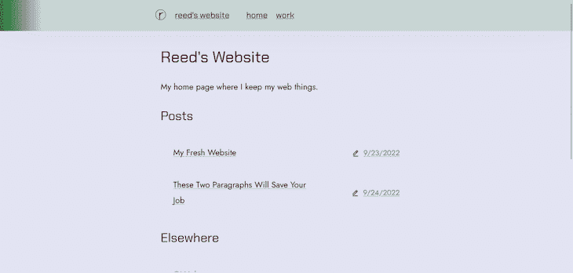
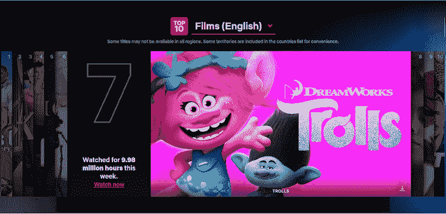
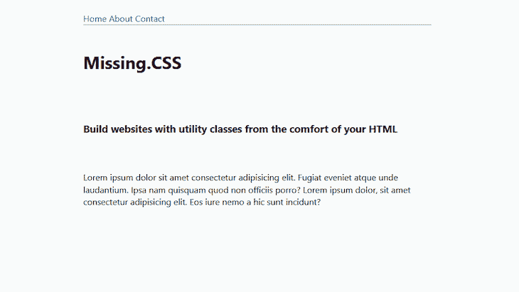
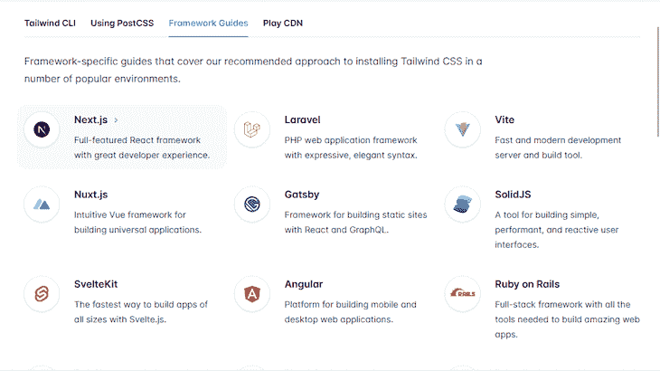

# missing.css 与 Tailwind CSS 相比如何

> 原文：<https://blog.logrocket.com/how-missing-css-compares-tailwind-css/>

CSS 库减少了开发人员编写网站代码的时间。在谷歌上快速搜索最好的或者最受欢迎的 CSS 库，会在顶部找到通常的嫌疑人——T2 引导和顺风 CSS 。

然而，这些列表中缺少的一个库是 [missing.css](https://missing.style/) (一语双关)。在本文中，我们将研究 missing.css 与 Tailwind CSS 的比较，并探索两个库的示例。

*向前跳转:*

## 缺什么. css？

Missing.css 是一个新的几乎没有类的 css 库，由 Deniz akimsek 创建，它提供了一个小的、精选的实用程序类和自定义元素集:



根据其网站，missing.css 的目标是减少 HTML 中需要的干预。这意味着用户可以在[工具类](https://blog.logrocket.com/css-utility-classes-library-extendable-styles/)的帮助下，只用普通的 HTML 创建 web 组件。

有了实用工具类，你将花费更少的时间来建立网站。纯 HTML 意味着没有 CSS 或 JavaScript。一个实用程序类可以替换多行代码。

### missing.css vs. Tailwind CSS 的第一印象

上面的截图显示了 [missing.css 网站](https://missing.style/)的 UI 非常简洁。有几个用 missing.css 搭建的网站，在首页找到的，看起来都差不多。在其主页上，missing.css 声称“Bootstrap 没有合适的氛围。”对 Bootstrap 的一个批评是，用它建立的网站过于相似，很容易被发现。css 借用了 Bootstrap 的一些灵感:




如你所见，这四个网站的布局是一样的。所有内容都在页面中间，两边有很多空白:





虽然这些网站在大多数情况下都有很好的响应能力，但是超过某一点后，导航条就会变得没有响应。作为对比，我们也来看看 Tailwind CSS。Tailwind 没有像 Bootstrap 这样的预定义组件。这意味着您可以构建更多的定制元素。你可以在顺风网的[展示区](https://tailwindcss.com/showcase)找到一些例子。以下是其中的一些截图:


用 Tailwind CSS 构建的站点比用 missing.css 构建的站点有更多的元素，它们有更多的图像、动画、视频背景和滑块；你说吧。然而，好的用户界面并不总是等于好的 UX。重要的是要记住，我们根据[视觉线索](https://blog.logrocket.com/ux-design/guide-visual-hierarchy/)做出很多决定。尽管如此，Tailwind CSS 看起来仍然提供了比 missing 更多的东西。CSS:




尽管 missing.css 为自己辩护说，它“只适合小项目和个人网站”，而且“顺风太多了”这由你决定。

## 如何使用 missing.css

在使用 missing.css 之前，您需要将其链接到您的项目。在此之后，您可以按照自己喜欢的方式构建页面。您可以使用下面的命令将样式表链接到您的 HTML:

```
<link rel="stylesheet" href="https://the.missing.style/v1.0.6/missing.min.css">

```

因为 missing.css 几乎是无类的，使用[右语义](https://blog.logrocket.com/uncommon-html-tags-improve-web-semantics/)会给你的页面一些默认样式。如果您想要更多的自定义组件，您可以添加一些实用程序类。你可以在[文档](https://missing.style/docs/)部分找到这些类以及更多关于如何使用它们的信息。

### 建立网页

首先，在`<body>`中创建一个`<main>` HTML 元素来保存网页上的所有其他元素。这将使您的网页采用 missing.css 的一般主题，内容在中间，空白在两边。接下来，让我们创建一个导航栏。继续复制下面的代码:

```
<main>
    <header>
      <nav>
        <a href="#">Home</a>
        <a href="#">About</a>
        <a href="#">Contact</a>
      </nav>
    </header>
</main>

```

然后，添加一些标题和一个段落:

```
<div>
  <div>
    <div>
      <h1>Missing.CSS</h1>
      <br />
      <h3>
        Build websites with utility classes from the comfort of your HTML
      </h3>
      <br />
       <p>
         Lorem ipsum dolor sit amet consectetur adipisicing elit. Fugiat
        eveniet atque unde laudantium. Ipsa nam quisquam quod non officiis
        porro? Lorem ipsum dolor, sit amet consectetur adipisicing elit. Eo
        iure nemo a hic sunt incidunt?
      </p>
    </div>
  </div>
</div>

```

这是该标记的外观:



此时，您可以添加类来修改默认样式。例如，您可以将`navbar`类添加到`<header>`元素来改变它的外观。您还可以改变文本的大小和 div 的外观。

下面是一个用 missing.css 构建的简单网页的演示:

参见 [CodePen](https://codepen.io) 上 Oscar-Jite([@ Oscar-Jite](https://codepen.io/oscar-jite))
的 Pen [Missing.css demo](https://codepen.io/oscar-jite/pen/NWBpJVa) 。

您可以在 missing.css 官方文档中了解更多关于创建其他元素的信息，如`forms`、`sidebar`、`titlebar`等。此外，您可以使用 [CSS flexbox](https://blog.logrocket.com/css-flexbox-vs-css-grid/) 和 [CSS grid](https://blog.logrocket.com/css-grid-guide/) 布局来修改页面布局。文档中解释了构建这些组件所需的一切。Missing.css 说您可以使用[变量](https://missing.style/docs/variables/)用您的自定义样式覆盖它的默认样式，但是它没有显示您如何做到这一点。

这就是使用 missing.css 的全部内容。可能由于用户数量较少，没有大量的可用信息。总的来说，它使用起来很简单，没有陡峭的学习曲线，功能性强，没有任何刺激和刺激。如果想练习使用 missing.css，可以用它的游乐场[这里](https://missing.style/playground/)。

## 使用顺风 CSS

Tailwind CSS 是一个底层的、实用优先的框架，允许您在 HTML 标记中构建 web 组件。这是一个非常受欢迎的 CSS 库，截至 2020 年有[1000 万次安装](https://adamwathan.me/tailwindcss-from-side-project-byproduct-to-multi-mullion-dollar-business/)。公平地说，很多开发人员都熟悉 Tailwind。在我们继续之前，这里有一个与上面类似标记的演示:

请看 [CodePen](https://codepen.io) 上 Oscar-Jite([@ Oscar-Jite](https://codepen.io/oscar-jite))
的 Pen [Tailwind demo](https://codepen.io/oscar-jite/pen/YzjZMEN) 。

你可以用四种方式安装 Tailwind CSS ，但是最简单快捷的是使用 Tailwind CLI 工具。你需要在你的电脑上安装 [Node.js](https://blog.logrocket.com/tag/node/) 才能运行。然后，通过在 HTML 标记中添加实用程序来构建页面。这是一个相当简单的过程。每个实用程序类都有一个相应的 CSS 属性或属性集。您挑选并使用与您正在创建的组件相关的组件。

如果您有特定的样式偏好，您也可以轻松地添加自定义 CSS 属性。就像 missing.css 一样，不必离开 HTML 标记。您可以快速构建响应性布局，并且不必处理未使用或不必要的类。这将有助于保持您的文件大小较小，并帮助您的网页加载速度更快。

Tailwind CSS 可以与所有流行的框架集成，它提供了具体的指南来帮助您完成安装:



## Missing.css vs. Tailwind CSS:判决

Missing.css 承诺了一些事情，比如创建具有自定义属性的独特网站。但这并不是什么新鲜事，因为顺风也能做到这一点。如果您正在构建一个具有复杂布局和许多组件的大型项目，您将使用更多的实用程序类。另一方面，如果是一个较小的项目，这似乎是 missing.css 的卖点，Tailwind 也可以完成这项工作。

虽然它们都使用实用程序类，但 Tailwind 有更广泛的集合，涵盖了你能想到的每一个 web 组件。没有明显的理由说明为什么应该在 Tailwind 上使用 missing.css。Missing.css 说，“顺风太多了”，但我觉得最终还是取决于开发者或用户更喜欢什么。missing.css 中流行的极简主义可能对某些人更有吸引力。在使用、功能和性能方面，missing.css 与 Tailwind CSS 相比并没有真正的优势。

## 结论

编写普通的 CSS 会很累很耗时。幸运的是， [CSS 框架](https://blog.logrocket.com/top-utility-first-css-frameworks/)让建立网站变得更加容易和快捷。有如此多的框架可供选择，每一个都有不同的方法。如果想要现成的组件，可以使用 Bootstrap 这样的框架。然而，如果你想有更多的定制空间，你可以使用 Tailwind CSS…或者一个鲜为人知的框架 missing.css。

## 你的前端是否占用了用户的 CPU？

随着 web 前端变得越来越复杂，资源贪婪的特性对浏览器的要求越来越高。如果您对监控和跟踪生产环境中所有用户的客户端 CPU 使用情况、内存使用情况等感兴趣，

[try LogRocket](https://lp.logrocket.com/blg/css-signup)

.

[](https://lp.logrocket.com/blg/css-signup)[https://logrocket.com/signup/](https://lp.logrocket.com/blg/css-signup)

LogRocket 就像是网络和移动应用的 DVR，记录你的网络应用或网站上发生的一切。您可以汇总和报告关键的前端性能指标，重放用户会话和应用程序状态，记录网络请求，并自动显示所有错误，而不是猜测问题发生的原因。

现代化您调试 web 和移动应用的方式— [开始免费监控](https://lp.logrocket.com/blg/css-signup)。