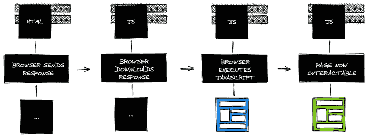

# js 如何帮助改进 SEO - LogRocket 博客

> 原文：<https://blog.logrocket.com/how-next-js-can-help-improve-seo/>

有几种方法可以构建现代应用程序，两种最常见的应用程序包括[单页应用程序](https://en.wikipedia.org/wiki/Single-page_application)和[服务器渲染应用程序](https://en.wikipedia.org/wiki/Server-side_scripting)。

对于需要更好性能的应用程序来说，单页应用程序非常有用。尽管谷歌已经对他们的爬虫如何处理单页应用程序做了一些更新，但我们仍然缺乏搜索引擎优化的结果。服务器端呈现的应用程序可以在搜索引擎中获得更好的 SEO 结果，并且仍然有相当不错的性能。

一些令人敬畏的 JavaScript 框架的发布，如 Next 和 Gatsby，导致了更多服务器端应用程序的产生。让我们来看看为什么单页应用程序在某些情况下不是最佳选择的几个原因，特别是对于那些将严重依赖 SEO 的应用程序。

## 单页应用程序的问题(SPA)

在选择构建单页应用程序或服务器端呈现的应用程序之前，您应该考虑的是您想要显示的内容。



单页应用程序(SPA)是一种应用程序，它不是每次呈现新内容时都从新的 HTML 页面提供服务，而是由 JavaScript 操纵 DOM 动态生成的。既然不需要每次有什么需要改变的时候都加载新的 HTML 页面，那么 SPA 中的 SEO 有什么问题呢？

SPA 中 SEO 的问题是应用[无法被搜索引擎](https://www.magnolia-cms.com/blog/spa-seo-mission-impossible.html)正确索引，这与服务器端渲染应用不同。SPA 只提供初始的 HTML 文件，所以搜索引擎不能索引内容，因为在单页应用程序中，每次有变化时，JavaScript 都会生成新的 HTML。虽然 SPAs 有许多其他优势，如性能、节省时间和带宽、移动设备更好的响应能力、在较慢的互联网连接中提高性能等。

使用服务器端呈现的应用程序，尤其是使用 Next.js，您可以创建一个高性能的应用程序，同时拥有良好的 SEO。

## 搜索引擎优化

SEO 代表搜索引擎优化，是优化你的网站以从搜索引擎获得更多有机流量的活动。SEO 涉及许多不同的技术和方面，我们应该注意使我们的网站更有吸引力，更容易被搜索引擎访问。

## Next.js

[Next.js](https://nextjs.org/) 是一个 React 框架，用于构建静态生成和服务器渲染的 React 应用。它带来了很多好处，可以帮助我们创建和扩展应用程序，比如零配置、自动代码分割、生产就绪、静态导出等。

有了 [Next.js](https://nextjs.org/) 你可以通过简单的步骤，只需创建一个新的应用程序，就可以获得一个不错的 SEO 结果。这并不是来自 [Next.js](https://nextjs.org/) 的特定特性，而是来自服务器端渲染应用。

让我们用 [Next.js](https://nextjs.org/) 看一个例子，看看它是如何工作的。

您可以使用设置“[创建下一个应用程序](https://nextjs.org/blog/create-next-app)”在一个命令中创建新的 [Next.js](https://nextjs.org/) 应用程序:

```
npx create-next-app
```

在创建你的项目之后，你可能会注意到它与其他著名的样板文件有一些不同，比如 [Create React App](https://github.com/facebook/create-react-app) 。应用程序的每个页面都将被托管在`pages`文件夹中，并且每个页面都被定义为一个 React 组件。

要在您的应用程序中创建一个新的路由，您所要做的就是在`pages`文件夹中创建一个新文件，并为它创建一个新的 React 组件:

```
// pages/about.js
const About = () => (
  <div>
    <h1>About page</h1>
  </div>
);
export default About;
```

> 注意:当你开始构建你的应用程序时，你可以做一些 SEO 报告， [Lighthouse](https://developers.google.com/web/tools/lighthouse) 对此很有帮助。

使用 Next.js 创建一个新的应用程序非常容易。让我们来看看用 Next.js 改进 SEO 和提高我们在搜索中的有机结果的一些方法。

## 用 Next.js 改进 SEO

使用 Next.js 会让你的 SEO 结果提升很多，但是你还是需要注意你 app 的其他方面。为了获得好的搜索引擎优化结果，你应该注意以下几点:

### Meta tags

Meta 标签向搜索引擎和网站访问者提供关于您的页面的数据，它们可以影响用户在搜索结果中查看您的网站的方式，并且可以决定他们是否会访问您的网站。它们只在代码中可见，但它们是希望对 SEO 结果进行优先排序的应用程序中非常重要的一部分。

meta 标签基本上告诉搜索引擎特定页面的内容是什么，该页面到底是关于什么的，以及搜索引擎应该如何显示它。

Next.js 有一个内置组件，用于将 meta 标签附加到页面的头部:

```
import Head from 'next/head'
```

要在特定页面上插入 meta 标签，使用`Head`内置组件并添加特定的 meta 标签:

```
import Head from 'next/head'

const Example = () => {
  return (
    <div>
      <Head>
        <title>Example</title>
        <meta name="viewport" content="initial-scale=1.0, width=device-width" />
      </Head>
      <p>Hi Next.js!</p>
    </div>
  )
}

export default Example
```

关于`Head`内置组件的一个好处是，当你添加一个新的 meta 标签时，你想确保这个 meta 标签不会重复，你可以使用 key 属性，它将只被渲染一次:

```
<meta name="viewport" content="initial-scale=1.0, width=device-width" key="viewport" />
```

一个好的 SEO 结果可以通过简单地开始在你的应用程序中使用一些 meta 标签来实现。这里是一些重要的元标签的列表，你应该使用它们来改善你的搜索引擎优化结果。

现在对你的应用程序做一个回顾，检查你是否使用了元标签(和正确的标签)。它完全可以使你的搜索引擎优化结果产生巨大的差异，并提高你的有机交通。

### 表演

访问者不想永远等待你的页面加载。构建应用程序时，性能应该是主要考虑的因素。性能实际上是 SEO 的一个至关重要的因素。

搜索引擎，尤其是谷歌，将你页面的第一张内容丰富的图片(FCP)作为一个重要的性能指标。FCP 度量测量从页面开始加载到页面内容的任何部分呈现在屏幕上的时间。一个第一次内容绘制性能差的页面会导致不好的 SEO 结果。

您可以使用 [Next.js](https://nextjs.org/) 来测量一些指标，如 FCP 或 LCP(最大内容油漆)。您所要做的就是创建一个定制的应用程序组件，并定义一个名为`reportWebVitals`的函数:

```
// pages/_app.js
export function reportWebVitals(metric) {
  console.log(metric)
}
```

当页面上的任何指标的最终值完成时，将触发`reportWebVitals`功能。

你可以在 [Next.js](https://nextjs.org/) applications [这里](https://nextjs.org/docs/advanced-features/measuring-performance)找到更多关于衡量绩效的信息。[在这里](https://web.dev/fcp/#how-to-improve-fcp)你可以找到一个列表，上面列出了为了获得一个好的 FCP 成绩你应该改进的地方。

### SSL 证书

2014 年 8 月，谷歌宣布 HTTPS 为排名信号。安全超文本传输协议(HTTPS)在用户与您共享信息时为他们提供了额外的保护。

为了使用 HTTPS，您应该有一个 SSL(安全套接字层)证书。一个非常好的 SSL 证书有时会很贵。你的 [Next.js](https://nextjs.org/) 应用里怎么可以免费有 SSL 证书？

可以使用类似 [Vercel](https://vercel.com/) 这样的云平台进行部署。 [Vercel](https://vercel.com/) 也是创造 [Next.js](https://nextjs.org/) 的公司，所以整合相当顺利。要使用 Vercel 部署 [Next.js](https://nextjs.org/) 应用程序，只需安装 Vercel CLI:

```
yarn global add vercel
```

在您的项目中，给它一个命令:

```
vercel
```

默认情况下，您的项目将使用 SSL 证书部署到 Vercel。

## 内容很重要

以正确的方式向客户展示您的内容非常重要。给你的客户一个精致的体验是每个开发者主要关心和优先考虑的。

决定使用单页应用程序而不是服务器端呈现的整个要点，或者相反，应该是关于您想要显示的内容和您想要与您的客户端实现的主要目标。

Next.js 的目标是提供一个 React 服务器端渲染的应用程序，通过它，我们实现了很好的 SEO、UX、性能等水平。它可以帮助公司和开发者改进他们的网站和项目，并从搜索引擎获得更多的有机流量。

现在是开始使用 Next.js 并释放服务器端渲染应用程序的力量的好时机，它们真的很神奇，可以给你和你的公司很多帮助。我保证你会大吃一惊。

## 结论

在本文中，我们了解了更多关于 [Next.js](https://nextjs.org/) 的内容，以及它如何在现代应用程序中帮助实现良好的 SEO 结果。我们还学习了 SEO 的一般知识，以及我们应该注意的要点，如元标签、性能、SSL 证书等。

## [LogRocket](https://lp.logrocket.com/blg/nextjs-signup) :全面了解生产 Next.js 应用

调试下一个应用程序可能会很困难，尤其是当用户遇到难以重现的问题时。如果您对监视和跟踪状态、自动显示 JavaScript 错误、跟踪缓慢的网络请求和组件加载时间感兴趣，

[try LogRocket](https://lp.logrocket.com/blg/nextjs-signup)

.

[](https://lp.logrocket.com/blg/nextjs-signup)[](https://lp.logrocket.com/blg/nextjs-signup)

LogRocket 就像是网络和移动应用的 DVR，记录下你的 Next.js 应用上发生的一切。您可以汇总并报告问题发生时应用程序的状态，而不是猜测问题发生的原因。LogRocket 还可以监控应用程序的性能，报告客户端 CPU 负载、客户端内存使用等指标。

LogRocket Redux 中间件包为您的用户会话增加了一层额外的可见性。LogRocket 记录 Redux 存储中的所有操作和状态。

让您调试 Next.js 应用的方式现代化— [开始免费监控](https://lp.logrocket.com/blg/nextjs-signup)。