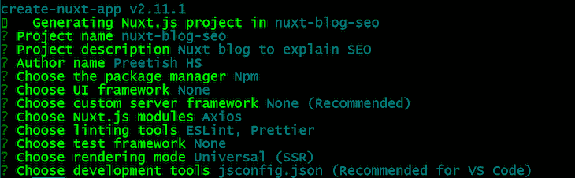
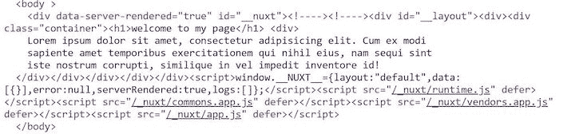
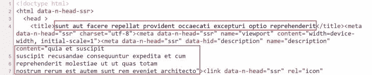

# Nuxt.js 如何解决 Vue.js 中的 SEO 问题

> 原文：<https://blog.logrocket.com/how-nuxt-js-solves-the-seo-problems-in-vue-js/>

## 香草 Vue.js 和 SEO 到底出了什么问题？

Vue.js 和 React、Angular 等很多其他框架一样。，是一个客户端框架，意味着网页是通过在客户端运行 JavaScript 来渲染的。这些应用程序通常被称为单页应用程序，或 spa。

当在浏览器上加载 SPA 时，服务器只发送基本的 HTML，而不发送任何呈现的内容。它再次请求获取 JavaScript 包。JavaScript 然后在浏览器中运行以呈现内容。当我们查看页面源代码时，我们会看到如下内容:

```
<!DOCTYPE html>
<html>
  <head>
    <meta charset="utf-8">
    <title>My Blog</title>
  </head>
  <body>
    <div id="app"></div>
    <script src="/js/app.js"></script>
  </body>
</html>
```

看到问题了吗？当搜索引擎机器人抓取你的页面时，他们只得到这个没有任何内容的 HTML。没有数据可供机器人用来索引你的页面。

嗯，温泉已经存在很长时间了，谷歌说他们的爬虫现在可以索引温泉了。那里有很多不确定性。爬虫在你的页面上等待多长时间？如果你的包裹太大怎么办？如果由于某种错误，页面无法正确呈现，该怎么办？它会重试吗？

让我们假设它能够成功地呈现客户端代码并正确地索引它。这是否意味着你的页面现在已经为搜索优化了？贡献页面排名的标准有很多，页面下载速度是其中最重要的。与老式的静态 HTML/CSS 页面相比，SPA 在第一次内容绘制时通常要慢一些，因为有 Ajax 调用来获取包并呈现它的开销。

我们已经从那些静态的 HTML/CSS 页面走了很长的路，所以很明显，我们不能再回到那里了。这些方法有它们自己的问题——每个请求都必须到服务器获取特定和公共的数据，每次用户导航时为不同的页面下载新的样式表，等等。

有没有一个解决方案，利用这两种方法的最佳功能，既有很好的 SEO，又像 SPA 一样超级快？嗯，你好 SSR！

服务器端脚本是一种在 [web 开发](https://en.wikipedia.org/wiki/Web_development)中使用的技术，包括在 web 服务器上使用[脚本](https://en.wikipedia.org/wiki/Scripting_language)来生成完全呈现的页面。然后，该页面返回到客户端应用程序。SSR 产生更快的页面加载，因为所有的内容都已经呈现在服务器上。让我们用 Nuxt.js 构建一个这样的应用程序

## 用 Nuxt.js 构建简单的 web 应用程序

运行以下命令创建一个 Nuxt 应用程序:

```
npx create-nuxt-app nuxt-blog-seo
```

您有以下选择。我的设置如下图所示:



如果你是 Nuxt 框架的新手，那么与 Vue 相比，Nuxt 有一些不同之处:

1.  **文件夹结构:** Nuxt 遵循严格的文件夹结构，不得修改
2.  **路由:** Nuxt 使用`pages`目录来获取路由结构(它进行自动代码分割🙌).您可以添加外部路由文件，但这不是必需的。
3.  **路由器链接:**而不是`<router-link>`，Nuxt 使用了一个特殊的标签`<nuxt-link>`。

现在转到`pages`文件夹，用下面的代码修改`index.vue`文件:

```
<template>
  <div class="container">
    <h1>welcome to my page</h1>
    <div>
      Lorem ipsum dolor sit amet, consectetur adipisicing elit. Cum ex modi
      sapiente amet temporibus exercitationem qui nihil eius, nam sequi sint
      iste nostrum corrupti, similique in vel impedit inventore id!
    </div>
  </div>
</template>

<script>
export default {}
</script>
```

使用`npm run dev`命令运行应用程序。打开网页，进入查看页面源代码，瞧！我们在页面源代码中看到我们的内容。



让我们再添加一个页面和一个到`index.vue`文件的链接:

```
<!-- Article.vue -->
<template>
 <div class="container">
  <h1>A dummy article</h1>
  <div>
   Lorem ipsum dolor sit amet, consectetur adipisicing elit. Cum ex modi
   sapiente amet temporibus exercitationem qui nihil eius, nam sequi sint
   iste nostrum corrupti, similique in vel impedit inventore id!
  </div>
 </div>
</template>
```

现在，让我们在主页中添加一个指向此页面的链接:

```
<nuxt-link to=”/Article”> My Article </nuxt-link>
```

保存它并再次运行应用程序，您将能够导航到此页面。你有没有注意到这个页面会立即打开，就像一个水疗中心是如何工作的一样？在第一次页面加载之后，Nuxt 的行为就像一个 SPA。再次查看源代码，我们也可以看到`Article.vue`页面的完整源代码！这是因为 Nuxt 创建了静态版本的网站(用于静态资产)。

在您的`Article.vue`文件中，这次让我们从网上获取数据，而不是使用虚拟的硬编码数据。为此，我将使用`json placeholder api`和`axios`。我们在创建应用程序时添加了 Axios 模块；它可以像插件一样在我们的 Vue 组件中访问:

```
 this.$axios
   .get('http://jsonplaceholder.typicode.com/posts/1')
      .then((res) => {
        return { fetchedData: res.data }
    })
```

我们在哪里添加这些代码？我们可以将它添加到`created()`钩子中，但是`created()`只在客户端运行，这不是我们想要的。

## Nuxt `asyncData`

告诉 Nuxt 在服务器上呈现代码的特定部分。当它在服务器上运行时，我们的 Vue 组件还没有初始化；因此，我们不能在这里使用`this`或任何方法。然而，我们接收 Nuxt 的`context`对象，其中包含所有的数据。

```
<template>
  <div class="container">
    <h1>{{ fetchedData.title }} test</h1>
    <div>
      {{ fetchedData.body }}
    </div>
  </div>
</template>
<script>
export default {
  asyncData(context) {
    return context.$axios
      .get('http://jsonplaceholder.typicode.com/posts/1')
      .then((res) => {
        return { fetchedData: res.data }
      })
  }
}
</script>
```

再次打开页面并检查页面源代码。我们看到服务器已经呈现了数据。太好了！🎉

### Nuxt 是如何做到这一点的？

Nuxt 内部运行一个实时节点服务器。因此，它能够在页面被发送到客户端之前预先呈现页面。为了托管这个应用程序，我们需要一个能够运行 Node.js 的服务器。

这是否意味着我们不能再在像 Netlify 这样的静态主机提供商上托管它？是的，这是我们需要做出的牺牲。但是我们稍后将回到这个问题。

## 让我们在我们的小项目中添加一个 Vuex 商店

没有必要安装 Vuex，因为 Nuxt 在看到`store`文件夹中的内容时会自动安装。

我想在主页和文章页面都显示用户名。我们需要从服务器上获取这个。与其两个地方都取，不如取一次，存到 Vuex。

通过在`store`文件夹中创建一个新文件`user.js`，在 Vuex 中创建一个用户模块:

```
export const state = () => ({
  userName: 'default'
})
export const mutations = {
  updateUserName(state, value) {
    state.userName = value
  }
}
export const actions = {
  getUserName(context) {
    return this.$axios
      .get('https://jsonplaceholder.typicode.com/users/1')
      .then((res) => {
        context.commit('updateUserName', res.data.name)
      })
  }
}
```

在这里，我从服务器获取`userName`。让我们在两个页面上都显示它:

```
<div>Name: {{ $store.state.user.userName }}</div>
```

我们可以调用运行在服务器上的`asyncData`方法中的动作`getUserName`，但是 Nuxt 提供了一个特殊的动作方法，叫做`nuxtServerInit`。

### `nuxtServerInit`方法

这个方法由服务器上的 Nuxt 自动调用。我们可以用它来填充服务器端的存储。这个方法只能在主模块中使用，所以让我们在`store`文件夹中创建一个`index.js`文件:

```
export const actions = {
  async nuxtServerInit(vuexContext) {
    await vuexContext.dispatch('user/getUserName', { root: true })
  }
}
```

现在动作`getUserName`将被自动调用，并且`userName`将在服务器端被填充。类似地，我们可以从`nuxtServerInit`中的不同模块调用任意数量的动作。

* * *

### 更多来自 LogRocket 的精彩文章:

* * *

## 元标签怎么样？

元标签是影响 SEO 的最重要的因素之一。Nuxt 在内部使用`vue-meta`来生成`<head>`标签的内容，比如页面标题、meta 标签等。

那么这里有什么特别的呢？我们也可以在 vanilla Vue.js 中使用`vue-meta`。在 Vue.js 的例子中，meta 标签是在 JavaScript 渲染页面的同时填充的，所以机器人可能会也可能不会选择 meta 标签。

在基于后续 Ajax 调用填充 meta 标记的情况下，我们还可以看到页面标题在收到响应后动态变化。页面源没有 meta 标签。这对 SEO 来说是相当糟糕的。

另一方面，Nuxt 也预先呈现了 meta 标签！即使有后续的 Ajax 调用，我们也可以在服务器中执行的`asyncData`或`nuxtServerInit`中调用。因此，在所有情况下，机器人获得更新的元标签时，他们爬我们的网页！让我们来看看实际情况。

让我们为文章页面添加页面标题和元标签:

```
export default {
  asyncData(context) {
    return context.$axios
      .get('http://jsonplaceholder.typicode.com/posts/1')
      .then((res) => {
        return { fetchedData: res.data }
      })
  },
  head() {
    return {
      title: this.fetchedData.title,
      meta: [
        {
          hid: 'description',
          name: 'description',
          content: this.fetchedData.body
        }
      ]
    }
  }
}
```

重新加载页面后，查看页面源代码，我们可以看到它们都反映在那里。



## 静态模式

Nuxt 可以生成一个静态版本的网站，这是搜索引擎优化友好的，不需要我们运行实时节点服务器后端获得所有的好处。我们可以像任何其他 Vue 应用程序一样将它托管在静态服务器上，并且仍然拥有 SEO 的所有好处。

要在静态模式下构建，请使用以下命令——它在`dist`目录中为所有可能的路径生成代码:

```
npm run generate
```

## 我们做到了！😃

Nuxt 的设计考虑到了 SEO。有了 Nuxt，我们可以控制许多影响 SEO 和页面排名的因素。Nuxt 填补了 SPAs 的空白和缺点，使创建一个 SEO 友好的应用程序的过程变得简单而愉快。

## 像用户一样体验您的 Vue 应用

调试 Vue.js 应用程序可能会很困难，尤其是当用户会话期间有几十个(如果不是几百个)突变时。如果您对监视和跟踪生产中所有用户的 Vue 突变感兴趣，

[try LogRocket](https://lp.logrocket.com/blg/vue-signup)

.

[](https://lp.logrocket.com/blg/vue-signup)[https://logrocket.com/signup/](https://lp.logrocket.com/blg/vue-signup)

LogRocket 就像是网络和移动应用程序的 DVR，记录你的 Vue 应用程序中发生的一切，包括网络请求、JavaScript 错误、性能问题等等。您可以汇总并报告问题发生时应用程序的状态，而不是猜测问题发生的原因。

LogRocket Vuex 插件将 Vuex 突变记录到 LogRocket 控制台，为您提供导致错误的环境，以及出现问题时应用程序的状态。

现代化您调试 Vue 应用的方式- [开始免费监控](https://lp.logrocket.com/blg/vue-signup)。