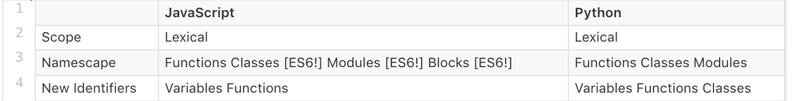

# Python 如何帮助你学习 ES6 

> 原文：<https://blog.logrocket.com/how-python-can-help-you-learn-es6/>

```
def fish_and_chips(): ingredients = ['fish', 'potatoes', 'batter']
  print 'cooking %s together' % (', '.join(ingredients))

 class Baking(object):
  def __init__(self, supplies):
    self.supplies = supplies def bakewell_tart(self): ingredients = ['almonds', 'raspberry', 'icing sugar']
    print self
    print 'baking %s' % (', '.join(ingredients)) 
```

A function versus a method in Python

好了，Python 推动我学习更多关于 ES6 的一些方法！

## **封锁范围**

当我第一次开始学习 JavaScript 时(回到“古代”的 ES5 时代)，我认为语言中的许多结构创建了作用域。我认为条件语句中的块创建了作用域。我发现在 JavaScript 中只有函数创建作用域。

加上 ES6 的`const`和`let`，我们得到了块范围！

```
function simpleExample(value) {
  if (value) {
    var varValue = value;
    let letValue = value; console.log(varValue, letValue); }

  console.log(varValue); console.log(letValue); 
```

JavaScript、ES6 和 Python 中还有什么创建作用域？他们用什么样的瞄准镜？请查看下表:



## **模板文字**

我经常认为模板文字是疯狂的库。如果你不是在疯狂文库中长大的，它们是你可以用自己的内容填充的短篇故事。句子缺少单词，你可以在这些空格里写任何你想写的东西。你只需要符合指定的单词类型:名词、代词、动词、形容词、感叹词。

疯狂的 Libs 读着这样的东西:

> 母亲们坐在一起打嗝。去年夏天，我的小弟弟掉进了一个发式里，屁股上全是毒棕榈树。我的家人要去威斯康辛，我也会去..

与 Mad Libs 类似，模板文字是允许嵌入表达式的字符串文字。在 ES2015 规范的早期版本中，它们最初被称为“模板字符串”。

是的，这些在 ES6 发布之前就已经存在于 Python 中了。我实际上已经学习了 Python 中的[文字字符串插值，这让我理解 ES6 中的模板文字更加容易。它们很棒，因为您不再需要旧版本 JavaScript 中的连接，这可能有点荒谬，并会将其他类型强制转换为字符串。](https://pyformat.info/)

```
let exclamation = 'Whoa!';
let sentence = `They are really similar to Python.`; console.log(`Template Literals: ${exclamation} ${sentence}`);

```

```
print '.format(): {} {}'.format('Yup.', 'Quite!')

```

## **默认参数**

是的，Python 也一直拥有这些。默认参数设置函数参数的默认值。这对于避免参数丢失时出现的错误是最有效的。随着 ES6 的出现，JavaScript 也获得了默认参数。

```
function nom(food="ice cream") { console.log(`Time to eat ${food}`);
} nom(); 
```

```
def nom(food="ice cream"):
  print 'Time to eat {}'.format(food) nom() 
```

## **其余参数& *args**

Rest 参数语法允许我们将不定数量的参数表示为一个数组。在 Python 中，它们被称为*args，我在 ES6 之前已经学过了！你感觉到这里有一种模式吗？

看看每种语言是如何将参数打包成简洁的小软件包的:

```
function joke(question, ...phrases) { console.log(question);
  for (let i = 0; i > phrases.length; i++) { console.log(phrases[i]);
  }
}

let es6Joke = "Why does JS single out one parameter?" joke(es6Joke, "Because it doesn't", 'really like', 'all the REST of them!');

```

```
def pirate_joke(question, *args):
  print question for arg in args:
    print arg

python_joke = "What's a Pyrate's favorite parameter?" pirate_joke(python_joke, "*args!", "*arrgs!", "*arrrgs!")

```

## **类**

现在，让我们看看原型继承！ES6 类实际上是语法糖，基于 ES5 和以前 JavaScript 版本中的原型链。所以，我们用 ES6 类所能做的和我们用 ES5 原型所能做的并没有太大的不同。

Python 有内置的类，允许快速简单的面向对象编程。我总是发现 JavaScript 中的原型链非常混乱，但是将 Python 和 ES6 类放在一起看对我来说很有意义。

为了解释 JavaScript 原型是什么，这里引用 MDN 的一段话:

> 谈到继承，JavaScript 只有一个构造:对象。每个对象都有一个到另一个对象的内部链接，称为其原型。该原型对象有自己的原型，依此类推，直到到达一个以 null 作为其原型的对象。根据定义，null 没有原型，并且充当这个原型链中的最后一环。

让我们来看看这些基于原型链的 ES6“类”:

```
class Mammal {
  constructor() {
    this.neocortex = true;
  }
}

class Cat extends Mammal {
  constructor(name, years) {
    super();
    this.name = name;
    this.years = years;
  } eat(food) { console.log('nom ' + food);
  }
}

let fryCat = new Cat('Fry', 7); fryCat.eat('steak');
```

```
class Mammal(object): neo_cortex = True

class Cat(Mammal):
  def __init__(self, name, years):
    self.name = name self.years = years def eat(food):
    print 'nom %s' % (food) fry_cat = Cat('Fry', 7) fry_cat.eat('steak')
```

ES6 类和 ES5 原型的一个很大的区别是:使用类比使用原型链更容易继承。这和 Python 的结构很像。整洁！

所以你有它。一堆 Python 如何帮助我了解 ES6 的例子。编程语言通常存在许多差异，但也存在许多相似之处。正是在这些相似之处，我们可以更容易地学习新的语言！

## 使用 [LogRocket](https://lp.logrocket.com/blg/signup) 消除传统错误报告的干扰

[](https://lp.logrocket.com/blg/signup)

[LogRocket](https://lp.logrocket.com/blg/signup) 是一个数字体验分析解决方案，它可以保护您免受数百个假阳性错误警报的影响，只针对几个真正重要的项目。LogRocket 会告诉您应用程序中实际影响用户的最具影响力的 bug 和 UX 问题。

然后，使用具有深层技术遥测的会话重放来确切地查看用户看到了什么以及是什么导致了问题，就像你在他们身后看一样。

LogRocket 自动聚合客户端错误、JS 异常、前端性能指标和用户交互。然后 LogRocket 使用机器学习来告诉你哪些问题正在影响大多数用户，并提供你需要修复它的上下文。

关注重要的 bug—[今天就试试 LogRocket】。](https://lp.logrocket.com/blg/signup-issue-free)