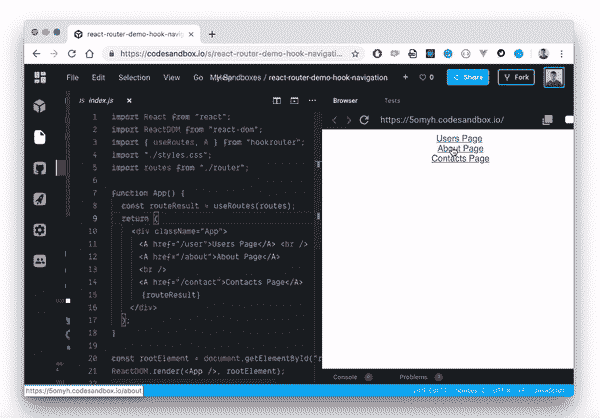
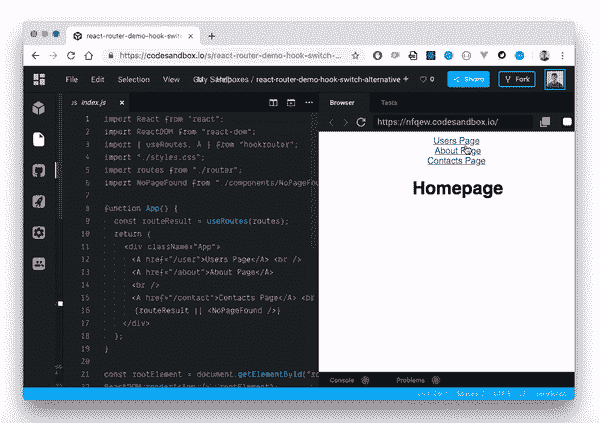
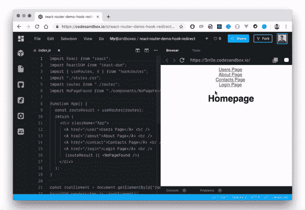
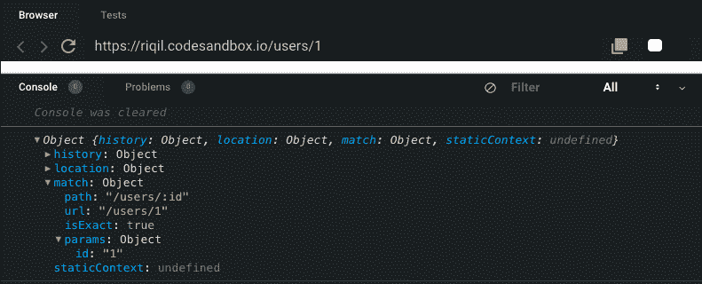

# React 钩子如何取代 React 路由器

> 原文：<https://blog.logrocket.com/how-react-hooks-can-replace-react-router/>

***编者按**:这个 React Hooks 和 React Router 教程最后一次更新是在 2021 年 2 月 10 日，更新了过时的信息，包括了 React Router 的新信息。*

自从 [React Hooks](https://blog.logrocket.com/frustrations-with-react-hooks/) 的出现，很多事情都变了。一些我们以前没有争议的事情已经开始引起关注。钩子带来的特性和可能性重新定义了我们在 React 中处理某些概念的方式，路由恰好是其中之一。

在我们继续之前，我想提一下这篇文章并不是以任何方式攻击 React 路由器或者贬低它的重要性。相反，我们将探索其他可能性，看看我们如何使用钩子来改善 React 应用程序中的路由体验。

为此，出于演示目的，我们将参考 React 路由器和 [hooksrouter](https://github.com/Paratron/hookrouter) 。首先，让我们仔细看看 React 路由器。

 [https://www.youtube.com/embed/RI_SRAztbsg?version=3&rel=1&showsearch=0&showinfo=1&iv_load_policy=1&fs=1&hl=en-US&autohide=2&wmode=transparent](https://www.youtube.com/embed/RI_SRAztbsg?version=3&rel=1&showsearch=0&showinfo=1&iv_load_policy=1&fs=1&hl=en-US&autohide=2&wmode=transparent)

视频

## 什么是 React 路由器？

React Router 是 React 应用程序中一种流行的管理路由的声明方式。它消除了在 React 应用程序中为所有页面和屏幕手动设置路径所带来的压力。React 路由器输出三个主要组件来帮助我们实现路由——路由、链路和浏览器路由器。

## React 路由器有必要吗？

对于某些只需要基本导航和路由功能的项目来说，React router 可能有些大材小用。在这种情况下，React 路由器根本没有必要。也就是说，React Router 具有丰富的导航组件，这些组件以声明方式与您的应用程序组合在一起，这对于 React 应用程序中更大、更复杂的导航需求非常有用。对于 React 本机应用程序来说，它也很棒。

## React 路由器内置 React 吗？

不，React 路由器没有内置 React。它是一个独立的路由库，构建在 React 之上，专门用于在 React 应用程序中提供路由和导航功能。当将 React 路由器添加到 React 应用程序中时，您从它自己的模块中导入它，就像这样:

```
import { Router, Route, Switch } from "react-router";
```

然而，你不应该像那样直接把它安装到你的项目中。如果你正在编写一个将在浏览器中运行的应用程序，你应该安装 R eact 路由器 DOM。

## 我需要 React Router 和 React Router DOM 吗？

**不需要 R eact 路由器 和 React 路由器 DOM 一起。R eact 路由器 DOM 默认情况下让你访问 React 路由器。如果您发现自己两者都在使用，那么可以去掉 React Router，因为您已经将它作为一个依赖项安装在 React Router DOM 中了。但是，请注意，React 路由器 DOM 仅在浏览器上可用，因此您只能将其用于 web 应用程序**

 **## React 路由器中的路由

如果您正在构建一个 React 应用程序，并且有三个页面，下面是您通常如何使用 React 路由器实现路由:

```
import Users from "./components/Users";
import Contact from "./components/Contact";
import About from "./components/About";
function App() {
  return (
    <div>
      <Router>
        <div>
          <Route path="/about" component={About} />
          <Route path="/users" component={Users} />
          <Route path="/contact" component={Contact} />
        </div>
      </Router>
    </div>
  );
}
```

从 React Router 包中导入的`<Route/>`组件接受两个道具，一个是引导用户到指定路径的`path`,另一个是定义该路径内容的`component`。

## 路径选择的钩子

感谢[克里斯·恩格尔](https://www.reddit.com/user/chris_engel/)提供的 [hookrouter](https://www.npmjs.com/package/hookrouter) 工具，我们将重点讲解这个工具，让大家了解这些演示。hookrouter 模块导出一个`useRoutes()`钩子，该钩子评估预定义的 routes 对象并返回结果。在 routes 对象中，您将路由定义为键，它们的值作为函数，当路由匹配时将调用这些函数。这里有一个实际的演示:

```
import React from "react";
import Users from "./components/Users";
import Contact from "./components/Contact";
import About from "./components/About";
const routes = {
  "/": () => <Users />,
  "/about": () => <About />,
  "/contact": () => <Contact />
};
export default routes;
```

我个人喜欢这个方法。为什么？因为我们不用做那么多工作。使用 React Router，我们必须在应用程序中为所有单独的路由呈现`<Route/>`组件。更不用说我们传递给它的所有道具了。回到钩子，我们可以在应用程序中使用这个定义的`Routes`,只需将它传递给`useRoutes()`钩子:

```
import {useRoutes} from 'hookrouter';
import Routes from './router'

function App() {
  const routeResult = useRoutes(Routes)
  return routeResult
}
```

这为我们提供了与 React 路由器路由演示完全相同的结果，但实现更简洁、更轻便。

在 [CodeSandbox](https://codesandbox.io/s/react-router-demo-hook-routing-1j8jc) 上查看这个可编辑的代码示例。

## React 路由器导航

React Router 还让我们可以访问`<Link/>`组件。它帮助我们在 React 应用程序中定制路线导航和管理交互式路线。我们有一个包含三条路线的 react 应用程序，让我们在屏幕上呈现这些路线，并在单击时导航到它们:

```
import { Route, Link, BrowserRouter as Router } from "react-router-dom";
import Users from "./components/Users";
import Contact from "./components/Contact";
import About from "./components/About";

function App() {
  return (
    <div className="App">
      <Router>
        <div>
          <ul>
            <li>
              <Link to="/about">About</Link>
            </li>
            <li>
              <Link to="/users">Users</Link>
            </li>
            <li>
              <Link to="/contact">Contact</Link>
            </li>
          </ul>
          <Route path="/about" component={About} />
          <Route path="/users" component={Users} />
          <Route path="/contact" component={Contact} />
        </div>
      </Router>
    </div>
  );
}
```

这就创建了我们在应用程序中从一个页面到另一个页面所需的导航。这是我们正在做的事情的直观表示。


这里有一个[可编辑代码的例子](https://codesandbox.io/s/react-router-demo-uq9je?from-embed)。

## 反应式导航的替代钩子

hookrouter 模块将 HTML 锚标记`<a/>`包装为`<A/>`。它可以作为一个 React 组件来访问，并且与本机`<a/>`标签完全兼容。唯一的区别是，它将导航推送到历史堆栈，而不是实际加载一个新页面。

```
const routes = {
  "/user": () => <Users />,
  "/about": () => <About />,
  "/contact": () => <Contact />
};

function App() {
  const routeResult = useRoutes(routes);
  return (
    <div className="App">
      <A href="/user">Users Page</A>
      <A href="/about">About Page</A>
      <A href="/contact">Contacts Page</A>
      {routeResult}
    </div>
  );
}
```


这里有一个[互动演示](https://codesandbox.io/s/react-router-demo-hook-navigation-5omyh)。

## 程序导航

hookrouter 模块让我们可以访问一个`navigate()`钩子函数，我们可以将一个 URL 传递给它，它会将用户导航到那个 URL。对`navigate()`函数的每一次调用都是一次前进导航，因此，用户可以点击浏览器的后退按钮返回到上一个 URL。

```
navigate('/user/');
```

这是默认情况下发生的。但是，如果您需要不同的行为，您可以进行替换导航。怎么会？你可能会问，`navigation()`钩子主要接受三个参数— `navigate(url, [replace], [queryParams])`第二个参数用于影响替换行为。它会删除当前的历史记录条目，并用新条目替换它。要达到这种效果，只需将其参数设置为`true`。

```
navigate('/user', true);
```

## 反应路由器交换机

通常，当定义的导航路线不匹配时，React Router 使用`<Switch/>`组件来呈现默认页面。通常，它会呈现一个 404 页面，让用户知道所选的路线没有在应用程序中定义。为此，我们将所有呈现的路线包装在`<Switch/>`组件中，并呈现 404 页面，而不为其定义`path`道具:

```
import { Route, Link, BrowserRouter as Router, Switch } from "react-router-dom";
import Users from "./components/Users";
import Contact from "./components/Contact";
import Home from "./components/About";
import NoPageFound from "./components/NoPageFound.js";

function App() {
  return (
    <div className="App">
      <Router>
        <div>
          <ul>
            <li>
              <Link to="/">Home</Link>
            </li>
            <li>
              <Link to="/users">Users</Link>
            </li>
            <li>
              <Link to="/contact">Contact</Link>
            </li>
          </ul>
          <Switch>
            <Route exact path="/" component={Home} />
            <Route path="/users" component={Users} />
            <Route path="/contact" component={Contact} />
            <Route component={NoPageFound} />
          </Switch>
        </div>
      </Router>
    </div>
  );
}
```

这样，无论何时到达未定义的路径，React Router 都会呈现`NopageFound`组件。这是一种非常敏锐的方式，让用户在浏览 React 站点时随时知道他们在哪里，正在发生什么。

这里有一个[可编辑代码的例子](https://codesandbox.io/s/react-router-demo-switch-nvux9)。

## 替代开关的挂钩

因为我们定义了一个保存所有路线路径的`routes`对象，并简单地将该对象传递给`useRoutes()`钩子，所以有条件地呈现路线变得非常简单。如果我们定义了一个`NoPageFound`文件，在默认情况下，当选择的路线没有定义时，我们只需要传递这个文件和我们的结果函数一起进行渲染，如下所示:

```
import { useRoutes, A } from "hookrouter";
import routes from "./router";
import NoPageFound from "./components/NoPageFound";
function App() {
  const routeResult = useRoutes(routes);
  return (
    <div className="App">
      <A href="/user">Users Page</A> <br />
      <A href="/about">About Page</A>
      <br />
      <A href="/contact">Contacts Page</A> <br />
      {routeResult || <NoPageFound />}
    </div>
  );
}
```



与使用 React Router 中的`<Switch>`组件来呈现默认页面相比，我认为这似乎更干净，可读性更好。

看看这个[例子](https://codesandbox.io/s/react-router-demo-hook-switch-alternative-nfqew)。

## 反应路由器重定向

当我们希望动态地将用户从一个路由引导到另一个路由时，就会发生重定向。例如，在登录期间，当用户成功登录时，我们希望将他们从`('/login')`路由重定向到`('/dashboard')`路由。

有了 React Router，我们可以用几种方式做到这一点——使用历史对象或`<Redirect/>`组件。例如，如果我们有一个登录表单，当用户登录时，我们可以利用浏览器的历史对象将用户推至`'/dashboard'`路线:

```
import React from 'react'
class Login extends React.Component {
  loginUser = () => {
  // if (user is logged in successfully)
    this.props.history.push('/dashboard')
  }
  render() {
    return (
      <form>
        <input type="name" />
        <input type="email" />
        <button onClick={this.loginUser}>Login</button>
      </form>
    )
  }
}
export default Login
```

因此，我们也可以使用 React Router 中可用的`<Redirect/>`组件来动态重定向用户。

## 重定向的替代钩子

hookrouter 模块导出一个`useRedirect()`钩子，它可以将源路由和目标路由作为参数。

```
useRedirect('/user', '/dashboard');
```

每当`'/user'`路径匹配时，这将自动将用户重定向到`'/dashboard'`路径。例如，如果我们不想显示任何用户，而是自动将用户从重定向到他们的`'/dashboard'`，我们可以这样定义我们的应用程序:

```
import {useRoutes, useRedirect} from 'hookrouter';
import dashboard from "./components/Dashboard";
const routes = {
    '/home': () => <Users />,
    '/dashboard': () => <Dashboard />
};
const Users = () => {
    useRedirect('/user', '/dashboard');
    const routeResult = useRoutes(routes);
    return routeResult
}
```

这是这个过程的视觉输出:



值得注意的是,`useRedirect()`钩子触发了替换导航意图。因此，导航历史记录中将只有一个条目。这意味着如果从`'/user'`到`'/dashboard'`发生重定向，就像我们在上一个片段中显示的那样，`'/user'`路由将不会出现在浏览历史中。我们将只有`'/dashboard'`路线。

## 用 React 路由器处理 URL 参数

URL 参数帮助我们根据组件的动态 URL 来呈现组件。它的工作方式与嵌套路由类似，但是在这种情况下，路由并没有完全改变，而是在更新。

例如，如果我们的应用程序中有不同的用户，用他们各自的路线来区分他们是有意义的，比如`'user/user1/'`和`'users/user2/'`等。为此，我们需要使用 URL 参数。在 React Router 中，我们简单地将一个以冒号开头的占位符(如`id`)传递给`<Route/>`组件中的`path`属性:

```
<Route path="users/:id" component={Users} />
```

现在，如果您在浏览器上导航到`'users/1'`，这个特定的用户将出现在您的`Users.js`道具中。



## 处理 URL 参数的钩子替代方法

与 React Router 相比，hookrouter 处理 URL 参数的方式没有太大区别。构造是相同的(例如，您可以使用冒号和参数名将 URL 参数传递给目标路由)。

然而，路由挂钩的工作方式仍然有所不同。它读取所有的 URL 参数，并将它们放入一个对象中。它使用您在 routes 对象中定义的键来实现这一点。然后，所有命名的参数将作为组合对象转发到您的路径结果函数。

```
const routes = {
  '/user/:id': ({id}) => <User userId={id} />
}
```

使用对象析构，我们只需从 props 对象中获取`id`属性，然后将它应用到我们的组件上。这样，我们可以获得与 React 路由器完全相同的结果。

* * *

### 更多来自 LogRocket 的精彩文章:

* * *

## 结论

正如我在本文开头所说，目的是为您提供 React 项目中的另一种路由方式。React 路由器是一个很棒的工具，但是，我认为随着钩子的出现，React 中的很多东西都发生了变化，这也包括路由的工作方式。如果在较小的项目中处理路线，这个基于钩子的模块提供了一个更加灵活和干净的方法。如果你像我一样喜欢尝试新工具，我鼓励你尝试一下。

还有很多其他方面我们还没有在这篇文章中涉及，比如这两个工具如何处理嵌套路由等等。点击了解更多关于 hookrouter 模块[的信息。](https://github.com/Paratron/hookrouter)

## 使用 LogRocket 消除传统反应错误报告的噪音

[LogRocket](https://lp.logrocket.com/blg/react-signup-issue-free)

是一款 React analytics 解决方案，可保护您免受数百个误报错误警报的影响，只针对少数真正重要的项目。LogRocket 告诉您 React 应用程序中实际影响用户的最具影响力的 bug 和 UX 问题。

[ ](https://lp.logrocket.com/blg/react-signup-general) [  ](https://lp.logrocket.com/blg/react-signup-general) [LogRocket](https://lp.logrocket.com/blg/react-signup-issue-free)

自动聚合客户端错误、反应错误边界、还原状态、缓慢的组件加载时间、JS 异常、前端性能指标和用户交互。然后，LogRocket 使用机器学习来通知您影响大多数用户的最具影响力的问题，并提供您修复它所需的上下文。

关注重要的 React bug—[今天就试试 LogRocket】。](https://lp.logrocket.com/blg/react-signup-issue-free)**